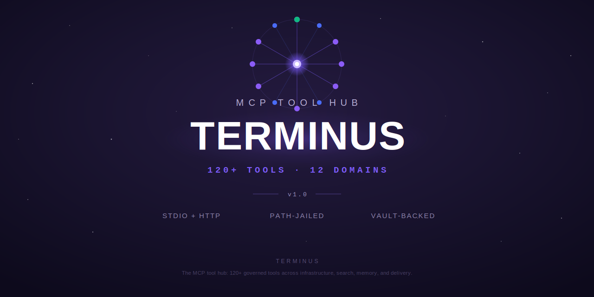

<p align="center"></p>

<p align="center"></p>

# Terminus

A Rust MCP tool hub — one authenticated gateway for agent tooling.

## Overview

Terminus is the Model Context Protocol (MCP) tool hub for the Lumina
constellation: a single Rust registry through which agents reach every external
system — git forges, project trackers, infrastructure, finance, calendars,
secrets, model inference, and more. Rather than each agent embedding its own
clients and credentials, agents speak MCP to one governed surface, and Terminus
dispatches each call to a typed, sandboxed tool implementation.

Originally an in-tree crate of the Lumina constellation, Terminus is now
extracted as a standalone, versioned crate/service (`terminus-rs`) so it can be
built, tested, and deployed on its own.

Every tool implements one small trait (`RustTool`): a stable name, a JSON Schema
for its arguments, a description, and an async `execute`. Implementations use
typed HTTP clients (`reqwest`) and parameterized SQL (`sqlx`) for all external
I/O — never shell-outs — and are registered into a central `ToolRegistry` that
handles dispatch, duplicate detection, and catalog listing.

## Architecture


MCP clients (the Lumina and Harmony agents) connect over stdio or HTTP
transports to the **Terminus core MCP server**. The core is the tool registry:
it handles dispatch, JSON-Schema validation, and governance. Governance is
mandatory and layered — a path-jailed filesystem, vault-only secret access (no
raw environment reads for secrets), a PII gate, and a sanitized audit log. Tools
are read-only by default; write scopes are explicit.

Behind the registry sit the domain tool modules — one authenticated surface for
the whole stack. Each module owns its own typed client and credentials:

- **Infrastructure** — duty/health checks (`dura`), Ansible, <container-mgr>,
  Prometheus.
- **Code & Git** — Gitea, GitHub, dev workspace tools, OpenHands.
- **Search & Memory** — Seer (research) and knowledge-digest queries.
- **Review (local)** — DiffusionGemma (`dgem`) local code review at near-zero
  cost.
- **Models & Inference** — LiteLLM, system-version reporting, and the model
  intake / profiling suite.
- **Calendar & Comms** — Google calendar/email, reminders.
- **Secrets & Network** — <secret-manager> (vault-backed), network diagnostics.
- **Media & Project** — <media-service>, Plane, weather, and others.

Alongside the external-system tools, Terminus carries the **intake / inference
profiling** primitives: a framework that loads a fleet model, runs graduated
context, code, and agent suites against it, and stores a derived operational
profile (safe/absolute context ceilings, throughput curve, recommended
timeouts, degradation point) in Postgres for later comparison.

As of **v1.1** this extends into a **serving-profile** dimension
([`src/intake/serving`](src/intake/serving)): for each (model × serving backend)
it records the chosen launch runtime and its env (gfx override, CPU lib, mmap /
flash-attn flags), measured throughput / VRAM-or-RAM peak / cold-load time, a
`keep_warm` hint for large slow-loading MoEs, and typed `exclusion_reason` /
`recheck_trigger` enums explaining why a faster runtime was skipped and whether
a llama.cpp build bump should prompt a re-probe. The probe layer is trait-driven
(launcher + VRAM-release gate) so the suite runs on CI with no real GPU. This
profile is the contract Chord consumes to place and launch models.

### Tool-selection subagent (context-churn reduction)

A constellation this size carries ~100 tools across its modules. Dumping every
schema into an orchestrator's prompt on every turn is expensive and actively
harmful — more tools means more tokens, slower turns, and more chances for the
model to pick the wrong one. Terminus is built to be narrowed instead of
flooded: the `ToolRegistry` ([`src/registry.rs`](src/registry.rs)) keeps each
tool's name, description, and JSON Schema as a first-class catalog entry rather
than baking them into one giant prompt, so a caller can ask for *only the
relevant few* per request.

The selection itself is a deliberately cheap, model-free keyword matcher (no
extra inference call to decide which tools to expose). Chord — the inference
front door that fronts Terminus — exposes a `discover(query, max)` over the
merged catalog: both the user's query and each tool's `name`+`description` are
tokenized into lowercase words, stopwords are dropped (so `my` no longer matches
**MY**elin and `in` no longer matches everything), matching is whole-word, and a
hit in the tool *name* outscores a hit in the description. Chord's agentic loop
uses exactly this to assemble a small per-turn toolset (~14 discovered tools
plus a handful of always-on essentials) when the caller passes no explicit list.
The payoff is structural: the orchestrator reasons over a handful of relevant
tools per turn instead of the whole hub, which is cheaper, faster, and less
error-prone — and because the scoring is plain tokens, it is deterministic and
debuggable rather than another opaque LLM judgement.

### Governance

Guarded tools (e.g. `openhands_run_task`, <secret-manager> secret access) pass through
a per-occurrence human-approval gate before they execute. On first call the gate
creates a pending request with a short single-use code and refuses to run; an
operator approves out of band, and only then does the stored call re-dispatch
and run exactly once. The model can never approve its own request.

## Tools

Tools are registered by `register_all` in
[`src/registry.rs`](src/registry.rs). The current domain modules and a sample of
their tools:

| Module | Purpose | Example tools |
| --- | --- | --- |
| `approval` | Guarded-tool approval gate (internal) | `approval_grant`, `approval_deny` |
| `intake` | Model profiling / inference primitives | `model_intake`, `model_intake_status`, `model_intake_compare`, `model_intake_fleet` |
| `serving` | Serving-profile inspect / operate (v1.1) | `serving_profile_get`, `serving_residency_status`, `serving_profile_refresh` |
| `dev` | Path-jailed dev workspace | `dev_read_file`, `dev_write_file`, `dev_run_command`, `dev_list_workspaces` |
| `openhands` | Agentic coding runs (guarded) | `openhands_run_task`, `openhands_list_conversations`, `openhands_get_status` |
| `gitea` | Gitea git forge | `gitea_create_repo`, `gitea_read_file`, `gitea_create_pr`, `gitea_merge_pr`, `gitea_cargo_publish`, `gitea_cargo_yank` |
| `github` | GitHub | `github_create_repo`, `github_list_repos`, `github_push_repo`, `github_pii_scan`, `git_public_mirror_status`, `git_public_mirror_prepare`, `git_public_mirror_approve`, `git_public_mirror_push` |
| `plane` | Plane work management | `plane_create_work_item`, `plane_list_issues_by_state`, `plane_update_work_item`, `plane_create_module`, `plane_update_module`, `plane_delete_module`, `plane_add_issue_to_module`, `plane_remove_issue_from_module`, `plane_list_identities`, `plane_whoami`, `plane_prefix_check`, `plane_prefix_register` |
| `nexus` | Inter-agent inbox | `nexus_send`, `nexus_check`, `nexus_read`, `nexus_ack`, `nexus_history` |
| `axon` | Work-queue agent control | `axon_submit`, `axon_status`, `axon_list`, `axon_cancel` |
| `vector` | Dev-loop agent control | `vector_submit`, `vector_status`, `vector_queue_depth`, `vector_halt` |
| `seer` | Research queries | `seer_query`, `seer_recent`, `seer_status` |
| `wizard` | Deep-reasoning council | `wizard_consult`, `wizard_history`, `wizard_status` |
| `dgem` | DiffusionGemma local review | `dgem_review`, `dgem_generate`, `dgem_batch`, `dgem_status` |
| `litellm` | LiteLLM proxy management | `litellm_list_models`, `litellm_model_status`, `litellm_request_log` |
| `sysversion` | System/version reporting | `system_version` |
| `ansible` | Gated Ansible execution | `ansible_run_playbook`, `ansible_list_playbooks`, `ansible_last_run_status` |
| `<container-mgr>` | <container-mgr> containers | `portainer_list_containers`, `portainer_container_logs`, `portainer_status` |
| `prometheus` | Prometheus queries | `prometheus_query`, `prometheus_alerts`, `prometheus_targets` |
| `dura` | Infra/constellation health | `dura_constellation_health`, `dura_service_check`, `dura_smoke_test` |
| `network` | Network diagnostics | `net_ping`, `net_port_check`, `net_dns_lookup`, `net_check_services` |
| `<secret-manager>` | Vault-backed secrets (read-only) | `infisical_get_secret`, `infisical_list_secrets`, `infisical_status` |
| `google` | Calendar & email | `google_calendar_today`, `google_email_send`, `google_email_summary` |
| `reminder` | Reminders | `reminder_set`, `reminder_list`, `reminder_cancel`, `reminder_poll` |
| `commute` | Traffic & transit | `commute_estimate`, `route_traffic`, `transit_plan` |
| `weather` | Weather | weather lookups |
| `news` | News API | `news_headlines`, `news_search`, `news_topic` |
| `<media-service>` | Media requests | `jellyseerr_search`, `jellyseerr_requests`, `jellyseerr_status` |
| `hearth` | Pantry / meal planning | `hearth_what_can_i_make`, `hearth_pantry_list`, `hearth_meal_plan` |
| `ledger` | Personal finance ledger | `ledger_balance`, `ledger_recent`, `ledger_budget_summary` |
| `relay` | Vehicle / maintenance log | `relay_vehicles`, `relay_next_due`, `relay_cost_summary` |
| `myelin` | LLM cost reporting | `myelin_today`, `myelin_monthly`, `myelin_cap_check` |
| `vitals` | Health logging | `vitals_log_weight`, `vitals_log_sleep`, `vitals_summary` |
| `gateway` | Dashboard refresh | `dashboard_refresh` |

See [`src/lib.rs`](src/lib.rs) for the full module list and
[`src/registry.rs`](src/registry.rs) for the registration order.

## Cargo registry publishing (`gitea_cargo_publish`)

Publishing a Rust crate to the Gitea Cargo registry goes **through Terminus**,
not through a `cargo publish` token on a build or dev host. `cargo publish` is,
on the wire, an authenticated HTTP `PUT` of a packaged `.crate` to the registry;
`gitea_cargo_publish` recreates exactly that request and signs it with the
**resolved `GITEA_PAT_<NAME>` identity token** (the active default
`GITEA_IDENTITY_NAME`, or the optional `identity` argument — see
[Gitea identities](#gitea-identities-gitea_pat_name-convention) below), so the
publish credential lives in the runtime secret store and never has to be copied
onto the dev box or spread across containers.

Workflow:

1. On the dev box, package token-lessly: `cargo package -p <crate>` produces
   `target/package/<name>-<version>.crate`. Also assemble the crate's Cargo
   **publish-wire** metadata for the required `metadata` argument — the exact
   object cargo PUTs to a registry (`deps` with `version_req`, `features`, ...),
   **not** `cargo metadata` output (a different schema). The most reliable source
   is the normalized `Cargo.toml` cargo embeds in the `.crate`, mapped to the
   publish schema.
2. Relay that `.crate` to the host running Terminus.
3. Call `gitea_cargo_publish`:

   | Input | Required | Meaning |
   | --- | --- | --- |
   | `crate_path` | yes | Path to the local `.crate` file on the Terminus host. |
   | `name` | yes | Crate name. |
   | `version` | yes | Crate version. |
   | `owner` | no | Registry owner/org (defaults to `GITEA_OWNER`, normally `moosenet`). |
   | `identity` | no | Which `GITEA_PAT_<NAME>` identity to publish as (defaults to the active default `GITEA_IDENTITY_NAME`, normally `moose`). |
   | `metadata` | yes | Cargo **publish-wire** metadata object (the schema cargo PUTs: `deps` with `version_req`, `features`, license, repository, ...) — not `cargo metadata` output. `name`/`vers` are forced to the explicit arguments. Required because a name+version-only publish would write an incorrect registry index for any crate with dependencies. |

   It frames the standard Cargo publish body
   (`u32-LE(len)‖metadata_json‖u32-LE(len)‖crate_bytes`) and `PUT`s it to
   `{GITEA_URL}/api/packages/{owner}/cargo/api/v1/crates/new` with
   `Authorization: token <GITEA_PAT_NAME>` (the same PAT scheme every other Gitea
   call uses). On success it returns the published
   name/version and the registry package URL; a `403` is surfaced explicitly as
   a likely missing `write:package` token scope.

> The publishing identity's `GITEA_PAT_<NAME>` token must carry the
> **`write:package`** scope. Without it the registry returns `403` and the tool
> reports the missing scope.

**Input safety.** `crate_path` is validated before any bytes are read: it must
be an existing **regular** `.crate` file (directories and devices such as
`/dev/zero` are refused) no larger than `CARGO_PUBLISH_MAX_CRATE_BYTES` (default
64 MiB). Set `CARGO_PUBLISH_ARTIFACT_DIR` to confine reads to a dedicated
staging directory — the canonicalized crate path must then live inside it — so
the tool cannot be turned into an arbitrary host-file read.

| Env var | Default | Purpose |
| --- | --- | --- |
| `CARGO_PUBLISH_MAX_CRATE_BYTES` | `67108864` (64 MiB) | Reject artifacts larger than this before reading. |
| `CARGO_PUBLISH_ARTIFACT_DIR` | unset | When set, `crate_path` must resolve inside this directory (path jail). |

## Retiring a broken crate version (`gitea_cargo_yank`)

If a published version turns out to be broken (bad metadata, unresolvable
dependencies, etc.) it must never be deleted outright — Cargo's registry
protocol has a **reversible** primitive for exactly this: **yank**. A yanked
version is refused for any *new* dependency resolution, but a `Cargo.lock`
that already pins it keeps building unchanged, so existing consumers aren't
broken by the retirement.

`gitea_cargo_yank` calls Gitea's Cargo registry web API, signed with the
**resolved `GITEA_PAT_<NAME>` identity token** — the same identity model
`gitea_cargo_publish` uses, so no separate credential path is introduced.

| Input | Required | Meaning |
| --- | --- | --- |
| `crate` | yes | Crate name in the registry. |
| `version` | yes | Version to yank or unyank (e.g. `1.3.0`). |
| `unyank` | no | `true` clears the yank (makes the version resolvable again); default `false` yanks it. |
| `owner` | no | Registry owner/org (defaults to `GITEA_OWNER`, normally `moosenet`). |
| `identity` | no | Which `GITEA_PAT_<NAME>` identity to act as (defaults to the active default `GITEA_IDENTITY_NAME`, normally `moose`). |

It issues `DELETE {GITEA_URL}/api/packages/{owner}/cargo/api/v1/crates/{crate}/{version}/yank`
to yank, or `PUT .../unyank` to clear the yank — both with
`Authorization: token <GITEA_PAT_NAME>`. A `403` is surfaced explicitly as a
likely missing `write:package` token scope; a `404` means the crate/version
doesn't exist in the registry. **Prefer yank over a hard package delete** —
delete is destructive and irreversible, while yank can always be undone with
`unyank: true`.

## PII gate (Rust, authoritative)

PII/secret detection is a single Rust engine in
[`src/github/pii.rs`](src/github/pii.rs). It serves three surfaces from one rule
set, so their coverage can never drift apart:

- **Runtime write gate** — `pii_gate(content)` hard-blocks every GitHub write
  tool before any network request fires. No flag or env var disables it.
- **Tree sweep** — `PiiRuleSet::scan_tree(path)` walks a directory and returns
  structured `TreeViolation { file, line, pattern_kind, context }`. `context` is
  always a redacted snippet — the full matched secret is never stored or logged.
- **`github_pii_scan` tool** — a read-only diagnostic (core registry) that scans
  a `content` string or a `tree_path` and returns the same structured findings.

The rule set combines generic built-in patterns (RFC-1918 ranges, API-key
prefixes, JWTs, PEM keys, cloud keys, emails, phones) with **config-driven**
repo-specific terms — no repo's hostnames or service names are hardcoded in the
engine. Config is an optional repo-root `pii-gate.toml` (or a path in
`TERMINUS_PII_CONFIG`):

```toml
extra_terms        = ["my-internal-host", "my-service"]   # word-boundary, case-insensitive
extra_patterns     = ['''AKIA[A-Z0-9]{16}''']              # raw regexes; invalid ones are skipped
allowed_emails     = ["@example.com"]                       # allow-listed author/placeholder emails
excluded_files     = ["generated.rs"]
excluded_extensions = ["snap"]
excluded_dirs      = ["vendor"]
```

The `// pii-test-fixture` marker is the only exemption: it clears a **single
tagged line** (never a blanket bypass) so deliberate PII-shaped test literals
pass, exactly as the crate's own `no_pii_in_own_source_tree` self-check does.

### Pre-push hook binary

[`src/bin/pii_gate.rs`](src/bin/pii_gate.rs) is the Rust pre-push/pre-commit
hook that replaces the legacy Python `.githooks/pii_gate.py`. It exits `0` when
clean and `1` on any violation (hard block).

```sh
cargo build --release --bin pii_gate

# install as the git pre-push hook (replacing the Python gate)
ln -sf ../../target/release/pii_gate .git/hooks/pre-push

# modes
pii_gate                 # git pre-push: scans the pushed commit range (stdin protocol)
pii_gate --staged        # git pre-commit: scans staged files
pii_gate --tree [PATH]   # full-tree sweep (defaults to repo root) — used by the mirror engine
pii_gate --json          # machine-readable JSON report
```

### git-public mirror engine subtools (GHMR-04, renamed at GITX-08)

The public `moosenet-io/*` mirrors are **PII-swept derivatives** of internal
`main` with their own linear history (they share no ancestor with internal main).
Four `github` **core-tool** subtools drive that engine — now living at
`crate::forge::mirror` (moved and renamed from `crate::github::mirror` /
`github_mirror_*` at GITX-08; behavior is unchanged and the engine has been
provider-agnostic since GITX-05's routing — GitHub remains the only currently
configured mirror target) — over a per-repo *clean work dir*
(`<TERMINUS_MIRROR_WORKDIR_ROOT>/<repo>`). All git operations run **on the
dev box** — the sanctioned git-transport host — while the logic lives in
terminus-rs; no other host holds a GitHub credential.

| Tool | Posture | What it does |
| --- | --- | --- |
| `git_public_mirror_status` | read-only | Reports internal-main HEAD, whether it is already approved, work-dir HEAD, and the set of `mirror-approved/*` tags (divergence + last-approved). |
| `git_public_mirror_prepare` | write (work dir only) | Syncs internal main's committed tree into the work dir, runs the mechanical sweep + PII gate, commits the swept derivative, and tags `mirror-approved/<internal-sha>` **only** when 0 residual violations remain. Residuals are returned for GHMR-05 cleaning; nothing is tagged. |
| `git_public_mirror_approve` | **guarded** | Operator authorisation of a clean snapshot. Refuses (without prompting the operator) while residual violations are pending; on a clean tree it confirms the tag and, after the one-time approval code, blesses the snapshot for push. |
| `git_public_mirror_push` | **guarded**, ff-only | Publishes the approved commit to the repo's GitHub remote — **fast-forward only**. Refuses any non-fast-forward (and an un-bootstrapped remote), pointing at the GHMR-07 bootstrap; **never force-pushes**. |

Common args: `repo` (logical name) and `source` (the dev-box internal-`main`
checkout path). `git_public_mirror_push` also takes `github_remote` (or
`TERMINUS_MIRROR_REMOTE_<REPO>` / `TERMINUS_MIRROR_REMOTE`). The push reads
`GITHUB_TOKEN` (materialised from <secret-manager> into the process env at startup) only
at the moment of transport and injects it via `GIT_ASKPASS` — the token is never
placed in the remote URL or argv, and never logged.

The guarded tools use the same per-occurrence approval gate as `openhands` /
<secret-manager>: the first call returns an `APPROVAL REQUIRED` code, and the operator
authorises the single call out of band. The one-time force re-baseline that
establishes shared lineage with each public mirror is **GHMR-07's**
operator-blessed bootstrap — never performed by these tools.

#### Residual cleaning (GHMR-05)

The mechanical sweep rewrites deterministically-fixable PII (private IPs,
container IDs, config-mapped hosts) to placeholder tokens, but leaves **residual**
violations that need judgment — a raw leaked secret, prose embedding an infra
fact. When `git_public_mirror_prepare` finds residuals it runs an **operationalized,
bounded cleaning pass** rather than just returning them:

1. Dispatch a scoped **cleaning subagent** — a command configured in
   `TERMINUS_MIRROR_CLEAN_CMD`, run once per round with `MIRROR_WORK_DIR` (the
   work dir it may edit) and `MIRROR_RESIDUALS_FILE` (a JSON list of the residual
   `{file, line, pattern_kind, context}` spots) in its environment, cwd set to the
   work dir. It remediates the flagged spots **in the work dir only** — the source
   repo is never handed to it and never touched. The command runs with a **cleared
   environment** (only `PATH`, `HOME`, and the two `MIRROR_*` vars are passed), so
   the external subagent never inherits the parent's service credentials.
2. Re-run the sweep + authoritative gate. If 0 residuals remain, the cleaned tree
   is committed and tagged `mirror-approved/<sha>` (tag-able).
3. Repeat up to **3 rounds** (the infinite-loop guard, which also stops early on a
   round that makes no progress). On exhaustion, the exact `file:line` spots are
   **escalated to the operator** (`cleaning.escalated: true`,
   `cleaning.escalation_spots: [...]`); nothing is committed or tagged.

When `TERMINUS_MIRROR_CLEAN_CMD` is unset, prepare escalates the residual spots
immediately (0 rounds) rather than silently passing residual PII through. The gate
is re-verified after every round, so a cleaner that under-delivers can never
smuggle residual PII into an approved tag.

**Security boundary.** The engine applies in-process defense-in-depth around the
cleaner (redacted inputs only, cleared environment, an in-memory `.git`
snapshot/restore around each round, command-line hook disabling, and running the
cleaner in its own process group which is killed as a unit afterward). These
contain buggy or casually-hostile cleaners but cannot fully contain arbitrary local
code execution — that is a fundamental limit, not a fixable bug. **The configured
cleaning command MUST be run under an OS filesystem/process sandbox** (e.g. `bwrap`
/ `nsjail` / a container with only the work dir bind-mounted, no network, killed as
a unit). That sandbox is the operator's deployment responsibility and the real
trust boundary.

## Plane identities (`PLANE_PAT_<NAME>` convention)

The Plane tool module supports multiple **named identities** so a call can act
as whichever agent should own the resulting work item, rather than always using
one shared token. Identities are configured purely through this process's own
environment — the tool never reads another process's files.

### Configuration

| Variable | Purpose |
| --- | --- |
| `PLANE_API_URL` | Base URL of the Plane instance (required at call time). |
| `PLANE_API_KEY` | The **default** (unsuffixed) token, used when no named identity is selected. |
| `PLANE_WORKSPACE` | Workspace slug. |
| `PLANE_IDENTITY_NAME` | Optional human name for the default `PLANE_API_KEY` token. |
| `PLANE_PAT_<NAME>` | A **named identity**. Each such variable registers the identity `<name>` (lowercased) with its own token — e.g. `PLANE_PAT_CLAUDE`, `PLANE_PAT_HARMONY`. |

Named identities are matched only by the `PLANE_PAT_` prefix; the unsuffixed
`PLANE_API_KEY` default and unrelated `PLANE_*` variables are never scanned as
identities, and a set-but-empty `PLANE_PAT_<NAME>` is treated as absent. These
values are provisioned into the running process by each deployment's own
secret-materialization step (the vault-backed secret store, surfaced as
`INFISICAL_*`-configured fetches at startup) — never hardcoded into a unit file
or committed anywhere.

### Acting as an identity: the `identity` argument

Every Plane **CRUD tool** (`plane_list_projects`, `plane_create_work_item`,
`plane_update_work_item`, `plane_close_work_item`, `plane_create_comment`, …)
accepts an **optional `identity` argument**. Set it to a configured
`PLANE_PAT_<NAME>` name (e.g. `"claude"`, `"harmony"`) and that single call is
authenticated as that identity's token — so the work item is created/updated
under the right actor. Omit it and the call acts as the **active default**
identity.

The active default is resolved once at startup:

- If `PLANE_IDENTITY_NAME` names a configured `PLANE_PAT_<NAME>` identity, the
  default token **is that identity's token** — e.g. `PLANE_IDENTITY_NAME=lumina`
  makes every no-`identity` call genuinely act as `PLANE_PAT_LUMINA`, not just
  display the label.
- Otherwise it falls back to the unsuffixed `PLANE_API_KEY`. A deployment that
  configures only `PLANE_API_KEY` (no named default) behaves exactly as before —
  full backward compatibility.

Selection is centralized: all CRUD tools route through the same
`PlaneClient::resolve_identity` → `for_identity` dispatch, so the rule lives in
one place. The `identity` argument is used only to pick the token — it is never
written into a request body and never logged, and switching identity never
crosses the per-token GET cache.

### Checking a token's health: `plane_whoami` with `verify`

`plane_whoami` reports the active identity and, given `identity`, whether that
name is configured. Pass **`verify: true`** to make a real authenticated read as
the selected identity (explicit `identity`, else the active default) and report
whether its token is currently **valid (200)** or **rejected (401/403 — likely
expired or revoked)**. This is the per-identity health check a future audit uses
to find expired PATs. It reports the auth outcome only — never a token value.

### Listing identities: `plane_list_identities`

`plane_list_identities` returns the names of every configured `PLANE_PAT_<NAME>`
identity (sorted, stable), the active default, and the prefix — **names only,
never token values**, matching `plane_whoami`'s safety posture. Call it to see
which identity you can act as before creating or assigning Plane work. With no
named identities configured it returns an empty list plus an explanatory note
(not an error).

### Which identity to use (assignment convention)

Create or transition a work item under the identity of whoever should **act on**
it, mapped from a spec item's `Agent:` field, rather than always using the
ingesting agent's own identity:

- `PLANE_PAT_CLAUDE` — this agent's own identity; use for all Claude-driven
  create/update/comment work unless explicitly assigning to another actor.
- `PLANE_PAT_HARMONY` — work intended for Harmony's own dispatch to pick up.
- `PLANE_PAT_MOOSE` — operator human-action items.
- `PLANE_PAT_GEMINI` / `PLANE_PAT_CODEX` — work intended for those agent types.
- `PLANE_PAT_LUMINA` — the assistant persona (the default identity).

Select the identity through the tool's own mechanism (`plane_list_identities` /
the client's `for_identity()` resolution) — **never** fetch a `PLANE_PAT_*`
value yourself to make a raw API call; that is a second, unsanctioned access
path. This convention is the same one carried normatively by the moosenet-spec
build pipeline (v3.8, "Plane access — ONE sanctioned path" / "Plane identity
convention"); this section is the Terminus-local, discoverable copy of it, not a
competing source of truth.

## Gitea identities (`GITEA_PAT_<NAME>` convention)

The Gitea tool module is **multi-identity, exactly like Plane** (S105/GPAT). A
call can act as whichever agent should own the resulting commit/PR/publish,
rather than always using one shared token. Identities are configured purely
through this process's own environment — the tool never reads another process's
files.

**BREAKING:** the tool **no longer reads an unsuffixed `GITEA_TOKEN`** — that key
is gone. The effective token is always a `GITEA_PAT_<NAME>` identity token.

### Configuration

| Variable | Purpose |
| --- | --- |
| `GITEA_URL` | Base URL of the Gitea instance (required — the only hard-required Gitea var). |
| `GITEA_OWNER` | Default repo owner/organisation (default `moosenet`). |
| `GITEA_IDENTITY_NAME` | Which named identity is the **active default** when a call passes no `identity` argument. **Default `moose`** — Gitea is the operator's infra git storage. (This differs from Plane, whose default is `lumina`.) |
| `GITEA_PAT_<NAME>` | A **named identity**. Each such variable registers the identity `<name>` (lowercased) with its own token — e.g. `GITEA_PAT_MOOSE`, `GITEA_PAT_HARMONY`, `GITEA_PAT_LUMINA`. |

Named identities are matched only by the `GITEA_PAT_` prefix; a set-but-empty
`GITEA_PAT_<NAME>` is treated as absent. These values are provisioned into the
running process by the deployment's own secret-materialization step (the
vault-backed store, surfaced as `INFISICAL_*`-configured fetches at startup) —
never hardcoded into a unit file or committed anywhere.

### Acting as an identity: the `identity` argument

Every Gitea tool (`gitea_list_repos`, `gitea_create_file`, `gitea_update_file`,
`gitea_create_pr`, `gitea_merge_pr`, `gitea_cargo_publish`, …) accepts an
**optional `identity` argument**. Set it to a configured `GITEA_PAT_<NAME>` name
(e.g. `"moose"`, `"harmony"`, `"lumina"`) and that single call is authenticated
as that identity's token. Omit it and the call acts as the **active default**
identity (`GITEA_IDENTITY_NAME`, default `moose`).

Selection is centralized: all tools route through the same
`GiteaClient::resolve_identity` → `for_identity` dispatch, so the rule lives in
one place. The `identity` argument is used only to pick the token — it is never
written into a request body and never logged.

### Listing identities: `gitea_list_identities`

`gitea_list_identities` returns the names of every configured `GITEA_PAT_<NAME>`
identity (sorted, stable), the active default, and the prefix — **names only,
never token values**. Call it to see which identity you can act as before
performing Gitea work. With no named identities configured it returns an empty
list plus an explanatory note (not an error).

Select the identity through the tool's own mechanism (`gitea_list_identities` /
the client's `for_identity()` resolution) — **never** fetch a `GITEA_PAT_*` value
yourself to make a raw API/git call; that is a second, unsanctioned access path.

## Plane module management

Modules (sprint/epic groupings inside a project) have a full CRUD + membership
surface, all through the single sanctioned Plane tool path:

| Tool | Endpoint | Purpose |
| --- | --- | --- |
| `plane_list_modules` | `GET …/modules/` | List a project's modules |
| `plane_get_module` | `GET …/modules/{id}/` | One module's detail |
| `plane_create_module` | `POST …/modules/` | Create a module |
| `plane_update_module` | `PATCH …/modules/{id}/` | Rename / re-describe / re-status / re-date |
| `plane_delete_module` | `DELETE …/modules/{id}/` | Delete the module (its issues stay in the project) |
| `plane_list_module_issues` | `GET …/modules/{id}/module-issues/` | Issues currently in a module |
| `plane_add_issue_to_module` | `POST …/modules/{id}/module-issues/` | Add one (`issue_id`) or many (`issue_ids`) issues |
| `plane_remove_issue_from_module` | `DELETE …/modules/{id}/module-issues/{issue}/` | Remove an issue from a module (issue kept in project) |

Issue↔module membership is a **separate endpoint** in Plane CE, not an issue
field, so `plane_create_work_item` and `plane_update_work_item` each accept an
optional **`module_id`**: the issue is created/updated first, then linked to the
module via `module-issues` in the same call. On `plane_update_work_item`,
`module_id` may be supplied **alone** (no other field) as a pure "move this issue
into that module" operation — that skips the issue PATCH entirely and only links.

Every one of these tools honors the optional `identity` argument (the same
`PLANE_PAT_<NAME>` dispatch as the rest of the Plane CRUD surface), and
`plane_delete_module` follows the same posture as `plane_delete_work_item` — a
direct destructive call, guarded (if at all) by the registry's guarded-tool layer,
not re-implemented in the tool.

## Plane request pacing & caching (optional shared Redis)

The Plane tool paces its own outbound requests (a shared rate limiter) and caches
GET responses briefly (per active token + URL). By default both live purely
**in-process**. Point them at a Redis instance and they become **shared across
every terminus process** that talks to Plane — one GET cache and one coordinated
rate budget against Plane's API, instead of each process keeping its own copy and
independently hammering the API.

| Variable | Purpose |
| --- | --- |
| `PLANE_RPM` / `PLANE_RATE_SHARE` | Proactive pacing (default 60 RPM / share of 3 = a 3s minimum interval). |
| `PLANE_CACHE_TTL_SECS` | GET response cache TTL (default 5s). |
| `PLANE_REDIS_URL` | Redis endpoint (`redis://host:port/db`). **Unset/empty ⇒ pure in-process cache + limiter** (default; unchanged behavior). |
| `PLANE_REDIS_PASSWORD` | Optional Redis AUTH password, kept out of the URL (materialized from the vault at runtime, never hardcoded). |
| `PLANE_REDIS_TIMEOUT_MS` | Per-op Redis timeout (default 200ms). |

**Robust fail-open.** Every Redis operation is bounded by a short timeout and
guarded by a circuit breaker. On any Redis error, timeout, or outage the call
transparently falls back to the in-process cache/limiter for that operation — a
Redis outage never blocks, never slows (beyond one short timeout), and never
fails a Plane call. When Redis recovers, coordination resumes automatically with
no restart. The in-process cache is always kept warm as the instant fallback.
Cache keys are namespaced and hashed (`plane:cache:<hash>` of active-token + URL),
so no token material lands in Redis keys and one identity never sees another's
cached response. TLS is not required on the internal LAN; a `rediss://` URL door
is documented in `Cargo.toml`.

## Prefix registry (`plane_prefix_*`)

A queryable, maintainable library of the **USED/ACTIVE sub-project + issue
prefixes** — the 2–8 char item-ID prefixes like `SCRB`, `ROUT`, `RMDR`, `LSEC`.
These are the per-spec item prefixes, **not** the per-repo Plane *project*
prefixes (`HARM`/`LUM`/`CHRD`/`TERM`/`RAIL`/`HW`/`PSH`). It gives the
"a prefix must be unique — check the registry" rule real programmatic backing
instead of a stale hand-maintained doc table. It is a **sub-module of the Plane
helper** (`src/plane/prefix.rs`), so its tools register alongside `plane_*` in
both the core Chord registry and the personal registry.

**Hybrid store.**

- **Baseline** — a git-versioned TOML file (`data/prefix_registry.toml`), the
  reviewed source of truth. It is compiled into the binary via `include_str!`,
  so baseline reads always succeed regardless of working directory or Redis
  state.
- **Overlay** — a runtime claim store in the **same shared Plane Redis**
  (`PLANE_REDIS_URL`; see the pacing/caching section above). `plane_prefix_register`
  writes a claim here immediately (fast, cross-instance-visible). Promotion of an
  overlay claim into the baseline TOML happens later via a small reviewed PR (add
  a `[[prefix]]` block, drop the overlay claim).
- **Fail-open** — every overlay op is short-timeout-bounded. If Redis is
  unconfigured or unreachable, reads fall back to the baseline alone, and
  register/retire return a clear "overlay unavailable — use the file/PR path"
  result rather than erroring.

**Tools.**

| Tool | Purpose |
| --- | --- |
| `plane_prefix_list` | List/filter all known prefixes (baseline + overlay). Filters: `status`, `project`, `source` (`baseline`/`overlay`/`pending`), `include_retired`. Reports which claims are overlay-only (pending promotion). |
| `plane_prefix_check` | Is-free check for a candidate prefix + a few next-available suggestions. **Run this before writing a new spec** to satisfy the uniqueness rule. |
| `plane_prefix_register` | Claim a new prefix. Rejects on collision with the baseline **or** overlay; on success writes the claim to the overlay (flagged pending promotion). |
| `plane_prefix_get` | Fetch one prefix's merged metadata (with source flags). |
| `plane_prefix_retire` | Mark a prefix retired via an overlay status override. |

Metadata per prefix: `prefix`, `name`, `project`, `spec_id`, `status`
(`active`/`retired`/`ingested`/`complete`), `description`, `created`.

## Forge provider abstraction (`src/forge/`)

Terminus's git tooling is being reshaped from provider-specific tools (a "Gitea
tool", a "GitHub tool") into two provider-**agnostic** domains that share one
comprehensive endpoint surface and differ only by provider pool and governance
posture:

- **git-private** — self-hosted source-of-truth forges (full operator R/W).
- **git-public** — public/mirror forges (the outbound exfiltration surface,
  where the PII gate is load-bearing on every write).

Both expose the **same** endpoint vocabulary — a forge is a forge. The split is
provider pool + posture, not capability. `src/forge/` is the foundation both
tools sit on (GITX-01); the concrete adapters and the two-tool assembly land in
later items.

### The two domains

| Domain | Replaces | Provider pool | Placement | Posture |
| --- | --- | --- | --- | --- |
| **git-private** | the old `gitea` tool | self-hosted forges (Gitea, Forgejo, GitLab CE, Gogs, OneDev) | **PERSONAL** registry (`terminus_personal`, via `register_personal`) | full operator R/W; source of truth; destructive/history-rewrite ops human-gated |
| **git-public** | the old `github` tool | hosted/public forges (GitHub, Codeberg, GitLab SaaS, Bitbucket, SourceHut, Radicle) | **CORE** registry (Chord-embedded, via `register_all`) | the outbound exfiltration surface — the PII gate is an unconditional hard block on every write |

git-private sits on `terminus_personal` because it is the operator's own
infra-credentialed door to self-hosted source control — the same placement
rationale as the existing Gitea identity model. git-public stays a **CORE**
tool (Chord-embedded, alongside the GHMR mirror engine subtools already listed
above) because publishing to a public host is a shared, governed, PII-gated
operation every agent in the constellation goes through the same way, not a
personal credential a single operator identity holds. This placement is now
load-bearing in merged code: `git_private` (and its `git_private_capabilities`
companion) registers ONLY through `registry::register_personal`
(`forge::register_private`), and `git_public` (with `git_public_capabilities`)
ONLY through `registry::register_all` (`forge::register_public`) — neither tool
crosses into the other registry.

Per the spec's **"one surface, two pools, two postures"** principle: the
endpoint vocabulary a caller can *name* is identical on both tools (see "One
surface" below); what differs is *which providers* answer to a given tool and
*how cautiously* a write on that tool is allowed to proceed.

### Provider manifest

One Gitea-compatible client (`GiteaForge`, GITX-02) serves Gitea, Forgejo, and
Codeberg — they speak the same REST v1 API and differ only by base URL +
credential. One GitLab v4 client (`GitLabAdapter`, GITX-04) similarly serves
both the CE (self-hosted) and SaaS (hosted) variants by config, mapping GitLab's
merge-request/project terminology onto the shared pull-request/repo vocabulary.
All eleven providers below are now merged and wired into
`forge::registry::ForgeRegistry::from_env` — each one activates only when its
credential/URL is present, so the "shipped" rows still register lazily, not
unconditionally.

| Provider id | Pool | Adapter | Status | Notes |
| --- | --- | --- | --- | --- |
| `gitea` | git-private | Gitea-family client (`forge::gitea_family::GiteaForge`) | **shipped** (GITX-02) | current source-of-truth; reuses the existing `GiteaClient` and S105 `GITEA_PAT_<NAME>` identity model wholesale |
| `forgejo` | git-private | Gitea-family client | **shipped** (GITX-02) | single `FORGEJO_TOKEN` credential |
| `gitlab_ce` | git-private | GitLab v4 client (`forge::gitlab::GitLabAdapter`, `from_env_ce`) | **shipped** (GITX-04) | optional; shares the v4 client with `gitlab_saas` |
| `gogs` | git-private | stub (`forge::stubs::StubForge`) | **shipped** (GITX-06 stub) | optional/minimal reduced surface; endpoints report cleanly `unsupported`/`not implemented` |
| `onedev` | git-private | stub (`forge::stubs::StubForge`) | **shipped** (GITX-06 stub) | optional/minimal reduced surface |
| `github` | git-public | `github::adapter::GitHubAdapter` | **shipped** (GITX-03) | current mirror target; REST v3 + a GraphQL v4 helper; egress-isolated |
| `codeberg` | git-public | Gitea-family client | **shipped** (GITX-02) | recommended public target — non-profit/EU/no-AI-training, Forgejo lineage, reuses the Gitea-compatible client; single `CODEBERG_TOKEN` |
| `gitlab_saas` | git-public | GitLab v4 client (`forge::gitlab::GitLabAdapter`, `from_env_saas`) | **shipped** (GITX-04) | shares the v4 client with `gitlab_ce` |
| `bitbucket` | git-public | stub (`forge::stubs::StubForge`) | **shipped** (GITX-06 stub), optional | Cloud REST 2.0 |
| `sourcehut` | git-public | stub (`forge::stubs::StubForge`) | **shipped** (GITX-06 stub), optional | REST+GraphQL; **reduced capability set** — no web-PR flow, no package registry, so its capability map marks `pull_requests_*` and `packages_*` `unsupported` rather than claim a surface it cannot offer |
| `radicle` | git-public | stub (`forge::stubs::StubForge`) | **shipped** (GITX-06 stub), experimental/future | p2p forge; endpoints are `experimental` at best until the adapter matures |

Adapter reuse is deliberate: three providers (`gitea`/`forgejo`/`codeberg`)
share one Gitea-compatible client, and two more (`gitlab_ce`/`gitlab_saas`)
share one GitLab v4 client — a forge's *wire protocol*, not its pool membership,
decides which client implements it.

### Capability introspection — reading the per-provider map

Every adapter's `capabilities()` returns a `CapabilityMap` covering the
*entire* constant vocabulary (see "One surface" above), not just what it
implements — an endpoint absent from the map still reports `unsupported`
rather than silently disappearing. `ForgeProvider::capability_report()` (or
`CapabilityMap::report()` directly) renders it as JSON grouped by
`ForgeDomain` (`repos`, `branches`, `commits`, `pull_requests`, `issues`,
`releases`, `webhooks`, `packages`, `content`, `org`):

```json
{
  "repos": { "repos_list": "supported", "repos_mirror_config": "unsupported" },
  "pull_requests": { "pull_requests_create": "supported" },
  "packages": { "packages_publish": "unsupported" }
}
```

Read it before calling an endpoint on an unfamiliar provider — e.g. before
assuming SourceHut can open a pull request, or that GitHub can configure a pull
mirror. Calling an endpoint the map marks `unsupported` never reaches the
network: `ForgeProvider::dispatch` rejects it locally with a clean
`ForgeError::Unsupported` naming the provider (see "The trait and the
'unsupported' negative path" below). An endpoint marked `supported` or
`experimental` is *attempted*; `experimental` is the honest label for a
reduced-confidence or partial implementation (e.g. an early Radicle
endpoint) — it will be called, but treat its result with the same caution the
label implies.

### Governance postures

The two domains carry deliberately different write postures, matched to what
each pool is *for*:

**git-private — operator source-of-truth.** Full operator read/write against
self-hosted forges; per-provider vault credentials (see "Operator: adding or
activating a provider" below). Destructive operations — repository delete;
branch/ref/tag/release/webhook/package delete; or ANY write whose params carry a
`force`/`force_push`/`rewrite_history`/`history_rewrite: true` flag — require the
caller to pass `confirm: true`. `GitPrivateTool::execute` classifies the call via
`forge::posture::is_destructive_endpoint` + `requests_force_or_rewrite` and, when
destructive-without-confirm, refuses it **before any transport**, naming exactly
what confirmation would unlock. (This is an inline confirm-flag gate, not the
out-of-band single-use-code approver the `openhands`/<secret-manager> guarded tools use;
ordinary non-destructive writes dispatch straight through.)

**git-public — the exfiltration surface.** Every WRITE endpoint (everything
`forge::posture::is_write_endpoint` classifies as not a pure read) runs a fixed
gate chain in `GitPublicTool::execute` **before anything reaches the network** —
a call that fails an earlier check never reaches a later one:

1. **Egress isolation** — the write is refused outright if its params carry any
   host/base-URL override (`api_base`/`base_url`/`host`/`endpoint_override`/
   `url_override`); each adapter's own compiled-in allowlist (e.g. the GitHub
   adapter's `host_allowed`) is the sole routing authority.
2. **Unconditional PII gate** — the same Rust sweep engine documented above
   (`github::pii::pii_gate`) scans the flattened outbound content. A failing
   sweep **withholds** the operation (content stays private; nothing partial is
   sent), logs, and flags. There is no bypass flag, no env-var override, and no
   cadence fast-path — the gate always wins over "we're behind on publishing."
3. **First-publish human gate** — the first write to a given `(provider, repo)`
   pair requires `confirm_first_publish: true`; once granted it is recorded in a
   persisted activation ledger (a token-free JSON file, the `mirror_activated`
   model) and never re-asked for that pair. Independent per repo and per
   provider.

Reads are unrestricted (a public forge's read surface is, by definition, already
public). A completed full-tree `mirror_action: push` also activates that
`(provider, repo)` pair, so a subsequent direct API write on the freshly-mirrored
repo is not re-asked.

### The mirror engine as git-public's swept-write path

The already-shipped GHMR mirror engine (see "git-public mirror engine subtools
(GHMR-04, renamed at GITX-08)" above — `git_public_mirror_status` / `_prepare` /
`_approve` / `_push`, the per-repo clean work-dir derivative, the mechanical sweep + Rust PII gate,
the bounded residual-cleaning pass) is **not rebuilt** for this overhaul. It
becomes git-public's general **provider-agnostic swept-write path**: the
engine's clean work-dir + PII-gate model is how git-public reconciles "the
operator's real source tree usually is not public-clean" with "every
git-public write must be gate-clean" — a mirror always routes an internal
`git-private` source through the sweep before it ever reaches a `git-public`
provider. `GitHub` is the only configured mirror target today
(`.moosenet-pipeline.yaml`'s `mirror_ready` + `github_remote`); the pipeline
config gains a provider/target selector so the same swept-work-dir mechanism
can address Codeberg or another public pool member without re-deriving the
PII engine per provider.

### Operator: adding or activating a provider

A provider only activates if its configuration is present — an unconfigured
provider simply does not register, no error. Activating one is two things:
runtime vault credentials, and (where applicable) a base-URL config var.

**Credential key-name convention.** Every provider follows the same shape
already established by Gitea/GitHub/Plane (S105/S94):

| Credential shape | Meaning | Example |
| --- | --- | --- |
| `<PROVIDER>_PAT_<NAME>` | a named identity's token (multi-identity providers) | `GITEA_PAT_MOOSE`, `GITHUB_PAT_HARMONY` |
| `<PROVIDER>_TOKEN` | a single unsuffixed token (single-credential providers, or the legacy fallback identity) | `FORGEJO_TOKEN`, `CODEBERG_TOKEN` |
| `<PROVIDER>_URL` | the provider's base API URL, where it is not a fixed public host | `GITEA_URL`, `FORGEJO_URL`, `CODEBERG_URL` (optional — defaults to Codeberg's own host) |

None of these are ever literals in source, config, or `.moosenet-pipeline.yaml`.
As actually wired in the merged adapter constructors —
`GiteaForge::{gitea,forgejo,codeberg}_from_env()` (GITX-02),
`GitHubAdapter::from_env()` (GITX-03), `GitLabAdapter::{from_env_ce,from_env_saas}()`
(GITX-04), and the `StubForge::*_from_env()` constructors (GITX-06) — tokens and
URLs are both read via `std::env::var(...)` at adapter-construction time. This
crate's sanctioned vault path is that
[`crate::secrets_bootstrap`](src/secrets_bootstrap.rs) materializes the runtime
secret store into this process's own environment at startup, so that env read
IS the vault read (never another process's files, never a literal). This is
the same posture the pre-existing Gitea/GitHub/Plane identity docs above use.
The GITX-05 assembly did **not** change this: `forge::registry::ForgeRegistry::from_env`
simply calls each of those same `*_from_env` constructors and inserts whichever
succeed — it adds no new credential-resolution path. `CredentialRef`
(`forge::provider::CredentialRef`, see "Credentials" above) remains GITX-01's
key-name-reference *type* for the trait; the concrete adapters do not route
through it end-to-end — they resolve directly via `env::var`. `config.rs` carries
no forge-specific URL helpers; base URLs are read the same way as tokens,
directly via `env::var` in each adapter's constructor.

**Steps to add a new provider to an existing adapter family** (e.g. pointing
the Gitea-family client at a second self-hosted Forgejo instance, or turning
on Codeberg as a mirror target):

1. Provision the credential(s) in the runtime secret store under the
   convention above (an operator/ops action — never hardcoded by an agent).
2. Set the provider's base URL config var if it is not a fixed public host
   (Gitea and Forgejo require this; GitHub, Codeberg, and GitLab SaaS default
   to their public hosts and only need it to point at a self-hosted mirror).
3. If the provider is new to git-public's mirror rotation, add its
   `mirror_ready`/target entry to `.moosenet-pipeline.yaml`'s provider
   selector (see "The mirror engine as git-public's swept-write path" above)
   and complete the one-time, operator-blessed bootstrap force re-baseline for
   that provider before routine pushes can fast-forward.
4. Confirm activation by reading the tool's capability introspection for that
   provider id (see "Capability introspection" above) — a provider that
   registered will report its real support map; one that is still
   unconfigured will not appear at all.

Nothing else changes: the shared endpoint vocabulary, the capability model,
and the governance posture (private vs. public pool) all apply automatically
once a provider is configured — there is no separate "wire up this provider's
posture" step per provider.

**The merged MCP tool + config surface** (what an operator actually calls, as
wired by GITX-05). The two domains are exactly four registered tools:

| Tool name | Purpose |
| --- | --- |
| `git_private` | provider-agnostic R/W dispatch on the self-hosted pool; params `endpoint` + `params`, optional `provider`/`identity`, `confirm: true` for destructive ops |
| `git_private_capabilities` | read-only per-provider capability report for the private pool |
| `git_public` | provider-agnostic dispatch on the public/mirror pool; same params plus `confirm_first_publish: true` and the `mirror_action` (status/prepare/approve/push) route |
| `git_public_capabilities` | read-only per-provider capability report for the public pool |

These replace the per-provider `gitea_*`/`github_*` tool names as the caller's
door to those forges. The one set retained as separate core-tool subtools
(rather than folded into `git_public` itself) is the GHMR mirror engine's own
subtools (`git_public_mirror_status`/`_prepare`/`_approve`/`_push`, renamed
from `github_mirror_*` at GITX-08) — `git_public`'s `mirror_action` delegates
to them rather than reimplementing them. Provider selection within a pool is
behavioral config, never a
secret: an explicit `provider` param wins, else the pool's canonical default
(`gitea` / `github`), overridable via the `GIT_PRIVATE_DEFAULT_PROVIDER` /
`GIT_PUBLIC_DEFAULT_PROVIDER` env vars; when only one provider is configured it
is the implicit default.

### One surface: the endpoint vocabulary

`forge::capability` defines the shared surface as a constant, machine-enumerable
vocabulary (`ForgeEndpoint`, grouped by `ForgeDomain`): repos, branches/refs,
commits, pull/merge requests, issues, releases/tags, webhooks,
packages/registry, content, and org/collaboration. `ForgeEndpoint::all()`
iterates the whole vocabulary. The vocabulary is constant across providers; only
availability varies.

### Availability varies: capability introspection

Each adapter advertises which endpoints it supports via a `CapabilityMap`
(per-endpoint `SupportLevel`: `supported` / `experimental` / `unsupported`; an
absent entry defaults to `unsupported`). `CapabilityMap::report()` /
`ForgeProvider::capability_report()` return the per-adapter support map as JSON,
grouped by domain — the introspection surface both forge tools expose so callers
can see what a given provider can and cannot do.

### The trait and the "unsupported" negative path

Every adapter implements `ForgeProvider` (`forge::provider`). The trait pairs the
vocabulary with a capability-gated `dispatch`: an endpoint the adapter does not
advertise returns a clean `ForgeError::Unsupported` naming the provider
(`"endpoint 'repos_delete' is unsupported by provider 'sourcehut'"`), and an
advertised-but-unwired endpoint returns `ForgeError::NotImplemented` — the
surface **never fabricates** a result for a call it cannot make. Adapters
implement `execute_endpoint` for the endpoints they support and declare them in
`capabilities()`.

### Credentials

`CredentialRef` references a credential by its runtime secret **key name**
(e.g. `GITEA_PAT_<NAME>`, `GITHUB_PAT_<NAME>`) — never the secret value. Adapters
resolve the actual token at call time from the secret store via
`SecretManager` / `vault::manager().get(key_name)`, so no credential literal ever
appears in source, config, or logs.

### GitHub adapter (`github`, git-public pool) — GITX-03

`github::adapter::GitHubAdapter` is the first concrete adapter: the **git-public**
pool's GitHub provider, implementing `ForgeProvider` over the GitHub REST v3 API
(with a `GitHubAdapter::graphql` v4 helper for the endpoints REST cannot express).
It carries the existing `github_*` tool logic into the trait shape; the standalone
`github_list_repos` / `github_create_repo` / `github_push_branch` tools and the
GHMR mirror engine keep working unchanged. This item builds only the adapter — the
git-public MCP *tool* and its PII-gate write posture are assembled later (GITX-05).

- **Capability map.** GitHub advertises nearly the whole vocabulary as
  `supported`. The two honest gaps are left `unsupported` so the map never claims a
  call the adapter cannot make: `repos_mirror_config` (GitHub has no pull-mirror
  configuration REST endpoint) and `packages_publish` (publishing goes through a
  registry wire protocol — npm/Cargo/OCI — not a single REST call).
- **Per-identity credentials.** Tokens resolve, in order: a request's `identity`
  → `GITHUB_PAT_<NAME>`; else the active-default identity (`GITHUB_IDENTITY_NAME`,
  default `moose`) → its `GITHUB_PAT_<NAME>`; else the unsuffixed `GITHUB_TOKEN`
  fallback. This mirrors the Gitea `GITEA_PAT_<NAME>` model (S105). Every resolved
  token is `.trim()`-ed (a trailing newline is a classic silent-`401`) and is never
  logged — the `Debug` impl redacts it. Missing/blank credential → a clean
  `ForgeError::Auth`, never an empty `Authorization` header. `startup` materializes
  `GITHUB_PAT_*` from the secret store alongside `GITEA_PAT_*`/`PLANE_PAT_*` (the
  env read is this crate's sanctioned vault path).
- **Public-pool marker.** `GitHubAdapter::is_public_pool()` returns `true` so the
  GITX-05 tool assembly applies the exfiltration-surface posture (unconditional PII
  gate on writes). The adapter itself does not gate — it advertises the pool.
- **Egress isolation.** Every outbound call passes `GitHubAdapter::host_allowed`
  first: only the configured API base authority plus the `github.com` family
  (extendable via `GITHUB_EGRESS_ALLOWLIST`) may be dialed. Exact-authority
  matching — a non-allowlisted host is refused locally rather than dialed, so the
  adapter cannot be pointed at an arbitrary exfil endpoint.
- **Error mapping.** `401`/`403` → `ForgeError::Auth` (the auth/scope-failure
  surface); other non-2xx → `ForgeError::Transport`; an unsupported endpoint is
  rejected by `dispatch` before any transport.
- **Config.** `GITHUB_API_BASE` (override, test), `GITHUB_ORG` (default owner,
  `moosenet-io`), `GITHUB_IDENTITY_NAME` (default identity), `GITHUB_EGRESS_ALLOWLIST`
  (extra hosts). None are required — capability introspection needs no credential.

### Gitea-family adapter (`forge::gitea_family`, GITX-02)

The first concrete adapter — `GiteaForge` — is **one** Gitea-compatible-REST-API
client that implements `ForgeProvider` and, parameterised by base URL +
credentials, serves **three** providers that all speak the Gitea REST v1 API:

| Provider id | Pool | Config | Credential model |
|---|---|---|---|
| `gitea` | git-private | `GITEA_URL` + `GITEA_PAT_<NAME>` | S105/GPAT multi-identity (default identity `moose`) |
| `forgejo` | git-private | `FORGEJO_URL` + `FORGEJO_TOKEN` | single token |
| `codeberg` | git-public | `CODEBERG_URL` (defaults to Codeberg's host) + `CODEBERG_TOKEN` | single token |

Construct with `GiteaForge::gitea_from_env()` / `forgejo_from_env()` /
`codeberg_from_env()` (only configured providers activate). The three differ
**only** by base URL + credential source — the wire protocol is identical, so a
single dispatch path drives all of them; nothing branches on provider.

- **Reuses the existing Gitea client wholesale.** The `gitea` provider wraps the
  very same `GiteaClient` the concrete `gitea_*` tools use, so the S105
  `GITEA_PAT_<NAME>` identity model, `gitea_cargo_publish`, and the dev-box
  git-relay posture all carry forward unchanged. The existing `gitea_*` tools
  remain registered and behave exactly as before — this adapter is additive
  (the git-private/git-public tool assembly, provider routing, and the
  unconditional PII gate on public writes land later in GITX-05).
- **Full capability set.** Gitea REST v1 covers essentially the entire shared
  vocabulary, so the Gitea-family `CapabilityMap` advertises **every**
  `ForgeEndpoint` as `supported` (Forgejo/Codeberg share the same API and map).
  `capability_report()` returns the complete grouped map.
- **Endpoints.** Repos (list/get/create/update/delete/fork/mirror-config/
  visibility/metadata), branches + generic refs, commits (list/get/compare/
  status), pull requests (list/get/create/update/review/comment/merge/close),
  issues (list/get/create/update/comment/label/assign/close), releases + tags,
  webhooks (incl. test), packages (list/get/publish/delete — publish reuses the
  shared Cargo publish framing), content (read/write file, list tree, raw
  fetch), and org/collaboration — each mapped to its Gitea REST path.
- **Content writes run the content PII gate** (same check as `gitea_create_file`
  / `gitea_update_file`); a `sha` argument routes an update (`PUT`) versus a
  create (`POST`).
- **Token hygiene — the `.trim()` fix.** Every token-loading path trims the
  credential value: `scan_gitea_identities` (for `GITEA_PAT_<NAME>`) and
  `GiteaClient::with_token` (for `FORGEJO_TOKEN` / `CODEBERG_TOKEN`) both
  `.trim()` before storage, so a trailing newline or surrounding whitespace in a
  stored PAT can never corrupt the `Authorization: token <PAT>` header again (a
  whitespace-only value trims to empty and is treated as absent). This closes a
  real failure mode previously hit on `GITEA_PAT_MOOSE`.
- **Honest failure surfaces.** An unreachable instance yields a clean
  `ForgeError::Transport` (not a panic or fabricated result); a missing/invalid
  or under-scoped credential yields `ForgeError::Auth`.

### Tool assembly: `git_private` + `git_public` (GITX-05)

The two MCP tools that make the "one surface, two pools, two postures" model
real. Both dispatch onto `ForgeProvider::dispatch` for the shared
`ForgeEndpoint` vocabulary (`endpoint` + `params`, optional `provider` +
`identity`), so capability introspection ("unsupported by provider X") is
inherited from GITX-01 for free — these tools add only the governance posture
layer. Provider→pool routing lives in `forge::registry::ForgeRegistry`
(`ForgeRegistry::from_env()`): it tries every known adapter constructor and
activates whichever are actually configured — an unconfigured provider is a
clean, silent skip, never a hard failure, so the registry always builds even
with zero credentials. Adding GitLab (GITX-04) or a GITX-06 stub is one
`try_insert` call in `registry.rs`, not a rewrite.

#### `git_private` — self-hosted pool, PERSONAL placement

Registered **only** on the `terminus_personal` registry
(`crate::registry::register_personal` → `forge::register_private`) — this is
the operator's own source-of-truth git access, not a Chord-served
build-pipeline surface. Pool members today: `gitea`, `forgejo` (GitLab CE /
Gogs / OneDev register into the same pool as their adapters land).

Posture: full operator R/W — ordinary reads and writes dispatch straight
through. **Destructive operations** — `repos_delete`, `branches_delete`,
`refs_delete`, `releases_delete`, `tags_delete`, `webhooks_delete`,
`packages_delete`, or **any** write whose `params` carries
`force`/`force_push`/`rewrite_history`/`history_rewrite`: `true` (force-push,
history rewrite) — are refused before any transport unless the call also sets
`confirm: true`. A companion read-only tool, `git_private_capabilities`,
reports each configured provider's per-endpoint support map.

#### `git_public` — hosted/mirror pool, CORE placement

Registered **only** on the CORE registry (`crate::registry::register_all` →
`forge::register_public`) — never on `terminus_personal`. Pool members today:
`codeberg`, `github` (GitLab SaaS / Bitbucket / SourceHut / Radicle register
into the same pool as their adapters land). This is the **exfiltration
surface** — every write is gated, in order, before any network call:

1. **Egress isolation.** A write whose `params` carries `api_base` /
   `base_url` / `host` / `endpoint_override` / `url_override` is refused
   outright — each adapter's own compiled-in host allowlist (e.g.
   `GitHubAdapter::host_allowed`) is the sole routing authority; the tool
   layer refuses even the *attempt* to override it. Reads are unrestricted.
2. **Unconditional PII gate.** Every write's `params` (all string values,
   flattened, keys included) is scanned by the same Rust sweep engine the
   GHMR mirror uses (`github::pii::pii_gate`). A failing scan **withholds**
   the operation — nothing is sent to the provider — and is logged; there is
   no bypass flag and no cadence fast-path, matching the GHMR discipline.
3. **First-publish human gate.** The first write to a given `(provider,
   repo)` pair requires `confirm_first_publish: true`; once granted it is
   recorded in a small on-disk ledger
   (`TERMINUS_GIT_PUBLIC_ACTIVATED_STATE`, default a temp-dir JSON file — no
   secrets, so a plain file, not the vault) and never re-asked for that pair
   (the `mirror_activated` model). Different repos and different providers
   get independent gates.

A companion read-only tool, `git_public_capabilities`, mirrors
`git_private_capabilities` for the public pool.

#### Mirror engine integration — `mirror_action`

For a **full repo mirror sync** (as opposed to a single API write like a PR
comment), `git_public` accepts `mirror_action: "status" | "prepare" |
"approve" | "push"` instead of `endpoint`, forwarding verbatim to the
existing GHMR core tools (`git_public_mirror_status` / `_prepare` / `_approve` /
`_push`, `forge::mirror::tools::dispatch_mirror_action`) — the exact same
`RustTool::execute` those four tools already run, so none of the engine's own
PII-gate / fast-forward-only / no-force transport logic is duplicated. This
*is* "mirror = git-private source → PII-gated git-public push" — git-public's
swept-clean-tree write path. A successful `push` additionally activates that
`(provider, repo)` pair in `git_public`'s first-publish ledger, so a
subsequent direct API write to the newly-mirrored repo is not re-asked.

The mirror engine's transport is **provider-routable**, not hardcoded to
GitHub: `git_public_mirror_push` (and `mirror_action: "push"`) takes an optional
`provider` field (default `"github"`), resolved to a transport credential via
`mirror_provider_token()` — a routing table, not an assumption. GitHub is the
only configured target today (the only resolver wired in that table); adding
a second mirror target is one more match arm there, not a rewrite of the
prepare/push transport.

#### Config summary

| Var | Purpose |
|---|---|
| `GIT_PRIVATE_DEFAULT_PROVIDER` | Default `git_private` pool member when `provider` is omitted (else `gitea`, else the sole configured provider) |
| `GIT_PUBLIC_DEFAULT_PROVIDER` | Default `git_public` pool member when `provider` is omitted (else `github`, else the sole configured provider) |
| `TERMINUS_GIT_PUBLIC_ACTIVATED_STATE` | Path to the first-publish activation ledger (JSON, no secrets); defaults under the temp dir |

No new secret env vars — providers resolve credentials exactly as documented
above (`GITEA_PAT_<NAME>`, `FORGEJO_TOKEN`, `CODEBERG_TOKEN`,
`GITHUB_PAT_<NAME>`/`GITHUB_TOKEN`).

### GitLab adapter (`gitlab_ce` / `gitlab_saas`, v4) — GITX-04

`forge::gitlab::GitLabAdapter` is ONE `ForgeProvider` implementation over the
GitLab v4 REST API, parameterized by [`forge::gitlab::GitLabVariant`] to serve
BOTH provider pool members named in the S106 provider list — not two separate
clients:

- **`gitlab_ce`** — self-hosted GitLab CE/EE, base URL from `GITLAB_URL`
  (`{GITLAB_URL}/api/v4`). **git-private** pool (source-of-truth posture).
- **`gitlab_saas`** — hosted `gitlab.com` (fixed default base). **git-public**
  pool (the exfiltration surface; GITX-05 makes the PII gate load-bearing on its
  writes — this adapter only advertises the pool via `is_public_pool()`).

Build either with `GitLabAdapter::from_env_ce()` / `GitLabAdapter::from_env_saas()`
(or `GitLabAdapter::from_env(variant)` directly); both share identical HTTP
logic, pagination, credential resolution, and capability map — only
id/display-name/pool/default-base differ.

- **Terminology mapping to the shared surface.** GitLab has no "pull request" —
  its **Merge Request (MR) is the shared surface's PR**; every `PullRequests*`
  endpoint dispatches to GitLab's `merge_requests` API, and request params use
  the shared `number` key even though GitLab's own API calls this an `iid`
  (project-scoped, distinct from the global numeric `id`). GitLab's **project is
  the shared surface's repo**; a project is addressed by GitLab's `:id` path
  segment, which this adapter always builds as a URL-encoded
  `namespace/project` path (`{owner}%2F{repo}`, via `GitLabAdapter::project_ref`)
  rather than requiring a numeric-ID lookup. Further shared-surface adaptations,
  so a caller need not special-case GitLab: MR/issue list `state` maps
  `open`→`opened`; `pull_requests_review` maps `event` `APPROVE`→approve and
  `REQUEST_CHANGES`/`DISMISS`→unapprove (any other event is a clean
  `InvalidRequest`, never a fabricated approval); `labels` accept an array or a
  comma-string; **assignees** accept either GitLab-native `assignee_ids`
  (numeric, verbatim) or GitHub-style `assignees` usernames (resolved via
  `GET /users?username=`); `org_permissions` accepts either `user_id` or a
  `username` (resolved likewise); `repos_create` resolves `owner`→`namespace_id`
  (so the project lands in the intended group, not the caller's personal
  namespace) and maps `auto_init`→`initialize_with_readme`; `repos_list` tries
  the group projects path and falls back to the user projects path; webhook
  bodies accept GitHub's nested `config.url`+`events[]` shape and are translated
  to GitLab's flat `url`+per-event-boolean form (a GitLab-native flat body
  passes through verbatim; GitHub's `active` is deliberately NOT mapped — GitLab
  has no equivalent, and mapping it onto `enable_ssl_verification` would be a TLS
  security regression); MR/issue `updates` bodies remap `body`→`description` and
  `state`→`state_event` so a GitHub-shaped update is not silently ignored;
  `content_write_file` infers POST (create) vs PUT (update) from the
  absence/presence of `sha`/`last_commit_id` (an explicit `create` bool
  overrides).
- **Capability map — honest gaps AND an honest advantage over GitHub.** Left
  `unsupported`: `refs_list`/`refs_get`/`refs_create`/`refs_delete` (GitLab v4 has
  no generic ref-namespace API like GitHub's `git/refs` — only the concrete
  `branches` and `tags` namespaces, both covered by their own endpoints) and
  `org_teams` (GitLab has no GitHub-style "team" resource; its subgroup concept
  is structurally different enough that claiming this endpoint would misrepresent
  the API). Marked `supported` where GitHub's adapter honestly could not:
  `repos_mirror_config` (GitLab project `import_url`/`mirror` settings are a real
  REST-settable pull-mirror config) and `packages_publish` (GitLab's generic
  packages registry is a direct REST `PUT` upload, not a separate wire protocol).
- **Per-identity credentials.** Tokens resolve, in order: a request's `identity`
  → `GITLAB_PAT_<NAME>`; else the active-default identity (`GITLAB_IDENTITY_NAME`,
  default `moose`) → its `GITLAB_PAT_<NAME>`; else the unsuffixed `GITLAB_TOKEN`
  fallback. The `GITLAB_PAT_<NAME>` identity namespace is shared across both
  variants — deployments needing distinct CE/SaaS credentials for the same name
  should provision distinct identities. Mirrors the Gitea (S105) / GitHub
  (GITX-03) model: every resolved token is `.trim()`-ed and never logged (the
  `Debug` impl redacts it). `startup` materializes `GITLAB_PAT_*` (and the fixed
  `GITLAB_URL`/`GITLAB_TOKEN` keys) from the secret store via
  `secrets_bootstrap::PAT_KEY_PREFIXES`.
- **Public-pool marker.** `GitLabAdapter::is_public_pool()` returns `true` for
  `gitlab_saas`, `false` for `gitlab_ce` — GITX-05's tool assembly applies the
  exfiltration-surface posture only to the former.
- **Egress isolation.** Every outbound call passes `GitLabAdapter::host_allowed`
  first: the configured API base authority (default ports normalized), plus (for
  `gitlab_saas` only) the `gitlab.com` family, extendable via
  `GITLAB_EGRESS_ALLOWLIST`. A self-hosted `gitlab_ce` adapter does NOT
  implicitly trust `gitlab.com`, and construction **fails closed** if a CE
  adapter has no `GITLAB_URL`/`GITLAB_API_BASE` (never silently defaulting a
  self-hosted credential to the public API). Redirects are **same-origin only**
  (the `PRIVATE-TOKEN` credential is a custom header `reqwest` does not strip
  cross-origin, so even an allowlisted different host is refused), bounded to
  `MAX_REDIRECT_HOPS`, and never followed across an `https`→`http` downgrade.
- **Pagination + binary-safe raw fetch.** List endpoints follow GitLab's
  `Link: rel="next"` header (the same RFC 5988 shape GitHub emits), bounded by a
  `MAX_PAGES` runaway guard. Each server-supplied `next` URL is pinned to the
  INITIAL request's origin (a hostile forge cannot redirect pagination — and the
  `PRIVATE-TOKEN` — to a different allowlisted host), and hitting `MAX_PAGES`
  with a further page still pending is a hard error rather than a silently
  truncated success. `content_raw_fetch` returns UTF-8 content as
  `{ path, encoding: "utf-8", raw }` and non-UTF-8 (binary) content losslessly as
  `{ path, encoding: "base64", raw_base64 }`.
- **Error mapping.** `401`/`403` → `ForgeError::Auth`; other non-2xx →
  `ForgeError::Transport`; an unsupported endpoint is rejected by `dispatch`
  before any transport.
- **Config.** `GITLAB_URL` (CE instance base), `GITLAB_API_BASE` (direct
  override for either variant, test), `GITLAB_GROUP` (default namespace,
  `moosenet`), `GITLAB_IDENTITY_NAME` (default identity), `GITLAB_EGRESS_ALLOWLIST`
  (extra hosts). None are required — capability introspection needs no credential.

### Optional/experimental provider stubs (`forge::stubs`, GITX-06)

Five providers named in the S106 provider list are **stubs**, not full
adapters: structure + an honest, provider-specific `CapabilityMap` so the
git-private/git-public tools KNOW these providers exist and can report their
real (often reduced) surfaces via capability introspection — never a
fabricated call or a claimed capability the provider doesn't have. No stub
overrides `execute_endpoint`, so every dispatched endpoint honestly falls
through to `ForgeError::NotImplemented` (declared-but-unwired) or
`ForgeError::Unsupported` (not declared at all) — the same two clean negative
paths every other adapter uses.

| Provider id | Pool | Credential | Capability posture |
|---|---|---|---|
| `bitbucket` | git-public | `BITBUCKET_TOKEN` | Broad REST 2.0 surface, but no GitHub-style Releases object, no generic package registry, no repo mirror-config endpoint (Data Center-only), and no webhook test-delivery call — all `unsupported`; PR approve/request-changes exists but isn't a full per-line review workflow, so `pull_requests_review` is `experimental`. |
| `sourcehut` | git-public | `SOURCEHUT_TOKEN` | **Reduced by design**: sr.ht is a patch-email workflow — no web pull-request surface, no package registry, and no org/group-membership listing (`pull_requests_*`/`packages_*`/`org_members` `unsupported`); refs/tags are mutated only via `git push`, so their `*_create`/`*_delete` are `unsupported` too (list/get stay `supported`); its per-service webhook model is advertised `experimental`. |
| `gogs` | git-private | `GOGS_TOKEN` | Minimal Gitea-lineage fork — no branch-protection API, no package registry, no webhook test-delivery endpoint, and no pull requests API (`unsupported`). |
| `onedev` | git-private | `ONEDEV_TOKEN` | Modern self-hosted forge, near-full vocabulary `supported`; generic package publish (Maven/npm/Docker differ per-protocol) is `experimental`. |
| `radicle` | git-public-ish/experimental | `RADICLE_TOKEN` | **Peer-to-peer, experimental.** Writes happen over the `rad`/git protocol, not REST, and there's no central org/membership concept. Only the read-only `radicle-httpd` surface (repos/branches/refs/commits, read-only patches/issues, content read) is advertised `experimental`; everything else — all writes, releases, webhooks, packages, org — is `unsupported`. |

Construct with `StubForge::bitbucket_from_env()` / `sourcehut_from_env()` /
`gogs_from_env()` / `onedev_from_env()` / `radicle_from_env()` — each checks
that its one credential key is present in the runtime secret store (never
reads the value itself; a stub has no wired transport yet) and fails with a
clean `ToolError::NotConfigured` if it's missing or blank. None of these
tokens are added to `secrets_bootstrap::PAT_KEY_PREFIXES` — that multi-identity
scan is reserved for providers that actually need it.

## Embedded CA (`crate::pki`) — zero-standup PKI (TCLI-01)

Terminus is being repositioned as the single mTLS front door for MCP tool
traffic (Gateway P2). The first building block is a self-contained
certificate authority: `src/pki/` uses `rcgen` to generate a private root CA
on first run, and load it (never regenerate) on every run after that — no
manual `step-ca`/OpenSSL standup required.

**Load-or-generate precedence**, checked in this order by `pki::ca()`:

1. `TERMINUS_CA_CERT` + `TERMINUS_CA_KEY` in the process environment — the
   same "runtime secret store materialized into env at startup" pattern this
   crate already uses for Gitea/Plane/GitHub tokens (see
   `secrets_bootstrap`). If an operator provisions these directly, they take
   precedence over anything else.
2. A local store file at `ca_store_path()` (config helper; from
   `TERMINUS_CA_STORE_PATH`, default `~/.terminus/pki/ca_store.json`) —
   written with `0600` permissions, never world-readable. This is the
   fallback tier used when no centralized secret-store material is
   provisioned yet, since this crate has no write path back to the secret
   store (by design).
3. Neither present (true first run): generate a brand-new CA and persist it
   to the local store file for next time.

Corrupt/unparseable material at either tier 1 or tier 2 is a **hard startup
error**, never a silent regeneration — a silent regen would invalidate every
certificate this CA has already issued to enrolled clients. CA key material
is never logged, printed, or written anywhere outside the tier-2 store file;
`pki::CertificateAuthority` has a hand-written `Debug` impl that only prints
`<redacted>` placeholders.

`pki::ca()` is the single accessor — the enrollment endpoint (TCLI-02) and
the mTLS listener (TCLI-03) call it rather than constructing or loading CA
material themselves. Known limitation (P2, not yet solved): two terminus
processes bootstrapping concurrently against the same local store can race;
documented, not handled, given P2's single-primary topology.

## Client-cert enrollment (`crate::pki::enroll`) — TCLI-02

Given the TCLI-01 embedded CA, `src/pki/enroll.rs` adds a new, purely
additive HTTP endpoint that issues short-lived client credentials to a
first-time (or re-enrolling) identity. **This endpoint is separate from, and
does not change the behavior of,** the existing `/mcp` JSON-RPC route or its
bearer-token auth (`crate::mcp_server`) — `build_enroll_router()` returns its
own standalone `axum::Router`, merged alongside `crate::mcp_server`'s router
by whichever binary wants it (see `src/bin/terminus_personal.rs`'s `main()`).

**Protocol** — `POST` to the path from `config::enrollment_path()` (default
`/enroll`):

```json
// request
{ "identity": "dev-box-claude-code", "shared_secret": "..." }

// response (200)
{
  "cert_pem": "-----BEGIN CERTIFICATE-----...",
  "key_pem": "<REDACTED-SECRET>...",
  "ca_cert_pem": "-----BEGIN CERTIFICATE-----...",
  "jwt": "eyJ...",
  "expires_at": 1700000000
}
```

- `identity` must match a DNS-label-like naming pattern (lowercase
  alphanumerics + hyphens, 2-63 chars, no leading/trailing hyphen) — this
  keeps the identity namespace bounded and safe to embed directly in the
  cert's CN/SAN, per the TCLI-02 edge cases.
- `shared_secret` is compared, in constant time (never a plain `==` on secret
  bytes), against a **per-identity** secret keyed by the *requested*
  identity — `TERMINUS_ENROLLMENT_SHARED_SECRET_<IDENTITY_UPPERCASE>` (e.g.
  `TERMINUS_ENROLLMENT_SHARED_SECRET_LUMINA`,
  `TERMINUS_ENROLLMENT_SHARED_SECRET_HARMONY`,
  `TERMINUS_ENROLLMENT_SHARED_SECRET_CLAUDE`,
  `TERMINUS_ENROLLMENT_SHARED_SECRET_MOOSE`; hyphens in the identity map to
  underscores). This is the structural mechanism (LHEG-01, S109) that makes
  it impossible for a caller holding only e.g. the `_LUMINA` secret to
  enroll as `moose` or any other identity — the value it's compared against
  is always derived from the identity it's requesting, not something the
  caller can choose.
  **Non-breaking fallback:** if no per-identity secret is configured for the
  requested identity, enrollment falls back to the legacy unsuffixed
  `TERMINUS_ENROLLMENT_SHARED_SECRET` (logging a deprecation warning each
  time). The unsuffixed secret is not removed by this item — provision
  per-identity secrets going forward and treat the fallback as transitional.
  Both are read via the env-materialized runtime secret store.
- On success: a fresh keypair is generated, signed into a leaf cert by the
  TCLI-01 CA (`ca.issuer()`), with `identity` embedded as CN + DNS SAN. TTL
  is short — `config::enrollment_cert_ttl_hours()` (default 24h), nowhere
  close to the CA's multi-year validity. A paired JWT
  (`config::enrollment_jwt_ttl_seconds()`, default 1800s / 30 min) carries
  the same identity as its `sub` claim, HS256-signed with
  `TERMINUS_JWT_SIGNING_KEY` — the one JWT signing key this crate now uses
  (no other JWT library exists in this repo; later Gateway-P2 items reuse
  this one rather than adding a second).
- Re-enrolling an already-enrolled identity is NOT an error — it simply
  issues a fresh cert/JWT pair, since short-lived certs are expected to be
  refreshed periodically.
- Rejections: `401` (wrong/missing shared secret), `400` (identity name
  fails the naming pattern), `503` (enrollment not configured — neither the
  requested identity's per-identity secret nor the legacy unsuffixed
  fallback is set on this instance).

**Bootstrap chicken-and-egg:** at enrollment time the caller has no client
cert yet — that's the point of this endpoint — so its own transport is plain
TLS at minimum for P2; it cannot require the client cert it's about to issue.
Deploy it behind the same TLS termination as the rest of the binary. Full
mTLS-only transport for everything else is TCLI-03's job.

**Audit logging (S6):** enrollment log lines carry only the identity name and
the issued cert's serial — never the shared secret, the private key, or the
JWT.

## mTLS transport (`crate::pki::mtls`) — TCLI-03

Given the TCLI-01 embedded CA and TCLI-02 client-cert enrollment, `src/pki/mtls.rs`
adds a **second, additive listener** that speaks mutually-authenticated TLS. It is a
strictly separate listener from the plain HTTP+JWT `/mcp`/`/enroll` one — **the existing
plain listener's bind/router/serve is unchanged**, and if the mTLS listener fails to
bootstrap (CA/server-cert/TLS-config error) that failure is logged and the plain listener
keeps serving normally. The mTLS listener serves a *clone of the same* `axum::Router`, so
tool-dispatch allowlist/audit code is reused, never forked into an mTLS-only path.

**Listener config (non-secret knobs only; PKI material comes from the CA, not env):**

| Env var | Default | Meaning |
|---|---|---|
| `TERMINUS_MTLS_BIND` | `127.0.0.1` | mTLS listener bind address |
| `TERMINUS_MTLS_PORT` | `8301` | mTLS listener port — deliberately never `TERMINUS_PERSONAL_PORT`'s `8300` |
| `TERMINUS_MTLS_SERVER_IDENTITY` | `terminus-primary` | CN/SAN on the primary's own server cert (operator label only; not client authz input) |
| `TERMINUS_MTLS_SERVER_CERT_TTL_DAYS` | `365` | Validity window for the primary's server cert (longer-lived than a client leaf; the server key never leaves the host) |

**How a client authenticates:**

1. Enroll once via the TCLI-02 `/enroll` endpoint (shared-secret gated) to obtain a
   short-lived client cert + key chained to the TCLI-01 CA. As of TCLI-03 the issued leaf
   carries the `clientAuth` extended key usage + a `DigitalSignature` key usage.
2. Dial `TERMINUS_MTLS_PORT` presenting that client cert. The handshake requires it: the
   server presents its own CA-signed leaf and its `WebPkiClientVerifier` validates the
   client cert chains to the same CA (and is within its validity window) during the
   handshake itself.
3. On success the server extracts the identity from the client cert's Subject CN — the
   same value embedded at enrollment — and attaches it to each request's extensions as a
   `ClientIdentity`, consumed by existing authz/audit exactly as a JWT `sub` would be.

**Fail-closed validation, two independent layers.** (1) `rustls`'s `WebPkiClientVerifier`
rejects a missing cert, a cert not chaining to the CA, or one outside its validity window
during the handshake — such a connection never reaches application code. (2) A second,
independently-tested post-handshake check re-verifies the validity window and additionally
enforces the `clientAuth` EKU (which `WebPkiClientVerifier` does not check by default),
rejecting the connection before any request is dispatched. Rejections log only a sanitized
"identity unknown/rejected" line plus the peer address — never raw certificate or key
material (S6).

**Known limitations (P2):**

- **No CA rotation.** Single embedded CA with no rotation plan; a compromise/rotation is an
  out-of-scope follow-up item, not silently unhandled.
- **A connection outliving its client cert's TTL is not force-closed mid-connection.** The
  chain/validity check is at CONNECT time; a long-held connection whose short-lived cert
  expires in-flight finishes its current requests rather than being severed — consistent
  with HTTP keep-alive not re-validating per request, and low-risk given the short-lived,
  connect-per-tool-call usage pattern. Flagged for the reviewer; a future item could add
  periodic re-handshake if usage changes.

## `terminus-primary` — the <host> gateway binary (TGW-01, S108)

`src/bin/terminus_primary.rs` is a **new, third** Terminus binary (alongside `terminus_personal`
and the embedded Chord-side fallback registry): the <host>-deployed gateway that serves the
**core** tool set (`registry::register_all` — git-public, plane, gitea, github, and every other
core module) over the same mTLS/`enroll` front door TCLI-01..03 built for `terminus_personal`.

**How it differs from `terminus_personal`:**

| | `terminus_personal` | `terminus_primary` |
|---|---|---|
| Tool set | `register_personal` (personal/admin subset: ledger, vitals, crucible, relay, meridian, odyssey, gateway, cortex, soma, skills, council, network, ansible, dev, plane, git-private, gitea, github, sundry) | `register_all` (the full core set: every build-pipeline/tool module) |
| Deployment target | <host> | <host>, co-located with `chord.service` |
| Plain listener config | `TERMINUS_PERSONAL_BIND`/`TERMINUS_PERSONAL_PORT`/`TERMINUS_PERSONAL_TOKEN` | `TERMINUS_PRIMARY_BIND`/`TERMINUS_PRIMARY_PORT`/`TERMINUS_PRIMARY_TOKEN` (default port `8310`, vs. `terminus_personal`'s `8300`) |
| mTLS listener config | `TERMINUS_MTLS_BIND`/`TERMINUS_MTLS_PORT`/`TERMINUS_MTLS_SERVER_IDENTITY` | `TERMINUS_PRIMARY_MTLS_BIND`/`TERMINUS_PRIMARY_MTLS_PORT`/`TERMINUS_PRIMARY_MTLS_SERVER_IDENTITY` (default port `8311`, vs. `terminus_personal`'s `8301`) |
| CA material | Whatever <host>'s environment/local store provisions | Independently auto-generated/provisioned on <host> — same `crate::pki::ca()` load-or-generate precedence, just a separate host's own environment/local store, so the two processes get independent CAs with no special-casing in code |
| Startup <secret-manager> fetch | Yes (`fetch_downstream_secrets_from_infisical`, PSEC-02) | Not in this item — <host> deployment (TGW-05) provisions its environment directly; can be added later without touching the shared setup below |

Personal-tool federation (TGW-02) and the inference proxy to Chord (TGW-03) are wired — see the
next two sections. The per-user identity → allowlist → rate-limit → audit pipeline (TGW-04) that
gates every route below is documented in its own section further down.

**Why no combined core+personal registry:** `register_all` and `register_personal` both
register the `plane`/`gitea`/`github`/`sundry` tool modules under the SAME tool names — a real,
pre-existing collision (see `crate::registry::core_personal_name_collisions` and its test in
`src/registry.rs`). Each module's own `register()` handles a duplicate name by logging a
`tracing::warn!` and silently dropping the losing tool — not a loud failure. Rather than build a
combined registry that would immediately hit this collision, `terminus-primary` registers
`register_all` only; personal-tool reachability is delivered via federation (TGW-02, below), not
local aggregation.

### Personal-tool federation via Chord's relay (TGW-02, `crate::federation`)

`terminus-primary` serves the **core** tool set locally (`register_all`), but a client hitting
its mTLS front door sees an **aggregated** surface: core tools plus the personal-registry tools
(`ledger_*`, `vitals_*`, `crucible_*`, `git_private`, and the rest of the `register_personal`
subset). Personal-tool *calls* are not dispatched locally (they'd collide with core and lack the
<host> backend) — they are **proxied to Chord's existing `/v1/personal/tools/*` relay** (per the
S108 spec's RESOLVED design decision (2): reuse the known-working federation Chord already runs
to <host>'s `terminus_personal`, rather than a new direct <host>→<host> path).

**Routing** (in `crate::mcp_server`'s `tools/call` handler): a tool name found in the local core
registry dispatches in-process exactly as before (unchanged). A name *not* in the core registry
is forwarded via `crate::federation::PersonalFederationClient` to
`{TERMINUS_PRIMARY_CHORD_URL}/v1/personal/tools/call`; if federation is not configured (the
`terminus_personal` posture), an unknown name is just "Unknown tool" as before.

**`tools/list`** aggregates: the local core catalog plus
`crate::registry::personal_only_tool_metadata()` (personal tools that are *not* also in
`register_all`, computed in-process from static metadata — no network round trip on a listing;
plane/gitea/github/sundry, present in both registries, are listed once via the core catalog to
avoid duplicates).

**Auth to Chord's relay:** Chord's `/v1/personal/tools/*` routes gate on the same HS256 JWT scheme
as its `/v1/tools/*` routes (`sub` pinned to `"lumina"`, secret = Chord's `CHORD_JWT_SECRET`).
`terminus-primary` mints a short-lived (120s) service JWT of exactly that shape, signed with
`TERMINUS_PRIMARY_CHORD_JWT_SECRET` — provisioned identically to Chord's `CHORD_JWT_SECRET` at
deploy time (never a literal; the standard "materialized into the process env, plain env read is
the SecretManager read" convention this crate uses for all secret material).

**Identity forwarding + audit:** the caller's mTLS-derived identity
(`crate::pki::mtls::ClientIdentity`, extracted from the client cert that reached the front door)
is forwarded to Chord as the `X-Terminus-Client-Identity` header alongside the service JWT —
additive audit metadata, not a second auth mechanism (Chord's JWT check is what gates the call).

**Error classification** (transport vs. tool-level, mirroring Chord's `proxy_error_response`):
a `404`/`502` from Chord means the relay reached <host> and the tool wasn't found / ran and failed
— surfaced as a normal `isError: true` tool result. A `401`/`429`/`503`/`504` or an unreachable
Chord is a *federation-transport* failure — surfaced as `isError: true` with a `federation error:`
prefix, never a hang or panic. See `crate::federation`'s module doc for the full contract.

**Config vars:** `TERMINUS_PRIMARY_CHORD_URL` (Chord's relay base URL; default
`http://127.0.0.1:8099`, Chord's loopback proxy port for a co-located <host> deploy),
`TERMINUS_PRIMARY_CHORD_FEDERATION_TIMEOUT_MS` (per-call timeout, default 30000ms), and
`TERMINUS_PRIMARY_CHORD_JWT_SECRET` (the shared HS256 secret, = Chord's `CHORD_JWT_SECRET`).

### Inference proxy to Chord (TGW-03, `crate::inference_proxy`)

`terminus-primary`'s mTLS front door also forwards **inference** requests straight through to the
co-located Chord process — Chord remains the actual inference engine (model loading, GPU/VRAM
management, LiteLLM routing, all unchanged); this is a THIN proxy hop, no inference logic lives
in terminus-rs.

**Proxied routes** (all four Chord client-facing inference/agent routes named in the TGW-03 spec
item, confirmed on Chord's own router in `moosenet/Chord`'s `src/routes.rs`, all gated by the
identical `auth_check`/`CHORD_JWT_SECRET` scheme):

| Route | Chord's role |
|---|---|
| `POST /v1/chat/completions` | OpenAI-compatible LLM proxy (supports `stream: true`) |
| `POST /v1/infer` | single-prompt, backend-aware inference |
| `POST /v1/agent/execute` | guarded agentic tool-calling loop (also streams via SSE) |
| `POST /v1/coding/select` | fleet-driven coding-model resolution |

**Streaming** is preserved end to end: Chord's own handlers already relay their upstream response
as an unbuffered byte stream (`bytes_stream()` → `Body::from_stream`); `crate::inference_proxy`
does the identical thing one hop earlier — the `reqwest` response body from Chord streams straight
into the `axum::Response` returned to the mTLS caller, chunk by chunk, never buffered into one
`Vec<u8>`. Status code and `content-type` are relayed verbatim.

**Auth:** reuses `crate::federation::mint_service_jwt` — the SAME short-lived service JWT TGW-02's
personal-tool federation already mints (`sub: "lumina"`, signed with
`TERMINUS_PRIMARY_CHORD_JWT_SECRET`), since Chord gates every one of these routes on the identical
`auth_check` call its `/v1/personal/tools/*` routes use. No new secret is introduced.

**Identity forwarding:** the caller's mTLS-derived identity is forwarded under the same
`X-Terminus-Client-Identity` header TGW-02 uses, so Chord's audit/logging sees one consistent
identity convention regardless of which relay carried the request.

**Transport target:** reuses `TERMINUS_PRIMARY_CHORD_URL` (TGW-02's federation base URL) rather
than a second, always-identical inference-URL knob — Chord mounts both the personal-tool relay and
these inference routes on the same router. `TERMINUS_PRIMARY_CHORD_INFERENCE_CONNECT_TIMEOUT_MS`
(default 5000ms) bounds only the initial connect to Chord — deliberately **not** a total-response
timeout, so a long or actively-streaming generation is never cut off mid-flight.

**Errors:** a connect failure/timeout to Chord (down, unreachable) surfaces as a clean
`502 Bad Gateway` JSON error — never a hang, never a silent fallback to any other inference path.
Once connected, whatever status Chord itself returns (its own 401/503/etc.) is relayed verbatim —
this proxy does not reinterpret Chord's error semantics. If this terminus process has no
`inference_proxy` configured at all (e.g. `terminus_personal`, which has no inference-proxy role),
the four routes still exist but return a clean `503` rather than a bare `404` or a hang.

**Known gap:** Chord restarting mid-request (a real operational scenario — the whole reason Chord
is kept a separate process) surfaces to the caller as a truncated/interrupted stream or a
transport error partway through, not a clean retry — no in-flight-request recovery is built here;
a caller-side retry is the expected mitigation, same as any other proxy hop.

### Uniform gateway pipeline: identity → allowlist → rate-limit → audit (TGW-04, `crate::gateway_framework`)

Every request `terminus-primary` serves — tool calls (core, dispatched locally, and
personal-registry calls federated via TGW-02) **and** the four inference-proxy routes (TGW-03) —
now passes through one shared pipeline before dispatch runs:

```
mTLS identity (ClientIdentity extension)
  → per-identity allowlist check
  → interim in-process rate-limit check
  → [caller's own dispatch: local tool call / federation / inference forward]
  → S6-sanitized audit log entry
```

`terminus_personal` is unaffected — it predates this item and is not this spec's deployment
target, so its `McpServerState.gateway`/`GatewayServerConfig.gateway` stay `None`, preserving its
exact pre-TGW-04 (ungated) behavior.

**Identity.** Sourced *only* from the mTLS-verified `ClientIdentity` request extension
`crate::pki::mtls::run_listener` attaches post-handshake (see TCLI-03) — never a client-supplied
header/field. A request with no `ClientIdentity` at all (e.g. one that reached the plain HTTP+JWT
listener rather than the mTLS one) is **fail-closed**: denied before any allowlist or rate-limit
check even runs, audited under the synthetic `anonymous` label.

**Allowlist (`gateway_framework::AllowlistPolicy`).** Per-identity, config-driven, **default-deny**:
an identity with no configured entry at all is denied every action — there was no prior
identity-scoped tool/route allowlist in this codebase to reuse (the other "allowlist" hits in the
tree are unrelated: SSH command allowlists, <secret-manager> secret-key allowlists). Configured via
`TERMINUS_GATEWAY_ALLOWLIST_JSON`, a JSON object:

```json
{
  "dev-box":        ["*"],
  "harmony-primary": ["ledger_accounts", "gitea_list_identities", "/v1/chat/completions"]
}
```

A `"*"` entry allows every action for that identity. Malformed JSON degrades to an empty
(deny-everyone) policy with a loud `tracing::error!`, rather than panicking the process at startup.

**Rate limit (`gateway_framework::rate_limit`).** An explicitly **interim, single-process** token
bucket per `(identity, action)` key (`InProcessRateLimiter`) — burst capacity
`TERMINUS_GATEWAY_RATE_LIMIT_BURST` (default 20), refill rate
`TERMINUS_GATEWAY_RATE_LIMIT_REFILL_PER_SEC` tokens/sec (default 5). This is **not** the
shared-egress Redis-backed limiter the design doc's Phase P4 (S100 relocation) calls for — that's a
separate, later migration, explicitly out of scope for this item. The seam for that swap is the
`RateLimiter` trait (`async fn check(&self, key: &str) -> RateLimitDecision`); a Redis-backed type
implementing that trait is a drop-in replacement for `InProcessRateLimiter` in
`GatewayFramework::new`/`from_env` — no call-site changes needed in `crate::gateway_framework` or
either binary.

**Audit (`gateway_framework::audit`).** One structured `tracing` event (target `gateway_audit`) per
request — identity, action (tool name or route path), kind (`tool` / `inference`), result
(`success` / `failure` / `denied_no_identity` / `denied_not_allowlisted` / `denied_rate_limited`),
and an optional sanitized detail string. Sanitization (`audit::sanitize`) redacts secret-shaped
`key=value`/`key: "value"` pairs (token/key/secret/password/credential/auth, case-insensitive) and
`Bearer <token>` values to `***REDACTED***`, then truncates to 200 chars +
`...(truncated)`. Denials are logged inside `GatewayFramework::guard` itself (the request never
reaches dispatch, so there's no later point to log from); a request that clears the gate is logged
exactly once more, by the caller, via `GatewayContext::record_result` after its own dispatch
completes — one audit entry per request either way. `tracing` events are fire-and-forget: an
audit-write failure downstream (e.g. a subscriber that can't flush to disk) can never fail or block
the underlying tool/inference response.

**Transport note on denials.** The inference-proxy routes are plain HTTP, so a denial is a real
`403 Forbidden` (missing/not-allowlisted identity) or `429 Too Many Requests` (rate-limited) JSON
response. The tool-call path is JSON-RPC-over-HTTP (`POST /mcp`), which — like the pre-existing
"Unknown tool" case — always answers `200 OK` with the outcome encoded in the JSON-RPC result body
(`isError: true` and a denial message), since JSON-RPC has no distinct status-code channel; this
mirrors the codebase's existing convention for tool-call outcomes rather than inventing a new one.

### Shared mTLS/enroll server-setup (`crate::pki::server`)

Both `terminus_personal` and `terminus_primary` now call the SAME extracted helper
(`src/pki/server.rs`, added by TGW-01) to build their `/mcp`+`/enroll` router and spawn their
mTLS listener, instead of each binary inlining its own copy of that sequence:

- `pki::server::build_gateway_router(registry, &GatewayServerConfig)` — builds `McpServerState`
  and merges `crate::mcp_server::build_router` with `crate::pki::enroll::build_enroll_router()`.
- `pki::server::spawn_mtls_listener(router, &GatewayServerConfig)` — the CA load
  (`crate::pki::ca()`) → server cert issuance → TLS config build → `pki::mtls::run_listener`
  sequence, spawned as a background task; a bootstrap failure disables only the mTLS listener,
  never the caller's own plain listener.

`terminus_personal`'s behavior is unchanged by this refactor — same `McpServerState` fields, same
router merge, same mTLS bootstrap sequence, on the same `TERMINUS_MTLS_*`/`TERMINUS_PERSONAL_*`
config it always used. Binding+serving the plain HTTP+JWT listener itself stays in each binary's
own `main()`, since their bind addr/port/token config differs.

## License

MIT
