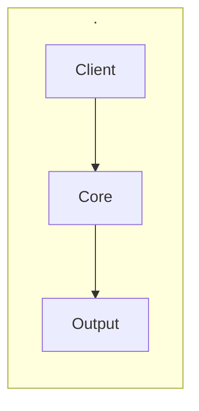

<h1 align="center">Terminus</h1>

<em>**The `docgen_backfill` tool migrates a repo's existing bloated README into a concise landing + `docs/` hierarchy in one guarded pass.**</em>

   

Docs · Quickstart · Reference · Architecture · [Changelog](CHANGELOG.md)

---

## Why TERM

- **The `docgen_backfill` tool migrates a repo's existing bloated README into a concise landing + `docs/` hierarchy in one guarded pass.
- This tool is part of the **Scribe documentation engine** (`crate::scribe`) and is the one-time **cutover** tool for migrating a repo's *first* README into the new **Hermes-style** documentation format — a concise landing page + a linked `docs/` hierarchy.
- It is the **only** tool in the system that **writes to a real working tree** (via `docgen_place`), never a network, git, or forge call.

## Quick Start

_No quickstart content generated yet -- see Getting Started for the full tutorial._

## Architecture at a glance

**

This tool is part of the **Scribe documentation engine** (`crate::scribe`) and is the one-time **cutover** tool for migrating a repo's *first* README into the new **Hermes-style** documentation format — a concise landing page + a linked `docs/` hierarchy. See Architecture for the full component and data-flow breakdown.

## Contributing

See the project's build pipeline docs for the contribution process.

## License

See [LICENSE](LICENSE).

## Documentation

See [the documentation index](docs/index.md) for the full reference.

- [What Terminus is](docs/reference/what-terminus-is.md)
- [Architecture](docs/reference/architecture.md)
- [At a glance](docs/reference/at-a-glance.md)
