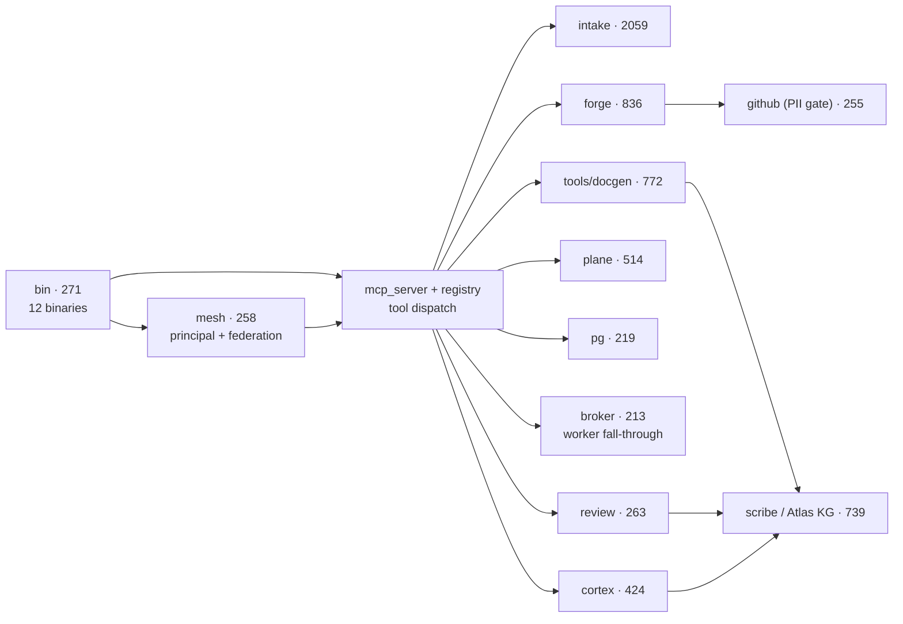

<h1 align="center">Terminus</h1>

<p align="center"><em>The Lumina Constellation's MCP tool hub: 381 core fleet tools behind one authenticated gateway, with model-intake, code-knowledge, review, and CI/CD engines built in.</em></p>

<p align="center">Rust · 410 modules · 381 core MCP tools (+3 personal-only) · 11,905 KG nodes / 27,107 edges · analyzed <code>3d0f277</code></p>

<p align="center"><a href="docs/index.md">Docs</a> · <a href="docs/getting-started.md">Getting Started</a> · <a href="docs/reference/index.md">Reference</a> · <a href="docs/architecture.md">Architecture</a> · <a href="docs/guides/index.md">Guides</a></p>

---

## What is Terminus

Terminus (crate `terminus-rs`) is the tool plane of the Lumina Constellation — a fleet of
self-hosted AI-agent services. Every operational capability an agent may invoke is
implemented here as a typed Rust `RustTool` and dispatched through one
`ToolRegistry` (`src/registry.rs`): project tracking (`plane_*`, 43 tools), source
forges (`gitea_*`, `github_*`, provider-agnostic `git_private`/`git_public`), the
sanctioned Postgres door (`pg_*`), model intake and profiling (`model_intake*`),
code review (`review_run`), the Atlas code knowledge graph (`kg_*`), the
documentation engine (`docgen_*`, `scribe_*`), the constellation CI/CD build door
(`compiler_*`), media orchestration, and a long tail of fleet utilities. Tools never
shell out; the `RustTool` contract restricts them to typed HTTP and parameterized
SQL, and the few capabilities that genuinely need subprocesses (CLI review
providers, docgen inspection) live behind dedicated loopback daemons.

Two deployments serve two registries from the same crate. `terminus_primary` is the
gateway: it registers the core tool set (`register_all`, 381 tools), fronts it with
mTLS + enrollment (`pki`, `terminus-client`), resolves every caller to a unified
`Principal` identity (`mesh::principal`), and federates outward — to personal-registry
tools via the Chord relay (`federation`), to other Terminus-shaped upstream servers
(`mesh`), and to out-of-process tool workers (`broker`, `terminus-worker-sdk`).
`terminus_personal` is the second deployment: the operator's personal/admin subset
(`register_personal`, 189 tools) served over plain streamable-HTTP MCP, with
downstream secrets fetched fresh from the vault at startup.

Around the hub sit engines that make the fleet self-maintaining: **intake** (the
largest subsystem, 2,059 symbols) profiles every candidate model — context, coder,
and assistant suites — and stores operational profiles; **scribe/Atlas** builds a
per-project code knowledge graph that grounds review prompts, blast-radius queries,
and this documentation; **cortex** scores structural elegance and change risk from
that graph; **forge** maintains PII-swept public mirrors of internal repos; and
**compiler** is the single sccache-backed build door for the constellation's CI/CD.

## Architecture

Derived from the code knowledge graph's cross-subsystem call edges (node label =
subsystem · symbol count; see [docs/architecture.md](docs/architecture.md) for the full version):



## Subsystems

| Subsystem | What it does | Reference |
|---|---|---|
| `intake` | Model discovery, profiling suites (context/coder/assistant), GPU authority, fleet assessment | [reference/intake](docs/reference/intake.md) |
| `forge` | Provider-agnostic git domains (`git_private`/`git_public`), adapters, PII-swept public mirror engine | [reference/forge](docs/reference/forge.md) |
| `tools` | The docgen documentation engine and serving control/status tools | [reference/tools](docs/reference/tools.md) |
| `scribe` | Atlas per-project code knowledge graph + standing documentation agent (`kg_*`, `scribe_*`) | [reference/scribe](docs/reference/scribe.md) |
| `plane` | 43 Plane CE project-tracking tools: multi-identity PATs, shared Redis cache + rate budget | [reference/plane](docs/reference/plane.md) |
| `cortex` | Atlas-backed blast-radius, elegance metrics, risk scoring, calibration | [reference/cortex](docs/reference/cortex.md) |
| `media` | Typed clients for the self-hosted media stack and request/search/recommend tools | [reference/media](docs/reference/media.md) |
| `gitea` | 20 Gitea REST tools with named-identity PATs and the merge queue | [reference/gitea](docs/reference/gitea.md) |
| `review` | `review_run`: multi-provider, multi-structure code review with KG-grounded prompts | [reference/review](docs/reference/review.md) |
| `github` | GitHub org tools and the authoritative PII scan/redact engine | [reference/github](docs/reference/github.md) |
| `mesh` | Upstream Terminus federation registry, unified `Principal` identity, optional embedded tailnet | [reference/mesh](docs/reference/mesh.md) |
| `broker` | Out-of-process tool workers: route table, three transport tiers, blue-green rollout | [reference/broker](docs/reference/broker.md) |
| `pg` | The single sanctioned Postgres door: identity-scoped, approval-gated `pg_*` suite | [reference/pg](docs/reference/pg.md) |

The full inventory (17 subsystems, plus `compiler`, `constellation-web`, `compat`,
and the crate-root modules) is in [docs/reference/index.md](docs/reference/index.md).

## Quick Start

```sh
git clone <your-remote>/Terminus && cd Terminus
cargo build --release                      # workspace: terminus-rs, terminus-client, terminus-worker-sdk
cargo run --bin terminus_primary           # gateway; binds 127.0.0.1, port from TERMINUS_PRIMARY_PORT (default 8310)
```

Configuration is entirely env-sourced — key names only here; values are
materialized from the vault at runtime, never committed. The minimum useful set:

- `TERMINUS_PRIMARY_PORT` / `TERMINUS_PRIMARY_BIND` — gateway listener (loopback by default).
- `PLANE_API_URL`, `PLANE_API_KEY` — Plane tools (tools register regardless and return `NotConfigured` until set).
- `GITEA_URL`, `GITEA_PAT_<NAME>`, `GITEA_IDENTITY_NAME` — Gitea tools (named-identity model).
- `GITHUB_PAT_<NAME>` — GitHub tools; `POSTGRES_URL_<NAME>` — `pg_*` connection identities.
- `REVIEW_DAEMON_URL`, `REVIEW_DAEMON_TOKEN` — CLI-backed review providers (run `review_daemon` separately).

Then connect any MCP client to the endpoint and call `initialize` /
`tools/list` / `tools/call` (JSON-RPC 2.0 over streamable HTTP; `GET /healthz`
for liveness). Full walkthrough: [docs/getting-started.md](docs/getting-started.md).

## Documentation

| Page | What it covers |
|---|---|
| [docs/index.md](docs/index.md) | Documentation hub: full navigation with per-page descriptions |
| [docs/getting-started.md](docs/getting-started.md) | Clone → build → run `terminus_primary` → connect an MCP client |
| [docs/architecture.md](docs/architecture.md) | Full derived diagram, per-subsystem narrative, and how a tool call flows |
| [docs/reference/index.md](docs/reference/index.md) | Subsystem inventory; 13 deep reference pages with real symbols and config keys |
| [docs/guides/index.md](docs/guides/index.md) | Operator guides: model-intake sweeps, review panels, the git-public mirror |
| [docs/tools/README.md](docs/tools/README.md) | Existing per-tool documentation, grouped by domain |
| [docs/architecture/](docs/architecture/mesh.md) | Existing deep dives: auth, broker, chord-integration, federation, mesh |
| [docs/build.md](docs/build.md) | Build pipeline notes; see also [docs/house-style.md](docs/house-style.md) |

## At a glance

- 10,064 functions · 1,108 structs · 161 traits · 161 enums across 410 modules (11,905 KG nodes, 27,107 edges).
- 381 core tools (`register_all`) + 189 personal tools (`register_personal`; 3 not also in core).
- 12 binaries, including `terminus_primary` (gateway), `terminus_personal`, `review_daemon`, `mint`, `pii_gate`, `cortex_calibrate`, `house_style_check`.
- 3 workspace crates: `terminus-rs`, `terminus-client` (enrollment + mTLS transport), `terminus-worker-sdk` (worker authoring).
- Top call-graph hotspots: `mesh::principal::PrincipalResolver::map`, `registry::ToolRegistry::contains`, `mesh::tailnet::TailnetServer::start`.

## Contributing

Every code change goes through the constellation build pipeline: spec item →
worktree → test gate (including `house_style_check` and the `pii_gate` hooks) →
dual review → merge. See [docs/build.md](docs/build.md).

## License

MIT — see [LICENSE](LICENSE).
