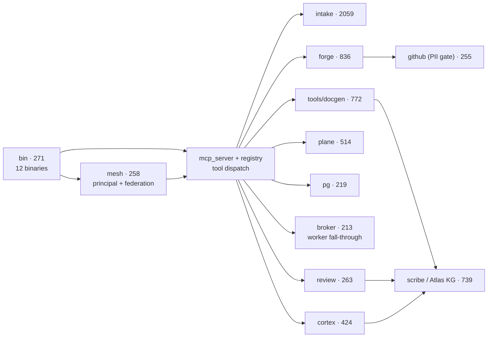

<h1 align="center">Terminus</h1>

<p align="center"><em>The Lumina Constellation's MCP tool hub: 381 core fleet tools behind one authenticated gateway, with model-intake, code-knowledge, review, and CI/CD engines built in.</em></p>

<p align="center">Rust · 410 modules · 381 core MCP tools (+3 personal-only) · 11,905 KG nodes / 27,107 edges · analyzed <code>3d0f277</code></p>

<p align="center"><a href="docs/index.md">Docs</a> · <a href="docs/getting-started.md">Getting Started</a> · <a href="docs/reference/index.md">Reference</a> · <a href="docs/architecture.md">Architecture</a> · <a href="docs/guides/index.md">Guides</a></p>

---

## What is Terminus

Terminus (crate `terminus-rs`) is the tool plane of the Lumina Constellation — a fleet of
self-hosted AI-agent services. Every operational capability an agent may invoke is
implemented here as a typed Rust `RustTool` and dispatched through one
`ToolRegistry` (`src/registry.rs`): project tracking (`plane_*`, 43 tools), source
forges (`gitea_*`, `github_*`, provider-agnostic `git_private`/`git_public`), the
sanctioned Postgres door (`pg_*`), model intake and profiling (`model_intake*`),
code review (`review_run`), the Atlas code knowledge graph (`kg_*`), the
documentation engine (`docgen_*`, `scribe_*`), the constellation CI/CD build door
(`compiler_*`), media orchestration, and a long tail of fleet utilities. Tools never
shell out; the `RustTool` contract restricts them to typed HTTP and parameterized
SQL, and the few capabilities that genuinely need subprocesses (CLI review
providers, docgen inspection) live behind dedicated loopback daemons.

Two deployments serve two registries from the same crate. `terminus_primary` is the
gateway: it registers the core tool set (`register_all`, 381 tools), fronts it with
mTLS + enrollment (`pki`, `terminus-client`), resolves every caller to a unified
`Principal` identity (`mesh::principal`), and federates outward — to personal-registry
tools via the Chord relay (`federation`), to other Terminus-shaped upstream servers
(`mesh`), and to out-of-process tool workers (`broker`, `terminus-worker-sdk`).
`terminus_personal` is the second deployment: the operator's personal/admin subset
(`register_personal`, 189 tools) served over plain streamable-HTTP MCP, with
downstream secrets fetched fresh from the vault at startup.

Around the hub sit engines that make the fleet self-maintaining: **intake** (the
largest subsystem, 2,059 symbols) profiles every candidate model — context, coder,
and assistant suites — and stores operational profiles; **scribe/Atlas** builds a
per-project code knowledge graph that grounds review prompts, blast-radius queries,
and this documentation; **cortex** scores structural elegance and change risk from
that graph; **forge** maintains PII-swept public mirrors of internal repos; and
**compiler** is the single sccache-backed build door for the constellation's CI/CD.

## Architecture

Derived from the code knowledge graph's cross-subsystem call edges (node label =
subsystem · symbol count; see [docs/architecture.md](docs/architecture.md) for the full version):


```mermaid
flowchart LR
    BIN["bin · 271<br/>12 binaries"] --> MESH["mesh · 258<br/>principal + federation"]
    BIN --> MCP["mcp_server + registry<br/>tool dispatch"]
    MESH --> MCP
    MCP --> INTAKE["intake · 2059"]
    MCP --> FORGE["forge · 836"]
    MCP --> TOOLS["tools/docgen · 772"]
    MCP --> PLANE["plane · 514"]
    MCP --> PG["pg · 219"]
    MCP --> BROKER["broker · 213<br/>worker fall-through"]
    TOOLS --> SCRIBE["scribe / Atlas KG · 739"]
    REVIEW["review · 263"] --> SCRIBE
    CORTEX["cortex · 424"] --> SCRIBE
    MCP --> REVIEW
    MCP --> CORTEX
    FORGE --> GH["github (PII gate) · 255"]
```

## Subsystems

| Subsystem | What it does | Reference |
|---|---|---|
| `intake` | Model discovery, profiling suites (context/coder/assistant), GPU authority, fleet assessment | [reference/intake](docs/reference/intake.md) |
| `forge` | Provider-agnostic git domains (`git_private`/`git_public`), adapters, PII-swept public mirror engine | [reference/forge](docs/reference/forge.md) |
| `tools` | The docgen documentation engine and serving control/status tools | [reference/tools](docs/reference/tools.md) |
| `scribe` | Atlas per-project code knowledge graph + standing documentation agent (`kg_*`, `scribe_*`) | [reference/scribe](docs/reference/scribe.md) |
| `plane` | 43 Plane CE project-tracking tools: multi-identity PATs, shared Redis cache + rate budget | [reference/plane](docs/reference/plane.md) |
| `cortex` | Atlas-backed blast-radius, elegance metrics, risk scoring, calibration | [reference/cortex](docs/reference/cortex.md) |
| `media` | Typed clients for the self-hosted media stack and request/search/recommend tools | [reference/media](docs/reference/media.md) |
| `gitea` | 20 Gitea REST tools with named-identity PATs and the merge queue | [reference/gitea](docs/reference/gitea.md) |
| `review` | `review_run`: multi-provider, multi-structure code review with KG-grounded prompts | [reference/review](docs/reference/review.md) |
| `github` | GitHub org tools and the authoritative PII scan/redact engine | [reference/github](docs/reference/github.md) |
| `mesh` | Upstream Terminus federation registry, unified `Principal` identity, optional embedded tailnet | [reference/mesh](docs/reference/mesh.md) |
| `broker` | Out-of-process tool workers: route table, three transport tiers, blue-green rollout | [reference/broker](docs/reference/broker.md) |
| `pg` | The single sanctioned Postgres door: identity-scoped, approval-gated `pg_*` suite | [reference/pg](docs/reference/pg.md) |
| `agent_router` | The agentic tool router: identity-scoped selection, local dispatch, Chord for inference only | see below |
| `availability` | Tool availability state (`available`/`off`/`broken`) — park a dead tool without de-registering it; `tool_availability` is the admin view | see below |
| `oauth` | The OAuth 2.1 remote-MCP connector door: authorization server, login/consent, the token endpoint that mints audience-bound access tokens, and per-client tool and server scoping | see below |

### Agent tool router — selection, dispatch, and caching

`POST /v1/agent/execute` runs the assistant's tool turn **in Terminus**. It previously
blind-forwarded to Chord, which ran the loop against its own catalog — but Chord has no
caller identity, so tool exposure could not be scoped per user, and its catalog pointed
at a stale backend. The loop now runs where the principal is already resolved and
authorization already lives; Chord is called only for the tool-selecting sub-agent's
inference, via a **named proxy** (never a hard-wired model).

Per turn:

1. **Select** — three filters compose, each of which can only *remove*:
   authorization (per-principal allowlist) ∩ availability (is the tool alive at all) ∩
   relevance (lexical match on the request). Authorization and availability run
   **first**, so an unauthorized or parked tool is never even a candidate — the model
   cannot be tempted into calling something it would then be refused.
2. **Ask Chord** for a completion, offering only those tools.
3. **Dispatch locally** through the registry, behind the result cache.
4. Repeat until the model answers, or the bounds below are hit.

Bounds: 8 tool calls and a 90 s wall clock, deliberately **under** the client's egress
timeout so the router's own message surfaces rather than a dead socket. A turn that
hits either bound still returns the data it did fetch instead of an error.

| Variable | Default | Purpose |
|---|---|---|
| `TERMINUS_ROUTER_LOCAL` | on | `0` restores the previous blind-forward to Chord — rollback with no redeploy |
| `TERMINUS_ROUTER_MODEL` | `lumina-fast` | Chord **named proxy** the selection sub-agent runs on |

Streaming callers (`"stream": true`) receive the same SSE progress-event frames Chord
emitted — `tool_call_started`, `tool_call_complete`, `complete` — so existing clients
need no change. A `complete` frame is **always** emitted, including on timeout, because
a client that never sees one waits forever.

### Tool result caching — the common path stays fast

The assistant's highest-traffic tools (news, weather) are cached so a conversational
question does not pay a live upstream round-trip every time.

- **Opt-in per tool.** Anything without a policy is never cached; behaviour is unchanged.
- **Stale-while-revalidate.** Past the soft TTL the cached value is returned
  *immediately* and refreshed in the background — you wait on a slow upstream at most
  once. Only one caller refreshes; the rest are served from cache.
- **Seeded policy** — `news_*`: 15 min soft / 24 h hard (a daily pull that still moves
  through the day). `weather`: 20 min soft / 6 h hard. The hard bound means stale data
  can never be presented as current.
- **Severe-weather alerts are never cached.** Freshness beats latency where safety is
  involved; a stale all-clear is worse than a slow answer.
- **Live-state reads are never cached either** — `media_now_playing` is named in an
  exact-name never-cache list, so it survives any future `media_*` prefix policy. A
  cached "what is playing right now" is not stale data, it is a false statement — and a
  cache hit would also bypass that tool's per-caller entitlement gate.
- **Errors are never cached as data** — only a short failure backoff, and a failed
  background refresh leaves the last-good value intact rather than poisoning it.
- **Results carry `fetched_at`** so the assistant can say "as of …" instead of implying
  cached data is live.
- **User-scoped results are keyed by principal** and never shared between users.
- Bounded with oldest-first eviction.

### Tool grants — who may call what (and who is a guest)

Every request is gated by a **per-identity grant map**: a principal (mTLS CN,
tailnet identity, or named PAT) is looked up in `TERMINUS_GATEWAY_ALLOWLIST_JSON`
and its grant decides whether the action — a tool name, an inference route, or an
`admin:` op — is permitted. **Default-deny**: an identity with no entry is denied
everything. The same decision drives `tools/list` visibility and the router's
selection step, so a tool you cannot call is a tool you are never shown.

Two grant shapes: a plain allow list (`["ledger_accounts", "*"]`) and an
allow/deny object (`{"allow": ["*"], "deny": ["github_", "infisical_"]}`), where
deny entries are literal **prefixes** that win even over an allow `"*"`.

> #### ⚠ Before you provision a guest: what the guest baseline does **not** protect (TERM #577)
>
> The baseline constrains a caller that authenticates as its **own gateway
> principal** — its own client cert / tailnet identity / named PAT, with its own
> entry in this map. It does **not** yet distinguish two humans sharing one
> identity, and today they do: **every person who talks to Lumina arrives at the
> gateway as `identity=lumina`.** The mTLS principal names the *service*, not the
> person; the human identity known at the web edge (`X-Lumina-User`,
> `src/constellation/proxy.rs`) is not forwarded through Chord and never reaches
> `gateway_framework`.
>
> So a houseguest conversing with the assistant today is authorized as `lumina`
> — holding `google_calendar_today`, `commute_estimate` and full inference — and
> **none of the guest narrowing below applies to them.** The same limit applies
> to the per-principal tool cache: it isolates `lumina` from a guest principal,
> not two humans who are both `lumina`.
>
> **Provisioning `guest-*` principals without closing TERM #577 gives a FALSE
> sense of containment.** The guest surface is real only for a **separately
> authenticated principal**. Closing the gap needs end-to-end human-identity
> propagation — design work tracked as **TERM #577**, a blocker for the `hearth`
> family sprint — not a wider or cleverer grant map.

**Guest / family identities** get a deliberately different construction. Name
them in `TERMINUS_GATEWAY_GUEST_IDENTITIES` (comma-separated) and each gets the
baseline surface — ten entries: the assistant route `/v1/agent/execute` (but not
raw completions), plus **nine tools** (`time_now`, `weather`, the three `news_*`
tools, and the four media *discovery* tools) — as an **exactly enumerated allowlist**, not a wildcard
minus a denylist. That is the load-bearing choice: with a denylist every tool
family added in future would be granted to houseguests the day it registers.
With the allowlist a new family is invisible to a guest until someone
deliberately adds it. Media acquisition/mutation (`media_request`,
`media_delete`, `media_organize`, `media_taste_feedback`) is excluded for the
same reason the entries are exact names rather than a `media_*` prefix.

**Media personalisation is scoped to the caller** (TERM #576). Two of the
discovery tools reach household watch history, so a grant of the tool is not on
its own enough: `media_recommend` builds its taste profile from the account the
gateway resolved for the *caller*, and `media_on_deck` discloses the
continue-watching row only to the account it belongs to. Bind a principal to a
household media account with `TERMINUS_MEDIA_ACCOUNT_MAP` (a JSON object of
principal → media account id) and name the account your `PLEX_TOKEN` speaks for
in `PLEX_ACCOUNT_ID`. Both default to **unset = nobody**: an unmapped caller
gets an unpersonalised library browse with no titles, rationales or curation
notes drawn from anyone's history, and a caller-supplied `account_id` naming
someone else's account is **refused, not silently ignored**. The same TERM #577
scope limit applies — this constrains separately authenticated principals, not
two humans sharing one assistant identity.

| Variable | Default | Purpose |
|---|---|---|
| `TERMINUS_MEDIA_ACCOUNT_MAP` | unset (nobody mapped) | `{"<principal>":"<media account id>"}` — whose media account each principal is |
| `PLEX_ACCOUNT_ID` | unset (withheld from all) | The media account `PLEX_TOKEN` speaks for; gates `media_on_deck` |

That baseline is a **ceiling, not a default**. For every other identity an
explicit `TERMINUS_GATEWAY_ALLOWLIST_JSON` entry wins in full; for a guest it is
*intersected* with the baseline, so an entry may **narrow** a guest and can never
widen one. A `{"guest-alex": ["*"]}` — one wildcard, or a line copy-pasted from
an operator identity — would otherwise have handed a houseguest
`google_calendar_today`/`commute_estimate`, which is what the gateway reads to
decide whether a tool may fold the operator's calendar or home address into an
answer. A clamp is logged loudly; to grant more than the baseline, take the
identity out of `TERMINUS_GATEWAY_GUEST_IDENTITIES`.

Grants are **validated fail-closed** at load: a malformed entry (wrong JSON
type, an unknown key such as a misspelled `deny`, a whitespace/empty entry, a
`*` in a deny prefix where it would silently match nothing) is **dropped and
that identity denied**, never coerced into something broader — and one bad entry
never discards the rest of the map.

Full model, the guest surface with per-tool rationale, and a worked example for
adding a principal: [docs/reference/tool-grants.md](docs/reference/tool-grants.md).

| Variable | Default | Purpose |
|---|---|---|
| `TERMINUS_GATEWAY_ALLOWLIST_JSON` | `{}` (deny all) | The grant map: `identity -> grant` |
| `TERMINUS_GATEWAY_GUEST_IDENTITIES` | unset | Comma-separated identities that get the guest/family baseline |

#### Telling two humans apart behind one service identity (TERM #595)

Every warning above about TERM #577 has the same root: a gateway `Principal`
names a **service**, and every person who talks to the assistant arrives as
`lumina`. TERM #595 is the mechanism that lets a turn say *which human it is
for*, in a way no hop in between can FORGE. That is the precise claim, and it is
narrower than it first sounds: a hop cannot mint a valid assertion (it has no
signing key) and cannot replay one under a different principal (each is bound to
the principal it was minted for). It is *not* proof against a hop that replaces
the header with another captured, still-valid assertion for the same principal —
see the replay limits in `src/mesh/person.rs`.

A trusted front door — one that is mutually authenticated (mTLS/tailnet) **and**
holds the `admin:assert_person` grant — sets `X-Terminus-On-Behalf-Of: <person>`
on its request. Terminus translates that, at that door only, into a **signed,
short-lived assertion bound to the asserting principal**, which downstream hops
relay but cannot forge (they hold no signing key). At the tool-dispatch door the
assertion is verified, re-bound to the principal on *that* hop, and turned into
the caller's person scope.

What the person scope changes today:

* **Media personalisation** resolves from the *person* (`person:<id>` in
  `TERMINUS_MEDIA_ACCOUNT_MAP`) with **no fallback** to the principal's account.
* **Calendar/routine entitlements** become the *intersection* of the service's
  grants and that person's own `person:<id>` grant — a person can only ever
  **narrow** what the service could already do, never widen it.

Fail-closed, in the one direction that matters — and the line falls between an
identity that was never **claimed** and one that was claimed and cannot be
**honoured**:

* **No identity headers at all** → the unchanged, service-scoped path every
  pre-#595 caller already took. This is the baseline, not a downgrade.
* **Claimed but blank, malformed, expired, mis-bound, asserted by a principal
  without the grant, or presented on a hop that cannot honour it** → **less**
  privilege than the bare service identity, never a silent fallback to it.

An `X-Terminus-On-Behalf-Of` request that cannot be honoured is **refused with
`403`**, because quietly running it as the service would be a *widening*: the
caller believes it is acting as one person while actually reading and writing
the **shared** record. For the same reason, a client-supplied
`X-Terminus-Person-Assertion` is refused rather than stripped — these headers are
server-set on every hop, so an inbound copy is never authoritative.
A client-supplied copy of either header is stripped on every relay hop; the only
value that ever reaches the next hop is the one the server set.

Both settings default to unset, and an unconfigured deployment behaves exactly
as it did before — the roster is a **closed list**, so an unlisted or misspelled
person is refused rather than quietly given a fresh empty identity.

| Variable | Default | Purpose |
|---|---|---|
| `TERMINUS_PERSON_IDENTITIES` | unset (nobody assertable) | Comma-separated household person identifiers |
| `TERMINUS_PERSON_ASSERTION_KEY` | unset (mechanism inert **and closed**) | HS256 key for signing/verifying person assertions; materialized from the secret store |

Grant a front door the right to speak for people with an **admin-namespaced**
entry — a tool wildcard (`"*"`) deliberately does **not** confer it:

```json
{"lumina": {"allow": ["*", "admin:assert_person"]},
 "person:alex": ["weather", "media_recommend"]}
```

**Scope, stated plainly:** this ships the trusted transport, its authorization,
and the threading into the caller context. Lumina does not yet *send*
`X-Terminus-On-Behalf-Of`. The proxy ingress DOES already mint the signed
assertion and emit it on the upstream request to Chord; what is missing is Chord
propagating it onward to MCP tool dispatch, so end-to-end propagation is not live
until that and Lumina's side land. Until then every turn is
still service-scoped — the same posture as before, not a weaker one.

### Severe-weather watch — acting before it matters

`weather_severe_alerts` answers *"is something coming that I need to act on?"*, as
opposed to `weather`, which answers *"what's it like in X?"*. It watches exactly two
things, both chosen because the operator actually acts on them:

- **Storms that disrupt travel.** It reads real upcoming trips from the calendar and
  checks the weather **at the destination on the travel day**, so a warning is about a
  flight you actually have — not a generic "storms this week". Flight-shaped events are
  called out separately, because there the useful action is *rebook now*.
- **Heat waves as a home power / HVAC risk.** The trigger is *sustained* heat at the
  home location: consecutive days at or above **32.2 °C / 90 °F** whose nights stay at
  or above **21.1 °C / 70 °F**. The warm-night half is the point — a hot afternoon
  followed by a cool night is not a power problem, because the building sheds its heat
  and the AC rests. Heat becomes a *supply* problem when the nights stop helping.

Travel thresholds, likewise deliberately conservative so the watch does not cry wolf:
gale-force wind ≥ **17.2 m/s** (Beaufort 8), heavy rain ≥ **10 mm/3h**, any meaningful
snow ≥ **2.5 mm/3h** water-equivalent, precipitation at or below freezing (icing), plus
the thunderstorm, squall, freezing-rain and tornado condition groups. Light rain and a
breeze are not disruption, and a plain warm day is not a heat wave.

Three properties worth knowing:

- **It is a pull-mode tool, not a push.** Terminus has no proactive delivery path to a
  human — it holds no Matrix connection, and its only timed feature (`reminder`) is
  deliberately built as poll-from-outside, with lumina-core owning delivery. So this
  ships the assessment; scheduling and delivery belong where they already live.
- **Derived, not official, by default.** The `/data/2.5/*` endpoints return no `alerts`
  array; government alerts come only from One Call 3.0, a separate subscription. Set
  `OPENWEATHER_ONECALL_ALERTS=1` to fetch them, in which case official alerts are
  reported first and labelled as such. Otherwise every finding says it is derived.
- **It degrades honestly.** *"Checked, nothing severe"* and *"could not check"* are
  different answers and are worded differently — no calendar, no configured home
  location, or a provider outage never renders as an all-clear. It never invents a
  location.

Reading the calendar and the home location is gated on the same per-source entitlement
as location inference (`google_calendar_today` / `commute_estimate`), and the two are
gated **independently**. An unentitled caller gets nothing *and causes no read of either
source* — a guest cannot learn that the operator is travelling, where to, or where they
live. Results are **never cached**; a stale all-clear is the one failure mode this tool
must not have.

### Saved locations — one registry, many consumers

`location_set`, `location_list` and `location_clear` let the assistant remember
places **conversationally** — *"I've moved"*, *"remember this is home"*, *"I'm in
Denver this week"* — instead of someone editing config on a host. What they write
is a **shared registry**, not a weather feature: `weather` was the first
consumer wired to it and `commute_estimate` / `route_traffic` /
`traffic_incidents` are the second, reading the same registry through the same
contract (`crate::locations`) — which is what wiring commute needed: the same
call, no registry change. News and future modules read it the same way. Adding a consumer needs no change
to the registry.

Entries are named. `home`, `work` and `current` are the well-known names other
tools understand; anything else the user chooses ("the cabin") is stored and
retrievable by name. An entry is permanent, or **temporary with an absolute
expiry** — which is what makes a travel override safe: `current` outranks
`home`/`work` while it lasts, and because it expires it cannot quietly become
where you live.

Four properties worth knowing:

- **Per authenticated principal — NOT per person today.** Records are keyed on a
  caller identity derived from the server-verified principal, and reading or
  writing needs the same entitlement that governs home/work location inference
  (`commute_estimate`). Two separately-authenticated *principals* cannot read or
  write each other's records, and an unentitled caller causes **zero reads** —
  not a read whose result is discarded. But read the gap plainly rather than the
  optimistic version: **every human talking to Lumina currently arrives as one
  service identity (TERM #577), so everyone behind it shares a single record and
  sees the same saved home.** This is per-*principal* isolation, and nothing
  here should be read as per-*person* isolation until #577 closes — at which
  point it becomes genuinely per-person with no rewrite, because the key already
  has room for a person. Records written before then are **orphaned rather than
  shared**: a re-entry prompt is cheap, a silently shared home address is not.
- **Absence and failure stay distinct.** *"You have nothing saved"* and *"I
  couldn't read what you've saved"* are different answers and are worded
  differently, everywhere. A location is **never invented or inferred** to fill
  either gap.
- **Writes are deliberate.** Replacing an existing different value needs an
  explicit confirmation; clearing everything needs `all=true`. `weather`'s
  "or say *remember this is home*" is an **offer**, not an automatic save —
  answering a question is not consent to store the answer.
- **`COMMUTE_HOME` / `COMMUTE_WORK` / `COMMUTE_FAMILY` are no longer read at
  all — by weather *or* by commute.** Weather stopped first; commute kept
  reading all three directly out of the process environment until **TERM #591**,
  which is the same disclosure in the module the variables are named after, and
  removing it from one consumer while leaving it in the other closed half a
  hole. In weather they were also kept
  briefly as a migration fallback, scoped to one service principal. That does
  not work and cannot be made to: until **TERM #577** lands, every human reaches
  Lumina as the *same* service principal, so "the configured principal" names
  the service they all share rather than the operator — and the fallback would
  hand the operator's home and work addresses to anyone entitled. Narrowing the
  gate does not help, because any gate keyed on a shared principal has the same
  defect. So the fallback is **deleted**, along with
  `TERMINUS_COMMUTE_LEGACY_PRINCIPAL`. All three variables are unset on the live
  host, so nothing working was lost; what was removed is a latent disclosure
  that would have activated the moment someone set them.

  The registry is the replacement, and the degradation is honest: with no saved
  home, `weather` asks *"which location do you mean?"* and
  `weather_severe_alerts` reports *"no home location is configured, so there is
  nowhere to watch"*. Both sit under the watch's standing *"this is unknown, not
  clear"* framing — an unwatched home is never an all-clear — but the **reason**
  stays distinct from *"your saved locations could not be read"*. Absence and
  failure are different answers, and neither is ever filled in by a guess.

  Commute degrades the same way. An omitted `origin` still **means** "home" —
  that is the tool's contract and the user's own saved place — but "home" is now
  the caller's registry entry, and with none saved the tool **asks** for a
  starting point rather than routing from somewhere else. *"Nothing saved under
  that name"*, *"saved locations aren't available on this connection"* and *"I
  couldn't read your saved locations"* are three different answers with three
  different wordings, and the last carries a different error type from the
  first — an absent value and a broken read are not the same class of problem.
  A literal address still routes for any caller, entitled or not: that discloses
  nothing.
- **Identities are opaque.** A caller key stores the authenticated principal (and,
  post-#577, person) **verbatim**, trimmed but never case-folded. `Alpha` and
  `alpha` are two callers with two records. Deciding that two differently-spelled
  identities are the same person is an authentication decision, not a storage
  one; if the principal namespace is ever specified as case-insensitive, the
  normalisation belongs upstream in the principal implementation.

| Variable | Default | Purpose |
|---|---|---|
| `TERMINUS_LOCATION_REGISTRY_PATH` | `~/.terminus/locations.json` | Where the registry document lives (owner-readable only, written atomically) |

### Tool availability — parking a tool without removing it

A tool whose backend has been retired should stop being offered to agents, but it should
still be **visible in the registry** so an operator can see what exists and why it is
parked. Deleting it loses that history; leaving it enabled makes the assistant try a dead
tool and report confusing failures.

Set `TERMINUS_TOOL_AVAILABILITY_JSON` to a map of tool name (or name **prefix**) to state:

```jsonc
{
  "crucible_": { "state": "off",    "reason": "retired 2026-07-30" },
  "odyssey_":  { "state": "off",    "reason": "retired 2026-07-30" },
  "hearth_shopping_list": { "state": "broken", "reason": "backend fault" }
}
```

- **States** — `available` (default), `off` (deliberately parked), `broken` (known-failing).
  `off` and `broken` behave identically to an agent; the distinction is for the human.
- **Matching** — an exact tool name wins over a prefix; among prefixes the longest wins, so
  a family-wide `"crucible_": off` can still be overridden by `"crucible_status": available`.
- **Effect** — a non-`available` tool is hidden from `tools/list` and **refused at call
  time** (so a stale cached catalog cannot invoke it). The refusal names the state and the
  reason rather than "not found", so the model parks it instead of hunting for it.
- **Fail-closed** — an unrecognised state resolves to `off`, never `available`: a typo must
  never silently re-expose a dead tool. A map that fails to parse parks **everything** and the
  service refuses to start. A variable that is **set but blank** is treated as a configuration
  error (almost always a failed template substitution such as `VAR=$MISSING`) and also fails
  closed — to disable availability rules, **unset** the variable rather than blanking it. Only
  a genuinely **unset** variable means "no rules, everything available" (unchanged behaviour).
- **Composes with authorization** — availability is principal-independent and can only
  *remove*. The per-identity gateway allowlist still applies independently; a tool is offered
  only if both allow it.
- **Admin view** — `tool_availability` lists every registered tool with its state and reason
  (optionally filtered by `prefix` or `state`).

Changing availability takes effect on service restart, like every other `Environment=` knob.

### Agent sessions — seeing the coder CLIs at work

Harmony can see a tracked repo's Plane status but nothing about the coder CLI agents
(Claude Code, codex, aider) actually working that repo. The `agentsess_*` suite is the
missing primitive: it enumerates live agent sessions on a host and correlates each to the
repository, branch, and `PREFIX-NN` work item it is working on.

- **`agentsess_list`** — live sessions with agent kind, pid, host, cwd, repo/branch, the
  work-item hint parsed from the branch, the tmux pane the session can be watched through,
  and its most recent activity time. Optional `host` (`local`, the default, or `dev` via the
  existing dev SSH door) and `repo` name filter.

Discovery is **process-first, not tmux-first**. Agents are not reliably launched
one-per-named-tmux-session — a host may run several inside one pane, or none in tmux at all
— so a tmux-driven enumerator would observe almost nothing. tmux is treated as an optional
*attachment* (matched by pane pid or process ancestry), never as the unit of discovery.

Each probe degrades independently: a host with no tmux, no readable transcript root, or no
git still returns a useful list, with the shortfall named in `warnings`. Truncation at
`AGENTSESS_MAX_SESSIONS` is likewise always reported — a silent cap would read as "that is
all of them", which is exactly wrong for an observability tool.

Session↔transcript matching is **exact** where it can be: Claude Code exports its session
UUID into its own environment, so it is read directly rather than guessed. Only that single
variable is ever extracted — a process environment routinely holds credentials, and nothing
else from it is read, returned, or logged.

| Variable | Default | Meaning |
|---|---|---|
| `AGENTSESS_TRANSCRIPT_ROOT` | `$HOME/.claude/projects` (local only) | Where agent transcripts live. **Required** to observe a remote host — assuming the local `HOME` applies remotely would silently probe the wrong path and report "no activity" as if it were a fact. |
| `AGENTSESS_AGENT_PATTERNS` | *(empty)* | Comma-separated extra program names to treat as agents, for a CLI this build predates. |
| `AGENTSESS_MAX_SESSIONS` | `50` | Result cap. Truncation is always reported, never silent. |

- **`agentsess_transcript`** — recent activity for one session: a summarised, redacted stream
  of what it has been *doing* (tool calls with their primary argument, messages), read from the
  tail of the session's transcript. Takes a `session_id` from `agentsess_list`, or an explicit
  `transcript_path` (jailed to the transcript root), plus `limit` and `host`.

Activity is **summarised, not streamed raw**: a transcript record carries a whole message, a
whole tool input, or a whole command's stdout, so each collapses to one short line. Only the
last `AGENTSESS_TAIL_BYTES` are read — transcripts reach tens of megabytes and none is ever read
whole. A line that is not JSON is skipped and counted into `skipped_lines`; a record that IS JSON but
whose shape is unrecognised is skipped and counted into `unknown_records`. The two are kept
apart because they have different causes — a truncated write versus a CLI format change — and
either being non-zero turns a format drift into a visible number rather than a silently shorter
list. Neither pads the feed with "unrecognised record" noise, and assistant `thinking` blocks
are never surfaced at all.

Strings are scrubbed through the same `DeterministicCleaner` the public mirror uses, plus one
transcript-specific layer for **unquoted** `NAME=VALUE` shell assignments (including this
fleet's `*_PAT_*` convention) — a shape the mirror cleaner does not target, because in source
files such values are quoted. Treat this as best-effort defence in depth, **not a guarantee**: a
transcript can contain arbitrary text and no pattern set recognises every secret shape. What
actually bounds exposure is structural — summaries are truncated to one short line, tool results
are summarised rather than echoed, and private reasoning is never surfaced.

| Variable | Default | Meaning |
|---|---|---|
| `AGENTSESS_TAIL_BYTES` | `262144` | How much of a transcript tail to read. |

- **`agentsess_capture`** — the recent scrollback of the tmux pane a session is attached to,
  so it can be rendered as a read-only terminal view. Takes a `session_id` (whose pane target
  is *constructed*, not parsed) or an explicit `target`, plus `lines` and `host`.

The pane target is the security boundary: argv form stops shell injection but not **option**
injection, since `tmux` reads a leading-dash argument as a flag. The target is validated
fail-closed against a deliberately narrow `session:window.pane` shape — narrower than tmux's
own rules, because a permissive validator is where a separator or an option would hide.

Output is bounded by **both** line count and total bytes (a wide pane blows the byte budget
long before the line budget), cut on a character boundary, and redacted through the same path
as the transcript reader — a terminal displays credentials as readily as a transcript does.
Both caps report when they fire. A session with no pane is a clear error rather than an empty
capture: "nothing to show" and "not attached to a terminal" are different answers.

| Variable | Default | Meaning |
|---|---|---|
| `AGENTSESS_CAPTURE_MAX_LINES` | `2000` | Scrollback line cap. |
| `AGENTSESS_CAPTURE_MAX_BYTES` | `262144` | Total byte cap. |

**This suite is read-only by design.** Nothing in it writes a file, sends a keystroke, or
signals a process. Being able to *watch* an autonomous agent carries no risk; being able to
*type into* one can alter a build mid-flight. A send capability is a separate, gated change
needing a session allowlist, a control-character whitelist, rate limiting and an audit-log
entry — do not add one here without that gate.

### The OAuth connector door — letting a hosted client in without widening anything

Terminus has three ways in, and all three are private: the loopback listener, the mTLS
listener, and the tailnet listener. Each binds a caller's identity to a transport artifact —
a client certificate CN, or a tailnet WhoIs. That works for the fleet's own services. It
cannot work for a **hosted third-party client**: Anthropic's Claude surfaces reach an
external MCP server over public HTTPS with OAuth 2.1 and cannot present a certificate this
fleet issued.

The `oauth` subsystem is the fourth door. Its output is an ordinary `Principal`, which the
**existing** `gateway_framework` authorization already understands — the new door changes
how a caller proves who they are, never what they may do once in.

**The scoping model, which is the reason this is safe to expose at all.** Every request
resolves to an intersection, and an intersection can only ever *remove*:

```text
effective = grant_of(account)          // what the HUMAN may do  (existing machinery)
          ∩ tools_of(client.groups)    // what THIS connector may do
          ∩ namespaces(client.servers) // which federated servers it sees
```

There is deliberately no path by which a client scoping record grants a tool the account's
own grant would have denied. A client with no scoping record reaches the **empty set**, not
the account's full grant; a tool-group pattern matching nothing is empty, not a wildcard.

**One function decides it, for both `tools/list` and `tools/call`.** `oauth::scope::decide`
is the whole decision; the catalog filter is a `filter` over it and the call gate calls it
directly. Filtering the catalog without gating the call is a disclosure bug, gating the call
without filtering the catalog leaks what exists — two *similar* functions is how those drift
apart, so there is only one. A property test asserts `effective ⊆ account grant` over
generated grants, pattern sets, namespace sets and catalogs.

Denials are audited with a machine-readable reason, in two shapes — and the difference is
deliberate:

- **`tools/call`** emits one record per denied call, naming the tool and its exact reason.
- **`tools/list`** emits **one aggregate record per evaluation**, carrying the client, the
  principal, how many tools were considered and allowed, and the count per reason. It is
  emitted only when something was hidden. Individual hidden tool **names are not enumerated**
  on the list path: a 400-tool catalog would otherwise produce hundreds of records on every
  list and bury the call-path denials that describe something a caller actually attempted.
  The counts answer the question an operator actually has — *which dimension is eliminating
  my tools* — and a call to any hidden tool still yields a per-tool record naming it.

The reasons:

| reason | meaning |
|---|---|
| `denied_by_grant` | the **account's own** grant refuses the tool; no connector scoping can widen past it |
| `no_namespace` | the tool belongs to a federated server this connector is not scoped to |
| `no_group` | no tool group attached to this connector matches the name |
| `no_account_grant` | the process has no gateway configured, so there is no account grant to intersect with — a configuration fault, denied rather than permitted |

A connector that mysteriously sees nothing is the case this is for: one `tools/list` row with
`allowed=0` and the counts alongside says immediately whether the account grant, the
namespaces, the groups, or a missing gateway is responsible.

**Revocation takes effect immediately, including mid-resolution.** Resolved scopes are
cached, so every write against a scope-affecting table — a client's groups or namespaces, a
group's own patterns, a client being disabled, a namespace delegation being reassigned or
cleared — returns through one chokepoint in the store that bumps a process-wide *generation*
counter — **on both sides of the write**, and refuses to cache any resolution while a write
is in progress. Bumping before it means that from the instant a
revocation begins, no resident cache entry can be served, so there is no interval in which a
committed revocation is still being honoured from cache; bumping after it catches a
resolution that read the old rows and is about to cache them, and covers a write that fails
partway. A resolution may only populate the cache at the generation it began at AND only when no
write is in flight — the second condition closes the interval between the two bumps, in which
a read that began after the write started, and returned before it finished, would otherwise
persist a pre-write answer that is already revoked. Such a read may still compute and serve
its own answer; it simply may not cache one for later callers. Concurrent readers therefore
re-derive for the duration of a write — a re-read, not a wrong answer, and no lock is held
across the database round trip. The
distinction this protects is that a stale *denial* costs someone a retry, while a stale
*permit* is revoked authority that still works.

That rule is **enforced rather than documented, across the whole crate**: a test walks every
Rust source file and fails — naming the file and the function — if a mutation of any
scope-affecting table appears outside the chokepoint. Editing a group's patterns revokes tools
from every client the group is attached to, so a future group-CRUD path, admin endpoint or ops
tool that forgot to invalidate would turn the cache into a window of live revoked authority.
An obligation written in a comment does not stop that; a red build does.

Two boundaries worth stating precisely, because the difference matters:

- **No in-crate write can bypass invalidation.** That is what the scan proves, and it holds
  for any module, not merely the store.
- **Not "no write at all".** A change made directly against the database from outside this
  process — an operator editing the tables by hand — is invisible to any in-crate mechanism.
  That case, and only that case, is what the short cache TTL backstops. It is not what makes
  revocation correct.

A stronger form is possible and is recorded as follow-up rather than claimed: making these
tables reachable *only* through the store, so a write from elsewhere fails to compile instead
of failing a test. It is not done here because Rust cannot fully deliver it — nothing stops a
module opening its own connection pool and issuing SQL, so encapsulation would raise the cost
of bypassing without closing it, and the source scan is what actually holds the line today.

Pattern syntax inside a tool group is deliberately tiny — an exact tool name, a trailing-`*`
prefix, or `<namespace>::*` — with no regex (a regex authored by a delegated federation owner
is a denial-of-service on the dispatch path) and no negation (denial already has a layer,
which composes on top and overrides unconditionally).

Pattern shapes, and what each reaches:

| pattern | reaches |
|---|---|
| `weather_now` | the LOCAL tool of that name |
| `weather_*` | LOCAL tools with that prefix |
| `peerhub::*` | every tool on the `peerhub` peer |
| `peerhub::weather_now` | exactly one tool on `peerhub` |
| `peerhub::weather_*` | tools on `peerhub` whose bare name has that prefix |
| `*` | the whole merged catalog, bounded by the connector's allowed namespaces |

**An unqualified pattern addresses the local namespace and nothing else.** `peer*` matches a
local `peermetrics` but *not* `peerhub__alerts_list`, even though the advertised name starts
with `peer` — reaching a federated tool requires an explicit qualifier. Absence of a
qualifier means local-only, never "anything starting this way". The namespace dimension does
not make this redundant: a connector legitimately scoped to `peerhub` passes the namespace
check, and without the boundary rule an over-broad local prefix would hand it that server's
entire catalog.

**The qualifier is `::`, while advertised names separate with `__`,** and the difference is
deliberate. `a__b__*` has two legitimate readings — namespace `a` with prefix `b__`, or
namespace `a__b` — and settling that by fiat is a rule operators will get wrong in the other
direction. `a::b__*` has exactly one reading, and as a direct consequence a bare tool name may
contain `__` freely without becoming ambiguous.

**"Only I can link my account" is enforced at consent, not at registration.** Possession of
a `client_id` gets a caller as far as a login screen. Issuing a token needs an argon2id
password sign-in *and* an explicit approval of a named client and a named capability set. A
client nobody consents to holds nothing.

The interactive endpoints (`GET /oauth/authorize`, `POST /oauth/login`, `POST /oauth/consent`)
are server-rendered pages with no JavaScript, no framework and no external resource, served
under `default-src 'none'; frame-ancestors 'none'`. Several of their properties are
load-bearing rather than incidental:

- **Two failures never redirect.** An unknown `client_id` or an unregistered `redirect_uri`
  renders a terminal error page and emits no `Location` header at all — redirecting to an
  unvalidated address is an open redirect. Everything checked afterwards *is* an OAuth error
  redirect, because by then the destination is one an operator registered.
- **Redirect matching is exact, with one named exception.** An RFC 8252 loopback URI matches
  with the port ignored, because a native client binds an ephemeral port it cannot know at
  registration time. That exception requires the scheme to be `http`, no userinfo in the
  authority, an identical host from a fixed three-item allowlist, and identical path, query
  and fragment. Only the port may differ. A general fuzzy match is how open redirects are
  born; this is a branch with its own tests in both directions.
- **A redirect URI that already carries a response parameter is refused.** `…/cb?code=x`
  would produce a response with two `code` parameters and let the *client's* query parser
  decide which wins. Reserved names (`code`, `state`, `iss`, `error`, `error_description`)
  are refused at validation and dropped at build time.
- **PKCE S256 is required**; `plain` **and an omitted method** are both refused — RFC 7636
  makes `plain` the default when the method is absent, so accepting the omission would be
  accepting `plain`.
- **Tokens are audience-bound.** The RFC 8707 `resource` parameter is required and must equal
  the configured canonical resource, so a token minted here cannot be replayed at a federated
  peer.
- **An unknown account and a wrong password are indistinguishable** in body, status and
  *timing* — the no-account path verifies the submitted password against a real argon2id hash
  with the same cost parameters rather than returning early. Both the per-account and the
  per-source rate-limit budgets are consumed before any credential work, so the limiter is
  not an oracle either. The source address comes from the connection, never from
  `X-Forwarded-For`: a rate-limit key the caller can rotate is not a rate limit.
- **Consent shows resolved capabilities, not a scope string.** "mcp" tells a human nothing
  about whether they are approving a weather lookup or a host restart, so the page lists the
  client's resolved tool groups with their patterns and its federated namespaces. An empty
  list is stated in words as *grants no tool access at all* — an empty section reads as
  "unrestricted", which is the exact misreading the scoping model exists to prevent.
- **Loopback clients carry a warning**, as the MCP specification requires: a loopback
  redirect cannot be authenticated, so any process on the user's machine that binds the port
  first receives the code.
- **Authorization codes** carry 366 bits of entropy, are stored only as a SHA-256 digest,
  live 60 seconds, and are bound to client, account, redirect URI, resource, PKCE challenge
  and scope. One authentication yields at most one code: the login session's identifier is
  claimed by an `INSERT … ON CONFLICT DO NOTHING`, so a replayed consent post loses the race
  **across every replica**, not merely within one process.

**Presenting the token: what `/mcp` does with it.** Everything above mints a token; the
resource-server half checks one on every call. It resolves to an ordinary `Principal` and
then stops — an OAuth caller gets no new entitlement channel, and a `CallerContext` is still
constructible only inside `gateway_framework`, from that principal's grants.

> **Status.** The behaviour described in this section is implemented, tested, and called by
> the `/mcp` request path. For what is and is not wired in the assembled system — including
> the two gaps that matter operationally — see *Exactly what is wired today* below, which is
> the single account of that; this note deliberately does not restate it.

- **The audience check is the load-bearing one, not the signature.** A valid signature proves
  only that *someone holding the key* minted the token. A token whose `aud` names a federated
  peer is refused here even though it verifies perfectly, and a **multi-audience** token is
  refused outright rather than searched for our own name — a token valid at two audiences is
  replayable at the second by whoever holds it at the first, which is the property
  audience-binding exists to remove.
- **Header only.** A token in a query string is refused *and audited* before any identity
  source is selected — for every request, whatever door it came through, and whether or not
  it would otherwise have authenticated. By the time such a request arrives the credential
  has already been written to access logs, `Referer` headers, proxy caches and shell history;
  a client certificate on the same request does not un-leak it.
- **An issued token still resolves to nobody by default.** The account maps to a canonical
  principal through the *same* `TERMINUS_MESH_PRINCIPAL_MAP_JSON` every other transport uses,
  via a new `oauth_account` table. An unmapped account fails closed exactly as an unmapped
  mTLS CN does, so the door is inert until an operator writes an entry: minting a token is an
  authentication decision, and being somebody here is a separate one, made on purpose.
- **A certificate still wins, exclusively.** OAuth is the weakest of the four doors — the only
  internet-reachable one, and the only one whose credential is replayable by whoever holds it
  — so it is consulted only when no cert and no tailnet identity is present. That ordering is
  enforced in three independent places, and a bearer token is not even *inspected* when a
  stronger identity is on the request.
- **Revocation takes effect on the next call — for everything that removes ALL of a caller's
  sessions.** The client row, the account row, the consent row and the pair's session state are
  re-read per request, because a signature is a point-in-time authority and revocation happens
  after it was issued. The guarantee, stated so an operator can act on it:

  > Disabling a client, disabling an account, revoking consent, or revoking every session for
  > an (account, client) pair denies that caller's **next** request. Revoking **one** session
  > while another is still active does **not** — a token minted for the revoked session keeps
  > working until it expires, up to `RMCP_OAUTH_ACCESS_TOKEN_TTL_SECONDS` (default 15 minutes).
  > To cut off a caller immediately today, revoke consent or disable the client.

  The gap is not a policy choice: nothing in an access token identifies a session. The claims
  are `iss`, `sub`, `aud`, `client_id`, `scope`, `jti`, `exp`, `iat`, `nbf` — `sub` is the
  account, `client_id` is the client, and the `jti` is generated at mint time and stored
  nowhere, because there is no access-token table. Closing it means putting the refresh
  family in the token, which is tracked as **TERM #635**.
- **The connector rides alongside the principal, never inside it.** `client_id` is the second
  axis of the intersection above; folding it into the principal name would make one human a
  different principal per client, turning a ceiling into an independent grant.
- Failure shapes: an expired token is `401` **with** the challenge, which is how a hosted
  client refreshes reactively; an unreachable store is `503` **without** one, because telling
  a client its credential is bad would send the user through a full re-authorization for a
  server-side outage.

#### Keeping the door safe to leave open: rate limits, audit, and revocation

An internet-facing auth surface needs three things beyond correctness — bounded abuse, a
legible trail, and a working way to cut something off right now.

**Rate limits** (`oauth::limits`) are the door's single budget table — the login POST, the
token endpoint and revocation all draw on it, and RMCP-03's separate login limiter was
converged onto it (TERM #633) rather than left as a second definition that could drift. They
are per endpoint, because the endpoints have nothing in
common operationally: `/oauth/token` is called by Anthropic's infrastructure on a schedule
and should be generous, while `/oauth/login` verifies a password and should be tight. One
shared bucket has to be sized for the most generous, so it never constrains the tightest.

Each endpoint carries **two** budgets, and their relationship is the interesting part. An
address-only limit lets a distributed attacker grind one account; a subject-only limit lets
one address try a thousand accounts once each. So every request consults an address bucket
*and* a bucket keyed on the account or client it named. Two rules make the pair work rather
than interfere: the subject budget is **strictly larger** than the address budget — equal
budgets would mean one host exhausting its own budget also exhausts the victim's, a free
lockout of any account whose name can be guessed — and an address denial **short-circuits**
before spending subject budget, without which that ratio would be worthless. The ordering is
enforced at every construction site, and a configuration that violates it is a hard startup
error rather than a quietly corrected one; an unparseable value, by contrast, falls back to
the built-in default, because a typo is not an instruction. There is no way to disable
limiting and no `Option` whose `None` means "skip the check", which is what makes a restart
re-arm instead of leaving a gap. A 429 carries one fixed message produced in one place, so
no endpoint can invent "too many attempts for this account" and turn throttling into an
account-existence oracle. Subject keys are digests, so an attacker-chosen identifier costs
constant memory — as do address keys, since a cap on the number of entries bounds memory only
if each entry is bounded too and the address is just as caller-controlled. The bucket tables
are bounded: at the ceiling, only a **fully refilled**
bucket is evicted (dropping and re-creating one are indistinguishable, so it grants nothing),
and when nothing is evictable the new key is refused rather than admitted untracked — a flood
must not be able to switch the limiter off for everyone.

**The audit trail** (`oauth::audit`) records every authorization decision, issuance, refresh,
rotation, reuse detection and denial. Its design point is that **no record can contain a raw
credential, because there is nowhere to put one.** Structured facts are typed (UUIDs, an
endpoint, closed event and denial-reason enums), and the narrative is a closed `AuditDetail`
enum — fixed sentence templates plus integers, with no variant carrying a `String`, so no
call site can put caller data into it.

The two genuinely variable values are both closed off, by different means. The source address
is never parsed here at all: the setter takes a typed `IpAddr`, supplied by the edge's
trusted-proxy resolver, which is the only code that legitimately has one. An earlier revision
parsed a string and recorded it whenever it parsed as an address — but parseability is not
proof about caller-controlled input, so the untyped entry point was removed rather than
defended. A `client_id` is opaque by definition and no parser could prove anything about it
either way, so the value is **never** recorded: a client that resolved is identified by its
internal UUID, and one that did not contributes only a `ValueShape` — a length and a coarse
charset class, enough to tell a typo'd connector name from a pasted blob without reproducing
either. The address, being canonical by construction, stays actionable enough to write a
firewall rule from.

There is deliberately **no redaction pass at all**. Two earlier attempts failed the same way:
first a prose field defended by a sanitizer, then a charset allowlist paired with a
24-character opaque-run redactor — which left an 8- or 12-character authorization code passing
both layers untouched. Lowering the threshold only moves the seam and starts eating legitimate
short identifiers. A filter left lying around is also a filter someone routes a string through
while believing they are safe, so the helpers were removed rather than kept as a backstop.

Sessions are named by refresh-token **family id**, never by a token hash — a digest is still
live authentication material. Records go to a `tracing` target and to a small bounded ring,
which is what lets a test assert the guarantee by scanning what was actually emitted rather
than by reading the code, including at the short lengths both previous layers missed.

**Revocation** (`oauth::revoke`) has one implementation behind three surfaces: RFC 7009
`POST /oauth/revoke`, the `rmcp_session_list` / `rmcp_session_revoke` tools, and the GUI,
which calls the tools. A second path is how "revoked in the UI" and "still working" happen to
two people at once. Everything revokes whole **families**, inheriting the store's family-wide
liveness rule, and revoking an account+client pair revokes its **consent** inseparably —
a revoked consent whose refresh tokens still work is not a revocation.

> **⚠ Revoking one session among several does not cut it off.** The difference between
> "revoked" and "cut off" — and the rest of the subsystem's wiring state — is set out in
> *Exactly what is wired today* below. `oauth::revoke::dispatch_state` is the per-family
> implementation that replaces the currently-wired check once TERM #635 gives an access token
> a session claim to carry.

Revocation does not report success
on the strength of an `UPDATE` returning — it re-reads the affected families and fails loudly
if any is still live, since an operator who believes the door is shut stops looking. Revoking
something already revoked succeeds and says it changed nothing.

Two refusals are deliberate. `rmcp_session_revoke` rejects an **empty selector**: the same
empty arguments that legitimately mean "everything" for the listing tool would mean "revoke
every session in the fleet" here, and an unresolvable name bails out before any query rather
than degrading into "no filters". And neither tool accepts a raw token — selection is by
account, client, or family id — so a credential never travels through tool dispatch and
argument summaries. Revoking *by* token is the RFC 7009 endpoint's job, where it answers
`200` for an unknown token (a `404` would be a validity oracle for harvested values) and
`200`-but-revokes-nothing for a client presenting a token it does not own.

Revocation is deliberately **not** approval-gated, unlike the guarded tools: it only ever
narrows access and is undone by re-authorizing, and gating it would put a confirmation step
in front of the one control an operator reaches for mid-incident.

**Opening the door.** It is shut unless `RMCP_OAUTH_ENABLED` is set — an explicit switch, not
"configured means enabled", because which hosts expose a public door should be a sentence an
operator wrote rather than a side effect of an env file being copied. Once it *is* set, every
remaining failure (a malformed canonical resource, a missing signing key, an unreachable OAuth
database, an unapplied migration) refuses the process at startup. That is deliberate and has a
real cost — it couples the gateway's startup to Postgres on hosts that opt in — but the
alternative is worse than an outage: a door that is configured, believed open and silently
shut produces no error anywhere, and presents to the operator as a connector that mysteriously
never links.

**Configuration** (names only — values are materialized from the runtime secret store, never
authored by hand): `RMCP_DATABASE_URL`, `RMCP_OAUTH_SIGNING_KEY`, `RMCP_OAUTH_ISSUER`,
`RMCP_OAUTH_RESOURCE`. The resource server adds exactly **one** name of its own,
`RMCP_OAUTH_ENABLED` (the switch) — everything else it needs it reads through the code that
already owns it. The per-endpoint `RMCP_RATE_LIMIT_*` budgets are optional and documented in
`.env.example`. `RMCP_OAUTH_RESOURCE` is the connector URL exactly as typed into the client
(an absolute `https` URI, no trailing slash, no fragment) and is compared byte for byte
against a token's `aud`; the signing key, issuer, optional
`RMCP_OAUTH_SIGNING_KEY_PREVIOUS` rotation window and `RMCP_OAUTH_CLOCK_SKEW_SECONDS` leeway
are the token endpoint's, and the *same* verifier that mints tokens is the one that checks
them here. That is deliberate and was learned the hard way: an earlier revision of the
resource server read its own `RMCP_CANONICAL_RESOURCE` for the audience, which under the
documented configuration would have rejected every token the fleet issued — a door that fails
silently, which is the failure mode this whole subsystem keeps having to design against. The
schema lives in `migrations/S132-rmcp01-oauth-core.sql` and
`migrations/S132-rmcp03-login-session.sql` and is **not** applied at startup: apply it via
`pg_ddl` as part of the deploy. Until it is, the store reports the door unconfigured rather
than serving a silently dead auth surface.

**The scoping intersection is applied at both enforcement points** in `mcp_server` and
enforced by `gateway_framework`, engaging for any request that carries a resolved connector
scope. For whether it is reachable in a running binary — and for the operator prerequisite
that currently keeps the door from booting at all — see *Exactly what is wired today* below,
which is this file's single account of that state; this note deliberately does not restate it.

One distinction is worth keeping here, because it is a property of the code rather than of the
deployment: the **absence** of a connector scope means "this request did not come through the
OAuth door", which is a statement about the *transport*, and it leaves the account grant to
decide alone. It is never read as "an unscoped connector", which is a statement about *data*
and always resolves to the empty set. Conflating the two in either direction is a bug — read
as empty it would deny every mTLS and tailnet caller in the fleet, and the reverse is a
silent widening.

**Not yet complete.** An account with a TOTP second factor is currently **refused** at
sign-in rather than admitted on its password alone: the stored seed is encrypted with a
subkey nothing derives yet, and a verifier cannot check a code against a seed it cannot
decrypt. That is a deliberate fail-closed gate, not a fault — RMCP-08 provisions the subkey.
Clearing `totp_secret_enc` to work around it would silently downgrade the account to one
factor and must not be done.

#### Where a `client_id` comes from — operator minting, and gated DCR

There are exactly two ways a connector comes into existence, and the default posture is the
one that answers *"only I can link my account"*: **an operator mints it**. `rmcp_client_create`
names an owner, a display name and the redirect URIs, and returns the public `client_id` to
paste into Claude's custom-connector dialog. No client exists that the operator did not create.

**Dynamic client registration (RFC 7591) is OFF unless `RMCP_OAUTH_DCR_ENABLED` is set**, and
even then it is never an anonymous write: `POST /oauth/register` requires an operator-issued
**initial access token** (`rmcp_registration_token_mint` — single-use by default, expiring, and
shown exactly once). Absent, unknown, expired, revoked and exhausted tokens all answer
identically, so the endpoint is not an oracle telling an attacker which of their guesses was
once real. Whether the endpoint is *advertised* and whether it is *served* come from one read of that
flag at startup, whose **value** is handed to both — not from two readers that agree, which is a
different and weaker thing. A document promising a `registration_endpoint` that 404s is worse
than one that promises nothing: the client treats the key as a supported path and reports a
broken server instead of falling back to the `client_id` already pasted in.

**A registered client reaches nothing until an operator scopes it.** It lands with no scope
rows, and RMCP-07 reads absence as the empty set — so it can authenticate a human, obtain a
token, and call zero tools. Note which control that is: *not* the `disabled` column, which is
the authentication kill switch and would have meant a DCR client could not complete a flow at
all, conflating "revoked" with "awaiting approval". The connector shows up in the Connectors
GUI as unscoped, and stays inert until somebody assigns it groups and namespaces.

**A client secret is shown exactly once.** It is generated from OS entropy, stored only as an
argon2id PHC string, and returned in the response to the call that created it. Nothing reads it
back and nothing *can*: the administrative row type carries a `confidential` boolean computed
in SQL and has no field a hash — let alone a secret — could occupy. Public clients (which is
what Claude registers as) get no secret at all and authenticate with PKCE alone; that is the
default, because defaulting the other way would mint a credential nobody asked for.

**An absent `grant_types` means `authorization_code` alone** — RFC 7591's default, followed
exactly. Not `authorization_code` plus `refresh_token`: that would grant a capability the client
never requested, and `grant_types` is enforced at the token endpoint, so it is a real one. A
connector that must keep working without sending the user back through authorization every hour
— which is what Claude expects — has to state `["authorization_code", "refresh_token"]`, and
`rmcp_client_create` takes a `grant_types` argument for exactly that. The convenience this costs
is the point: absence must never grant more than was asked for.

**Refusals that never reach a handler are recorded anyway.** An oversized body or an unsupported
method is rejected by middleware, so the handler that would normally audit it never runs — which
left the door's most operationally interesting refusal path silently untraced. One layer, applied
outermost, observes every outcome and records the two statuses no handler can produce (`413` and
`405`), rather than each early return remembering to emit; the rule that every author must
remember is the rule some author will not. The record carries the endpoint, the status and this
process's own byte bound — never the body, which is caller-controlled. A `404` for a path the
door does not serve is deliberately *not* recorded: attributing a port scan to the fail-closed
default endpoint would fill the trail with noise, and a trail people learn to ignore is worse
than a quiet one.

**A registration token is re-checked against its ISSUER's live authority when it is spent**, not
only when it was minted. An initial access token issued by an operator who is later demoted or
disabled stops working at its next use, rather than remaining valid until it expires. This is the
same rule as everywhere else in the item — *any authority that can be revoked must be re-derived
on the read path* — and a bearer token is a read path. Consumption locks the token row `FOR
UPDATE`, re-derives the issuer's authority under `FOR SHARE`, and only then spends a use; a token
presented while its issuer is unauthorized is **not** consumed, so it cannot be burned by
presenting it during a demotion. Unknown, expired, revoked, exhausted and issued-by-a-demoted-
operator all answer identically, so the endpoint reports nothing about which.

**Redirect URIs are validated as an allowlist, at write time.** Absolute `https`, or an RFC 8252
loopback URI — nothing else. A scheme nobody anticipated is refused by default rather than by a
denylist entry somebody had to have thought of. Userinfo is refused on both arms, because a URI may
carry a trusted-looking name in its userinfo segment and a host of the attacker's choosing after
the `@` — it reads as the connector's and resolves to somebody else's. Fragments, wildcards, over-long values and duplicates are refused, as are URIs
carrying a query parameter reserved for the authorization response — registering one of those
would mint a client that can never complete a flow, since `/oauth/authorize` refuses it at
request time. The loopback rule is **asked of the matcher**, not re-derived here, so a URI can
never be registrable under one definition and unmatchable under another.

Refusals name a field and an index (`redirect_uris[1]: must not contain a fragment`) and never
echo the submitted value — the same rule the audit vocabulary enforces, applied to the error
body, because on a public endpoint that body reaches logs on both sides.

**A present-but-wrong-typed member is malformed, never absent.** RMCP-02's rule applies one level
down: *absent* means not configured, *present* means the value must be usable, and
present-but-unusable is refused. Without that, `grant_types: "password"` reads as absence and
takes the supported default, and `token_endpoint_auth_method: 42` lands silently on the weakest
method — a client registered with semantics it never submitted.

**Metadata handling is an allowlist.** Members this server understands are acted on; a short list
of deliberately *cosmetic* ones (`client_uri`, `logo_uri`, `contacts`, `scope`, …) is ignored per
RFC 7591 §3.1; **everything else is refused**. Security-significant members we can name — request
object signing and encryption, authorization-response signing and encryption, ID-token and
userinfo signing and encryption, TLS client authentication, pairwise subject identifiers,
`software_statement`, `jwks`/`jwks_uri` — are refused *by name*, so the message says which. Anything
unrecognised is refused generically, contributing only a boolean, because an unknown key is
caller-chosen text and this rejection reaches an error body.

The first cut was a denylist, on the argument that a strict allowlist makes interoperability
hostage to a list nobody maintains. That argument is real but the burden falls on the denylist to
be *complete*, and it was not — request-object signing, response encryption and TLS client
authentication were all silently ignored. Completeness is unprovable and the failure of an
incomplete denylist is invisible, so the structure is inverted: the interoperability burden now
sits on the cosmetic list, where forgetting an entry produces a **loud refusal** rather than the
silent acceptance of a member whose meaning nobody checked.

**Every administrative write is authorized, against RMCP-12's machinery rather than a second copy
of it.** That includes creation: an operator may mint a connector owned by anyone, anyone else only
one owned by themselves — without which, naming someone else as `owner` would mint a connector in
their name and then scope it to *their* groups and namespaces, since the scoping write authorizes
against the client's owner. Each mutating tool names an `actor`; the store derives that account's `ActorAuthority`
inside the writing transaction under `FOR SHARE`, reads the client's owner under the same lock,
and lets `authorize_client_write` decide — the operator may administer any connector, anyone else
only their own. Minting or revoking an initial access token is operator-only
(`authorize_operator_action`, RMCP-12's delegation check generalised in place rather than forked).

Authority is re-derived **at the write**, never carried from an earlier read: there is no proof
value to pass in, so an actor demoted or disabled between an earlier check and the commit cannot
act on a stale snapshot. Review round 2 found the first cut doing none of this — the client-field
`UPDATE` constrained only `id` and `version`, and the tool computed its actor as *the target row's
own owner*, which asks the object being modified who may modify it and can only answer yes. An
ownership check did run, but on the scope path only, so an edit touching just `enabled` or
`redirect_uris` routed around it entirely.

Lifecycle runs through tools, not a second API path: `rmcp_client_create`, `rmcp_client_list`,
`rmcp_client_update`, `rmcp_client_revoke`. Updates carry the `version` the caller read and are
**refused** if the connector has moved on, rather than overwriting whatever another operator
saved — the thing being overwritten would be an authorization record. An update is **atomic**:
the enabled flag, the redirect URIs, the tool groups and the namespaces commit together or not at
all, in one transaction. Applied separately, a failure partway leaves a client with its new
enabled state and its old scope — a half-applied authorization change that looks, from either
side, like a deliberate configuration. Revoking disables the
client *and* kills its refresh tokens, so the caller is denied at its **next** request.

#### Exactly what is wired today

This is the single account of the subsystem's state. An earlier revision of this file carried
two, written a round apart, and they disagreed — one said the endpoints were mounted and
enforcement was live, the other said neither was. That is worse than either being wrong
alone, because a reader who stops at the optimistic one concludes revocation is an immediate
control. Anything below that later becomes untrue should be **edited here**, not qualified
somewhere else.

**Mounted: yes.** The routers are merged into the process's main router and served by the
private listeners and by the public edge alike, at `/oauth/authorize`, `/oauth/login`,
`/oauth/consent`, `/oauth/token` and `/oauth/revoke` — plus `/oauth/register` when, and only
when, `RMCP_OAUTH_DCR_ENABLED` is set (RMCP-08); with it unset the path 404s exactly as it does
on a build without the feature, and the metadata document omits the key. Until TERM #631 each
OAuth item had
merged a `Router` that nothing ever bound, so every item passed its own acceptance criteria
while the feature did not exist in a running binary. A configured-but-unbuildable door is now
a hard startup error, because a half-built auth surface that serves the login page and then
fails at the token endpoint sends the operator looking at the client.

**Migrations: applied by hand, and RMCP-08 adds one.** `S132-rmcp08-client-registration.sql`
adds `rmcp_client.version` and the `rmcp_registration_token` table. Both are in the startup
readiness check, so a deployment that ships this code without applying the migration refuses to
start with a message naming it, rather than failing the first connector edit with an opaque
`column does not exist`.

**Revocation enforced at the next request: yes, at `(account, client)` granularity.** The
dispatch path consults `any_session_is_live(account, client)` on every call (RMCP-05).
Disable the client, disable the account, revoke consent, or revoke **all** sessions for a
pair, and the caller is denied at their next request — not at the next token expiry.

**Residual gap: revoking ONE session among several does not cut it off.** An access token
carries no family claim, so the server cannot tell which session presented it and asks only
whether *any* session for the pair is live. Revoking one while another is live leaves that
token working until it expires; its refresh token is already dead, so the session cannot be
extended. **TERM #635** adds the claim, and RMCP-05 carries a tripwire test asserting today's
permissive outcome so it fails loudly when the fix lands.

**Scope resolution: wired (TERM #631, item 5).** `terminus_primary` derives its scope source
from the door itself: the resource server keeps its `OauthStore` handle and the resolver
shares that same handle, so there is one connection pool and one answer to whether the
database is reachable. A connector therefore reaches exactly

```text
what the ACCOUNT may do  ∩  the connector's tool groups  ∩  the connector's namespaces
```

re-derived per request, so a group or namespace an operator takes away stops working at the
next call rather than at the next token expiry. Both enforcement points — the `tools/list`
catalog filter and the `tools/call` guard — run the *same* decision function, so a tool the
listing hides is never callable and a tool it advertises is never refused.

**What that means in practice: a connector still reaches nothing until it is scoped.** Every
one of these resolves to the **empty scope**, and the empty scope permits zero tools:

| Situation | Resolves to |
|---|---|
| Client has no tool-group rows | empty |
| Client is unknown, or disabled | empty |
| Store read fails (database unreachable) | empty, for that request only — never cached |
| A stored pattern does not parse | dropped; it matches nothing |
| Process has no door, or a door with no store | empty |
| Process has no account grant to intersect with | empty |

The difference between those cases is **observability — a warning line and an audit reason
code (`no_group`, `no_namespace`, `denied_by_grant`, `no_account_grant`) — never permission.**
There is deliberately no default that widens: absence is the empty set at every level, a
failed store read denies for one request rather than poisoning the cache with either answer,
and nothing reads a missing row as consent. An operator seeing a freshly linked connector with
no tools is looking at the designed behaviour of an unscoped client, not at a fault; assign it
a tool group and the tools appear.

> **Operator prerequisite — the connector will not work until this is done.** The three S132
> migrations are **not applied on any live host**, and they are not applied at startup (see
> *Opening the door* above). Until an operator applies them, `schema_ready()` fails and
> `resource_server_from_env` refuses the process at startup, so the door never boots — and the
> scope resolver is consequently `None` because the *door* is, not because the wiring is
> missing. The wiring above is correct and inert until the schema exists.

**Audit trail: emitting.** Every authorization decision, login outcome, issuance, refresh and
rotation emits the OAuth record, alongside every rate-limit refusal, revocation, RFC 7009
outcome, reuse detection and dispatch denial. Client registration joined that list with
RMCP-08: every accepted and refused registration emits, carrying the client's row id and the
issuing account and nothing the caller wrote.

**Federation delegation (RMCP-12): enforced in the store, not yet reachable from the GUI.**
Namespace ownership, the `allowed_servers ⊆ owned_namespaces(actor)` rule and the
`rmcp_server_owner_set` / `rmcp_server_owner_list` tools are live; the Connectors page that
would let a delegated owner administer their own server in a browser is RMCP-13. Until then a
delegation is administered by the operator at the tool surface, and the delegated owner's
*enforcement* — what their connectors may reach — is already in effect. See *Federation
delegation and server ownership* below for the model.

**Rate limiting: one table, every mounted route.** TERM #633 is closed — RMCP-03's separate
login limiter is gone, and the login budget now comes from the same per-endpoint table as
`/oauth/authorize`, `/oauth/consent`, `/oauth/token`, `/oauth/revoke` and (when DCR is on)
`/oauth/register`, inheriting the subject-over-address invariant it could not previously
express. `/oauth/register` is the one conditionally-mounted route and it carries a budget
unconditionally, because a route that only gets one when someone remembers is the same defect
as a limiter wired into some of the handlers.

### Live viewing activity — `media_now_playing`

Every other media read is historical (library, watch history, on-deck, recently added).
`media_now_playing` is the one **live** read: Plex `/status/sessions`, direct — no
Tautulli, no second client, no new credential. Per session it reports the title (with
show/season/episode where applicable), who is watching, the player, progress and
duration, and the playback decision — **direct play / direct stream / transcode** with
the transcode reason — plus a session count and total bandwidth.

Two properties are load-bearing rather than incidental:

- **Outcomes that never render identically.** *Plex unreachable*, *token rejected*,
  *Plex answered something unreadable* and *nobody is watching* are different facts and
  are kept apart at the type level from the transport upward. Only the last one is an
  `ok` answer (`status: "idle"`, an empty session list); every failed read carries **no
  session count at all**, so it can never be misread as an empty house. That holds for
  the parser too, not just the transport: `idle` is granted only to the one empty shape
  the live server actually emits (`MediaContainer` present, `size: 0`, no `Metadata`),
  and any other body that cannot be walked — a missing `MediaContainer`, a nonzero
  `size` with no sessions attached, a count that disagrees with the list — is
  `malformed`. A broken read that claimed "nobody is watching" would be the worst
  failure this tool could have, because on a dashboard it looks like an answer.
  Stated explicitly for consumers, because *absent*, *null* and *not-a-count* are not
  the same shape:

  > `status` is `idle` only when `MediaContainer.size` is **present** and is the whole
  > number `0`, **and** `MediaContainer.Metadata` is either **absent** or an **empty
  > array**. Everything else is `malformed`, never `idle`:
  >
  > - an explicitly `null` `Metadata`, at every `size` including `0` — Plex omits the
  >   key when nothing is playing (`{"MediaContainer":{"size":0}}`) and emits no JSON
  >   `null` on any endpoint, so a null means the response was rewritten in transit and
  >   neither it nor the `size` beside it can be trusted;
  > - an **absent** `size`, whatever `Metadata` does — Plex states a size on every
  >   container it emits, so a missing one is the same evidence of an altered response;
  > - a `size` that is **fractional, negative, or not a number** — a count of things is
  >   a whole non-negative number, so `0.5` is not an imprecise count but an impossible
  >   one, and it is never floored to `0`;
  > - a session whose `TranscodeSession` is present but is **not an object** (`null`, a
  >   scalar, a list) — the same evidence and the same verdict one level down, and the
  >   whole response fails rather than that one session, because dropping it would be an
  >   undercount and keeping it would state a playback decision derived from a payload
  >   that was demonstrably rewritten.
- **`transcode_reason` may be null for a non-direct-play session.** It is non-null *iff*
  `decision != "direct_play"` **and** the session carried a `TranscodeSession` **object**.
  Plex sometimes states the decision on `Media[0].Part[0]` with no transcode session to
  explain it, and no reason is invented for that case — a field whose job is to state a
  reason must not carry a guess. A `TranscodeSession` that is present but is not an
  object is never read as one: it fails the whole response as `malformed` (above), so a
  rewritten transcode block can never surface as a confident decision with a manufactured
  reason. Consumers read `decision` as the discriminant for playback mode and render a
  null reason as "no reason given".
- **Numeric fields split by meaning.** `season`, `episode` and `year` are ordinals: a
  fractional value is dropped to `null` rather than truncated, so a consumer is never
  shown an episode number the payload did not state. `progress_ms`, `duration_ms` and
  `bandwidth_kbps` are measurements: a fractional value is rounded to the nearest whole
  unit, because a half-millisecond is not worth a blank progress bar. `session_key` is
  an opaque string and is never read as a number.
- **A `malformed` detail never quotes the payload back.** Every verdict above rests on
  *this response was rewritten in transit, so nothing in it can be trusted* — which makes
  echoing the offending value into our own error the one thing not to do: it hands whoever
  rewrote the response a channel into the structured payload (a title, a username, an
  address or a credential parked in `size` came straight back out, to a caller who may be
  entitled to none of it) and lets an arbitrarily long value produce an arbitrarily long
  error. So a detail names a **safe category** — the JSON type that arrived and the type
  that was expected — and carries a value only when that value is a **number**, whose
  rendering is hard-bounded and which cannot carry a name, an address or a secret. That
  exception exists because `size: 0.5` is the one fault where the value *is* the
  diagnosis. Every detail is additionally capped in length on the way out, as defence in
  depth rather than as the mechanism. This matches what the rest of the path already
  does: transport failures are **classified**, never `Display`ed, and the Plex base URL
  and token are never echoed anywhere.
- **Private by default.** Now-playing reveals who is home and what they are doing, in
  real time, so it is gated on the caller's entitlement (the same `CallerContext`
  mechanism `weather` uses for operator-context inference). A guest, an unknown caller,
  a caller with no principal, or any un-threaded dispatch path receives `forbidden` and
  nothing else — no titles, no usernames, no device names, and no count, because a count
  alone discloses occupancy. The gate runs *before* the client is touched, so an
  unentitled call issues no Plex request at all. It is deliberately **not** in the guest
  baseline.

### The OAuth 2.1 connector door (`oauth`)

Terminus's three existing doors — the loopback listener, mTLS, and the tailnet — all bind
a caller's identity to a transport artifact: a client-certificate CN, or a tailnet WhoIs.
That works for the fleet's own services and for machines the operator enrolled by hand. It
cannot work for a hosted third-party client, which reaches an external MCP server over
public HTTPS as an **OAuth 2.1 public client with PKCE**. This subsystem is the fourth
door. It changes how a caller proves who they are; it does not introduce a second way to
decide what they may do — every request still resolves to an existing `mesh::Principal`,
and per-client scoping can only ever *narrow* the account's own grant.

**`POST /oauth/token`** (`oauth::token`) implements both grants. Three properties carry the
security of the whole door:

- **The body is `application/x-www-form-urlencoded`, checked here rather than delegated to
  a framework extractor.** Hosted clients send both the initial exchange and every refresh
  that way; a JSON-only parser answers with a bare `415` carrying no `error` field, which a
  client cannot distinguish from a broken server — every connection would fail identically
  and silently. A repeated parameter is refused rather than last-write-wins, so a proxy and
  this origin can never disagree about which `resource` or `scope` was authorized.
- **Access tokens are audience-bound.** The JWT's `aud` is the RFC 8707 `resource` bound to
  the *code* (or to the refresh token's family), never a value taken from the request — a
  `resource` parameter may only *agree* with the binding, never establish one. That is what
  stops a token minted for a federated peer being replayed at this server. Verification
  requires the caller to state which audience it is; there is no "any audience" mode.
- **Refresh tokens rotate, and reuse is treated as theft.** Presenting an already-rotated
  token revokes the entire family and returns exactly `invalid_grant`: the legitimate
  holder and the thief cannot be told apart, so both are cut off and the human
  re-authorizes. Every error is a registered RFC 6749 code, because a hosted client keys
  its re-authorization on `invalid_grant` and a custom code strands the user permanently.

Ordering is part of the design. Client authentication runs *before* the authorization code
is touched, so an unauthenticated caller cannot burn codes it does not own; the code is then
consumed *before* the PKCE, redirect and resource checks, so a stolen code cannot be retried
with different parameters until one combination is accepted. Single-use and rotation are
decided in SQL (`oauth::store`) — one conditional `UPDATE` and one transaction — and nothing
in the endpoint re-implements them, because a read-then-write there would reopen exactly the
races the store closes. PKCE is compared in constant time, and a code somehow persisted
without a challenge is **not** exchangeable.

Nothing here stores a presentable credential: codes and refresh tokens are high-entropy
values kept as SHA-256 digests, client secrets and passwords as argon2id PHC strings. Keys
and lifetimes come from the vault-materialized environment (`RMCP_OAUTH_SIGNING_KEY` and the
other `RMCP_*` names in `.env.example`); verification accepts a *previous* signing key for a
rotation grace window, while minting always uses the current one.

The full inventory (17 subsystems, plus `compiler`, `constellation-web`, `compat`,
and the crate-root modules) is in [docs/reference/index.md](docs/reference/index.md).

## The public MCP connector edge

Terminus's three original doors — the loopback plain listener, the mTLS
listener, and the tailnet listener — are all private and all bind a caller's
identity to a transport artifact (a client-certificate CN, a tailnet identity).
A hosted third-party client can present neither.

`RMCP_EDGE_ENABLED` adds a fourth listener inside `terminus_primary`
(`src/oauth/edge.rs`) for exactly that case: an internet-facing door, behind a
TLS-terminating reverse proxy, exposing **only** the two OAuth `.well-known`
documents, `/oauth/*`, and `/mcp`. Everything else the router serves —
`/enroll`, `/admin/*`, `/healthz`, the inference routes — is unreachable through
it, and a path with no policy entry is denied rather than defaulted to open.

The policy is per-**path**, not per-host, because the two halves of an OAuth
flow arrive from different networks: Anthropic fetches discovery, `/oauth/token`
and `/mcp` from its published egress range, while `/oauth/authorize` opens in the
operator's own browser and never comes from Anthropic. A single "allow only
Anthropic" pinhole serves discovery perfectly and then silently 403s the person
trying to consent — which is the failure this design exists to avoid.

The listener is off unless configured, and an unusable policy is a hard startup
error rather than a permissive default. See
**[docs/networking/remote-mcp.md](docs/networking/remote-mcp.md)** for the
runbook: the configuration surface, the reverse-proxy and TLS layout, how the
client address is resolved (and the two proxy misconfigurations that break it),
and a troubleshooting table. Deploy assets live in
[`deploy/rmcp-edge.service`](deploy/rmcp-edge.service) and
[`deploy/rmcp-edge-proxy.conf.example`](deploy/rmcp-edge-proxy.conf.example).

## Connector tool groups (RMCP-06)

The OAuth connector door (`src/oauth/`) scopes a client by **tool group** — a name plus a
small list of patterns over the tool catalog — so an operator scopes a connector as
"media" rather than by listing several hundred tool names. Patterns are matched against the
live catalog rather than expanded once and stored, so a newly registered tool matching an
existing pattern needs no config edit.

> **Everything below describes how groups are authored, validated and stored — not what
> authorizes a request.** Two pointers rather than a third account of either: for the
> assembled system's wiring state see *Exactly what is wired today* above, which is this
> file's single account of it and records what scope resolution reaches today; for
> which matcher owns these pattern semantics until TERM #637 collapses the two, see the
> `Status` section of the `src/oauth/groups.rs` module docs.

### Pattern syntax

Exactly these shapes parse. There is no glob, no regex, and no negation.

| Pattern | Meaning | Example |
|---|---|---|
| `tool_name` | that one tool, exactly | `weather_get` |
| `prefix*` | every **local** tool whose name starts with `prefix` | `weather_*` |
| `namespace::*` | every tool advertised by one mesh upstream | `peerhub::*` |
| `namespace::prefix*` | tools from one upstream whose bare name starts with `prefix` | `peerhub::ledger*` |
| `*` | every tool, **local and federated** — operator-owned groups only | |

The full grammar, so the rejections are as unambiguous as the semantics:

```text
pattern   := "*"                        -- every tool (operator-owned groups only)
           | namespace "::" "*"         -- one upstream, all of it
           | namespace "::" bare "*"    -- one upstream, bare names starting with `bare`
           | namespace "::" bare        -- one federated tool, exactly
           | local "*"                  -- LOCAL tools starting with `local`
           | local                      -- one local tool, exactly

namespace := printable ASCII, no "*", no "::", must round-trip through the mesh splitter
             (so: no "__" inside, no trailing "_")
bare      := printable ASCII, no "*", no "::"   (may contain and even end with "__")
local     := printable ASCII, no "*", no "::", no "__"
```

**Two separators, deliberately different characters.** `::` delimits a *pattern*; `__`
separates the halves of an *advertised name*. Keeping them distinct is what makes
`a::b__*` unambiguous — namespace `a`, bare prefix `b__`, with no second reading. An
earlier revision used `__` for both, which made `a__b__*` genuinely ambiguous (namespace
`a__b`, or namespace `a` with prefix `b__`?) and could only be settled by declaring a
precedence rule; a pattern whose meaning depends on a precedence rule is one an author
cannot read. `::` also matches what the enforcing matcher in RMCP-07 already used — the two
had diverged, which is TERM #637.

**Which side of the boundary a tool is on is read from the catalog, not guessed from its
name.** A local tool may legitimately be named with `__` in it — that is not something the
pattern grammar controls — and such a name splits like a namespaced one. Matching therefore
consults the catalog entry's provenance, so a qualified pattern like `peerhub::tool` reaches
the federated tool and never a local tool that merely looks federated (TERM #637).

**`__` in an unqualified pattern is refused**, not reinterpreted. It can never match (any
advertised name carrying `__` is namespaced, hence not local), and it is exactly what an
old-vocabulary pattern looks like — so `peerhub__*` errors with the correct form named
(`peerhub::*`) rather than silently becoming a local prefix that grants nothing.

Rejected at write time, exhaustively: the empty pattern; anything over 96 characters; any
non-printable-ASCII character; a `*` anywhere but as the single final character (`*weather`
and `weather*foo` are errors, not suffix matches); a pattern beginning with `__`; and any
namespace that cannot round-trip (`::*`, `a__b::*`, `foo_::*`). Every one of those would
otherwise parse to something the author did not write — usually a pattern that silently
matches nothing, leaving a connector quietly missing tools with no error to explain it.

**The rule in one sentence:** an unqualified *exact* or *prefix* pattern matches local
tools only; a namespace-qualified pattern matches only within the namespace it names; and
the bare `*` matches the whole merged catalog, bounded by the client's allowed namespaces
at the RMCP-07 intersection rather than by the matcher. `*` is deliberately not local-only
— it has no letters, so there is no prefix collision to guard against, it is the most
heavily gated pattern here, and it is what gives the namespace dimension of the
intersection something to bound.

- **No regex.** A pattern may be authored by a delegated federation user, and this matcher
  is designed to run on the dispatch path, once per request per pattern — an author-supplied
  regex there is a denial of service.
- **No negation.** Subtraction is the existing deny layer's job
  (`DEFAULT_SENSITIVE_DENY_PREFIXES`). Two subtractive mechanisms in two files is how two
  authorization systems come to disagree.
- **An unqualified pattern matches only unqualified (local) names.** A bare prefix does
  not span the `__` mesh separator, so `peer*` matches a local `peer_status` but **not**
  `peerhub__alerts_list` — a namespace that merely shares the prefix's letters is not a
  match. Reaching a federated tool takes a pattern that names the upstream, which an author
  can only write deliberately. Absence of a namespace qualifier means "local only", never
  "anything that happens to start this way".
- **A bad pattern is refused when it is stored, never when it is matched.** Matching is
  pure and total; an error there would be an availability failure inside the authorization
  system rather than a safety property.
- **Operator-ness is read from the database, not supplied by the caller.** The bare `*`
  rule is enforced against `rmcp_account.is_operator`, read inside the same transaction as
  the write it authorizes. A caller states *who* is writing; it never states what they are
  allowed to write. Requires the `S132-rmcp06-account-operator-flag.sql` migration —
  `schema_ready()` reports NOT ready without it.
- **Who the author is decides more than just `*` (RMCP-12).** A *delegated* author may hold
  only namespace-qualified patterns, over servers they own; unqualified patterns address the
  fleet's own local tools and are the operator's. The single account of that model is
  *Federation delegation and server ownership* below — this bullet is a pointer to it, not a
  second copy.
- **And this resolver re-derives it rather than trusting the row.** A write-time check is
  point-in-time, so a stored `*` expands only if its group's owner is an operator *right
  now* and not disabled.
  A wildcard written by someone since demoted — or stored before the flag column existed —
  resolves to the **empty set**. General rule for anything built on top of this: an
  authority that can be revoked must be re-derived on the read path, never cached in a row.

### Bounds

A group holds at most 128 patterns and a client is scoped to at most 32 groups, both
enforced at write time; this resolver refuses outright above `32 x 128` patterns. The per-group cap alone bounds nothing that
matters: resolution concatenates every group a client holds and walks that list once per
catalog tool, so the group count is the unbounded factor. Over the limit, resolution is
**refused, never truncated** — a truncated pattern list is a scope that silently differs
from the configured one, and which patterns survived would depend on row ordering.

### What empty means

**Empty means empty.** An empty group grants nothing, and a well-formed pattern that
happens to match no tool in the current catalog grants nothing. Neither is ever read as
"unrestricted". A group can only ever *narrow*: RMCP-07 intersects the group set with the
account's own grant and the client's visible namespaces, so no group can grant a tool the
human behind it could not already call. That intersection is RMCP-07's, and today it runs
against RMCP-07's matcher — see the status note above.

### Starter groups

`groups::STARTER_GROUPS` seeds a few ordinary, editable groups (`daily briefing`, `home`,
`media`, `personal records`) built from tool-name prefixes that already exist in the
registry, so the first connector is usable without hand-authoring. None of them uses `*`.

## Federation delegation and server ownership (RMCP-12)

A friend running their own MCP server behind Tailscale needs to configure who reaches **their**
server, without being able to touch anyone else's. That is what namespace ownership is: one
mesh namespace (one federated server) is bound to one account, and the rule everything else
follows from is

```text
allowed_servers ⊆ owned_namespaces(actor)
```

The operator owns every namespace **by default** and holds no row; `rmcp_server_owner` records
*delegations*. An unowned namespace is therefore the operator's to attach and nobody else's —
"nobody has claimed this server" never reads as "everyone may reach it".

### What a delegated owner may do

- Create and edit **their own** connector clients, and scope them to servers they own.
- Author tool groups over servers they own — including `theirserver::*`. Granting their own
  server wholesale is the ordinary case, not a loophole.
- List their own clients, groups and delegation. They see no evidence of anyone else's;
  enumeration is itself a disclosure, so "you have none" and "there are none" read the same.

### What a delegated owner may not do

- **Name a server they do not own** — refused when the pattern is written, not merely
  filtered later.
- **Hold any unqualified pattern.** `weather_*` and `pg_stat` address the *local* namespace,
  which is the fleet's own tools, and no client-side namespace row bounds them — so a
  delegated account may hold only namespace-qualified patterns. The bare `*` stays
  operator-only, as it was under RMCP-06.
- **Sub-delegate.** Delegation does **not** chain: granting and revoking server ownership is
  operator-only, including revoking a delegation you hold. A chain of delegations is a chain
  nobody can audit.
- **Touch another owner's client, group or session**, by any path.

### Revocation is immediate, and it is the read path that makes it so

Revoking a delegation stops authorizing on the **very next call**, not at a cache TTL: every
resolution re-joins `rmcp_server_owner` and re-reads the owning account's current state, so a
cleared delegation, a demoted operator or a disabled account all narrow instantly. The
write-side tidy-up that deletes the now-unjustified client-scoping rows runs in the same
transaction as the revocation, but it is bookkeeping — if it failed, the rows it left behind
would already authorize nothing. The same re-derivation is why a demoted operator's stored
local patterns stop resolving rather than living on in the row that recorded them.

One consequence worth stating: a delegation for a namespace this fleet no longer federates
with is **stale, not dangerous**. No catalog tool carries that prefix any more, so it grants
nothing; `rmcp_server_owner_list` reports the row as unconfigured so an operator can find out
why a connector went quiet.

### Administering it

```sh
rmcp_server_owner_set   namespace=peerhub account=<account-name>   # grant (or reassign)
rmcp_server_owner_set   namespace=peerhub revoke=true              # revoke, narrowing clients
rmcp_server_owner_list                                             # who owns what
```

Both are operator-only, and the acting operator is resolved from the **deployment**, never
from an argument: the sole active operator account, or the one named by
`RMCP_OPERATOR_ACCOUNT` when a fleet has several. With several operators and nothing named,
the tool refuses rather than picking one — an administrative action attributed to the wrong
human is worse than one that did not happen. The account is re-verified to be an active
operator on every use, so a stale configuration cannot preserve authority it has since lost.

Granting is deliberately **not** approval-gated, for the reason RMCP-11 gives for revocation:
the caller has already been authenticated as the operator by the surface it arrived on, the
action is bounded to namespaces the operator already controls, both directions are audited,
and it is undone in one call whose effect lands on the next request.

Every scoping write authorizes through one function, and the store's raw ownership mutators
are private and take an authorization **proof value** whose only constructor runs the operator
check — so there is no polite path and impolite path, there is one path. A source-scanning
test pins the callers, because that is the half a test exercising the authorized path cannot
observe.

The proof is then **re-verified inside the writing transaction**, under `FOR SHARE` locks, for
both the acting operator and the grantee. A proof establishes that the check *ran*; it cannot
establish that it still *holds*, and the gap between them is exactly the moment an operator is
racing to disable a compromised account. So an operator demoted or disabled after minting a
proof cannot complete the mutation, and a delegation cannot land on an account disabled in the
meantime.

## Quick Start

```sh
git clone <your-remote>/Terminus && cd Terminus
cargo build --release                      # workspace: terminus-rs, terminus-client, terminus-worker-sdk
cargo run --bin terminus_primary           # gateway; binds 127.0.0.1, port from TERMINUS_PRIMARY_PORT (default 8310)
```

Configuration is entirely env-sourced — key names only here; values are
materialized from the vault at runtime, never committed. The minimum useful set:

- `TERMINUS_PRIMARY_PORT` / `TERMINUS_PRIMARY_BIND` — gateway listener (loopback by default).
- `PLANE_API_URL`, `PLANE_API_KEY` — Plane tools (tools register regardless and return `NotConfigured` until set).
- `GITEA_URL`, `GITEA_PAT_<NAME>`, `GITEA_IDENTITY_NAME` — Gitea tools (named-identity model).
- `GITHUB_PAT_<NAME>` — GitHub tools; `POSTGRES_URL_<NAME>` — `pg_*` connection identities.
- `REVIEW_DAEMON_URL`, `REVIEW_DAEMON_TOKEN` — CLI-backed review providers (run `review_daemon` separately).

### The remote-MCP connector URL (OAuth door)

`terminus_primary` can additionally expose an OAuth 2.1 door for hosted MCP clients
(RMCP). It is **off** unless `RMCP_OAUTH_RESOURCE` is set, and when it is set the
value has a contract that is worth reading once, because getting it slightly wrong
fails in a way the client cannot describe.

| Key | Meaning |
|---|---|
| `RMCP_OAUTH_RESOURCE` | **The connector URL, byte-for-byte as typed into the client's connector form.** Enables the door. Shared with the authorization and token endpoints. |
| `RMCP_OAUTH_ISSUER` | OAuth issuer identifier. Defaults to the canonical resource's origin. Must be on that **same origin** unless the flag below is set. |
| `RMCP_OAUTH_ISSUER_EXTERNALLY_SERVED` | Acknowledges that a cross-origin `RMCP_OAUTH_ISSUER` publishes its own RFC 8414 metadata. Default off. |
| `RMCP_OAUTH_SCOPES_SUPPORTED` | Advertised scopes, separated by a **single space** each. Default `mcp offline_access`. |
| `RMCP_OAUTH_REQUIRED_SCOPE` | Scope an access token must carry to reach `/mcp`. Default `mcp`. |
| `RMCP_OAUTH_DCR_ENABLED` | Advertise and accept RFC 7591 dynamic client registration. Default off. |

Booleans accept `1`/`true`/`yes`/`on` and `0`/`false`/`no`/`off` in any case; unset or
empty means off. **An unrecognised value aborts startup** rather than reading as off — a
typo is an instruction the operator believes is in force, and `RMCP_OAUTH_DCR_ENABLED`
gates a security-relevant default.

**The contract.** `RMCP_OAUTH_RESOURCE` is published verbatim as the `resource`
field of the protected-resource metadata document, is echoed by the client as the
RFC 8707 `resource` parameter, and becomes the audience of every issued token. Those
three strings are compared byte-for-byte. The server therefore **does not normalize
it**, and refuses at startup — with a message naming the variable — anything it would
otherwise have had to normalize:

- must be an absolute `https://` URI, with a lowercase scheme;
- **no trailing slash** (`https://host/mcp` and `https://host/mcp/` are different
  audiences — this is the single most common cause of a connector that authorizes and
  then fails every call);
- no fragment, no query string, no userinfo, no whitespace or non-ASCII;
- a real authority: a non-empty host, an IPv6 literal bracketed if present, and a
  numeric port in `1-65535` if present.

**The issuer must be on the resource's own origin.** This process serves
`/.well-known/oauth-authorization-server` on its own origin and nowhere else, so an
`RMCP_OAUTH_ISSUER` pointing at a different host names an authorization server whose metadata
nothing here publishes — the client follows it, gets a 404, and reports the same generic
error. That combination is **refused at startup**. If the issuer genuinely is a separate
authorization server that publishes its own RFC 8414 document, set
`RMCP_OAUTH_ISSUER_EXTERNALLY_SERVED=1` to say so explicitly. An issuer with a *path* on the
same origin needs no flag — the path-suffixed well-known covers it and is served here.

**Unset and empty mean "off"; whitespace is an error.** Leaving `RMCP_OAUTH_RESOURCE`
unset — or set to the empty string, which is what a bare `KEY=` line in an
`EnvironmentFile` produces — disables the door, and nothing changes. A value of
*whitespace* aborts startup instead of disabling it: a `KEY=` line cannot produce
spaces, so they only come from a typo or a botched substitution, and reading them as
"unset" would silently switch the door off. Configuring any other `RMCP_OAUTH_*`
discovery setting while leaving `RMCP_OAUTH_RESOURCE` unset aborts for the same
reason — a half-configured door that reads as "off" is a fail-open on a gateway with
no `auth_token`.

A malformed value **aborts startup**. That is deliberate: a *nearly* correct value
starts fine, serves a document the client fetches happily, and then fails at token
issuance with a client-side message — "Couldn't reach the MCP server" — that names
neither the field nor this server.

**The discovery contract.** Three unauthenticated endpoints implement it, all served
from bodies rendered once at startup (no database, so discovery answers even when the
store is down), and all answering `HEAD` as well as `GET`:

| Path | Document |
|---|---|
| `/.well-known/oauth-protected-resource` | RFC 9728 protected-resource metadata |
| `/.well-known/oauth-protected-resource/<resource path>` | The same document. Clients probe **this** form first. |
| `/.well-known/oauth-authorization-server` | RFC 8414 authorization-server metadata |

**Enabling the door narrows one legacy posture.** Without `RMCP_OAUTH_RESOURCE`, a
gateway configured with no `auth_token` treats every `/mcp` caller as authorized. With
the door enabled that would answer `200` to exactly the request the discovery flow
depends on failing, so the open arm narrows: callers the *listener* vouched for (mTLS
client certificate, resolved tailnet identity) still pass, and everything else — the
shape a public-internet request has — gets the `401` challenge. Deployments that do not
set `RMCP_OAUTH_RESOURCE` are unaffected.

An unauthenticated `POST /mcp` answers `401` with
`WWW-Authenticate: Bearer realm="…", resource_metadata="…", scope="…"`. That header is
the entire discovery bootstrap and is honoured **only** on a `401` — a client discards
it on a `200`. A valid token that lacks a required scope answers `403` with
`error="insufficient_scope"` and the scopes needed, which is a different instruction to
the client than `401`: re-authorize for more scope, rather than discard the credential.

Then connect any MCP client to the endpoint and call `initialize` /
`tools/list` / `tools/call` (JSON-RPC 2.0 over streamable HTTP; `GET /healthz`
for liveness). Full walkthrough: [docs/getting-started.md](docs/getting-started.md).

## Documentation

| Page | What it covers |
|---|---|
| [docs/index.md](docs/index.md) | Documentation hub: full navigation with per-page descriptions |
| [docs/getting-started.md](docs/getting-started.md) | Clone → build → run `terminus_primary` → connect an MCP client |
| [docs/architecture.md](docs/architecture.md) | Full derived diagram, per-subsystem narrative, and how a tool call flows |
| [docs/reference/index.md](docs/reference/index.md) | Subsystem inventory; 13 deep reference pages with real symbols and config keys |
| [docs/guides/index.md](docs/guides/index.md) | Operator guides: model-intake sweeps, review panels, the git-public mirror |
| [docs/tools/README.md](docs/tools/README.md) | Existing per-tool documentation, grouped by domain |
| [docs/architecture/](docs/architecture/mesh.md) | Existing deep dives: auth, broker, chord-integration, federation, mesh |
| [docs/networking/remote-mcp.md](docs/networking/remote-mcp.md) | The public MCP connector edge: per-path source policy, reverse proxy + TLS, troubleshooting |
| [docs/build.md](docs/build.md) | Build pipeline notes; see also [docs/house-style.md](docs/house-style.md) |

## At a glance

- 10,064 functions · 1,108 structs · 161 traits · 161 enums across 410 modules (11,905 KG nodes, 27,107 edges).
- 381 core tools (`register_all`) + 189 personal tools (`register_personal`; 3 not also in core).
- 12 binaries, including `terminus_primary` (gateway), `terminus_personal`, `review_daemon`, `mint`, `pii_gate`, `cortex_calibrate`, `house_style_check`.
- 3 workspace crates: `terminus-rs`, `terminus-client` (enrollment + mTLS transport), `terminus-worker-sdk` (worker authoring).
- Top call-graph hotspots: `mesh::principal::PrincipalResolver::map`, `registry::ToolRegistry::contains`, `mesh::tailnet::TailnetServer::start`.

## The `pii_gate` binary

The authoritative PII pre-push / pre-commit gate, replacing the legacy
`.githooks/pii_gate.py`. It scans git *objects* (committed or staged blobs), not
the working tree, so a secret that is committed but since deleted is still
caught. It fails **closed**: a git error, a missing binary, or a malformed
config is never reported as a clean push.

```sh
cargo build --release --bin pii_gate
ln -sf ../../target/release/pii_gate .git/hooks/pre-push
```

| Flag | Effect |
| --- | --- |
| *(none)* | git pre-push protocol on stdin — scans the blobs being pushed |
| `--staged` | git pre-commit — scans the staged index |
| `--tree [PATH]` | sweeps a whole working tree (used by the mirror engine) |
| `--json` | machine-readable report instead of the human summary |
| `--visibility <internal\|public>` | override the repo's declared posture |
| `--posture` | print the resolved posture and why, then exit 0 |

### Posture: internal vs public

The scan is always full-strength; posture decides only which categories are
**reported**. A repo declares it via `[repository] visibility` in
`.moosenet-repo.toml`.

- **`internal`** — the fleet's own infrastructure *identifiers* are not reported:
  container ids, internal hostnames and domains, operator paths, uuids, phone
  numbers, the operator's name, and infra service names. An internal repo
  legitimately documents these.
- **`public`** — everything is reported. This is also the fail-closed default
  when the declaration is absent, unparseable, or has an unrecognized value.

**Real credentials are never posture-gated.** Private IPs, API keys, JWTs, PEM
private keys, cloud provider keys, and quoted secrets fire at every posture, as
do any operator-configured `extra_terms` / `extra_patterns`.

This mirrors the `EXTENDED_PATTERNS` split of the Python gate it replaces. The
filter lives in the binary only — the shared `ruleset_from_config` seam used by
the runtime write gate and the git-public mirror engine stays unconditionally
full-strength, so mirroring is never weakened by a repo's posture.

Repo-specific terms, extra patterns, allowed emails, and exclusions come from a
repo-root `pii-gate.toml` (or the path in `TERMINUS_PII_CONFIG`).

## Contributing

Every code change goes through the constellation build pipeline: spec item →
worktree → test gate (including `house_style_check` and the `pii_gate` hooks) →
dual review → merge. See [docs/build.md](docs/build.md).

## License

MIT — see [LICENSE](LICENSE).
