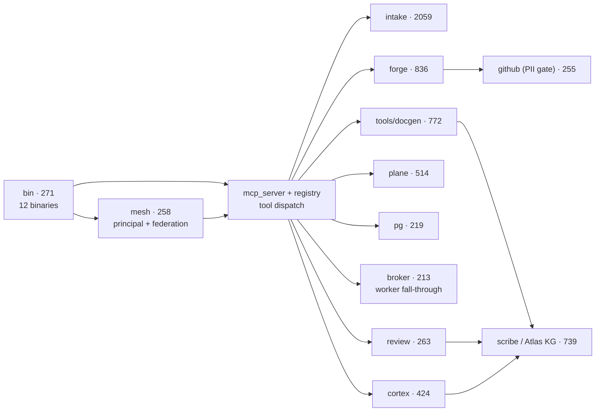

<h1 align="center">Terminus</h1>

<p align="center"><em>The Lumina Constellation's MCP tool hub: 381 core fleet tools behind one authenticated gateway, with model-intake, code-knowledge, review, and CI/CD engines built in.</em></p>

<p align="center">Rust · 410 modules · 381 core MCP tools (+3 personal-only) · 11,905 KG nodes / 27,107 edges · analyzed <code>3d0f277</code></p>

<p align="center"><a href="docs/index.md">Docs</a> · <a href="docs/getting-started.md">Getting Started</a> · <a href="docs/reference/index.md">Reference</a> · <a href="docs/architecture.md">Architecture</a> · <a href="docs/guides/index.md">Guides</a></p>

---

## What is Terminus

Terminus (crate `terminus-rs`) is the tool plane of the Lumina Constellation — a fleet of
self-hosted AI-agent services. Every operational capability an agent may invoke is
implemented here as a typed Rust `RustTool` and dispatched through one
`ToolRegistry` (`src/registry.rs`): project tracking (`plane_*`, 43 tools), source
forges (`gitea_*`, `github_*`, provider-agnostic `git_private`/`git_public`), the
sanctioned Postgres door (`pg_*`), model intake and profiling (`model_intake*`),
code review (`review_run`), the Atlas code knowledge graph (`kg_*`), the
documentation engine (`docgen_*`, `scribe_*`), the constellation CI/CD build door
(`compiler_*`), media orchestration, and a long tail of fleet utilities. Tools never
shell out; the `RustTool` contract restricts them to typed HTTP and parameterized
SQL, and the few capabilities that genuinely need subprocesses (CLI review
providers, docgen inspection) live behind dedicated loopback daemons.

Two deployments serve two registries from the same crate. `terminus_primary` is the
gateway: it registers the core tool set (`register_all`, 381 tools), fronts it with
mTLS + enrollment (`pki`, `terminus-client`), resolves every caller to a unified
`Principal` identity (`mesh::principal`), and federates outward — to personal-registry
tools via the Chord relay (`federation`), to other Terminus-shaped upstream servers
(`mesh`), and to out-of-process tool workers (`broker`, `terminus-worker-sdk`).
`terminus_personal` is the second deployment: the operator's personal/admin subset
(`register_personal`, 189 tools) served over plain streamable-HTTP MCP, with
downstream secrets fetched fresh from the vault at startup.

Around the hub sit engines that make the fleet self-maintaining: **intake** (the
largest subsystem, 2,059 symbols) profiles every candidate model — context, coder,
and assistant suites — and stores operational profiles; **scribe/Atlas** builds a
per-project code knowledge graph that grounds review prompts, blast-radius queries,
and this documentation; **cortex** scores structural elegance and change risk from
that graph; **forge** maintains PII-swept public mirrors of internal repos; and
**compiler** is the single sccache-backed build door for the constellation's CI/CD.

## Architecture

Derived from the code knowledge graph's cross-subsystem call edges (node label =
subsystem · symbol count; see [docs/architecture.md](docs/architecture.md) for the full version):


```mermaid
flowchart LR
    BIN["bin · 271<br/>12 binaries"] --> MESH["mesh · 258<br/>principal + federation"]
    BIN --> MCP["mcp_server + registry<br/>tool dispatch"]
    MESH --> MCP
    MCP --> INTAKE["intake · 2059"]
    MCP --> FORGE["forge · 836"]
    MCP --> TOOLS["tools/docgen · 772"]
    MCP --> PLANE["plane · 514"]
    MCP --> PG["pg · 219"]
    MCP --> BROKER["broker · 213<br/>worker fall-through"]
    TOOLS --> SCRIBE["scribe / Atlas KG · 739"]
    REVIEW["review · 263"] --> SCRIBE
    CORTEX["cortex · 424"] --> SCRIBE
    MCP --> REVIEW
    MCP --> CORTEX
    FORGE --> GH["github (PII gate) · 255"]
```

## Subsystems

| Subsystem | What it does | Reference |
|---|---|---|
| `intake` | Model discovery, profiling suites (context/coder/assistant), GPU authority, fleet assessment | [reference/intake](docs/reference/intake.md) |
| `forge` | Provider-agnostic git domains (`git_private`/`git_public`), adapters, PII-swept public mirror engine | [reference/forge](docs/reference/forge.md) |
| `tools` | The docgen documentation engine and serving control/status tools | [reference/tools](docs/reference/tools.md) |
| `scribe` | Atlas per-project code knowledge graph + standing documentation agent (`kg_*`, `scribe_*`) | [reference/scribe](docs/reference/scribe.md) |
| `plane` | 43 Plane CE project-tracking tools: multi-identity PATs, shared Redis cache + rate budget | [reference/plane](docs/reference/plane.md) |
| `cortex` | Atlas-backed blast-radius, elegance metrics, risk scoring, calibration | [reference/cortex](docs/reference/cortex.md) |
| `media` | Typed clients for the self-hosted media stack and request/search/recommend tools | [reference/media](docs/reference/media.md) |
| `gitea` | 20 Gitea REST tools with named-identity PATs and the merge queue | [reference/gitea](docs/reference/gitea.md) |
| `review` | `review_run`: multi-provider, multi-structure code review with KG-grounded prompts | [reference/review](docs/reference/review.md) |
| `github` | GitHub org tools and the authoritative PII scan/redact engine | [reference/github](docs/reference/github.md) |
| `mesh` | Upstream Terminus federation registry, unified `Principal` identity, optional embedded tailnet | [reference/mesh](docs/reference/mesh.md) |
| `broker` | Out-of-process tool workers: route table, three transport tiers, blue-green rollout | [reference/broker](docs/reference/broker.md) |
| `pg` | The single sanctioned Postgres door: identity-scoped, approval-gated `pg_*` suite | [reference/pg](docs/reference/pg.md) |
| `agent_router` | The agentic tool router: identity-scoped selection, local dispatch, Chord for inference only | see below |
| `availability` | Tool availability state (`available`/`off`/`broken`) — park a dead tool without de-registering it; `tool_availability` is the admin view | see below |

### Agent tool router — selection, dispatch, and caching

`POST /v1/agent/execute` runs the assistant's tool turn **in Terminus**. It previously
blind-forwarded to Chord, which ran the loop against its own catalog — but Chord has no
caller identity, so tool exposure could not be scoped per user, and its catalog pointed
at a stale backend. The loop now runs where the principal is already resolved and
authorization already lives; Chord is called only for the tool-selecting sub-agent's
inference, via a **named proxy** (never a hard-wired model).

Per turn:

1. **Select** — three filters compose, each of which can only *remove*:
   authorization (per-principal allowlist) ∩ availability (is the tool alive at all) ∩
   relevance (lexical match on the request). Authorization and availability run
   **first**, so an unauthorized or parked tool is never even a candidate — the model
   cannot be tempted into calling something it would then be refused.
2. **Ask Chord** for a completion, offering only those tools.
3. **Dispatch locally** through the registry, behind the result cache.
4. Repeat until the model answers, or the bounds below are hit.

Bounds: 8 tool calls and a 90 s wall clock, deliberately **under** the client's egress
timeout so the router's own message surfaces rather than a dead socket. A turn that
hits either bound still returns the data it did fetch instead of an error.

| Variable | Default | Purpose |
|---|---|---|
| `TERMINUS_ROUTER_LOCAL` | on | `0` restores the previous blind-forward to Chord — rollback with no redeploy |
| `TERMINUS_ROUTER_MODEL` | `lumina-fast` | Chord **named proxy** the selection sub-agent runs on |

Streaming callers (`"stream": true`) receive the same SSE progress-event frames Chord
emitted — `tool_call_started`, `tool_call_complete`, `complete` — so existing clients
need no change. A `complete` frame is **always** emitted, including on timeout, because
a client that never sees one waits forever.

### Tool result caching — the common path stays fast

The assistant's highest-traffic tools (news, weather) are cached so a conversational
question does not pay a live upstream round-trip every time.

- **Opt-in per tool.** Anything without a policy is never cached; behaviour is unchanged.
- **Stale-while-revalidate.** Past the soft TTL the cached value is returned
  *immediately* and refreshed in the background — you wait on a slow upstream at most
  once. Only one caller refreshes; the rest are served from cache.
- **Seeded policy** — `news_*`: 15 min soft / 24 h hard (a daily pull that still moves
  through the day). `weather`: 20 min soft / 6 h hard. The hard bound means stale data
  can never be presented as current.
- **Severe-weather alerts are never cached.** Freshness beats latency where safety is
  involved; a stale all-clear is worse than a slow answer.
- **Errors are never cached as data** — only a short failure backoff, and a failed
  background refresh leaves the last-good value intact rather than poisoning it.
- **Results carry `fetched_at`** so the assistant can say "as of …" instead of implying
  cached data is live.
- **User-scoped results are keyed by principal** and never shared between users.
- Bounded with oldest-first eviction.

### Tool grants — who may call what (and who is a guest)

Every request is gated by a **per-identity grant map**: a principal (mTLS CN,
tailnet identity, or named PAT) is looked up in `TERMINUS_GATEWAY_ALLOWLIST_JSON`
and its grant decides whether the action — a tool name, an inference route, or an
`admin:` op — is permitted. **Default-deny**: an identity with no entry is denied
everything. The same decision drives `tools/list` visibility and the router's
selection step, so a tool you cannot call is a tool you are never shown.

Two grant shapes: a plain allow list (`["ledger_accounts", "*"]`) and an
allow/deny object (`{"allow": ["*"], "deny": ["github_", "infisical_"]}`), where
deny entries are literal **prefixes** that win even over an allow `"*"`.

> #### ⚠ Before you provision a guest: what the guest baseline does **not** protect (TERM #577)
>
> The baseline constrains a caller that authenticates as its **own gateway
> principal** — its own client cert / tailnet identity / named PAT, with its own
> entry in this map. It does **not** yet distinguish two humans sharing one
> identity, and today they do: **every person who talks to Lumina arrives at the
> gateway as `identity=lumina`.** The mTLS principal names the *service*, not the
> person; the human identity known at the web edge (`X-Lumina-User`,
> `src/constellation/proxy.rs`) is not forwarded through Chord and never reaches
> `gateway_framework`.
>
> So a houseguest conversing with the assistant today is authorized as `lumina`
> — holding `google_calendar_today`, `commute_estimate` and full inference — and
> **none of the guest narrowing below applies to them.** The same limit applies
> to the per-principal tool cache: it isolates `lumina` from a guest principal,
> not two humans who are both `lumina`.
>
> **Provisioning `guest-*` principals without closing TERM #577 gives a FALSE
> sense of containment.** The guest surface is real only for a **separately
> authenticated principal**. Closing the gap needs end-to-end human-identity
> propagation — design work tracked as **TERM #577**, a blocker for the `hearth`
> family sprint — not a wider or cleverer grant map.

**Guest / family identities** get a deliberately different construction. Name
them in `TERMINUS_GATEWAY_GUEST_IDENTITIES` (comma-separated) and each gets the
baseline surface — ten entries: the assistant route `/v1/agent/execute` (but not
raw completions), plus **nine tools** (`time_now`, `weather`, the three `news_*`
tools, and the four media *discovery* tools) — as an **exactly enumerated allowlist**, not a wildcard
minus a denylist. That is the load-bearing choice: with a denylist every tool
family added in future would be granted to houseguests the day it registers.
With the allowlist a new family is invisible to a guest until someone
deliberately adds it. Media acquisition/mutation (`media_request`,
`media_delete`, `media_organize`, `media_taste_feedback`) is excluded for the
same reason the entries are exact names rather than a `media_*` prefix.

**Media personalisation is scoped to the caller** (TERM #576). Two of the
discovery tools reach household watch history, so a grant of the tool is not on
its own enough: `media_recommend` builds its taste profile from the account the
gateway resolved for the *caller*, and `media_on_deck` discloses the
continue-watching row only to the account it belongs to. Bind a principal to a
household media account with `TERMINUS_MEDIA_ACCOUNT_MAP` (a JSON object of
principal → media account id) and name the account your `PLEX_TOKEN` speaks for
in `PLEX_ACCOUNT_ID`. Both default to **unset = nobody**: an unmapped caller
gets an unpersonalised library browse with no titles, rationales or curation
notes drawn from anyone's history, and a caller-supplied `account_id` naming
someone else's account is **refused, not silently ignored**. The same TERM #577
scope limit applies — this constrains separately authenticated principals, not
two humans sharing one assistant identity.

| Variable | Default | Purpose |
|---|---|---|
| `TERMINUS_MEDIA_ACCOUNT_MAP` | unset (nobody mapped) | `{"<principal>":"<media account id>"}` — whose media account each principal is |
| `PLEX_ACCOUNT_ID` | unset (withheld from all) | The media account `PLEX_TOKEN` speaks for; gates `media_on_deck` |

That baseline is a **ceiling, not a default**. For every other identity an
explicit `TERMINUS_GATEWAY_ALLOWLIST_JSON` entry wins in full; for a guest it is
*intersected* with the baseline, so an entry may **narrow** a guest and can never
widen one. A `{"guest-alex": ["*"]}` — one wildcard, or a line copy-pasted from
an operator identity — would otherwise have handed a houseguest
`google_calendar_today`/`commute_estimate`, which is what the gateway reads to
decide whether a tool may fold the operator's calendar or home address into an
answer. A clamp is logged loudly; to grant more than the baseline, take the
identity out of `TERMINUS_GATEWAY_GUEST_IDENTITIES`.

Grants are **validated fail-closed** at load: a malformed entry (wrong JSON
type, an unknown key such as a misspelled `deny`, a whitespace/empty entry, a
`*` in a deny prefix where it would silently match nothing) is **dropped and
that identity denied**, never coerced into something broader — and one bad entry
never discards the rest of the map.

Full model, the guest surface with per-tool rationale, and a worked example for
adding a principal: [docs/reference/tool-grants.md](docs/reference/tool-grants.md).

| Variable | Default | Purpose |
|---|---|---|
| `TERMINUS_GATEWAY_ALLOWLIST_JSON` | `{}` (deny all) | The grant map: `identity -> grant` |
| `TERMINUS_GATEWAY_GUEST_IDENTITIES` | unset | Comma-separated identities that get the guest/family baseline |

### Severe-weather watch — acting before it matters

`weather_severe_alerts` answers *"is something coming that I need to act on?"*, as
opposed to `weather`, which answers *"what's it like in X?"*. It watches exactly two
things, both chosen because the operator actually acts on them:

- **Storms that disrupt travel.** It reads real upcoming trips from the calendar and
  checks the weather **at the destination on the travel day**, so a warning is about a
  flight you actually have — not a generic "storms this week". Flight-shaped events are
  called out separately, because there the useful action is *rebook now*.
- **Heat waves as a home power / HVAC risk.** The trigger is *sustained* heat at the
  home location: consecutive days at or above **32.2 °C / 90 °F** whose nights stay at
  or above **21.1 °C / 70 °F**. The warm-night half is the point — a hot afternoon
  followed by a cool night is not a power problem, because the building sheds its heat
  and the AC rests. Heat becomes a *supply* problem when the nights stop helping.

Travel thresholds, likewise deliberately conservative so the watch does not cry wolf:
gale-force wind ≥ **17.2 m/s** (Beaufort 8), heavy rain ≥ **10 mm/3h**, any meaningful
snow ≥ **2.5 mm/3h** water-equivalent, precipitation at or below freezing (icing), plus
the thunderstorm, squall, freezing-rain and tornado condition groups. Light rain and a
breeze are not disruption, and a plain warm day is not a heat wave.

Three properties worth knowing:

- **It is a pull-mode tool, not a push.** Terminus has no proactive delivery path to a
  human — it holds no Matrix connection, and its only timed feature (`reminder`) is
  deliberately built as poll-from-outside, with lumina-core owning delivery. So this
  ships the assessment; scheduling and delivery belong where they already live.
- **Derived, not official, by default.** The `/data/2.5/*` endpoints return no `alerts`
  array; government alerts come only from One Call 3.0, a separate subscription. Set
  `OPENWEATHER_ONECALL_ALERTS=1` to fetch them, in which case official alerts are
  reported first and labelled as such. Otherwise every finding says it is derived.
- **It degrades honestly.** *"Checked, nothing severe"* and *"could not check"* are
  different answers and are worded differently — no calendar, no configured home
  location, or a provider outage never renders as an all-clear. It never invents a
  location.

Reading the calendar and the home location is gated on the same per-source entitlement
as location inference (`google_calendar_today` / `commute_estimate`), and the two are
gated **independently**. An unentitled caller gets nothing *and causes no read of either
source* — a guest cannot learn that the operator is travelling, where to, or where they
live. Results are **never cached**; a stale all-clear is the one failure mode this tool
must not have.

### Tool availability — parking a tool without removing it

A tool whose backend has been retired should stop being offered to agents, but it should
still be **visible in the registry** so an operator can see what exists and why it is
parked. Deleting it loses that history; leaving it enabled makes the assistant try a dead
tool and report confusing failures.

Set `TERMINUS_TOOL_AVAILABILITY_JSON` to a map of tool name (or name **prefix**) to state:

```jsonc
{
  "crucible_": { "state": "off",    "reason": "retired 2026-07-30" },
  "odyssey_":  { "state": "off",    "reason": "retired 2026-07-30" },
  "hearth_shopping_list": { "state": "broken", "reason": "backend fault" }
}
```

- **States** — `available` (default), `off` (deliberately parked), `broken` (known-failing).
  `off` and `broken` behave identically to an agent; the distinction is for the human.
- **Matching** — an exact tool name wins over a prefix; among prefixes the longest wins, so
  a family-wide `"crucible_": off` can still be overridden by `"crucible_status": available`.
- **Effect** — a non-`available` tool is hidden from `tools/list` and **refused at call
  time** (so a stale cached catalog cannot invoke it). The refusal names the state and the
  reason rather than "not found", so the model parks it instead of hunting for it.
- **Fail-closed** — an unrecognised state resolves to `off`, never `available`: a typo must
  never silently re-expose a dead tool. A map that fails to parse parks **everything** and the
  service refuses to start. A variable that is **set but blank** is treated as a configuration
  error (almost always a failed template substitution such as `VAR=$MISSING`) and also fails
  closed — to disable availability rules, **unset** the variable rather than blanking it. Only
  a genuinely **unset** variable means "no rules, everything available" (unchanged behaviour).
- **Composes with authorization** — availability is principal-independent and can only
  *remove*. The per-identity gateway allowlist still applies independently; a tool is offered
  only if both allow it.
- **Admin view** — `tool_availability` lists every registered tool with its state and reason
  (optionally filtered by `prefix` or `state`).

Changing availability takes effect on service restart, like every other `Environment=` knob.

### Agent sessions — seeing the coder CLIs at work

Harmony can see a tracked repo's Plane status but nothing about the coder CLI agents
(Claude Code, codex, aider) actually working that repo. The `agentsess_*` suite is the
missing primitive: it enumerates live agent sessions on a host and correlates each to the
repository, branch, and `PREFIX-NN` work item it is working on.

- **`agentsess_list`** — live sessions with agent kind, pid, host, cwd, repo/branch, the
  work-item hint parsed from the branch, the tmux pane the session can be watched through,
  and its most recent activity time. Optional `host` (`local`, the default, or `dev` via the
  existing dev SSH door) and `repo` name filter.

Discovery is **process-first, not tmux-first**. Agents are not reliably launched
one-per-named-tmux-session — a host may run several inside one pane, or none in tmux at all
— so a tmux-driven enumerator would observe almost nothing. tmux is treated as an optional
*attachment* (matched by pane pid or process ancestry), never as the unit of discovery.

Each probe degrades independently: a host with no tmux, no readable transcript root, or no
git still returns a useful list, with the shortfall named in `warnings`. Truncation at
`AGENTSESS_MAX_SESSIONS` is likewise always reported — a silent cap would read as "that is
all of them", which is exactly wrong for an observability tool.

Session↔transcript matching is **exact** where it can be: Claude Code exports its session
UUID into its own environment, so it is read directly rather than guessed. Only that single
variable is ever extracted — a process environment routinely holds credentials, and nothing
else from it is read, returned, or logged.

| Variable | Default | Meaning |
|---|---|---|
| `AGENTSESS_TRANSCRIPT_ROOT` | `$HOME/.claude/projects` (local only) | Where agent transcripts live. **Required** to observe a remote host — assuming the local `HOME` applies remotely would silently probe the wrong path and report "no activity" as if it were a fact. |
| `AGENTSESS_AGENT_PATTERNS` | *(empty)* | Comma-separated extra program names to treat as agents, for a CLI this build predates. |
| `AGENTSESS_MAX_SESSIONS` | `50` | Result cap. Truncation is always reported, never silent. |

- **`agentsess_transcript`** — recent activity for one session: a summarised, redacted stream
  of what it has been *doing* (tool calls with their primary argument, messages), read from the
  tail of the session's transcript. Takes a `session_id` from `agentsess_list`, or an explicit
  `transcript_path` (jailed to the transcript root), plus `limit` and `host`.

Activity is **summarised, not streamed raw**: a transcript record carries a whole message, a
whole tool input, or a whole command's stdout, so each collapses to one short line. Only the
last `AGENTSESS_TAIL_BYTES` are read — transcripts reach tens of megabytes and none is ever read
whole. Malformed and unrecognised records are skipped and **counted** in `skipped_lines`, so a
format drift between CLI releases shows up as a visible number rather than a silently shorter
list. Assistant `thinking` blocks are never surfaced.

Strings are scrubbed through the same `DeterministicCleaner` the public mirror uses, plus one
transcript-specific layer for **unquoted** `NAME=VALUE` shell assignments (including this
fleet's `*_PAT_*` convention) — a shape the mirror cleaner does not target, because in source
files such values are quoted. Treat this as best-effort defence in depth, **not a guarantee**: a
transcript can contain arbitrary text and no pattern set recognises every secret shape. What
actually bounds exposure is structural — summaries are truncated to one short line, tool results
are summarised rather than echoed, and private reasoning is never surfaced.

| Variable | Default | Meaning |
|---|---|---|
| `AGENTSESS_TAIL_BYTES` | `262144` | How much of a transcript tail to read. |

**This suite is read-only by design.** Nothing in it writes a file, sends a keystroke, or
signals a process. Being able to *watch* an autonomous agent carries no risk; being able to
*type into* one can alter a build mid-flight. A send capability is a separate, gated change
needing a session allowlist, a control-character whitelist, rate limiting and an audit-log
entry — do not add one here without that gate.

The full inventory (17 subsystems, plus `compiler`, `constellation-web`, `compat`,
and the crate-root modules) is in [docs/reference/index.md](docs/reference/index.md).

## Quick Start

```sh
git clone <your-remote>/Terminus && cd Terminus
cargo build --release                      # workspace: terminus-rs, terminus-client, terminus-worker-sdk
cargo run --bin terminus_primary           # gateway; binds 127.0.0.1, port from TERMINUS_PRIMARY_PORT (default 8310)
```

Configuration is entirely env-sourced — key names only here; values are
materialized from the vault at runtime, never committed. The minimum useful set:

- `TERMINUS_PRIMARY_PORT` / `TERMINUS_PRIMARY_BIND` — gateway listener (loopback by default).
- `PLANE_API_URL`, `PLANE_API_KEY` — Plane tools (tools register regardless and return `NotConfigured` until set).
- `GITEA_URL`, `GITEA_PAT_<NAME>`, `GITEA_IDENTITY_NAME` — Gitea tools (named-identity model).
- `GITHUB_PAT_<NAME>` — GitHub tools; `POSTGRES_URL_<NAME>` — `pg_*` connection identities.
- `REVIEW_DAEMON_URL`, `REVIEW_DAEMON_TOKEN` — CLI-backed review providers (run `review_daemon` separately).

Then connect any MCP client to the endpoint and call `initialize` /
`tools/list` / `tools/call` (JSON-RPC 2.0 over streamable HTTP; `GET /healthz`
for liveness). Full walkthrough: [docs/getting-started.md](docs/getting-started.md).

## Documentation

| Page | What it covers |
|---|---|
| [docs/index.md](docs/index.md) | Documentation hub: full navigation with per-page descriptions |
| [docs/getting-started.md](docs/getting-started.md) | Clone → build → run `terminus_primary` → connect an MCP client |
| [docs/architecture.md](docs/architecture.md) | Full derived diagram, per-subsystem narrative, and how a tool call flows |
| [docs/reference/index.md](docs/reference/index.md) | Subsystem inventory; 13 deep reference pages with real symbols and config keys |
| [docs/guides/index.md](docs/guides/index.md) | Operator guides: model-intake sweeps, review panels, the git-public mirror |
| [docs/tools/README.md](docs/tools/README.md) | Existing per-tool documentation, grouped by domain |
| [docs/architecture/](docs/architecture/mesh.md) | Existing deep dives: auth, broker, chord-integration, federation, mesh |
| [docs/build.md](docs/build.md) | Build pipeline notes; see also [docs/house-style.md](docs/house-style.md) |

## At a glance

- 10,064 functions · 1,108 structs · 161 traits · 161 enums across 410 modules (11,905 KG nodes, 27,107 edges).
- 381 core tools (`register_all`) + 189 personal tools (`register_personal`; 3 not also in core).
- 12 binaries, including `terminus_primary` (gateway), `terminus_personal`, `review_daemon`, `mint`, `pii_gate`, `cortex_calibrate`, `house_style_check`.
- 3 workspace crates: `terminus-rs`, `terminus-client` (enrollment + mTLS transport), `terminus-worker-sdk` (worker authoring).
- Top call-graph hotspots: `mesh::principal::PrincipalResolver::map`, `registry::ToolRegistry::contains`, `mesh::tailnet::TailnetServer::start`.

## The `pii_gate` binary

The authoritative PII pre-push / pre-commit gate, replacing the legacy
`.githooks/pii_gate.py`. It scans git *objects* (committed or staged blobs), not
the working tree, so a secret that is committed but since deleted is still
caught. It fails **closed**: a git error, a missing binary, or a malformed
config is never reported as a clean push.

```sh
cargo build --release --bin pii_gate
ln -sf ../../target/release/pii_gate .git/hooks/pre-push
```

| Flag | Effect |
| --- | --- |
| *(none)* | git pre-push protocol on stdin — scans the blobs being pushed |
| `--staged` | git pre-commit — scans the staged index |
| `--tree [PATH]` | sweeps a whole working tree (used by the mirror engine) |
| `--json` | machine-readable report instead of the human summary |
| `--visibility <internal\|public>` | override the repo's declared posture |
| `--posture` | print the resolved posture and why, then exit 0 |

### Posture: internal vs public

The scan is always full-strength; posture decides only which categories are
**reported**. A repo declares it via `[repository] visibility` in
`.moosenet-repo.toml`.

- **`internal`** — the fleet's own infrastructure *identifiers* are not reported:
  container ids, internal hostnames and domains, operator paths, uuids, phone
  numbers, the operator's name, and infra service names. An internal repo
  legitimately documents these.
- **`public`** — everything is reported. This is also the fail-closed default
  when the declaration is absent, unparseable, or has an unrecognized value.

**Real credentials are never posture-gated.** Private IPs, API keys, JWTs, PEM
private keys, cloud provider keys, and quoted secrets fire at every posture, as
do any operator-configured `extra_terms` / `extra_patterns`.

This mirrors the `EXTENDED_PATTERNS` split of the Python gate it replaces. The
filter lives in the binary only — the shared `ruleset_from_config` seam used by
the runtime write gate and the git-public mirror engine stays unconditionally
full-strength, so mirroring is never weakened by a repo's posture.

Repo-specific terms, extra patterns, allowed emails, and exclusions come from a
repo-root `pii-gate.toml` (or the path in `TERMINUS_PII_CONFIG`).

## Contributing

Every code change goes through the constellation build pipeline: spec item →
worktree → test gate (including `house_style_check` and the `pii_gate` hooks) →
dual review → merge. See [docs/build.md](docs/build.md).

## License

MIT — see [LICENSE](LICENSE).
