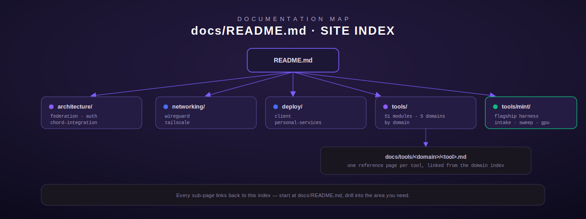

# Terminus documentation

This is the documentation index for [Terminus](../README.md) — the Rust MCP
tool hub and federated gateway for the Lumina constellation. The top-level
[`README.md`](../README.md) is the front door; every deeper page lives under
this `docs/` tree and links back here.

## Architecture

Deep-dives on how the pieces of Terminus fit together — the registry, the
gateway binary, identity, and the Chord boundary.

| Page | Description |
| --- | --- |
| [`architecture/federation.md`](architecture/federation.md) | How `terminus-primary` aggregates the core registry (served locally) with the personal registry's tools (federated in from `terminus_personal` over `crate::federation::PersonalFederationClient`) into one client-visible surface. |
| [`architecture/auth.md`](architecture/auth.md) | The mTLS client-identity model (`crate::pki`), per-identity certs, the `enroll` flow, and how a caller's `ClientIdentity` is forwarded through federation and audited. |
| [`architecture/chord-integration.md`](architecture/chord-integration.md) | The Terminus/Chord boundary: Terminus is tool egress + gateway/auth, Chord (a separate repo/process, [moosenet-io/Chord](https://github.com/moosenet-io/Chord)) is inference egress. Covers the inference-proxy forwarding routes, the short-lived service-JWT auth Terminus mints for Chord calls, and streaming semantics. |

## Networking

How to reach a Terminus deployment when the caller isn't already on the same
LAN as the gateway.

| Page | Description |
| --- | --- |
| [`networking/wireguard.md`](networking/wireguard.md) | Running Terminus's mTLS listener reachable over a WireGuard overlay — point-to-point tunnel setup and firewall posture. |
| [`networking/tailscale.md`](networking/tailscale.md) | Reaching Terminus over a Tailscale tailnet — an alternative to a self-managed WireGuard mesh for remote/off-LAN clients. |

## Deployment

How to stand up the pieces: a client that talks to Terminus, or a Terminus
deployment itself.

| Page | Description |
| --- | --- |
| [`deploy/client.md`](deploy/client.md) | Connecting a new MCP client to Terminus: enrollment, obtaining an mTLS client certificate, and choosing a transport (stdio vs. HTTP vs. mTLS). |
| [`deploy/personal-services.md`](deploy/personal-services.md) | Standing up `terminus_personal` (the personal/admin registry) and `terminus_primary` (the gateway binary that federates personal tools and proxies inference to Chord). |

## Tool reference

The full catalog of Terminus's ~300 tools, organized by domain.

| Page | Description |
| --- | --- |
| [`tools/README.md`](tools/README.md) | The tool index — all 51 modules grouped into five domains (Code & Git, Project & Planning, Infra & Ops, Models & Review, Personal & Life), each linking out to its per-tool pages. |
| [`tools/mint/`](tools/mint/) | **MINT** — the model-intake / serving-profile flagship harness (the `mint` CLI and its `intake`-module tools). Treated as its own small manual; see [`tools/README.md#mint-flagship`](tools/README.md#mint-flagship) for the overview and links into the full command/tool reference. |

## Conventions used across these docs

- **Source of truth is the code.** Every claim about a tool's behavior is
  read from its actual registration site, handler, and argument struct in
  this repo — never inferred from a name or a stale comment. Where a claim
  isn't obvious from reading the code, the page says so explicitly rather
  than guessing.
- **Per-tool pages are reference-grade.** Expect the exact input schema
  (every field, type, required/optional, default), output shape, error/edge
  cases, auth/identity requirements, environment variable *names* (never
  values), and a worked request/response example.
- **No secrets, no infra PII.** These pages mirror to a public GitHub repo.
  Environment variable names are used freely (`PLANE_API_URL`,
  `TERMINUS_MTLS_PORT`); actual hosts, IPs, and container identifiers are
  never included — placeholders like `<your-host>` or
  `https://gitea.example/...` stand in for them.
- **Diagrams match the house SVG style** — the same dark-canvas, purple-accent
  visual language as [`../assets/architecture.svg`](../assets/architecture.svg),
  used throughout for architecture, lifecycle, and request/dispatch diagrams.

Every page below the top-level README links back to this index — if you land
on a sub-page from a search engine or a direct link, "docs" in the breadcrumb
brings you back here.
