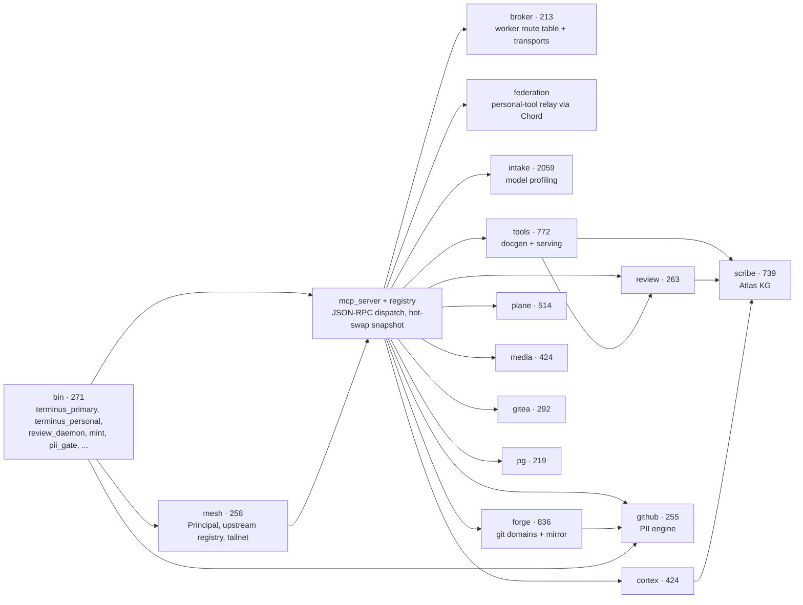

# Architecture

Terminus is one Rust crate (`terminus-rs`, plus two workspace members) compiled
into several binaries that each serve a different slice of the same tool
inventory. This page shows the subsystem map derived from the code knowledge
graph (11,905 nodes, 27,107 call edges at `3d0f277`), then walks each subsystem
and the life of a tool call.

## Subsystem map

Node label = subsystem · KG symbol count. Arrows are real static call
relationships verified in source (module docs and imports), oriented from
callers to callees; entry points sit leftmost.

## The subsystems

**bin (271 symbols, 12 binaries).** The deployment surface. `terminus_primary` is
the gateway binary: core registry (`register_all`), mTLS front door, personal-tool
federation, and an inference proxy relaying `/v1/chat/completions`-style routes to
the co-located Chord process. `terminus_personal` serves the personal/admin subset
over streamable-HTTP MCP and refreshes downstream secrets from the vault
(<secret-manager>) at every startup. `review_daemon` is the only place in the codebase
permitted to spawn CLI review providers; it is loopback-only, bearer-authenticated,
argv-only (never `sh -c`), with a sanitized child environment. `mint` is the
unified intake CLI over the same library entry points as the four standalone
`intake_*` binaries; `pii_gate` is the pre-push/pre-commit PII gate;
`cortex_calibrate` and `house_style_check` are quality-engine drivers; `gpu_mode`
manages GPU-authority state.

**mesh (258).** Caller identity and federation. `PrincipalResolver::map` — the
highest-ranked function in the whole graph — resolves whichever transport identity
is present (mTLS cert CN, tailnet WhoIs, named-PAT header) into one canonical
`Principal` name that drives both the gateway allowlist decision and downstream
credential selection (`PLANE_PAT_<NAME>` / `GITEA_PAT_<NAME>` / `GITHUB_PAT_<NAME>`).
`UpstreamRegistry` holds config-driven federation targets
(`TERMINUS_MESH_UPSTREAMS_JSON`); `TailnetServer` (feature `tsnet`) optionally embeds
a Tailscale node in-process.

**mcp_server + registry.** The dispatch core. `mcp_server` implements the
streamable-HTTP MCP wire protocol (`initialize`, `tools/list`, `tools/call`,
`GET /healthz`) against a `ToolRegistry` held in an `ArcSwap` so the active tool
set can be hot-swapped without restarting or tearing in-flight calls.
`registry::register_all` builds the 381-tool core set; `register_personal` the
189-tool personal set; `personal_only_tool_metadata` lets the gateway list
federated personal tools without a network hop.

**broker (213).** Out-of-process tool workers. A registry miss falls through the
atomically-swappable `RouteTable` to a worker reached over one of three transports
(UDS+peercred, UDS+mTLS, mTLS TCP) with a minimum-tier floor per capability class,
an authenticated admin control plane, and health-gated blue-green rollout for
worker updates. `terminus-worker-sdk` is the authoring kit for the worker side.

**intake (2,059).** The model-intake engine (MINT): discovery, context/coder/
assistant profiling suites, per-tier timeout policy (`timeouts`,
`code_v2::tier_default_timeout`), a 3-judge CLI panel, GPU authority locking,
durable jobs, and Postgres-backed operational profiles that downstream routing
consumes.

**forge (836).** The provider-agnostic forge abstraction: one endpoint vocabulary
(`ForgeEndpoint`) across two governance domains — `git_private` (self-hosted
source of truth, full R/W) and `git_public` (the exfiltration surface, PII gate
load-bearing on every write) — with concrete adapters (Gitea family, GitLab) and
honest capability maps. Its `mirror` layer maintains per-repo PII-swept public
mirror derivatives with their own linear history, driven by
`git_public_mirror_run`.

**tools (772).** `tools::docgen` is the sovereign documentation engine (facts
extraction, generation, PII gate, versioning, quality lints, guarded placement via
`docgen_place`-style single-writer placement — the only docgen component that
writes to a working tree) plus `serving_tools` for model-serving control/status.

**scribe (739).** Atlas: per-project code knowledge graphs. Extraction
(tree-sitter, ~14 languages), a persisted `GraphStore` (`SCRIBE_KG_STORE_DIR`),
PageRank + clustering, and the `kg_*` query tools (`kg_search`, `kg_neighbors`,
`kg_subgraph`, `kg_stats`, `kg_communities`, `kg_file_symbols`, ...). Also the
standing documentation agent (`scribe_*` tools) that dispatches long-form writing
through the review daemon.

**plane (514).** 43 tools wrapping the Plane CE REST API with multi-identity
PATs, a proactive shared rate budget, and a fail-open optional Redis-backed GET
cache and limiter so every Terminus process shares one rate budget.

**cortex (424).** The code-quality engine, rebuilt on Atlas after its SSH-relay
era was retired: `cortex_scope` (blast radius), `cortex_review` (structural
elegance + recurrence → risk score/band), `cortex_audit` (SSRF-hardened scratch
clone audit), house-style caching, and the calibration harness that measures
false-positive rates against actually-merged PRs before the gate may influence a
live review.

**media (424).** Typed, mock-friendly clients for the self-hosted media stack
(Radarr, Sonarr, Prowlarr, qtor, Plex, <media-service>, TMDb) and the
search/request/recommend tool surface on top, with graceful per-service
degradation.

**gitea (292) / github (255).** Direct forge tool suites predating the `forge`
abstraction and still serving the fleet: 20 Gitea tools (named-identity PATs,
merge queue) and the GitHub tools. `github::pii` is the authoritative PII
scan/redact engine shared by the GitHub write gate, the mirror engine, and the
`pii_gate` git-hook binary.

**review (263).** `review_run`: dispatches one review to 1–5 providers
concurrently (CLI providers via the review daemon; free-tier frontier models via
OpenRouter) in `single` / `adversarial_pair` / `panel_majority` /
`panel_unanimous` structures, parses verdicts, flags disagreement, injects KG
context, and tracks provider capacity (cooldown/shelve state machine).

**pg (219).** The single sanctioned Postgres door: named connection identities
(`POSTGRES_URL_<NAME>`, default `readonly`), statement classification per tool
(`pg_query` reads, `pg_execute` DML, `pg_ddl`, `pg_admin`), and per-occurrence
operator approval on every mutating call.

Also present but without dedicated reference pages yet: `compiler` (the
`compiler_*` CI/CD build door — see the BLD pages in [reference](reference/index.md)),
`constellation-web` (366 TS symbols, the control-plane web UI) with its
aggregation API in `src/constellation`, `compat` (161, vendored conversation/prompt
types), `config`, `pki`, `gateway_framework`, `federation`, `metrics`, `redis`, and
the many single-integration tool modules at the crate root.

## Life of a tool call

1. **Transport.** A caller reaches `terminus_primary`'s front door — the mTLS
   listener (leaf cert enrolled via `terminus-client` against `/enroll`), the
   loopback HTTP+JWT listener, or (feature-gated) the embedded tailnet.
2. **Identity.** The transport identity is resolved by
   `mesh::principal::PrincipalResolver` into one canonical `Principal`;
   `gateway_framework` applies the allowlist/rate-limit guard.
3. **Dispatch.** `mcp_server` takes one atomic registry snapshot and looks up the
   tool name. Local hit → `ToolRegistry::call` executes the `RustTool`. Miss →
   `broker::routes::RouteTable` may route to an out-of-process worker; otherwise a
   personal-registry name is federated to Chord's personal-tools relay
   (`federation`), authenticated with a short-lived service JWT.
4. **Tool execution.** The tool makes typed HTTP or parameterized SQL calls only:
   `plane`/`gitea`/`github`/`forge` hit their APIs with the Principal-selected
   PAT; `pg_*` opens the identity's `POSTGRES_URL_<NAME>` connection (mutations
   first passing the `approval` gate); `review_run` fans out to the review daemon
   and OpenRouter; `kg_*` reads the Atlas `GraphStore`; every public write crosses
   the `github::pii` gate first.
5. **Result.** Output (text, plus optional structured JSON via
   `execute_structured`) returns as an MCP `CallToolResult`; failures surface as
   `isError: true` tool results, never protocol errors; `metrics` counts the call
   in the Prometheus registry.
