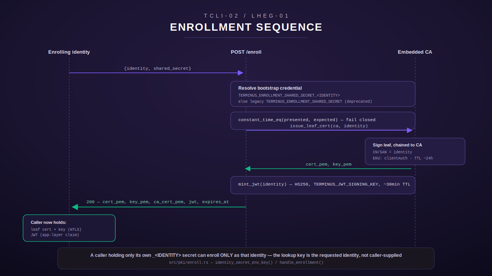
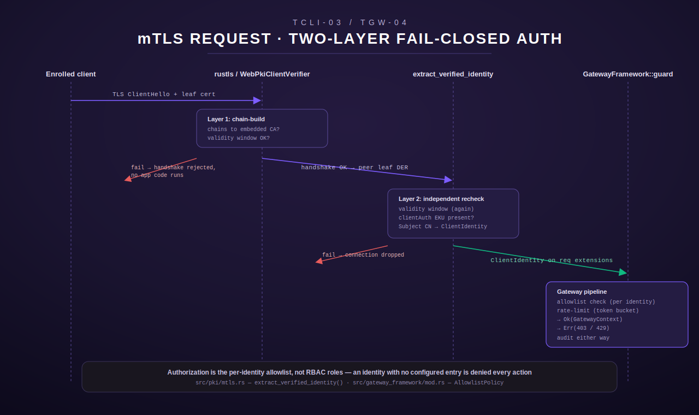

# Auth & Identity

Terminus's auth model has three layers that build on each other: an embedded
certificate authority Terminus generates and manages itself, a
shared-secret enrollment endpoint that turns that CA into short-lived client
credentials, and a per-identity allowlist (not RBAC roles) that decides what
an authenticated identity may actually do. A separate, unrelated mechanism —
the guarded-tool approval gate — adds a human-in-the-loop check on top of
identity for a small set of especially sensitive tools. This page covers all
four, plus the per-identity credential convention (`PLANE_PAT_<NAME>` /
`GITEA_PAT_<NAME>` / `GITHUB_PAT_<NAME>`) that flows through everything once
an identity is established.

See also: [../README.md](../README.md) · [federation.md](federation.md) ·
[chord-integration.md](chord-integration.md)

## The embedded CA

Terminus is its own certificate authority — no external `step-ca`/OpenSSL
bootstrap is required. `crate::pki::ca()` (`src/pki/mod.rs:115-147`) is the
single process-wide accessor: it bootstraps once (an in-process `Mutex`
serializes concurrent cold-start callers so two racing threads can't each
generate-and-persist a *different* CA, `src/pki/mod.rs:120-146`) and every
later call in the same process returns the identical `CertificateAuthority`.

Load-or-generate precedence, in order (`src/pki/mod.rs:43-73`, `153-212`):

1. **`TERMINUS_CA_CERT` + `TERMINUS_CA_KEY`** in the process environment —
   materialized from the runtime secret store at startup (see
   [secrets discipline](../README.md), and `crate::secrets_bootstrap`, which
   also carries these two keys — `src/secrets_bootstrap.rs:48-53`). Loaded,
   never regenerated; corrupt material here is a **hard startup error**, not
   a silent fallback. Exactly one of the pair being set (an operator typo) is
   also a hard error — it never silently falls through to a fresh CA
   (`src/pki/mod.rs:164-180`).
2. **The local store file** at `TERMINUS_CA_STORE_PATH` (default
   `~/.terminus/pki/ca_store.json`, `src/config.rs:440-452`) — loaded if
   present, written with `0600` permissions on persist, and those
   permissions are re-tightened on every write even if a looser-permission
   file already existed at that path (`src/pki/mod.rs:255-283`).
3. **Neither present** — generate a fresh CA and persist it to the local
   store. A persistence *failure* is a warning, not a hard error — the CA
   still works for the current process, it just regenerates on next restart
   (`src/pki/mod.rs:202-211`).

The root CA itself is long-lived (backdated 1 year, valid 10 years forward,
`src/pki/ca.rs:15-16`) — everything issued *by* it (enrollment leaf certs,
the server cert) is comparatively short-lived, described below.

## Enrollment: shared secret → short-lived leaf cert + JWT

`POST /enroll` (`crate::pki::enroll`, mounted at `TERMINUS_ENROLLMENT_PATH`,
default `/enroll`, `src/config.rs:464-469`) is the one place a caller
converts a bootstrap credential into usable credentials. Given
`{identity, shared_secret}`, a successful request returns
(`src/pki/enroll.rs:100-129`):

- `cert_pem` / `key_pem` — a fresh leaf keypair, signed by the embedded CA,
  with `identity` embedded in the cert's CN and SAN
  (`src/pki/enroll.rs:321-372`). TTL from
  `TERMINUS_ENROLLMENT_CERT_TTL_HOURS` (default 24h,
  `src/config.rs:471-480`). Carries the `clientAuth` EKU and
  `DigitalSignature` key usage — required for the mTLS handshake described
  below to accept it as a client cert (`src/pki/enroll.rs:352-356`).
- `ca_cert_pem` — the CA's own public cert, for the caller to pin locally.
- `jwt` — a short-lived JWT (`sub` = identity, HS256, signed with
  `TERMINUS_JWT_SIGNING_KEY`), TTL from
  `TERMINUS_ENROLLMENT_JWT_TTL_SECONDS` (default 1800s — deliberately
  shorter than the cert TTL, since it's the paired application-layer claim
  and should never outlive the transport-layer credential it accompanies,
  `src/pki/enroll.rs:384-412`).
- `expires_at` — a Unix timestamp covering the cert too (which has no `exp`
  claim of its own to introspect without parsing X.509).

The cert is the **transport-layer** identity (consumed by the mTLS
handshake); the JWT is a separate **application-layer** claim — belt and
suspenders, not redundant.



Re-enrollment of an identity that already has an outstanding cert is not
tracked or rejected — every valid request simply issues a fresh pair, since
short-lived certs are expected to be periodically refreshed
(`src/pki/enroll.rs:255-258`). The bootstrap-secret comparison itself is
constant-time (`constant_time_eq`, `src/pki/enroll.rs:204-219`) — a
hand-rolled comparator (no early-exit on length mismatch) so timing can't be
used to guess the secret byte by byte.

### Per-identity enrollment secrets (no-Moose guarantee)

As of LHEG-01, the bootstrap credential is looked up **per requested
identity**: `TERMINUS_ENROLLMENT_SHARED_SECRET_<IDENTITY_UPPERCASE>`
(hyphens become underscores — `identity_secret_env_key`,
`src/pki/enroll.rs:244-250`). This is a *structural* mechanism, not just a
policy statement: the env var key used to look up the expected secret is
derived from the **identity being requested**, never from anything the
caller supplies directly. A caller holding only
`TERMINUS_ENROLLMENT_SHARED_SECRET_LUMINA`'s value can therefore only ever
match the comparison run for identity `lumina` — presenting that same value
while requesting identity `moose` compares it against `moose`'s own
(unset, in that scenario) secret and fails
(`src/pki/enroll.rs:42-66`; regression test
`lumina_secret_enrolls_lumina_but_not_moose`,
`src/pki/enroll.rs:742-778`).

Identity shape is validated *before* the per-identity key is derived
(`is_valid_identity` — lowercase alphanumerics/hyphens, 2–63 chars, no
leading/trailing hyphen, `src/pki/enroll.rs:188-202`) — this closes off any
possibility of the requested identity string injecting something unexpected
into the derived env-var name.

**Legacy fallback:** if no per-identity secret is configured for the
requested identity, enrollment falls back to the unsuffixed
`TERMINUS_ENROLLMENT_SHARED_SECRET`, logging a `tracing::warn!` deprecation
notice each time (`src/pki/enroll.rs:274-290`). This keeps existing
enrollers working during the per-identity migration; it does not weaken the
no-Moose guarantee above in practice, since `lumina`/`harmony` are
provisioned only with their own suffixed secret, never the unsuffixed value.
An identity with *no* configured secret at all (neither per-identity nor
legacy) fails closed as `EnrollError::NotConfigured` — and the HTTP response
deliberately does not echo the identity name back, so this endpoint can't be
used to enumerate which identities are provisioned
(`src/pki/enroll.rs:159-169`).

Enrollment audit logs carry only identity + cert serial + issuance
timestamp — never the shared secret, the private key, or the JWT
(`src/pki/enroll.rs:74-77`, `306-310`; enforced by a source-scanning test,
`src/pki/enroll.rs:934-979`).

## The mTLS listener: additive, fail-closed, two independent layers

`crate::pki::mtls` (`src/pki/mtls.rs`) adds a **second**, additive listener
— it never wraps, gates, or replaces the existing plain HTTP+JWT `/mcp`
listener (`src/pki/mtls.rs:16-21`). It presents the primary's own server
leaf cert (issued by the same embedded CA,
`issue_server_cert`, longer-lived than client certs — 365 days by default,
since the server identity is stable and doesn't rotate the way enrolling
clients do, `src/pki/mtls.rs:134-146`, `src/config.rs:533-542`) and
**requires** every connecting client to present a valid TCLI-02-enrolled
cert chained to that same CA.



Validation is fail-closed at two genuinely independent layers
(`src/pki/mtls.rs:36-54`):

1. **`rustls`'s `WebPkiClientVerifier`** performs full PKIX chain-building
   against the embedded CA as part of the TLS handshake itself — a cert
   that doesn't chain, or is outside its validity window, never completes
   the handshake and never reaches any Rust application code at all
   (`build_server_config`, `src/pki/mtls.rs:201-226`).
2. **`extract_verified_identity`** is an explicit, independently-testable
   *second* check run after the handshake completes, against the peer's
   leaf DER (`src/pki/mtls.rs:253-283`): it re-checks the validity window
   (belt-and-suspenders) and additionally enforces the `clientAuth` EKU,
   which `WebPkiClientVerifier` does not check by default. Either failure
   rejects the connection before a single byte of the wrapped HTTP request
   is dispatched. The identity itself is read from the leaf's Subject
   Common Name — the exact value TCLI-02 embedded at enrollment time.

Because `axum::serve` has no supported hook for attaching per-connection
data before a request reaches the router, this listener terminates TLS and
drives HTTP framing itself with `hyper` directly
(`serve_connection`, `src/pki/mtls.rs:368-399`), inserting the validated
`ClientIdentity` into every request's extensions on that connection *before*
handing off to the same shared `axum::Router` the plain listener serves —
so tool dispatch, allowlisting, and audit code is reused unmodified, never
forked into a parallel mTLS-only path.

A single connection's handshake or identity-check failure is logged (never
with raw cert/key material, only "identity unknown/rejected" plus the peer
address) and drops that one connection — it never tears down the listener
or affects any other connection (`src/pki/mtls.rs:310-361`).

**Known limitation (documented, not silently unhandled):** CA rotation is
not supported in the current design — a single embedded CA, no rotation
plan. A long-lived connection whose short-lived client cert expires
mid-connection is also not force-closed; the handshake-time check covers
the cert at connect time only, matching normal HTTP keep-alive behavior
(`src/pki/mtls.rs:56-70`).

## JWT service tokens

Two distinct JWTs appear in this system, and they are not interchangeable:

- **Enrollment JWT** (`EnrollmentClaims{sub, exp, iat}`,
  `src/pki/enroll.rs:143-153`) — the application-layer claim paired with a
  client cert at enrollment time, `sub` = the enrolled identity.
- **Chord service JWT** (`ChordServiceClaims{sub, exp}`,
  `src/federation/mod.rs:98-108`) — minted fresh per outbound call to Chord
  (`mint_service_jwt`, `src/federation/mod.rs:309-329`), `sub` **hard-pinned
  to `"lumina"`** because that's the only subject Chord's own
  `validate_jwt` accepts, signed with `TERMINUS_PRIMARY_CHORD_JWT_SECRET`
  (same value as Chord's `CHORD_JWT_SECRET`). This authenticates
  *terminus-primary as a service* to Chord — it is never the calling
  human/agent's own identity; that's carried separately as the
  `X-Terminus-Client-Identity` header. See
  [federation.md](federation.md) for the full federation contract.

## Authorization is the allowlist, not roles

Once an identity is established (by cert, for mTLS traffic), *what it may
do* is governed entirely by `AllowlistPolicy`
(`src/gateway_framework/mod.rs`) — a flat, per-identity, config-driven
policy read from `TERMINUS_GATEWAY_ALLOWLIST_JSON`, not a role/permission
hierarchy. There is no notion of roles, scopes, or inherited permissions
here: an identity either has a grant naming the action (or `"*"`) or it has
nothing, and "nothing" always means denied, never "inherits some default".

Each identity's grant (`Grant`) is one of two shapes:
- a plain allow-list (`["a", "b", "*"]`) — the original form, still fully
  supported; `moose`/`claude` use this for unrestricted `["*"]` access.
- an allow/deny object (`{"allow": [...], "deny": [...]}`, LHEG-07) — `deny`
  entries are PREFIXES checked first and win even over `allow: ["*"]`. This
  is what lets `lumina`/`harmony` be granted broad utility access without
  hand-listing every one of the ~300 legitimate tool/route names, while
  still keeping them off moose-scoped/sensitive routes: their default
  scaffold (`SCAFFOLDED_IDENTITIES`/`scaffold_defaults`) is `allow: ["*"]`,
  `deny: DEFAULT_SENSITIVE_DENY_PREFIXES` (`github_`, `git_public`,
  `git_private`, `gitea_cargo_publish`/`_yank`, the secrets-manager
  `infisical_` prefix, `ansible_`, `openhands_`, `approval_`, three
  destructive `dev_*` actions, `routines_batch_`, and two `soma_*`
  governance actions) — closing the hole where a bare `"*"` grant would
  otherwise let either identity reach credentials like the primary's
  GitHub PAT or mirror-push creds "using Moose where available".

This is covered in full, including the rate-limit and audit stages it sits
between, in [federation.md](federation.md)'s "gateway pipeline" section.

## Unified `Principal` identity (MESH-06)

Three identity concepts described above — the mTLS cert CN
(`crate::pki::mtls::ClientIdentity`), the tailnet WhoIs identity
(`crate::mesh::TailnetIdentity`, MESH-05), and the named-PAT identity model
just below — historically had no single reconciliation point: the gateway's
`AllowlistPolicy` keyed directly off a raw `ClientIdentity`'s CN string, with
an interim `sub="lumina"` pin plus an `X-Terminus-Client-Identity` header as
a workaround for cases the cert CN alone didn't cover. `crate::mesh::Principal`
(`src/mesh/principal.rs`) and its resolver, `crate::mesh::PrincipalResolver`,
replace that ad hoc reconciliation with one canonical identity `name` — in
the SAME string space `PLANE_PAT_<NAME>` / `GITEA_PAT_<NAME>` /
`GITHUB_PAT_<NAME>` already use (see the PAT convention section below) — that
drives both the gateway allowlist decision and downstream PAT selection.
`GatewayFramework::guard` (`src/gateway_framework/mod.rs`) takes a
`Option<&Principal>` rather than a raw `Option<&ClientIdentity>`, using
`Principal::name()` as the allowlist/audit key.

**Config**: `TERMINUS_MESH_PRINCIPAL_MAP_JSON`, a JSON object with three
independent, all-optional lookup tables:

```json
{
  "cert_cn": { "<mTLS cert Subject CN>": "<canonical name>" },
  "tailnet_login": { "<tailnet login>": "<canonical name>" },
  "tailnet_tag": { "<tailnet ACL tag, e.g. \"tag:ci\">": "<canonical name>" }
}
```

**Precedence** (`PrincipalResolver::resolve(cert, tailnet)`), deterministic
and fail-closed:

1. A present mTLS cert identity is checked **first and exclusively**. If its
   CN has a `cert_cn` mapping entry, that entry's name is the result —
   `PrincipalSource::MtlsCert` (or `PrincipalSource::Both` when a tailnet
   identity also happens to be present on the same request; the tailnet
   identity is carried on the resolved `Principal` for observability but
   never changes which name wins). If the CN has **no** mapping entry,
   resolution fails closed (`AuthError::UnmappedIdentity`) — it never falls
   back to consulting the tailnet identity instead, even when the tailnet
   identity IS mapped.
2. Only when **no** cert identity is presented at all is the tailnet
   identity consulted: `tailnet_login` first, then each of the identity's
   `tags` against `tailnet_tag` (first configured match wins — ACL tags on a
   tailnet node carry no inherent priority order of their own). Unmapped ⇒
   `AuthError::UnmappedIdentity`.
3. Neither transport identity presented at all ⇒
   `AuthError::NoIdentityPresented`.

This makes the mTLS layer's own fail-closed guarantees (see "The mTLS
listener" above) the stronger signal, while still supporting a tailnet-only
deployment shape for callers that never present a client cert.

**Edge case — a resolved name with no provisioned PAT**: resolution only
consults the configured mapping; it never probes whether a matching
`PLANE_PAT_<NAME>` / `GITEA_PAT_<NAME>` / `GITHUB_PAT_<NAME>` secret actually
exists. A `Principal` for a mapped-but-unprovisioned name still resolves
successfully and gateway RBAC still applies normally — the missing-credential
failure surfaces later, at the point a downstream client's own
`for_identity()`-equivalent call fails (exactly like
`PlaneClient::for_identity`'s existing `ToolError::InvalidArgument` for an
unconfigured name today).

**Scope of this item**: MESH-06 delivers the `Principal` model, the resolver,
and `guard()`'s new signature — it does not yet wire `PrincipalResolver::resolve`
into the live request path with both a real mTLS extension and a real tailnet
extension pulled off one request (replacing the `sub="lumina"` pin /
`X-Terminus-Client-Identity` header workaround end to end). `src/mcp_server.rs`'s
existing `guard()` call sites keep working unchanged in behavior via
`Principal::from(&ClientIdentity)` — a direct, resolver-bypassing conversion
that uses the raw cert CN as the principal name, identical to `guard()`'s
pre-MESH-06 behavior. Routing those call sites through the resolver (so a
cert CN like `harmony-primary.example.test` maps to the canonical name
`harmony` rather than being used verbatim) is MESH-07's job.

## Per-identity PAT convention (Plane / Gitea / GitHub)

Once a caller is authenticated to Terminus, several tool modules
(`plane`, `gitea`, and the `github` git-forge adapter) resolve a **separate**,
per-identity credential of their own for calls *out* to those external
systems — this is independent of the mTLS/JWT identity above, though the two
are meant to line up operationally (e.g. the `lumina` mTLS identity acting
through the `PLANE_PAT_LUMINA` Plane identity).

The convention is uniform across all three:

- `PLANE_PAT_<NAME>` (e.g. `PLANE_PAT_CLAUDE`, `PLANE_PAT_HARMONY`) —
  `src/plane/mod.rs:9-55`.
- `GITEA_PAT_<NAME>` (e.g. `GITEA_PAT_MOOSE`, `GITEA_PAT_LUMINA`) — the
  *sole* Gitea auth mechanism now; the old unsuffixed `GITEA_TOKEN` was
  retired — `src/gitea/mod.rs:9-14`.
- `GITHUB_PAT_<NAME>` — alongside an unsuffixed `GITHUB_TOKEN` fallback for
  the git-public adapter.

Each client type exposes a `resolve_identity(&args)` method
(`src/plane/mod.rs:855`, `src/gitea/mod.rs:368`) that every tool call routes
through: an explicit `identity` argument selects a named `*_PAT_<NAME>`
client; omitting it falls back to a configured default (`PLANE_IDENTITY_NAME`
/ `GITEA_IDENTITY_NAME`, the latter defaulting to `moose`). `plane_whoami` /
`gitea_list_identities`-style tools report which identities are configured
and can verify a token is still accepted — but never return a token value.

These PATs are materialized into the process environment the same way CA
material is: fetched from the runtime secret store at startup via
`crate::secrets_bootstrap::bootstrap_gitea_plane_github_secrets`
(`src/secrets_bootstrap.rs:131-188`). Rather than a fixed list, any secret
key beginning with `PLANE_PAT_` / `GITEA_PAT_` / `GITHUB_PAT_` /
`GITLAB_PAT_` (`PAT_KEY_PREFIXES`, `src/secrets_bootstrap.rs:66-87`) is
picked up dynamically — a newly-provisioned identity becomes usable on the
next restart with no code change, while a key from an unrelated secret
sharing the same store path is never imported (a fixed **prefix set**, not
"import everything found here"). A present-but-blank value is treated as
absent, never set as an empty string (`src/secrets_bootstrap.rs:150-177`).

## Guarded-tool approval gate

Separate from identity/authz above, a small set of especially sensitive
tools (Ansible playbook execution, OpenHands, <secret-manager> writes) require a
**per-occurrence human approval** before they run at all, regardless of
which identity is calling. `crate::approval::gate` (`src/approval.rs:94-154`)
is called at the very start of a guarded tool's `execute()`:

- With no `_approval_code` in the arguments, it writes a `pending` row
  (a 6-char, unambiguous-alphabet code — no `I`/`O`/`0`/`1`,
  `src/approval.rs:58-79`) to `tool_approvals` in Postgres and refuses the
  call with an "APPROVAL REQUIRED" message naming the code.
- The operator approves out of band (`approve <CODE>` in chat, handled
  deterministically by lumina-core — **not** an LLM turn), which flips the
  row to `approved` and re-dispatches the original call with the code
  attached.
- The gate then atomically consumes an approved, unexpired, unused grant —
  single use (`src/approval.rs:107-118`).

**Content-binding**: a code is scoped to `(tool_name, args)`, not just
`tool_name` — consumption requires the args presented now (with
`_approval_code` stripped) to match, as JSON, the args that were pending
when the operator approved it (`content_of`, `src/approval.rs:85-91`). This
closes a real gap: without it, a code approved for one call could be
redeemed against a *different*, more destructive set of args for the same
tool. `approval_grant`/`approval_deny` are internal tools, callable only by
lumina-core's deterministic command handler — the model can never approve
its own request, and every guarded-tool call is additionally hard-blocked
inside the agentic loop at the Chord level.

### Mesh propagation: the gate applies to federated calls too (MESH-09)

The gate above describes a LOCAL guarded tool's own `execute()`. A guarded
tool can also live on a remote mesh upstream and be reached through a
namespaced `<namespace>__<tool>` name (see the "Mesh" section of the
README). Federation must not be a side door around human approval, so
`src/mcp_server.rs`'s `tools/call` handler runs the identical gate at the
**gateway**, before a `CallRoute::Upstream` call is forwarded anywhere:

- `crate::approval::is_guarded(bare_name)` classifies guardedness by the
  BARE (de-namespaced) tool name, so `ct322__ansible_run_playbook` is
  recognized as guarded exactly like local `ansible_run_playbook` — the
  classification list is a static mirror of every tool that calls `gate()`
  in the `ansible`/`openhands`/`<secret-manager>`/`routines`/mirror modules.
- `crate::approval::mesh_gate_args(args, namespace)` folds the target
  upstream's namespace into the content `gate()` binds the code to (on top
  of `content_of`'s existing arg-stripping), so a code approved for
  `ct322__ansible_run_playbook` cannot be redeemed against
  `other__ansible_run_playbook` — cross-upstream replay is rejected the
  same way a differing-args replay already is.
- The gateway's gate runs and must return `Granted` **before** `mcp_server`
  calls `UpstreamClient::call_tool` at all; it is authoritative regardless
  of whether the upstream process also enforces its own approval gate on
  the same tool (double-gating is expected, never treated as redundant and
  skipped).
- If `Granted` but the subsequent upstream call then fails at the transport
  layer (upstream unreachable/unhealthy), `crate::approval::unconsume`
  reverts the grant's `consumed`/`consumed_at` state back to `approved` so
  the SAME code remains usable on retry — approval was for "run this call",
  not "spend the code on one connectivity attempt".

---

Cross-reference: [federation.md](federation.md) covers how an authenticated
identity's request actually flows through dispatch (core-local vs.
federated-personal vs. inference-proxy); [chord-integration.md](chord-integration.md)
covers the Chord-facing side of the service-JWT credential described above.
