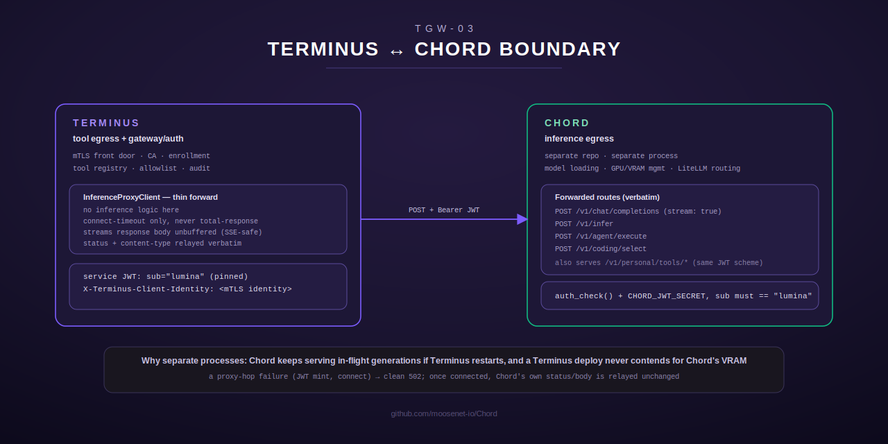

# Chord Integration

Terminus and [Chord](https://github.com/moosenet-io/Chord) are separate
repositories and separate processes with a clean division of responsibility:
**Terminus is tool egress plus the gateway/auth front door; Chord is
inference egress.** This page covers that boundary, why it's a process
boundary and not just a module boundary inside one binary, and the specifics
of the one hop Terminus makes into Chord for inference — a thin,
purely-forwarding proxy with no inference logic of its own.

See also: [../README.md](../README.md) · [federation.md](federation.md) ·
[auth.md](auth.md)

## Why two processes, not one

Chord owns model loading, GPU/VRAM management, and LiteLLM-based routing —
all genuinely stateful, resource-heavy responsibilities that are unrelated
to Terminus's job of being a governed MCP tool surface. Keeping them as
separate processes (`moosenet/Chord` vs. `moosenet/Terminus`) buys two
concrete things that a shared-process design would not:

- **Independent restart.** A Terminus deploy, config reload, or crash never
  interrupts an in-flight generation on Chord — Chord keeps serving
  regardless of what's happening to Terminus, and vice versa.
- **No VRAM contention from tooling.** Terminus's own workload (tool
  dispatch, PKI, HTTP routing) never competes with Chord for the GPU memory
  Chord is actively managing for inference. A bug or load spike in tool
  dispatch cannot thrash VRAM the way concurrent inference contention can.

Terminus is the **primary front door** — the mTLS gateway described in
[auth.md](auth.md) and [federation.md](federation.md) is the single entry
point agents actually connect to. Chord bolts on behind it purely as the
inference backend Terminus proxies to; agents never talk to Chord directly
for the routes this page covers.

## The inference proxy: a thin, verbatim forward

`crate::inference_proxy` (`src/inference_proxy/mod.rs`) forwards four of
Chord's client-facing routes, all confirmed (by reading Chord's own
`src/routes.rs`) to be gated by the identical
`auth_check`/`CHORD_JWT_SECRET` scheme:

| Route | Purpose |
|---|---|
| `POST /v1/chat/completions` | OpenAI-compatible LLM proxy; supports `stream: true` |
| `POST /v1/infer` | Single-prompt, backend-aware inference |
| `POST /v1/agent/execute` | Guarded agentic tool-calling loop (also streams via SSE) |
| `POST /v1/coding/select` | Fleet-driven coding-model resolution |

(`src/inference_proxy/mod.rs:12-21`, path constants at
`src/inference_proxy/mod.rs:89-92`.) `terminus-primary` mounts these at the
identical paths Chord itself serves them on.

This is explicitly a **thin proxy hop**: no inference logic lives in
Terminus. `InferenceProxyClient::forward` (`src/inference_proxy/mod.rs:223-286`)
does exactly four things:

1. Mints the same short-lived service JWT the personal-tool federation uses
   (`mint_service_jwt`, shared with `crate::federation` — see
   [federation.md](federation.md) and [auth.md](auth.md) for why `sub` is
   hard-pinned to `"lumina"`). No new secret is introduced; this reuses
   `TERMINUS_PRIMARY_CHORD_JWT_SECRET`.
2. Strips hop-by-hop headers (RFC 7230 §6.1), the caller's own
   `Authorization` header (replaced with the minted service JWT, never
   forwarded), and any **inbound** `X-Terminus-Client-Identity` header — a
   client cannot forge this; only the server-derived mTLS identity is
   appended (`is_unforwardable_request_header`,
   `src/inference_proxy/mod.rs:109-127`).
3. Forwards the request body verbatim to `{base_url}{path}` on Chord.
4. Relays Chord's response back **unbuffered**: status code and
   `content-type` verbatim, body streamed chunk by chunk via
   `Body::from_stream` — never buffered into one `Vec<u8>`
   (`src/inference_proxy/mod.rs:268-285`). This is what lets `stream: true`
   chat completions (and any other `text/event-stream` Chord route) pass
   SSE chunks through end to end, matching Chord's own upstream-relay
   behavior one hop earlier.

### Transport target and timeouts

The inference proxy reuses `TERMINUS_PRIMARY_CHORD_URL` — the *same* base
URL TGW-02's personal-tool federation already targets
(`crate::config::chord_personal_federation_url`, default
`http://127.0.0.1:8099` for a co-located deploy) — rather than adding a
second, always-identical URL knob, since Chord mounts both
`/v1/personal/tools/*` and these inference routes on one router
(`src/config.rs:585-613`).

It deliberately configures **only a connect timeout**
(`TERMINUS_PRIMARY_CHORD_INFERENCE_CONNECT_TIMEOUT_MS`, default 5000ms,
`src/config.rs:646-658`) — never a total-response timeout. A streamed
generation can legitimately run far longer than any reasonable fixed
deadline, so once the connection is established, Chord's response is
relayed for exactly as long as Chord keeps sending it
(`InferenceProxyClient::with_base_url`, `src/inference_proxy/mod.rs:181-196`).

### Errors: proxy-hop failures vs. Chord's own responses

A failure to reach Chord at all — JWT minting failure, connection refused,
connect timeout — short-circuits to a clean `502 Bad Gateway` JSON error
back to the mTLS caller (`InferenceProxyError`, `src/inference_proxy/mod.rs:132-154`).
It never hangs and never silently falls back to a different inference path;
this thin proxy has no fallback logic of its own by design.

Once connected, whatever Chord itself returns — `200`, its own `401`/`503`/
anything else — is relayed **verbatim**, status and body unchanged. Terminus
never reinterprets Chord's own error semantics
(`src/inference_proxy/mod.rs:65-72`).

## Relationship to personal-tool federation

The inference proxy and the personal-tool federation client
(`crate::federation::PersonalFederationClient`, see
[federation.md](federation.md)) are deliberately separate modules that share
exactly one thing: the JWT minter (`mint_service_jwt`) and the caller-identity
header convention (`CLIENT_IDENTITY_HEADER`). They differ in every other
respect that matters — personal-tool federation targets a JSON-RPC-shaped
tool call with a bounded total timeout, while the inference proxy is a raw
HTTP/SSE forward with only a connect timeout, since a personal tool call is
expected to complete quickly while an inference request may stream for
minutes. Keeping them as separate modules, rather than one that
tries to serve both shapes, keeps each one's timeout and streaming behavior
correct for its own use case without conditional logic threaded through a
shared code path.

---

Repository: [github.com/moosenet-io/Chord](https://github.com/moosenet-io/Chord).

Cross-reference: [auth.md](auth.md) covers the CA/enrollment/mTLS machinery
this hop's identity forwarding depends on; [federation.md](federation.md)
covers the sibling personal-tool federation hop and the full gateway
pipeline both this proxy and personal-tool dispatch pass through.
