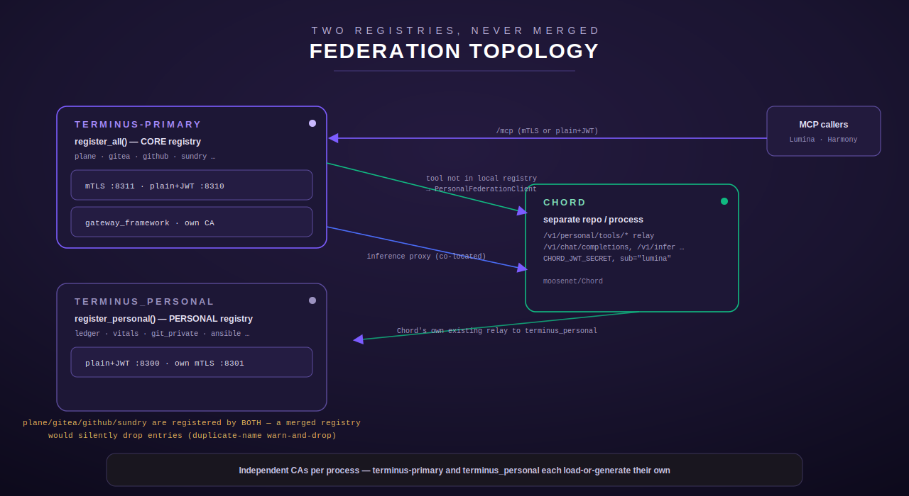
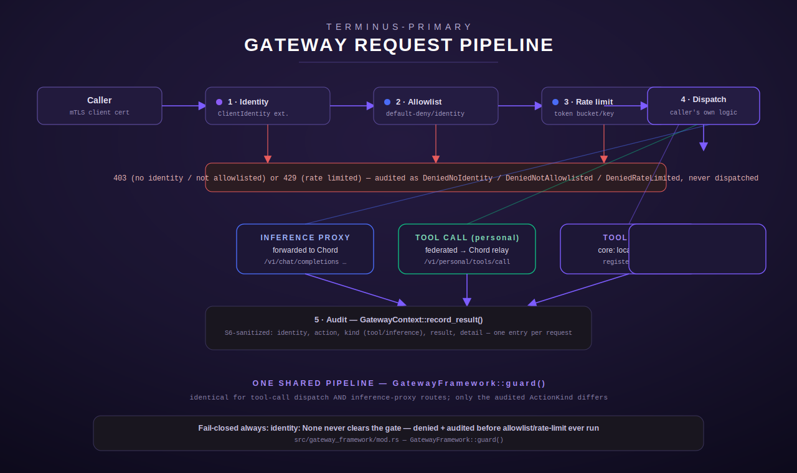

# The Federated Gateway

`terminus-primary` is the single front door for the full CORE tool registry,
served behind mTLS. It is a distinct binary from `terminus_personal` (the
existing personal-registry deployment) and reaches the personal-registry's
tools not by absorbing them into its own process, but by **federating** each
call across the network to Chord's already-live relay. This page covers how
that front door is built, the uniform pipeline every request goes through, how
personal tools are reached, and — the part that surprises people first — why
the two tool registries are never simply merged into one process.

See also: [../README.md](../README.md) · [auth.md](auth.md) ·
[chord-integration.md](chord-integration.md)

## `terminus-primary`: one front door, the CORE registry only

`terminus-primary` (`src/bin/terminus_primary.rs`) registers **only**
`registry::register_all` — the core tool set (git-public, plane, gitea,
github, etc.) — into its own `ToolRegistry` (`src/bin/terminus_primary.rs:133-134`).
It deliberately does **not** also call `registry::register_personal` in the
same process. It exposes two listeners built from the same shared router
(`crate::pki::server::build_gateway_router` /
`spawn_mtls_listener`, `src/pki/server.rs:92-175`):

- `TERMINUS_PRIMARY_BIND`/`TERMINUS_PRIMARY_PORT` — plain HTTP, optionally
  gated by a bearer token (`TERMINUS_PRIMARY_TOKEN`). Defaults to
  `127.0.0.1:8310` (`src/bin/terminus_primary.rs:65-75`).
- `TERMINUS_PRIMARY_MTLS_BIND`/`TERMINUS_PRIMARY_MTLS_PORT` — the mTLS
  listener, defaulting to `127.0.0.1:8311` (`src/config.rs:558-574`) — see
  [auth.md](auth.md) for the handshake itself.

Both listeners serve the identical `axum::Router`, so tool dispatch,
allowlisting, and audit behave the same regardless of which port a request
arrived on (`src/pki/server.rs:1-33`). `terminus_personal` keeps running
alongside this on its own, separate port family (`TERMINUS_PERSONAL_*` /
`TERMINUS_MTLS_*`, defaults `:8300`/`:8301`) — `terminus-primary` does not
narrow, replace, or wrap it.

## Why the two registries never combine into one process

This isn't just a deployment-topology preference — combining them is
structurally broken today. `register_all` (core) and `register_personal`
(personal) both register the `plane`, `gitea`, `github`, and `sundry` tool
modules **under the same tool names**
(`crate::registry::core_personal_name_collisions`, `src/registry.rs:249-263`,
confirmed by a dedicated regression test in `src/bin/terminus_primary.rs`'s
own test module). `ToolRegistry` handles a duplicate name registration with a
silent `tracing::warn!`-and-drop — so building one combined registry from both
functions would silently lose every colliding tool's second registration,
with no error surfaced anywhere. Not building that combined registry in the
first place is the fix; `terminus-primary` instead reaches the
personal-registry-exclusive tools (`git_private`, `ledger_*`, `vitals_*`, and
anything else not present in `register_all`) via federation, described below.

`crate::registry::personal_only_tool_metadata` (`src/registry.rs:236-247`)
computes exactly that "personal, minus anything core already serves" set —
this is what `terminus-primary`'s `tools/list` uses to advertise an
*aggregated* catalog (local core tools + federated-only personal tools)
without a network round trip on every listing, since tool metadata (name,
description, schema) is static and known in-process even though *dispatch*
for the federated-only tools needs the network hop.

## The gateway pipeline: every request, one path

Every request `terminus-primary` serves — a `tools/call` dispatch (core or
federated-personal) *and* an inference-proxy forward — passes through the
identical `GatewayFramework::guard()` call (`src/gateway_framework/mod.rs:237-286`)
before the caller's own dispatch logic runs:

1. **Identity.** The caller's identity comes *only* from the mTLS-derived
   `ClientIdentity` request extension, attached by
   `crate::pki::mtls::run_listener` after a successful handshake — never
   from a client-supplied field or header. `None` fails closed
   unconditionally (`src/gateway_framework/mod.rs:69-73`, `243-259`).
2. **Allowlist.** `AllowlistPolicy`, built from
   `TERMINUS_GATEWAY_ALLOWLIST_JSON` (`src/config.rs:669-678`) — a JSON
   object of `identity -> [action, ...]`, `"*"` meaning "every action for
   this identity". **Default-deny**: an identity with no entry at all is
   denied everything, not implicitly allowed
   (`src/gateway_framework/mod.rs:89-147`).
3. **Rate-limit.** An interim in-process token bucket, keyed per
   `(identity, action)` (`src/gateway_framework/rate_limit.rs`), explicitly
   documented as replaceable later by a shared/Redis-backed limiter without
   touching the pipeline's call sites (`RateLimiter` trait boundary,
   `src/gateway_framework/rate_limit.rs:27-41`). Burst/refill are
   `TERMINUS_GATEWAY_RATE_LIMIT_BURST` (default 20) and
   `TERMINUS_GATEWAY_RATE_LIMIT_REFILL_PER_SEC` (default 5)
   (`src/config.rs:680-700`).
4. **Dispatch.** `guard()` itself does not dispatch — it returns
   `Ok(GatewayContext)`, and the *caller* (the tool-call handler or the
   inference-proxy handler) performs its own dispatch exactly as before this
   pipeline existed (`src/gateway_framework/mod.rs:32-36`).
5. **Audit.** Every request gets exactly one structured, S6-sanitized audit
   entry on the `gateway_audit` tracing target — a denial is logged inside
   `guard()` itself (since there's no later point to log from); a
   dispatched request's outcome is logged once by the caller via
   `GatewayContext::record_result(success, detail)` after dispatch completes
   (`src/gateway_framework/mod.rs:163-179`, `src/gateway_framework/audit.rs`).
   `detail` is passed through `audit::sanitize` — secret-shaped `key=value`
   pairs and `Bearer <token>` values are redacted, and the result is
   truncated to 200 chars (`src/gateway_framework/audit.rs:33-72`).

A denial returns a ready-to-send `403` (no identity, or not allowlisted) or
`429` (rate-limited) response — already audited by the time `guard()`
returns, so the caller never double-logs it
(`src/gateway_framework/mod.rs:229-234`).

## Reaching personal tools: federation, not a second local registry

When a `tools/call` name isn't found in `terminus-primary`'s local core
registry, it is proxied to Chord's existing
`POST /v1/personal/tools/call` relay via `PersonalFederationClient`
(`src/federation/mod.rs`), rather than adding a second, direct
`terminus-primary → terminus_personal` network path. Chord already federates
`/v1/personal/tools/{list,call}` to the personal-registry host (Chord's own
`src/routes.rs::{personal_tools_list, personal_tools_call}`) — this module is
simply the client side of that same, already-working relay
(`src/federation/mod.rs:1-19`).

**Auth to Chord** is a short-lived service JWT, not `terminus-primary`'s own
mTLS identity. Chord's `/v1/personal/tools/*` (and, per TGW-03, its inference
routes too) gate on the identical `auth_check`/`CHORD_JWT_SECRET` scheme
Chord's own `/v1/tools/*` uses — and that scheme **hard-requires
`sub == "lumina"`**; any other subject is rejected as
`AuthError::InvalidSubject` on Chord's side. So `mint_service_jwt()`
(`src/federation/mod.rs:309-329`, reused verbatim by the inference proxy,
`src/inference_proxy/mod.rs:33-41`) mints a minimal, 120-second-lived
`{"sub": "lumina", "exp": ...}` credential signed with
`TERMINUS_PRIMARY_CHORD_JWT_SECRET` — the *same value* as Chord's own
`CHORD_JWT_SECRET`, provisioned into both processes' environments
identically at deploy time. This is deliberately **not** the calling
human/agent's own identity — Chord's claim schema has no room for a second
identity field.

The **caller's** actual identity (the mTLS `ClientIdentity` that reached
`terminus-primary`'s front door, if any) is instead forwarded as a plain
header, `X-Terminus-Client-Identity` (`CLIENT_IDENTITY_HEADER`,
`src/federation/mod.rs:116`), alongside the service JWT — additive metadata
for the tool/audit log on Chord's side, not a second auth mechanism; Chord's
own JWT check is what actually gates the request.

### Error classification: transport vs. tool-level

Chord's `proxy_error_response` maps a federated call's outcome to a specific
status, and `PersonalFederationClient::call_tool` mirrors that into two
buckets (`src/federation/mod.rs:53-74`, `217-280`):

| Chord status | Meaning | This client's result |
|---|---|---|
| `200` | Tool ran, succeeded | `Ok(FederationCallResult{is_error:false})` |
| `404` | Tool not found on the personal-registry host | `Ok(FederationCallResult{is_error:true})` — tool-level, not a `FederationError` |
| `502` | Tool ran on the personal-registry host and failed | `Ok(FederationCallResult{is_error:true})` |
| `504` | Chord's own hop to the personal-registry host timed out | `Err(FederationError::Timeout)` |
| `503` | Chord has no personal-registry backend configured at all | `Err(FederationError::BackendUnconfigured)` |
| `401` | Chord rejected the service JWT | `Err(FederationError::AuthRejected)` |
| `429` | Chord rate-limited the federation caller | `Err(FederationError::RateLimited)` |
| (unreachable) | connection refused / DNS / TLS failure | `Err(FederationError::Unreachable)` |

The distinction matters to callers: a `FederationError` means no tool-shaped
answer ever came back (the federation hop itself broke) and should surface as
a transport error; an `Ok(FederationCallResult{is_error:true})` means the
relay *did* reach the personal-registry host and got a real (if failing)
tool-shaped answer — the caller should treat it exactly like any other tool
error, not a federation problem.

Inference-proxy requests (`/v1/chat/completions`, `/v1/infer`,
`/v1/agent/execute`, `/v1/coding/select`) reuse this same service-JWT
mechanism and caller-identity header, forwarded by `InferenceProxyClient` —
see [chord-integration.md](chord-integration.md) for that hop's specifics
(streaming, connect-timeout-only, and why it's a separate module from tool
federation despite sharing the JWT minter).

## Independent CAs, by construction

Each binary provisions its own CA material independently:
`crate::pki::ca()`'s load-or-generate precedence
(`TERMINUS_CA_CERT`/`TERMINUS_CA_KEY` env, then a local store file, then
fresh generation — see [auth.md](auth.md)) reads from *that process's own*
environment. Two binaries — `terminus-primary` and `terminus_personal` — each
with independently provisioned CA material naturally end up with distinct CA
identities, with no special-casing required in `src/pki/server.rs` for this
(`src/pki/server.rs:116-124`).

---

Cross-reference: [auth.md](auth.md) covers the CA, enrollment, and the mTLS
handshake itself in depth; [chord-integration.md](chord-integration.md)
covers the inference-proxy hop and the Terminus/Chord process boundary.
