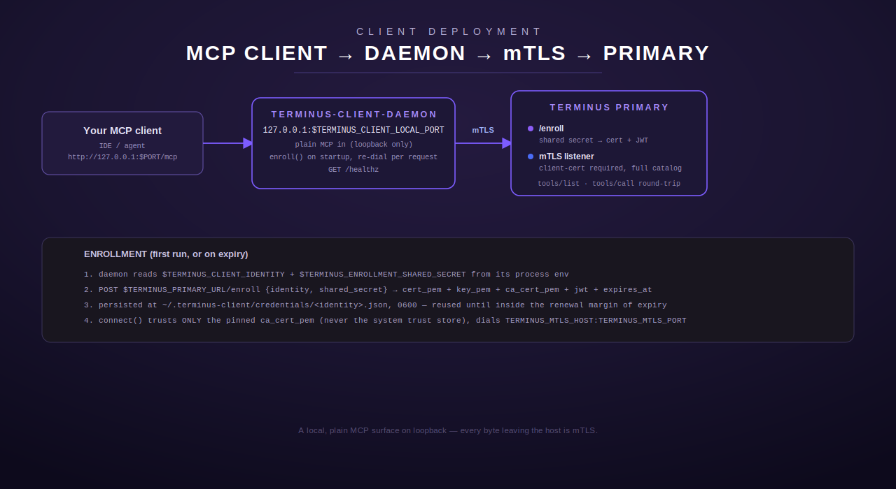

# Client deployment: `terminus-client-daemon`



This is the guide for connecting an **outside client** — your own machine,
running an MCP-capable IDE or agent — to a terminus primary's tool catalog.
You don't need any Terminus source-tree access on the primary's side, and you
never see the primary's own credentials: you enroll under your own identity,
get issued a short-lived certificate + JWT, and everything from that point on
is authenticated as *you*.

The moving piece is `terminus-client-daemon` (from the `terminus-client`
crate): a small local process that presents a plain MCP endpoint on
`127.0.0.1` and forwards every request it receives to the primary over mTLS.
Your MCP client (Claude Code, or any other MCP-capable IDE/agent) never talks
to the primary directly — it talks to this daemon on loopback, and the daemon
does the authenticated network hop on your behalf.

## Prerequisites

- **Network reachability** to the primary gateway host — same LAN, or via
  [WireGuard](../networking/wireguard.md) or [Tailscale](../networking/tailscale.md)
  if you're not. Read whichever of those applies before continuing here.
- **An enrollment identity and shared secret**, provisioned by the primary's
  operator. Enrollment secrets are per-identity
  (`TERMINUS_ENROLLMENT_SHARED_SECRET_<IDENTITY_UPPERCASE>` on the primary
  side — see [`src/pki/enroll.rs`](../../src/pki/enroll.rs)), so ask the
  operator to provision one for the identity name you want to enroll as
  (lowercase alphanumerics and hyphens, 2–63 characters) rather than sharing
  an existing identity's secret.

  > **Operator note:** the CORE tool `mesh_onboard_client`
  > (`crate::mesh::client_onboarding`, MESH-12 — see the
  > [top-level README](../../README.md#onboarding-a-new-remote-client-mesh_onboard_client))
  > is the recommended way to bring a new client identity onto the mesh: it
  > mints the client's cert (or records a tailnet-login mapping) and seeds a
  > **least-privilege** `TERMINUS_GATEWAY_ALLOWLIST_JSON` entry for it in one
  > step, rather than an operator hand-authoring an allowlist grant (which
  > risks an accidental `"*"`/over-broad grant for a brand-new, unvetted
  > client). It emits the config snippets to merge in and reload/restart —
  > it does not replace the `daemon.env` steps below on the *client* side.
- **Rust toolchain** (`cargo`, stable channel) if building from source — see
  the [top-level README](../../README.md) for the toolchain version this
  repository targets.
- `curl`, for running the validation script.

## 1. Build (or obtain) `terminus-client-daemon`

From the root of this repository (`terminus-client` is a workspace member):

```sh
cargo build --release -p terminus-client --bin terminus-client-daemon
```

Or, working inside the `terminus-client/` directory directly:

```sh
cd terminus-client
cargo build --release --bin terminus-client-daemon
```

The binary lands at `target/release/terminus-client-daemon`. Copy it
wherever you'll run it from (e.g. `/usr/local/bin` for a systemd-managed
deploy, or leave it in `target/release` for a quick foreground test).

If your operator instead distributes a pre-built binary, place it on your
`$PATH` and skip straight to step 2 — the rest of this guide is identical
either way.

## 2. Enrollment

You don't run a separate enrollment command — `terminus-client-daemon`
enrolls automatically on startup (or reuses a still-valid cached credential),
via the `terminus-client` crate's `enroll()`
([`terminus-client/src/enroll.rs`](../../terminus-client/src/enroll.rs)).
What happens under the hood:

1. On startup, the daemon checks `~/.terminus-client/credentials/<identity>.json`
   for a previously issued credential. If one exists and isn't within its
   renewal margin of expiring (default: 300s before `expires_at`), it's
   reused — no network call.
2. Otherwise it `POST`s `{identity, shared_secret}` to the primary's
   `/enroll` endpoint and receives back a short-lived client certificate,
   private key, the primary's CA certificate (pinned for later use — the
   daemon never trusts your system's own trust store for this), and a paired
   JWT.
3. The result is written to `~/.terminus-client/credentials/<identity>.json`
   at `0600` permissions (owner read/write only), tightened *before* any
   secret bytes are written.
4. A corrupt or unreadable credential file is treated the same as "no
   credential" — the daemon just re-enrolls. This is self-healing; it's
   never a hard failure.

You don't need to pre-create anything at that path — the daemon creates the
directory and file itself on first successful enrollment.

## 3. Configure `daemon.env`

Every setting is read from the process environment — nothing is hardcoded,
and there's no config file format of its own. Put these in a `daemon.env`
file (used directly by `export`, or via `EnvironmentFile=` in the systemd
unit in step 5):

| Env var | Required | Default | Meaning |
|---|---|---|---|
| `TERMINUS_CLIENT_IDENTITY` | **yes** | — | Your enrollment identity — embedded in the issued cert's CN/SAN and the JWT `sub` claim. |
| `TERMINUS_ENROLLMENT_SHARED_SECRET` | **yes** | — | The bootstrap secret for that identity, provisioned to you by the primary's operator. Never hardcode this into a script or unit file — materialize it into the process environment from your own secret store at deploy time. |
| `TERMINUS_PRIMARY_URL` | no | `http://127.0.0.1:8300` | The primary's plain HTTP+JWT base URL, used only for the one-shot `/enroll` call. The loopback default only makes sense if the daemon runs on the same host as the primary — set this explicitly for a remote primary (see the networking pages). |
| `TERMINUS_MTLS_HOST` | no | `127.0.0.1` | Host of the primary's mTLS listener. |
| `TERMINUS_MTLS_PORT` | no | `8301` | Port of the primary's mTLS listener. `8301` is `terminus_personal`'s default mTLS port; a `terminus-primary` deployment's mTLS port defaults to `8311` instead — confirm which binary you're enrolling against with your operator and set this to match. |
| `TERMINUS_MTLS_SERVER_IDENTITY` | no | `terminus-primary` | The primary's mTLS server-cert identity, used as the TLS `ServerName` for hostname verification. |
| `TERMINUS_CLIENT_LOCAL_PORT` | no | `8310` | Loopback port this daemon serves its own local MCP endpoint on. |
| `TERMINUS_CLIENT_FORWARD_TIMEOUT_SECS` | no | `15` | Per-forwarded-request timeout for the mTLS hop to the primary. |
| `TERMINUS_CLIENT_CATALOG_TTL_SECS` | no | `60` | How long a cached `tools/list` catalog is served before the daemon refreshes it from the primary. |

Example `daemon.env`:

```sh
# Non-secret, deployment-specific values:
TERMINUS_CLIENT_IDENTITY=my-laptop

# The enrollment shared secret is NOT written as a literal here. Your secret
# manager (vault / <secret-manager> fetch step / operator-provisioned drop-in)
# materializes TERMINUS_ENROLLMENT_SHARED_SECRET into this file's environment
# at deploy time. Never hand-author or commit the value.

TERMINUS_PRIMARY_URL=http://<primary-tunnel-ip>:8300
TERMINUS_MTLS_HOST=<primary-tunnel-ip>
TERMINUS_MTLS_PORT=8301
TERMINUS_MTLS_SERVER_IDENTITY=terminus-primary
TERMINUS_CLIENT_LOCAL_PORT=8310
```

The daemon's own bind address for its local MCP endpoint is **not**
configurable — it's a hardcoded constant (`127.0.0.1`), specifically so a
typo in this file can never accidentally widen the local, plaintext endpoint
to a LAN- or internet-reachable bind. Only the outbound hop to the primary is
network-configurable, and that hop is mTLS the whole way.

## 4. Run it — foreground first

Before wiring up a service unit, run it in the foreground so you can see
startup failures directly:

```sh
set -a; source daemon.env; set +a
terminus-client-daemon
```

Expected output on success:

```
terminus-client-daemon: connecting to primary mTLS listener at <primary-tunnel-ip>:8301
terminus-client-daemon: initial mTLS connection to the primary established
terminus-client-daemon: serving local MCP endpoint on 127.0.0.1:8310
```

The daemon enrolls (or reuses a cached credential) and completes one mTLS
handshake against the primary **before** it starts accepting local
connections. If either step fails, it prints a sanitized error to stderr and
exits non-zero immediately — it never starts in a partially-working state,
and it never hangs retrying on its own (that's left to systemd/you). Common
failure modes:

| Symptom | Likely cause |
|---|---|
| `configuration error: TERMINUS_CLIENT_IDENTITY is required` | Env var missing from `daemon.env`, or you forgot to `source` it. |
| Enrollment call fails / times out | `TERMINUS_PRIMARY_URL` unreachable — check your network path (see the [networking](../networking/README.md) pages) before anything else. |
| Enrollment rejected with a `401`-shaped error | Wrong `TERMINUS_ENROLLMENT_SHARED_SECRET` for the requested identity, or a typo in `TERMINUS_CLIENT_IDENTITY`. Per-identity secrets are strict — the secret for one identity never enrolls a different one. |
| Enrollment rejected as "not configured" | The operator hasn't provisioned a secret for this identity on the primary yet (no per-identity secret and no legacy fallback configured). |
| `failed to establish initial mTLS connection` after a *successful* enrollment | `TERMINUS_MTLS_HOST`/`TERMINUS_MTLS_PORT` don't point at the primary's actual mTLS listener — double check which binary (`terminus-primary` vs `terminus_personal`) you're targeting; their mTLS port defaults differ (`8311` vs `8301`). |
| `failed to bind local MCP endpoint on 127.0.0.1:8310` | Something else is already using that port — set `TERMINUS_CLIENT_LOCAL_PORT` to a free one. |

Once it's serving cleanly, `Ctrl-C` it and move to running it as a service.

## 5. Run it as a service

A generic systemd unit — adjust `User`, paths, and the `daemon.env` location
to your own layout. Never put secret values directly in the unit file; keep
them in `daemon.env` with restrictive permissions, referenced via
`EnvironmentFile=`.

```ini
# /etc/systemd/system/terminus-client-daemon.service
[Unit]
Description=terminus-client-daemon (local MCP endpoint, mTLS to terminus primary)
After=network-online.target
Wants=network-online.target

[Service]
Type=simple
User=terminus-client
Group=terminus-client
EnvironmentFile=/etc/terminus-client/daemon.env
ExecStart=/usr/local/bin/terminus-client-daemon
Restart=on-failure
RestartSec=5
# Fail-fast startup means a bad config restarts cleanly rather than hanging.
StartLimitIntervalSec=60
StartLimitBurst=5

# Hardening (adjust to your distro's systemd version/capabilities):
NoNewPrivileges=true
ProtectSystem=strict
ProtectHome=read-only
ReadWritePaths=/home/terminus-client/.terminus-client

[Install]
WantedBy=multi-user.target
```

```sh
sudo mkdir -p /etc/terminus-client
sudo cp daemon.env /etc/terminus-client/daemon.env
sudo chmod 600 /etc/terminus-client/daemon.env
sudo systemctl daemon-reload
sudo systemctl enable --now terminus-client-daemon
sudo journalctl -u terminus-client-daemon -f
```

## 6. Validate

Use the crate's own validation script
([`terminus-client/scripts/validate-daemon.sh`](../../terminus-client/scripts/validate-daemon.sh))
once the daemon is running (foreground or as a service):

```sh
TERMINUS_CLIENT_LOCAL_PORT=8310 ./terminus-client/scripts/validate-daemon.sh
```

It checks, in order, and exits non-zero (with a `FAIL:` message) the moment
any step fails:

1. `GET /healthz` returns `2xx` — the process is up (and, per the fail-fast
   startup contract, its initial mTLS handshake to the primary already
   succeeded).
2. `POST /mcp` `tools/list` round-trips over SSE-framed JSON-RPC 2.0 and
   returns a non-empty tool catalog — proves the *current* forwarding path
   works, not just that the process started.
3. A representative read-only `tools/call` (default probe: `health`;
   override with `TERMINUS_CLIENT_VALIDATE_TOOL` if your catalog names its
   health/echo tool differently) succeeds without `isError: true`.

Only wire this daemon up as your MCP client's default entry after all three
checks pass.

## 7. Point your MCP client at it

Configure your MCP client to reach the daemon's local endpoint. For a
`.mcp.json`-style configuration (Claude Code and similar):

```json
{
  "mcpServers": {
    "terminus": {
      "type": "http",
      "url": "http://127.0.0.1:8310/mcp"
    }
  }
}
```

Substitute your own `TERMINUS_CLIENT_LOCAL_PORT` if you changed it from the
default. Your client now sees the primary's full aggregated tool catalog
(core tools, plus any federated personal tools — see
[`docs/deploy/personal-services.md`](personal-services.md)), and every
`tools/call` is round-tripped to the primary over mTLS under your enrolled
identity.

MCP client configuration is typically read once at session/process start —
a change here takes effect on the *next* fresh session, not retroactively for
one already running.

## Rollback

Rolling back is config-only:

- To stop using the daemon: revert your MCP client's config to whatever it
  pointed at before (or remove the `terminus` entry).
- To stop the daemon itself: `sudo systemctl disable --now terminus-client-daemon`
  (service) or just `Ctrl-C` it (foreground).
- No Terminus code needs to change to roll back. If you also want to revoke
  your enrolled identity's access, that's provisioning-side — ask the
  operator to remove/rotate your
  `TERMINUS_ENROLLMENT_SHARED_SECRET_<IDENTITY>` on the primary; your
  already-issued cert/JWT will still work until it naturally expires (default
  cert TTL: 24h; JWT TTL: 30 minutes), since there's no revocation-list
  mechanism — see the "known limitations" note in
  [`src/pki/mtls.rs`](../../src/pki/mtls.rs).

## Troubleshooting

- **Daemon starts, `/healthz` is fine, but `tools/list` returns empty or
  errors.** The mTLS connection is up but something's wrong on the primary's
  dispatch path — check the primary's own logs, not the client's.
- **Works locally, fails after switching to WireGuard/Tailscale.** Re-verify
  the tunnel itself first (`ping`/`tailscale ping` the primary's tunnel
  address) before assuming it's a Terminus-level problem — see the
  [networking](../networking/README.md) pages' own verification steps.
- **Credential seems stale after an operator-side rotation.** Delete
  `~/.terminus-client/credentials/<identity>.json` and restart the daemon to
  force a fresh enrollment rather than waiting for the renewal margin.
- **Multiple identities on one host.** Each identity gets its own credential
  file (`<identity>.json`), so running multiple daemons (different
  `TERMINUS_CLIENT_IDENTITY`, different `TERMINUS_CLIENT_LOCAL_PORT`) on the
  same host is safe — they don't share state.

---

Back to the [documentation index](../README.md). See also:
[Networking](../networking/README.md) ·
[Running your own personal services](personal-services.md).
