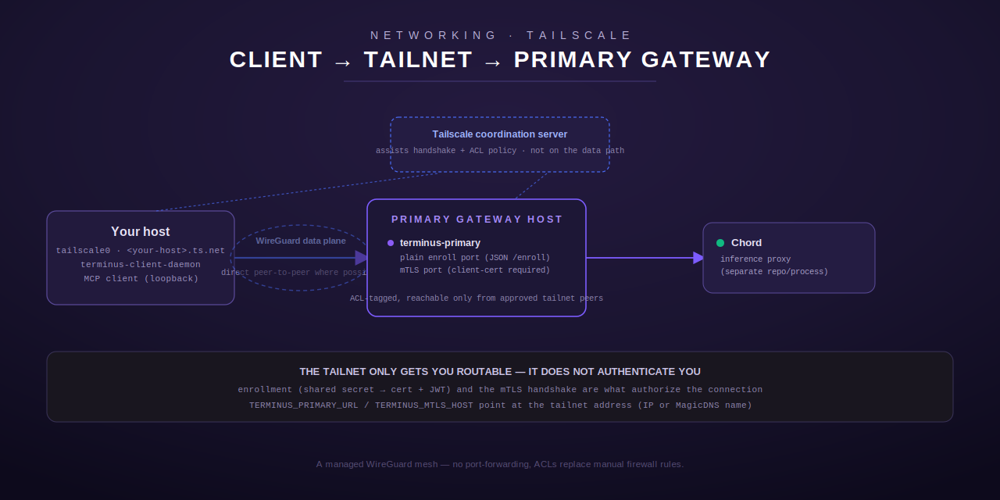

# Reaching Terminus over Tailscale



## When to choose this

Pick Tailscale when you want a client fleet that can grow or change without
hand-editing peer configs, when your hosts sit behind NATs you don't control,
or when you want centrally auditable access control (ACLs) instead of
per-host firewall rules. Tailscale is a **managed WireGuard mesh**: a
coordination server (Tailscale's own SaaS, or a self-hosted
[Headscale](https://github.com/juanfont/headscale) instance) handles key
exchange, peer discovery, and NAT traversal; the actual data plane is still
WireGuard, direct peer-to-peer whenever possible. If you'd rather not depend
on any coordination service at all, see [WireGuard](wireguard.md) instead.

As with WireGuard, this is pure network transport. It has nothing to do with
Terminus's own mTLS transport — once your host and the primary gateway host
are both on the tailnet, you still enroll and dial the primary's mTLS
listener exactly as you would over any other network path. Read
[`docs/deploy/client.md`](../deploy/client.md) for that half of the picture.

## Prerequisites

- A Tailscale account (or a self-hosted Headscale control server) and the
  `tailscale` client installed on both the primary gateway host and your own
  client host.
- Admin access to the tailnet's ACL policy, to scope which devices may reach
  the primary gateway's ports.

## 1. Join the tailnet — primary gateway host

```sh
sudo tailscale up --hostname=<primary-host> --ssh=false
```

Authenticate via the printed URL (or your organization's SSO flow). Note the
assigned tailnet IP (`tailscale ip -4`) and/or the MagicDNS name
(`<primary-host>.<your-tailnet>.ts.net`) — either can be used as the address
your client points at.

Tag the host so ACLs can scope access to it precisely, e.g. in the tailnet
admin console's machine list or via:

```sh
sudo tailscale up --advertise-tags=tag:terminus-primary
```

(Tags must be declared in your tailnet's ACL policy file before a device can
advertise them — see step 3.)

## 2. Join the tailnet — your client host

```sh
sudo tailscale up --hostname=<your-host>
```

Authenticate the same way. Once both hosts show as `Connected` in `tailscale
status`, they can reach each other directly over the tailnet, no port
forwarding or firewall punching required.

## 3. Scope access with an ACL

In the tailnet's ACL policy (Tailscale admin console → Access controls, or
Headscale's policy file), restrict who can reach the primary gateway's ports
to only the devices/users that should have Terminus access, rather than
"every device on the tailnet." Example policy fragment:

```json
{
  "tagOwners": {
    "tag:terminus-primary": ["autogroup:admin"]
  },
  "acls": [
    {
      "action": "accept",
      "src": ["group:terminus-clients"],
      "dst": ["tag:terminus-primary:8310", "tag:terminus-primary:8311"]
    }
  ]
}
```

Adjust the port numbers to whatever `TERMINUS_PRIMARY_PORT` /
`TERMINUS_PRIMARY_MTLS_PORT` (or `TERMINUS_PERSONAL_PORT` / `TERMINUS_MTLS_PORT`
for a `terminus_personal` deployment) are actually configured to. Without an
explicit ACL, Tailscale's default policy may allow any tailnet device to
reach any other — don't rely on the default for a host serving admin-grade
tools.

## 4. Verify connectivity

```sh
tailscale ping <primary-host>
tailscale status
```

## 5. Point terminus-client at the tailnet address

```sh
export TERMINUS_PRIMARY_URL=http://<primary-host>.<your-tailnet>.ts.net:8310
export TERMINUS_MTLS_HOST=<primary-host>.<your-tailnet>.ts.net
export TERMINUS_MTLS_PORT=8311
```

MagicDNS names are stable even if the underlying tailnet IP changes, so
prefer the `.ts.net` name over a raw IP where your resolver supports it. As
with the WireGuard page: getting network-reachable is only half the picture
— see [`docs/deploy/client.md`](../deploy/client.md#enrollment) for the
enrollment + mTLS handshake that actually authorizes tool calls.

## Firewall notes

Tailscale's own ACL policy (step 3) *is* the firewall here — there's no
separate port-forwarding or NAT rule to write. Still apply the same defense
in depth the WireGuard page recommends: bind the primary's plain enroll port
and mTLS port to the tailnet interface (or `127.0.0.1` behind a
tailnet-only reverse proxy) rather than `0.0.0.0`, so a misconfigured ACL
isn't the only thing standing between those ports and the public internet.

## Rollback

Remove the client device from the tailnet (either locally or from the admin
console):

```sh
sudo tailscale down       # local: stop routing through the tailnet
sudo tailscale logout     # local: fully deauthenticate this device
```

Or revoke the device from the Tailscale admin console (Machines → the device
→ Remove) to immediately cut its tailnet access from the other side, without
needing cooperation from the client host. Neither action revokes an already
enrolled Terminus identity — see
[`docs/deploy/client.md`](../deploy/client.md) and
[`docs/deploy/personal-services.md`](../deploy/personal-services.md) for how
identity-level revocation is handled (provisioning-side, not something this
network layer controls).

## Alternative: embedded tsnet (MESH-04) — no host `tailscaled` at all

Everything above joins the tailnet at the OS level (a `tailscaled` daemon
running on the primary gateway host, outside Terminus's own process). MESH-04
adds a second, feature-flagged option: `terminus_primary` can join the
tailnet **in-process**, as its own Tailscale node, with no host `tailscaled`
required at all. This is a genuinely different deployment shape, not a
convenience wrapper around the steps above — pick ONE of the two for a given
deployment, not both, for the primary's own traffic. (Embedded tsnet is also
fine to run on a host whose *other* processes still use a normal host-level
tailnet join for unrelated traffic; the two don't conflict, they're just
independent.)

**Requires a build with the `tsnet` Cargo feature enabled** (off by default —
see `Cargo.toml`) **and, at runtime, `TERMINUS_MESH_TAILNET_ENABLED=1`**.
Either gate left off leaves `terminus_primary`'s plain + mTLS listeners
byte-for-byte unchanged from a non-mesh deployment — see
`src/mesh/tailnet.rs`'s module doc for the full design, including why
building with `--features tsnet` needs a Go toolchain (`go` on `$PATH`) on
the build host, and the current WhoIs scope boundary (MESH-05 picks that up).

### Config

```sh
# Build-time (Cargo.toml feature; needs a Go toolchain on the build host):
cargo build --features tsnet --release

# Runtime env (see .env.example):
export TERMINUS_MESH_TAILNET_ENABLED=1
export TERMINUS_TSNET_HOSTNAME=<primary-host>          # MagicDNS name to advertise
export TERMINUS_TSNET_STATE_DIR=/var/lib/terminus/tsnet # persisted node state/keys
export TERMINUS_TSNET_AUTHKEY=<materialized-by-<secret-manager>-at-deploy-time>
```

`TERMINUS_TSNET_AUTHKEY` is a variable NAME in `.env.example`, like every
other credential in this repo — the real value is materialized into the
process environment by the runtime secret store at deploy time, never
authored as a literal (see moosenet-spec S7). Once started, the same merged
`/mcp` router the plain and mTLS listeners already serve is ALSO reachable on
this node's tailnet IP / MagicDNS name — no separate route wiring, no
separate tool registry.

### Why you might pick this over a host-level join

No `tailscaled` package/service to install, configure, or keep patched on
the gateway host; the tailnet identity lives and dies with the
`terminus_primary` process itself (useful for ephemeral/container-style
deployments). The tradeoff: it's a newer, feature-flagged path (this dev
host, notably, can't even compile it — no Go toolchain), versus the
host-level `tailscaled` approach above, which is the mature, widely-deployed
integration path today.

---

Back to the [networking index](README.md) · [documentation index](../README.md).
