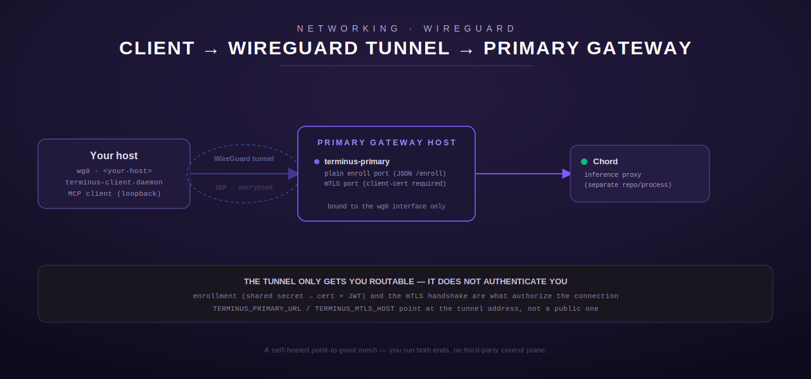

# Reaching Terminus over WireGuard



## When to choose this

Pick WireGuard when you want to connect a small, fixed set of your own
clients to a terminus primary without depending on any third-party
coordination service. You own both ends of the tunnel: you generate the
keypairs, write the peer configuration, and handle NAT traversal /
port-forwarding yourself. If that sounds like more setup than you want, see
[Tailscale](tailscale.md) instead — it's a managed WireGuard mesh that
handles NAT traversal and peer discovery for you.

WireGuard here is pure network transport. It has nothing to do with
Terminus's own mTLS transport (`terminus-client` — see
[`docs/deploy/client.md`](../deploy/client.md)); once the tunnel is up you
still enroll and dial the primary's mTLS listener exactly as you would over
any other network path. Read that page for the enrollment/mTLS half of the
picture — this page only gets you to the point where the primary's ports are
reachable.

## Prerequisites

- WireGuard tools installed on both ends (`wg`, `wg-quick`) — most distros
  package this as `wireguard-tools` or `wireguard`.
- Root/administrator access on both the primary gateway host and your own
  client host, to create the `wg0` interface and (on the primary side) open
  a UDP port through any firewall in front of it.
- A private IP range for the tunnel that doesn't collide with either side's
  existing LAN — pick your own RFC1918 `/24` and use it consistently for the
  `<primary-tunnel-ip>` / `<client-tunnel-ip>` placeholders below.

## 1. Generate keypairs

On **both** the primary gateway host and your client host:

```sh
umask 077
wg genkey | tee wg-private.key | wg pubkey > wg-public.key
```

`wg-private.key` never leaves the host it was generated on — only the
corresponding `wg-public.key` is exchanged between peers.

## 2. Configure the primary gateway host

Create `/etc/wireguard/wg0.conf` on the **primary gateway host**:

```ini
[Interface]
# Primary's own tunnel-side private key
PrivateKey = <primary-wg-private-key>
Address = <primary-tunnel-ip>/24
ListenPort = 51820

[Peer]
# Your client's public key
PublicKey = <your-client-wg-public-key>
AllowedIPs = <client-tunnel-ip>/32
```

`AllowedIPs` scoped to a single `/32` per client keeps each peer able to
reach only its own tunnel address on the primary's side — add one `[Peer]`
block per client, each with its own `/32`.

Bring the interface up:

```sh
sudo wg-quick up wg0
```

## 3. Configure your client host

Create `/etc/wireguard/wg0.conf` on **your host**:

```ini
[Interface]
PrivateKey = <your-client-wg-private-key>
Address = <client-tunnel-ip>/24

[Peer]
# Primary gateway's public key
PublicKey = <primary-wg-public-key>
Endpoint = <primary-host>:51820
AllowedIPs = <primary-tunnel-ip>/32
PersistentKeepalive = 25
```

`Endpoint` is the primary gateway's real, reachable address (public IP or a
DNS name resolving to it) and the UDP port it's listening on.
`PersistentKeepalive` keeps the tunnel alive through NAT on your side if
you're behind one; omit it if both sides have stable, directly-reachable
addresses.

Bring the interface up:

```sh
sudo wg-quick up wg0
```

## 4. Verify the tunnel

```sh
sudo wg show
ping <primary-tunnel-ip>
```

`wg show` should report a recent handshake on both sides; the ping confirms
the tunnel itself is passing traffic before you layer Terminus's enrollment
on top of it.

## 5. Point terminus-client at the tunnel address

With the tunnel up, `<primary-tunnel-ip>` (the primary's tunnel address) is now
routable from your host exactly like a LAN address would be. Configure
`terminus-client-daemon` (see [`docs/deploy/client.md`](../deploy/client.md)
for the full env-var table) to enroll and dial through it:

```sh
export TERMINUS_PRIMARY_URL=http://<primary-tunnel-ip>:8310   # plain enroll port
export TERMINUS_MTLS_HOST=<primary-tunnel-ip>                  # mTLS port host
export TERMINUS_MTLS_PORT=8311                       # mTLS port
```

The tunnel gets your traffic there; enrollment (a shared secret exchanged for
a short-lived client cert + JWT) and the mTLS handshake are still what
authorize you to actually call a tool — see
[`docs/deploy/client.md`](../deploy/client.md#enrollment) for that flow. The
port numbers above are the `terminus-primary` binary's defaults
(`TERMINUS_PRIMARY_PORT` / `TERMINUS_PRIMARY_MTLS_PORT`); if you're instead
reaching a `terminus_personal` deployment, its defaults differ — see
[`docs/deploy/personal-services.md`](../deploy/personal-services.md).

## Firewall notes

On the primary gateway host:

- The WireGuard UDP port (`51820` in this example) must be reachable from
  your client's network.
- The plain enroll port and the mTLS port should be firewalled to accept
  connections **only from the `wg0` interface** (or bound to the tunnel's own
  address, e.g. `<primary-tunnel-ip>`, rather than `0.0.0.0`) — never exposed on the
  primary's public interface. A minimal `nftables`/`iptables` rule set:
  accept on `wg0`, drop everywhere else for those two ports.
- No inbound rule is needed on your client host beyond the WireGuard UDP
  port itself (or none at all, if your client only ever initiates the
  tunnel handshake outbound).

## Rollback

Tearing down the tunnel is config-only, no Terminus-side change needed:

```sh
sudo wg-quick down wg0
```

Remove the corresponding `[Peer]` block from the primary's `wg0.conf` and
reload (`wg syncconf wg0 <(wg-quick strip wg0)` or `wg-quick down/up`) to
revoke that specific client's network access. This has no effect on any
already-enrolled Terminus identity — enrollment and network access are
independent; revoking one doesn't revoke the other. To revoke the identity
itself, see the enrollment-identity provisioning notes in
[`docs/deploy/client.md`](../deploy/client.md) and
[`docs/deploy/personal-services.md`](../deploy/personal-services.md).

---

Back to the [networking index](README.md) · [documentation index](../README.md).
