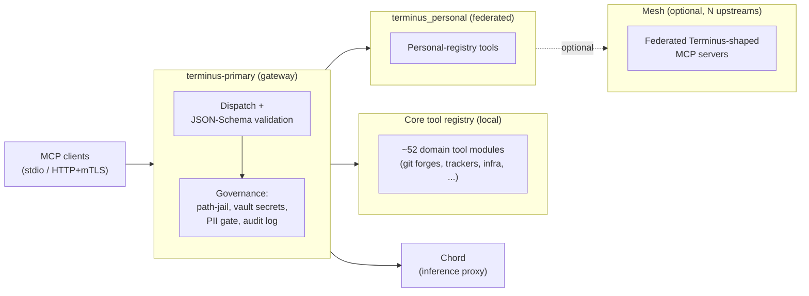

## Architecture

MCP clients connect over stdio or HTTP/mTLS transports to the Terminus core
MCP server, which owns dispatch, JSON-Schema validation, and governance.
Governance is mandatory and layered: a path-jailed filesystem, vault-only
secret access (no raw environment reads for secrets), a PII gate, and a
sanitized audit log — tools are read-only by default, write scopes are
explicit. Behind the registry sit the 52 domain tool modules, each owning its
own typed client and credentials. See
[`docs/architecture/`](docs/architecture/) for the federation, auth, and
Chord-integration deep-dives.

