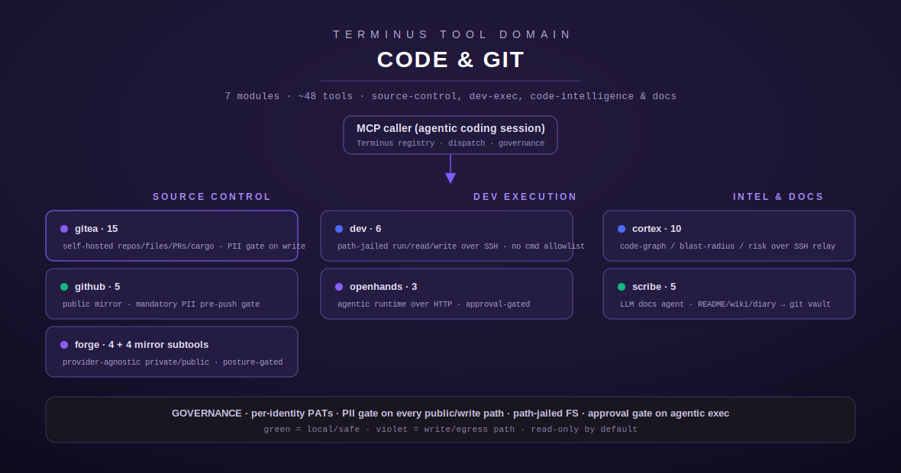

[← Tool index](../README.md) · [← Docs index](../../README.md)

# Code &amp; Git tools

The **Code &amp; Git** domain is Terminus's software-engineering surface: the tools an
agentic coding session uses to read and mutate source, publish to public mirrors, run
commands on a workstation, delegate autonomous coding tasks, analyze a repository's
structure and risk, and generate documentation. Eight tools, ~49 actions, split across
three concerns — **source control** (`gitea`, `github`, `forge`), **dev execution**
(`dev`, `openhands`), and **code intelligence &amp; docs** (`cortex`, `scribe`, `docgen`).

Every write- or egress-facing tool in this domain runs through Terminus governance:
per-identity credentials (never raw tokens in-line), a PII scan on every path that leaves
the private network, a textual path-jail on dev filesystem access, and an operator
approval gate on the autonomous-execution tools. Each module page below documents exactly
what its tools do — read from the actual handler code, with `file.rs:line` citations for
every non-obvious claim, full input schemas, output shapes, error/edge cases, and worked
examples.

## Modules

| Tool | Actions | What it is |
| --- | --- | --- |
| [`gitea.md`](gitea.md) | 15 | Terminus's self-hosted Gitea integration — list/get/create repos, read/create/update/delete files, list/create/merge PRs, list branches &amp; directories, Cargo-registry publish/yank, and multi-identity listing. Every write resolves a `GITEA_PAT_<NAME>` identity and passes through the write-path PII gate first. |
| [`github.md`](github.md) | 5 | The public-GitHub write path — repo listing/creation, a Gitea→GitHub mirror-push builder, and a subprocess-free Git Data API branch pusher — with a mandatory, unbypassable PII scan (`github_pii_scan`) gating every write before it reaches the network. |
| [`forge.md`](forge.md) | 4 (+4 mirror subtools) | A provider-agnostic git-forge abstraction — one shared endpoint vocabulary with per-adapter capability introspection (`git_private`/`git_public` and their `*_capabilities` companions), split into a private (full R/W) and public (PII-gated, first-publish-gated) pool by governance posture, topped by a fast-forward-only mirror engine (`git_public_mirror_status`/`_prepare`/`_approve`/`_push`). |
| [`dev.md`](dev.md) | 6 | Path-jailed read/write/run access to a dev workstation over SSH — list/open workspaces, run commands, read/write files, trigger OpenHands. The path-jail is a textual prefix check on filesystem arguments only; command strings are not allowlisted and command execution is not approval-gated (documented explicitly on the page). |
| [`openhands.md`](openhands.md) | 3 | Drives an external OpenHands agentic-coding runtime over its HTTP API — submit a task, poll its status, list conversations. All three tools are approval-gated (`approval::gate()`), distinct from and stricter than `dev`'s ungated `dev_trigger_openhands`. |
| [`cortex.md`](cortex.md) | 10 | Code-graph / blast-radius / risk-scoring intelligence over a repo — scope, review, audit, stats, build/index, architecture, deps, recent, community, flows. An SSH-relay module with no local graph engine; `cortex_audit` carries an SSRF-hardened URL validator for external-repo auditing. |
| [`scribe.md`](scribe.md) | 5 | Terminus's in-repo, LLM-backed documentation agent — inspects real source via read-only git worktrees, generates READMEs / wiki pages / build-diary entries through the review daemon, writes them to a git-backed Obsidian vault, and files doc/code discrepancies as deduplicated Plane issues. |
| [`docgen.md`](docgen.md) | 5+ | **S95.** The sovereign, config-driven documentation engine that replaces Mintlify — per-project doc-target config (readme/wiki/pdf/notion/obsidian/blog), `docgen_status`, PII-swept generation via Chord's SLM router, multi-format rendering, versioning, and `docgen_run` — the post-feat build-skill trigger (DOCGEN-08) that assembles the whole flow into one entry point and returns versioned artifacts for the harness to place. |

## How the pieces relate

- **`gitea` vs. `github` vs. `forge`.** `gitea` and `github` are concrete, single-provider
  tool sets (internal source control and the public mirror, respectively). `forge` is the
  layer *above* them: a provider-agnostic vocabulary (`git_private`/`git_public`) that
  dispatches to whichever adapter — gitea-family, GitHub, GitLab — a request targets, with
  capability introspection so a caller can ask what a given forge actually supports before
  attempting an operation. The `forge` public pool and the `github` module both enforce the
  same PII discipline before anything leaves the private network.
- **`dev` vs. `openhands`.** Both put code-changing power in an agent's hands, but at
  different trust levels: `dev` gives direct SSH read/write/run inside a path-jail with no
  approval gate on the command itself, while `openhands` delegates a whole autonomous task
  to an external runtime and gates every call behind operator approval. The page for each
  states its exact guardrails rather than assuming symmetry.
- **`cortex` and `scribe` are read-oriented.** `cortex` analyzes a repository's shape and
  risk without mutating it; `scribe` reads source and *produces* documentation artifacts.
  Neither is a substitute for the source-control write tools — they inform and document the
  work those tools carry out.

Every page links back to this domain index and to the top-level
[tool index](../README.md) and [docs index](../../README.md).
