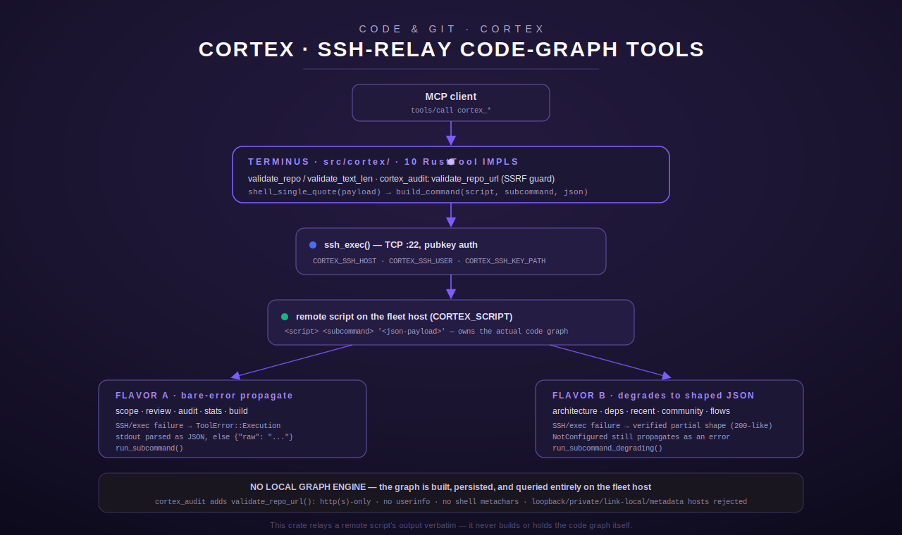

[← docs index](../../README.md)

# Cortex — code-graph / blast-radius / risk-scoring tools

Cortex is a 10-tool module (`src/cortex/mod.rs`, plus `src/cortex/audit.rs`
for URL validation) that gives an agent code-intelligence queries over a
repository: which files a planned change touches, how risky a set of already-
made changes looks, a graph-statistics/architecture overview, dependency
edges for a single file, recently-changed high-risk files, community/cluster
structure, and execution-flow tracing from an entry point — plus one tool
that runs the whole pipeline against an arbitrary external public repo.



## The single most important fact about this module: **it has no local graph engine**

Every other domain page in this set documents a tool module that does real
work in this Rust process (an HTTP client, a database query, a filesystem
read). Cortex is different, and the module's own doc comment
(`src/cortex/mod.rs:1-189`) is explicit and heavily evidenced about it: this
crate **does not build, persist, or query a code graph itself.** It is a thin
SSH-exec relay to a script on a separate "fleet host," exactly the same
transport pattern already used by this crate's `crucible`/`sentinel`/`vigil`
modules. Concretely:

- `ssh_exec()` (`src/cortex/mod.rs:334-397`) opens a TCP connection to
  `CORTEX_SSH_HOST:22`, authenticates with `CORTEX_SSH_USER`/
  `CORTEX_SSH_KEY_PATH`, and runs a single remote command built by
  `build_command()` (`src/cortex/mod.rs:308-313`):
  `<CORTEX_SCRIPT> <subcommand> '<json-payload>'`.
- The remote command's stdout is parsed as JSON (or wrapped as
  `{"raw": "<stdout>"}` if it isn't valid JSON) by `parse_remote_response()`
  (`src/cortex/mod.rs:319-325`) and relayed back to the caller
  **verbatim** — this port deliberately does not rename, reshape, or
  hand-pick fields out of the remote response, "to avoid fabricating a
  response shape not actually observed" (`src/cortex/mod.rs:107-110`).
- This was determined by live-probing the tool's original Python host before
  porting: every one of the 10 tools, called with real arguments, failed with
  an SSH connection error to the fleet host — the *same* error shape the
  already-documented `crucible`/`sentinel`/`vigil` modules produce
  (`src/cortex/mod.rs:6-45`). Five tools (`cortex_architecture`,
  `cortex_deps`, `cortex_recent`, `cortex_community`, `cortex_flows`) leaked
  their *outer* response shape even while the SSH call failed, which is why
  this port can faithfully reproduce their degrade behavior (see "Flavor A
  vs. Flavor B" below) but genuinely cannot say what a *successful* response
  looks like — that was never observed.
- The module doc comment is explicit that reaching for a Rust graph crate
  (it calls out `petgraph` by name — confirmed absent from `Cargo.toml`) or
  hand-rolling a community-detection algorithm (e.g. Louvain) here "would be
  inventing behavior with zero support" — there is no local graph data
  structure anywhere in this module (`src/cortex/mod.rs:56-65`).

Practically, this means every tool below documents: the *validated input*
this port enforces, the *exact command shape* sent over SSH, and the
*verified* response/degrade shape — but **not** a real "successful" JSON
payload for any tool, because none was ever observed. Where the description
strings promise specific return fields (e.g. `cortex_scope`'s description
claims `blast_radius`, `token_reduction_pct`, `blast_count`), those are
carried over from the tool's own MCP description metadata as documentation of
intent, not as a verified contract — say so explicitly rather than treating
them as guaranteed output fields.

## How Cortex fits alongside gitea / github / forge

Cortex is unrelated, at the code level, to this hub's other Code & Git
modules (`gitea`, `github`, `forge`, `dev`) — it shares no client, no auth
path, and no config with any of them. The relationship is purely at the
*workflow* level: those modules manage source (clone/PR/merge over a Gitea or
GitHub API), while Cortex's `cortex_scope`/`cortex_review` pair is meant to
bracket a change made through them — `cortex_scope` before editing (to scope
which files the session needs in context), `cortex_review` after editing (to
risk-score the diff before it goes into a PR opened via `gitea`/`github`).
`cortex_audit` is the one tool in this module aimed at a repo *outside* the
two locally-known repos entirely — it takes an arbitrary `https://github.com/
owner/repo`-shaped URL rather than one of the two names `KNOWN_REPOS`
recognizes.

## Configuration (environment — names only)

All four are read once at process start into a shared `CortexConfig`
(`src/cortex/mod.rs:220-262`), constructed by `CortexConfig::from_env()` and
wrapped in an `Arc` shared across all 10 tool structs (`src/cortex/mod.rs:
924`):

| Env var | Required | Default | Notes |
| --- | --- | --- | --- |
| `CORTEX_SSH_HOST` | yes (checked per-call) | none | SSH host of the fleet box. Missing → `ToolError::NotConfigured` before any network I/O. |
| `CORTEX_SSH_USER` | no | `"root"` | SSH user for the remote command. |
| `CORTEX_SSH_KEY_PATH` | yes (checked per-call) | none | Path to the SSH private key file. Missing → `NotConfigured` before any network I/O. |
| `CORTEX_SCRIPT` | yes (checked per-call) | none — **no compiled-in fallback** | The full remote script invocation. As of the 2026-07 PII remediation this has no default; a prior revision baked in a fleet-host path, which was removed (`src/cortex/mod.rs:225-227,255-261`). Missing → `NotConfigured`. |

`require_host()`/`require_key()`/`require_script()` (`src/cortex/mod.rs:
243-261`) each return `ToolError::NotConfigured` with a message naming the
missing variable, and every tool checks configuration **before** attempting
any SSH I/O — a `NotConfigured` error never depends on network reachability.

## Shared behavior across all 10 tools

- **`repo` validation.** Nine of the ten tools take a `repo` field, validated
  by `validate_repo()` (`src/cortex/mod.rs:268-277`) against a hardcoded
  allowlist, `KNOWN_REPOS = ["lumina-fleet", "lumina-terminus"]`
  (`src/cortex/mod.rs:213`). Any other value is rejected with
  `ToolError::InvalidArgument` before any SSH call is attempted. `cortex_audit`
  is the exception — it takes an arbitrary `url` instead (see its own section).
- **Free-text length cap.** Every free-text field (`changed_files`,
  `file_path`, `entry_point`) is capped at `MAX_TEXT_LEN = 2000` characters
  by `validate_text_len()` (`src/cortex/mod.rs:214,279-287`); oversized input
  is rejected with `InvalidArgument` before any SSH call.
- **Shell-safe command construction.** `shell_single_quote()`
  (`src/cortex/mod.rs:300-302`) wraps the JSON payload in single quotes,
  escaping embedded single quotes as `'\''` — the same convention this crate
  uses elsewhere (`dev::escape_single_quotes`), so no field value (including
  an adversarial `changed_files` string containing shell metacharacters) can
  break out of the constructed remote command.
- **Two response "flavors."** Verified live against the original host, the
  10 tools split into two observed failure behaviors, and this port
  reproduces each exactly:
  - **Flavor A — bare-error propagate** (`cortex_scope`, `cortex_review`,
    `cortex_audit`, `cortex_stats`, `cortex_build`): dispatched through
    `run_subcommand()` (`src/cortex/mod.rs:399-419`). Any SSH/exec failure
    surfaces as a normal `ToolError` — no partial JSON is returned.
  - **Flavor B — degrades to a shaped JSON object** (`cortex_architecture`,
    `cortex_deps`, `cortex_recent`, `cortex_community`, `cortex_flows`):
    dispatched through `run_subcommand_degrading()` (`src/cortex/mod.rs:
    421-455`). If the remote call fails for a reachability/auth/exit-status
    reason, the tool still returns `Ok` with a shaped fallback JSON object
    built by an `on_degrade` closure specific to that tool — matching the
    live-observed behavior that these five tools return a "200-shaped"
    partial response rather than a bare error. A `NotConfigured` error
    (missing env var) is **not** degraded — it always propagates as a real
    error, on the reasoning that a live deployment is always configured, so
    masking a local misconfiguration behind a plausible-looking empty
    response would hide an operator mistake (`src/cortex/mod.rs:427-433`).
- **Non-JSON stdout never fails the call.** `parse_remote_response()`
  (`src/cortex/mod.rs:319-325`) falls back to `{"raw": "<trimmed stdout>"}`
  for stdout that doesn't parse as JSON, rather than erroring.
- **Non-zero remote exit status is always an error.** `ssh_exec()` treats any
  exit status other than `0` as `ToolError::Execution` (`src/cortex/mod.rs:
  388-394`), before `parse_remote_response` is even reached — this applies to
  both flavors (Flavor B's degrade path only triggers on the `ssh_exec`
  `Result::Err`, which a non-zero exit produces).
- **Generic, non-infra-leaking errors.** Every `ssh_exec` failure branch logs
  the real host/error at `warn!` level but returns a caller-facing message
  that never includes the hostname, `:22`, or the word "ssh" — enforced by a
  dedicated regression test (`test_ssh_exec_unreachable_error_is_generic`,
  `src/cortex/mod.rs:1304-1320`).
- **Auth/identity.** Cortex tools carry no MCP-level auth or allowlist checks
  of their own beyond whatever the surrounding registry/transport enforces
  for any tool call; the operative access control is entirely at the SSH
  layer (key-based auth to the fleet host) and, for `cortex_audit`, the URL
  validator described below.
- **Timeouts.** Each tool passes its own `timeout_secs` to the SSH read:
  60s for `cortex_scope`/`cortex_review`/`cortex_stats`/`cortex_architecture`/
  `cortex_deps`/`cortex_recent`/`cortex_community`/`cortex_flows`, 180s for
  `cortex_build` ("rebuilding the graph is a heavier operation than a plain
  query," `src/cortex/mod.rs:667-668`), and 300s for `cortex_audit` ("a real
  clone + graph build + HTML render is a much heavier operation than a query
  against an already-built graph," `src/cortex/mod.rs:586-589`).

## Registration

`register()` (`src/cortex/mod.rs:923-954`) builds one shared
`Arc<CortexConfig>` and registers all 10 tool structs against it. Cortex is
wired into **both** top-level registries in `src/registry.rs`: `register_all`
(the core registry, served by `terminus-primary`/Chord, `src/registry.rs:
106`) and `register_personal` (the personal registry, `src/registry.rs:189`)
— it is one of the modules present in both, so it is reachable regardless of
which registry a given deployment serves. See
[`../../architecture/federation.md`](../../architecture/federation.md) for
how the two registries are aggregated for a client.

---

## `cortex_scope`

**Purpose** (from the tool's own description, `src/cortex/mod.rs:472-478`):
get the blast radius for a *planned* code change — which files will be
affected — intended to be called **before** a dev loop, to scope an agentic
coding session's context to only the relevant files.

**Input schema** (`src/cortex/mod.rs:480-489`):

| Field | Type | Required | Default | Notes |
| --- | --- | --- | --- | --- |
| `repo` | string (enum) | yes | — | Must be `"lumina-fleet"` or `"lumina-terminus"`. |
| `changed_files` | string | yes | — | Comma-separated file paths, e.g. `"axon/axon.py,axon_tools.py"`. Capped at 2000 characters. |

**Behavior**: validates `repo` against `KNOWN_REPOS` and `changed_files`
length, builds `{"repo": ..., "changed_files": ...}`, sends it as the `scope`
subcommand over SSH with a 60s timeout, via `run_subcommand` — **Flavor A**:
any SSH/remote failure propagates as a `ToolError`, no partial result.

**Output shape**: not verified live (see the module-level caveat above). The
tool's own description promises `blast_radius` (list of affected files),
`token_reduction_pct`, and `blast_count` as intended fields, but this is
documentation of *intent* from the description string, not an observed
contract.

**Error/edge cases**: `InvalidArgument` for an unknown `repo` or oversized
`changed_files`; `NotConfigured` if `CORTEX_SSH_HOST`/`CORTEX_SSH_KEY_PATH`/
`CORTEX_SCRIPT` are unset; `Execution` for any SSH/auth/exit-status failure.

**Worked example**

```json
// request
{"repo": "lumina-terminus", "changed_files": "src/cortex/mod.rs,src/cortex/audit.rs"}
```

Internally this becomes the remote command (schematically):

```
<CORTEX_SCRIPT> scope '{"repo":"lumina-terminus","changed_files":"src/cortex/mod.rs,src/cortex/audit.rs"}'
```

A successful response is relayed verbatim as pretty-printed JSON, whatever
shape the remote script emits (unverified). An unreachable fleet host instead
raises a tool error, e.g. `Could not complete the operation on the fleet
server.`

---

## `cortex_review`

**Purpose** (`src/cortex/mod.rs:516-523`): post-change risk assessment for
files that were **already** modified — meant to be called **after** a dev
loop, before committing. The description explicitly instructs the caller: "If
risk_score > 7: escalate to Mr. Wizard before committing" — a workflow
convention baked into the tool's own metadata, not enforced in code.

**Input schema** (`src/cortex/mod.rs:525-534`): identical shape to
`cortex_scope` — `repo` (enum, required) and `changed_files` (string,
required, ≤2000 chars, comma-separated modified file paths).

**Behavior**: same validation, same `run_subcommand` (Flavor A) dispatch, as
`cortex_scope`, but sent as the `review` subcommand with a 60s timeout
(`src/cortex/mod.rs:536-544`).

**Output shape**: unverified. The description promises `risk_score` (0-10),
`risk_signals` (a list), `blast_radius`, and `token_reduction_pct` as intended
fields — again, description-level intent, not an observed contract. Nothing
in this Rust port computes, interprets, or thresholds `risk_score` — it is
whatever number (if any) the remote script's JSON contains, relayed
unmodified; there is no local "escalate to Mr. Wizard" trigger logic in this
crate.

**Error/edge cases**: identical shape to `cortex_scope` — `InvalidArgument`
for bad `repo`/oversized `changed_files`; `NotConfigured` for missing env;
`Execution` for any SSH failure.

**Worked example**

```json
// request
{"repo": "lumina-terminus", "changed_files": "src/cortex/audit.rs"}
```

Remote command: `<CORTEX_SCRIPT> review '{"repo":"lumina-terminus","changed_files":"src/cortex/audit.rs"}'`.
As with `cortex_scope`, the response is relayed verbatim; there is no locally
observed example of a populated `risk_score`/`risk_signals` payload.

---

## `cortex_audit` — the highest-risk tool in this module

**Purpose** (`src/cortex/mod.rs:561-569`): audit an **external, arbitrary,
operator-supplied** public git repository — clone it, build a code graph,
generate an HTML report, and clean up the sandbox, entirely on the remote
fleet host. Unlike every other Cortex tool, this one does not take a `repo`
enum value; it takes a free-form URL naming any public repository.

**Input schema** (`src/cortex/mod.rs:571-579`):

| Field | Type | Required | Default | Notes |
| --- | --- | --- | --- | --- |
| `url` | string | yes | — | A public git repository URL, e.g. `"https://github.com/owner/repo"`. Validated by `validate_repo_url()` (`src/cortex/audit.rs`) before anything is sent over SSH. |

**Why this tool gets its own validation module.** `cortex_audit`'s live
error signature is byte-for-byte identical to the other Flavor-A tools — the
actual `git clone` / graph-build / HTML-render / sandbox-cleanup all happen
in the remote script, not in this Rust process. That means **this port
cannot itself guarantee the remote clone is sandboxed or cleaned up** — there
is no local temp directory, no local cleanup logic, nothing here that
constitutes *this port's own* isolation guarantee (`src/cortex/audit.rs:
1-24`, and the extended "residual risk" statement at `src/cortex/mod.rs:
147-189`). What this port *can* fully control is the one thing entirely
within its boundary: the `url` value never reaches the remote shell command
unless it passes `validate_repo_url()`.

**`validate_repo_url()` behavior** (`src/cortex/audit.rs:46-112`), applied in
this order:

1. Non-empty, ≤500 characters (`MAX_URL_LEN`).
2. No control characters or whitespace anywhere in the string.
3. No shell metacharacters at all: `; & | \` $ ( ) < > \ " ' \n \r` are
   rejected outright — this is *in addition to* the crate-wide
   `shell_single_quote` escaping every field already gets; the reasoning is
   that a legitimate git URL has no reason to contain any of these, so
   rejecting them is strictly safer than relying on quoting alone.
4. Scheme must be exactly `http` or `https` (parsed by locating the first
   `"://"`) — `ssh://`, `git://`, `file://`, `ftp://`, `data:`, and any other
   scheme are rejected.
5. No embedded userinfo (`user:pass@host` / `user@host`) — checked on the
   authority segment (host[:port]) before the first `/`, `?`, or `#`.
6. The host (after stripping a `:port` suffix, or unwrapping an IPv6 bracket
   literal) must not resolve, **textually**, to a disallowed address —
   checked by `is_disallowed_host()` (`src/cortex/audit.rs:136-174`).

**SSRF hardening — fail-closed on ambiguous numeric hosts.** An earlier
version of this check reportedly only recognized the plain 4-octet decimal
dotted-quad form of an IPv4 address and let every other encoding through —
a classic SSRF-filter gap, since a real HTTP/git client resolves far more
host shapes to an address than that: a bare decimal integer
(`2130706433 == 127.0.0.1`), hex (`0x7f000001`), an octal-by-leading-zero
form some C resolvers (e.g. glibc's `inet_aton`) interpret differently than
a naive decimal reading (`0177.0.0.1`), 2/3-part shorthand (`127.1`), and an
IPv4-mapped IPv6 literal (`::ffff:127.0.0.1`). The fixed version
(`src/cortex/audit.rs:114-174`) treats *any* numeric-looking host (starts
with `0x`, or is entirely digits/dots) as an IP-address candidate that must
parse via `parse_strict_ipv4()` — a strict 4-octet decimal parser that
rejects leading zeros — to be judged at all; anything numeric-shaped that
fails strict parsing is rejected outright (fail closed), not allowed through
by omission (fail open). Disallowed ranges, checked via the standard
library's own classification methods rather than hand-rolled octet math
(`is_disallowed_ipv4`/`is_disallowed_ipv6`, `src/cortex/audit.rs:204-220`):
loopback, RFC 1918 private ranges, link-local, unspecified (`0.0.0.0`), the
well-known `169.254.169.254` cloud metadata address, `localhost`/
`*.localhost`, bare `"0"`, IPv6 loopback/unspecified, and IPv6 unique-local
(`fc00::/7`) / link-local (`fe80::/10`) ranges.

**What is explicitly *not* guaranteed by this port**: whether the remote
script actually clones into an isolated, cleaned-up temp directory; whether
cleanup happens on failure/panic; and whether graph-building on the cloned
content could itself execute code from the repo (e.g. a language-specific
import resolver that shells out). None of this is observable from the Rust
side — the module doc comment recommends the operator directly audit the
fleet-host script for actual sandbox isolation before treating `cortex_audit`
as safe against arbitrary operator-supplied URLs in production
(`src/cortex/mod.rs:183-189`).

**Behavior**: on a valid URL, builds `{"url": url}`, dispatched as the
`audit` subcommand over SSH with a 300s timeout via `run_subcommand`
(Flavor A — any SSH/remote failure propagates as a bare `ToolError`, same as
every other Flavor-A tool; `cortex_audit` does **not** get a Flavor-B
degrade shape).

**Output shape**: unverified for a real success case. The description
promises `stats` (nodes/edges/files), a `report_url`, and risk signals, with
the report "published at `http://<fleet-host>/code/{report-name}.html`" —
again, description-level intent.

**Error/edge cases**: `InvalidArgument` for any URL rejected by
`validate_repo_url` (empty, oversized, wrong scheme, embedded credentials,
shell metacharacters, whitespace/control chars, or a disallowed host) —
all of these are caught **before** any SSH connection is attempted, so a
malicious/malformed URL never reaches the network layer at all.
`NotConfigured` for missing `CORTEX_SSH_HOST`/`CORTEX_SSH_KEY_PATH`/
`CORTEX_SCRIPT`. `Execution` for any SSH/auth/exit-status failure once the
URL passes validation.

**Worked example**

```json
// accepted
{"url": "https://github.com/octocat/Hello-World"}

// rejected — non-public host (SSRF guard), before any network call
{"url": "https://localhost/internal"}
→ InvalidArgument: 'url' must point to a public host, not a local/private/internal address

// rejected — disallowed scheme
{"url": "ssh://<email>/owner/repo"} <!-- pii-test-fixture -->
→ InvalidArgument: 'url' scheme 'ssh' is not allowed — only http/https public git URLs are accepted
```

---

## `cortex_stats`

**Purpose** (`src/cortex/mod.rs:607-611`): graph statistics for one of the
two known repos.

**Input schema** (`src/cortex/mod.rs:613-621`): `repo` (enum, required) —
`"lumina-fleet"` or `"lumina-terminus"`.

**Behavior**: validates `repo`, sends `{"repo": repo}` as the `stats`
subcommand over SSH with a 60s timeout, via `run_subcommand` (Flavor A).

**Output shape**: unverified for success. The description promises `nodes`,
`edges`, `files`, `languages`, `last_updated`, `commit`.

**Error/edge cases**: `InvalidArgument` for unknown `repo`; `NotConfigured`
for missing env (this is the exact case the unit test
`test_stats_not_configured_without_ssh_host`,
`src/cortex/mod.rs:1155-1166`, and `test_stats_not_configured_without_script`,
`src/cortex/mod.rs:1181-1200`, both exercise directly); `Execution` for any
SSH failure.

**Worked example**: `{"repo": "lumina-terminus"}` → remote command
`<CORTEX_SCRIPT> stats '{"repo":"lumina-terminus"}'`.

---

## `cortex_build`

**Purpose** (`src/cortex/mod.rs:646-649`): rebuild (incrementally update)
the code graph for a repo — intended to be run after pushing changes, to keep
the graph current for the other tools.

**Input schema** (`src/cortex/mod.rs:652-660`): `repo` (enum, required).

**Behavior**: validates `repo`, sends `{"repo": repo}` as the `build`
subcommand via `run_subcommand` (Flavor A) with a **180s** timeout — longer
than the 60s default because a rebuild is explicitly called out as heavier
than a plain query (`src/cortex/mod.rs:667-668`).

**Output shape**: unverified. The description promises "stats after
rebuild."

**Error/edge cases**: same as `cortex_stats` — `InvalidArgument` for unknown
`repo`, `NotConfigured` for missing env, `Execution` for SSH/remote failure.
There is no local incremental-vs-full-rebuild distinction in this port —
whatever "incremental" means is entirely a property of the remote script.

**Worked example**: `{"repo": "lumina-fleet"}` → `<CORTEX_SCRIPT> build
'{"repo":"lumina-fleet"}'`, allowed up to 180s before the SSH read times out.

---

## `cortex_architecture`

**Purpose** (`src/cortex/mod.rs:686-689`): high-level architecture overview
via community detection — module communities, inter-module coupling, key
files.

**Input schema** (`src/cortex/mod.rs:692-700`): `repo` (enum, required).

**Behavior**: **Flavor B.** Dispatched via `run_subcommand_degrading` with a
60s timeout. On a remote failure other than `NotConfigured`, returns `Ok`
with the verified degrade shape (`src/cortex/mod.rs:702-717`):

```json
{"repo": "<repo>", "stats": {}, "architecture_summary": "? nodes, ? edges across ? files"}
```

This exact shape was observed live against the original host under total
backend failure and is reproduced verbatim
(`test_architecture_degrade_shape_matches_live_observation`,
`src/cortex/mod.rs:1237-1250`).

**Error/edge cases**: `InvalidArgument` for unknown `repo`. `NotConfigured`
(missing `CORTEX_SSH_HOST`/`CORTEX_SSH_KEY_PATH`/`CORTEX_SCRIPT`) still
propagates as a real error rather than degrading — confirmed by
`test_architecture_degrades_to_verified_shape_when_unreachable`
(`src/cortex/mod.rs:1209-1221`). Any other SSH/remote failure produces the
degrade JSON above with `Ok`, not an error.

**Worked example**

```json
// request
{"repo": "lumina-terminus"}

// fallback response when the fleet host is unreachable (verified shape)
{"repo": "lumina-terminus", "stats": {}, "architecture_summary": "? nodes, ? edges across ? files"}
```

A successful (reachable) response's real shape is unverified — the live
probe never observed one.

---

## `cortex_deps`

**Purpose** (`src/cortex/mod.rs:733-737`): direct dependencies and callers
for a specific file — what it imports, and what imports it.

**Input schema** (`src/cortex/mod.rs:740-749`):

| Field | Type | Required | Notes |
| --- | --- | --- | --- |
| `repo` | string (enum) | yes | `"lumina-fleet"` or `"lumina-terminus"`. |
| `file_path` | string | yes | Relative path, e.g. `"axon/axon.py"`. Capped at 2000 chars. |

**Behavior**: **Flavor B.** Validates `repo` and `file_path` length, sends
`{"repo": ..., "file_path": ...}` as the `deps` subcommand via
`run_subcommand_degrading` with a 60s timeout.

**Verified degrade shape** (`src/cortex/mod.rs:751-769`, confirmed by
`test_deps_degrade_shape_matches_live_observation`, `src/cortex/mod.rs:
1253-1267`):

```json
{"repo": "<repo>", "file": "<file_path>", "affected_files": [], "blast_count": 0, "token_reduction_pct": 0}
```

**Error/edge cases**: `InvalidArgument` for unknown `repo` or oversized
`file_path` (exercised by `test_deps_rejects_oversized_file_path`,
`src/cortex/mod.rs:1143-1151`); `NotConfigured` propagates as an error, not a
degrade, same rule as `cortex_architecture`.

**Worked example**

```json
// request
{"repo": "lumina-terminus", "file_path": "src/registry.rs"}

// fallback response when the fleet host is unreachable
{"repo": "lumina-terminus", "file": "src/registry.rs", "affected_files": [], "blast_count": 0, "token_reduction_pct": 0}
```

The description names `imports_from`/`imported_by` as the intended fields on
a real graph, but note the verified degrade shape instead uses
`affected_files`/`blast_count`/`token_reduction_pct` — these are two
different vocabularies from two different sources (description text vs.
live-observed partial response) and this page reports both rather than
reconciling them, since the reconciliation itself was never observed.

---

## `cortex_recent`

**Purpose** (`src/cortex/mod.rs:786-789`): recently changed, high-risk files
in a repo, combining git log history with graph coupling.

**Input schema** (`src/cortex/mod.rs:792-799`): `repo` (enum, required).

**Behavior**: **Flavor B**, `recent` subcommand, 60s timeout
(`src/cortex/mod.rs:802-816`).

**Verified degrade shape**:

```json
{"repo": "<repo>", "frequently_changed": [], "stats": {"error": "<ssh error message>"}}
```

Unlike `cortex_architecture`/`cortex_deps`, this degrade closure embeds the
actual SSH error string into `stats.error` rather than an empty object —
confirmed by
`test_recent_community_flows_degrade_shapes_match_live_observation`
(`src/cortex/mod.rs:1270-1300`), which asserts `stats.error` is present and
a string.

**Error/edge cases**: `InvalidArgument` for unknown `repo`; `NotConfigured`
propagates as a real error rather than a degrade.

**Worked example**: `{"repo": "lumina-terminus"}` → on failure,
`{"repo": "lumina-terminus", "frequently_changed": [], "stats": {"error": "Could not complete the operation on the fleet server."}}`.

---

## `cortex_community`

**Purpose** (`src/cortex/mod.rs:833-836`): community/cluster structure from
the code graph — architectural boundaries and cross-cutting concerns.

**Input schema** (`src/cortex/mod.rs:839-846`): `repo` (enum, required).

**Behavior**: **Flavor B**, `community` subcommand, 60s timeout
(`src/cortex/mod.rs:849-863`).

**Verified degrade shape**:

```json
{"repo": "<repo>", "community_summary": "", "stats": {"error": "<ssh error message>"}}
```

**Error/edge cases**: same pattern as `cortex_recent` —
`InvalidArgument` for unknown `repo`, `NotConfigured` propagates rather than
degrading.

**Worked example**: `{"repo": "lumina-fleet"}` → on failure,
`{"repo": "lumina-fleet", "community_summary": "", "stats": {"error": "..."}}`.

---

## `cortex_flows`

**Purpose** (`src/cortex/mod.rs:880-885`): trace execution flows from an
entry point (a function or module name) through the codebase — call chain,
reachable functions, flow depth.

**Input schema** (`src/cortex/mod.rs:887-895`):

| Field | Type | Required | Notes |
| --- | --- | --- | --- |
| `repo` | string (enum) | yes | `"lumina-fleet"` or `"lumina-terminus"`. |
| `entry_point` | string | yes | Function or module name, e.g. `"axon.run_loop"` or `"briefing.run_briefing"`. Capped at 2000 chars. |

**Behavior**: **Flavor B.** Validates `repo` and `entry_point` length, sends
`{"repo": ..., "entry_point": ...}` as the `flows` subcommand via
`run_subcommand_degrading` with a 60s timeout (`src/cortex/mod.rs:898-916`).

**Verified degrade shape**:

```json
{
  "repo": "<repo>",
  "entry_point": "<entry_point>",
  "stats": {"error": "<ssh error message>"},
  "note": "Flow tracing uses graph FTS — search for entry_point in graph for full call chain"
}
```

The `note` field is a hardcoded literal in this port, reproduced from what
was observed live even under total backend failure — it is not derived from
the SSH error.

**Error/edge cases**: `InvalidArgument` for unknown `repo` or oversized
`entry_point`; `NotConfigured` propagates rather than degrading.

**Worked example**

```json
// request
{"repo": "lumina-terminus", "entry_point": "main"}

// fallback response when the fleet host is unreachable (verified shape)
{
  "repo": "lumina-terminus",
  "entry_point": "main",
  "stats": {"error": "Could not complete the operation on the fleet server."},
  "note": "Flow tracing uses graph FTS — search for entry_point in graph for full call chain"
}
```

---

## Testing notes for this module

`src/cortex/mod.rs`'s test module covers, without any network access: pure
command-construction and response-parsing helpers (quoting/escaping,
JSON-vs-raw parsing), `repo`/text-length validation, every tool's declared
name and required-field set, `InvalidArgument` rejection for bad input,
`NotConfigured` short-circuiting before any SSH attempt, the exact Flavor-B
degrade shapes reproduced against a config that is reachable-but-guaranteed-
to-fail-auth (`reachable_but_failing_config()`, `src/cortex/mod.rs:
1228-1235`, deliberately used instead of hand-copying the JSON literal so
the tests exercise the real production closures), the generic/non-leaking
error message guarantee, and full registration (`register()` yields exactly
10 tools, all named `cortex_*`). `src/cortex/audit.rs`'s test module
separately covers every branch of `validate_repo_url()`, including the SSRF
bypass-encoding regression tests (decimal-integer, hex, octal-leading-zero,
shorthand dotted-quad, and IPv4-mapped-IPv6 forms of loopback/private
addresses) described above.

---

[← docs index](../../README.md)
