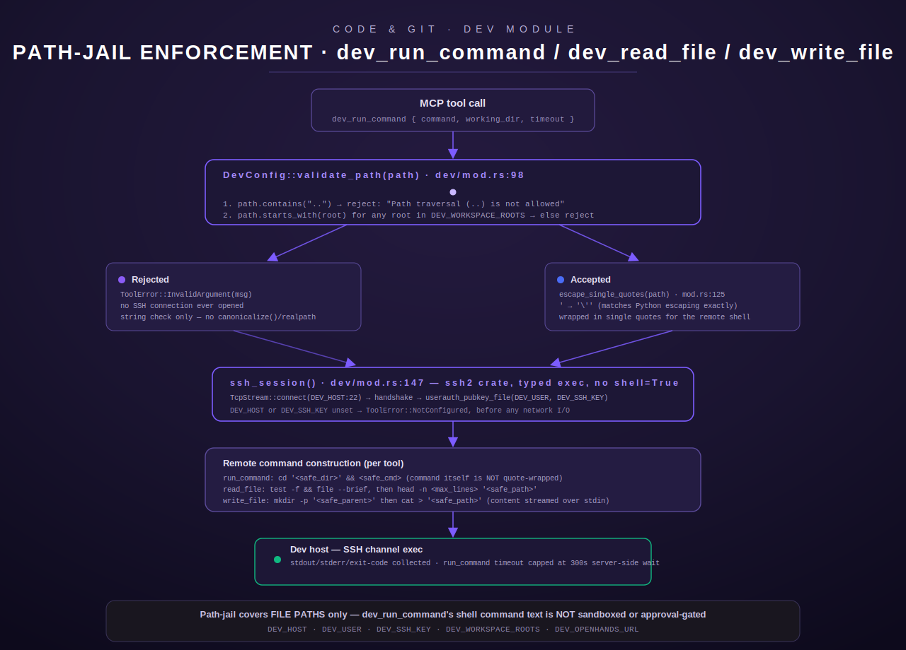

[← Tool index](../README.md) · [← Docs home](../../README.md)

# The `dev` module — dev-workspace access over SSH

`dev` is a Tier-2 Rust port of the fleet host's Python `dev_tools.py` (DEV-01) — it gives an
MCP caller read/write/execute access to a **dev workstation** over SSH, scoped to a small
allowlist of workspace roots (`src/dev/mod.rs:1-26`). It registers exactly six tools:
`dev_list_workspaces`, `dev_open_workspace`, `dev_run_command`, `dev_read_file`,
`dev_write_file`, and `dev_trigger_openhands` — enforced by a unit test that asserts the
registry ends up with exactly 6 entries with these names
(`src/dev/mod.rs:1043-1064`, `test_register_adds_six_tools` / `test_register_all_tool_names_present`).

The module is registered into **both** the core registry (`register_all`,
`src/registry.rs:109`) and the personal/admin registry (`register_personal`,
`src/registry.rs:195`) — it is one of the modules the doc comment at `src/registry.rs:157-180`
lists as having "no static call sites in Lumina-core," i.e. it exists for direct
operator/agentic-coding use, not as something the standing Lumina assistant calls on its own
initiative in the normal chat loop.

There is no per-caller identity concept inside this module itself — every tool connects to the
dev host as the single SSH principal configured by `DEV_USER`/`DEV_SSH_KEY` (see
[Configuration](#configuration) below). Authorization at the MCP layer (which client identity
may call `dev_*` at all) is a property of the surrounding gateway/mTLS system described in
[`../../architecture/auth.md`](../../architecture/auth.md), not of this module's code.



## What "workspace" means here

A "workspace" is just a directory on the dev host that lives under one of the configured
**workspace roots** — there is no workspace registry, database, or manifest. `dev_list_workspaces`
discovers workspaces by literally running `ls -1 <root>/` against each configured root
(`src/dev/mod.rs:312`) and returning the directory listing; `dev_open_workspace` "opens" a
workspace by checking whether a given path exists and optionally `mkdir -p`-ing it
(`src/dev/mod.rs:365-418`). Every other tool (`dev_run_command`, `dev_read_file`,
`dev_write_file`) takes an explicit path/`working_dir` argument from the caller — none of them
"remember" a previously opened workspace; each call is independently path-validated.

## Sandboxing: the path-jail model

All four filesystem-facing tools (`dev_open_workspace`, `dev_run_command`'s `working_dir`,
`dev_read_file`, `dev_write_file`) route every caller-supplied path through
`DevConfig::validate_path()` (`src/dev/mod.rs:98-115`) before it ever reaches SSH. The check is
exactly two rules, evaluated in order:

1. **Reject any path containing the literal substring `..`** — outright, regardless of where
   it appears in the string (`src/dev/mod.rs:99-101`). This blocks `../`-style traversal but
   is a **substring check, not a canonicalizing/`realpath` check** — the code comment and the
   implementation both confirm there is no filesystem-level path resolution happening on the
   Terminus side; the only thing prevented is `..` appearing in the argument text.
2. **Require the path to start with one of `DEV_WORKSPACE_ROOTS`** (`src/dev/mod.rs:102-106`),
   compared with plain `str::starts_with` — again a textual prefix match, not a resolved-path
   comparison. `/srv/work-evil` would satisfy `starts_with("/srv/work")`; the code as
   written does not guard against a workspace root prefix that isn't followed by `/` or end-of-
   string. This is documented here because the style guide requires describing exactly what the
   code does rather than assuming a stronger guarantee than what's implemented.

If either rule fails, `validate_path` returns `Err(String)` describing the failure, and every
call site maps that into `ToolError::InvalidArgument` — the SSH session is never opened for a
rejected path (`src/dev/mod.rs:371-373`, `469-471`, `536-538`, `625-627`). This mirrors the
Python `_validate_path` verbatim per the module's own doc comment (`src/dev/mod.rs:8-11`, `93-97`).

Once a path clears `validate_path`, it is passed through `escape_single_quotes()`
(`src/dev/mod.rs:122-127`) before being interpolated into a remote shell command string. This
performs the identical substitution the Python source used — `'` → `'\''` — so that a value
containing a single quote cannot break out of the surrounding `'...'` quoting Rust wraps around
it. **This escaping applies to paths (and, for `dev_run_command`, to the command string too);
it is a quoting safety measure, not an additional sandbox** — it stops a crafted string from
prematurely closing the shell quote, but it does not itself restrict *what* command runs.

### What the jail does **not** cover

- **`dev_run_command`'s `command` argument is never validated against any allowlist of
  binaries, verbs, or patterns.** Only `working_dir` goes through `validate_path`
  (`src/dev/mod.rs:469`); `command` is only shell-quote-escaped
  (`src/dev/mod.rs:481`), then executed as `cd '<safe_dir>' && <safe_cmd>`
  (`src/dev/mod.rs:483`). Any shell command the caller supplies runs as-is inside the jailed
  directory — `rm -rf .`, `curl | sh`, `sudo …` (if the SSH user has passwordless sudo), etc.
  are all reachable; the jail constrains *where* the command starts, not *what* it does.
- **No approval/guarded-tool gate.** Reading `src/approval.rs` shows the shared `gate()`
  function exists specifically for "guarded tools (openhands, <secret-manager>)" and is called by, for
  example, the separate `openhands` module's three tools (`src/openhands/mod.rs:8-9`, which
  explicitly states "Every tool here is GUARDED: each `execute()` first calls the shared
  approval gate"). **`src/dev/mod.rs` contains no call to `crate::approval::gate` anywhere** —
  none of the six `dev_*` tools, including `dev_run_command` (arbitrary shell exec) and
  `dev_trigger_openhands` (which also triggers agentic task execution on the dev host), pass
  through the human-approval gate. This is a deliberate, verifiable code fact, not an
  assumption — do not rely on `dev_run_command` being approval-gated; it is not, as of this
  reading of `src/dev/mod.rs`.
- **No PII gate.** Unlike the `gitea`/`github` write tools (which run content through a PII
  scan before any HTTP call — see [`gitea.md`](gitea.md)), nothing in `src/dev/mod.rs` scans
  `dev_write_file`'s `content` or `dev_run_command`'s `command`/stdout for secrets or PII
  before executing or returning it.
- **`dev_read_file` does refuse binary files** — it runs `file --brief` on the target first and
  rejects (`ToolError::InvalidArgument`) unless the description contains `"text"` or `"empty"`
  (`src/dev/mod.rs:552-558`) — but this is a usability/text-encoding guard, not a security
  boundary.

## Configuration

All configuration is read once from the environment via `DevConfig::from_env()`
(`src/dev/mod.rs:69-91`) at registration time and shared (`Arc<DevConfig>`) across all six tool
instances — there is no per-call reconfiguration.

| Env var | Meaning | Default |
|---|---|---|
| `DEV_HOST` | SSH host of the dev workstation | none — unset makes every SSH-dependent tool fail with `NotConfigured` |
| `DEV_USER` | SSH user | `root` |
| `DEV_SSH_KEY` | Path to the SSH private key file used for pubkey auth | none — unset makes every SSH-dependent tool fail with `NotConfigured` |
| `DEV_OPENHANDS_URL` | Base URL of the OpenHands API *as reached from the dev host itself* (`dev_trigger_openhands` SSHes in, then curls this URL on the far side) | `http://127.0.0.1:3000` |
| `DEV_WORKSPACE_ROOTS` | Comma-separated allowlist of workspace roots; parsed by splitting on `,`, trimming, and dropping empty entries (`src/dev/mod.rs:76-82`) | `/srv/work,/srv/devhome,/srv/openhands/workspace` |

`dev_list_workspaces` needs no arguments to succeed but still requires `DEV_HOST`/`DEV_SSH_KEY`
to be set, since it has to SSH in to list each root's contents.

## Transport: SSH via the `ssh2` crate

Every SSH-backed tool goes through `ssh_session()` (`src/dev/mod.rs:147-178`), which:

1. Requires `DEV_HOST` and `DEV_SSH_KEY` to be set — missing either returns
   `ToolError::NotConfigured` immediately, before any network call.
2. Opens a raw `TcpStream` to `<DEV_HOST>:22` with a 30s read/write timeout.
3. Performs the SSH handshake, then authenticates via `userauth_pubkey_file(DEV_USER, None,
   key_path, None)` (pubkey auth only — no password/keyboard-interactive path).
4. Returns `ToolError::Execution` for connection, handshake, or auth failures, including an
   explicit post-check that `sess.authenticated()` is true.

Command execution (`ssh_cmd`, `src/dev/mod.rs:185-221`) uses a typed `channel_session()` +
`exec()` — the crate's own comment block emphasizes "typed exec, no `shell=True`, no
subprocess" (`src/dev/mod.rs:3-6`), meaning Terminus itself never spawns a local shell; the
remote SSH server's shell is what interprets the command string. `dev_write_file` uses a
variant, `ssh_cmd_with_input` (`src/dev/mod.rs:228-273`), which streams file content over the
channel's stdin and sends EOF so a remote `cat > '<path>'` terminates.

---

## `dev_list_workspaces`

**Purpose:** enumerate the contents of every configured workspace root on the dev host, in one
call, with no arguments.

**Input schema:**

| Field | Type | Required | Default |
|---|---|---|---|
| *(none)* | — | — | — |

The parameter schema is a bare `{"type":"object","properties":{},"required":[]}`
(`src/dev/mod.rs:300-306`) — any arguments passed are ignored.

**Behavior:** for each root in `DEV_WORKSPACE_ROOTS` (in configured order), runs
`ls -1 <root>/ 2>/dev/null` over SSH with a 30s timeout (`src/dev/mod.rs:312-313`) and appends
either the listing (one line per non-blank entry) or `(empty or unavailable)` if the command
failed or returned nothing. The roots themselves are **not** passed through `validate_path` or
quote-escaping before being interpolated into the `ls` command — the code comment explicitly
notes this is safe because "`root` comes from the trusted allowlist, not user input"
(`src/dev/mod.rs:311`), not caller-supplied data.

**Output shape:** a single plain-text string, `"Workspace roots:"` followed by one section per
root (`\n<root>:` then indented `  <entry>` lines, or `  (empty or unavailable)`).

**Errors:** `ToolError::NotConfigured("DEV_HOST is not set")` (or the equivalent for
`DEV_SSH_KEY`) if SSH isn't configured — verified by
`test_list_workspaces_not_configured_without_host` (`src/dev/mod.rs:967-974`). A per-root `ls`
failure does not fail the whole call; it degrades to `(empty or unavailable)` for that root
only (a single unreachable root doesn't block visibility into the others).

**Auth/allowlist:** no path argument to validate — the allowlist itself *is* the input. No
approval gate.

**Worked example:**

```jsonc
// request
{ "tool": "dev_list_workspaces", "args": {} }
```

```text
// response (plain text)
Workspace roots:

/srv/work:
  Chord
  Terminus
  Harmony

/srv/devhome:
  repos
  spec-staging

/srv/openhands/workspace:
  (empty or unavailable)
```

---

## `dev_open_workspace`

**Purpose:** check whether a jailed directory exists on the dev host and, by default, create it
if it doesn't — the typical first call before running commands or editing files in a "new"
workspace.

**Input schema:**

| Field | Type | Required | Default |
|---|---|---|---|
| `path` | string | yes | — |
| `create` | boolean | no | `true` |

(`src/dev/mod.rs:347-363`)

**Behavior** (`src/dev/mod.rs:365-418`):

1. `validate_path(path)` — reject on failure (see [path-jail](#sandboxing-the-path-jail-model)).
2. `test -d '<safe_path>' && echo exists || echo missing` over SSH (30s timeout) to check
   existence.
3. If missing and `create == false` → `ToolError::NotFound("Workspace <path> does not exist and
   create=false")`.
4. If missing and `create == true` (the default) → `mkdir -p '<safe_path>'`; a non-zero exit
   code becomes `ToolError::Execution("Failed to create: <stderr>")`.
5. Either way, finally runs `ls -la '<safe_path>'` and returns it in the response.

**Output shape:** plain text — `Workspace: <path>\nCreated: <true|false>\nContents:\n<ls -la
output>`. `Created` reflects whether this call itself created the directory (i.e. it was
missing beforehand), not whether the directory is new in some broader sense.

**Errors:** `InvalidArgument` for a bad/missing `path` or a path that fails `validate_path`
(tested at `src/dev/mod.rs:894-914`); `NotFound` when `create=false` and the path is absent;
`Execution` if `mkdir -p` itself fails (e.g. permission denied on the dev host).

**Worked example:**

```jsonc
// request
{ "tool": "dev_open_workspace", "args": { "path": "/srv/work/scratch-feature", "create": true } }
```

```text
// response
Workspace: /srv/work/scratch-feature
Created: true
Contents:
total 0
drwxr-xr-x 2 root root 40 Jul 10 00:00 .
drwxr-xr-x 9 root root 288 Jul 10 00:00 ..
```

---

## `dev_run_command`

**Purpose:** execute an arbitrary shell command on the dev host, `cd`'d into a jailed working
directory first. This is the tool an agentic coding session uses to run `git`, package
managers, test suites, linters, etc.

**Input schema:**

| Field | Type | Required | Default |
|---|---|---|---|
| `command` | string | yes | — |
| `working_dir` | string | no | `/srv/work` |
| `timeout` | integer | no | `60` (hard-capped at `300`) |

(`src/dev/mod.rs:440-461`)

**Behavior** (`src/dev/mod.rs:463-491`):

1. `working_dir` (or its default) is validated with `validate_path` — **only the directory is
   jailed; `command` is not** (see [What the jail does not cover](#what-the-jail-does-not-cover)).
2. `timeout` is read as `u64`, defaulting to `60`; if it exceeds `300` it is silently clamped
   to `300` (`src/dev/mod.rs:474-477`; behavior verified by `test_timeout_cap_logic`,
   `src/dev/mod.rs:1021-1028`) — the module doc comment states this caps "the execution timeout
   at 300 seconds" (`src/dev/mod.rs:12`).
3. Both `command` and `working_dir` are passed through `escape_single_quotes`, then composed as
   `cd '<safe_dir>' && <safe_cmd>` and executed over SSH with the (possibly clamped) timeout.
4. The SSH-level timeout (`sess.set_timeout(...)`, `src/dev/mod.rs:188`) is set from the same
   value in milliseconds — a command that runs longer than the timeout will hit an SSH-layer
   timeout, surfaced as an `Execution` error from the read/exec calls.

**Output shape:** plain text —
```
Command: <command>
Working dir: <working_dir>
Return code: <n>

--- stdout ---
<stdout>

--- stderr ---
<stderr>
```
Note the *tool call itself succeeds* (returns `Ok(String)`) even when the remote command exits
non-zero — a non-zero `Return code` is reported in the text body, not raised as a `ToolError`.
Only SSH/connection failures or a rejected `working_dir` raise an error.

**Errors:** `InvalidArgument` if `command` is missing/non-string, or if `working_dir` fails
`validate_path` (tested at `src/dev/mod.rs:883-892`, message contains `"Path must be under one
of"`); `NotConfigured`/`Execution` from the underlying SSH layer.

**Auth / guarded-gate status:** **not** approval-gated (see
[What the jail does not cover](#what-the-jail-does-not-cover) above) — this is the single most
important operational fact about this tool. Anyone who can invoke `dev_run_command` can run any
command the `DEV_USER` SSH principal is permitted to run on the dev host, subject only to the
`working_dir` path-jail and the 300s timeout cap.

**Worked example:**

```jsonc
// request
{
  "tool": "dev_run_command",
  "args": { "command": "git status --short", "working_dir": "/srv/work/Terminus", "timeout": 30 }
}
```

```text
// response
Command: git status --short
Working dir: /srv/work/Terminus
Return code: 0

--- stdout ---
 M src/dev/mod.rs

--- stderr ---
```

---

## `dev_read_file`

**Purpose:** read a text file on the dev host, capped to a maximum number of lines, refusing
binary content.

**Input schema:**

| Field | Type | Required | Default |
|---|---|---|---|
| `path` | string | yes | — |
| `max_lines` | integer | no | `500` |

(`src/dev/mod.rs:512-528`)

**Behavior** (`src/dev/mod.rs:530-573`):

1. `validate_path(path)` — reject on failure (traversal or outside-root).
2. `test -f '<safe_path>' && file --brief '<safe_path>'` — if this returns non-zero (file
   doesn't exist, or `test -f` fails for any reason), returns `ToolError::NotFound("File not
   found: <path>")`.
3. The `file --brief` output is lowercased and must contain `"text"` or `"empty"` — otherwise
   `ToolError::InvalidArgument("File appears to be binary: <descr>")` (`src/dev/mod.rs:552-558`).
4. `head -n <max_lines> '<safe_path>'` reads up to `max_lines` lines.
5. `truncated` is computed as `line_count >= max_lines` — i.e. the response reports the file as
   truncated whenever the returned line count reaches the cap, which is also true (a false
   positive) for a file whose exact length equals `max_lines`.

**Output shape:** plain text —
```
File: <path>
Lines: <n>
Truncated: <true|false>

<file contents, up to max_lines lines>
```

**Errors:** `InvalidArgument` for a bad `path`/traversal, or a binary file; `NotFound` if the
file doesn't exist.

**Worked example:**

```jsonc
// request
{ "tool": "dev_read_file", "args": { "path": "/srv/work/Terminus/Cargo.toml", "max_lines": 50 } }
```

```text
// response
File: /srv/work/Terminus/Cargo.toml
Lines: 42
Truncated: false

[package]
name = "terminus-rs"
...
```

---

## `dev_write_file`

**Purpose:** write (overwrite) a file's full content on the dev host, optionally creating
parent directories first.

**Input schema:**

| Field | Type | Required | Default |
|---|---|---|---|
| `path` | string | yes | — |
| `content` | string | yes | — |
| `create_dirs` | boolean | no | `true` |

(`src/dev/mod.rs:594-613`)

**Behavior** (`src/dev/mod.rs:616-676`):

1. `validate_path(path)` — reject on failure.
2. If `create_dirs` (default `true`), computes the parent directory as everything before the
   last `/` in `path` (`path.rfind('/')`, matching the Python's `rsplit` behavior,
   `src/dev/mod.rs:632-644`) and runs `mkdir -p '<safe_parent>'` — this result is not checked
   for success; a failed `mkdir` here does not itself abort the write (only the subsequent write
   step's own return code is checked).
3. Writes via `ssh_cmd_with_input`, executing `cat > '<safe_path>'` and streaming `content` over
   the channel's stdin, then sending EOF — this is the "multi-line content safely" comment at
   `src/dev/mod.rs:647` referring to why stdin-streaming (not command-line interpolation) is
   used for content. **`content` itself is never quote-escaped or otherwise sanitized** — it
   goes straight to the remote `cat`'s stdin, so this is safe from shell-injection regardless of
   content (it's data, not part of the command line).
4. A non-zero write return code becomes `ToolError::Execution("Write failed: <stderr>")`.
5. On success, runs `wc -l < '<safe_path>'` to report the resulting line count.
6. **Always overwrites** — there is no append mode and no "fail if exists" option.

**Output shape:** plain text — `Wrote file: <path>\nWritten: true\nLines: <n>`.

**Errors:** `InvalidArgument` for missing `path`/`content` or a path that fails the jail check
(tested at `src/dev/mod.rs:930-953`); `Execution` if the remote `cat` fails.

**Worked example:**

```jsonc
// request
{
  "tool": "dev_write_file",
  "args": {
    "path": "/srv/work/scratch-feature/notes.md",
    "content": "# Scratch notes\n\nTODO: wire up the new handler.\n",
    "create_dirs": true
  }
}
```

```text
// response
Wrote file: /srv/work/scratch-feature/notes.md
Written: true
Lines: 3
```

---

## `dev_trigger_openhands`

**Purpose:** SSH into the dev host and `curl` its **local** OpenHands API to start a new
agentic-coding conversation — i.e. it drives OpenHands *from the dev host's own loopback*,
distinct from the separate `openhands_run_task` tool in the `openhands` module, which talks to
an OpenHands instance over the network directly and is explicitly approval-gated
(`src/openhands/mod.rs:8-9`).

**Input schema:**

| Field | Type | Required | Default |
|---|---|---|---|
| `task` | string | yes | — |

(`src/dev/mod.rs:698-708`)

**Behavior** (`src/dev/mod.rs:711-763`):

1. Reads `task`; no path involved, so `validate_path` is not applicable here.
2. Escapes `task` in two steps matching the Python source exactly: first single quotes (`'` →
   `'\''`), then double quotes (`"` → `\"`) — so the result can sit inside a JSON string that is
   itself inside a single-quoted `curl -d '...'` argument (`src/dev/mod.rs:720`).
3. Builds and runs, over SSH:
   ```
   curl -sf -X POST <DEV_OPENHANDS_URL>/api/conversations \
        -H 'Content-Type: application/json' \
        -d '{"initial_user_msg": "<escaped_task>"}' \
        --max-time 30
   ```
   with an outer SSH timeout of 35s.
4. If that `curl` fails (non-zero), it runs a second, cheaper health probe — `curl -sf
   <DEV_OPENHANDS_URL>/api/options/config --max-time 5` — to distinguish "OpenHands isn't even
   responding" from "the create-conversation call itself failed," and returns a different
   `Execution` error message for each case (`src/dev/mod.rs:730-747`).
5. On success, the response body is parsed as JSON and pretty-printed if it parses; otherwise
   the raw text is returned, capped at the first 500 characters (`src/dev/mod.rs:750-762`).

**Output shape:** plain text, either
`"Triggered OpenHands task.\nTask: <task>\nResponse:\n<pretty JSON>"` or, if the response wasn't
valid JSON, `"Triggered OpenHands task.\nTask: <task>\nRaw response:\n<raw, ≤500 chars>"`.

**Errors:** `InvalidArgument` if `task` is missing/non-string; `Execution` for either "OpenHands
does not appear to be responding" or "Failed to trigger task," each including the failing
`curl`'s stderr.

**Auth/guarded-gate status:** like the rest of this module, **`dev_trigger_openhands` is not
routed through `crate::approval::gate`** — despite triggering execution of an agentic coding
task (a category the sibling `openhands` module treats as guarded). It relies entirely on
`DEV_OPENHANDS_URL` pointing at a trusted local endpoint and on whatever access control fronts
the `dev_*` tools as a whole.

**Worked example:**

```jsonc
// request
{ "tool": "dev_trigger_openhands", "args": { "task": "Add a unit test for the new validate_path edge case" } }
```

```text
// response
Triggered OpenHands task.
Task: Add a unit test for the new validate_path edge case
Response:
{
  "conversation_id": "c-example-1234",
  "status": "starting"
}
```

---

## See also

- [`gitea.md`](gitea.md) — the PII-gated, identity-aware sibling module for git-hosting API
  calls (as opposed to `dev`'s raw filesystem/shell access on a workstation).
- [`openhands.md`](openhands.md) — the standalone, approval-gated OpenHands module
  (`openhands_run_task`/`openhands_get_status`/`openhands_list_conversations`), distinct from
  this module's `dev_trigger_openhands`.
- [`../../architecture/auth.md`](../../architecture/auth.md) — the mTLS client-identity model
  that governs which callers can reach `dev_*` tools at the gateway layer.
- [`../README.md`](../README.md) — full tool index.
- [`../../README.md`](../../README.md) — docs home.
