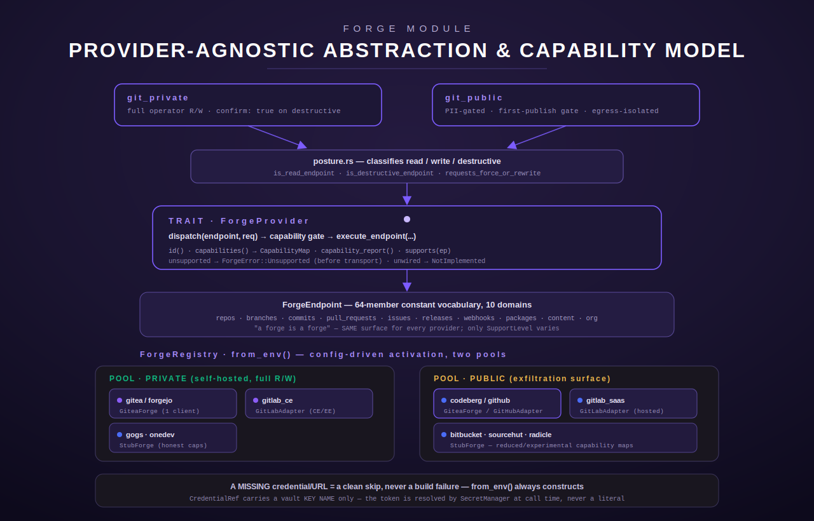
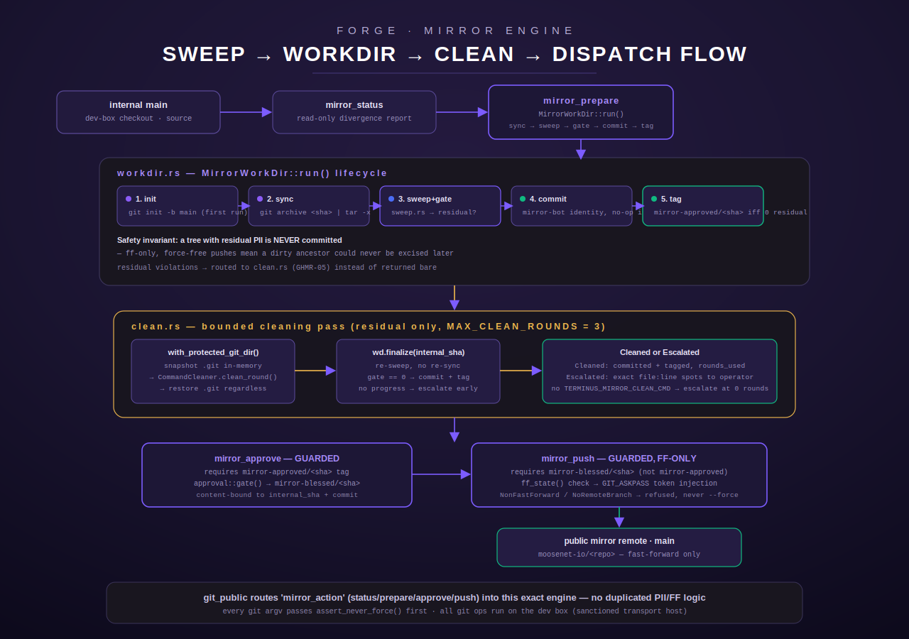

[← Terminus docs](../../README.md)

# `forge` — the provider-agnostic git forge abstraction

`forge` is not one tool; it is the layer both `git_private` and `git_public`
sit on, plus the git-public mirror engine underneath `git_public`. Before
GITX-01 (S106), Terminus's git tooling was provider-specific: a "Gitea tool,"
a "GitHub tool," each hand-writing its own endpoint surface. `forge` reshapes
that into two provider-agnostic *domains* — git-private (self-hosted
source-of-truth) and git-public (hosted/mirror, the exfiltration surface) —
that share ONE endpoint vocabulary and differ only in which provider pool
they reach and which governance posture they apply
(`src/forge/mod.rs:1-44`).

This page treats `forge` as a small manual: the provider-abstraction model,
the two governance postures, the four MCP tools it surfaces
(`git_public`, `git_public_capabilities`, `git_private`,
`git_private_capabilities`), and the git-public mirror engine underneath it
(`src/forge/mirror/`) in full mechanical detail.



## Table of contents

- [Module map](#module-map)
- [The provider-abstraction model](#the-provider-abstraction-model)
  - [`ForgeEndpoint` — the constant vocabulary](#forgeendpoint--the-constant-vocabulary)
  - [`SupportLevel` / `CapabilityMap` — what varies per adapter](#supportlevel--capabilitymap--what-varies-per-adapter)
  - [`ForgeProvider` — the trait every adapter implements](#forgeprovider--the-trait-every-adapter-implements)
  - [`ForgeRegistry` — pools and resolution](#forgeregistry--pools-and-resolution)
  - [The adapters: gitea-family, GitLab, GitHub, and stubs](#the-adapters-gitea-family-gitlab-github-and-stubs)
- [Governance postures (`posture.rs`)](#governance-postures-posturers)
- [The four MCP tools](#the-four-mcp-tools)
  - [`git_private`](#git_private)
  - [`git_private_capabilities`](#git_private_capabilities)
  - [`git_public`](#git_public)
  - [`git_public_capabilities`](#git_public_capabilities)
- [The git-public mirror engine (`src/forge/mirror/`)](#the-git-public-mirror-engine-srcforgemirror)
  - [`sweep.rs` — mechanical PII rewrite](#sweeprs--mechanical-pii-rewrite)
  - [`workdir.rs` — the clean work-dir lifecycle](#workdirrs--the-clean-work-dir-lifecycle)
  - [`clean.rs` — bounded residual cleaning](#cleanrs--bounded-residual-cleaning)
  - [`tools.rs` — the four mirror MCP subtools](#toolsrs--the-four-mirror-mcp-subtools)
- [Env vars this module reads](#env-vars-this-module-reads-names-only)

## Module map

`src/forge/mod.rs` declares nine submodules (`src/forge/mod.rs:46-55`):

| Module | Item | Role |
| --- | --- | --- |
| `capability.rs` | GITX-01 | `ForgeEndpoint` vocabulary, `ForgeDomain` grouping, `SupportLevel`, `CapabilityMap`. |
| `provider.rs` | GITX-01 | The `ForgeProvider` trait, `ForgeRequest`/`ForgeResponse`/`ForgeError`, `CredentialRef`. |
| `gitea_family.rs` | GITX-02 | One adapter (`GiteaForge`) serving `gitea`/`forgejo`/`codeberg`. |
| `gitlab.rs` | GITX-04 | `GitLabAdapter` serving `gitlab_ce` (private) and `gitlab_saas` (public). |
| `stubs.rs` | GITX-06 | `StubForge` — honest capability maps, no wired transport, for bitbucket/sourcehut/gogs/onedev/radicle. |
| `registry.rs` | GITX-05 | `ForgeRegistry` / `ForgePool` — config-driven activation into two pools. |
| `posture.rs` | GITX-05 | Read/write/destructive classification shared by both tools. |
| `git_private.rs` | GITX-05 | The `git_private` + `git_private_capabilities` MCP tools. |
| `git_public.rs` | GITX-05 | The `git_public` + `git_public_capabilities` MCP tools. |
| `mirror/` | GHMR-02/03/04/05, renamed GITX-08 | The git-public mirror engine: sweep, workdir, clean, tools. |

Registration is split by placement (`src/forge/mod.rs:65-78`):

- `register_private()` → `git_private::register()`, called from
  `crate::registry::register_personal` — **personal placement only**. This is
  the operator's own source-of-truth git access, not a Chord-served
  build-pipeline surface.
- `register_public()` → `git_public::register()`, called from
  `crate::registry::register_all` — **core placement only**.

## The provider-abstraction model

### `ForgeEndpoint` — the constant vocabulary

`ForgeEndpoint` (`src/forge/capability.rs:80-160`) is a single enum
enumerating **every** operation either forge tool can name — 64 variants
across 10 domains (`ForgeDomain`, `src/forge/capability.rs:24-69`): Repos,
Branches (including generic non-branch Refs), Commits, PullRequests, Issues,
Releases (including independent Tags), Webhooks, Packages, Content, Org.

The vocabulary is deliberately **constant across providers** — "a forge is a
forge" (`src/forge/capability.rs:1-13`). What varies is which endpoints a
given adapter actually implements, expressed per-adapter via a
`CapabilityMap` (below), never by adding or removing enum variants per
provider. `ForgeEndpoint::as_str()`/`from_str()` give a stable snake_case
identifier (e.g. `repos_create`, `issues_comment`) used as the wire-level
`endpoint` argument to both `git_private` and `git_public`
(`src/forge/capability.rs:220-301`); `from_str` returns `None` — never a
panic — for anything not in `ForgeEndpoint::all()`, and callers map that to a
clean invalid-argument error (`src/forge/git_public.rs:148-161`,
`src/forge/git_private.rs:55-68`). A dedicated test asserts the vocabulary
never repeats a variant and is "reasonably broad" (`>= 55` endpoints;
`src/forge/capability.rs:420-433`).

### `SupportLevel` / `CapabilityMap` — what varies per adapter

`SupportLevel` (`src/forge/capability.rs:307-334`) has three variants:

| Variant | Meaning | `is_available()` |
| --- | --- | --- |
| `Supported` | Fully implemented, expected to work against a live instance. | `true` |
| `Experimental` | Declared but partial/reduced (e.g. a p2p or minimal-surface forge). | `true` |
| `Unsupported` | Not offered by this provider. | `false` |

`CapabilityMap` (`src/forge/capability.rs:341-413`) is a `HashMap<ForgeEndpoint,
SupportLevel>` built once per adapter, usually at construction, via a builder
(`.supported(ep)` / `.experimental(ep)` / `.with(ep, level)`). **A missing
entry defaults to `Unsupported`** (`src/forge/capability.rs:373-378`) — the
conservative default, so an adapter never accidentally claims a capability it
never declared. `CapabilityMap::report()` renders the full vocabulary grouped
by domain as JSON, e.g.:

```json
{ "repos": { "repos_list": "supported", "repos_delete": "unsupported" }, "packages": { "packages_publish": "experimental" }, ... }
```

Every endpoint in the constant vocabulary appears exactly once in the
report regardless of how sparse the underlying map is
(`src/forge/capability.rs:392-404`) — this is what the `*_capabilities`
introspection tools return per provider.

### `ForgeProvider` — the trait every adapter implements

`ForgeProvider` (`src/forge/provider.rs:150-214`) is the common interface:

```rust
#[async_trait]
pub trait ForgeProvider: Send + Sync {
    fn id(&self) -> &str;
    fn display_name(&self) -> &str { self.id() }
    fn capabilities(&self) -> &CapabilityMap;
    fn support_level(&self, endpoint: ForgeEndpoint) -> SupportLevel { ... }
    fn supports(&self, endpoint: ForgeEndpoint) -> bool { ... }
    fn capability_report(&self) -> Value { ... }
    async fn dispatch(&self, endpoint: ForgeEndpoint, req: ForgeRequest) -> Result<ForgeResponse, ForgeError> { /* gate, see below */ }
    async fn execute_endpoint(&self, endpoint: ForgeEndpoint, _req: ForgeRequest) -> Result<ForgeResponse, ForgeError> { /* default: NotImplemented */ }
}
```

The load-bearing design: `dispatch()` has a **default implementation that
enforces the capability gate** before any concrete adapter code runs
(`src/forge/provider.rs:185-197`):

1. If `support_level(endpoint)` is `Unsupported` → return
   `ForgeError::Unsupported { provider, endpoint }` immediately. **No
   transport is ever attempted.**
2. Otherwise call `execute_endpoint(endpoint, req)`.

Adapters normally never override `dispatch()` — they only implement
`execute_endpoint()` for the endpoints they actually wire up. The trait's
*default* `execute_endpoint()` returns `ForgeError::NotImplemented` — so an
adapter that **declares** an endpoint `Supported`/`Experimental` in its
`CapabilityMap` but has not actually wired a handler for it (the stub
posture, see below) still fails honestly rather than fabricating a result
(`src/forge/provider.rs:199-213`). This two-tier negative-path design —
`Unsupported` (capability gate, never attempted) vs. `NotImplemented`
(declared but unwired) — is exercised directly by `forge::mod`'s own
`MockForge` test suite (`src/forge/mod.rs:86-192`).

`ForgeRequest` / `ForgeResponse` / `ForgeError` (`src/forge/provider.rs:56-141`):

- **`ForgeRequest { provider: Option<String>, identity: Option<String>, params: Value }`** —
  `params` carries the endpoint-specific arguments (validated by the
  concrete adapter); `provider` optionally pins one pool member; `identity`
  optionally selects a named credential. Builder methods `.with_provider(...)`
  / `.with_identity(...)`.
- **`ForgeResponse { endpoint, provider, body }`** — which endpoint/provider
  actually served the call, plus the raw response body.
- **`ForgeError`** — five variants, each mapped to a `ToolError` category
  (`src/forge/provider.rs:81-93`):

  | `ForgeError` variant | Meaning | Maps to `ToolError` |
  | --- | --- | --- |
  | `Unsupported { provider, endpoint }` | Not in the adapter's capability map. | `InvalidArgument` |
  | `NotImplemented { provider, endpoint }` | Declared but not wired (stub posture). | `InvalidArgument` |
  | `InvalidRequest(String)` | Malformed request arguments. | `InvalidArgument` |
  | `Auth { provider, message }` | Bad/missing credential or scope. | `NotConfigured` |
  | `Transport { provider, message }` | API/network-level failure. | `Http` |

`CredentialRef` (`src/forge/provider.rs:36-50`) is the vault-key-name
abstraction: it carries **only** the runtime secret KEY NAME (e.g.
`GITEA_PAT_MOOSE`), never the value. Adapters resolve the actual token at
call time via `SecretManager`/`vault::manager().get(key_name)` — the single
sanctioned secret-access path; no adapter constructor or dispatch path ever
reads a secret's *value* directly other than through that resolution.

### `ForgeRegistry` — pools and resolution

`ForgeRegistry` (`src/forge/registry.rs:66-234`) is "one surface, two
pools": every adapter belongs to exactly one `ForgePool`:

```rust
pub enum ForgePool { Private, Public }
```

- **`Private`** — self-hosted source-of-truth forges. Full operator R/W.
- **`Public`** — hosted/mirror forges. "The exfiltration surface — PII gate
  is load-bearing on every write" (`src/forge/registry.rs:44-48`).

`ForgeRegistry::from_env()` (`src/forge/registry.rs:105-163`) tries to
construct **every known adapter**, pool by pool, and inserts whichever
succeed — a missing credential/URL is a clean, `debug`-logged skip, never a
build or runtime failure. As of the GITX-05 provider integration
(`src/forge/registry.rs:14-19`):

| Pool | Wired providers | Constructor |
| --- | --- | --- |
| Private | `gitea` | `GiteaForge::gitea_from_env()` |
| Private | `forgejo` | `GiteaForge::forgejo_from_env()` |
| Private | `gitlab_ce` | `GitLabAdapter::from_env_ce()` |
| Private | `gogs` | `StubForge::gogs_from_env()` |
| Private | `onedev` | `StubForge::onedev_from_env()` |
| Public | `codeberg` | `GiteaForge::codeberg_from_env()` |
| Public | `github` | `GitHubAdapter::from_env()` (`crate::github::adapter`) |
| Public | `gitlab_saas` | `GitLabAdapter::from_env_saas()` |
| Public | `bitbucket` | `StubForge::bitbucket_from_env()` |
| Public | `sourcehut` | `StubForge::sourcehut_from_env()` |
| Public | `radicle` | `StubForge::radicle_from_env()` |

Adding a further provider is "implement `ForgeProvider` for it, add one
`match … from_env()` insert in the appropriate pool section, done — no
change to the dispatch/posture code in `git_private.rs`/`git_public.rs`"
(`src/forge/registry.rs:20-26`).

`ForgeRegistry::resolve(pool, explicit)` (`src/forge/registry.rs:190-233`)
is the provider-selection algorithm both MCP tools use:

1. If the caller passed an explicit `provider`, look it up in the pool; an
   unknown id is a clean `InvalidArgument` naming the configured providers.
2. Otherwise consult `GIT_PRIVATE_DEFAULT_PROVIDER` / `GIT_PUBLIC_DEFAULT_PROVIDER`
   (behavioral config, not a secret) — if set and the named provider is
   configured, use it.
3. Otherwise fall back to the pool's canonical default (`gitea` for
   Private, `github` for Public) if configured.
4. Otherwise, if **exactly one** provider is configured in the pool, use it
   implicitly.
5. Otherwise `NotConfigured`, naming the configured providers and asking the
   caller to pass `provider` explicitly.

### The adapters: gitea-family, GitLab, GitHub, and stubs

- **`GiteaForge`** (`src/forge/gitea_family.rs`, GITX-02) is **one**
  Gitea-compatible-REST-API client parameterised by base URL + credentials,
  serving three providers that all speak the Gitea REST v1 API:
  - `gitea` (private) — the S105/GPAT `GITEA_PAT_<NAME>` multi-identity model
    (`GITEA_URL` + per-identity tokens, default identity `moose`), reusing
    the existing `GiteaClient` wholesale.
  - `forgejo` (private) — single credential, `FORGEJO_URL` + `FORGEJO_TOKEN`.
  - `codeberg` (public) — single credential, `CODEBERG_TOKEN`; base URL
    defaults to Codeberg's host, overridable via `CODEBERG_URL`.

  The three differ **only** by base URL + credential source; nothing about
  endpoint dispatch branches on provider (`src/forge/gitea_family.rs:1-22`).
  The adapter carries its own URL-path-injection defenses independent of the
  capability model: every caller-supplied path segment is percent-encoded
  against an explicit unsafe-character set (`src/forge/gitea_family.rs:56-96`),
  and any value containing a `.`/`..` traversal segment (raw or
  percent-encoded, in either case) is rejected outright before it can reach
  the URL builder (`src/forge/gitea_family.rs:106-135`).

- **`GitLabAdapter`** (`src/forge/gitlab.rs`, GITX-04) — self-hosted GitLab
  CE/EE (`gitlab_ce`, private, via `GitLabAdapter::from_env_ce()`) and
  hosted GitLab SaaS (`gitlab_saas`, public, via `from_env_saas()`, needing
  no URL var since the SaaS base is fixed).

- **`StubForge`** (`src/forge/stubs.rs`, GITX-06) covers five providers that
  are **not** wired as full adapters — deliberately: "structure + an honest,
  per-provider `CapabilityMap` so the git-private/git-public tools KNOW these
  providers exist and can report their real (often reduced) surfaces … without
  ever faking a call" (`src/forge/stubs.rs:1-8`). Per-provider capability
  posture, as documented directly in source (`src/forge/stubs.rs:10-30`):

  | Stub | Pool | Reduced surface (honestly `Unsupported`/`Experimental`) |
  | --- | --- | --- |
  | `bitbucket` | Public | No GitHub-style Releases feature; no generic package registry. |
  | `sourcehut` | Public | Patch-email workflow — no web PR surface (`PullRequests*` unsupported), no package registry; per-service webhook model doesn't map 1:1 to the shared vocabulary → `Webhooks*` is `Experimental`. |
  | `gogs` | Private | Older, deliberately minimal Gitea fork — no branch-protection API, no package registry, no webhook test-delivery endpoint. |
  | `onedev` | Private | Modern, fairly complete REST surface including real package registry (Maven/npm/Docker) — map is close to full. |
  | `radicle` | Public-ish/experimental | Peer-to-peer; most writes happen over the `rad`/git protocol, not a central REST API; no org/collaboration concept at all (p2p has no central membership list); its read-only `radicle-httpd` HTTP surface is `Experimental`, everything else `Unsupported`. |

  Critically, a stub's `CapabilityMap` is **not** a placeholder — "that part
  is NOT a placeholder, it is meant to be an accurate account of what each
  provider's API can do" (`src/forge/stubs.rs:32-36`). What a stub
  deliberately never does is override `execute_endpoint()`, so — per the
  trait's default behavior above — even an endpoint declared `Supported`
  falls through to `ForgeError::NotImplemented`. Each stub's `from_env`
  constructor only *checks presence* of its one credential env var
  (`BITBUCKET_TOKEN`, `SOURCEHUT_TOKEN`, `GOGS_TOKEN`, `ONEDEV_TOKEN`,
  `RADICLE_TOKEN`) — it never reads the value, since there is no wired
  transport yet to use it (`src/forge/stubs.rs:49-59`, `require_env` at
  `src/forge/stubs.rs:143-150`).

## Governance postures (`posture.rs`)

`posture.rs` only **classifies**; `git_private.rs`/`git_public.rs`
**enforce** (`src/forge/posture.rs:1-16`). Three predicates:

- **`is_read_endpoint(endpoint) -> bool`** (`src/forge/posture.rs:21-54`) —
  true for a fixed allowlist of 24 pure-read endpoints (`ReposList`,
  `ReposGet`, `ReposMetadata`, `BranchesList/Get`, `RefsList/Get`,
  `CommitsList/Get/CompareDiff/Status`, `PullRequestsList/Get`,
  `IssuesList/Get`, `ReleasesList/Get`, `TagsList/Get`, `WebhooksList`,
  `PackagesList/Get`, `ContentReadFile/ListTree/RawFetch`,
  `OrgMembers/Teams/Permissions`). `is_write_endpoint()` is the exact
  complement (`src/forge/posture.rs:59-61`) — a dedicated test
  (`every_endpoint_is_read_xor_write`, `src/forge/posture.rs:130-134`)
  asserts every one of the 64 vocabulary members is classified as exactly
  one of read/write, never both, never neither.
- **`is_destructive_endpoint(endpoint) -> bool`** (`src/forge/posture.rs:66-78`) —
  true only for `ReposDelete`, `BranchesDelete`, `RefsDelete`,
  `ReleasesDelete`, `TagsDelete`, `WebhooksDelete`, `PackagesDelete` —
  irreversible-by-themselves ops, independent of any request parameter.
- **`requests_force_or_rewrite(params: &Value) -> bool`** (`src/forge/posture.rs:84-91`) —
  true if `params` carries `true` under any of `force`, `force_push`,
  `rewrite_history`, or `history_rewrite`, regardless of which endpoint is
  being called. Any such request is treated as destructive on git-private
  even on an otherwise-ordinary write endpoint like `branches_create`.

The two governance postures built from these predicates:

| Posture | Applies to | Rule |
| --- | --- | --- |
| **git-private** | `is_destructive_endpoint(ep) \|\| requests_force_or_rewrite(params)` | Requires the caller to pass `confirm: true`, or the call is refused before any transport, naming exactly which endpoint required confirmation. |
| **git-public** | `is_write_endpoint(ep)` (i.e. every non-read endpoint) | Unconditionally PII-gated, first-publish-gated per `(provider, repo)`, and forbidden from carrying a per-call host/base-URL override (egress isolation). Reads are unrestricted. |

## The four MCP tools

### `git_private`

- **Registration / placement:** `crate::forge::git_private::register()`,
  called from `crate::registry::register_personal` **only**
  (`src/forge/git_private.rs:18-21`) — i.e. `terminus_personal`, not the
  Chord-served core registry.
- **Purpose:** provider-agnostic full operator read/write against the
  self-hosted source-of-truth forge pool (`ForgePool::Private`).
- **Input schema** (`src/forge/git_private.rs:87-114`):

  | Field | Type | Required | Default | Notes |
  | --- | --- | --- | --- | --- |
  | `endpoint` | string | **yes** | — | A `ForgeEndpoint` snake_case name, e.g. `repos_create`, `issues_create`, `repos_delete`. |
  | `provider` | string | no | config-driven (`gitea` or the sole configured provider) | Explicit pool member, e.g. `forgejo`. |
  | `identity` | string | no | provider's active identity | Named credential identity, e.g. `moose`. |
  | `params` | object | no | `{}` | Endpoint-specific arguments, passed through to the adapter. |
  | `confirm` | boolean | no | `false` | Required `true` for destructive operations. |

- **Behavior / branches** (`src/forge/git_private.rs:116-160`):
  1. Parse `endpoint`; unknown/missing → `InvalidArgument` before anything
     else runs (`req_endpoint`, `src/forge/git_private.rs:55-68`).
  2. Compute `destructive = is_destructive_endpoint(endpoint) ||
     requests_force_or_rewrite(params)`. If `destructive && !confirm` →
     `InvalidArgument` naming the endpoint, **before** the provider is even
     resolved — no transport, no partial side effect.
  3. Resolve the provider via `ForgeRegistry::resolve(Private, provider_id)`
     — an unconfigured explicit `provider` is a clean `InvalidArgument`; an
     empty pool is `NotConfigured`.
  4. Build a `ForgeRequest`, thread `identity`/`provider` if given, and call
     `provider.dispatch(endpoint, req)` — which itself re-applies the
     capability gate (`Unsupported`/`NotImplemented` as described above).
  5. On success, wrap the result:
     `{"endpoint": ..., "provider": ..., "pool": "private", "body": ...}`.
- **Error / edge cases:** unknown endpoint string → `InvalidArgument`;
  destructive without `confirm` → `InvalidArgument` (message contains
  `"confirm"`); endpoint the resolved provider does not advertise →
  `ForgeError::Unsupported` → `InvalidArgument` (message contains
  `"unsupported"`); explicit `provider` not configured in the pool →
  `InvalidArgument`; empty pool with no explicit provider → `NotConfigured`.
- **Auth / secrets:** "No credential ever appears here: identity selection
  flows straight into `ForgeRequest`, and each adapter resolves the actual
  token from the runtime secret store … at call time — this module never
  reads a token itself" (`src/forge/git_private.rs:23-27`).
- **Worked example.** Delete a repo (destructive) without confirmation, then
  with it:

  ```jsonc
  // 1. Refused — destructive without confirm
  { "endpoint": "repos_delete", "params": { "owner": "moose", "repo": "scratch" } }
  // → InvalidArgument: "'repos_delete' is a destructive git-private operation
  //    (delete / force-push / history-rewrite) and requires explicit
  //    confirmation — retry with 'confirm': true"

  // 2. Confirmed — dispatches
  { "endpoint": "repos_delete", "params": { "owner": "moose", "repo": "scratch" }, "confirm": true }
  // → { "endpoint": "repos_delete", "provider": "gitea", "pool": "private", "body": { ... } }
  ```

### `git_private_capabilities`

- **Registration:** registered alongside `git_private` in the same
  `register()` call (`src/forge/git_private.rs:217-221`) — same placement
  (personal only).
- **Purpose:** read-only capability introspection for the private pool, "kept
  separate from `git_private` itself so introspection never competes with
  the `endpoint` dispatch parameter's namespace" (`src/forge/git_private.rs:166-170`).
- **Input schema:** `{ "provider": { "type": "string", "description": "Restrict to one provider id" } }` — entirely optional, no `required` array.
- **Behavior:** if `provider` is given, report just that one id (even if not
  actually configured, in which case it is silently absent from the output —
  the tool does not error on an unknown filter id here, unlike `git_private`'s
  dispatch path); otherwise iterate every configured provider in the pool.
  For each, call `capability_report()` (the full domain-grouped JSON from
  `CapabilityMap::report()`).
- **Output shape:**
  ```json
  { "pool": "private", "providers": { "gitea": { "repos": {...}, "branches": {...}, ... }, "forgejo": { ... } } }
  ```
- **Worked example:**
  ```jsonc
  { "provider": "gitea" }
  // → {"pool":"private","providers":{"gitea":{"repos":{"repos_list":"supported","repos_delete":"supported",...},...}}}
  ```

### `git_public`

- **Registration / placement:** `crate::forge::git_public::register()`,
  called from `crate::registry::register_all` **only**
  (`src/forge/git_public.rs:29-31`) — the Chord-served **core** registry, not
  `terminus_personal`.
- **Purpose:** provider-agnostic dispatch onto the hosted/public forge pool
  (`ForgePool::Public`) — "the EXFILTRATION SURFACE" — plus a routed path
  into the git-public mirror engine for a full-tree publish.
- **Input schema** (`src/forge/git_public.rs:226-258`):

  | Field | Type | Required | Default | Notes |
  | --- | --- | --- | --- | --- |
  | `endpoint` | string | no* | — | A `ForgeEndpoint` name. *Omit when using `mirror_action`; one of `endpoint` / `mirror_action` is effectively required by the execute-time logic even though the JSON schema's `required: []` does not encode that. |
  | `mirror_action` | string enum | no | — | One of `status`/`prepare`/`approve`/`push` — routes to the mirror engine instead of a direct endpoint call. |
  | `provider` | string | no | config-driven (`github` or the sole configured provider) | Explicit pool member, e.g. `codeberg`. |
  | `identity` | string | no | provider's active identity | Named credential identity. |
  | `params` | object | no | `{}` | Endpoint-specific arguments; also carries `repo` (or `name`) for the first-publish gate key. |
  | `confirm_first_publish` | boolean | no | `false` | Required `true` on the **first** write to a given `(provider, repo)` pair. |

- **Behavior / branches** (`src/forge/git_public.rs:260-339`):

  1. **`mirror_action` branch, checked first:** if present, forward
     `params` to `crate::forge::mirror::tools::dispatch_mirror_action(action,
     params)` and return its result directly — bypassing the endpoint/PII/
     first-publish machinery below entirely (the mirror engine carries its
     own unconditional PII gate and fast-forward-only transport). A
     successful `push` additionally **activates** the `(provider, repo)`
     first-publish key (`provider` defaults to `github` here too), so a
     later direct API write to the newly-mirrored repo (e.g. a PR comment)
     is not re-asked (`src/forge/git_public.rs:261-277`).
  2. Otherwise, parse `endpoint` (unknown/missing → `InvalidArgument`) and
     resolve the provider via `ForgeRegistry::resolve(Public, provider_id)`.
  3. **If `is_write_endpoint(endpoint)`**, three gates run in a fixed order —
     "a call that fails any earlier check never reaches a later one (and
     never reaches the network)" (`src/forge/git_public.rs:25-27`):
     1. **Egress isolation** (`assert_no_host_override`,
        `src/forge/git_public.rs:164-177`): `params` may not contain any of
        `api_base`, `base_url`, `host`, `endpoint_override`, `url_override`
        — presence of any is refused with an `InvalidArgument` mentioning
        `"egress"`. Each adapter's own compiled-in allowlist is the sole
        routing authority; the tool layer refuses even the attempt to
        override it.
     2. **Unconditional PII gate** (`pii_gate`, from
        `crate::github::pii::pii_gate`, reused wholesale): every string
        value in `params` — including object *keys*, recursively — is
        flattened into one newline-joined blob (`flatten_strings`,
        `src/forge/git_public.rs:182-204`) and scanned. A failing scan
        returns the gate's error (an `InvalidArgument` whose message
        contains `"BLOCKED"` or `"pii"`) and the operation is **withheld** —
        nothing reaches the provider, no bypass, no cadence fast-path. The
        withholding is also logged at `warn` (`src/forge/git_public.rs:294-302`).
     3. **First-publish human gate**: keyed on
        `"{provider_id}:{repo-or-name}"` (`activation_key`,
        `src/forge/git_public.rs:127-134`). If that key is not already in
        the persisted activation set, the call must carry
        `confirm_first_publish: true` or it is refused with an
        `InvalidArgument` whose message contains `"first publish"`. Once
        granted (or already activated), the key is (re-)recorded and the
        set is persisted to disk immediately.
  4. Dispatch via `provider.dispatch(endpoint, req)` and wrap the result:
     `{"endpoint": ..., "provider": ..., "pool": "public", "body": ...}`.

- **Error / edge cases:** unknown endpoint → `InvalidArgument`; PII-flagged
  write → `InvalidArgument` (withheld, logged); unconfirmed first write to a
  `(provider, repo)` → `InvalidArgument`; a **second** write to the same
  `(provider, repo)` after confirmation proceeds without re-asking, and a
  **different** repo under the same provider gets its own independent gate
  (verified directly by tests: `clean_write_requires_first_publish_confirmation`,
  `first_publish_confirmed_then_subsequent_write_not_reasked`,
  `different_repos_get_independent_first_publish_gates`,
  `src/forge/git_public.rs:470-551`); a host-override key anywhere in
  `params` → `InvalidArgument` mentioning `"egress"`; reads are **never**
  gated (`read_endpoint_is_never_gated`, `src/forge/git_public.rs:448-453`).
- **Persistence of the first-publish ledger:** a flat JSON array of
  `"provider:repo"` strings at a path resolved from
  `TERMINUS_GIT_PUBLIC_ACTIVATED_STATE`, falling back to a file under the OS
  temp dir (`src/forge/git_public.rs:77-100`). "Deliberately NOT secret data
  (no tokens), so a plain file (not the vault) is appropriate."
- **Auth / identity / egress notes:** every adapter's own allowlist (e.g.
  `GitHubAdapter::host_allowed`) is the sole routing authority for a
  provider's traffic; `git_public` never lets a caller redirect a write
  through `params`.
- **Worked example:** first publish to a repo (blocked, then confirmed):

  ```jsonc
  // 1. Blocked — first write to (github, my-oss-repo)
  { "endpoint": "issues_comment", "params": { "repo": "my-oss-repo", "body": "Thanks for the report!" } }
  // → InvalidArgument: "first publish to provider 'github' for this repo is
  //    human-gated — retry with 'confirm_first_publish': true to confirm
  //    once ..."

  // 2. Confirmed — dispatches, activates (github, my-oss-repo)
  { "endpoint": "issues_comment", "params": { "repo": "my-oss-repo", "body": "Thanks for the report!" }, "confirm_first_publish": true }
  // → { "endpoint": "issues_comment", "provider": "github", "pool": "public", "body": { ... } }

  // 3. Later write to the SAME repo — not re-asked
  { "endpoint": "issues_comment", "params": { "repo": "my-oss-repo", "body": "Fixed in v1.2." } }
  // → dispatches directly
  ```

  Full-tree mirror sync instead routes through `mirror_action` (see the
  mirror engine section below):

  ```jsonc
  { "mirror_action": "status", "params": { "repo": "Terminus", "source": "<dev-box checkout path>" } }
  ```

### `git_public_capabilities`

- **Registration:** registered alongside `git_public` (`src/forge/git_public.rs:393-397`), same core-only placement.
- **Purpose / schema / output:** mirrors `git_private_capabilities` exactly,
  scoped to the public pool: `{ "pool": "public", "providers": { "github": {...}, "codeberg": {...} } }`.

## The git-public mirror engine (`src/forge/mirror/`)

The mirror engine is `git_public`'s **swept-clean-tree write path for a full
repo mirror sync** — as opposed to a single API write like a PR comment
(`src/forge/git_public.rs:33-47`). It was originally `crate::github::mirror`
(the "GHMR" spec items) and was renamed to `crate::forge::mirror` at GITX-08
because it has been *behaviorally* provider-agnostic since GITX-05's
`dispatch_mirror_action`/`mirror_provider_token()` routing — GitHub remains
the only currently-configured mirror target, but nothing in the engine
hardcodes that (`src/forge/mirror/mod.rs:1-6`, `src/forge/mirror/tools.rs:71-88`).

The engine maintains, **per `mirror_ready` repo**, a PII-swept derivative of
internal `main` that keeps its own linear git history and shares ancestry
with the public mirror — built in four layers (`src/forge/mirror/mod.rs:8-35`):

1. **`sweep`** (GHMR-02) — the mechanical transform.
2. **`workdir`** (GHMR-03) — the clean work-dir lifecycle manager.
3. **`clean`** (GHMR-05) — the bounded residual-cleaning pass.
4. **`tools`** (GHMR-04 / GITX-08) — the four MCP subtools.



### `sweep.rs` — mechanical PII rewrite

`sweep_tree(work_dir, cfg) -> SweepReport` (`src/forge/mirror/sweep.rs:614-691`)
rewrites **deterministically-fixable** PII in place under `work_dir` into
inert placeholder tokens, then returns the **residual** — everything the
authoritative gate (`crate::github::pii`) still flags after the mechanical
pass.

- **Built-in rules** (`src/forge/mirror/sweep.rs:139-170`), all generic
  shapes — no org-specific literal ever lives in source:

  | Kind | Pattern (informal) | Token |
  | --- | --- | --- |
  | `private_ip` | RFC-1918 ranges (`192.168.*`, `10.*`, `172.16-31.*`) | `<REDACTED_LAN_IP>` |
  | `container_id` | `CT\d{3}` | `<REDACTED_CONTAINER>` |
  | `local_url` | `localhost`/`127.0.0.1`/`0.0.0.0`:4-5-digit port | `<REDACTED_LOCAL_URL>` |
  | `internal_path` | a fixed set of internal path prefixes | `<REDACTED_PATH>` |

  All four are `distinct: true` — each distinct real value gets its own
  suffixed token (`<REDACTED_LAN_IP_1>`, `<REDACTED_LAN_IP_2>`, …), and the
  same value always maps to the same token (`TokenState`,
  `src/forge/mirror/sweep.rs:230-261`). Secrets (API keys, JWTs, PEM keys,
  quoted secrets, phone numbers) are **deliberately not** mechanical rules —
  "a raw secret can't be meaningfully placeholdered" — so they always
  surface as residual for judgment cleaning (`src/forge/mirror/sweep.rs:132-138`).
- **Config-driven rules**: `mirror-placeholders.toml` (or the path named by
  `TERMINUS_MIRROR_PLACEHOLDERS`) declares additional `[[placeholder]]`
  entries — either a raw `pattern` regex or a case-insensitive word-boundary
  `term` — layered onto the built-ins in file order
  (`compile_rules`, `src/forge/mirror/sweep.rs:175-226`). An empty
  `pattern`/`term` is rejected (it would otherwise match everywhere and
  splatter the token across the whole file), as is an invalid regex — both
  are logged and skipped, never aborting the whole sweep.
- **Idempotent**: placeholder tokens are inert (they match no rewrite rule),
  so a second run makes zero changes (`second_run_is_a_noop`,
  `src/forge/mirror/sweep.rs:836-851`). An **incremental** sweep seeds its
  distinct-token counters from indices *already present* in the tree
  (`seed_token_state`, `src/forge/mirror/sweep.rs:280-299`) so a new
  distinct value never collides with an existing `_N` token.
- **Work-dir only**: writes exclusively under the `work_dir` path it is
  handed; the source repo is never touched — verified by
  `source_repo_untouched` (`src/forge/mirror/sweep.rs:903-918`).
- **Safety details**: files over 5 MiB, containing a NUL byte, or not valid
  UTF-8 are left byte-for-byte untouched (never lossily rewritten and
  corrupted) and instead surface via the read-only residual scan
  (`read_text`, `src/forge/mirror/sweep.rs:408-428`). A `// pii-test-fixture`
  marker on a line exempts that line from both rewriting and residual
  detection, matching the authoritative gate's own exemption exactly
  (`src/forge/mirror/sweep.rs:373-388`). The active placeholder config file
  itself is never rewritten and never counted as residual (its `term`/
  `pattern` values legitimately hold real infra literals) — but this
  exemption applies **only** to the exact resolved config path, not to any
  same-named file nested elsewhere in the tree
  (`nested_same_named_config_is_swept_not_exempt`,
  `src/forge/mirror/sweep.rs:1092-1116`). Tracked **symlinks** are excluded
  from the ordinary file walk (traversal safety) but their *target string* —
  which `git archive` publishes verbatim as the blob content — is separately
  scanned for PII and folded into residual, since a symlink target cannot be
  safely rewritten without risking a broken link
  (`symlink_target_violations`, `src/forge/mirror/sweep.rs:506-549`).

### `workdir.rs` — the clean work-dir lifecycle

`MirrorWorkDir` (`src/forge/mirror/workdir.rs:66-496`) owns one repo's clean
mirror work-dir lifecycle: init, content sync, sweep+gate, commit, and the
`mirror-approved/<internal-sha>` tag.

- **Location:** `MirrorWorkDir::from_config(repo, source)` resolves the
  work dir as `<WORKDIR_ROOT_ENV>/<repo>`, where `WORKDIR_ROOT_ENV =
  TERMINUS_MIRROR_WORKDIR_ROOT` (`src/forge/mirror/workdir.rs:46-49,
  89-98`). An unset root is a `NotConfigured` blocker, never an ambient
  default path.
- **`run()`** — one full cycle (`src/forge/mirror/workdir.rs:127-165`):
  1. `ensure_disjoint_paths()` — a hard guard rejecting a configuration
     where the source and work-dir paths are equal or nest one inside the
     other, since `sync_content` starts by *clearing* the work-dir tree
     (`src/forge/mirror/workdir.rs:236-271`).
  2. Capture the internal source's `main` HEAD sha
     (`internal_head_sha`).
  3. **Unchanged-source short-circuit:** if the work dir is already
     initialized and a `mirror-approved/<sha>` tag already exists for that
     exact sha, return a no-op report immediately, keeping the existing tag
     — "the tag IS the durable record that this exact internal sha was
     already swept clean and vetted" (`src/forge/mirror/workdir.rs:131-148`).
  4. First run only: `init_work_dir()` — `git init -q -b main`, an
     independent linear history with **no common ancestor** to internal
     `main` (only content flows across, never a merge).
  5. `sync_content(internal_sha)` — clear everything but `.git`, then
     `export_tree`: stream `git archive --format=tar <sha>` (run in the
     *source* dir) into `tar -x` (run in the work dir)
     (`src/forge/mirror/workdir.rs:592-651`). This archives the **captured
     sha**, not live `HEAD` and not the working checkout — closing a TOCTOU
     race (the swept tree, commit message, and tag all name the same
     commit even if the source checkout advances mid-run), excluding
     untracked/`.gitignore`d files by construction, and preserving tracked
     symlinks as tar symlink entries.
  6. `finalize(internal_sha)` — sweep + gate + commit/tag (below), with
     `first_run`/`synced` stamped `true` on the report.
- **`finalize(internal_sha)`** — processes the **current** work-dir tree
  with **no re-sync from source** (`src/forge/mirror/workdir.rs:180-232`).
  This is the primitive `clean.rs` calls after each cleaning round so a
  follow-up finalize commits the agent-cleaned tree instead of re-archiving
  source and discarding the cleanup.
  - Runs `sweep_tree_with_resolved_config(work_dir)`.
  - **Publication-safety invariant**: if the sweep is not clean (any
    residual), **nothing is committed** — "committing it would make it a
    permanent ANCESTOR of a later clean approved commit, and — because
    pushes are ff-only/force-free — that dirty ancestor could never be
    excised, so pushing the `mirror-approved` tag would leak the residual
    secret into public history forever" (`src/forge/mirror/workdir.rs:187-196`).
    The uncommitted swept tree is left in place and the residuals are
    returned for `clean.rs` to remediate in-place.
  - If clean: `commit_swept()` (drops the matcher-config files —
    `mirror-placeholders.toml` and any `pii-gate.toml` — from the commit
    first, since those legitimately hold real infra literals and are
    build-time inputs, not mirror content) then `tag_approved()`.
  - `commit_swept` is a no-op (returns `false`, no error) when there is
    nothing staged and a HEAD already exists — the swept tree is
    byte-identical to current HEAD (e.g. only excluded content changed).
    The one exception: a first run over an empty/all-excluded tree still
    makes an initial `--allow-empty` commit so a valid, taggable HEAD
    exists (`src/forge/mirror/workdir.rs:326-403`).
  - `tag_approved` is idempotent: an existing `mirror-approved/<sha>` tag is
    kept, never moved (moving would be a history rewrite) —
    (`src/forge/mirror/workdir.rs:409-435`).
- **Force-push-free**: every git invocation goes through `run_git`, which
  calls `assert_never_force(argv)` first — a hard `assert!` (panic) if any
  argv element is `--force`/`-f`/`--force-with-lease`/`--hard`
  (`src/forge/mirror/workdir.rs:656-670`). Additionally, **every** git
  subcommand in the mirror engine runs with `-c core.hooksPath=/dev/null`
  (`HOOKS_OFF`, `src/forge/mirror/workdir.rs:672-682`) — the work dir is
  populated from internal main *and* edited by a semi-trusted cleaning
  subagent (see `clean.rs`), so without this a hostile
  `.git/hooks/pre-commit` planted by the cleaner would execute arbitrary
  code inside `finalize`'s `git commit`.
- **Read-only query surface for GHMR-04's tools**
  (`src/forge/mirror/workdir.rs:447-495`): `source_head_sha()`,
  `head_sha_opt()`, `approved_commit(internal_sha)` (dereferences the
  annotated tag to the commit it marks, via `<tag>^{commit}`), and
  `approved_tags()` — every `mirror-approved/*` tag currently present.

### `clean.rs` — bounded residual cleaning

GHMR-02's mechanical sweep leaves residual violations that "need judgment" —
a raw secret, prose embedding an infra fact, an ambiguous string needing
restructuring. `clean.rs` turns "hand the residuals to a subagent" into a
repeatable, bounded harness step invoked by `git_public_mirror_prepare`
whenever residuals remain (`src/forge/mirror/clean.rs:1-27`).

- **`ResidualCleaner` trait** (`src/forge/mirror/clean.rs:108-118`): one
  method, `clean_round(work_dir, residuals) -> Result<(), ToolError>`.
  Implementors edit files **inside `work_dir` only**; the orchestration
  re-verifies with the authoritative gate after every round, so "correctness
  is enforced regardless of what the cleaner claims."
- **`CommandCleaner`** (`src/forge/mirror/clean.rs:122-244`) — the
  production cleaner, built from `TERMINUS_MIRROR_CLEAN_CMD`
  (`CLEAN_CMD_ENV`) via `CommandCleaner::from_env()`. When unset/empty,
  `dispatch_cleaning` escalates immediately at 0 rounds rather than passing
  residuals through silently. When configured, each round:
  1. Writes a temp JSON payload of `{work_dir, residual_violations}` (file
     + line + `pattern_kind` + a **redacted** `context` snippet — never the
     full secret) and exposes its path via `MIRROR_RESIDUALS_FILE`.
  2. Runs the configured shell command with `MIRROR_WORK_DIR` set and cwd
     pinned to the (canonicalized) work dir.
  3. **Clears the inherited environment** before launching — the parent
     process holds service credentials (`GITHUB_TOKEN`, `PLANE_PAT_*`,
     `DATABASE_URL`, …) that an external cleaning subagent has no business
     seeing; only `PATH`, `HOME`, and the two `MIRROR_*` handoff vars are
     passed through.
  4. On Unix, runs the child in its **own process group** and
     `killpg(pgid, SIGKILL)`s that group after it exits, to reap any
     background process the cleaner forked that could otherwise outlive the
     shell and re-tamper with `.git` after the parent restores it.
- **`run_cleaning_pass`** (`src/forge/mirror/clean.rs:334-413`) — the
  bounded loop, `max_rounds` clamped to `[1, MAX_CLEAN_ROUNDS]` where
  `MAX_CLEAN_ROUNDS = 3` (`src/forge/mirror/clean.rs:92`):
  1. If there are no initial residuals, call `finalize` directly to surface
     the already-clean state (defensive: if the gate disagrees, it falls
     back into the cleaning loop instead of trusting the caller).
  2. Each round: `with_protected_git_dir(work_dir, || cleaner.clean_round(...))`,
     then `wd.finalize(internal_sha)` — re-sweep + gate on the **current**
     tree, never re-syncing from source (so it can never clobber the
     cleaner's edits).
  3. If `finalize`'s residual list is now empty → `CleaningOutcome::Cleaned { report, rounds_used }`.
  4. **No-progress guard**: if a round leaves the residual set
     byte-identical to before, escalate immediately rather than burning the
     remaining rounds (`src/forge/mirror/clean.rs:384-399`).
  5. Rounds exhausted with residuals remaining →
     `CleaningOutcome::Escalated { repo, internal_sha, rounds_used, residual_violations, reason }`,
     carrying the exact `file:line` spots for the operator.
- **`with_protected_git_dir`** (`src/forge/mirror/clean.rs:476-496`) —
  snapshots the entire `.git` tree **in memory** (never to disk — an
  on-disk snapshot could itself be found and tampered with by a
  filesystem-writing cleaner) before a round, then unconditionally rebuilds
  `.git` from that snapshot afterward regardless of the round's outcome.
  This means a cleaner can only ever affect work-**tree** files; a planted
  hook, a `core.worktree` redirect that would make a later `git add`/commit
  silently approve an unscanned external tree, or an executable
  clean/smudge filter can never survive into `finalize`.
- **Documented, explicit trust boundary**
  (`src/forge/mirror/clean.rs:39-72`): the in-process measures above
  (redacted inputs, cleared env, in-memory `.git` protection, hook
  disabling, process-group kill) are *defense-in-depth* against a buggy or
  casually-hostile cleaner. They cannot fully contain a cleaner executing
  **arbitrary local code** — such a cleaner can write to arbitrary absolute
  paths (including the source checkout) or double-fork into a new session
  to escape its process group. **The real security boundary is the
  operator's OS-level sandbox** (bwrap/nsjail/container, work dir
  bind-mounted, nothing else, no network, killed as a unit) around the
  configured `TERMINUS_MIRROR_CLEAN_CMD` — explicitly the operator's
  deployment responsibility, not something this module can enforce
  in-process.
- **`dispatch_cleaning(wd, report)`** (`src/forge/mirror/clean.rs:420-446`) —
  the entry point `git_public_mirror_prepare` calls: builds a
  `CommandCleaner::from_env()` and runs the bounded pass, or escalates at 0
  rounds with an explicit remediation message if no cleaning command is
  configured. That message is explicit that hand-editing the work dir and
  re-running `prepare` **does not work** — prepare re-syncs from source and
  discards manual edits; only the in-prepare cleaning pass or a source-side
  fix is valid.

### `tools.rs` — the four mirror MCP subtools

`src/forge/mirror/tools.rs` exposes the engine as **four core-registry
subtools**, registered via `crate::github::register` (so they land wherever
that is called from — the core registry via `register_all`, and the
personal registry via `register_personal`, since GitHub is a core tool per
the operator's tool taxonomy; `src/forge/mirror/tools.rs:1-13, 887-898`).
Every git operation in this file runs **on the dev box** — the sanctioned
git-transport host — because these tools shell out to `git` locally
(`src/forge/mirror/tools.rs:34-40`).

Shared validation across all four tools:

- **`validate_repo(repo)`** (`src/forge/mirror/tools.rs:120-142`): `repo`
  must be a single safe path component — `[A-Za-z0-9._-]` only, never `.`,
  `..`, containing `/`/`\`/NUL, or an absolute path. This matters because
  `repo` is joined onto `TERMINUS_MIRROR_WORKDIR_ROOT` and `prepare` then
  **clears** that resolved directory's tree — a traversal value would let
  the engine wipe an unrelated directory.
- **`ensure_source_is_main(source)`** (`src/forge/mirror/tools.rs:254-282`):
  verifies the source checkout's `HEAD` sha equals the tip of its `main`
  branch (overridable via `TERMINUS_MIRROR_SOURCE_BRANCH`) before any of
  status/prepare/approve/push act on it — otherwise a feature branch,
  detached HEAD, or stale checkout would silently get mirrored while every
  tag still claims it is "internal main."
- **`gate_content_binding(args, internal_sha, approved_commit)`**
  (`src/forge/mirror/tools.rs:154-169`): the value handed to the approval
  gate is the caller's args **plus the freshly-recomputed `internal_sha`**
  (and, for push, `approved_commit`) — so an approval code granted while
  main was at commit A can never be redeemed against a different commit B if
  main advanced between the request and the operator's redemption; the gate
  content simply no longer matches.

#### `git_public_mirror_status`

Read-only (`src/forge/mirror/tools.rs:286-375`).

- **Input:** `{ "repo": string (required), "source": string (required) }`.
- **Behavior:** builds the `MirrorWorkDir`, verifies `source` is at `main`
  tip, reads the internal sha, checks whether it already has an approved
  tag, and computes the **divergence** from the nearest ancestor
  `mirror-approved/*` tag by ranking every candidate tag by
  `git rev-list --count <candidate>..<internal_sha>` ancestor distance
  (not just the newest by name — a name-sorted pick could land on an older
  tag when several internal commits produce byte-identical swept content
  and share one work-dir commit; `src/forge/mirror/tools.rs:322-350`).
- **Output:** `repo`, `work_dir`, `initialised`, `internal_sha`,
  `internal_main_approved`, `needs_prepare`, `work_head`,
  `last_approved_internal_sha`, `last_approved_tag`,
  `commits_since_last_approved`, `approved_tag_count`, `approved_tags`.

#### `git_public_mirror_prepare`

(`src/forge/mirror/tools.rs:379-428`)

- **Input:** `{ "repo": string (required), "source": string (required) }`.
- **Behavior:** `MirrorWorkDir::run()`, then, **iff** residual violations
  remain, `dispatch_cleaning(&wd, &report)` — so the tool's returned JSON is
  either GHMR-03's plain run report (fully clean, or a no-op) or GHMR-05's
  `CleaningOutcome` (cleaned-after-N-rounds, or escalated). Writes only to
  the work dir, never the source.
- **Output:** either a `WorkDirRunReport::to_json()` shape or a
  `CleaningOutcome::to_json()` shape (see `clean.rs` above for both).

#### `git_public_mirror_approve` — GUARDED

(`src/forge/mirror/tools.rs:432-535`)

- **Input:** `{ "repo": string (required), "source": string (required), "_approval_code": string (optional, supplied on operator re-dispatch) }`.
- **Behavior:**
  1. Refuses if the work dir isn't initialized (`prepare` first).
  2. Requires an existing `mirror-approved/<internal_sha>` tag for the
     **current** internal sha — refusing an un-prepared or still-residual
     snapshot cleanly, **without bothering the operator**
     (`src/forge/mirror/tools.rs:472-492`).
  3. Content-binds the approval-gate request to the freshly-recomputed
     `internal_sha` + `approved_commit`, then calls
     `approval::gate("git_public_mirror_approve", gate_args, summary)`.
  4. On `Gate::Granted`: creates a **distinct** `mirror-blessed/<internal_sha>`
     marker tag (idempotent, never moved) — this is a marker separate from
     prepare's own `mirror-approved` tag, so a prepare→push shortcut can
     never bypass operator approval.
  5. On `Gate::Pending`/`Gate::Denied`: returns `{"approved": false, ...,
     "approval_required": true, "message": ...}` — never an error, the
     caller re-dispatches with `_approval_code` once the operator grants.
- **Output (granted):** `{"approved": true, "repo", "internal_sha",
  "approved_tag", "blessed_tag", "commit_sha", "message"}`.
- **Output (pending/no tag yet):** `{"approved": false, "repo",
  "internal_sha", "reason"}` (no prepared snapshot) or `{"approved": false,
  ..., "approval_required": true, "message"}` (awaiting operator).

#### `git_public_mirror_push` — GUARDED, fast-forward-only

(`src/forge/mirror/tools.rs:552-687`)

- **Input:** `{ "repo": string (required), "source": string (required), "github_remote": string (optional), "provider": string (optional, default "github"), "_approval_code": string (optional) }`.
- **Behavior:**
  1. Requires the **`mirror-blessed/<internal_sha>`** marker (not
     `mirror-approved`) — `blessed_commit()` — or refuses with a `Conflict`
     naming `git_public_mirror_approve` as the prerequisite.
  2. Resolves the remote: explicit `github_remote` arg, else
     `TERMINUS_MIRROR_REMOTE_<REPO_UPPER>`, else `TERMINUS_MIRROR_REMOTE`
     (`resolve_remote`, `src/forge/mirror/tools.rs:211-232`) — validated to
     not start with `-` (which git would parse as an option, e.g.
     `--upload-pack=<cmd>`, a code-execution vector via `ls-remote`/`push`).
  3. **Fast-forward analysis runs BEFORE the approval guard**
     (`ff_state`, `src/forge/mirror/tools.rs:706-729`), classifying as:

     | `FfState` | Meaning | Result |
     | --- | --- | --- |
     | `NoRemoteBranch` | Remote has no `main` yet. | `Conflict` — points at the GHMR-07 bootstrap. |
     | `UpToDate` | Remote `main` already equals the approved commit. | Returns `{"pushed": false, "up_to_date": true, ...}` — no guard, no push. |
     | `FastForward` | Remote `main` is a strict ancestor of the approved commit. | Proceeds to the guard. |
     | `NonFastForward` | Remote `main` is not an ancestor (diverged/ahead). | `Conflict` — never force-pushes. |

     Refusing a non-ff/un-bootstrapped remote **before** the guard avoids
     ever asking the operator to approve something that could never
     legitimately complete.
  4. Content-binds the gate to `internal_sha` + `approved_commit` +
     the **resolved** `github_remote` (so a pending code can't authorize
     push to a different destination if the remote resolution changes
     before redemption), then `approval::gate("git_public_mirror_push", ...)`.
  5. On grant: resolves the transport token via `mirror_provider_token(provider)`
     — today only `"github"` is wired (`github_token()`); any other
     provider name is a clean `NotConfigured`, "the engine is
     provider-routable, but this target has not been configured"
     (`src/forge/mirror/tools.rs:79-88`) — and calls `perform_ff_push`.
  6. `perform_ff_push` (`src/forge/mirror/tools.rs:734-782`): builds a
     refspec `<approved_commit>:refs/heads/main` with **no leading `+`**
     (git itself then server-side-rejects a non-ff, a second safety net
     beneath the pre-check), runs `assert_never_force` on the argv, and
     injects the token via a temporary **`GIT_ASKPASS`** helper script that
     echoes `$GIT_MIRROR_TOKEN` — the token lives only in the child
     process's environment, never in the remote URL, never in argv, and any
     token substring accidentally present in stderr is redacted before
     surfacing in the error.
- **Output (pushed):** `{"pushed": true, "repo", "internal_sha",
  "commit_sha", "branch": "main", "message"}`.
- **Output (up to date):** `{"pushed": false, "up_to_date": true, ...}`.
- **Output (pending approval):** `{"pushed": false, "approval_required":
  true, ..., "message"}`.

#### `mirror_action` routing from `git_public`

`dispatch_mirror_action(action, args)` (`src/forge/mirror/tools.rs:873-883`)
is the exact function `git_public`'s `mirror_action` field calls into — it
matches `"status"|"prepare"|"approve"|"push"` onto the four `RustTool`
structs above and calls their `execute()` directly (not a re-implementation
— literally the same code path the tools run when dispatched by name through
the registry), so `git_public` never duplicates the PII/fast-forward/no-force
logic. Any other `action` string is a clean `InvalidArgument`.

## Env vars this module reads (names only)

| Variable | Read by | Purpose |
| --- | --- | --- |
| `GIT_PRIVATE_DEFAULT_PROVIDER` | `registry.rs` | Behavioral default provider for the private pool (not a secret). |
| `GIT_PUBLIC_DEFAULT_PROVIDER` | `registry.rs` | Behavioral default provider for the public pool. |
| `GITEA_URL`, `GITEA_PAT_<NAME>` | `gitea_family.rs` | `gitea` adapter base URL + multi-identity credentials. |
| `FORGEJO_URL`, `FORGEJO_TOKEN` | `gitea_family.rs` | `forgejo` adapter. |
| `CODEBERG_URL`, `CODEBERG_TOKEN` | `gitea_family.rs` | `codeberg` adapter (URL optional, defaults to the public Codeberg host). |
| `GOGS_TOKEN`, `ONEDEV_TOKEN`, `BITBUCKET_TOKEN`, `SOURCEHUT_TOKEN`, `RADICLE_TOKEN` | `stubs.rs` | Stub-provider presence checks (value never read). |
| `GITHUB_TOKEN` | `crate::github::adapter` (via `github_token()`) | GitHub adapter credential; also the mirror-push transport token. |
| `TERMINUS_GIT_PUBLIC_ACTIVATED_STATE` | `git_public.rs` | Path override for the first-publish activation ledger file. |
| `TERMINUS_MIRROR_PLACEHOLDERS` | `sweep.rs` | Path override for the mirror placeholder-rule TOML config. |
| `TERMINUS_MIRROR_WORKDIR_ROOT` | `workdir.rs`, `tools.rs` | Parent directory holding each repo's clean mirror work dir. |
| `TERMINUS_MIRROR_SOURCE_BRANCH` | `tools.rs` | Overrides which branch counts as "internal main" (default `main`). |
| `TERMINUS_MIRROR_REMOTE`, `TERMINUS_MIRROR_REMOTE_<REPO>` | `tools.rs` | Default mirror-push remote URL, globally or per repo. |
| `TERMINUS_MIRROR_CLEAN_CMD` | `clean.rs` | Command hook that dispatches the scoped residual-cleaning subagent. |

---

[← Terminus docs](../../README.md)
