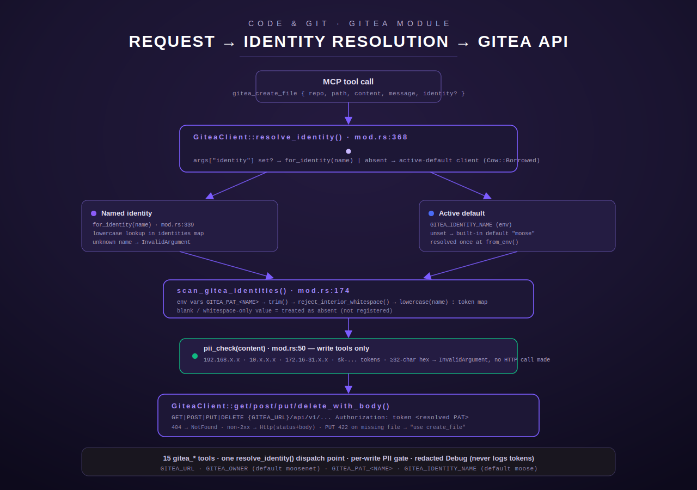

[← Tool index](../README.md) · [← docs index](../../README.md)

# The `gitea` module

`gitea` is Terminus's Gitea source-control integration: 19 `RustTool` implementations
(`src/gitea/mod.rs`) covering repository listing/creation, file CRUD, branch listing/
creation/deletion, pull-request listing/creation/merge/close/diff, directory listing,
Cargo-registry publish/yank, and identity introspection. Every tool talks to a
self-hosted Gitea instance's REST API (`/api/v1/...`) or, for the two Cargo-registry
tools, its Cargo package-registry API (`/api/packages/...`) over `reqwest`. All 19
tools live in the same source file (`src/gitea/mod.rs`); response/request shapes are
in `src/gitea/types.rs`.

> **EGJS-02 note:** line-number citations below the "Tool reference" heading were
> written against the pre-EGJS-02 line layout and have drifted after this item's
> additions (structured-output refactors on `gitea_create_file`/`gitea_update_file`/
> `gitea_delete_file`/`gitea_create_repo`, the new `patch()` transport helper, and
> four new tools). They are still accurate as *pointers to the right function*, just
> not exact line numbers — search by tool/function name instead of trusting the
> digits. See [EGJS-02 additions](#egjs-02-additions-harmony-egress-remainder) below
> for what's new.

Two properties set this module apart from a thin REST wrapper:

- **A write-path PII gate.** Every tool that submits content to Gitea (`gitea_create_file`,
  `gitea_update_file`, and the optional PR body on `gitea_create_pr`) runs that content
  through `pii_check()` (`src/gitea/mod.rs:50-128`) before making any HTTP call. The module
  doc comment is explicit that this check was **missing from the predecessor Python
  `gitea_tools.py`** (`src/gitea/mod.rs:3-5`) — it is a deliberate hardening added in the
  Rust port, not a pre-existing behavior being preserved.
- **A multi-identity credential model.** As of the S105/GPAT consolidation, there is no
  single shared Gitea token. Instead, any number of named identities can be configured as
  `GITEA_PAT_<NAME>` environment variables, and every tool accepts an optional `identity`
  argument selecting which one to act as for that single call. This mirrors the `plane`
  module's `PLANE_PAT_<NAME>` convention (`src/gitea/mod.rs:9-14`).

, runs the PII gate on writes, then dispatches to the Gitea REST or Cargo registry API" width="100%">

## Configuration (env vars — names only)

Per the module doc comment (`src/gitea/mod.rs:7-19`):

| Env var | Purpose | Default |
| --- | --- | --- |
| `GITEA_URL` | Base URL of the Gitea instance (e.g. `https://gitea.example.com`). **Required** — `GiteaClient::from_env()` returns `ToolError::NotConfigured` if unset (`src/gitea/mod.rs:257-259`). | none |
| `GITEA_PAT_<NAME>` | A named-identity personal access token, e.g. `GITEA_PAT_MOOSE`, `GITEA_PAT_HARMONY`, `GITEA_PAT_LUMINA`. **Breaking change (S105/GPAT):** the module no longer reads an unsuffixed `GITEA_TOKEN` at all — every effective token comes from a resolved `GITEA_PAT_<NAME>` (`src/gitea/mod.rs:9-14`, `mod.rs:252-255`). | none |
| `GITEA_IDENTITY_NAME` | Which named identity is the **active default** when a call passes no `identity` argument. | `"moose"` (`DEFAULT_GITEA_IDENTITY`, `src/gitea/mod.rs:144`) — this deliberately differs from the Plane module's default of `"lumina"` (`mod.rs:16-17`, `mod.rs:139-144`) |
| `GITEA_OWNER` | Default repository owner/organisation used when a tool's `owner` argument is omitted. | `"moosenet"` (`src/gitea/mod.rs:260`) |
| `CARGO_PUBLISH_ARTIFACT_DIR` | Optional path-jail root for `gitea_cargo_publish`'s `crate_path` argument (see that tool's section). | unset = no jail beyond the other file-safety checks |
| `CARGO_PUBLISH_MAX_CRATE_BYTES` | Optional override of the `.crate` size ceiling shared by `gitea_cargo_publish` and the `ForgeProvider` adapter's `packages_publish`. | `64 * 1024 * 1024` (64 MiB, `DEFAULT_MAX_CRATE_BYTES`, `src/gitea/mod.rs:1656`) |

## Shared machinery every tool goes through

### `GiteaClient` — one HTTP client, many credentials

`GiteaClient` (`src/gitea/mod.rs:216-231`) holds: a shared `reqwest::Client` (30s timeout,
built once, `src/gitea/mod.rs:282-285`), `base_url`, the **active** `token` + its
`identity_name`, an `Arc<HashMap<String, String>>` of all configured named identities, and
`owner`. It implements a **hand-written, redacted `Debug`** (`src/gitea/mod.rs:235-245`)
that never prints `token` or the `identities` map contents — only `<redacted>` / a count —
so a stray `{:?}` in a log line or panic can never leak a credential.

`GiteaClient::from_env()` (`src/gitea/mod.rs:256-295`) builds the client used by every
concrete tool:
1. Requires `GITEA_URL`; missing ⇒ `ToolError::NotConfigured`.
2. Reads `GITEA_OWNER` (default `"moosenet"`).
3. Calls `scan_gitea_identities()` once to populate the identities map.
4. Resolves the active-default identity **name** from `GITEA_IDENTITY_NAME` (trimmed,
   lowercased, blank treated as unset) or falls back to `"moose"`.
5. Resolves the active-default **token** by looking that name up in the identities map — if
   the default name has no configured `GITEA_PAT_<NAME>`, the token is simply empty and
   every call then fails with a clear Gitea-side auth error rather than a panic
   (`src/gitea/mod.rs:276-280`).

A second constructor, `GiteaClient::with_token()` (`src/gitea/mod.rs:307-332`), builds a
single-credential client for **other Gitea-family providers** (Forgejo `FORGEJO_TOKEN`,
Codeberg `CODEBERG_TOKEN`) that don't use the multi-identity model — used by the separate
`forge` module's `ForgeProvider` adapter, not by any of the 15 `gitea_*` tools directly.

### Named identities: scan, trim, and reject bad tokens

`scan_gitea_identities()` (`src/gitea/mod.rs:174-190`) is the **only** place the
`GITEA_PAT_` prefix (`GITEA_IDENTITY_PREFIX`, `mod.rs:137`) is matched against the process
environment — `gitea_list_identities` derives its answer from the same scanned map rather
than re-scanning, so the two can never drift (`mod.rs:2212-2215`). For every
`GITEA_PAT_<NAME>` var:
- The value is `.trim()`-ed before storage — a trailing newline or surrounding whitespace (a
  common shape when a secret is materialized from a file or an `echo`) would otherwise be
  interpolated verbatim into the `Authorization: token <PAT>` header and make Gitea reject
  every request as unauthenticated (`mod.rs:154-161`).
- A value that trims to empty is treated as **absent**, identically to an unset var.
- The trimmed token is passed to `reject_interior_whitespace()` (`mod.rs:204-214`), which
  rejects any token still containing **interior** whitespace or ASCII control characters
  (e.g. a PAT accidentally materialized as two lines glued together, `"abc\ndef"`).
  Trimming only strips leading/trailing whitespace; an interior space or newline would
  otherwise slip through and either corrupt the `Authorization` header or produce a header
  that parses fine but can never match the real credential — surfacing as a confusing 401
  far from the real cause. A bad token fails loudly at scan time instead, naming the
  offending identity (`mod.rs:162-173`).
- The name is lowercased before insertion, so a later duplicate differing only by case
  collapses onto the same entry, matching how `for_identity()` looks names up.

`GiteaClient::with_token()` applies the identical trim + `reject_interior_whitespace()`
discipline to its single token (`mod.rs:313-319`), and returns `NotConfigured` if the
trimmed token is empty.

### Per-call identity resolution — the one dispatch point

`GiteaClient::resolve_identity()` (`src/gitea/mod.rs:368-373`) is the single shared function
every one of the 15 tools calls at the top of `execute()`:

```rust
fn resolve_identity<'a>(&'a self, args: &Value) -> Result<Cow<'a, Self>, ToolError> {
    match args.get("identity").and_then(|v| v.as_str()) {
        Some(name) if !name.trim().is_empty() => Ok(Cow::Owned(self.for_identity(name)?)),
        _ => Ok(Cow::Borrowed(self)),
    }
}
```

- A non-empty `identity` string argument resolves to `GiteaClient::for_identity(name)`
  (`mod.rs:339-352`): the name is trimmed + lowercased, looked up in the identities map, and
  an owned clone is returned with only the `token`/`identity_name` fields swapped — the HTTP
  client and the identities map itself are shared via `Arc` clone, so resolving one identity
  never exposes another's token. An unknown name returns
  `ToolError::InvalidArgument` naming the expected `GITEA_PAT_<NAME>` var.
- An absent or blank `identity` argument borrows the client unchanged, i.e. acts as the
  **active-default** identity resolved once at `from_env()` time.
- The `identity` argument is consumed for token selection only — it is never placed into a
  request body and never logged (`mod.rs:366-367`).

Every tool's parameter schema exposes this as a shared, single-source-of-truth `identity`
property via `identity_param_schema()` / `with_identity_param()` (`src/gitea/mod.rs:683-703`)
— a JSON-schema fragment inserted into each tool's `properties` object without disturbing its
own required/optional arguments, so all 15 tools describe the argument identically. (The one
exception is `gitea_list_identities`, whose own parameters are `{}` — see its section below.)

### HTTP transport helpers

`GiteaClient` exposes `get`/`post`/`put`/`delete_with_body` (`src/gitea/mod.rs:398-513`),
each building `{base_url}/api/v1{path}` via `api()` (`mod.rs:389-391`) and attaching
`Authorization: token <resolved-token>` via `auth_header()` (`mod.rs:393-395`). Shared status
handling:
- `404` → `ToolError::NotFound` (a generic message; several call sites wrap this with a more
  specific message naming the resource).
- Any other non-2xx → `ToolError::Http` carrying the status code and response body verbatim.
- `put()` additionally special-cases `422 Unprocessable Entity` with its own message: *"file
  may not exist yet — use create_file for new files"* (`mod.rs:472-477`) — this is Gitea's
  actual behavior when a PUT (update) targets a file the SHA-based update endpoint can't
  find, and the module surfaces it as an actionable hint rather than a raw 422.

Two helpers exist purely for internal/other-module use, **not** exposed as their own MCP
tools:
- `get_file_sha()` (`mod.rs:518-522`) — fetches a file's current SHA, required before any
  update/delete (Gitea's contents API is optimistic-concurrency-controlled by SHA).
- `fetch_file_text()` (`mod.rs:531-542`) — fetches and base64-decodes a file's text content;
  used by the `sentinel`/`vigil` modules to read Gitea-hosted status/briefing files directly,
  returning `ToolError::NotFound` (treated by those callers as "no data yet") rather than a
  hard failure when the file is absent.

`resolve_owner()` (`mod.rs:545-547`) implements the `owner` argument convention shared by
almost every tool: an explicit `owner` argument wins, otherwise the client's configured
default (`GITEA_OWNER`) is used.

A further set of `pub(crate)` accessors (`mod.rs:549-673`) — `base_url()`, `owner()`,
`http()`, `authorization()`, `api_url()`, `request_value()`, `request_raw()` — exist so the
**Gitea-family `ForgeProvider` adapter** (`crate::forge::gitea_family`, part of the separate
`forge` module, GITX-02) can drive the exact same client, base URL, resolved token, and HTTP
pool that the concrete `gitea_*` tools use, without ever exposing the token itself outside an
opaque `Authorization` header string. `request_raw()` in particular exists because Gitea's
`/repos/{owner}/{repo}/raw/{path}` endpoint can serve arbitrary binary content — routing it
through the JSON/text helpers would corrupt non-UTF-8 bytes, so it returns exact bytes for the
caller to base64-encode.

### Auth / allowlist model

There is no separate "guarded-tool" approval gate on this module (unlike, say, `ansible` or
`<secret-manager>` writes) — every `gitea_*` tool is directly callable by any MCP client with
network access to Terminus, and access control is entirely the resolved `GITEA_PAT_<NAME>`
token's own Gitea-side scopes (e.g. `write:organization` for `gitea_create_repo`,
`write:package` for the Cargo tools). If `GITEA_URL` is unset, `register()` falls back to
registering **stub** tools under the same 15 names that always return
`ToolError::NotConfigured` (see [Registration](#registration) below) rather than omitting
the tools from the catalog entirely.

---

## Tool reference

### `gitea_list_repos`

**Purpose:** list repositories for the configured (or overridden-via-identity) owner/org
(`src/gitea/mod.rs:708-776`).

| Field | Type | Required | Default |
| --- | --- | --- | --- |
| `limit` | integer | no | `50`, clamped to a max of `50` (`.min(50)`, `mod.rs:741`) |
| `page` | integer | no | `1`, clamped to a min of `1` (`.max(1)`, `mod.rs:742`) |
| `identity` | string | no | active-default identity |

**Behavior:** calls `GET /repos/search?owner=<owner>&limit=<limit>&page=<page>`. Gitea's
search endpoint wraps results as `{"data": [...], "ok": true}`; the tool deserializes only
the `data` array into `Vec<GiteaRepo>` (`mod.rs:748-753`). An empty result set returns the
plain string `"No repositories found for '<owner>'."` rather than an error. Otherwise it
renders a bullet list: `• {full_name} — {description or "no description"} ({"private, " if
private}{default_branch})`.

**Output shape:** plain text (not JSON) — a header line plus one bullet per repo.

**Errors:** any non-2xx from Gitea surfaces as `ToolError::Http`; a malformed `data` field
surfaces as `ToolError::Http("Failed to parse repo list: ...")`.

**Worked example**

Request:
```json
{ "limit": 10, "page": 1 }
```

Response (text):
```
Repositories for 'moosenet' (page 1, showing 2):

• moosenet/lumina-constellation — Lumina agent + secrets vault ()
• moosenet/Chord — LLM proxy / orchestrator / MCP dispatcher ()
```

---

### `gitea_get_repo`

**Purpose:** fetch full detail for one repository (`src/gitea/mod.rs:779-834`).

| Field | Type | Required | Default |
| --- | --- | --- | --- |
| `repo` | string | **yes** | — |
| `owner` | string | no | configured `GITEA_OWNER` |
| `identity` | string | no | active-default identity |

**Behavior:** `GET /repos/{owner}/{repo}`, deserialized into `GiteaRepo`
(`src/gitea/types.rs:6-20`). A `404` is remapped from the generic `"Resource not found in
Gitea"` to a repo-specific message: `"Repository '{owner}/{repo}' not found"`
(`mod.rs:816-819`).

**Output shape:** plain text summary — full name, description (or `"(none)"`), HTML URL,
default branch, private flag, stars/forks/open-issues counts, and last-updated timestamp
(empty string if Gitea returned `null`).

**Worked example**

Request: `{ "repo": "Chord" }`

Response (text):
```
Repository: moosenet/Chord
Description: LLM proxy / orchestrator / MCP tool dispatcher
URL: https://gitea.example/moosenet/Chord
Default branch: main
Private: true
Stars: 0 | Forks: 0 | Open issues: 4
Updated: 2026-07-08T12:00:00Z
```

---

### `gitea_create_repo`

**Purpose:** create a new repository under an organisation, private by default
(`src/gitea/mod.rs:843-935`).

| Field | Type | Required | Default |
| --- | --- | --- | --- |
| `org` | string | **yes** | — trimmed, rejected if empty after trim |
| `name` | string | **yes** | — trimmed, rejected if empty after trim |
| `description` | string | no | `""` |
| `private` | boolean | no | `true` |
| `identity` | string | no | active-default identity |

**Behavior:** unlike every other tool in the module, this one does **not** go through the
`GiteaClient::post()` helper — it makes a direct `reqwest` call
(`POST {GITEA_URL}/api/v1/orgs/{org}/repos`) so it can distinguish and surface specific
status codes the generic helper would otherwise flatten (`mod.rs:838-842`):
- `422 Unprocessable Entity` → `ToolError::InvalidArgument`: *"Repository '{org}/{name}'
  already exists (Gitea returned 422)."*
- `401`/`403` → `ToolError::Http` naming the likely cause: the resolved identity's token
  needs `write:organization` scope for org repos.
- Any other non-2xx → generic `ToolError::Http` with status + body.

The request payload always sends `"auto_init": false` (`mod.rs:885`) — Gitea will **not**
create an initial commit/README, so a fresh repo has zero commits until the caller pushes or
uses `gitea_create_file`.

**Output shape:** JSON string (not the plain-text convention most other tools use):
```json
{ "full_name": "...", "html_url": "...", "clone_url": "...", "ssh_url": "..." }
```
These four fields are read directly from Gitea's response rather than fabricated — in
particular the `ssh_url` form is whatever Gitea itself returns, never synthesized by the tool
(`mod.rs:920-932`).

**Worked example**

Request:
```json
{ "org": "moosenet", "name": "new-tool", "description": "scratch repo", "private": true }
```

Response (JSON string):
```json
{
  "full_name": "moosenet/new-tool",
  "html_url": "https://gitea.example/moosenet/new-tool",
  "clone_url": "https://gitea.example/moosenet/new-tool.git",
  "ssh_url": "<email>:moosenet/new-tool.git" <!-- pii-test-fixture -->
}
```

---

### `gitea_create_file`

**Purpose:** create a new file in a repo (`src/gitea/mod.rs:938-1004`).

| Field | Type | Required | Default |
| --- | --- | --- | --- |
| `repo` | string | **yes** | — |
| `path` | string | **yes** | — |
| `content` | string | **yes** | — plain text (base64-encoded internally before send) |
| `message` | string | **yes** | — commit message |
| `branch` | string | no | repo's default branch |
| `owner` | string | no | configured `GITEA_OWNER` |
| `identity` | string | no | active-default identity |

**Behavior:** runs `pii_check(content)` **before** any network call
(`mod.rs:978-983`) — see [PII gate](#the-pii-gate) below. On a hit, returns
`ToolError::InvalidArgument("Content rejected by PII gate: {reason}")` and logs a `warn!`
naming the repo/path (not the content). If clean, base64-encodes the content and `POST`s
`GiteaFileRequest { message, content, sha: None, branch, new_branch: None }`
(`src/gitea/types.rs:113-123`) to `/repos/{owner}/{repo}/contents/{path}`. `sha: None` is the
signal to Gitea that this is a **create**, not an update.

**Output shape:** plain text: `"File created: {owner}/{repo}/{path}\nCommit: {sha}"`.

**Errors:** a `422` from this endpoint (file already exists at that path) is **not**
specially handled here — it surfaces through the generic `post()` non-2xx path as
`ToolError::Http`.

**Worked example**

Request:
```json
{ "repo": "lumina-constellation", "path": "docs/notes.md", "content": "# Notes\n...", "message": "add notes doc" }
```

Response (text):
```
File created: moosenet/lumina-constellation/docs/notes.md
Commit: 9f3a1c2b8e4d5f60718293a4b5c6d7e8f9012345
```

---

### `gitea_read_file`

**Purpose:** read and decode a file's text content (`src/gitea/mod.rs:1007-1064`).

| Field | Type | Required | Default |
| --- | --- | --- | --- |
| `repo` | string | **yes** | — |
| `path` | string | **yes** | — |
| `ref` | string | no | repo default branch (Gitea-side default when omitted) |
| `owner` | string | no | configured `GITEA_OWNER` |
| `identity` | string | no | active-default identity |

**Behavior:** `GET /repos/{owner}/{repo}/contents/{path}` (optionally `?ref={ref}`, **not**
URL-encoded on this tool — contrast with `gitea_list_directory`'s `ref`, which is
percent-encoded), deserialized into `GiteaFileContent` (`src/gitea/types.rs:23-36`). A `404`
is remapped to `"File not found in repo: {owner}/{repo}/{path}"`. The response's `content`
field is Gitea's base64 with embedded newlines (Gitea wraps lines in its base64 output); the
tool strips `\n`/`\r` before decoding, then lossily converts to UTF-8
(`String::from_utf8_lossy`, so non-UTF-8 files won't error but may show replacement
characters — this tool is not the raw-bytes path; `request_raw()` is for that).

**Output shape:** plain text: `"File: {owner}/{repo}/{path}\nSHA: {sha}\nSize: {size}
bytes\n\n---\n{decoded text}"`.

**Worked example**

Request: `{ "repo": "lumina-constellation", "path": "README.md" }`

Response (text, truncated):
```
File: moosenet/lumina-constellation/README.md
SHA: 4b825dc642cb6eb9a060e54bf8d69288fbee4904
Size: 812 bytes

---
# Lumina Constellation
...
```

---

### `gitea_update_file`

**Purpose:** update an existing file, auto-fetching its current SHA
(`src/gitea/mod.rs:1067-1139`).

| Field | Type | Required | Default |
| --- | --- | --- | --- |
| `repo` | string | **yes** | — |
| `path` | string | **yes** | — |
| `content` | string | **yes** | — new plain-text content |
| `message` | string | **yes** | — commit message |
| `branch` | string | no | repo default |
| `owner` | string | no | configured `GITEA_OWNER` |
| `identity` | string | no | active-default identity |

**Behavior, in order:**
1. `pii_check(content)` runs **before the SHA fetch** — a deliberate fail-fast so a
   PII-tainted update never even reaches Gitea, not even as a read (`mod.rs:1107-1113`,
   confirmed by the test `test_update_file_pii_blocked_before_sha_fetch`,
   `mod.rs:2768-2783`, which asserts no HTTP mock is invoked).
2. `client.get_file_sha(repo, path)` — a `GET` to fetch the current SHA. A `404` here is
   remapped to `"File not found in repo: {owner}/{repo}/{path}. Use create_file for new
   files."` (`mod.rs:1116-1121`).
3. `PUT` `GiteaFileRequest { message, content: base64, sha: Some(sha), branch, new_branch:
   None }` to the same contents endpoint.

**Output shape:** plain text: `"File updated: {owner}/{repo}/{path}\nCommit: {sha}"`.

**Errors:** if the file genuinely doesn't exist, step 2 already returns `NotFound` before any
PUT is attempted, so the `put()` helper's own 422-remap ("use create_file") is a secondary
safety net for a narrower race (e.g. the file existed at SHA-fetch time but was deleted
concurrently before the PUT lands).

**Worked example**

Request:
```json
{ "repo": "lumina-constellation", "path": "docs/notes.md", "content": "# Notes\nupdated", "message": "revise notes" }
```

Response (text):
```
File updated: moosenet/lumina-constellation/docs/notes.md
Commit: a1b2c3d4e5f60718293a4b5c6d7e8f901234abcd
```

---

### `gitea_delete_file`

**Purpose:** delete a file, auto-fetching its SHA (`src/gitea/mod.rs:1142-1195`).

| Field | Type | Required | Default |
| --- | --- | --- | --- |
| `repo` | string | **yes** | — |
| `path` | string | **yes** | — |
| `message` | string | **yes** | — commit message |
| `branch` | string | no | repo default |
| `owner` | string | no | configured `GITEA_OWNER` |
| `identity` | string | no | active-default identity |

**Behavior:** no PII gate (there is no new content being submitted — only a commit message,
which is not scanned). Fetches the SHA via `get_file_sha()` (404 → `"File not found in repo:
{owner}/{repo}/{path}"`), then sends `DELETE` with a JSON body `GiteaDeleteFileRequest {
message, sha, branch }` (`src/gitea/types.rs:126-132`) via `delete_with_body()`, which itself
also maps a `404` (e.g. a race where the file vanished between the SHA fetch and the delete)
to `ToolError::NotFound("File not found in repo")`.

**Output shape:** plain text: `"File deleted: {owner}/{repo}/{path}"`.

**Worked example**

Request: `{ "repo": "lumina-constellation", "path": "docs/stale.md", "message": "remove stale doc" }`

Response (text): `File deleted: moosenet/lumina-constellation/docs/stale.md`

---

### `gitea_list_prs`

**Purpose:** list pull requests for a repo, filterable by state
(`src/gitea/mod.rs:1198-1260`).

| Field | Type | Required | Default |
| --- | --- | --- | --- |
| `repo` | string | **yes** | — |
| `state` | string enum `open` \| `closed` \| `all` | no | `"open"` |
| `limit` | integer | no | `20`, clamped to max `50` (`.min(50)`, `mod.rs:1229`) |
| `page` | integer | no | `1`, clamped to min `1` |
| `owner` | string | no | configured `GITEA_OWNER` |
| `identity` | string | no | active-default identity |

**Behavior:** `GET /repos/{owner}/{repo}/pulls?state={state}&limit={limit}&page={page}`,
deserialized into `Vec<GiteaPullRequest>` (`src/gitea/types.rs:55-70`). An empty result
returns `"No {state} pull requests in {owner}/{repo}."` rather than an error.

**Output shape:** plain text bullet list: `• #{number} — {title} [{state}] by {user.login}
({head.ref_name} → {base.ref_name})`.

**Worked example**

Request: `{ "repo": "Chord", "state": "open", "limit": 5 }`

Response (text):
```
Pull requests in moosenet/Chord (open, page 1, showing 1):

• #42 — fix(pipeline): correct GitHub mirror remote [open] by lumina (fix/mirror-remote → main)
```

---

### `gitea_create_pr`

**Purpose:** open a pull request (`src/gitea/mod.rs:1263-1327`).

| Field | Type | Required | Default |
| --- | --- | --- | --- |
| `repo` | string | **yes** | — |
| `title` | string | **yes** | — |
| `head` | string | **yes** | — source branch |
| `base` | string | **yes** | — target branch (e.g. `main`) |
| `body` | string | no | omitted from the request entirely if not given |
| `owner` | string | no | configured `GITEA_OWNER` |
| `identity` | string | no | active-default identity |

**Behavior:** if `body` is present, `pii_check(body)` runs first
(`mod.rs:1302-1310`) — same PII gate as the file-write tools, blocking with
`ToolError::InvalidArgument("PR body rejected by PII gate: {reason}")` and a `warn!` log
naming repo/owner only. Then `POST /repos/{owner}/{repo}/pulls` with
`GiteaCreatePrRequest { title, head, base, body }` (`src/gitea/types.rs:135-142` — `body` is
`skip_serializing_if = "Option::is_none"`, so an absent body is simply omitted from the JSON
rather than sent as `null`).

**Output shape:** plain text: `"Pull request created: #{number} — {title}\nURL:
{html_url}\n{head.ref_name} → {base.ref_name}"`.

**Worked example**

Request:
```json
{ "repo": "Chord", "title": "fix: correct mirror remote", "head": "fix/mirror-remote", "base": "main", "body": "Fixes the mirror push target." }
```

Response (text):
```
Pull request created: #42 — fix: correct mirror remote
URL: https://gitea.example/moosenet/Chord/pulls/42
fix/mirror-remote → main
```

---

### `gitea_merge_pr`

**Purpose:** merge an existing pull request (`src/gitea/mod.rs:1330-1396`).

| Field | Type | Required | Default |
| --- | --- | --- | --- |
| `repo` | string | **yes** | — |
| `pr` | integer | **yes** | — PR number |
| `style` | string enum `merge` \| `rebase` \| `squash` | no | `"merge"` |
| `message` | string | no | omitted if not given |
| `owner` | string | no | configured `GITEA_OWNER` |
| `identity` | string | no | active-default identity |

**Behavior:** builds `{ "Do": style }` (Gitea's merge-endpoint field name for the merge
style) and, if `message` is present, adds `"MergeMessageField": message`. Like
`gitea_create_repo`, this makes a **direct** `reqwest` call rather than going through
`GiteaClient::post()` — the merge endpoint returns `200` with **no response body** on
success, which the generic JSON-deserializing `post()` helper can't handle
(`mod.rs:1371-1381`). A `404` is remapped to `"Pull request #{pr_num} not found in
{owner}/{repo}"`; any other non-2xx surfaces as `ToolError::Http("Merge failed: {status}:
{body}")`.

**Output shape:** plain text, built from a `format!` whose named argument is worth reading
literally (`mod.rs:1394`):
```rust
Ok(format!("Pull request #{pr_num} merged into {base} in {owner}/{repo}.", base = style))
```
The `{base}` placeholder is bound to the **`style`** variable, not the PR's actual target
branch — so the success message reports the merge *style* (`merge`/`rebase`/`squash`) in the
position a reader would expect the target branch name. This is what the code does today; if
you need to know the actual base branch a PR merged into, call `gitea_list_prs` (which
reports the real `base.ref_name`) rather than trusting this message's wording.

**Worked example**

Request: `{ "repo": "Chord", "pr": 42, "style": "squash" }`

Response (text): `Pull request #42 merged into squash in moosenet/Chord.` (see the caveat
above — this repo's actual base branch, e.g. `main`, is not what's printed here).

---

### `gitea_list_directory`

**Purpose:** list files/sub-directories at a path (`src/gitea/mod.rs:1401-1468`).

| Field | Type | Required | Default |
| --- | --- | --- | --- |
| `repo` | string | **yes** | — |
| `path` | string | no | `""` (repo root); leading/trailing `/` trimmed |
| `ref` | string | no | repo default |
| `owner` | string | no | configured `GITEA_OWNER` |
| `identity` | string | no | active-default identity |

**Behavior:** builds `/repos/{owner}/{repo}/contents/` (root) or
`/repos/{owner}/{repo}/contents/{path}`. If `ref` is given, it is **percent-encoded** for
space/`#`/`?`/`&` (`mod.rs:1439-1449`) before being appended as `?ref={encoded}` — unlike
`gitea_read_file`'s `ref`, which is passed through unencoded. Response is parsed as a raw
`Vec<Value>` (not a typed struct) and rendered with an emoji indicator per entry: `📁` for
`"dir"`, `📄` for anything else (`mod.rs:1460-1465`). A `404` is remapped to `"Path not
found: {owner}/{repo}/{path}"`.

**Output shape:** plain text: header line `"Directory: {owner}/{repo}/{path or "/"}\n{n}
entries:\n"` followed by one indicator+name line per entry.

**Worked example**

Request: `{ "repo": "lumina-constellation", "path": "crates" }`

Response (text):
```
Directory: moosenet/lumina-constellation/crates
2 entries:
  📁 lumina-core
  📁 lumina-secrets
```

---

### `gitea_list_branches`

**Purpose:** list branches in a repo (`src/gitea/mod.rs:1470-1527`).

| Field | Type | Required | Default |
| --- | --- | --- | --- |
| `repo` | string | **yes** | — |
| `limit` | integer | no | `30`, clamped to max `50` |
| `page` | integer | no | `1`, clamped to min `1` |
| `owner` | string | no | configured `GITEA_OWNER` |
| `identity` | string | no | active-default identity |

**Behavior:** `GET /repos/{owner}/{repo}/branches?limit={limit}&page={page}`, deserialized
into `Vec<GiteaBranchInfo>` (`src/gitea/types.rs:97-102`). Empty ⇒ `"No branches found in
{owner}/{repo}."`.

**Output shape:** plain text bullet list: `• {name} ({first-8-chars-of-commit-id}{",
protected" if protected})`. The commit id is truncated with `.get(..8)`, falling back to the
full id if it's shorter than 8 characters (`mod.rs:1521`).

**Worked example**

Request: `{ "repo": "Chord" }`

Response (text):
```
Branches in moosenet/Chord (page 1, showing 2):

• main (9f3a1c2b, protected)
• fix/mirror-remote (a1b2c3d4)
```

---

### `gitea_cargo_publish`

**Purpose:** publish a locally-packaged `.crate` file to the Gitea Cargo registry, using a
resolved `GITEA_PAT_<NAME>` token — so **no `cargo publish` credential ever lives on the dev
box** (`src/gitea/mod.rs:1840-2029`). This tool reimplements the wire protocol `cargo
publish` itself speaks; Gitea's Cargo package registry (verified against Gitea 1.25.x)
exposes it at `PUT {GITEA_URL}/api/packages/{owner}/cargo/api/v1/crates/new`
(`mod.rs:1540-1550`) — note this is under `/api/packages/...`, **not** the `/api/v1/...`
surface every other tool in this module uses, so it builds its URL directly from `base_url`.

| Field | Type | Required | Default |
| --- | --- | --- | --- |
| `crate_path` | string | **yes** | path (on the Terminus host) to a `.crate` file from `cargo package` |
| `name` | string | **yes** | crate name |
| `version` | string | **yes** | crate version, e.g. `1.2.0` |
| `owner` | string | no | configured `GITEA_OWNER` |
| `metadata` | object | **yes** | the full Cargo *publish-wire* metadata object (deps/features/etc. — **not** `cargo metadata`'s own schema) |
| `identity` | string | no | active-default identity |

**Why `metadata` is required, not optional:** `build_cargo_metadata()`
(`mod.rs:1573-1646`) starts from a fully-defaulted skeleton (`deps: []`, `features: {}`, all
optional fields `null`), layers the caller-provided `metadata` object over it, then
force-overwrites `name`/`vers` from the explicit tool arguments so the framed metadata can
never disagree with what the tool was told to publish. If `deps` were silently defaulted to
`[]` for a crate that actually has dependencies, Gitea would index it with no dependency
records — this is a real bug the code comment cites as having previously bitten
`terminus-rs` 1.3.0 (`mod.rs:1620-1628`, see also the related [`gitea_cargo_yank`
comment](#gitea_cargo_yank) about why that release needed yanking). As part of the same fix:
any dependency entry in `deps` that doesn't already specify a `registry` field has one
defaulted to `CRATES_IO_INDEX_URL` (`"https://github.com/rust-lang/crates.io-index"`,
`mod.rs:1571`) — an **omitted** `registry` field in a Cargo registry index entry means "this
dependency lives in the same registry as the crate being published" (i.e. this private
Gitea registry), which is wrong for the ordinary crates.io deps (`tokio`, `serde`, etc.) a
crate like `terminus-rs` actually has. A dependency that explicitly sets `registry` — to a
real value **or** to `null` — is left untouched, since that's how a caller expresses "this
dependency really is intra-registry."

**File-safety validation (before any bytes are read):**
- `resolve_crate_path()` (`mod.rs:1784-1838`): the path must end in `.crate`
  (case-insensitive); it is `canonicalize()`-d (which requires the file to exist and resolves
  symlinks); it must be a regular file (directories/devices rejected); its size (via
  `metadata()`, before reading) must be `<= max_bytes`; if `CARGO_PUBLISH_ARTIFACT_DIR` is
  configured, the canonicalized path must live inside the canonicalized artifact directory.
- `read_bounded_crate()` (`mod.rs:1699-1743`) then opens the file and re-checks safety
  against the **already-open handle** rather than the path string again, closing a
  resolve→open TOCTOU (time-of-check/time-of-use) race where a symlink could be swapped in
  between the two checks. On Linux this resolves the real path via `/proc/self/fd/<fd>`
  (`opened_file_real_path()`, `mod.rs:1750-1766`). It reads at most `max_bytes + 1` bytes so
  an oversized or still-growing source file can never exhaust memory, then rejects if the
  actual length exceeds `max_bytes`.
- `max_bytes` comes from `cargo_publish_max_crate_bytes()` (`mod.rs:1663-1669`): the
  `CARGO_PUBLISH_MAX_CRATE_BYTES` env var if set to a valid positive integer, else
  `DEFAULT_MAX_CRATE_BYTES` (64 MiB). This same function is shared by the `forge` module's
  `ForgeProvider::packages_publish` adapter so one knob governs both entry points.
- `is_valid_owner_segment()` (`mod.rs:1679-1686`) rejects an `owner` value that isn't a
  single safe path segment (empty, `.`, `..`, or containing anything outside
  alphanumerics/`-`/`_`/`.`) — the owner is interpolated directly into the publish URL
  alongside a privileged bearer token, so a value like `../../other-org` must never be able
  to re-target the request.

**No PII gate on the crate bytes.** Unlike the file-write tools, `gitea_cargo_publish` does
**not** run `pii_check` over the crate contents — the code comment explains why: the
artifact is an opaque binary blob, and the publish target is the **internal** Gitea registry
(which legitimately holds internal repository references), not the public GitHub mirror —
scanning would only false-positive on binary content (`mod.rs:1941-1945`).

**Wire framing:** `build_cargo_publish_body()` (`mod.rs:1552-1564`) assembles the standard
Cargo publish binary frame: `u32-LE(metadata_json.len) || metadata_json || u32-LE(crate.len)
|| crate_bytes`. Sent as `Content-Type: application/octet-stream` with `Authorization: token
<PAT>` — the same PAT auth scheme every other `GiteaClient` request uses (a `Bearer` prefix
would make Gitea treat it as an OAuth2 credential and reject it, per the code comment at
`mod.rs:1958-1963`).

**Status handling:** `401` → *"the resolved GITEA_PAT_<NAME> identity token is missing or
invalid."* `403` → names the likely cause: missing `write:package` scope. `409 Conflict` →
`ToolError::Conflict`: *"Crate {name}@{version} already exists ... Bump the version to
publish."* Other non-2xx → generic `ToolError::Http`. On success, the response's optional
`warnings` field (if the registry included one) is surfaced.

**Output shape:** JSON string:
```json
{ "published": true, "name": "...", "version": "...", "owner": "...", "registry_url": "...", "warnings": null }
```
`registry_url` is constructed by the tool itself (not returned by Gitea) as
`{base_url}/{owner}/-/packages/cargo/{name}/{version}`.

**Worked example**

Request:
```json
{
  "crate_path": "<staging-dir>/target/package/terminus-rs-1.3.1.crate",
  "name": "terminus-rs",
  "version": "1.3.1",
  "metadata": {
    "deps": [{ "name": "tokio", "version_req": "^1", "features": [], "optional": false, "default_features": true, "kind": "normal" }],
    "authors": [], "description": "Terminus MCP tool hub client bindings"
  }
}
```

Response (JSON string):
```json
{
  "published": true,
  "name": "terminus-rs",
  "version": "1.3.1",
  "owner": "moosenet",
  "registry_url": "https://gitea.example/moosenet/-/packages/cargo/terminus-rs/1.3.1",
  "warnings": null
}
```

---

### `gitea_cargo_yank`

**Purpose:** yank or unyank a published crate version — the **reversible** primitive for
retiring a broken/poisoned release (`src/gitea/mod.rs:2031-2184`). The doc comment gives the
worked example this tool exists for: a version published with incorrect metadata that
resolves dependencies as `registry: null` (exactly the bug `gitea_cargo_publish`'s
`build_cargo_metadata` was hardened against) is the right case to yank rather than hard-delete
(`mod.rs:2033-2045`). Implements the standard [Cargo registry web API yank
endpoints](https://doc.rust-lang.org/cargo/reference/registry-web-api.html#yank):
`DELETE .../crates/{crate}/{version}/yank` sets `yanked = true`; `PUT
.../crates/{crate}/{version}/unyank` clears it. Yanking does **not** remove the crate — it
only stops it from being resolved by **new** `Cargo.lock` files; existing lockfiles that
already pinned the version keep working.

| Field | Type | Required | Default |
| --- | --- | --- | --- |
| `crate` | string | **yes** | crate name in the registry |
| `version` | string | **yes** | version to yank/unyank, e.g. `1.3.0` |
| `unyank` | boolean | no | `false` (yank). `true` clears an existing yank. |
| `owner` | string | no | configured `GITEA_OWNER` |
| `identity` | string | no | active-default identity |

**Behavior:** `owner`, `name` (crate), and `version` are **all** validated with
`is_valid_owner_segment()` before being interpolated into the URL — each is directly
concatenated alongside a privileged bearer token, so any of the three could otherwise be
used for path-segment injection (`mod.rs:2102-2121`). `action` is `"unyank"` (method `PUT`)
or `"yank"` (method `DELETE`) based on the `unyank` flag.

**Status handling:** `401` → missing/invalid token. `403` → likely missing `write:package`
scope for the {action}. `404` → `ToolError::NotFound`: *"Crate {owner}/{name}@{version} was
not found ... cannot {action} a version that doesn't exist."* Other non-2xx → generic
`ToolError::Http`. Note there is **no** `409`-specific handling here (unlike
`gitea_cargo_publish`) — yank/unyank on an already-yanked/unyanked version is whatever Gitea
itself returns, mapped generically.

**Output shape:** JSON string:
```json
{ "action": "yank", "yanked": true, "name": "...", "version": "...", "owner": "..." }
```
`"yanked"` is the **logical result** (`!unyank`), not something re-read from Gitea after the
call.

**Worked example**

Request: `{ "crate": "terminus-rs", "version": "1.3.0" }` (yank, `unyank` omitted ⇒ `false`)

Response (JSON string):
```json
{ "action": "yank", "yanked": true, "name": "terminus-rs", "version": "1.3.0", "owner": "moosenet" }
```

---

### `gitea_list_identities`

**Purpose:** list the names of every configured `GITEA_PAT_<NAME>` identity so a caller can
choose which identity to act as *before* doing Gitea work (`src/gitea/mod.rs:2191-2233`).
Mirrors `plane_list_identities` in the `plane` module.

**Parameters:** `{}` — this is the one tool in the module that does **not** take the shared
`identity` argument (it isn't wrapped in `with_identity_param()`, and its schema is a bare
empty object, `mod.rs:2203-2209`), because it always answers about every configured
identity, not one selected identity.

**Behavior:** reads `self.client.identity_names()` (`mod.rs:383-387`) — names only, sorted,
**derived from the already-scanned identities map** populated once at process start via
`scan_gitea_identities()`, never a fresh env re-scan, so this can never report an identity
that `resolve_identity()`/`for_identity()` couldn't actually resolve. Also reports the
client's `active_default` name and the literal prefix string `GITEA_IDENTITY_PREFIX`
(`"GITEA_PAT_"`). If zero identities are configured, adds a `note` field pointing the caller
at the expected env-var shape.

**Output shape:** JSON string:
```json
{ "identities": [...], "count": N, "active_default": "moose", "prefix": "GITEA_PAT_" }
```

**Worked example**

Request: `{}`

Response (JSON string):
```json
{
  "identities": ["harmony", "lumina", "moose"],
  "count": 3,
  "active_default": "moose",
  "prefix": "GITEA_PAT_"
}
```

---

## EGJS-02 additions (harmony egress remainder)

Closes the Gitea-side gaps left by LHEG-06 (harmony's egress-cutover item):
harmony's direct-REST bypass surfaces that had no terminus tool equivalent, or
whose existing tool had no structured (`structuredContent`) output for a
production write path.

### structuredContent added to existing write tools

`gitea_create_file`, `gitea_update_file`, `gitea_delete_file`, and
`gitea_create_repo` now override `execute_structured` (via a shared private
`run()` helper, the same pattern EGJS-01 established for the read tools) so a
structured-aware caller gets the parsed result instead of having to parse the
text summary:

- `gitea_create_file` / `gitea_update_file` → the full `GiteaFileResponse`
  (`content` + `commit`, `src/gitea/types.rs`) as `structuredContent`.
- `gitea_delete_file` → `{ owner, repo, path, deleted: true, sha }` (Gitea's
  delete endpoint returns no body, so this is synthesized from what the tool
  already knows rather than re-read from Gitea).
- `gitea_create_repo` → `{ full_name, html_url, clone_url, ssh_url }` (the same
  object the text output already serialized, now also available as
  `structuredContent` rather than only as a JSON-formatted string).

`gitea_read_file`'s structured output also gained a `content_base64` field
alongside its existing (lossily UTF-8-decoded) `content` field — the raw,
un-decoded base64 Gitea returned, for callers whose type contract expects
base64 (harmony's `FileContent.content_base64`) where re-encoding decoded text
would corrupt non-UTF-8 file content.

### New tools

- **`gitea_create_branch`** — `POST /repos/{owner}/{repo}/branches` with
  `{ new_branch_name, old_branch_name? }` (old branch defaults to the repo's
  default branch server-side if omitted). Returns the new `GiteaBranchInfo` as
  `structuredContent`.
- **`gitea_delete_branch`** — `DELETE /repos/{owner}/{repo}/branches/{branch}`
  (direct `reqwest` call, no response body). A `404` is remapped to a
  branch-specific `NotFound`.
- **`gitea_close_pr`** — `PATCH /repos/{owner}/{repo}/pulls/{index}` with
  `{ "state": "closed" }`, distinct from `gitea_merge_pr` (closes **without**
  merging). Uses a new `GiteaClient::patch()` transport helper (mirrors `put`'s
  status handling: `404` → `NotFound`, other non-2xx → `Http`). Returns the
  updated `GiteaPullRequest` as `structuredContent`.
- **`gitea_get_pr_diff`** — `GET /repos/{owner}/{repo}/pulls/{index}.diff`,
  Gitea's raw-diff suffix endpoint (returns `text/plain`, not JSON). Uses
  `GiteaClient::request_raw()` (already used for binary file content) so
  non-UTF-8 bytes inside a diff's binary-file hunks are read losslessly, then
  lossily decoded to UTF-8 only at the very end for both the text summary and
  `structuredContent.diff`. Production call site this unblocks:
  `review::reviewer::run_review_batch` in harmony.

All four are registered in `register()` alongside the existing 15, with
matching `NotConfiguredStub` entries when `GITEA_URL` is unset, and all expose
the shared optional `identity` argument like every other CRUD tool in the
module.

## The PII gate

`pii_check()` (`src/gitea/mod.rs:50-128`) is a hand-rolled scanner run over any content a
tool is about to submit to Gitea — `gitea_create_file` and `gitea_update_file`'s `content`,
and `gitea_create_pr`'s optional `body`. It returns `Some(reason)` on the **first** match
found, else `None`. Patterns checked, in order:

1. **`192.168.x.x`** — any occurrence of the literal substring `192.168.` is treated as a
   match unconditionally (`mod.rs:52-70`).
2. **`10.x.x.x`** — a `10.` occurrence is only flagged if the character immediately following
   is an ASCII digit, so prose like `"10. Conclusion"` does not false-positive (verified by
   `test_pii_gate_allows_10_percent`, `mod.rs:2438-2444`).
3. **`172.16.x.x`–`172.31.x.x`** — the digits immediately after `172.` are parsed as a `u8`;
   flagged only if that number falls in `16..=31` inclusive (verified by
   `test_pii_gate_allows_172_15`, `mod.rs:2452-2457`, which confirms `172.15.x.x` is
   correctly treated as public/non-RFC-1918).
4. **`sk-` API-key-shaped tokens** — after an `sk-` occurrence, if the following run of <!-- pii-test-fixture -->
   alphanumeric/`-`/`_` characters is `>= 20` chars, it's flagged as an API key.
5. **Long hex runs** — any contiguous run of `>= 32` hex digits anywhere in the content is
   flagged as a probable secret/bearer token, independent of the other checks.

Each check runs over the **whole content string** and stops at the first hit — it is a
best-effort textual scanner, not a structural/semantic PII classifier, and the module's own
doc comment frames it as closing a gap that existed in the Python predecessor rather than as
an exhaustive guarantee.

## Registration

`register()` (`src/gitea/mod.rs`) is called once at Terminus startup. It attempts
`GiteaClient::from_env()`:
- **Success:** all 19 tools are registered, each holding a `.clone()` of the same
  `GiteaClient` (cheap — the `reqwest::Client` and identities map are both internally
  `Arc`-backed).
- **Failure (`GITEA_URL` unset):** logs a `tracing::warn!` and registers 19
  `NotConfiguredStub` instances under the identical tool names instead, each of which
  always returns `ToolError::NotConfigured("GITEA_URL environment variable is not
  set...")`. This means the tools remain visible and self-documenting in the MCP
  catalog even when Gitea integration isn't configured, rather than silently
  disappearing.

## Testing

The module ships an in-file `#[cfg(test)] mod tests` block (`src/gitea/mod.rs:2310` onward)
using `httpmock::MockServer` for HTTP-level tests: token whitespace-hardening (interior
whitespace/newline/control-char rejection for both `scan_gitea_identities` and
`with_token`), every PII-gate branch (each of the five pattern classes, plus the two
"should NOT match" edge cases — `10. Conclusion` and `172.15.x.x`), and per-tool
request/response round-trips for `list_repos`, `get_repo` (including its 404 remap),
`create_file` (including the PII-blocked path, verified via no mock being hit),
`read_file`/`fetch_file_text` base64 decoding (including 404), and `update_file`'s
fetch-SHA-then-PUT sequencing (including PII blocking before the SHA fetch is even
attempted).

---

[← Tool index](../README.md) · [← docs index](../../README.md)
