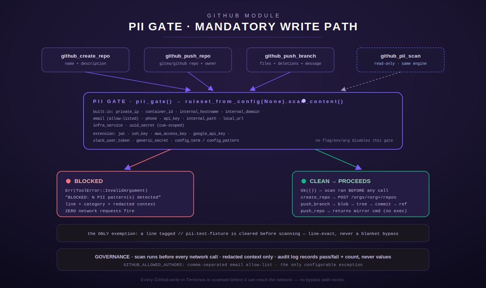

[← Tool index](../README.md) · [← docs index](../../README.md)

# `github` — public-GitHub write path + PII gate

The `github` module (`src/github/mod.rs`) is Terminus's integration with the **public**
GitHub side of the constellation's source-control story, as opposed to the internal Gitea
integration (`gitea`, see [`code-git/gitea.md`](gitea.md)). Gitea is where day-to-day
development happens; GitHub is the curated, PII-swept **public mirror** — anything this
module writes can end up in front of the internet, so every write-shaped tool here is wired
through a mandatory PII gate before a single byte reaches GitHub's API
(`src/github/mod.rs:27-30`).

The module is a straight Rust port of an earlier Python `github_tools.py` fleet script
(`src/github/mod.rs:1`), re-implemented as five `RustTool`s plus a shared `GitHubConfig`
and credential helper:

| Tool | Kind | Gated? |
| --- | --- | --- |
| [`github_pii_scan`](#github_pii_scan) | read-only diagnostic | N/A — it *is* the gate, exposed as a tool |
| [`github_list_repos`](#github_list_repos) | read-only | no |
| [`github_create_repo`](#github_create_repo) | write | yes |
| [`github_push_repo`](#github_push_repo) | write (command builder) | yes |
| [`github_push_branch`](#github_push_branch) | write (Git Data API) | yes |

A sixth, larger surface — the provider-agnostic `git_public`/`git_private` dispatch tools
built on top of [`GitHubAdapter`](#the-adapter-a-second-broader-surface) — is registered by
a *different* module (`forge`) and documented separately; see
[`code-git/forge.md`](forge.md). This page covers only the five tools `github::register`
itself puts in the registry, plus the `pii.rs` engine they all share.



## Module overview

### Configuration (`GitHubConfig`)

`GitHubConfig::from_env()` (`src/github/mod.rs:60-81`) reads:

| Env var | Required | Default | Purpose |
| --- | --- | --- | --- |
| `GITHUB_PAT_<NAME>` | yes (or `GITHUB_TOKEN`) | — | Per-identity GitHub personal-access/app token, resolved for the active default identity (`GITHUB_IDENTITY_NAME`, default `moose` — so `GITHUB_PAT_MOOSE` in practice) via the adapter's `resolve_token`. Needs the `repo` scope (push/create) plus `admin:org` to create/push under an org (`mod.rs:13-17`). (GHTOK-01) |
| `GITHUB_TOKEN` | fallback | — | Legacy unsuffixed operator token, honored **only** when the active-default identity has no `GITHUB_PAT_<NAME>` provisioned. If neither this nor a `GITHUB_PAT_<NAME>` is set ⇒ `ToolError::NotConfigured` (`mod.rs`, `github_token()`). The operator has since retired the unsuffixed token in favor of `GITHUB_PAT_MOOSE`. |
| `GITHUB_ORG` | no | `moosenet-io` (`DEFAULT_ORG`, `mod.rs:46`) | Target org for `github_list_repos`/`github_create_repo` and the default `owner` for `github_push_branch`. |
| `GITEA_URL` | no | `https://gitea.example.com` (`DEFAULT_GITEA_URL`, `mod.rs:47`) | Base URL referenced when `github_push_repo` builds its mirror command. |
| `GITHUB_API_BASE` | no | `https://api.github.com` (`GITHUB_API`, `mod.rs:48`) | Test-only override so unit tests can point at an `httpmock` server instead of the real API (`mod.rs:20-22`); leave unset in production. |

`GitHubConfig::from_env()` resolves its token through `github_token()` (GHTOK-01), so the
config credential follows the same `GITHUB_PAT_<NAME>`-first, `GITHUB_TOKEN`-fallback order
as the mirror push path — there is one credential-read point, not two.

If `GitHubConfig::from_env()` fails (no `GITHUB_PAT_<NAME>` and no `GITHUB_TOKEN`), `register()` does **not** panic or
silently omit the tools — it logs a warning and registers `NotConfiguredStub` placeholders
under the same four names (`github_list_repos`, `github_create_repo`, `github_push_repo`,
`github_push_branch`), each of which always returns `ToolError::NotConfigured` when called
(`mod.rs:940-946`, stub impl at `mod.rs:905-915`). `github_pii_scan` is registered
unconditionally, before the token check, because it is a pure local diagnostic that needs no
GitHub credential at all (`mod.rs:919-922`).

Every outbound request carries the same headers via `GitHubConfig::apply_headers`
(`mod.rs:92-96`): `Authorization: token <GITHUB_TOKEN>`, `Accept:
application/vnd.github+json`, `X-GitHub-Api-Version: 2022-11-28`. The HTTP client
(`GitHubConfig::client()`, `mod.rs:83-89`) is built fresh per tool struct with a 20-second
timeout and a `MooseNet-MCP/1.0` user agent — there is no shared connection pool across
tools, no retry logic, and no egress allowlist at this layer (the allowlist/redirect
hardening described under [the adapter](#the-adapter-a-second-broader-surface) belongs to
`adapter.rs`'s `GitHubAdapter`, not to this module's simpler `GitHubConfig`).

### Credential resolution (`github_token()`)

The single credential helper `pub(crate) fn github_token()` is "the single sanctioned read
point the mirror push tool (GHMR-04) shares with the rest of the github module" — and, as of
GHTOK-01, `GitHubConfig::from_env()` also routes through it, so there is exactly one place in
the module that reads a GitHub token. Rather than reading `GITHUB_TOKEN` directly, it now
delegates to the adapter's identity resolution (`GitHubAdapter::from_env().resolve_token(None)`),
which resolves in this order:

1. `GITHUB_PAT_<NAME>` for the active-default identity (`GITHUB_IDENTITY_NAME`, default
   `moose` — so `GITHUB_PAT_MOOSE` in the common case).
2. The unsuffixed `GITHUB_TOKEN`, kept **only** as a legacy fallback for a deployment that
   has not yet provisioned a per-identity PAT.

`NotConfigured` is returned when **neither** is set. This keeps mirror-related code from
scattering its own raw `std::env::var("GITHUB_TOKEN")` calls and gives the module the same
per-identity resolution the `forge` adapter already used. In this crate, secrets are
materialized into the process environment at startup by a `secrets_bootstrap` step sourced
from the fleet secret store, so this env read *is* the vault access path — not a bypass of
it. The caller must never log or echo the returned string.

### The PII gate is mandatory, not configurable

Every write tool's `execute()` builds a single scan buffer from **all** operator-supplied
content that would land on GitHub and calls `pii::pii_gate(&buf)` **before** constructing
any URL or firing any request:

- `github_create_repo` scans `"{name}\n{description}"` (`mod.rs:320`).
- `github_push_repo` scans `"{gitea_repo}\n{github_repo}\n{gitea_owner}"` — the identifiers
  that get embedded into the generated shell command (`mod.rs:421`).
- `github_push_branch` scans owner, repo, branch, base_sha, message, committer name/email,
  every file's path and *decoded* content, and every deletion path (`mod.rs:650-663`).

There is, by design, no flag, env var, or argument anywhere in this module that disables the
gate (`mod.rs:27-30`; `pii.rs:1-11`). The only configurable exception is author-attribution
email allow-listing via `GITHUB_ALLOWED_AUTHORS` (see [Patterns scanned](#patterns-scanned-in-full)
below) — every other category is unconditional.

## Auth, identity, and allowlist notes

This module (as opposed to `adapter.rs`) still has **no egress allowlist** and issues its own
HTTP calls, but as of GHTOK-01 it no longer reads a raw `GITHUB_TOKEN`: its credential is
resolved through `github_token()`, which reuses the adapter's `GITHUB_PAT_<NAME>`-first
identity resolution (default `moose` → `GITHUB_PAT_MOOSE`, legacy `GITHUB_TOKEN` fallback).
The resolved token is what it authenticates with against whatever
`GITHUB_API_BASE` resolves to (real API in production, `httpmock` in tests), and it does not
constrain which GitHub hosts it will contact beyond the fixed `api.github.com`
(`GITHUB_API`, `mod.rs:48`) it builds URLs against for `github_list_repos` and
`github_create_repo` (note these two hard-code `GITHUB_API` rather than
`self.cfg.api_base` — see the [`github_list_repos`](#github_list_repos) and
[`github_create_repo`](#github_create_repo) sections). `github_push_branch` is the one tool
in this module that *does* honor `self.cfg.api_base` for all seven of its Git Data API calls
(`mod.rs:665-869`), which is what makes it independently testable against `httpmock`.

Per-identity tokens (`GITHUB_PAT_<NAME>`), the `GITHUB_IDENTITY_NAME` default-identity
selector, and the redirect-safe egress allowlist (`GITHUB_EGRESS_ALLOWLIST`) are a
**separate, richer credential/egress model** implemented in `adapter.rs`'s `GitHubAdapter`
for the `forge`-module `git_public`/`git_private` dispatch tools — not used by any of the
five tools this page documents. See [The adapter](#the-adapter-a-second-broader-surface)
below.

## Tool reference

### `github_pii_scan`

Read-only diagnostic that exposes the exact same PII engine the write tools use, so an agent
or the mirror pipeline can pre-check content or a whole directory tree without attempting a
write (`mod.rs:184-240`).

**Input schema** (`mod.rs:201-209`):

| Field | Type | Required | Default | Notes |
| --- | --- | --- | --- | --- |
| `content` | string | one of `content`/`tree_path` | — | Text to scan directly. |
| `tree_path` | string | one of `content`/`tree_path` | — | Local directory tree to sweep recursively. |

Neither field is marked `"required"` in the JSON Schema (there's no top-level `"required"`
array at all) — the required-ness is enforced at runtime instead.

**Behavior** (`execute`, `mod.rs:211-239`):

- `content` set (regardless of `tree_path`) → scans that single string with
  `ruleset_from_config(None).scan_content(text)` — i.e. the **content-scan** engine, which
  includes any `TERMINUS_PII_CONFIG`-supplied extra terms/patterns but *not* a repo-root
  `pii-gate.toml` (that path only applies when a `root` is passed, and this call passes
  `None` — see [`ruleset_from_config`](#configuration-resolution-order) below). Returns
  `{"clean": bool, "count": usize, "violations": [{"line", "pattern_kind", "context"}, …]}`
  (`mod.rs:218-229`). Note the field is named `pattern_kind` in the output even though the
  struct field on `PiiViolation` is `category` — the mapping happens in this handler
  (`mod.rs:224`).
- `content` unset, `tree_path` set → walks the directory with
  `ruleset_from_config(Some(root)).scan_tree(root)` (so a `pii-gate.toml` at `tree_path` root
  *is* honored here) and returns `violations_to_json(&vs)`
  (`pii.rs:711-723`): `{"clean", "count", "violations": [{"file", "line", "pattern_kind",
  "context"}, …]}` — note this shape additionally carries `file` per violation, which the
  content-only branch above does not.
- Neither field set → `Err(ToolError::InvalidArgument("provide either 'content' or
  'tree_path'"))` (`mod.rs:235-237`).

**Error/edge cases:** No GitHub credential is required at all — this tool works identically
whether or not `GITHUB_TOKEN` is configured, and is registered unconditionally
(`mod.rs:919-922`). A `tree_path` sweep silently skips binary files (any file containing a
NUL byte), files over 5 MiB, and a fixed exclusion list of file/dir names/extensions — see
[Tree-sweep exclusions](#tree-sweep-exclusions-scan_tree-only) below; it never panics on an
unreadable file, it just skips it (`pii.rs:511-514`, `pii.rs:533-537`).

**Worked example:**

```json
// request
{ "name": "github_pii_scan", "arguments": { "content": "contact <email> about this" } }
```
```json
// response (content is JSON-encoded as a string by the tool's Ok(String) return)
{ "clean": false, "count": 1, "violations": [
  { "line": 1, "pattern_kind": "email", "context": "op…om [15 chars redacted]" }
] }
```

### `github_list_repos`

Read-only. Lists repositories in the configured org (`mod.rs:242-286`).

**Input schema:** `{ "type": "object", "properties": {} }` (`mod.rs:250-252`) — no
arguments at all.

**Behavior:**

- `GET {GITHUB_API}/orgs/{org}/repos?per_page=100&sort=updated` (`mod.rs:255-258`) — note
  this literally interpolates the constant `GITHUB_API`, **not** `self.cfg.api_base`, so
  (unlike `github_push_branch`) this tool cannot be redirected to a test `httpmock` server
  via `GITHUB_API_BASE`; it always talks to the real `https://api.github.com`.
- Only a **single page** is fetched — there is no `Link`-header pagination here (contrast
  with `GitHubAdapter::call_paginated` in `adapter.rs`), so an org with more than 100 repos
  will silently only show the first (most-recently-updated) 100.
- On a non-2xx response, returns (does not error) `{"error": "HTTP <code>: <body>"}`,
  mirroring the legacy Python tool's error surface (`mod.rs:269-275`).
- On success, maps each element through `repo_summary()` (`mod.rs:117-125`), which extracts
  `name`, `full_name`, `private` (default `false` if missing), `url` (from `html_url`), and
  `description` (default `""` — including when GitHub returns a JSON `null`, since
  `as_str()` on `Value::Null` yields `None` and falls through to the default,
  `mod.rs:123` and test `repo_summary_handles_null_description`, `mod.rs:1044-1049`).
- Final shape: `{"repos": [ { name, full_name, private, url, description }, … ]}`.

**Error/edge cases:** Malformed JSON from GitHub is a hard `ToolError::Http` (`mod.rs:277-278`),
not a soft `{"error": …}` response — that soft path is reserved for GitHub itself returning a
non-2xx with a body. No PII gate — this tool makes no outbound write, so nothing operator-
supplied is embedded in the request.

**Worked example:**

```json
{ "name": "github_list_repos", "arguments": {} }
```
```json
{ "repos": [
  { "name": "lumina-constellation", "full_name": "moosenet-io/lumina-constellation",
    "private": false, "url": "https://github.com/moosenet-io/lumina-constellation",
    "description": "" }
] }
```

### `github_create_repo`

Creates a new repository in the configured org, public by default (`mod.rs:288-370`).

**Input schema** (`mod.rs:296-306`):

| Field | Type | Required | Default | Notes |
| --- | --- | --- | --- | --- |
| `name` | string | **yes** | — | Repo name. Trimmed; blank/whitespace-only rejected (`mod.rs:309-314`). |
| `description` | string | no | `""` | |
| `private` | boolean | no | `false` | Public unless explicitly set. |

**Behavior:**

1. Validate `name` non-empty after trim → `ToolError::InvalidArgument("'name' is
   required")` otherwise (`mod.rs:309-314`).
2. **PII gate first**: `pii_gate(&format!("{name}\n{description}"))?` (`mod.rs:320`) — any
   violation aborts before the POST is even constructed.
3. `POST {GITHUB_API}/orgs/{org}/repos` (again the literal `GITHUB_API` constant, not
   `self.cfg.api_base`, `mod.rs:322`) with body `{name, description, private, auto_init:
   false}` (`mod.rs:323-328`).
4. Non-2xx handling has a special case: HTTP 422 *or* a body containing the substring
   `"already exists"` is mapped to a friendly `{"created": false, "error": "repo already
   exists", "full_name": "<org>/<name>"}` rather than a hard error (`mod.rs:343-352`) —
   matching the legacy Python tool's behavior. Any other non-2xx becomes `{"created": false,
   "error": "HTTP <code>: <body>"}` (`mod.rs:353-357`).
5. On success: `{"created": true, "full_name", "html_url", "clone_url"}`, each defaulted to
   `""` if GitHub's response is missing the field (`mod.rs:362-368`).

**Error/edge cases:** `auto_init` is always sent as `false` — this tool never creates an
initial commit/README, so a fresh repo has zero refs until something else (e.g.
`github_push_repo` or `github_push_branch`) pushes to it. There is no way to pass
`auto_init: true` through this schema.

**Worked example:**

```json
{ "name": "github_create_repo",
  "arguments": { "name": "example-repo", "description": "an example", "private": false } }
```
```json
{ "created": true,
  "full_name": "moosenet-io/example-repo",
  "html_url": "https://github.com/moosenet-io/example-repo",
  "clone_url": "https://github.com/moosenet-io/example-repo.git" }
```

### `github_push_repo`

Does **not** push anything itself — it builds and returns a shell command that mirrors a
completed Gitea repo to GitHub via `git clone --mirror` + `git push --mirror`, intended to be
executed via the `dev_run_command` tool on the dev workstation (`mod.rs:372-433`; see
[`code-git/dev.md`](dev.md) for that tool).

**Input schema** (`mod.rs:384-395`):

| Field | Type | Required | Default | Notes |
| --- | --- | --- | --- | --- |
| `gitea_repo` | string | **yes** | — | Repo name in Gitea. |
| `github_repo` | string | **yes** | — | Target repo name in the GitHub org. |
| `gitea_owner` | string | no | `"moosenet"` | Gitea owner/org. |
| `force` | boolean | no | `false` | Appends `--force` to the mirror push (needed to overwrite an existing public repo's history for a re-export). |

**Behavior:**

1. Validate `gitea_repo`/`github_repo` non-empty after trim; `gitea_owner` defaults to
   `"moosenet"` when absent/blank (`mod.rs:398-416`).
2. **PII gate**: `pii_gate(&format!("{gitea_repo}\n{github_repo}\n{gitea_owner}"))?`
   (`mod.rs:421`) — scans the identifiers that will be interpolated into the generated
   command, before that command is built.
3. `gitea_host_from_url()` strips the scheme off `self.cfg.gitea_url` (`mod.rs:167-175`,
   e.g. `http://gitea.example.com:3000` → `gitea.example.com:3000`).
4. `build_mirror_cmd()` (`mod.rs:136-165`) assembles a command that:
   - `cd`s to `/tmp`, removes any stale `_mirror_tmp`;
   - `git clone --mirror http://oauth2:$GITEA_PAT_MOOSE@{gitea_host}/{gitea_owner}/{gitea_repo}.git _mirror_tmp`
     — the Gitea credential is always the default `moose` identity's PAT, referenced as the
     **shell variable** `$GITEA_PAT_MOOSE`, never interpolated as a literal value
     (`mod.rs:128-135, 159`). Per an S105/GPAT convention noted in the source, the old
     unsuffixed `GITEA_TOKEN` was retired fleet-wide, so this must be `$GITEA_PAT_MOOSE`, not
     a bare `$GITEA_TOKEN` — enforced by the test `mirror_cmd_uses_shell_token_vars_not_values`
     (`mod.rs:1073-1096`).
   - `git push --mirror[ --force] https://$<email>/{org}/{github_repo}.git`
     — again a shell variable, never a literal token. Per GHTOK-01 the GitHub side now
     mirrors the Gitea side: it references `$GITHUB_PAT_MOOSE` (the default `moose` GitHub
     identity's PAT, the same identity `github_token()` resolves), not the retired bare
     `$GITHUB_TOKEN` — enforced by `mirror_cmd_uses_shell_token_vars_not_values`;
   - cleans up `_mirror_tmp` and echoes `MIRROR_OK` on success.
5. Returns `{"cmd": <the command string>, "note": "Run this via dev_run_command on the dev
   workstation. Tokens sourced from shell env, not embedded. Pre-push hook scans for PII.",
   "github_url": "https://github.com/{org}/{github_repo}"}` (`mod.rs:426-431`).

**Error/edge cases:** This tool performs **no network call of its own** — it is purely a
string builder. All the actual git/network work happens later, out-of-process, when the
returned `cmd` is executed elsewhere (by `dev_run_command`, on the dev workstation, per the
tool's own description and the project's "dev-box-only git transport" convention). The
tool's PII gate therefore only covers the *identifiers* (repo/owner names) it embeds, not
the eventual commit history the mirror command will push — that history-level scan is a
separate mechanism (the pre-push hook / GHMR mirror engine referenced in the tool's own
description and in [`code-git/forge.md`](forge.md)).

**Worked example:**

```json
{ "name": "github_push_repo",
  "arguments": { "gitea_repo": "lumina-constellation", "github_repo": "lumina-constellation" } }
```
```json
{ "cmd": "cd /tmp && rm -rf _mirror_tmp && git clone --mirror http://oauth2:$GITEA_PAT_MOOSE@<your-gitea-host>/moosenet/lumina-constellation.git _mirror_tmp && cd _mirror_tmp && git push --mirror https://$<email>/moosenet-io/lumina-constellation.git && \\\ncd /tmp && rm -rf _mirror_tmp && echo MIRROR_OK",
  "note": "Run this via dev_run_command on the dev workstation. Tokens sourced from shell env, not embedded. Pre-push hook scans for PII.",
  "github_url": "https://github.com/moosenet-io/lumina-constellation" }
```

### `github_push_branch`

Creates or fast-forwards a single branch on a GitHub repo by building a brand-new commit
entirely over the **Git Data API** — no git wire protocol, no subprocess, no local git
checkout (`mod.rs:435-901`). This is the tool to use when a caller (typically a thin script
wrapper that has already resolved locally what changed via read-only `git rev-parse`/`git
diff --name-status`) wants to land exactly one commit on GitHub without shelling out to
`git`. It is explicitly the "less destructive sibling" of `github_push_repo`: it moves one
branch ref, never mirrors a repo's full history, and refuses non-fast-forward moves unless
`force` is set (`mod.rs:436-458`).

**The six-step Git Data API sequence** (`mod.rs:444-449`, implemented `mod.rs:665-887`):

1. `GET /repos/{owner}/{repo}/git/ref/heads/{branch}` — does the branch exist?
2. `GET /repos/{owner}/{repo}/git/commits/{base_sha}` — resolve the base tree to extend.
3. `POST /repos/{owner}/{repo}/git/blobs` — one per changed file's content.
4. `POST /repos/{owner}/{repo}/git/trees` with `base_tree=...` — overlay changed/deleted paths.
5. `POST /repos/{owner}/{repo}/git/commits` with `parents=[base_sha]` — the new commit object.
6. `PATCH .../git/refs/heads/{branch}` (existing branch) or `POST .../git/refs` (new branch)
   — move or create the ref.

**Input schema** (`mod.rs:557-591`):

| Field | Type | Required | Default | Notes |
| --- | --- | --- | --- | --- |
| `owner` | string | no | `self.cfg.org` (`GITHUB_ORG` or `moosenet-io`) | |
| `repo` | string | **yes** | — | |
| `branch` | string | **yes** | — | Target branch to create or fast-forward. |
| `base_sha` | string | **yes** | — | The commit this push assumes the branch is at, or forks from if new. |
| `message` | string | **yes** | — | Commit message. |
| `files` | array of `{path, content, encoding?, mode?}` | no (but see below) | — | `encoding`: `"utf-8"` (default) or `"base64"`. `mode`: git file mode, default `"100644"`. Unlisted paths carry over unchanged from `base_sha`'s tree. |
| `deletions` | array of string | no (but see below) | — | Paths to drop from the tree. |
| `committer_name` | string | no, but paired | — | Must be supplied together with `committer_email`, or neither. |
| `committer_email` | string | no, but paired | — | Same pairing constraint. |
| `force` | boolean | no | `false` | Force-update even if `base_sha` isn't the branch's current tip. |

At least one of `files`/`deletions` must be non-empty, or the call fails with
`ToolError::InvalidArgument("at least one of 'files' or 'deletions' is required")`
(`mod.rs:640-644`) — this constraint is enforced in `execute()`, not expressible in the JSON
Schema itself.

**Validation, in order** (`mod.rs:593-663`):

1. `repo`/`branch`/`base_sha`/`message` required and non-empty after trim (`message` is
   checked non-empty but *not* trimmed into the stored value, `mod.rs:622-627` — contrast
   with the other four fields which store the trimmed form).
2. `committer_name`/`committer_email` must be both-present or both-absent — `Some != Some`
   ⇒ `InvalidArgument` explaining no mixing a caller name with a default email or vice versa
   (`mod.rs:630-635`).
3. `parse_files()` (`mod.rs:466-510`) validates each file has a non-empty `path` and a
   `content` string; `encoding` must be `"utf-8"` or `"base64"` (anything else is rejected);
   base64 content is decode-validated **up front**, before the PII gate or any network call,
   so undecodable base64 fails fast with `InvalidArgument` rather than a later GitHub-side
   error (`mod.rs:495-501`, test `push_branch_rejects_invalid_base64_before_any_network_call`,
   `mod.rs:1796-1808` — the test proves this by pointing `api_base` at an unroutable address
   and confirming no connection is attempted).
4. `parse_deletions()` rejects any blank string entry (`mod.rs:528-542`).
5. `files.is_empty() && deletions.is_empty()` ⇒ reject (`mod.rs:640-644`).
6. **PII gate**, scanning owner/repo/branch/base_sha/message, committer name/email if
   present, and — critically — every file's path plus its **decoded** content via
   `scan_text_for_file()` (`mod.rs:517-526`), not the raw base64 ciphertext. This matters: a
   base64 blob whose *decoded* bytes contain a private IP or other blocked pattern is caught
   even though the base64 text itself doesn't match any pattern
   (`mod.rs:646-663`; regression test `push_branch_scans_decoded_base64_content_for_pii`,
   `mod.rs:1810-1824`).

**Fast-forward semantics (two-layer guard):**

- **Early check** (`mod.rs:707-724`): if the branch already exists and its current tip
  `!= base_sha` and `force` is not set, the call is rejected immediately with
  `ToolError::Conflict` — before any blob/tree/commit object is created (proven by
  `push_branch_rejects_non_fast_forward_without_force`, `mod.rs:1390-1415`, which asserts
  the blob-creation mock is hit zero times).
- **Server-side re-check** (`mod.rs:707-724` doc comment, enforced `mod.rs:849-886`): the
  early check is explicitly documented as advisory only — a concurrent branch move between
  the step-1 `GET` and the step-6 ref update is a real TOCTOU window. The final,
  authoritative guard is GitHub itself: the non-force `PATCH` sends `force: false`, and if
  GitHub rejects it with HTTP 409 or 422, that is mapped to the *same* `ToolError::Conflict`
  kind as the early check (not a generic `ToolError::Http`), so retry logic can treat both
  uniformly (`mod.rs:872-886`; regression test
  `push_branch_maps_ref_update_422_rejection_to_conflict`, `mod.rs:1710-1753`). Any other
  non-2xx on the ref update (e.g. 403/500) stays a plain `ToolError::Http`
  (`push_branch_maps_other_ref_update_failures_to_http_error`, `mod.rs:1755-1794`).

**Other notable behaviors:**

- A successful `GET` on the ref-heads endpoint whose JSON body is missing `object.sha` is
  treated as a **malformed response error**, not as "branch doesn't exist" — a 2xx with no
  `sha` could otherwise silently route into the create-new-branch path against a real,
  unexpected object (`mod.rs:684-697`; test
  `push_branch_rejects_malformed_successful_ref_response`, `mod.rs:1838-1857`).
  `base_sha` not found (`GET .../commits/{base_sha}` → 404) maps to `ToolError::NotFound`
  specifically (`mod.rs:736-738`).
- Deletions are represented in the tree payload as `{path, mode: "100644", type: "blob",
  sha: null}` — GitHub's Git Data API convention for removing a path from a tree
  (`mod.rs:785-792`).
- Committer/author: when both `committer_name` and `committer_email` are supplied, the
  commit payload's `author` and `committer` fields are set identically to
  `{name, email}` (`mod.rs:822-827`) — there is no way to set a different author vs.
  committer identity through this schema.

**Output shape** (`mod.rs:888-899`):

```json
{ "pushed": true, "owner": "...", "repo": "...", "branch": "...",
  "base_sha": "...", "commit_sha": "...", "tree_sha": "...",
  "created_branch": true, "html_url": "https://github.com/{owner}/{repo}/commit/{commit_sha}" }
```

**Worked example** (new branch, one file):

```json
{ "name": "github_push_branch",
  "arguments": {
    "repo": "example-repo", "branch": "docs/update",
    "base_sha": "a1b2c3d4e5f60718293a4b5c6d7e8f9012345678",
    "message": "docs: refresh README",
    "files": [ { "path": "README.md", "content": "# Example\n" } ]
  } }
```
```json
{ "pushed": true, "owner": "moosenet-io", "repo": "example-repo", "branch": "docs/update",
  "base_sha": "a1b2c3d4e5f60718293a4b5c6d7e8f9012345678",
  "commit_sha": "f1e2d3c4b5a6978869574635241302f9e8d7c6b",
  "tree_sha": "0a1b2c3d4e5f60718293a4b5c6d7e8f901234567",
  "created_branch": true,
  "html_url": "https://github.com/moosenet-io/example-repo/commit/f1e2d3c4b5a6978869574635241302f9e8d7c6b" }
```

## `pii.rs` — the PII scan engine, in full

Every category below is a real detector read from `src/github/pii.rs`, not a paraphrase.
There are two layers: a **built-in** set (`patterns()`, `pii.rs:46-75`) shared by both the
runtime write gate and the tree sweep, and an **extension** set (`extension_rules()`,
`pii.rs:339-354`) that is tree-sweep-only by default, plus fully **config-driven** terms.

### Patterns scanned, in full

Built-in (`Patterns` struct, `pii.rs:31-44`; matched per-line by `scan_line()`, `pii.rs:147-235`):

| Category | What it matches | Regex shape (as written in source) |
| --- | --- | --- |
| `private_ip` | RFC-1918 private ranges | `\b(?:192\.168\|10\.\d{1,3}\|172\.(?:1[6-9]\|2\d\|3[01]))\.\d{1,3}\.\d{1,3}\b` (`pii.rs:50`) |
| `container_id` | Internal container identifiers of the shape `CT` + 3 digits | `\bCT\d{3}\b` (`pii.rs:53`) |
| `internal_hostname` | A fixed, case-insensitive set of internal host short-names (compiled from source, not enumerated further here since the names themselves are the sensitive value being redacted) | `(?i)\b(?:...)\b` (`pii.rs:54`) |
| `internal_domain` | The two internal DNS domains used fleet-wide | matched literally in source (`pii.rs:56`) |
| `email` | Any `<email>`-shaped string, unless allow-listed (see below) | `[a-zA-Z0-9._%+-]+@[a-zA-Z0-9.-]+\.[a-zA-Z]{2,}` (`pii.rs:58`) |
| `phone` | Digit runs of 9+ chars with optional leading `+` and internal spaces/hyphens, **except** spans that overlap a `uuid`/`date_like` match on the same line | `\+?\d[\d\s\-]{8,}\d` (`pii.rs:60`), overlap-excluded at `pii.rs:214-224` |
| `api_key` | Known secret-key prefixes (`sk-`, `ghp_`, `gsk_`, `glpat-`, and the Slack `xox[bpasr]-` family) followed by non-whitespace | `\b(?:sk-\|ghp_\|gsk_\|glpat-\|xox[bpasr]-)\S+` (`pii.rs:61`) |
| `internal_path` | A fixed set of internal absolute path prefixes (the crate's own convention for "this is a host-specific filesystem path, never mirror it literally") | `pii.rs:63` |
| `local_url` | `localhost`/`127.0.0.1`/`0.0.0.0` followed by a 4-5 digit port | `(?:localhost\|127\.0\.0\.1\|0\.0\.0\.0):\d{4,5}` (`pii.rs:65`) |
| `infra_service` | A fixed, case-insensitive set of named internal infrastructure services | `(?i)\b(?:...)\b` (`pii.rs:67`) |
| `uuid_secret` | A canonical UUID (`8-4-4-4-12` hex) **only when** an infra-secret cue word (a fixed 4-term list) appears within 40 characters of the match on the same line; a bare UUID with no nearby cue is explicitly allowed | UUID regex `pii.rs:69-72`; cue-window logic `uuid_is_sensitive()`, `pii.rs:107-119`, gating applied `pii.rs:198-204` |
| (suppressor) `date_like` | Bare `YYYY-MM-DD` ISO dates are matched **only** to exclude them from the `phone` matcher (an MCP `protocolVersion` string like `2024-11-05` has the same digit/hyphen shape as a phone number) — this is not a violation category on its own, it never produces a `PiiViolation` | `\b\d{4}-\d{2}-\d{2}\b` (`pii.rs:73`); suppression logic `pii.rs:206-224` |

Extension rules (`extension_rules()`, tree-sweep only unless the caller opts in —
`PiiRuleSet::new()` always includes them, `pii.rs:407-409`; the legacy content-only
`scan_for_pii()` never does, since it calls `scan_line` with an empty `extra` slice,
`pii.rs:244`):

| Category | What it matches |
| --- | --- |
| `jwt` | `eyJ...` base64url header/payload/(optional)signature triplet (`pii.rs:341`) |
| `ssh_key` | `-----BEGIN ... PRIVATE KEY-----` PEM header (`pii.rs:342`) |
| `aws_access_key` | `AKIA` + 16 uppercase-alnum chars (`pii.rs:343`) |
| `google_api_key` | `AIza` + 35 chars (`pii.rs:344`) |
| `slack_user_token` | `xoxp-` + 10+ alnum/hyphen chars (`pii.rs:345`) |
| `generic_secret` | `password`/`secret`/`token` (case-insensitive) `= "..."` or `: '...'` with an 8+ char quoted value (`pii.rs:347-349`) |

Config-driven (`PiiConfig`, `pii.rs:314-331`, loaded via `PiiRuleSet::from_config`,
`pii.rs:420-444`):

| Category | Source |
| --- | --- |
| `config_term` | Each `extra_terms` entry compiled to `(?i)\b<escaped-term>\b` (`pii.rs:422-425`). |
| `config_pattern` | Each `extra_patterns` entry compiled as a raw regex; an invalid pattern is logged and **skipped**, never aborts the sweep (`pii.rs:429-435`). |

### Block vs. allow (email + UUID exceptions)

Every category above is an unconditional block **except**:

- **Email**: allowed when it matches an entry in the comma-separated `GITHUB_ALLOWED_AUTHORS`
  env var (`allowed_authors()`, `pii.rs:78-85`) — matching is a case-insensitive *substring*
  check, so an allow-list entry can be either a bare name fragment or a full address
  (`email_is_allowed()`, `pii.rs:87-92`). `PiiRuleSet` additionally layers in a config file's
  `allowed_emails` list on top of the env var (`pii.rs:464-465`). This is documented in
  `pii.rs`'s own module doc comment as **the only** configurable exception to the gate
  (`pii.rs:8-9`).
- **UUID**: blocked only when an infra-secret cue word appears within the 40-character window
  around the match on the same line — a bare UUID (e.g. a request ID) is always allowed
  (`pii.rs:107-119`).

There is no severity tier beyond block/allow in this engine — everything that fires a
`PiiViolation` (or `TreeViolation` for the tree sweep) is a hard block on the runtime gate;
`github_pii_scan` merely *reports* violations without gating anything itself, since it is a
read-only diagnostic.

### Result structure

- `PiiViolation { line: usize, category: String, context: String }` (`pii.rs:24-29`) — the
  content-scan shape. `line` is 1-based (`pii.rs:243`). `context` is produced by `redact()`
  (`pii.rs:96-105`): matches of 4 chars or fewer become the literal string `"[redacted]"`;
  longer matches become `"<first 2 chars>…<last 2 chars> [<N> chars redacted]"` — the full
  matched secret is never stored or returned.
- `TreeViolation { file: String, line: usize, pattern_kind: String, context: String }`
  (`pii.rs:300-306`) — the tree-sweep shape, adding a `file` (path relative to the swept
  root).
- `violations_to_json()` (`pii.rs:711-723`) renders a `Vec<TreeViolation>` as
  `{"clean": bool, "count": usize, "violations": [{file, line, pattern_kind, context}, …]}`.

### The mandatory gate function (`pii_gate`)

`pub fn pii_gate(content: &str) -> Result<(), ToolError>` (`pii.rs:253-286`) is what every
write tool in this module calls. It always resolves the **full authoritative rule set** —
built-ins plus extension rules plus any `TERMINUS_PII_CONFIG`-supplied terms — via
`ruleset_from_config(None)` (`pii.rs:262`), never the narrower legacy `scan_for_pii()` path.
On a clean scan it logs a one-line `tracing::info!` audit record (`outcome=pass, count=0`)
and returns `Ok(())` (`pii.rs:264-267`). On any violation it logs `tracing::warn!` with the
violation count (never the matched values) and returns `Err(ToolError::InvalidArgument(...))`
whose message starts with `"BLOCKED: <N> PII pattern(s) detected — refusing GitHub write."`
followed by a semicolon-joined `"line <L> [<category>]: <redacted context>"` list
(`pii.rs:269-285`). Neither the log line nor the error message ever contains the raw matched
text.

### Configuration resolution order

`ruleset_from_config(root: Option<&Path>)` (`pii.rs:604-619`) is the single place every
surface — the runtime write gate, `github_pii_scan`, and the pre-push hook binary — loads
config from, so all three stay in lockstep:

1. If `TERMINUS_PII_CONFIG` is set, load that file path as TOML and build the rule set from
   it (`pii.rs:610-612`) — this always wins when set, regardless of `root`.
2. Else, if a `root` was passed and `<root>/pii-gate.toml` exists, load that
   (`pii.rs:613-618`).
3. Else, the built-in default rule set (`PiiRuleSet::new()`) with no config-driven terms at
   all (`pii.rs:619`).

A missing config file at either path is **not** an error — `from_config_file()` falls back
to `Self::new()` silently on a read failure, and logs a warning (not a hard failure) on a
*malformed* (present but unparsable) file (`pii.rs:448-459`).

### Tree-sweep exclusions (`scan_tree` only)

The tree sweep (used by `github_pii_scan`'s `tree_path` branch and by the mirror pipeline)
never scans:

- **File base-names**: `Cargo.lock`, `.gitignore`, `pii.rs`, `pii_gate.rs`, `pii_gate.py`,
  `pii-gate.toml`, `.moosenet-repo.toml`, `pii-gate-audit.jsonl`
  (`default_excluded_files()`, `pii.rs:358-372`) — plus config `excluded_files`. The doc
  comment on `MIRROR_DROP_BASENAMES` (`pii.rs:622-633`) explains *why* `pii-gate.toml` and
  `pii-gate-audit.jsonl` are excluded from scanning but must still be actively **dropped**
  from any approved mirror commit by the mirror engine (not scanned to zero, since they are
  never scanned): the gate config catalogs real sensitive matcher values, and the audit log
  records flagged contexts verbatim — shipping either into public history would leak exactly
  the values the gate exists to catch, even though a scan of them would report zero
  residuals (because they're excluded, not because they're clean). `pii.rs`/`pii_gate.rs`/
  `pii_gate.py` are excluded for a different reason — they hold only generic pattern *shapes*,
  not real infra literals — and are legitimate to mirror.
- **Extensions**: `png jpg jpeg gif bmp ico pdf doc docx zip tar gz exe dll so dylib bin lock
  crate` (`default_excluded_exts()`, `pii.rs:374-382`) — plus config `excluded_extensions`.
- **Directories**: `.git target node_modules .cargo` (`default_excluded_dirs()`,
  `pii.rs:384-388`) — plus config `excluded_dirs`. Symlinks are never followed while walking
  (prevents both escaping the root and symlink-cycle recursion, `pii.rs:546-549`,
  `pii.rs:687-690`).
- **Binary or oversized files**: anything over 5 MiB, or containing a NUL byte, is skipped
  without error (`read_text_lossy()`, `pii.rs:575-585`).

### The `// pii-test-fixture` exemption — line-exact, not a blanket bypass

`strip_fixture_lines()` (`pii.rs:591-597`) replaces any line **containing** the literal
marker `pii-test-fixture` with an empty line before scanning — used only by `scan_tree()`
(`pii.rs:515`), not by the content-only `pii_gate()`/`scan_for_pii()` path. This is the
crate's repo-wide convention for tagging deliberately PII-shaped test literals (regex
examples, fixture data) so the crate's own self-check
(`pii.rs`'s `no_pii_in_own_source_tree` test, `pii.rs:1018-1084`, which walks and scans this
crate's *own* `src/` tree) doesn't flag its own test code. The exemption is enforced to be
line-exact by a dedicated regression test,
`fixture_tag_is_line_exact_not_a_blanket_bypass` (`pii.rs:1194-1217`): a tagged line's
violation is cleared, but an *untagged* real violation on the very next line still fires.

## Env vars this module reads (names only)

| Var | Read by |
| --- | --- |
| `GITHUB_PAT_<NAME>` | `github_token()` → `GitHubAdapter::resolve_token` (default identity `moose` ⇒ `GITHUB_PAT_MOOSE`); `GitHubConfig::from_env` via `github_token()` (GHTOK-01) |
| `GITHUB_IDENTITY_NAME` | `GitHubAdapter::from_env` — active default identity (default `moose`) |
| `GITHUB_TOKEN` | `github_token()` → `GitHubAdapter::resolve_token` — **legacy fallback only** when the default identity has no PAT |
| `GITHUB_ORG` | `GitHubConfig::from_env` |
| `GITEA_URL` | `GitHubConfig::from_env` (used by `github_push_repo`'s mirror command) |
| `GITHUB_API_BASE` | `GitHubConfig::from_env` (test-only override) |
| `GITHUB_ALLOWED_AUTHORS` | `pii::allowed_authors()` — comma-separated email allow-list |
| `TERMINUS_PII_CONFIG` | `pii::ruleset_from_config()` — path to a PII rule-set TOML config |

## The adapter — a second, broader surface

`src/github/adapter.rs`'s `GitHubAdapter` implements the crate's provider-agnostic
`ForgeProvider` trait (see [`code-git/forge.md`](forge.md)) against GitHub's REST v3 API
(plus a minimal GraphQL v4 `graphql()` helper). It is a materially different credential and
egress model from the plain `GitHubConfig` this page's five tools use:

- **Per-identity tokens**: scans the process environment for `GITHUB_PAT_<NAME>` vars
  (`scan_github_identities()`, `adapter.rs:81-92`), selectable per call via a request's
  `identity` field or the `GITHUB_IDENTITY_NAME` active-default (default identity `moose`),
  falling back to the unsuffixed `GITHUB_TOKEN` when the active identity has no PAT
  configured (`resolve_token()`, `adapter.rs:232-264`).
- **Redirect-safe egress allowlist**: outbound requests (and every redirect hop, since
  `reqwest` follows 3xx by default and would not otherwise re-check) are constrained to
  `api.github.com`, `github.com`, `uploads.github.com`, the configured API base host, plus
  any `GITHUB_EGRESS_ALLOWLIST` extras (`build_allowlist()`, `adapter.rs:529-548`;
  redirect policy `adapter.rs:165-187`).
- **A much wider endpoint vocabulary** — repos, branches/refs, commits, pull requests,
  issues, releases/tags, webhooks, packages, content, and org endpoints
  (`github_capabilities()`, `adapter.rs:608-641`), all `SupportLevel::Supported` except
  `ReposMirrorConfig` (GitHub has no pull-mirror REST endpoint) and `PackagesPublish`
  (registry wire-protocol publish, not a single REST call).
- **No PII gate of its own.** The adapter's own doc comment is explicit: it only advertises
  membership in the "git-public" (exfiltration) provider pool via `is_public_pool()` — the
  actual PII-gate enforcement on writes routed through this adapter is made load-bearing by
  the `forge`-module tool assembly (documented separately at
  [`code-git/forge.md`](forge.md)), not by anything in this file.

This adapter is **not** one of the five tools registered by `github::register()` — it backs
the separate `git_public`/`git_private` dispatch tools registered by the `forge` module.
`github::register()` does, however, unconditionally register the `git_public_mirror_*`
subtools (`status`/`prepare`/`approve`/`push`) from `crate::forge::mirror::tools`
(`mod.rs:923-932`) — a related but distinct mirror-engine surface, also documented under
[`code-git/forge.md`](forge.md).

---

[← Tool index](../README.md) · [← docs index](../../README.md)
