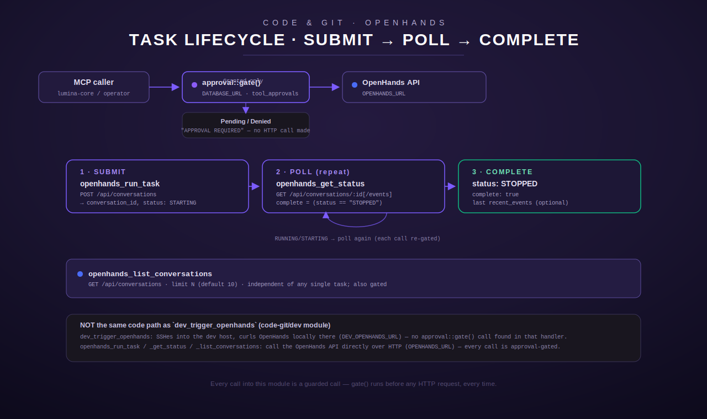

[← Tool reference](../README.md) · [docs index](../../README.md)

# `openhands` — OpenHands agentic-coding runtime tools

Three tools that drive a running [OpenHands](https://github.com/All-Hands-AI/OpenHands) agent
runtime over its HTTP API, ported from a Python `openhands_tools.py` fleet-host module
(`src/openhands/mod.rs:1`). OpenHands is a separate, externally-hosted service that accepts a
natural-language task and autonomously scaffolds files, runs builds, edits code, and performs
other agentic actions inside its own sandboxed runtime — this module's job is only to submit a
task, poll its status, and list recent tasks; it never itself touches a filesystem or runs a
build. That work happens entirely inside the OpenHands service at `OPENHANDS_URL`.



## Why every call here is guarded

The module doc comment states the reasoning directly: "Starting/inspecting agent runs can
mutate filesystems and run builds, so the operator must approve each call out of band"
(`src/openhands/mod.rs:8-11`). Concretely, **all three** `execute()` implementations call
[`crate::approval::gate`] as their first action, before doing anything else — before validating
arguments, before resolving `OPENHANDS_URL`, before any network I/O
(`src/openhands/mod.rs:274`, `:333`, `:393`). This is the same shared per-occurrence approval
gate used by <secret-manager> tools (`src/approval.rs:1`): see
[`approval.rs`](../../architecture/auth.md) for the general mechanism, but the essentials that
matter for this module are:

- **No compiled-in bypass.** `gate()` opens a Postgres connection using `DATABASE_URL`
  (`src/approval.rs:47-53`). If `DATABASE_URL` is unset or the DB is unreachable, `gate()`
  returns `Gate::Denied("Approval system unavailable: …")` — the call is refused *before* any
  OpenHands HTTP request is attempted, and the LLM cannot self-approve or work around this
  (verified by `run_task_blocked_by_gate_without_db` / `get_status_blocked_by_gate_without_db`
  / `list_conversations_blocked_by_gate_without_db`, `src/openhands/mod.rs:627-665`).
- **Content-bound, single-use codes.** A fresh call with no `_approval_code` argument creates a
  `pending` row keyed to `(tool_name, args)` (with the code field itself stripped before
  comparison) and immediately returns a `Gate::Pending` message asking the operator to reply
  `approve <CODE>` or `deny <CODE>` out of band (`src/approval.rs:118-141`). A code is bound to
  the *exact* argument payload it was issued for — replaying it against a call with different
  arguments is rejected (`src/approval.rs:19-27`, content-binding). Codes expire after 10
  minutes (`src/approval.rs:139`).
- **Not LLM-approvable.** The doc comments for both this module and `approval.rs` are explicit
  that the operator approves out of band via a deterministic, non-LLM chat command handler, and
  that the agentic loop itself hard-blocks calling `approval_grant`/`approval_deny`
  (`src/approval.rs:170-172`). This doc cannot verify the chat-side/orchestrator enforcement of
  that block from this file alone — it is asserted in the comment, not something this Rust
  crate can prove by itself; the code observable here is that `gate()` is the only path to
  `Gate::Granted` and it requires an already-`approved` DB row.
- **Every call is re-gated**, including a routine `openhands_get_status` poll. Polling a running
  task is not exempt — each individual call must present its own valid, unconsumed approval
  code, matching the "per-occurrence" description in the module docs (`src/approval.rs:1`).

## Relationship to `dev_trigger_openhands`

There is a **second, separate** tool that can also trigger an OpenHands task:
[`dev_trigger_openhands`](dev.md) in the `dev` module (`src/dev/mod.rs:680-764`). Reading both
handlers side by side, they are genuinely different code paths, not two names for the same
logic:

| | `openhands_run_task` (this module) | `dev_trigger_openhands` (`dev` module) |
|---|---|---|
| Transport | Direct HTTP `POST` from the Terminus process to `OPENHANDS_URL` (`src/openhands/mod.rs:291`) | SSH into the dev host, then a `curl` command run there against `DEV_OPENHANDS_URL` (`src/dev/mod.rs:716-728`) |
| Env var | `OPENHANDS_URL` | `DEV_OPENHANDS_URL` (default `http://127.0.0.1:3000` — i.e. "localhost on the dev host") (`src/dev/mod.rs:22-24`, `:50`) |
| Working-dir handling | Explicit `working_dir` param + `OPENHANDS_DEFAULT_WORKING_DIR` fallback, prepended as a "Working directory: …" line (`src/openhands/mod.rs:127-135`) | No working-dir parameter at all — only `task` (`src/dev/mod.rs:698-708`) |
| Approval gate | **Yes** — `gate()` called first, unconditionally (`src/openhands/mod.rs:274`) | **Not found** — reading `DevTriggerOpenhands::execute` top to bottom (`src/dev/mod.rs:711-763`), there is no call into `crate::approval::gate` or any other approval mechanism |
| Response shape | Normalized `{conversation_id, status, message, poll_with}` via `shape_run_result` (`src/openhands/mod.rs:137-144`) | Best-effort: pretty-printed JSON if the OpenHands response parses, otherwise the first 500 chars of raw stdout (`src/dev/mod.rs:751-761`) |

This doc does not guess at *why* two independent entry points to the same underlying OpenHands
service exist with different guard postures — that is not stated anywhere in either module's
comments. What the code shows plainly: `dev_trigger_openhands` reaches OpenHands indirectly
through the dev host's own SSH-jailed command execution (subject to `dev`'s own path/command
constraints, see [`code-git/dev.md`](dev.md)) and is **not** gated by `approval::gate`, while
every tool in *this* module is gated and talks to OpenHands directly over HTTP. Treat this as a
real, code-confirmed asymmetry, not an assumption.

## Configuration

Read once at process start by `OpenHandsConfig::from_env()` (`src/openhands/mod.rs:44-53`) and
shared by all three tool structs (`src/openhands/mod.rs:408-422`):

| Env var | Required | Behavior |
|---|---|---|
| `OPENHANDS_URL` | Yes, for any tool to function | Base URL of the OpenHands API (e.g. an internal `http://…:3000`). Trimmed and trailing-slash-stripped (`src/openhands/mod.rs:45-48`). If unset, `register()` logs a `tracing::warn!` at startup and still registers all three tools — each call fails at execution time with `ToolError::NotConfigured("OPENHANDS_URL not set")` from `OpenHandsConfig::url()` (`src/openhands/mod.rs:55-59`, `:409-415`). Note this check happens **after** the approval gate — a call is still refused/pended by `gate()` first even if `OPENHANDS_URL` is also unset. |
| `OPENHANDS_DEFAULT_WORKING_DIR` | Yes, for `openhands_run_task` specifically | Default working directory substituted when a `openhands_run_task` call omits `working_dir`, and also the sentinel value compared against to decide whether to prepend a "Working directory: …" line (`src/openhands/mod.rs:35-39`, `:129-135`). As of a 2026-07 PII remediation there is **no compiled-in fallback** (previously a real dev-workstation path) — if unset, `OpenHandsConfig::default_working_dir()` returns `ToolError::NotConfigured("OPENHANDS_DEFAULT_WORKING_DIR not set")` (`src/openhands/mod.rs:61-67`, confirmed by test `config_default_working_dir_unset_is_not_configured`, `src/openhands/mod.rs:495-505`). `openhands_get_status` and `openhands_list_conversations` do not use this var at all. |
| `DATABASE_URL` | Yes, transitively, via the approval gate | Not read by this module directly — read inside `approval::gate()`'s `pool()` helper (`src/approval.rs:47-53`). Every tool in this module needs it to ever reach `Gate::Granted`. |

The HTTP client is built fresh (not cached) by `OpenHandsConfig::client()` on each call, with a
30-second timeout and `User-Agent: MooseNet-MCP/1.0` (`src/openhands/mod.rs:69-75`).

---

## `openhands_run_task`

**Purpose:** submit a new task to OpenHands and return its `conversation_id` for later polling.
Registered as `OpenHandsRunTask` (`src/openhands/mod.rs:221-223`, `232-294`).

### Input schema

(`src/openhands/mod.rs:245-255`)

| Field | Type | Required | Default | Notes |
|---|---|---|---|---|
| `task` | string | **yes** | — | The natural-language task sent to OpenHands. Trimmed; an empty string after trimming fails validation (see below). |
| `working_dir` | string | no | `OPENHANDS_DEFAULT_WORKING_DIR` | Directory context for the task. Used verbatim in the pre-gate approval summary before any resolution happens. |
| `model` | string | no | OpenHands' own configured default coder model | Accepted in the schema and described ("optional model override … default: OpenHands default-coder via LiteLLM") but **not read anywhere in `execute()`** — reading the handler body (`src/openhands/mod.rs:257-293`), `args.get("model")` is never called, so the field is currently accepted and silently ignored rather than forwarded to the request body `{"initial_user_msg": full_task}` (`src/openhands/mod.rs:289`). This is a code-observed gap, not an inference — worth confirming against the Python original before relying on model overrides working. |

### Behavior

1. Extracts and trims `task`; extracts `working_dir` as a raw `Option<String>` (not yet
   defaulted) for use in the pre-gate summary (`src/openhands/mod.rs:258-268`).
2. Builds a human-readable summary: `OpenHands: start a new task in '<working_dir or
   "(default working directory)">' — task: <first 120 chars of task>` and calls
   `approval::gate("openhands_run_task", &args, &summary)` (`src/openhands/mod.rs:269-277`). On
   anything but `Gate::Granted`, the tool returns the gate's message as an `Ok(String)` result —
   **not** an `Err` — so the caller sees a normal tool response containing the approval-required
   or denial text rather than an error.
3. **Only after** the gate is granted does it validate that `task` is non-empty, returning
   `ToolError::InvalidArgument("task is required")` if it is (`src/openhands/mod.rs:279-281`).
   This ordering means an empty-task call still consumes/creates an approval flow before failing
   validation.
4. Resolves `OPENHANDS_URL` (`config.url()`) and `OPENHANDS_DEFAULT_WORKING_DIR`
   (`config.default_working_dir()`) — either missing returns `ToolError::NotConfigured`
   (`src/openhands/mod.rs:283-284`).
5. Computes the effective `working_dir` (caller-supplied or the resolved default), then builds
   the final task text via `build_full_task()`: if `working_dir` is non-empty **and** differs
   from `default_working_dir`, prepends `Working directory: <dir>\n\n` to the task; otherwise the
   task is sent as-is (`src/openhands/mod.rs:129-135`, `:288`). Tested explicitly for the
   passthrough, custom-dir, and empty-dir cases (`src/openhands/mod.rs:477-493`).
6. `POST {OPENHANDS_URL}/api/conversations` with body `{"initial_user_msg": full_task}`
   (`src/openhands/mod.rs:289-291`).
7. Shapes the response via `shape_run_result()` (`src/openhands/mod.rs:137-144`).

### Output shape

```jsonc
{
  "conversation_id": "…",        // from the OpenHands response, or null if absent
  "status": "STARTING",          // from response.conversation_status, defaults to "STARTING" if absent
  "message": null,               // from response.message if present
  "poll_with": "openhands_get_status"
}
```

### Errors / edge cases

- Gate not granted → `Ok(<pending-or-denied message>)`, no HTTP call made.
- Empty/whitespace-only `task` (after gate passes) → `ToolError::InvalidArgument`.
- `OPENHANDS_URL` / `OPENHANDS_DEFAULT_WORKING_DIR` unset → `ToolError::NotConfigured`.
- Non-2xx HTTP response from OpenHands → `ToolError::Http("HTTP <code>: <body>")`
  (`src/openhands/mod.rs:95-97`, `118-120`).
- Non-JSON response body → `ToolError::Http("invalid JSON from <url>: <parse error>")`
  (`src/openhands/mod.rs:98-99`, `121-123`).
- Network-level failure (connect/timeout/etc.) → `ToolError::Http(<reqwest error>)`.

### Worked example

Request (after an operator has already replied `approve K7X2QM` to a prior pending call — see
the approval-gate section above for how a fresh, ungated call is first refused):

```json
{
  "task": "Add a health-check endpoint to the API and update its OpenAPI spec",
  "working_dir": "/srv/example-project",
  "_approval_code": "K7X2QM"
}
```

Response (`Ok(String)` containing this JSON):

```json
{
  "conversation_id": "8f2c1e40-...",
  "status": "RUNNING",
  "message": null,
  "poll_with": "openhands_get_status"
}
```

The **first** attempt at this same call, before approval, instead returns:

```
⚠️ APPROVAL REQUIRED — `openhands_run_task` is a guarded tool and was NOT run.
Action: OpenHands: start a new task in '/srv/example-project' — task: Add a health-check endpoint to the API and update its OpenAPI spec
Reply `approve K7X2QM` to authorize this single call (expires in 10 minutes), or `deny K7X2QM` to reject.
```

(exact wording from `src/approval.rs:135-141`).

---

## `openhands_get_status`

**Purpose:** poll a conversation's current status by id, optionally including recent events, to
detect completion. Registered as `OpenHandsGetStatus` (`src/openhands/mod.rs:224-226`,
`296-367`).

### Input schema

(`src/openhands/mod.rs:309-318`)

| Field | Type | Required | Default | Notes |
|---|---|---|---|---|
| `conversation_id` | string | **yes** | — | Trimmed. Empty after trim fails validation (post-gate, same ordering as `openhands_run_task`). |
| `include_events` | boolean | no | `false` | When `true`, fetches and includes a projected slice of the most recent events. |

### Behavior

1. Extracts/trims `conversation_id`; reads `include_events` (defaults `false`).
2. Gate check first, with summary `OpenHands: get status of conversation '<id>'`
   (`src/openhands/mod.rs:332-336`) — same Granted/Pending/Denied handling as above.
3. Validates `conversation_id` is non-empty (post-gate) → `ToolError::InvalidArgument` otherwise
   (`src/openhands/mod.rs:338-340`).
4. `GET {OPENHANDS_URL}/api/conversations/{conversation_id}` (`src/openhands/mod.rs:345-350`).
5. If `include_events` is true, a **second** request: `GET
   {OPENHANDS_URL}/api/conversations/{conversation_id}/events?limit=10`
   (`src/openhands/mod.rs:352-363`) — note the API is asked for up to 10 events, but the shaped
   output below only surfaces the last 5 of whatever comes back.
6. Shapes via `shape_status()` (`src/openhands/mod.rs:146-169`).

### Output shape

```jsonc
{
  "conversation_id": "8f2c1e40-...",
  "status": "RUNNING",             // raw value from conv.status, or null if absent
  "runtime_status": "ready",       // raw value from conv.runtime_status, or null
  "title": "…",                    // raw value from conv.title, or null
  "last_updated": "2026-07-09T…",  // from conv.last_updated_at, or null
  "complete": false,               // true iff status == "STOPPED" (exact string match)
  "recent_events": [               // present only when include_events=true
    { "source": "agent", "observation": "…", "message": "…(truncated to 200 chars)" }
  ]
}
```

`complete` is computed by exact string comparison against `"STOPPED"`
(`src/openhands/mod.rs:153`) — any other status value (`STARTING`, `RUNNING`, or an unrecognized
value) yields `complete: false`. `recent_events` takes the **last 5** entries of the `events`
array in the events response (`events[len-5..]`, saturating at 0 if fewer than 5 exist) and
truncates each `message` field to its first 200 **characters** (not bytes) — verified by
`shape_status_includes_last_five_events_truncated` (`src/openhands/mod.rs:562-582`) and
`shape_status_handles_no_events_key` for a missing/empty `events` key
(`src/openhands/mod.rs:584-589`).

### Errors / edge cases

- Gate not granted → `Ok(<message>)`, no HTTP call made at all (neither the conversation fetch
  nor the events fetch).
- Empty `conversation_id` → `ToolError::InvalidArgument` (post-gate).
- Conversation id not found at OpenHands → surfaces as `ToolError::Http("HTTP 404: …")` (or
  whatever status OpenHands returns) via the shared `oh_get` error path
  (`src/openhands/mod.rs:95-97`).
- `include_events=true` with a conversation that has no `events` field in its response → treated
  as an empty list, `recent_events: []`, not an error.

### Worked example

```json
{ "conversation_id": "8f2c1e40-...", "include_events": true, "_approval_code": "N4H8YB" }
```

```json
{
  "conversation_id": "8f2c1e40-...",
  "status": "STOPPED",
  "runtime_status": "ready",
  "title": "Add a health-check endpoint",
  "last_updated": "2026-07-09T18:04:21Z",
  "complete": true,
  "recent_events": [
    { "source": "agent", "observation": "run", "message": "Added GET /healthz returning 200 OK" }
  ]
}
```

A typical polling loop calls this repeatedly (each call independently gated — see above) until
`complete` is `true`.

---

## `openhands_list_conversations`

**Purpose:** list recent OpenHands conversations/tasks, independent of any specific
`conversation_id`. Registered as `OpenHandsListConversations` (`src/openhands/mod.rs:227-229`,
`369-404`).

### Input schema

(`src/openhands/mod.rs:380-387`)

| Field | Type | Required | Default | Notes |
|---|---|---|---|---|
| `limit` | integer | no | `10` | Max conversations returned. Read via `as_u64` then cast to `usize` (`src/openhands/mod.rs:390`) — a negative JSON number fails the `as_u64` conversion and silently falls back to the default of `10` rather than erroring. |

### Behavior

1. Reads `limit` (default 10).
2. Gate check with summary `OpenHands: list up to <limit> recent conversations`
   (`src/openhands/mod.rs:392-396`).
3. `GET {OPENHANDS_URL}/api/conversations` (`src/openhands/mod.rs:398-401`) — note this is the
   **same** endpoint used to create a conversation in `openhands_run_task` (`POST` vs. `GET` on
   `/api/conversations`), and it fetches the full result set from OpenHands; limiting happens
   client-side, not via a query parameter.
4. Shapes via `shape_conversations()` (`src/openhands/mod.rs:194-217`), which reads
   `result.results` (an array; empty if absent), takes the first `limit` entries, and projects
   each to five fields.

### Output shape

```jsonc
{
  "conversations": [
    {
      "conversation_id": "…",
      "title": "…",
      "status": "STOPPED",
      "runtime_status": "ready",
      "last_updated": "2026-07-09T18:04:21Z"
    }
    // … up to `limit` entries
  ],
  "total": 3   // count of entries actually returned (i.e. min(limit, available)), not the total available at OpenHands
}
```

`total` is the length of the *projected* list, not a count of all conversations OpenHands has —
verified by `shape_conversations_limits_and_projects` (5 available, `limit=3` → `total: 3`,
`src/openhands/mod.rs:592-610`) and `shape_conversations_empty_results` (missing `results` key →
`total: 0`, `src/openhands/mod.rs:612-617`).

### Errors / edge cases

- Gate not granted → `Ok(<message>)`, no HTTP call made.
- Missing/malformed `results` field in the OpenHands response → treated as an empty list, not an
  error.
- No `conversation_id`-scoped errors are possible here since no id is supplied.

### Worked example

```json
{ "limit": 5, "_approval_code": "P9K3TR" }
```

```json
{
  "conversations": [
    { "conversation_id": "8f2c1e40-...", "title": "Add a health-check endpoint", "status": "STOPPED", "runtime_status": "ready", "last_updated": "2026-07-09T18:04:21Z" },
    { "conversation_id": "3ab90c11-...", "title": "Refactor config loader", "status": "RUNNING", "runtime_status": "running", "last_updated": "2026-07-09T17:40:02Z" }
  ],
  "total": 2
}
```

---

## Registration

`register()` builds one shared `OpenHandsConfig` from the environment and registers all three
tools against it, logging a `tracing::warn!` (not a hard failure) if `OPENHANDS_URL` is unset so
the module still loads and each tool fails cleanly with `NotConfigured` per-call rather than
being absent from the registry (`src/openhands/mod.rs:408-422`). Tests confirm all three names
are present and the registry contains exactly three tools from this module
(`register_adds_three_tools`, `src/openhands/mod.rs:669-683`).

## See also

- [`code-git/dev.md`](dev.md) — the `dev` module, including `dev_trigger_openhands`, the
  separate SSH-based path to the same underlying OpenHands service discussed above.
- [`../README.md`](../README.md) — the full tool index (Code & Git domain).
- [`../../README.md`](../../README.md) — documentation home.
