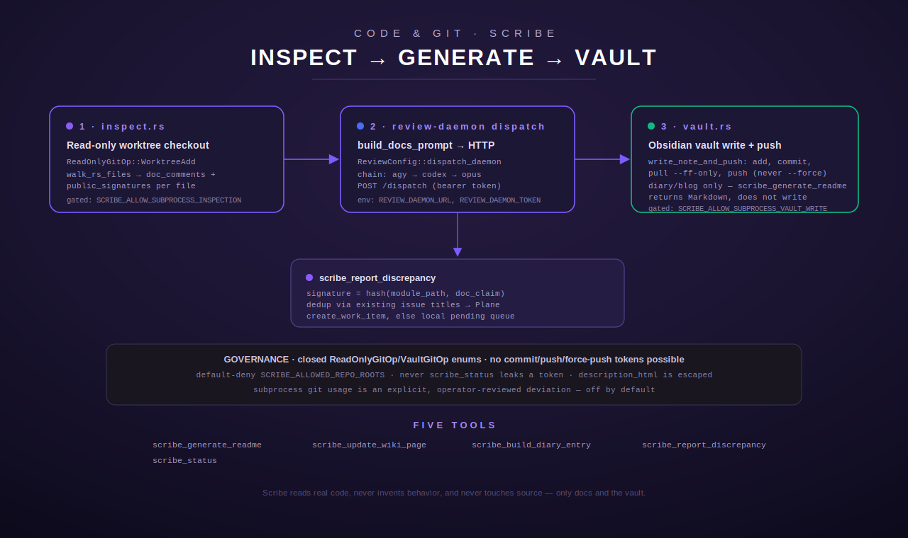

[← Tool index](../README.md) · [← Docs index](../../README.md)

# Scribe — the standing documentation agent

Scribe is Terminus's own automated documentation-generation engine, living at
`src/scribe/` (`mod.rs`, `inspect.rs`, `vault.rs`). It is a **module inside
the Terminus crate that registers MCP tools**, not a separate service — the
same `terminus-rs` binary that serves `plane`/`gitea`/`github` also serves
Scribe, through the identical `register_all()` entry point in `src/registry.rs`
(`src/scribe/mod.rs:12-19`). This page documents Scribe as of its current
source: three of its five tools (`scribe_generate_readme`,
`scribe_build_diary_entry`, `scribe_report_discrepancy`) have real
implementations; two (`scribe_update_wiki_page`, and — see below —
`scribe_status`, which is real but minimal) round out the surface, with
`scribe_update_wiki_page` still a scaffold stub as of this reading.

> **This is not the same activity as the human/agent-authored documentation
> set you are reading right now.** These pages under `docs/` are written by a
> parallel, operator-driven documentation effort. Scribe is the in-repo,
> automated tool that generates READMEs, Obsidian-compatible wiki pages, and
> build-diary/blog entries as a byproduct of Terminus's own build pipeline —
> a code-writing agent's tool, not a docs-writer's tool.



## Module overview

### `mod.rs` — configuration, dispatch, and the five tool definitions

`mod.rs` holds `ScribeConfig` (env-resolved configuration, see below), the
`DOCS_PROVIDER_CHAIN` LLM fallback order, and the five `RustTool`
implementations. It never authors secrets or duplicates another module's env
lookups: the review-daemon bearer token comes from `review::ReviewConfig`,
and Plane credentials come from `plane::PlaneClient` — Scribe calls those
modules, it does not read `REVIEW_DAEMON_TOKEN`/`PLANE_API_KEY` itself
(`src/scribe/mod.rs:50-54`).

### `inspect.rs` — read-only worktree inspection

**What it actually does, precisely:** given a local repo path and a git ref,
`inspect::checkout()` creates a **read-only git worktree checkout** of that
ref (`git worktree add <path> -- <ref>`, run inside `repo_path`,
`src/scribe/inspect.rs:113-122`) — it does not clone a new repo and does not
create a branch, matching the build pipeline's Stage 2 convention "in
spirit" but staying detached/read-only since Scribe is inspecting an
*existing* ref, not doing new work (`inspect.rs:5-10`). `inspect_module()`
then walks a module's directory tree, and for every `.rs` file records:
lines starting with `//!`/`///` (doc comments) and lines starting with
`pub fn`/`pub async fn`/`pub struct`/`pub enum`/`pub trait` (public
signatures) — a simple line-scan, explicitly **not** a full parser
(`inspect.rs:174-183`, `360-386`). It also reads any existing
`README.md` in that directory, if present (`inspect.rs:329`). The result is a
`ModuleBundle { module_path, git_ref, files: Vec<FileExcerpt>, existing_readme }`
— the exact context `scribe_generate_readme` feeds to the LLM prompt.

Every git invocation this module can ever build comes from a **closed enum**,
`ReadOnlyGitOp` (`WorktreeAdd` / `WorktreeRemove` / `Fetch` only —
`inspect.rs:61-73`), and `assert_read_only_argv()` runs on every real
invocation (not just a test) to assert none of the five banned tokens
(`commit`, `push`, `remote`, `config`, `reset`) ever appears as an exact argv
token (`inspect.rs:81-98`). There is structurally no `Commit`/`Push` variant
to add a call site to — extending this module to write anything requires an
enum change, which is a reviewer-visible diff, not a silently-reachable path.
A caller-influenced `git_ref` is validated by `sanitize_ref_for_dirname()`
before it is ever used to build a directory name or passed to `git`: it
rejects empty strings, `..`/`/`/`\` (no slash-containing branch names like
`feature/foo` — a deliberate scope limit), a leading `-` (git
option-injection defense, e.g. `--upload-pack=...`), and bare `.`/`.git`
(would otherwise collide with the worktree root or its metadata dir)
(`inspect.rs:212-232`). On top of that, every ref argument is passed to git
after an explicit `--` end-of-options separator (`inspect.rs:106-110`,
`121`). If a worktree directory for that ref already exists under
`worktree_root` from a prior run, `checkout()` reuses it rather than erroring
or re-cloning (`inspect.rs:260-267`).

`inspect.rs` shells out to the `git` binary via `std::process::Command`,
which tensions with `src/tool.rs`'s `RustTool` contract ("`execute()` must
never use shell commands or subprocess calls"). The module's own doc comment
records the resolution: unlike the review-daemon's LLM-CLI dispatch (no
non-subprocess alternative exists), `git` has a real pure-Rust alternative
(the `git2`/libgit2 binding crate) — the correct fix is a **library swap**,
not a process-isolation daemon-wrap, and it is not done in this codebase
because the build sandbox has no crates.io/registry access to add the
dependency (`inspect.rs:25-48`). Until that swap lands, the interim deviation
is gated behind an explicit, off-by-default operator opt-in — see
`ScribeConfig::allow_subprocess_inspection` below.

### `vault.rs` — Obsidian-compatible vault writer (git-backed docs storage)

**Precisely what `vault.rs` is, read from the code, not guessed from the
name:** it is a writer for a **git-backed directory tree of Markdown notes,
directly openable as an Obsidian vault** — plain Markdown files with YAML
frontmatter and `[[wikilink]]`-style cross-references, synced by git itself
(`src/scribe/vault.rs:1-17`). It is **not** a secrets vault and does not use
or read `SecretManager`/<secret-manager> — "vault" here means the Obsidian
knowledge-base sense of the word. Its directory convention:

```
modules/{module}/README.md
modules/{module}/wiki/{slug}.md
build-diaries/{date}-{spec_id}.md
blog/{date}-{title-slug}.md
```

Every note gets frontmatter: `title`, `module`, `generated_at` (RFC3339),
`source_commit` (the exact commit the note was generated against, so
staleness is always detectable — a note whose `source_commit` no longer
matches the module's current HEAD is a candidate for regeneration), and
`type` (`readme`/`wiki`/`build-diary`/`blog`) (`vault.rs:14-17`, `70-82`).
Frontmatter values are YAML-double-quoted with backslash, quote, newline,
carriage-return, and tab all escaped (`vault.rs:87-112`) — this closes a
found issue where an embedded literal newline in a title could otherwise
produce lines that look like additional frontmatter keys.

`slugify()` is a defensive filesystem-safe slug function: only lowercase
ASCII alphanumerics and hyphens survive, everything else (including path
separators and `..`) is dropped, so a caller-influenced title/module/spec-id
can never be used to escape the vault directory structure (`vault.rs:143-173`).
If an input has no ASCII alphanumeric characters at all (pure non-ASCII —
Cyrillic, emoji), `slugify()` falls back to a stable hash-derived slug
(`untitled-<hex>`) rather than producing an empty string, which would
otherwise let distinct non-ASCII module names collide on the same path
(`vault.rs:158-172`). `note_path()` slugifies both `module` and `slug`
internally, so the caller-facing path-construction function itself can never
be tricked into a traversal (`vault.rs:179-188`).

**Vault git operations — the module's only code-adjacent write surface.**
Like `inspect.rs`, every git invocation is built from a closed enum,
`VaultGitOp` (`Add`/`Pull`/`AddCommitAll`/`SoftResetLastCommit`/`Push` —
`vault.rs:199-211`), with **no force-push variant at all**, and
`assert_never_force_push()` runs on every real invocation asserting no argv
element is `--force`/`-f`/`--force-with-lease` (`vault.rs:213-226`).
`write_note_and_push()` is the single entry point: it writes the file
(creating parent directories as needed), `git add`s it explicitly (needed
because `commit -a` only stages already-tracked modifications, not a
brand-new file), commits, pulls with `--ff-only`, then pushes
(`vault.rs:299-369`). Edge cases handled explicitly in the code:

- **Byte-identical re-run:** if the target file already contains exactly
  `content`, the function returns `Ok(())` immediately, before ever touching
  git (`vault.rs:313-315`).
- **"Nothing to commit" after `git add`:** if the commit step reports
  "nothing to commit" (e.g. the write was byte-identical after all — line
  ending normalization), that is treated as a clean no-op, not an error
  (`vault.rs:329-337`).
- **Push failure after a local commit was made** (e.g. a concurrent Scribe
  run pushed first): the local commit is soft-reset (`git reset --soft
  HEAD~1`, changes kept staged) before the error is returned, so a retry
  isn't permanently wedged behind an orphaned local commit that would make
  every subsequent `--ff-only` pull fail forever (`vault.rs:359-366`).
- **`pull --ff-only` failure from genuine concurrent divergence:** the same
  soft-reset recovery runs here too — a fix added specifically because this
  is the identical underlying wedge condition as a push failure, just
  triggered on the earlier branch (`vault.rs:340-357`); a dedicated test
  (`vault.rs:766-821`) forces a real non-fast-forwardable remote via a
  second concurrent clone and asserts the working copy is genuinely usable
  again afterward, not just that an `Err` was returned.
- **Non-repo target directory:** `write_note_and_push` degrades to a clean
  `ToolError::Execution` via git's own "not a git repository" error rather
  than panicking (`vault.rs:699-723`).

Same subprocess-contract tension and resolution as `inspect.rs`: gated behind
`ScribeConfig::allow_subprocess_vault_write`, off by default
(`vault.rs:19-41`). **SCRB-05 does not clone the vault on demand** — an
operator (or a separate ops step) must already have a working copy checked
out at `SCRIBE_VAULT_LOCAL_DIR` before `scribe_build_diary_entry` will write
anything (`vault.rs:33-36`; enforced in `mod.rs:490-497`).

## Configuration (`ScribeConfig`, `src/scribe/mod.rs:56-175`)

`ScribeConfig::from_env()` resolves once per call (not cached process-wide),
reading:

| Env var | Default | Purpose |
| --- | --- | --- |
| `SCRIBE_WORKTREE_ROOT` | `<os-temp-dir>/scribe-inspect` | Root directory for read-only inspection worktrees. |
| `SCRIBE_REPO_PATH` | none | Local filesystem path Scribe inspects by default when a tool call omits `repo_path`. |
| `SCRIBE_ALLOWED_REPO_ROOTS` | empty (comma-separated list) | Closed allowlist of local filesystem roots a `repo_path` must resolve under. **Default-deny**: empty means no `repo_path` is permitted at all, not "anything goes" — an operator must explicitly configure this before `scribe_generate_readme` can inspect anything. |
| `SCRIBE_ALLOW_SUBPROCESS_INSPECTION` | `false` | Explicit opt-in for the interim `std::process::Command`-based git worktree inspection (see `inspect.rs` above). |
| `SCRIBE_VAULT_REMOTE` | none | Git remote URL of the Obsidian-compatible vault repo. |
| `SCRIBE_VAULT_LOCAL_DIR` | `<os-temp-dir>/scribe-vault` | Local working-copy directory for the vault repo — must already be a `git clone` of `SCRIBE_VAULT_REMOTE`; not cloned on demand. |
| `SCRIBE_ALLOW_SUBPROCESS_VAULT_WRITE` | `false` | Explicit, **separate** opt-in for vault commit/push (kept independent from the inspection opt-in so an operator can enable read-only inspection without also enabling vault writes, or vice versa). |
| `SCRIBE_PENDING_QUEUE_PATH` | `<os-temp-dir>/scribe-pending-discrepancies.jsonl` | Local file a discrepancy report is appended to (one JSON object per line) when Plane is unreachable at report time — a retry-later marker rather than losing the finding. |

Two more env vars are read indirectly, by modules Scribe calls rather than by
Scribe itself: `REVIEW_DAEMON_URL`/`REVIEW_DAEMON_TOKEN` (via
`review::ReviewConfig::from_env()`, used by `scribe_generate_readme`) and
`PLANE_API_URL`/`PLANE_API_KEY`/`PLANE_WORKSPACE` (via
`plane::PlaneClient::from_env()`, used by `scribe_report_discrepancy`).
`ScribeConfig` holds no secrets directly (`mod.rs:50-54`).

## LLM dispatch: the docs-provider fallback chain

`scribe_generate_readme` dispatches its documentation-generation prompt
through the **same review-daemon HTTP call the `review_run` tool uses** —
`review::ReviewConfig::dispatch_daemon()` — no new subprocess or HTTP-client
code (`mod.rs:187-213`). `DOCS_PROVIDER_CHAIN` is a fixed, ordered constant,
not caller-influenced: `["agy", "codex", "opus"]` (`mod.rs:177-185`). `agy`
(Gemini) is tried first for its large context window; `dispatch_docs_generation()`
tries each provider in order and returns on the first success, aggregating
every attempted provider's error into one message if all fail — so a caller
sees *why* generation failed across the whole chain, not just the last
attempt (`mod.rs:198-213`). `dispatch_daemon()` itself (`src/review/dispatch.rs:76-106`)
requires `REVIEW_DAEMON_TOKEN` to be configured (else it fails immediately
without any network call), POSTs `{"provider", "prompt", "timeout_secs": 120}`
with a bearer token to `<REVIEW_DAEMON_URL>/dispatch`, and treats any
non-2xx response or a response missing a `text` field as an "unavailable"
failure for that provider only, not a hard error for the whole chain.

`build_docs_prompt()` (`src/review/prompt.rs:179-196`) builds the actual
prompt string: module path, git ref, and the `ModuleBundle` context
(doc comments, public signatures, existing README) serialized as
pretty-printed JSON, with an explicit instruction to base every claim only on
that context (never invent behavior), to prefer the code (signatures) over a
contradicting existing README while noting the discrepancy rather than
silently reconciling it, and to respond with only the Markdown body — no
preamble, no meta-commentary, no wrapping code fence. This is a distinct
prompt *shape* from the review-role prompts `review_run` builds, dispatched
through the identical daemon HTTP call — the daemon itself is prompt-shape
agnostic (`src/review/prompt.rs:155-170`).

## Tool: `scribe_generate_readme`

**Purpose.** Generate a module's README content by inspecting its real
source (via a read-only worktree checkout) and dispatching a
documentation-generation prompt through the review-daemon. Returns the
generated Markdown as the tool result — **it does not write or commit
anything itself**; persisting output into a vault/repo is a separate concern
handled by `scribe_build_diary_entry`/vault tooling (`mod.rs:293-299`).

### Input schema

| Field | Type | Required | Default | Notes |
| --- | --- | --- | --- | --- |
| `module_path` | string | yes | — | Repo-relative path to the module to document, e.g. `src/sundry`. Must be non-empty after trimming (an empty string is rejected explicitly — it previously silently expanded to a full-repo walk via `path.join("")`). |
| `repo_ref` | string | no | `"HEAD"` | Git ref to inspect (branch, tag, or commit). |
| `repo_path` | string | no | `SCRIBE_REPO_PATH` env value | Local filesystem path to the repo to inspect. If neither the argument nor `SCRIBE_REPO_PATH` is set, the call fails with `NotConfigured`. |

### Output shape

Plain text: the generated README Markdown, verbatim from the LLM provider's
`text` field — no wrapping, no added metadata.

### Behavior and branches (`mod.rs:322-373`)

1. Validate `module_path` is present and non-empty → `InvalidArgument` if not.
2. Resolve `repo_ref` (defaults to `"HEAD"`).
3. Load `ScribeConfig::from_env()`.
4. **Opt-in gate, checked first:** if `allow_subprocess_inspection` is
   false (the default), return `NotConfigured` immediately — this runs
   *before* the `repo_path` resolution check, so a call with neither the
   opt-in nor a `repo_path` hits the opt-in error, not a "missing repo_path"
   error.
5. Resolve `repo_path`: argument, else `SCRIBE_REPO_PATH`; if neither is set,
   `NotConfigured`.
6. **Confinement check:** `is_repo_path_allowed()` canonicalizes both the
   target `repo_path` and every root in `SCRIBE_ALLOWED_REPO_ROOTS`, and
   requires the target to be a descendant of at least one allowed root
   (symlink/relative-segment-safe, since canonicalization resolves both
   sides). An empty `SCRIBE_ALLOWED_REPO_ROOTS` denies everything — this is
   the mechanism that stops a caller from pointing Scribe at an arbitrary
   local repo and having its contents shipped to an external LLM provider
   (`mod.rs:215-236`). Failure → `InvalidArgument`.
7. `inspect::checkout()` the worktree, then `inspect::inspect_module()`.
8. Build the prompt context (`docs_prompt_context()`) and the full prompt
   (`build_docs_prompt()`).
9. Dispatch through the `agy → codex → opus` chain and return the text.

### Error and edge cases

- Missing/empty `module_path` → `ToolError::InvalidArgument`.
- Subprocess inspection not opted in → `ToolError::NotConfigured` (message
  names `SCRIBE_ALLOW_SUBPROCESS_INSPECTION`).
- No `repo_path` resolvable → `ToolError::NotConfigured`.
- `repo_path` not under any allowed root → `ToolError::InvalidArgument`.
- Nonexistent `repo_path` → `ToolError::NotFound` (from `inspect::checkout`).
- Ref that fails sanitization (path traversal, leading `-`, `.`/`.git`) →
  `ToolError::InvalidArgument` before git is ever spawned.
- Ref that is syntactically valid but doesn't exist → `ToolError::Execution`
  wrapping git's own error output.
- `module_path` not found inside the checked-out worktree →
  `ToolError::NotFound`.
- Every docs-generation provider unavailable → `ToolError::Execution` with
  all three providers' failure reasons concatenated.

### Auth / identity / allowlist

No direct authentication of its own — gated by two independent, explicit
operator opt-ins (`SCRIBE_ALLOW_SUBPROCESS_INSPECTION`) and a default-deny
filesystem allowlist (`SCRIBE_ALLOWED_REPO_ROOTS`). The review-daemon call
itself requires `REVIEW_DAEMON_TOKEN` (bearer auth), read via
`review::ReviewConfig`, never duplicated in Scribe's own config.

### Env vars read (names only)

`SCRIBE_ALLOW_SUBPROCESS_INSPECTION`, `SCRIBE_REPO_PATH`,
`SCRIBE_ALLOWED_REPO_ROOTS`, `SCRIBE_WORKTREE_ROOT`, plus (indirectly, via
`review::ReviewConfig::from_env()`) `REVIEW_DAEMON_URL`,
`REVIEW_DAEMON_TOKEN`.

### Worked example

Request:

```json
{
  "module_path": "src/sundry",
  "repo_ref": "HEAD"
}
```

Preconditions: `SCRIBE_ALLOW_SUBPROCESS_INSPECTION=true`,
`SCRIBE_ALLOWED_REPO_ROOTS=/path/to/allowed/checkout`,
`SCRIBE_REPO_PATH=/path/to/allowed/checkout`, `REVIEW_DAEMON_TOKEN` set.

Response (plain text result):

```markdown
# Sundry

Utility tools for the Terminus MCP hub...
```

If `REVIEW_DAEMON_TOKEN` were unset instead, the result is an error whose
message contains all three chain entries, e.g.:

```
all docs-generation providers unavailable: agy: unavailable: REVIEW_DAEMON_TOKEN not configured; codex: unavailable: REVIEW_DAEMON_TOKEN not configured; opus: unavailable: REVIEW_DAEMON_TOKEN not configured
```

## Tool: `scribe_update_wiki_page`

**Purpose (as designed, per its schema and description — not yet
implemented).** Generate or refresh an Obsidian-compatible wiki note for a
module in the vault repo, with frontmatter and wikilinks to related notes
(`mod.rs:387-390`).

### Input schema

| Field | Type | Required | Default |
| --- | --- | --- | --- |
| `module_path` | string | yes | — |
| `title` | string | yes | — |

### Output shape / behavior

**This tool is a scaffold stub as of this reading.** `execute()` calls
`not_yet_implemented(self.name())` unconditionally (`mod.rs:410-412`),
which always returns `ToolError::Execution("scribe_update_wiki_page: not \
yet implemented (scaffold only -- see SCRB-01)")` — deliberately an error,
never a panic and never a fabricated success (`mod.rs:252-259`). No
inspection, no LLM dispatch, no vault write happens. The building blocks it
would need already exist and are exercised elsewhere in this module:
`vault::NoteType::Wiki`, `vault::note_path()` (which already produces
`modules/{module}/wiki/{slug}.md`), `vault::render_note()` (which already
supports a `related: &[String]` wikilink list), and
`vault::write_note_and_push()`.

### Error / edge cases

Always `ToolError::Execution` regardless of input — there is no argument
validation because the handler never inspects `args`.

### Env vars, auth

None consulted (unimplemented).

### Worked example

Request:

```json
{ "module_path": "src/sundry", "title": "Sundry" }
```

Response: an error —
`"scribe_update_wiki_page: not yet implemented (scaffold only -- see SCRB-01)"`.

## Tool: `scribe_build_diary_entry`

**Purpose.** Write a build-diary (or, for notable builds, a longer-form
blog) entry to the Obsidian-compatible vault, summarizing a spec's real
execution narrative. Requires an already-cloned vault working copy and an
explicit operator opt-in before it will commit/push anything
(`mod.rs:427-431`).

### Input schema

| Field | Type | Required | Default | Notes |
| --- | --- | --- | --- | --- |
| `spec_id` | string | yes | — | Spec identifier the entry covers, e.g. `S91-scribe-knowledge-infrastructure`. Must be non-empty after trimming. |
| `narrative` | string | yes | — | The execution narrative: what was tried, what worked, what didn't, real decisions and bugs found. Must be non-empty after trimming. |
| `entry_type` | string (enum) | no | `"build-diary"` | `"build-diary"` or `"blog"`. `"blog"` is intended for especially notable builds (operator judgment or >3 items / security-relevant, per the schema description). Any other value is rejected. |

### Output shape

Plain text success message: `"Wrote <entry_type> entry to vault: <note_path>"`.

### Behavior and branches (`mod.rs:456-517`)

1. Validate `spec_id` and `narrative` are present and non-empty →
   `InvalidArgument` if not.
2. Validate/parse `entry_type` into `vault::NoteType::Blog` or
   `::BuildDiary` → `InvalidArgument` for any other value.
3. **Opt-in gate:** if `ScribeConfig::allow_subprocess_vault_write` is false
   (the default), return `NotConfigured` immediately.
4. **Cloned-vault check:** if `<SCRIBE_VAULT_LOCAL_DIR>/.git` does not exist,
   return `NotConfigured` — this tool never clones on demand.
5. Build the note slug as `<UTC-date>-<slugify(spec_id)>` and its path via
   `vault::note_path()` (→ `build-diaries/{date}-{spec-slug}.md`).
6. Build frontmatter: title `"<spec_id> -- <entry_type>"`, `module:
   "build-pipeline"`, `generated_at` (now, RFC3339), `source_commit: "n/a
   (spans the whole spec, not one module commit)"` (a diary entry covers a
   whole spec's execution, not one module's commit, so there is no single
   source commit to record), `note_type`.
7. Render the note (no related-notes list is passed — no wikilinks in a
   diary entry today) and call `vault::write_note_and_push()` with commit
   message `"scribe: <entry_type> entry for <spec_id>"`.

### Error / edge cases

- Missing/empty `spec_id` or `narrative` → `InvalidArgument`.
- Invalid `entry_type` → `InvalidArgument` naming the offending value.
- Vault write not opted in → `NotConfigured` (message names
  `SCRIBE_ALLOW_SUBPROCESS_VAULT_WRITE`).
- No cloned working copy at `SCRIBE_VAULT_LOCAL_DIR` → `NotConfigured`.
- Any underlying git failure during add/commit/pull/push → `Execution`,
  after `vault.rs`'s own soft-reset recovery has already run so the working
  copy stays retry-friendly (see the `vault.rs` section above).
- Re-running with byte-identical narrative content → clean no-op success
  (not an error), since `write_note_and_push` short-circuits before touching
  git.

### Auth / identity / allowlist

Gated purely by `SCRIBE_ALLOW_SUBPROCESS_VAULT_WRITE` plus the precondition
that `SCRIBE_VAULT_LOCAL_DIR` is already a git working copy with a
functioning `origin` remote and push credentials configured at the
git-config level — that setup is outside Scribe's own responsibility; it
never runs `git remote`/`git config` itself (those verbs are banned only in
`inspect.rs`'s `ReadOnlyGitOp` enum). `vault.rs`'s own `VaultGitOp` enum has a
narrower, specific guarantee instead: no variant, and no real invocation, can
ever carry a force-push token (`--force`/`-f`/`--force-with-lease`).

### Env vars read (names only)

`SCRIBE_ALLOW_SUBPROCESS_VAULT_WRITE`, `SCRIBE_VAULT_LOCAL_DIR`.

### Worked example

Request:

```json
{
  "spec_id": "S91-scribe-knowledge-infrastructure",
  "narrative": "Built the Scribe module scaffold, wired LLM dispatch, worktree inspection, Plane discrepancy reporting, and this vault -- in that order.",
  "entry_type": "build-diary"
}
```

Preconditions: `SCRIBE_ALLOW_SUBPROCESS_VAULT_WRITE=true`,
`SCRIBE_VAULT_LOCAL_DIR` pointing at an existing clone of the vault repo.

Response:

```
Wrote build-diary entry to vault: <SCRIBE_VAULT_LOCAL_DIR>/build-diaries/2026-07-09-s91-scribe-knowledge-infrastructure.md
```

(The written file's frontmatter `type:` is `build-diary`; a fresh clone of
the vault remote will show the same file with identical content — this exact
flow is what the module's own end-to-end test verifies, `mod.rs:1541-1590`.)

## Tool: `scribe_report_discrepancy`

**Purpose.** Report a mismatch between documented behavior and actual code
behavior (or a suspected real bug found while verifying functionality) as a
real Plane issue, via the Terminus Plane tool's create-work-item call made
**in-process** — the same crate, the sanctioned Plane access path. Never
attempts a code fix. Deduplicates against existing issues by a stable
signature embedded in the issue title. If Plane is unreachable, the
discrepancy is logged locally with a retry-later marker rather than lost
(`mod.rs:626-633`).

### Input schema

| Field | Type | Required | Notes |
| --- | --- | --- | --- |
| `project_id` | string | yes | Plane project UUID or identifier to file the discrepancy in (e.g. `"TERM"`). |
| `module_path` | string | yes | Repo-relative path where the discrepancy was found. |
| `doc_claim` | string | yes | The specific documentation claim. |
| `code_behavior` | string | yes | The specific code behavior actually observed. |

All four are trimmed and rejected as `InvalidArgument` if empty.

### Output shape

Plain text — one of three shapes:
1. The `PlaneCreateWorkItem` tool's own success text (starts with `"Created
   issue: <name>\nID: <id>\nSequence: #<seq>..."`, per
   `src/plane/mod.rs:1432`) when a new issue is filed.
2. `"Duplicate discrepancy -- an existing open issue already matches this \
signature, not creating another: <existing issue line>"` when a matching
   signature is already found.
3. `"Plane unreachable (<reason>) -- discrepancy logged locally at <queue \
path> with a retry-later marker, not lost. Title: <title>"` when Plane
   couldn't be reached to list or create.

### Behavior and branches (`mod.rs:661-742`)

1. Validate all four required fields → `InvalidArgument` if any is empty.
2. Compute a **stable signature**: `discrepancy_signature(module_path,
   doc_claim)` hashes the trimmed `module_path` and the trimmed,
   lower-cased `doc_claim` with `DefaultHasher`, formatted as 16 lowercase
   hex digits (`mod.rs:529-536`). Same module + same claim (modulo
   case/whitespace) always produces the same signature; a different claim or
   module produces a different one.
3. Build the issue title:
   `"Scribe discrepancy: <module_path> -- doc vs. code mismatch \
[scribe-disc:<signature>]"` (`mod.rs:538-540`) — the signature tag embedded
   in the title is the entire dedup mechanism: no dependency on Plane label
   UUID resolution, which would otherwise be a second point of failure
   before dedup could even run.
4. Build the HTML description: module, doc claim, code behavior, and a fixed
   disclaimer that no code fix was attempted. **Every interpolated field is
   HTML-escaped** (`&`, `<`, `>`, `"`, `'`) — `doc_claim`/`code_behavior`
   come from Scribe's own inspection (docstrings, source snippets), not a
   fully trusted operator, and `description_html` is rendered as raw HTML by
   Plane, so this closes a real HTML-injection risk, not merely a cosmetic
   one (`mod.rs:542-569`).
5. Construct `plane::PlaneClient::from_env()`; if `!client.configured()`
   (i.e. `PLANE_API_URL`/`PLANE_API_KEY` not both set), return
   `NotConfigured` immediately.
6. List existing issues in `project_id` via `PlaneListWorkItemsFiltered`
   (`limit: 200`). If this HTTP call fails (`ToolError::Http`), **queue the
   discrepancy locally** instead of failing the whole call (see below); any
   other error type propagates.
7. Scan the listing text for a line already containing
   `[scribe-disc:<signature>]` (`find_duplicate_by_signature()`,
   `mod.rs:575-578`) — if found, return the "Duplicate discrepancy" message
   without creating anything.
8. Otherwise, create the issue via `PlaneCreateWorkItem` with
   `priority: "medium"`. If this HTTP call fails, queue locally with a
   different reason string; any other error type propagates.

### Local pending-queue fallback (`queue_discrepancy_locally`, `mod.rs:584-616`)

Pure local file I/O — no subprocess, no network — so it is always available
regardless of Plane's status. Appends one JSON object per line to
`SCRIBE_PENDING_QUEUE_PATH`:

```json
{"project_id": "...", "module_path": "...", "title": "...", "description_html": "...", "reason": "...", "retry_marker": "pending-retry"}
```

### Error / edge cases

- Any required field missing/empty → `InvalidArgument`.
- `PLANE_API_URL`/`PLANE_API_KEY` not configured → `NotConfigured`.
- Listing existing issues fails at the HTTP layer → queued locally, tool
  still returns `Ok`.
- Creating the issue fails at the HTTP layer → queued locally, tool still
  returns `Ok`.
- A duplicate signature is found → `Ok` with the "Duplicate" message; no
  create call is attempted at all.
- A `doc_claim`/`code_behavior` containing `<script>`, `</p>`, `&`, or quote
  characters is HTML-escaped, never rendered as raw markup in the Plane
  description.

### Auth / identity / allowlist

Uses **Plane's own identity resolution** via `plane::PlaneClient::from_env()`
— this is explicitly called out in the tool's description as "the sanctioned
Plane access path": Scribe never makes a raw Plane API call itself, it
always goes through the same `PlaneClient`/`PlaneListWorkItemsFiltered`/
`PlaneCreateWorkItem` types the rest of the crate's Plane tools use.

### Env vars read (names only)

`SCRIBE_PENDING_QUEUE_PATH` directly; `PLANE_API_URL`, `PLANE_API_KEY`,
`PLANE_WORKSPACE` indirectly via `plane::PlaneClient::from_env()`.

### Worked example

Request:

```json
{
  "project_id": "TERM",
  "module_path": "src/sundry",
  "doc_claim": "the README says this always returns Ok",
  "code_behavior": "the function actually panics on empty input"
}
```

First call (no existing matching issue) response:

```
Created issue: Scribe discrepancy: src/sundry -- doc vs. code mismatch [scribe-disc:<hash>]
ID: issue-uuid-1
Sequence: #7
```

Second call with the identical `module_path`/`doc_claim` (same signature)
response:

```
Duplicate discrepancy -- an existing open issue already matches this signature, not creating another:   [issue-uuid-1] Scribe discrepancy: src/sundry -- doc vs. code mismatch [scribe-disc:<hash>] (priority: medium)
```

If Plane is unreachable at the listing step, response:

```
Plane unreachable (listing existing issues failed: <detail>) -- discrepancy logged locally at <queue path> with a retry-later marker, not lost. Title: Scribe discrepancy: src/sundry -- doc vs. code mismatch [scribe-disc:<hash>]
```

## Tool: `scribe_status`

**Purpose.** Report Scribe's own configuration and health: whether the
review-daemon, vault remote, and worktree root are configured. Never returns
secret values (`mod.rs:757-759`).

### Input schema

No parameters (`{"type": "object", "properties": {}}`, `mod.rs:762-764`).

### Output shape

Pretty-printed JSON:

```json
{
  "worktree_root": "<path>",
  "vault_remote_configured": false,
  "review_daemon_configured": false
}
```

### Behavior

Loads `ScribeConfig::from_env()` and `review::ReviewConfig::from_env()`, and
reports `worktree_root` as a literal path (not a secret — a filesystem path,
same convention as everywhere else in this module), plus two booleans:
whether a vault remote is configured (`cfg.vault_remote.is_some()`) and
whether the review-daemon token is configured
(`review_cfg.daemon_token.is_some()`). It never includes the token value
itself, the vault remote URL, or the daemon URL — a test in this module
(`status_tool_never_leaks_a_secret_value`, `mod.rs:945-952`) explicitly
asserts the result never contains the substring `"bearer"`.

### Error / edge cases

None — this tool cannot fail; `serde_json::to_string_pretty` is infallible
for this fixed shape, and even a serialization failure would degrade to
`"{}"` rather than erroring (`mod.rs:769-774`).

### Auth / identity / allowlist

None required — read-only introspection of Scribe's own local configuration
state.

### Env vars read (names only)

Indirectly, via `ScribeConfig::from_env()` and `review::ReviewConfig::from_env()`:
`SCRIBE_WORKTREE_ROOT`, `SCRIBE_VAULT_REMOTE`, `REVIEW_DAEMON_TOKEN` (only
its presence/absence is surfaced, never its value).

### Worked example

Request: `{}`

Response:

```json
{
  "worktree_root": "/tmp/scribe-inspect",
  "vault_remote_configured": false,
  "review_daemon_configured": true
}
```

## Registration

All five tools register through one function, `scribe::register()`, called
from the crate's single `register_all()` in `src/registry.rs` — the same
core registration path `plane`/`gitea`/`github` use. There is no
personal-only registry in this crate to accidentally register into; a
repo-wide search confirms no `register_personal` function exists
(`mod.rs:11-19`, `782-791`). Test coverage in this module asserts all five
tool names are present, every tool's `parameters()` is a valid JSON-Schema
object, and none of the five collide with the existing core catalog
(`mod.rs:793-846`).

## What is genuinely unclear / not yet resolved from the code

- `scribe_update_wiki_page` has a complete input schema and description but
  a stub `execute()` — there is no way to exercise its intended wikilink
  behavior from the current source; the description above ("Purpose (as
  designed)") is read from the schema/description strings, not from a
  working implementation.
- The interim `std::process::Command`-based git usage in both `inspect.rs`
  and `vault.rs` is explicitly documented in the source as architecture debt
  pending a `git2` library swap that the current build environment cannot
  perform (no crates.io/registry access) — this is not a hidden gap, the
  code says so directly, but it means both modules currently deviate from
  `src/tool.rs`'s stated no-subprocess `RustTool` contract, mitigated by the
  closed-enum/argv-allowlist/opt-in-gate guardrails described above rather
  than eliminated.
- `scribe_build_diary_entry`'s `source_commit` is a fixed literal string
  (`"n/a (spans the whole spec, not one module commit)"`), not populated
  from any real commit resolution — by design (a diary entry spans a whole
  spec, not one commit), but worth knowing if you expected a real SHA there.

---

[← Tool index](../README.md) · [← Docs index](../../README.md)
