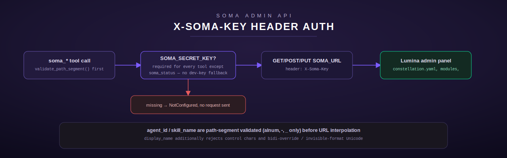

# soma

[← Infra & Ops index](README.md) · [← tool index](../README.md)

Source: [`src/soma/mod.rs`](../../../src/soma/mod.rs)

`soma` is the Lumina Constellation admin panel/API client — ten tools
covering health, config, cost, backups, validation, skills, and
agent-rename. It ports a legacy Python `soma_tools.py` (a thin
`urllib.request` wrapper) and adds path-segment and display-name validation
that the Python original lacked entirely (`src/soma/mod.rs:1-80`).

## Live-behavior notes (documented, not invented)

The module doc comment records what was observed against the actual source
host on 2026-07-06 (`src/soma/mod.rs:12-32`) and this port reproduces it
faithfully rather than "fixing" it:

- `soma_status` needs no auth; with Soma unreachable it returns exactly
  `{"status": "unreachable", "error": "<urlopen error ...>", "url":
  "<SOMA_URL>"}`.
- Every other tool failed live with `"SOMA_SECRET_KEY not set in
  environment"` because the source host's own environment had no key
  configured — this is a real, current behavior fact, not a bug this port
  introduces, and there is **no dev-key fallback**.
- `soma_run_validation`'s own docstring references a `soma_validation_status()`
  tool that **does not exist** anywhere in the live 126-tool catalog. This
  port carries the stale docstring reference forward verbatim rather than
  inventing a companion tool to make the reference true — a regression test
  (`src/soma/mod.rs:1014-1022`) locks this in as intentional.

**Known overlap, not resolved here.** `soma_skills_list`/`soma_skill_approve`
overlap conceptually with a separate `skills_list`/`skills_read`/`skills_create`
tool family that reads the same `active/`/`proposed/` directories over SSH
directly to the fleet host's filesystem, rather than through Soma's HTTP
admin API. They are kept as distinct tool families deliberately —
`src/soma/mod.rs:34-43`.

## Configuration

| Env var | Purpose | Default |
| --- | --- | --- |
| `SOMA_URL` | Soma admin API base URL | `DEFAULT_SOMA_URL` — a deliberate non-routable placeholder (`http://YOUR_FLEET_SERVER_IP:8082`), never the real address; set this in deployment |
| `SOMA_SECRET_KEY` | Shared secret sent as `X-Soma-Key` | none — required for every tool except `soma_status`; unset → `NotConfigured("SOMA_SECRET_KEY not set in environment")`, no fallback |

## Input validation (added by this port, not present in the Python source)

- `validate_path_segment` (`src/soma/mod.rs:145-161`) — `agent_id` and
  `skill_name` accept only ASCII alphanumerics, `-`, `_`, max 128 chars.
  Blocks path traversal (`../../etc/passwd`), embedded slashes, and
  header-injection characters (`\r\n`, `?`, `#`) that the Python's raw
  f-string interpolation would have allowed straight into a URL path.
- `validate_display_name` (`src/soma/mod.rs:192-210`) — rejects empty (after
  trim), longer than 200 chars, any `char::is_control()` character, and a
  curated list of bidi-control/invisible-format Unicode characters
  (`DISALLOWED_FORMAT_CHARS`, `src/soma/mod.rs:174-190`: zero-width
  space/joiner, LTR/RTL marks and overrides, directional isolates, BOM,
  Arabic letter mark). This closes a display-name spoofing vector flagged
  in adversarial review — e.g. a right-to-left override making a name
  render reversed/misleadingly in any UI that shows `display_name` raw.
  Normal non-ASCII letters (accents, other scripts) remain fully allowed.

## Tools

### `soma_status`

**Purpose.** Soma admin API health check — the one tool with no auth
requirement.

**Input schema.** No parameters.

**Behavior.** `soma_health()` (`src/soma/mod.rs:225-252`) GETs
`{base}/health` and **never returns an `Err`** — any failure (bad config,
network error, non-JSON response) is folded into the Python-shaped payload
`{"status": "unreachable", "error": <truncated to 150 chars>, "url":
<base>}`. A successful response has `url` injected into the returned JSON
object.

### `soma_rename_agent`

**Purpose.** PUT a new `display_name` for an agent into `constellation.yaml`.

**Input schema** (`src/soma/mod.rs:406-414`)

| Field | Type | Required |
| --- | --- | --- |
| `agent_id` | string | yes — internal agent key, e.g. `vigil`, `axon`, `lumina`; path-segment validated |
| `display_name` | string | yes — new human-readable name; display-name validated |

**Behavior.** `PUT {base}/api/constellation/agent/{agent_id}/display_name`
with body `{"name": display_name}`, header `X-Soma-Key`.

**Errors.** Missing field → `InvalidArgument`. `agent_id` failing
path-segment validation (traversal, slash, header-injection chars) →
`InvalidArgument`. `display_name` empty/too long/control-char/bidi-control →
`InvalidArgument`. Missing `SOMA_SECRET_KEY` → `NotConfigured`.

### `soma_constellation_config`

**Purpose.** GET the full `constellation.yaml` — agents, modules, system metadata.

**Input schema.** No parameters. GET `/api/constellation`.

### `soma_inference_status`

**Purpose.** LiteLLM inference layer status — models + online/error state.

**Input schema.** No parameters. GET `/api/inference/status`.

### `soma_cost_summary`

**Purpose.** Myelin cost/token usage summary (daily/weekly spend), if Myelin is collecting.

**Input schema.** No parameters. GET `/api/cost`.

### `soma_backup_status`

**Purpose.** Dura backup status — last run time, success/failure, file counts.

**Input schema.** No parameters. GET `/api/backup/status`.

### `soma_run_validation`

**Purpose.** Fire-and-forget POST that kicks off a Dura smoke test asynchronously.

**Input schema.** No parameters. POST `/api/validate/smoke-test` with an
empty JSON body. Expected response is a bare pid/ack — this port does not
poll for completion (there is no companion status tool; see the live-behavior
note above).

### `soma_skills_list`

**Purpose.** List active and proposed agent skills.

**Input schema.** No parameters. GET `/api/skills`.

**Output shape:** whatever Soma returns, passed through — the source
docstring describes "active skills (ready to use), proposed skills
(awaiting approval)".

### `soma_skill_approve`

**Purpose.** Approve a proposed skill, moving it from `proposed/` to `active/`.

**Input schema** (`src/soma/mod.rs:626-633`)

| Field | Type | Required | Notes |
| --- | --- | --- | --- |
| `skill_name` | string | yes | Skill directory name, e.g. `morning-briefing-v2`; path-segment validated |

**Behavior.** `POST {base}/api/skills/{skill_name}/approve` with an empty body.

### `soma_modules`

**Purpose.** Status (enabled/disabled, running/stopped, health) of all Lumina modules.

**Input schema.** No parameters. GET `/api/modules`.

## Common error shapes (all GET/POST/PUT helpers)

`soma_get`/`soma_post`/`soma_put` (`src/soma/mod.rs:255-358`) share the same
contract: a non-2xx HTTP response becomes `ToolError::Http("HTTP {status}:
{body truncated to 200 chars}")`; a connection failure becomes
`ToolError::Http("The Soma admin API is unreachable.")`; an empty successful
body becomes `{}` rather than a JSON parse error.

## Security model summary

- `soma_status` is the sole unauthenticated tool by design (a liveness
  probe should not itself require the secret it's checking for).
- Every other tool hard-requires `SOMA_SECRET_KEY` with no fallback —
  matching the live source host's own current behavior rather than
  papering over it with a dev key.
- `agent_id`/`skill_name` path-segment validation and `display_name`
  bidi/invisible-character validation are both hardening this port adds
  beyond the original Python, closing path-traversal, header-injection, and
  visual-spoofing gaps respectively.

[← Infra & Ops index](README.md) · [← tool index](../README.md)
