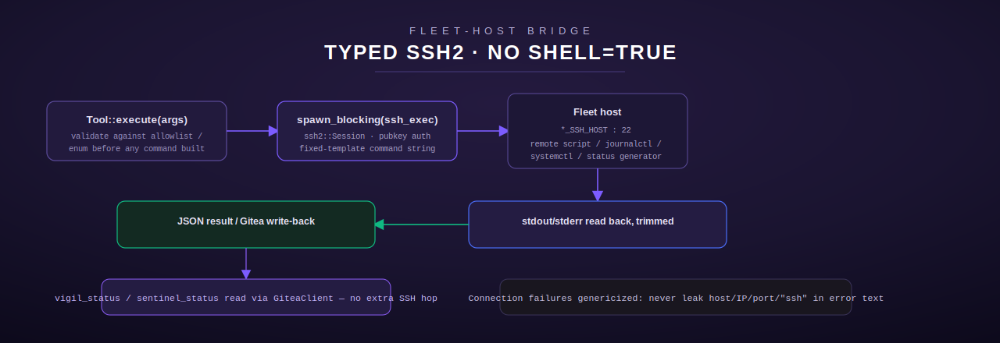

# synapse

[← Infra & Ops index](README.md) · [← tool index](../README.md)

Source: [`src/synapse/mod.rs`](../../../src/synapse/mod.rs)

Synapse is a fleet-host process that watches for proactive-message
candidates ("Pulse") and gates them against config (enabled/strength/quiet
hours) before sending. This module is a three-tool control surface:
`synapse_status` (local config/log read, no SSH), `synapse_trigger` (manual
scan, SSH), and `synapse_mute` (temporary suppression, SSH).



## A deliberately un-genericized error contract

Every other SSH-based module in this domain (`dura`, `network`, `sentinel`,
`vigil`, `gateway`) rewrites connection-level SSH failures into a generic,
non-leaking `ToolError`. **`synapse` does the opposite on purpose**
(`src/synapse/mod.rs:176-187`): the live Python `synapse_trigger`/
`synapse_mute` shell out to a bare `ssh` subprocess and pass its raw stderr
straight back as normal tool *text* output (`isError: false`) — confirmed
live: `"[synapse_trigger DRY RUN]\nssh: connect to host <fleet-host> port
22: No route to host"`. Converting that to a generic `ToolError` here would
surface as an MCP-level `isError: true`, which the real server never does.
So `ssh_exec` in this module folds connection/handshake/auth failures into
`Ok(String)` containing an `ssh:`-style message, matching the observed
contract exactly. Only `NotConfigured` (missing `SYNAPSE_SSH_HOST`/
`SYNAPSE_SSH_KEY_PATH`) remains a hard `Err` — there's no equivalent Python
failure mode since the live server always has its SSH target configured.

## Configuration

| Env var | Purpose | Default |
| --- | --- | --- |
| `SYNAPSE_SSH_HOST` | SSH host of the fleet box | none — required for `synapse_trigger`/`synapse_mute` |
| `SYNAPSE_SSH_USER` | SSH user | `root` |
| `SYNAPSE_SSH_KEY_PATH` | SSH private key path | none — required |
| `SYNAPSE_SCRIPT` | Remote synapse script invocation | none — required (no compiled-in fallback, 2026-07 PII remediation) |
| `SYNAPSE_CONFIG_PATH` | Local YAML config path read by `synapse_status` | none — required |
| `SYNAPSE_LOG_PATH` | Local log path read by `synapse_status` for the "last sent" marker | none — required |

All three script/path variables lost their compiled-in fleet-host defaults
in the 2026-07 PII remediation pass — each has a `require_*` accessor
(`src/synapse/mod.rs:117-151`) that fails clean with `NotConfigured` naming
the specific missing var.

## Tools

### `synapse_status`

**Purpose.** Show current config (enabled, strength, quiet hours) and when
the last proactive message was sent. "Zero cost" per its own description —
this is the one tool in the module that reads local files rather than
reaching over SSH, because the live server answered it instantly while the
SSH-dependent tools failed (implying it reads local state, not remote
state) — confirmed by its own docstring: "reads config + log files."

**Input schema.** No parameters.

**Behavior.** `load_status_config(path)` (`src/synapse/mod.rs:299-325`)
reads `SYNAPSE_CONFIG_PATH` as YAML; a missing file or unparseable YAML
silently falls back to documented defaults (`enabled: false, strength:
"moderate", max_per_day: 3, quiet_start: "22:00", quiet_end: "08:00"`) —
never an error. `last_sent_marker(path)` (`src/synapse/mod.rs:330-340`)
reads `SYNAPSE_LOG_PATH` and returns its last non-empty line, or `"never"`
if the file is missing/empty.

**Output shape (plain text, not JSON):**
```
Synapse: DISABLED
Strength: moderate | Max/day: 3
Quiet hours: 22:00 – 08:00
Last sent: never
```

**Errors.** `SYNAPSE_CONFIG_PATH`/`SYNAPSE_LOG_PATH` unset →
`NotConfigured` (config file/log file *contents* missing is fine — only the
env var itself being unset is an error).

### `synapse_trigger`

**Purpose.** Run a Synapse scan manually.

**Input schema** (`src/synapse/mod.rs:416-427`)

| Field | Type | Required | Default |
| --- | --- | --- | --- |
| `dry_run` | boolean | no | `true` |

**Behavior.** Runs `{script} trigger --dry-run` or `{script} trigger
--live` over SSH (60s timeout). Output is wrapped `"[synapse_trigger DRY
RUN]\n<output>"` or `"[synapse_trigger LIVE]\n<output>"`. A connection
failure is embedded in that same wrapped text (per the un-genericized
contract above), not raised as an error.

**Errors.** `SYNAPSE_SSH_HOST`/`SYNAPSE_SCRIPT` unset → `NotConfigured` (the
only hard-error path in this tool).

### `synapse_mute`

**Purpose.** Mute Synapse for the next N hours by writing a
`synapse_muted_until` Pulse marker with a future timestamp.

**Input schema** (`src/synapse/mod.rs:464-475`)

| Field | Type | Required | Default | Notes |
| --- | --- | --- | --- | --- |
| `hours` | integer | no | `4` | Must be `1..=72` |

**Behavior.** `validate_mute_hours` (`src/synapse/mod.rs:155-163`) enforces
the documented 1-72 hour bound **client-side, before** the SSH call — this
is a deliberate hardening decision flagged for human review in the module
doc comment (`src/synapse/mod.rs:20-27`), since the live server was
unreachable at port time and it could not be confirmed whether the bound is
also enforced server-side. Runs `{script} mute --hours {hours}` over SSH
(30s timeout). The response text is scanned case-insensitively for
`"error"`, `"no route to host"`, `"connection refused"`, `"failed"`,
`"permission denied"`, or an `"ssh:"` prefix — any match wraps the output as
`"[synapse_mute] Failed: <output>"`; otherwise `"[synapse_mute] Synapse
muted for <hours> hour(s).\n<output>"`.

**Errors.** `hours` outside `1..=72` → `InvalidArgument`, checked before any
SSH attempt. `SYNAPSE_SSH_HOST`/`SYNAPSE_SCRIPT` unset → `NotConfigured`.

## Security model summary

- `hours` is range-validated before ever reaching a remote command string.
- `synapse_status` never touches the network — a config/log read failure
  degrades to documented defaults, not an error, so it can never fail from
  a transient fleet-host outage.
- `synapse_trigger`/`synapse_mute` intentionally do **not** genericize
  connection failures — this preserves an exact, previously-observed
  external contract rather than "improving" it inconsistently with the rest
  of the domain.

[← Infra & Ops index](README.md) · [← tool index](../README.md)
