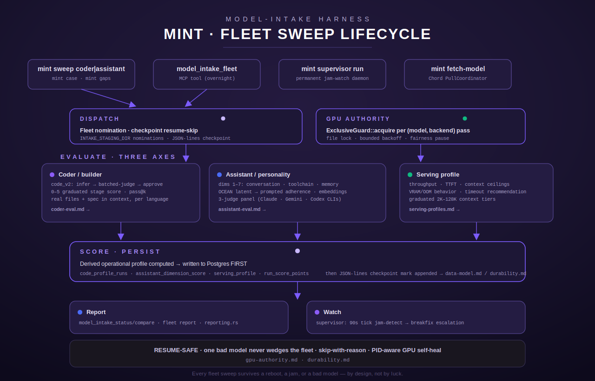

# MINT — Model-Intake Profiling Harness

MINT (Model INTake) is the fleet-scale evaluation harness that profiles any locally-served
model across three independent axes — **coder/builder correctness**, **assistant/personality
quality**, and **serving-profile behavior** — and persists the results as structured,
comparable rows in Postgres. It lives under `src/intake/` (~33k lines across ~43 modules) in
the Terminus repo, is exposed both as a standalone `mint` CLI binary and as four Terminus MCP
tools, and is built to run **unattended for many hours** against an entire model catalog:
resume-safe across reboots, self-healing around a single bad model, and GPU-serialized so it
never fights a production inference workload for VRAM.

The framework began as S83 MINT-01 (`src/intake/mod.rs:1`) with a single `context` stress
suite; the coder/builder axis (code_v2, S86) and the assistant/personality axis (S84) were
built out alongside it, plus a serving-profile probing subsystem, a permanent supervisor
daemon (MINT Phase 3), and a unified `mint` CLI (MINT Phase 1) that now fronts every older
standalone binary without changing their behavior.

## The three evaluation axes

| Axis | What it measures | Primary module | Deep-dive |
|---|---|---|---|
| **Coder / builder** | Real, buildable code generation against a realistic corpus — a 3-phase infer→batched-judge→approve pipeline with a 0–5 graduated stage score, per language | `src/intake/code_v2.rs`, `src/intake/coder_sweep.rs` | [coder-eval.md](coder-eval.md) |
| **Assistant / personality** | Seven scoring dimensions — conversation depth, tool chaining, memory integration, latent (OCEAN) and prompted personality, embeddings, and long-context ("yarn") retention — judged by a 3-CLI judge panel | `src/intake/assistant/*` | [assistant-eval.md](assistant-eval.md) |
| **Serving profile** | How a model behaves as a *served backend*: throughput, TTFT, context-tier degradation, VRAM footprint, recommended timeouts | `src/intake/serving/*` | [serving-profiles.md](serving-profiles.md) |

A model's default suite selection is purpose-routed by name (`default_suites_for`,
`src/intake/mod.rs:113-137`): a `coder`-named model runs `context+code`; `gpt-oss` runs
`context+agent`; `qwen3:8b`/`harness`-named models run all three legacy suites
(`context+code+agent`); everything else defaults to `context` only. `code_languages_for`
(`src/intake/mod.rs:146-163`) further narrows the coder axis's language set: coder models get
the full P0/P1 language set (`rust, typescript, python, bash, htmlcss`); everyone else gets a
lighter `python, bash` subset. DiffusionGemma/`dgem` is flagged by `is_non_ollama_daemon`
(`src/intake/mod.rs:141-144`) as a non-Ollama daemon model the Ollama-based suites cannot load,
and is skipped cleanly rather than erroring.

Note: `src/intake/mod.rs` also documents an older `agent` suite (tool selection, multi-step,
instruction following, hallucination, personality — `src/intake/agent.rs`) that predates the
S84 assistant/personality axis above and is still wired into `default_suites_for` and
`model_intake_fleet`. It is a *distinct* subsystem from `assistant/*` — the pages in this
section focus on the current, actively-developed axes; `agent.rs` is mentioned here only so its
name in `default_suites_for`'s output isn't mistaken for the assistant-eval axis.

## End-to-end lifecycle

1. **Dispatch.** A fleet sweep is launched via the `mint` CLI (`mint sweep coder|assistant`,
   `mint case`, `mint gaps`) or the `model_intake_fleet` MCP tool. The driver resolves its
   model list (explicit, or the full non-embedding Ollama catalog via `list_chat_models`,
   `src/intake/runner.rs:409-434`), reads its resume checkpoint, and skips any `(model,
   backend)` pass already completed.
2. **GPU authority.** Before running inference for a given pass, the sweep acquires the
   GPU-authority exclusive lock (`gpu_authority::ExclusiveGuard`) — a file-lock-backed,
   PID-aware, fairness-and-backoff-governed single-GPU serialization layer shared by every
   intake subsystem and coordinated with Chord over HTTP. See
   [gpu-authority.md](gpu-authority.md).
3. **Evaluate.** The model runs through whichever of the three axes its purpose-routing (or an
   explicit override) selects, producing per-tier / per-case / per-dimension raw measurements.
4. **Score + persist.** Each axis derives its own scored/graduated output (a 0–5 stage score
   for coder cases, a per-dimension numeric score plus judge-panel verdicts for the assistant
   axis, a derived operational profile — safe/absolute context ceilings, degradation point,
   recommended timeouts — for context/serving). Rows are written to Postgres, then a
   JSON-lines checkpoint mark is appended so a resumed run knows this pass is done. See
   [data-model.md](data-model.md) and [durability.md](durability.md) for the exact schema and
   write-ordering guarantees.
5. **Report.** `model_intake_status`/`model_intake_compare` (MCP tools, `src/intake/mod.rs:433-616`)
   and the assistant axis's `reporting.rs` read back the persisted rows for operator-facing
   summaries and cross-model comparison tables.
6. **Watch.** The permanent `mint supervisor run` daemon (MINT Phase 3) observes the same
   tables for jam signatures (stalled sweeps, stale heartbeats) and escalates through
   `breakfix.rs`'s recovery ladder without ever writing to the tables it watches. See
   [durability.md](durability.md).

## Entry points

- **CLI**: the unified `mint` binary (`sweep coder|assistant`, `case`, `gaps`, `gpu
  status|acquire|release`, `supervisor run|install|uninstall`, `fetch-model`), plus five
  still-supported legacy standalone binaries it wraps without changing their behavior. See
  [cli.md](cli.md).
- **MCP tools** (`src/intake/mod.rs:724-729`): `model_intake` (run one or more suites against a
  single model), `model_intake_status` (read back a model's stored profile), `model_intake_compare`
  (cross-model comparison table on one metric), `model_intake_fleet` (profile the entire
  catalog overnight with the single-hot-model VRAM lifecycle).

## Page index

- [cli.md](cli.md) — every `mint` subcommand, its flags, env-var fallbacks, and worked examples.
- [coder-eval.md](coder-eval.md) — the coder/builder axis: v1 vs v2 harness, the 3-phase
  infer→batched-judge→approve flow, the 0–5 graduated stage score, the corpus, gap auditing.
- [assistant-eval.md](assistant-eval.md) — the assistant/personality axis: all 7 dimensions,
  the 3-judge panel, the OCEAN and Lumina-traits rubrics, `select_chat_role`.
- [serving-profiles.md](serving-profiles.md) — the serving-profile probing axis.
- [gpu-authority.md](gpu-authority.md) — the single-GPU serialization model: lock format,
  exclusive/shared modes, PID-aware self-heal, Chord HTTP coordination, fairness and
  max-hold safety valves.
- [durability.md](durability.md) — checkpoint/resume mechanics, write-ordering guarantees, and
  the supervisor + breakfix jam-recovery system.
- [data-model.md](data-model.md) — the full Postgres schema (tables, views, migration
  mechanics) and the complete `INTAKE_*`/`MINT_*`/`JUDGE_*` environment-variable surface.

## Where MINT fits

MINT is a Terminus subsystem, not a separate service — it shares Terminus's Postgres, its
model registry conventions, and (for the assistant axis's live backend passes and the coder
axis's inference) Chord's inference egress. It does not itself proxy chat traffic; Chord
remains the inference front door for that. MINT's job is strictly evaluation and profiling —
producing the operational data (context ceilings, timeouts, `recommended_role`, approved
language:tier combinations) that the rest of the fleet's model-selection and serving-profile
logic consumes.
