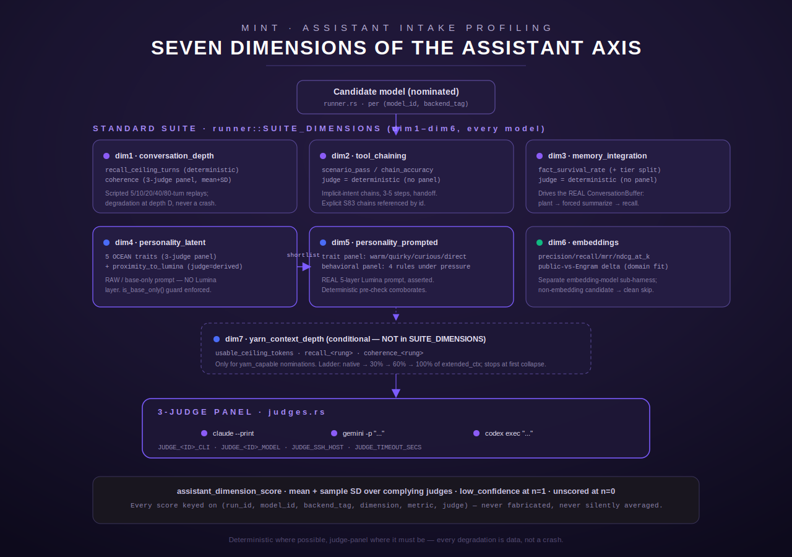
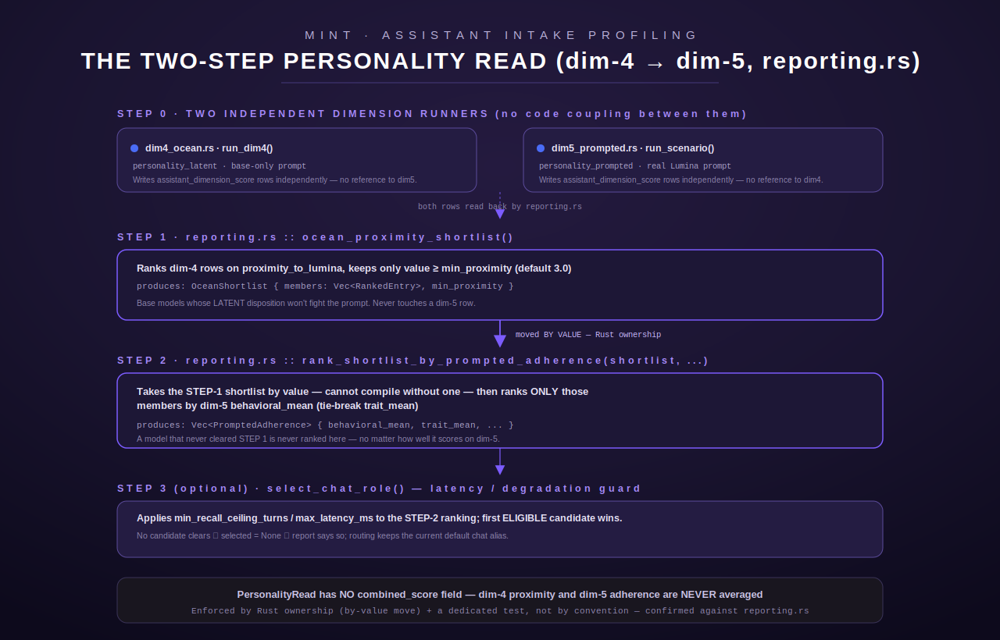

[← MINT overview](README.md)

# MINT — Assistant Intake Evaluation Harness

The assistant-evaluation axis of MINT (Model Intake) is the code under
`src/intake/assistant/` — module root `src/intake/assistant/mod.rs`. It scores a
candidate model on **seven dimensions** of chat-assistant quality: how long it holds
a conversation before degrading, whether it can chain tools across an implicit,
multi-turn intent, whether planted facts survive the real multi-session memory
pipeline, its latent (un-prompted) personality, how well it holds Lumina's prompted
voice under pressure, embedding-retrieval quality (a separate sub-harness, for
embedding models only), and — for the subset of models flagged `yarn_capable` — how
quality degrades across a YaRN context-extension depth ladder.

This page is a reference-grade deep-dive into that code as it exists today, with
`file.rs:line` citations for every non-obvious claim. Where the code's actual
behavior differs from a plausible-sounding summary, this page says so explicitly —
most importantly in the [two-step personality read](#the-two-step-personality-read-dim-4--dim-5) section below.

## Scope: assistant axis vs. the coder axis vs. the old agent suite

MINT profiles two axes of the same fleet: the **builder/coder axis** (S83, tables
owned by `storage.rs`, e.g. `code_profile_runs`) measures code-generation quality;
this **assistant axis** (S84, this module, tables owned by `schema.rs`) measures
chat/persona/tool-use quality; they join on `model_id` + `backend_tag` via the
`model_dual_profile` view (`schema.rs:619-663`). A third, older `agent.rs` suite
(explicit multi-step tool scenarios) is reused here only as a *reference corpus* —
dimension 2 loads its `multi_step` scenarios by id (`dim2_toolchain.rs:635-666`) —
and is otherwise out of scope for this page; see the coder-axis and agent-suite pages
for those in depth.



## Module map

| File | Role |
|---|---|
| `mod.rs` | Shared types: `ModelId` (byte-identical pass-through of the S83 registry key, `mod.rs:56-58`), `BackendTag` (`gpu`\|`cpu`), `DimensionScore`, `JudgeOutcome`, `PanelResult` + its `aggregate()`/`into_dimension_scores()` |
| `schema.rs` | Postgres schema, idempotent migration, `model_dual_profile` view, insert helpers |
| `judges.rs` | The 3-judge CLI panel: invocation, JSON-contract extraction, retry/abstain |
| `acquire.rs` | Model acquisition (`ollama pull` / span-register / HF fetch) + VRAM/backend strategy |
| `runner.rs` | The consolidated fleet-sweep orchestrator (`run_with`) — the ASMT-09 entry point |
| `fleet.rs` | Append-only Lumina-fleet registration (never clobbers a Harmony row) |
| `reporting.rs` | ASMT-11 money queries, the sequential personality read, chat-role selection, Markdown render |
| `dim1_conversation.rs` … `dim7_yarn_depth.rs` | The seven dimension runners |
| `rubrics/ocean_rubric.md`, `rubrics/lumina_traits_rubric.md` | The two rubrics the judge panel scores against |

---

## The seven dimensions

Six dimensions (`dim1`–`dim6`) run for **every** nominated model — they are the
literal contents of `runner::SUITE_DIMENSIONS` (`runner.rs:52-59`). The seventh,
`yarn_context_depth`, runs **only** for nominations flagged `yarn_capable` with a
`yarn` config block, driven explicitly rather than through the generic suite loop
(`runner.rs:33-36`, `dim7_yarn_depth.rs:33-36`).

### dim1 — `conversation_depth` (`dim1_conversation.rs`)

Measures how many turns a model sustains before it degrades, on two independent
axes computed from the same scripted replay:

- **Deterministic recall.** A corpus of five scripted conversations of increasing
  length (5/10/20/40/80 turns — asserted by test `embedded_corpus_parses_and_validates`,
  `dim1_conversation.rs:721-728`) plants facts at specific turns and probes recall at
  later turns via case-insensitive substring match (`probe_recalled`,
  `dim1_conversation.rs:231-237`). `compute_recall` (`dim1_conversation.rs:275-312`)
  builds a recall curve per probe depth and derives `recall_ceiling_turns` — the
  *deepest* probe depth whose recall rate is still ≥ the corpus's
  `recall_threshold`. Stored as `metric = "recall_ceiling_turns"`,
  `judge = "deterministic"`, no SD (`dim1_conversation.rs:584-594`).
- **Judged coherence.** Responses sampled at `coherence_sample_turns` are scored by
  the 3-judge panel against a 1–5 coherence rubric inlined in `coherence_prompt`
  (`dim1_conversation.rs:433-453`); per-sample judge scores are pooled per judge and
  reduced to one rounded integer per judge so the shared mean+SD aggregation applies
  (`score_coherence`, `dim1_conversation.rs:651-703`). Stored as `metric =
  "coherence"`.

**Degradation, never a crash.** A timeout, truncation, transport error, or empty
response at turn D is recorded as `degraded_at = D` and the replay stops there
(`replay_conversation`, `dim1_conversation.rs:474-531`); probes at that turn count as
misses, never a panic.

### dim2 — `tool_chaining` (`dim2_toolchain.rs`)

Measures **implicit, multi-turn** tool chaining — a 3–5 step chain the user never
names, inferred from conversational build-up (`dim2_toolchain.rs:1-10`). This is the
new axis; the *explicit*-intent chains are **not** re-authored here — they are the
S83 agent-scenario `multi_step` cases, loaded live by id from the S83 corpus
(`load_s83_referenced_explicit_scenarios`, `dim2_toolchain.rs:635-666`), never
duplicated (a test enforces this: `s83_reference_ids_are_present_and_nonempty`,
`dim2_toolchain.rs:882-887`).

Scoring is **fully deterministic** (`judge = "deterministic"`, no panel) against five
independent criteria evaluated per scenario (`score_chain`, `dim2_toolchain.rs:315-400`):

| Criterion | Meaning |
|---|---|
| `completed` | every expected tool was called at least once |
| `correct_tools` | no call outside the expected set (no hallucinated tool) |
| `correct_order` | expected tools appear as a subsequence in the right relative order |
| `correct_handoff` | each declared handoff's carried value appears in the dependent call's args (substring, case-insensitive) |
| `stopped` | total calls did not exceed the expected chain length |

A scenario is a **clean pass** only when *all five* hold. Two failure modes are kept
**distinct** from a clean pass rather than collapsed into one pass/fail bit
(`ChainOutcome`, `dim2_toolchain.rs:241-268`): `WrongOrder` (right tools, wrong
sequence) and `SpuriousCall` (hallucinated tool, or ran past the stop point) —
tested explicitly (`wrong_order_is_distinct_from_clean_pass`,
`spurious_call_is_distinct_from_clean_pass`, `dim2_toolchain.rs:741-776`). Partial
credit is `chain_accuracy` — the fraction of expected steps satisfied in order
(`dim2_toolchain.rs:359-369`). Stored per-scenario (`scenario_pass:<id>`,
`chain_accuracy:<id>`) plus two aggregates: `conversational_pass_rate` and
`mean_chain_accuracy`.

### dim3 — `memory_integration` (`dim3_memory.rs`)

Measures whether planted facts survive the **real** S78 3-tier memory pipeline
across sessions — not a re-implementation. The orchestrator drives the actual
`crate::compat::conversation::buffer::ConversationBuffer` the live agent loop uses
(`dim3_memory.rs:11-18`): push session-1 turns, drain `buffer.summarization_due()`
through the fixed summarizer whenever it fires, install the summary, push an
unrelated session-2 (different user id, so it never evicts the replay user's
window), then answer session-3 recall probes against the assembled context
(`run_script`, `dim3_memory.rs:640-712`).

**Fixed summarizer.** Summarization is a pipeline component, not the model under
test — it is held constant across every candidate, defaulting to `qwen3:8b`,
overridable via env `LUMINA_SUMMARIZER_MODEL` (`dim3_memory.rs:76-98`), and recorded
in every row's audit JSON.

Scoring is deterministic (`judge = "deterministic"`): each planted fact's actual tier
(`summarized` vs `buffer`) is **verified against the real buffer state**, not assumed
from the corpus (`actual_tiers`, `dim3_memory.rs:599-625`), and survival is a
normalized substring match (`answer_contains_any`, `dim3_memory.rs:294-301`). A miss
whose answer instead contains a *different* planted fact's value is flagged
`conflation` (`score_fact`, `dim3_memory.rs:322-354`) — recorded, not treated as an
ordinary miss. Stored per-fact plus three aggregates: `fact_survival_rate`,
`summarized_survival_rate`, `buffer_survival_rate` (the latter two `None`/no-row when
their subset is empty, `dim3_memory.rs:482-503`).

### dim4 — `personality_latent` (`dim4_ocean.rs`) — the OCEAN proximity shortlist step

Scores the candidate's **latent** Big-Five (OCEAN) disposition — what training baked
in, with **no Lumina prompt loaded at all**. Every elicitation prompt sent to the
model is verified base-only: `is_base_only()` rejects any prompt containing a Lumina
marker (`lumina`, `constellation`, `engram`, `system prompt:`, …;
`dim4_ocean.rs:155-172`), and `RawModel::assemble_base_prompt` **refuses to run**
rather than silently profile a leaked prompt (`dim4_ocean.rs:225-235`) — a leak is
recorded as a degradation with a reason, never a silent contamination.

Prompts are open-ended (free-form), not multiple-choice, "so a model cannot game a
fixed-choice questionnaire" (`dim4_ocean.rs:27-30`). The 3-judge panel scores each
response against `rubrics/ocean_rubric.md` for the scenario's single target trait,
1–5; per-judge scores are pooled per trait and reduced to the shared mean+SD
aggregation (`run_dim4`, `dim4_ocean.rs:435-513`), yielding exactly the five OCEAN
trait rows: `openness`, `conscientiousness`, `extraversion`, `agreeableness`,
`neuroticism` (`dim4_ocean.rs:88-94`).

**Derived proximity note.** After scoring, `proximity_to_lumina()`
(`dim4_ocean.rs:360-376`) computes the mean absolute distance between the model's
per-trait means and `LUMINA_TARGET_OCEAN` (a design constant, e.g. `openness: 4.0`,
`neuroticism: 2.0` — low reactivity is the target — `dim4_ocean.rs:332-338`), mapped
linearly onto a 1–5 "closeness" scale (5 = identical disposition). This is written as
its **own separate row** — `metric = "proximity_to_lumina"`, `judge = "derived"`
(`dim4_ocean.rs:389-417`) — explicitly documented as "NEVER merged into any dim-5
prompted-adherence score" (`dim4_ocean.rs:32-36, 356-359`).

An empty/refused response is *not* an error — it's itself a valid low reading (see
the rubric, below); a refusal is judged, not skipped.

### dim5 — `personality_prompted` (`dim5_prompted.rs`) — the prompted-adherence step

The **production-config, highest-risk** dimension: the candidate runs with the
**real 5-layer Lumina system prompt** loaded — `[identity] [rules] [capabilities]
[style] [now]`, assembled by the canonical `crate::compat::prompt::PromptAssembler`
(`dim5_prompted.rs:1-11`). This is asserted, not stubbed:
`assert_real_lumina_prompt` requires ≥ `MIN_PRODUCTION_LAYERS` (5) always-on layer
markers present *and* a non-trivial body (≥ 40 words), else it returns
`ToolError::NotConfigured` and **refuses to profile** (`dim5_prompted.rs:107-139`) —
a misconfigured layer directory fails loudly rather than silently profiling a stub.

Each multi-turn "pressure" scenario (`corpora/prompted_pressure.json`, every
scenario ≥ 10 turns — asserted by `corpus_parses_and_has_long_scenarios`,
`dim5_prompted.rs:677-690`) is replayed turn-by-turn through the candidate, building
a running transcript (`run_scenario`, `dim5_prompted.rs:538-582`), then the **whole
transcript** is scored by two independent judge panels:

- **Trait panel** (sub-axis A, "voice"): `warm`, `quirky`, `curious`, `direct`
  (`TRAIT_METRICS`, `dim5_prompted.rs:52`), rubric inlined in `trait_panel_prompt`
  (`dim5_prompted.rs:333-346`).
- **Behavioral panel** (sub-axis B, "rules under pressure"): `held_one_question`,
  `no_unasked_prefetch`, `no_overclaim`, `voice_under_provocation`
  (`BEHAVIORAL_METRICS`, `dim5_prompted.rs:55-60`), rubric inlined in
  `behavioral_panel_prompt` (`dim5_prompted.rs:350-371`).

Both panels score the whole transcript because "drift shows up late"
(`dim5_prompted.rs:9-13`). **Deterministic corroboration** runs alongside: for every
reply, `precheck_reply` (`dim5_prompted.rs:319-326`) flags a raw ≥2-question-mark
count, unrequested pre-fetch phrasing (`PREFETCH_MARKERS`, `dim5_prompted.rs:281-294`),
and over-claim phrasing (`OVERCLAIM_MARKERS`, `dim5_prompted.rs:298-316`) via
substring lists — a coarse signal, not the score of record. `corroboration_verdict()`
(`dim5_prompted.rs:445-461`) compares the pre-check's *direction* against the
behavioral panel's mean (agree/disagree; the ambiguous 2.5–4.0 middle claims no
disagreement) and the result rides in every behavioral row's audit JSON
(`behavioral_audit_with_precheck`, `dim5_prompted.rs:463-487`) so ASMT-11 can surface
panel-vs-pre-check disagreement.

Trait and behavioral sub-axes are recorded and can diverge **independently** — a
model can go flat-compliant (high behavioral, low trait) or vice versa; neither
axis is adjusted to match the other (test:
`trait_and_behavioral_subaxes_diverge_independently`, `dim5_prompted.rs:870-918`).

### dim6 — `embeddings` (`dim6_embeddings.rs`) — separate sub-harness

A distinct sub-harness for the **embedding-model class**, not chat models. It embeds
every doc and query of two IR corpora — a public MTEB/BEIR-style benchmark subset
(`corpora/embeddings_public.json`, the baseline) and a small hand-labeled set drawn
from real Engram data (`corpora/embeddings_engram.json`, the domain-fit probe) — and
ranks docs by cosine similarity per query (`run_corpus`, `dim6_embeddings.rs:605-692`).
Per query, at cutoff `k`: `precision_at_k`, `recall_at_k`, `mrr` (reciprocal rank of
the first relevant doc over the *full* ranking), and `ndcg_at_k` (binary-relevance,
rank-discounted, normalized by the ideal ordering) — `query_metrics`,
`dim6_embeddings.rs:426-482`. Corpus-level rows are the mean over queries, plus
`latency_ms` (mean per-query embed latency) and `dimensionality` (`judge` = the
corpus name so a row is unambiguous, `dim6_embeddings.rs:544-564`).

**The public-vs-Engram delta** (`compute_delta`, `dim6_embeddings.rs:719-735`) is
`Engram − public` on the headline metrics, `judge = "public_vs_engram"`, metric
names suffixed `_delta`. A large negative nDCG delta (≥ `DOMAIN_MISMATCH_NDCG_DROP =
0.15` drop) sets `domain_mismatch_flag`, carried in each delta row's
`low_confidence` column so it's queryable without re-deriving the delta
(`dim6_embeddings.rs:712-773`) — "a model strong on public IR but weak on Engram is
a domain-mismatch flag, not a bad model" (`dim6_embeddings.rs:11-13`).

**Edge cases, all clean skips, never crashes:** a non-embedding candidate fails on
the very first embed call and the whole corpus returns `CorpusReport::skipped(...)`
with no rows produced (`dim6_embeddings.rs:618-635`, tested at
`non_embedding_candidate_skips_cleanly`); the public benchmark being absent at setup
runs Engram-only with `public = None` and **no delta fabricated**
(`run_dim6`, `dim6_embeddings.rs:813-832`, tested `public_absent_runs_engram_only_no_delta`);
a corpus smaller than `k` computes metrics at the available depth and sets `low_n`
(`query_metrics`, `dim6_embeddings.rs:433-434`).

**PII gate, in-code.** `Corpus::from_json` runs `scan_pii` over every doc and query
line and hard-rejects the parse on a match — private IPv4 ranges, `CT<digit>`
container ids, email addresses, credential-shaped tokens, and a small
operator/agent-name blocklist (`dim6_embeddings.rs:173-235`) — a second, in-code
guard alongside the outer pre-push PII gate.

### dim7 — `yarn_context_depth` (`dim7_yarn_depth.rs`) — conditional, per yarn-capable model

Not part of the standard suite (`runner::SUITE_DIMENSIONS` excludes it,
`dim7_yarn_depth.rs:33-36`); it is driven explicitly, per model, only when a
nomination is `yarn_capable` with a `YarnConfig` (`native_ctx`, `extended_ctx`,
`acquire.rs:91-105`; the runner treats `yarn_capable: true` with no config as an
authoring error surfaced as a dim-skip reason rather than silently ignored,
`acquire.rs:180-184`, `runner.rs:467-476`).

It reuses **dim1's own primitives** — `probe_recalled` and `coherence_prompt` — at
**context-token depth** rather than conversation-turn depth, because token depth is
model-specific and only applies to the yarn-capable subset (`dim7_yarn_depth.rs:19-31`).
A single planted fact + filler paragraph (`corpora/yarn_depth_facts.json`) is padded
to a target token count (a chars/4 sizing heuristic, `approx_tokens`,
`dim7_yarn_depth.rs:168-170`) and probed at four rungs, shallowest first, so a
collapse stops the ladder before wasting inference on deeper, doomed probes
(`DepthRung::ORDER`, `dim7_yarn_depth.rs:142-163`):

| Rung | Token target |
|---|---|
| `native` | `native_ctx` |
| `pct30` | `extended_ctx × 0.30` |
| `pct60` | `extended_ctx × 0.60` |
| `pct100` | `extended_ctx` (the full advertised extension) |

A rung **collapses** on a recall miss unconditionally, or — when judges are
configured — on weak/unconfirmed coherence too (mean < `WEAK_COHERENCE_THRESHOLD =
2.0`, or no judge complied — `run_yarn_depth`, `dim7_yarn_depth.rs:284-311`); "an
assistant that 'remembers' the fact but has gone incoherent is not a usable depth
either" (comment, `dim7_yarn_depth.rs:287-289`). `usable_ceiling_tokens` is the
deepest token target cleared *without* collapsing — potentially far below the
advertised `extended_ctx` — never fabricated past the real collapse point. Persists
through the same `ScoreSink` abstraction the standard runner uses
(`run_yarn_depth_and_write`, `dim7_yarn_depth.rs:400-414`), so `mem_config` tagging
applies identically.

---

## The 3-judge panel (`judges.rs`)

Every panel-scored dimension (`dim1` coherence, `dim4`, `dim5`) is judged by the
same 3-provider panel, built from `JudgeProvider::all()` (Claude, Gemini, Codex —
`judges.rs:80-86`). Each judge shells out to its OAuth-logged-in CLI, mirroring the
subprocess pattern already used for the `bash` validator in `code_v2`
(`judges.rs:8-13`).

### Invocation, per provider (verified headless forms)

The three CLIs are **not** interchangeable: each has a genuinely different headless
form, and driving all three with claude's `--print` + stdin shape (an earlier bug)
silently reduced the "3-judge" panel to judging on Claude alone
(`judges.rs:109-113`). The verified forms (`JudgeProvider::invocation`,
`judges.rs:130-148`):

| Provider | Command shape | Prompt delivery |
|---|---|---|
| `claude` | `claude [--model M] --print` | stdin |
| `gemini` | `gemini [--model M] -p "<prompt>"` | flag value |
| `codex` | `codex exec [--model M] "<prompt>" --output-last-message <file> --skip-git-repo-check` | positional arg |

`codex exec` echoes the full prompt plus a token-usage footer on stdout — a judging
prompt embedding the model's own reply could defeat a naive extractor — so codex's
clean final message is read back from `--output-last-message`'s temp file instead of
stdout (`judges.rs:192-211`). `--skip-git-repo-check` is required because codex
0.142+ refuses to run outside a trusted git repo directory and the sweep's cwd never
is one (`judges.rs:203-207`).

**Split-topology (remote) mode.** When `JUDGE_SSH_HOST` is set, every judge call runs
over `ssh <host>` instead of locally — the inference host runs the sweep, the judge
CLIs live OAuth-logged-in elsewhere (`judges.rs:97-101, 283-336`). `$HOME/.local/bin`
is prepended to `PATH` because a non-interactive ssh shell skips the login profile
(`judges.rs:282`); the same per-provider headless forms run inside one remote shell
so codex's temp file is created and read on the **remote** host.

### Env vars (names only)

| Env var | Purpose |
|---|---|
| `JUDGE_<ID>_CLI` (e.g. `JUDGE_CLAUDE_CLI`) | Override the CLI binary/path for a provider; default is the bare provider name |
| `JUDGE_<ID>_MODEL` (e.g. `JUDGE_GEMINI_MODEL`) | `--model` value passed to the CLI; omitted (CLI default) when unset |
| `JUDGE_SSH_HOST` | Split-topology remote judge host (`user@host`); unset ⇒ local shell-out |
| `JUDGE_TIMEOUT_SECS` | Per-judge wall-clock timeout, default 120s |

### Output contract, retry, abstain

Every judge prompt ends with `JSON_CONTRACT_SUFFIX` (`judges.rs:32-34`): reply with
ONLY a JSON object mapping each requested trait to an integer 1–5, no prose, no
fences. `extract_json_object` (`judges.rs:376-393`) tolerates a single leading/trailing
markdown fence and prose wrapped around one balanced top-level `{...}` span, then
`validate_traits` (`judges.rs:445-468`) rejects a missing key, an out-of-range value,
or a float-with-fractional-part disguised as an integer.

A contract violation triggers **exactly one retry** with a terse reminder
(`RETRY_REMINDER`, `judges.rs:37-39`); a second failure, or an auth/unavailable
signal on either attempt, makes that judge **abstain** — `raw` output is redacted
(control chars stripped, truncated to 2000 bytes) and retained for audit
(`run_one_judge`, `judges.rs:475-554`). An auth failure is detected heuristically
(`looks_like_auth_error`, `judges.rs:339-357`) from stdout/stderr text ("not
authenticated", "401", "expired token", …) and always maps to abstain, never a crash.

### Aggregation

`PanelResult::aggregate` (`mod.rs:293-357`) is the ASMT-01 aggregation contract every
dimension shares:

- Per trait: **mean + sample standard deviation** (n−1 denominator) over the
  *complying* judges only.
- Exactly **one** complying judge ⇒ the value is kept but `low_confidence = true`
  and `std_dev = None` (mean over n=1 has no defined SD) — the row's `judge` column
  names that single judge instead of `"panel"` (`mod.rs:242-251`).
- **Zero** complying judges ⇒ the whole item is `unscored` (`unscored_reason` set,
  no aggregate rows) — this is recorded as data, not silently dropped or defaulted.
- A high SD (judges disagreeing) is preserved as-is, never smoothed toward the mean
  (`mean_sd_two_judges`/`mean_sd_three_judges` tests, `mod.rs:417-430`).

---

## The two-step personality read (dim-4 → dim-5)

The task brief for this page described this as *"a two-step personality read (dim4
proximity shortlist → dim5 adherence, never averaged)"*. Reading the actual code
confirms the outcome (the two are indeed never averaged, and the read is indeed
sequential) but the **mechanism** is not what a description of "dim4 feeding dim5"
would suggest — it's worth stating precisely, because the sequencing does **not**
live inside `dim4_ocean.rs` or `dim5_prompted.rs` at all.



**What the dimension runners actually do:** `dim4_ocean.rs::run_dim4` and
`dim5_prompted.rs::run_scenario` are **fully independent** — neither module imports,
calls, or references the other. Each writes its own `assistant_dimension_score` rows
(`personality_latent` / `personality_prompted`) and stops. There is no "shortlist"
concept anywhere in either dimension file.

**Where the two-step read actually happens:** entirely in `reporting.rs` (ASMT-11),
at report-build time, over the rows both dimensions already wrote:

1. `ocean_proximity_shortlist()` (`reporting.rs:362-387`) reads only
   `personality_latent` / `proximity_to_lumina` rows, ranks them, and keeps members
   at or above `DEFAULT_MIN_PROXIMITY = 3.0` closeness — producing an
   `OceanShortlist`. It never touches a `personality_prompted` row.
2. `rank_shortlist_by_prompted_adherence(shortlist, rows, cfg)`
   (`reporting.rs:421-493`) takes that `OceanShortlist` **by value** — Rust's
   ownership model makes it a *compile error* to call this function without first
   producing a shortlist (`reporting.rs:415-420`). It looks up `personality_prompted`
   rows **only** for the shortlist's members and ranks them on `behavioral_mean`
   (tie-break `trait_mean`). A model that never cleared step 1 is never considered
   here, however well it would have scored on dim-5 (`reporting.rs:461-466`).
3. `personality_read()` (`reporting.rs:509-516`) composes both into a
   `PersonalityRead { shortlist, prompted_ranking }` — a struct with **no
   `combined_score` / `personality_score` field**, by design (`reporting.rs:495-497`).

So: the framing given for this page is directionally correct (sequential, never
averaged) but its *"dim4 → dim5"* phrasing understates that this is a
**reporting-layer** guarantee, not something the two dimension modules coordinate on
themselves. If you're reading `dim4_ocean.rs` or `dim5_prompted.rs` looking for the
handoff, you won't find it there — it's in `reporting.rs`, enforced structurally by
a by-value move plus a dedicated Markdown-rendering test that asserts no merged
score ever appears in the report output (module doc, `reporting.rs:22-34`).

### `select_chat_role` — the optional third step

Defined in `reporting.rs:591-654`. It takes the dim-5 ranking (already gated by the
dim-4 shortlist) and applies a **latency/degradation guard**
(`ChatRoleGuard`, `reporting.rs:536-554`, defaults `min_recall_ceiling_turns = 10.0`,
`max_latency_ms = 4000.0` — design constants, not infra) by looking up each
candidate's `recall_ceiling_turns` (from dim-1) and `latency_ms` (from dim-6's
`latency_ms` metric) via `latest_value` (`reporting.rs:682-695`). A candidate below
the recall floor, or with no recall measurement at all, is excluded with a recorded
reason; latency only gates when a measurement exists (missing latency is not treated
as a failure, `reporting.rs:619-627`).

It returns a `ChatRoleSelection { candidates, selected }` — **every** candidate
(eligible and excluded) for the report, plus the first eligible candidate in the
already-adherence-sorted ranking as `selected`. If **no** candidate clears the
guard, `selected = None` and `no_clearance_note()` (`reporting.rs:666-677`) renders
the explicit line: *"No candidate cleared the chat-role latency/degradation guard —
routing keeps the current default chat alias."* — the report states this plainly
rather than falling back to a silently-worse pick.

`select_chat_role` is called from `build_report` (`reporting.rs:720-737`), the
single function that assembles the whole `AssistantReport`.

---

## The two rubrics

Both rubrics are shipped as Markdown files under `rubrics/` and their content is
either inlined directly into judge prompts (dim-5's `trait_panel_prompt` /
`behavioral_panel_prompt`) or paraphrased into the prompt with the file as the
canonical reference (dim-4's `ocean_judge_prompt`).

### `rubrics/ocean_rubric.md` — Dimension 4 (latent OCEAN)

A 5-point Big-Five rubric, citing its academic grounding (Costa & McCrae's NEO-PI-R
facet structure, John & Srivastava's domain descriptors, Goldberg's adjective
markers, plus two LLM-specific papers: Serapio-García et al. 2023 on eliciting
personality from open-ended generations rather than gameable fixed-choice
inventories, and Jiang et al. 2023 on persona-stability across prompts). For every
trait: **5 = strongly expresses the high pole**, **1 = strongly expresses the low
pole**, **3 = balanced/neutral**. All five traits (openness, conscientiousness,
extraversion, agreeableness, neuroticism) get a full 5-point anchor table with
distinct wording per level, and the rubric flags explicitly that **Neuroticism is
scored the same direction as the other four** (5 = *more* reactive/anxious, 1 = *more*
stable) so every row shares one high-pole-is-5 orientation — the runner's
`proximity_to_lumina` derivation accounts for this explicitly. A refusal or empty
answer is documented as "not an error… itself a reading of the disposition (typically
low Openness / low Extraversion, sometimes high Neuroticism)." The aggregation
section restates the ASMT-01 mean+SD/low-confidence/unscored contract in prose.

### `rubrics/lumina_traits_rubric.md` — Dimension 5 (prompted personality + behavior)

Two sub-axes, each with a full 5-point anchor table:

- **Sub-axis A (trait adherence / voice)** — `warm`, `quirky`, `curious`, `direct` —
  each scored independently ("A model can be warm but not quirky, curious but blunt,
  etc. — score what you actually observe").
- **Sub-axis B (behavioral adherence / rules under pressure)** — `held_one_question`,
  `no_unasked_prefetch`, `no_overclaim`, `voice_under_provocation` — framed as "the
  rules that previously broke Lumina," near-binary on the 1–5 scale (5 = held the
  whole conversation, 1 = violated flagrantly/repeatedly, 3 = one partial slip).

The rubric's interpretation notes are explicit that a **high-behavioral,
low-trait** result (flat compliance, lost quirk/warmth under the prompt) is "a
VALID, important finding… do not 'fix' the trait scores upward to match," and that
the deterministic pre-check and the panel are both recorded even when they disagree
— exactly what `corroboration_verdict()` implements in code. The output contract
(only a JSON object mapping each requested metric to 1–5) is restated verbatim,
matching `JSON_CONTRACT_SUFFIX`.

---

## Runner / fleet-sweep mechanics (`runner.rs`)

`run()` (`runner.rs:669-698`) is the live entry point: connect the intake DB,
`schema::migrate()` (idempotent — safe on every start), open a run row, load
`nominations.json` (ASMT-08 output) from the reliable staging dir, and call
`run_with()` with the live collaborators — `ShellAcquirer`, `LiveSuiteDriver`,
`PgScoreSink`, `FileCheckpoint`, `PgFleetStore`, `LiveGpuLock`.

`run_with()` (`runner.rs:309-436`) is the trait-driven orchestrator (hermetically
testable — every collaborator is a trait: `Acquirer`, `SuiteDriver`, `ScoreSink`,
`Checkpoint`, `FleetStore`, `GpuLock`). Per nomination:

1. **Acquire** (`acquire.rs`) — a VRAM-fit check first (`Nomination::exceeds_vram`,
   `~0.6 GB/B-param` at Q4, `acquire.rs:215-227`) is a *clean skip-with-reason*
   before anything ever touches the GPU lock; then one of three acquisition paths
   (`ollama pull`, register-an-already-staged-GGUF, or an HF fetch via the
   `gguf_path` binary — `ShellAcquirer::acquire`, `acquire.rs:289-304`).
2. **GPU lock, once per model** — this is a fairness rework (S86): the exclusive
   lock is acquired **once per model**, covering *both* backend passes, not once for
   the whole multi-hour sweep (`runner.rs:344-364`). A reacquire failure is a
   per-model skip, resumable next run, never a crash-loop. See the GPU-authority
   page for the full fairness/backoff design this runner consumes via `GpuLock`
   (`gpu_authority::{GpuLock, LiveGpuLock}`, `runner.rs:635-644`) — this page only
   describes how the assistant runner *uses* it.
3. **Per backend** (`run_one_backend`, `runner.rs:441-567`) — a bounded 1-case smoke
   test first (skipped entirely if every dimension is already checkpointed — a fully
   resumed backend); then the six standard dimensions in order (plus
   `yarn_context_depth` for a `yarn_capable` nomination, `runner.rs:466-476`), each
   run under the correct P5 backend override (`"llama-gpu"` | `"ollama"`) via
   `LiveSuiteDriver::with_backend` (`runner.rs:737-748`), which sets the override,
   runs, and **always** clears it afterward (even on early return).
4. **Incremental persistence.** Each dimension's rows are written **before** its
   checkpoint is marked (`runner.rs:518-529`, comment: "if a reboot lands between,
   the worst case is re-running a dimension whose rows already landed… never a
   checkpoint that claims work the DB doesn't have"). This is what makes a mid-run
   reboot **resume** instead of restart: `FileCheckpoint::done()` is read once at
   startup and every already-checkpointed `(model_id, backend_tag, dimension)` is
   skipped (`runner.rs:502-504`).
5. **Fleet registration.** A backend that persisted or resumed at least one
   dimension is a `survived` outcome (`runner.rs:557-566`) and gets registered into
   the **Lumina** fleet via `fleet::register_lumina` — see below.

`SUITE_DIMENSIONS` (`runner.rs:52-59`) is the compile-time-guarded list of the six
standard dimension `DIMENSION` constants, in order — a test
(`suite_dimensions_match_the_six_dim_runners`) pins its length and endpoints so a
future dimension addition can't silently miss the checkpoint/resume wiring.

### Fleet registration (`fleet.rs`) — the no-clobber invariant

A model surviving the assistant suite is registered as a **new row**
(`dimension = "fleet_membership"`, `metric = "lumina"`, `value = 1.0`,
`judge = "fleet"`) via a plain `INSERT`, never an `UPDATE`/upsert
(`membership_row`/`register_lumina`, `fleet.rs:62-105`). A model can independently
carry a **Harmony** row (`metric = "harmony"`, written by the S83 builder side) —
the two coexist as separate rows keyed on `(model_id, backend_tag, dimension,
metric)`, so a Lumina write structurally **cannot** overwrite a Harmony row. This is
proven, not just documented: `lumina_write_never_clobbers_harmony`
(`fleet.rs:164-189`) seeds a Harmony row, writes a Lumina row, and asserts the
Harmony row is byte-identical afterward.

---

## Reporting (`reporting.rs`) — what it actually produces

`build_report()` (`reporting.rs:720-737`) assembles the complete
`AssistantReport`:

- **Money queries** — `best_conversation_depth` (ranked on `recall_ceiling_turns`),
  `best_tool_chaining` (`mean_chain_accuracy`), `best_memory_survival`
  (`fact_survival_rate`), `embedding_leader` (`ndcg_at_k`) plus the
  `embedding_public_vs_engram_delta` list reported *beside* the leader ranking, never
  merged into it. Each ranking picks, per `(model_id, backend_tag)`, the *best*
  observed value across possible re-runs (`rank_metric`, `reporting.rs:213-257`) —
  deterministic regardless of input order, tie-broken on the model key.
- **The personality read** — `PersonalityRead` as described above.
- **Chat-role selection** — `ChatRoleSelection` as described above.
- **`dual_profile`** — the side-by-side builder-vs-assistant rows from
  `model_dual_profile`, now keyed on `(model_id, backend_tag, mem_config)` so a model
  measured under both the preserved `carveout` baseline and a `dynamic_gtt` sweep
  surfaces as two distinct, separately-numbered rows rather than one blended
  average (`DualProfileRow`, `reporting.rs:750-774`) — a regression this exact
  behavior is unit-tested against (`dual_profile_report_keeps_carveout_and_dynamic_gtt_distinct`,
  `reporting.rs:1079-1130`).

`render_markdown()` (`reporting.rs:783-912`) renders the whole report to the
`S84-assistant-intake-profiling-build-report.md` artifact: one table per money
query with a `judge-ambiguous`/`low-confidence` flags column, the two-step
personality section split into its own "Step 1" and "Step 2" subsections (never one
merged table), the chat-role table with an explicit `ELIGIBLE`/`EXCLUDED: <reason>`
verdict column, and the dual-profile table.

`run_report()` (`reporting.rs:1047-1058`) is the live entry point: connect, migrate,
`fetch_scores()` + `fetch_dual_profile()` (both fully parameterized SQL — every
dimension/metric name is bound from the `dims` re-export module,
`reporting.rs:58-89`, never inlined as a literal — a test asserts this,
`sql_money_queries_have_no_value_literals`, `reporting.rs:1133-1142`), `build_report()`,
`render_markdown()`.

**As of this writing, `run_report`/`build_report` have no live call site anywhere in
the binary** — confirmed in `reporting.rs:126-132`: only `runner.rs` generates a
`run_id`, and nothing calls `run_report` with it. This matters for one specific
invariant: `ModelKey` (the ranking key) deliberately does **not** include
`mem_config` (`reporting.rs:113-132`) — if a future caller ever invokes
`fetch_scores(pool, None)` (unscoped, all runs) while both a preserved `carveout`
baseline and a `dynamic_gtt` sweep coexist for the same `(model_id, backend_tag)`,
the money-query rankings would silently pick whichever measurement happened to score
higher, blending two memory configurations into one "best" number. Any such caller
must either scope to a single `run_id` first or extend `ModelKey` before shipping.

---

## Worked example

The field/output names below are the real ones the code emits; the model id and
values are illustrative.

### 1. A `nominations.json` entry (`acquire.rs:107-138`)

```json
{
  "nominations": [
    {
      "id": "example-chat-model:8b",
      "size_b": 8,
      "gfx1151_class": "confirmed",
      "acquisition": "ollama_pull",
      "yarn_capable": false
    }
  ]
}
```

### 2. What one full sweep pass writes (conceptually)

For `(model_id = "example-chat-model:8b", backend_tag = "gpu")`, a completed pass
inserts rows like:

| dimension | metric | value | std_dev | judge | low_confidence |
|---|---|---|---|---|---|
| `conversation_depth` | `recall_ceiling_turns` | `40` | — | `deterministic` | false |
| `conversation_depth` | `coherence` | `4.33` | `0.58` | `panel` | false |
| `tool_chaining` | `conversational_pass_rate` | `0.75` | — | `deterministic` | false |
| `memory_integration` | `fact_survival_rate` | `0.82` | — | `deterministic` | false |
| `personality_latent` | `openness` | `3.67` | `0.58` | `panel` | false |
| `personality_latent` | `proximity_to_lumina` | `4.1` | — | `derived` | false |
| `personality_prompted` | `warm` | `4.0` | `1.0` | `panel` | false |
| `personality_prompted` | `held_one_question` | `4.67` | `0.58` | `panel` | false |
| `embeddings` | `ndcg_at_k` | `0.71` | — | `<corpus name>` | false |
| `embeddings` | `ndcg_at_k_delta` | `-0.22` | — | `public_vs_engram` | true |
| `fleet_membership` | `lumina` | `1.0` | — | `fleet` | false |

(A `low_confidence = true` row — like the embedding delta above — means the flag
being carried is `domain_mismatch_flag`, per dim-6's convention of reusing that
column for a corpus-specific boolean; it is not about panel agreement in that row.)

### 3. What the ASMT-11 report renders

```markdown
## best_conversation_depth (`conversation_depth` / `recall_ceiling_turns`, higher is better)

**Leader:** `example-chat-model:8b` (gpu) = 40.000

| model | backend | value | SD | flags |
|---|---|---|---|---|
| example-chat-model:8b | gpu | 40.000 | — | — |

## Personality (sequential read — dim-4 shortlist THEN dim-5 ranking)

### Step 1 — dim-4 OCEAN proximity shortlist (cutoff ≥ 3.0 closeness)

| model | backend | proximity_to_lumina (1-5) |
|---|---|---|
| example-chat-model:8b | gpu | 4.10 |

### Step 2 — dim-5 prompted-adherence ranking of the shortlist

| model | backend | behavioral_mean (1-5) | trait_mean (1-5) | behavioral sub-scores | judge-ambiguous |
|---|---|---|---|---|---|
| example-chat-model:8b | gpu | 4.42 | 3.90 | held_one_question=4.67, no_overclaim=4.33, ... | no |

## Chat-role selection (Lumina alias) — measured fit with latency/degradation guard

**Selected chat-role model:** `example-chat-model:8b` (gpu)

| model | backend | behavioral_mean | recall_ceiling_turns | latency_ms | verdict |
|---|---|---|---|---|---|
| example-chat-model:8b | gpu | 4.42 | 40 | 210 | ELIGIBLE |
```

Note the two personality tables never merge into one score column — that separation
is the entire point of the [two-step read](#the-two-step-personality-read-dim-4--dim-5)
above.

---

## Related pages

- MINT overview: `README.md`
- Coder/builder axis (S83) — the `code_profile_runs` side of `model_dual_profile`
- GPU authority / fairness — `gpu_authority.rs` (`GpuLock`, `ExclusiveGuard`, the
  per-unit acquire/release/backoff design this runner consumes but does not implement)
- The `agent.rs` explicit multi-step scenario suite — the source dim-2 references by id
