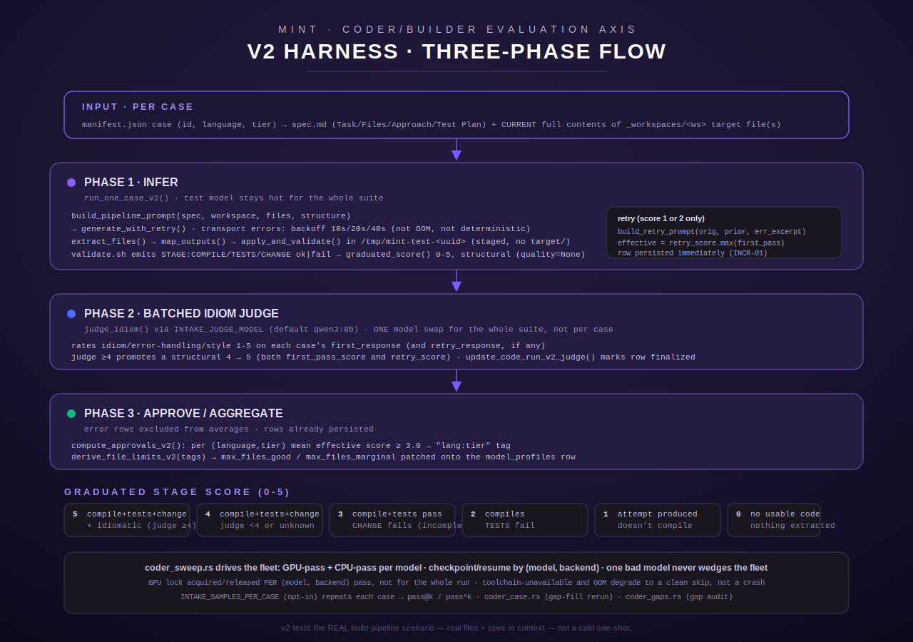

[← MINT overview](README.md)

# MINT Coder/Builder Evaluation Axis

The coder/builder axis is the part of the MINT model-intake harness that answers one
question: **when a model is asked to modify real project files inside a spec-driven build
pipeline, does the change actually compile, pass tests, and do what was asked?** It is one
of three independent evaluation axes MINT runs against a candidate model:

- **Coder/builder** (this page) — `code.rs` / `code_v2.rs` / `coder_sweep.rs` / `coder_case.rs`
  / `coder_gaps.rs`. Can the model implement a build-pipeline spec item correctly?
- **Agent** (`agent.rs`, not covered here) — tool-use / multi-step / instruction-adherence
  scenarios, a completely separate harness with its own scoring dimensions.
- **Assistant/personality** (the S84 assistant sweep, not covered here) — conversational
  and personality-fit profiling, unrelated to code correctness.

`code_languages_for`/`default_suites_for` in `mod.rs` route models to suites by purpose —
`"coder"`-named models get `[context, code]`, everyone else gets a lighter set — and pick
code-suite languages accordingly (coder models: `rust, typescript, python, bash, htmlcss`;
others: `python, bash`). See `src/intake/mod.rs:113-163`; the CLI/README pages document this
routing in more depth, so it is only summarized here.

This page is a deep-dive into the coder/builder axis specifically: the legacy v1 suite, the
v2 realistic-build-scenario harness that superseded it, the fleet-level sweep driver, the
ad hoc case-rerun and gap-audit tools, and the corpus that backs all of it.

## Table of contents

- [v1 vs v2: why the harness changed](#v1-vs-v2-why-the-harness-changed)
- [The v2 three-phase flow](#the-v2-three-phase-flow)
  - [Phase 1 — infer](#phase-1--infer)
  - [Phase 2 — batched idiom judge](#phase-2--batched-idiom-judge)
  - [Phase 3 — approve / aggregate](#phase-3--approve--aggregate)
- [The graduated 0-5 stage score](#the-graduated-0-5-stage-score)
- [pass@k / pass^k (multi-sample consistency)](#passk--passk-multi-sample-consistency)
- [The v2 corpus](#the-v2-corpus)
- [coder_sweep.rs — the fleet driver](#coder_sweeprs--the-fleet-driver)
- [coder_case.rs — ad hoc gap-fill rerun](#coder_casers--ad-hoc-gap-fill-rerun)
- [coder_gaps.rs — case-id gap audit](#coder_gapsrs--case-id-gap-audit)
- [Error and edge cases](#error-and-edge-cases)
- [Worked example](#worked-example)



## v1 vs v2: why the harness changed

### v1 — "cold one-shot" (`code.rs`)

The original code suite (S83 MINT-02) tests **cold one-shot generation from a task
description**: the model sees `task.md` plus the case's `input/` file(s) and is asked to
return the complete corrected file(s) in fenced code blocks (`build_prompt`,
`src/intake/code.rs:97-115`). The response is extracted (`extract_files`/
`extract_code_blocks`), mapped onto the case's declared input files
(`map_outputs_to_inputs`), materialized into a temp copy of the case directory, and run
through `validate.sh` (exit 0 = pass). A secondary model (`INTAKE_JUDGE_MODEL`, default
`qwen3:8b`) rates the output 1-5 (`judge_quality`/`parse_rating`,
`src/intake/code.rs:508-537`) — `code_quality_score`, `NULL` if the judge is unavailable.
Approval is per `(language, complexity)`: a pair passes when ≥3 of its (up to 4) task types
pass (`compute_approvals`, `src/intake/code.rs:546-563`).

The module doc for `code_v2.rs` states plainly why this was retired as the default:

> "The v1 suite (see `code.rs`) tested COLD one-shot generation from a task description —
> something no model in the build pipeline actually does, which is why every model scored
> 0-1." (`src/intake/code_v2.rs:3-5`)

Cold one-shot generation does not resemble what a model actually does inside the
build-pipeline: it never sees a spec-item's Task/Files/Approach/Test-Plan structure, never
sees the CURRENT full contents of the file(s) it is modifying, and gets no project
structure context. v1 is kept as an **additive, opt-in** suite (its rows are tagged
separately and never mixed with v2 rows) — it is not deleted, just no longer the default.

### v2 — realistic build-scenario harness (`code_v2.rs`), now the default

v2 tests the REAL pipeline scenario: "Here is a spec item (`## Task` / `## FILES` /
`## APPROACH` / `## TEST PLAN`) and the CURRENT FULL CONTENTS of the real file(s) it must
modify, plus project context. Output the COMPLETE modified file(s)." (`code_v2.rs:6-9`). It
adds a graduated 0-5 score (instead of v1's binary pass/fail), a **retry pass** when the
first attempt nearly works, and multi-sample support for pass@k/pass^k estimation.

The default is set in the `model_intake` MCP tool's `execute()`, not by an environment
variable — it is a plain JSON tool argument with a code-level default:

```rust
// src/intake/mod.rs:345-350
// Default to the realistic v2 harness; v1 stays available + additive.
let harness = args
    .get("code_harness")
    .and_then(|v| v.as_str())
    .map(|s| s.trim().to_lowercase())
    .unwrap_or_else(|| "v2".to_string());
```

Anything other than the literal string `"v1"` falls through to the v2 branch
(`src/intake/mod.rs:352,369`) — there is no separate `"v2"` match arm, "not v1" is
"is v2". The `code_harness` tool-argument enum is documented at `mod.rs:234-238` as
`["v1", "v2"]`, default `"v2"`.

## The v2 three-phase flow

`run_code_suite_v2_cases` (`src/intake/code_v2.rs:887-1095`) — the shared entry point behind
`run_code_suite_v2`, the fleet sweep, and the case-rerun tool — runs every selected case
through three sequential phases, iterating a flat `sampled: Vec<(&CaseV2, i16)>` list (one
entry per `(case, sample_index)` pair — see [pass@k](#passk--passk-multi-sample-consistency)
below for why sampling exists at all).

### Phase 1 — infer

`run_one_case_v2` (`code_v2.rs:567-740`) does the per-case work, called once per
`(case, sample_index)` pair with the **test model kept hot** the whole time — the idiom
judge is deliberately deferred to Phase 2 so the test model is never evicted from VRAM
mid-suite.

1. **Read spec + current files.** `case_dir/spec.md` (or the case's `spec` override) is read
   as the task text; `read_target_files` (`code_v2.rs:402-412`) reads each of the case's
   declared `files` from `_workspaces/<workspace>`. A file that does not yet exist is **not**
   an error — some spec items name files the model must *create from scratch* (the module
   doc calls out `ts-standard-t1` targeting `wx-ts/typed.ts` + `wx-ts/typed.test.ts`, neither
   of which exists on disk yet, HFIX-03). Only a missing **workspace directory** is treated as
   an infrastructure error.
2. **Build the prompt.** `build_pipeline_prompt(spec, workspace, files, structure)`
   (`code_v2.rs:180-228`) assembles: an instruction framing the model as "a senior engineer
   working in the lumina-constellation project", a `PROJECT CONTEXT` block naming the
   workspace and a `workspace_structure()`-derived file listing (sorted relative paths,
   `target/`/`node_modules` filtered, capped at 40 entries), the `SPEC ITEM` verbatim, the
   `CURRENT FILE CONTENTS` of every existing target file (or an explicit "every file named in
   the SPEC ITEM's FILES section is new; create it from scratch" note when there are none),
   and an `OUTPUT FORMAT` instruction requiring the complete final contents of every changed
   file, with the file path as a first-line comment inside its code block (`//` for
   Rust/TS/C, `#` for Python/Bash/TOML) — no diffs, no `// ... unchanged` abbreviations.
3. **Generate, with bounded transport retry.** `generate_with_retry` (`code_v2.rs:530-560`)
   calls `context::generate` and, on a `context::ErrorClass::Transport` error only (not OOM,
   not a deterministic/model-level failure), retries up to 3 times with escalating backoff
   `TRANSPORT_RETRY_BACKOFF_SECS = [10, 20, 40]` seconds (`code_v2.rs:524`) — sized for the
   sustained, multi-minute connectivity windows actually observed in production (HFIX-04), not
   a single lucky 10-second retry.
4. **Toolchain gate.** If `required_toolchain(language)` names a binary (rust→cargo,
   typescript→node, java→javac, go→go) that isn't on `PATH`, the case is skipped with
   `error = "toolchain unavailable: <lang> (needs <bin>)"` and no score is recorded.
5. **Extract + map outputs.** `extract_files` (shared with v1, `code.rs:121-144`) pulls
   fenced code blocks and any preceding `// FILE:`/`# FILE:`/`<!-- FILE:` marker;
   `map_outputs` (`code_v2.rs:270-301`) matches extracted blocks onto the case's declared
   `files` by basename/suffix, falling back to "largest block → the one declared file" for an
   unmarked single-file case. `row.well_formed` records whether anything was successfully
   mapped — this is recorded **before** scoring so a score of 0 from "nothing extracted"
   (`well_formed=false`) is distinguishable from "extracted but wrong" (`well_formed=true`,
   score still 0).
6. **Heuristic vuln scan.** `crate::intake::vuln_scan::scan_outputs` runs over the
   materialized output text and stores a finding count in `row.vuln_finding_count` — this is
   explicitly a **non-fatal, separate** signal from the correctness score; a finding never
   changes `first_pass_score`/`effective`. `None` when nothing was produced or the language
   is unsupported by the heuristic scanner; `Some(0)` for a clean scan.
7. **Validate.** `apply_and_validate` (`code_v2.rs:475-514`) stages the workspace SOURCE ONLY
   (no `target/`, no `node_modules`) into a fresh `/tmp/mint-test-<uuid>` directory via
   `stage_workspace`, writes the mapped outputs over it, and runs the case's `validate.sh`
   with `MINT_WORK` (the staged copy) and `MINT_TARGET_CACHE` (a persistent, pre-warmed
   build-cache dir so Rust/TS builds are incremental — seconds, not minutes) set in its
   environment. `stage_workspace` also creates a self-referential symlink
   (`<workspace-name> -> .`) inside the staged dir so validators written either root-relative
   (Rust/Python/Bash) or workspace-subdir-relative (TypeScript) resolve the same files.
8. **Parse stages, compute the structural score.** `parse_stages` (`code_v2.rs:317-332`)
   reads `STAGE:COMPILE ok|fail`, `STAGE:TESTS ok|fail`, `STAGE:CHANGE ok|fail`, and
   `TOOLCHAIN:missing <bin>` lines from the validator's combined stdout+stderr.
   `graduated_score(stages, quality=None, produced=true)` (`code_v2.rs:345-371`) computes the
   **structural** score (judge quality not yet known) — see the score table below. An exit
   code of `3` means the validator self-reported a missing toolchain post-hoc; that case is
   recorded as a toolchain skip, same as the pre-flight gate in step 4.
9. **Retry, only for scores 1-2.** `should_retry(first_pass)` (`code_v2.rs:375-377`) is true
   only for scores 1 and 2 — "compiles-ish but wrong" or "doesn't compile but recognizable".
   When true, `last_error_excerpt` re-runs the validator to capture the tail (last 60 lines,
   capped at 4000 chars — where compiler errors usually live) of its output, and
   `build_retry_prompt(original_prompt, prior_output, error)` (`code_v2.rs:762-775`) asks the
   model to fix the specific failure, reusing the original spec/files/instructions plus the
   model's own prior attempt and the captured error. The retry is scored the same way; if it
   ran and produced output, `row.retry_score` is set and `effective_score = retry.max(first_pass)`
   — the retry can only help, never hurt, the effective score. Whichever attempt scored higher
   also supplies the `compiles`/`tests_pass`/`change_correct` flags stored on the row.

Every case's row is persisted to `code_profile_runs` **immediately after Phase 1 finishes for
that case** (`storage::insert_code_run_v2`), not batched to the end of the suite — this is
"INCR-01": a ~40-case suite at real generation latency can legitimately run 20-40+ minutes,
and writing rows as they complete keeps row-age-based liveness checks (e.g. a sweep-host
watchdog) from mistaking a slow-but-healthy run for a jammed one and killing it mid-suite.

### Phase 2 — batched idiom judge

After every case in the sample set has run Phase 1, Phase 2 iterates the results again and,
for every case that produced a `first_response` (and `retry_response`, if a retry ran), calls
`judge_idiom` (`code_v2.rs:777-793`) — the SAME idiom-rating prompt shape as v1's
`judge_quality`, using `INTAKE_JUDGE_MODEL` (default `qwen3:8b`), asking for a single 1-5
integer rating of "IDIOM, ERROR-HANDLING, and STYLE combined". Running the judge here, in one
batched pass over every case, evicts the **judge** model from VRAM exactly once for the whole
suite instead of once (or twice, with retries) per case — the test model was already evicted
once at the start of Phase 2 and reloaded once at the start of Phase 3's next suite, not
per-case.

The judge score can only **promote**, never demote: a structural score of exactly 4 is bumped
to 5 when the judge rates the code ≥4.0 (`code_v2.rs:997-1002`, applied independently to
`first_pass_score` and, if a retry ran, `retry_score`). `cr.effective_score` is then
recomputed as `retry_score.max(first_pass_score)` with the judge-promoted values.
`storage::update_code_run_v2_judge` is called **unconditionally for every case** — including
ones that never produced code and so were never judged — because this is the one call that
sets `finalized = true` on the row; without it, `coder_gaps.rs`'s gap audit would treat an
un-judged (but genuinely complete, score-0) case as forever incomplete. A checkpoint-write
failure here is recorded as `row.error` (if not already set) and logged, but never aborts the
rest of the suite.

### Phase 3 — approve / aggregate

Phase 3 walks the finalized results once more to build the suite's `CodeV2Outcome` summary
and the approval tags:

- Rows with `error = None` are "scored" (a legitimate 0 counts) and feed
  `first_sum`/`eff_sum`/`first_n` for the suite averages, and `(language, tier,
  effective_score)` tuples for `compute_approvals_v2`.
- Rows with a `toolchain unavailable...` error are neither scored nor counted as an
  infrastructure error — recorded only in `toolchain_skipped`.
- Any other error (an infrastructure/inference failure that survived the Phase-1 transport
  retry) increments `errors` and is excluded from every average.
- `compute_approvals_v2(results)` (`code_v2.rs:802-817`): groups by `(language.to_lowercase(),
  tier.to_lowercase())`, computes the mean `effective_score` per group, and emits a
  `"lang:tier"` tag for any group whose mean is **≥ 3.0**. Tags are sorted and deduped.
- `derive_file_limits_v2(approved)` (`code_v2.rs:1161-1179`) maps each approved tier to a
  file-count band (`blitz`→1, `standard`→4, `deep`→8, unknown→1) and takes the largest band
  across all approved tags as `max_files_good`; `max_files_marginal` is `(max_files_good +
  4).min(12)`. Both are patched onto the model's `model_profiles` row via
  `storage::update_op_code`.

The final `CodeV2Outcome` (`code_v2.rs:823-838`) — `cases_run`, `avg_first_pass`,
`avg_effective`, `approved`, `toolchain_skipped`, `scored`, `errors`, and a `per_case: Vec<(id,
first_pass, Option<retry>)>` list for the smoke summary — has **no `Serialize` derive**; it is
never returned to a caller as JSON. It is consumed and turned into a plain formatted text
block by whichever caller invoked it (see [Worked example](#worked-example) below).

## The graduated 0-5 stage score

`graduated_score(stages, quality, produced_code)` (`code_v2.rs:345-371`) computes exactly this
(quoted from its own doc comment, which is what the code implements — no invented rubric):

| Score | Condition (exactly as computed) |
|---|---|
| **5** | compiles + tests pass + change correct + idiomatic (judge ≥ 4) |
| **4** | compiles + tests pass + change correct (judge < 4 or unknown) |
| **3** | compiles + existing/model tests pass but change incomplete (CHANGE fail) |
| **2** | compiles but tests fail / partially correct |
| **1** | doesn't compile but a recognizable attempt was produced |
| **0** | no usable code / refusal / nothing extracted (`produced_code = false`) |

`produced_code` gates everything: if no output file was ever mapped from the model's response
(`map_outputs` returned empty), the score is unconditionally 0 regardless of any stage
markers. Otherwise, `stages.compile == Some(false)` or `None` (never reached compile) yields
1; `stages.compile == Some(true)` branches on `tests`/`change`: both `Some(true)` → 4 or 5
depending on the judge; tests-ok-but-change-not-ok → 3; anything else (tests failed, or tests
unknown while compile succeeded) → 2.

**First-pass vs effective score.** `row.first_pass_score` is always the Phase 1 first
attempt's score (after the Phase 2 judge promotion). `effective_score` — what
`compute_approvals_v2` and the reported `avg_effective` actually use — is
`retry_score.max(first_pass_score)` when a retry ran and produced output, else just
`first_pass_score`. The `model_intake` tool's text output surfaces both explicitly per case
(`first_pass=<n> retry=<m>`) and reports both suite-level averages
(`avg first_pass: {:.2} | avg effective (incl retry): {:.2}`, `mod.rs:373`).

## pass@k / pass^k (multi-sample consistency)

Setting `INTAKE_SAMPLES_PER_CASE` (read by `samples_per_case()`, `code_v2.rs:1102-1108`) to an
integer `> 1` repeats every selected case that many times, each repeat carrying its own
0-based `sample_index` and its own `code_profile_runs` row (same `case_id`, incrementing
`sample_index`) — this is strictly **opt-in**: unset, blank, non-numeric, or `< 1` all
collapse to `1`, so a production sweep never silently multiplies its own runtime.

Two independent estimators are then computable over the resulting `n` samples with `c`
successes:

- **`pass_at_k(n, c, k)`** (`code_v2.rs:1122-1139`) — the unbiased estimator from the
  Codex/HumanEval paper: the probability that at least one of `k` samples drawn without
  replacement from `n` (of which `c` succeeded) is a success, computed via the numerically
  stable product form `1 - Π_{i=n-c+1}^{n} (1 - k/i)` (not the biased shortcut `1 - (1 -
  c/n)^k`). Returns `None` when `k > n` (undefined) or `k = 0`; defensively clamps `c` to
  `n` rather than panicking on the impossible `c > n`.
- **`pass_hat_k(n, c, k)`** (`code_v2.rs:1152-1158`) — the "flakiness" signal: a plug-in point
  estimate `(c/n)^k` of the probability that **all** `k` samples succeed. A model with high
  `pass@k` but low `pass^k` is capable of solving a case but not reliably — it can, but not
  dependably. Same `k > n` / `k = 0` → `None` domain as `pass_at_k`, same defensive clamp.

Both are monotone in `k` (pass@k non-decreasing, pass^k non-increasing) and agree at `k=1`
(`c/n` for both) — verified directly by the unit tests (`code_v2.rs:1559-1621`) against known
hand-computed values (e.g. the classic n=10,c=3,k=5 Codex-paper example, pass@5≈0.9167).

## The v2 corpus

The v2 corpus (`INTAKE_CORPUS_V2_DIR`, no compiled-in default — must be set explicitly, fails
clean with `ToolError::NotConfigured` when unset) is laid out as:

```
manifest.json                       # array of CaseV2 entries
_workspaces/<ws>/                   # standalone, dependency-minimal real-derived crates
<language>/<tier>/<case-id>/spec.md      # the build-pipeline spec item
<language>/<tier>/<case-id>/validate.sh  # stage-marked validator
```

A case targets one shared `_workspaces/<ws>` crate/module and modifies one or more `files`
within it; several cases commonly reuse the same workspace under different tasks, so
dependency compilation is amortized across the pre-warmed `MINT_TARGET_CACHE`.

`CaseV2` (`code_v2.rs:82-104`) fields: `id`, `language`, `tier` (`blitz | standard | deep`),
`spec` (default `spec.md`), `validate` (default `validate.sh`), `dir` (case directory relative
to the corpus root), `workspace`, `files` (workspace-relative paths the model must output
complete), `timeout_s` (optional per-case override), `task_type` (optional; defaults to
`"build_modify"` when absent, `code_v2.rs:577`).

**Timeouts.** `tier_default_timeout` (`code_v2.rs:127-129`) gives blitz=60s, standard=120s,
deep=300s, anything else=120s. `CaseV2::timeout(model_name)` (`code_v2.rs:109-122`) layers an
**additive** reload-cost allowance on top for large models
(`super::timeouts::reload_adjusted_timeout_secs`) — this compensates for a separate Ollama
runner-reload cost the tier table was never designed to capture; it does not change what the
tier/override means for task difficulty.

**Case selection.** `filter_by_language(cases, languages)` (`code_v2.rs:142-152`) is a
case-insensitive filter; an empty `languages` slice means "every case in the corpus".
`filter_by_ids(cases, ids)` (`code_v2.rs:160-170`) additionally narrows to an explicit id
list (used only by `coder_case`'s ad hoc rerun) — `None`/empty means "no id narrowing",
unknown ids are silently absent from the result (the caller reports which requested ids
weren't found, not this pure filter).

**A concrete example from the repo's in-tree corpus additions**
(`intake-corpus-v2/go/blitz/g2/`, a Java/Go extension staged for review — see
`intake-corpus-v2/README-java-go.md`; the operational corpus itself is deployed data, not
git-tracked): case `go-blitz-g2` targets workspace `wx-go`, file `validate.go`, spec asks for
a `ClampPercent(s string) (float64, error)` function. Its `validate.sh` follows the stage
contract exactly: `go build ./...` → `STAGE:COMPILE ok|fail`; `go test ./...` → `STAGE:TESTS
ok|fail`; then it writes a hidden `mint_change_test.go` containing a `TestMintChange` the
model never saw, runs `go test -run TestMintChange ./...`, and emits `STAGE:CHANGE ok|fail`
based on that — cleaning up the injected test file before exiting either way. Missing `go` on
`PATH` emits `TOOLCHAIN:missing go` and exits 3.

The larger, deployed manifest referenced by the crate's own integration test
(`code_v2.rs:1281-1311`, `repo_corpus_manifest_is_valid`) is expected to contain 40 cases:
16 rust, 9 python, 9 typescript, 6 bash — that test asserts every case's `spec`, `validate`,
and `_workspaces/<workspace>` actually exist on disk, and that no declared `files` entry
carries a redundant workspace-name prefix. **Ambiguity note:** that manifest (and the 40-case
count) lives in the deployed corpus tree, not in this repo checkout at the time of writing —
the in-repo `intake-corpus-v2/` directory here contains only the reviewable Java/Go additions
(`manifest-additions.json`, 10 rows) plus their workspaces, per `README-java-go.md`'s own
statement that "the operational corpus lives ONLY as deployed data ... it is not git-tracked
in this repo."

## coder_sweep.rs — the fleet driver

`coder_sweep::run(langs, case_limit, mem_config)` (`coder_sweep.rs:719-805`) drives the v2
suite across an entire model fleet, sequentially, for both a GPU pass and a CPU pass per
model. It reuses the GPU-authority and durability primitives documented in their own pages
(`gpu_authority.rs`, `checkpoint.rs`) — this section describes only how the coder sweep *uses*
them, not their internals.

**Fleet loading.** The fleet comes from a JSON nominations file under `INTAKE_STAGING_DIR`,
preferring a coder-specific `coder-nominations.json` and falling back to the shared
`nominations.json` (`nominations_path`, `coder_sweep.rs:100-113`) — the same `Nominations`
JSON shape the assistant sweep uses (`{id, size_b, gfx1151_class, acquisition, backends?,
...}`).

**GPU vs CPU passes.** For each nomination, `run_fleet` iterates `nom.backend_strategy()` —
by default both a GPU pass and a CPU pass, GPU first; a nomination can restrict itself to
`backends: ["cpu"]` to skip the GPU pass entirely. A GPU-gfx1151-specific routing fix
(`coder_sweep.rs:576-583`) always serves GPU passes via the always-on `ollama` backend
(ollama-rocm), never `llama-server`/`llama-gpu`, because `llama-gpu` wedges on
mixture-of-experts models on this Vulkan stack; the CPU pass routes to `ollama-cpu`.

**Pre-flight VRAM skip.** `pre_skip_reason(nomination, backend)` (`coder_sweep.rs:214-223`) is
pure and skips a GPU pass (never a CPU pass — CPU has no VRAM ceiling) when
`nomination.exceeds_vram()` against `INTAKE_VRAM_CEILING_GB`, recording a clear
`"over VRAM ceiling on GPU (<footprint>GB footprint > <ceiling>GB ceiling)"` reason — this is
the "big-model wedge guard".

**GPU-lock acquire/release per pass.** Unlike an earlier design that held one exclusive GPU
lock for the whole multi-day fleet run (starving the concurrent assistant sweep completely —
confirmed in production, 2+ days with zero assistant rows), the sweep now acquires and
releases the SAME exclusive `GpuLock` **once per `(model, backend)` pass**
(`run_fleet`, `coder_sweep.rs:555-637`), pausing for `gpu_lock.release_pause()` between passes
that genuinely touched the GPU (never before the very first pass, never for a resumed or
pre-skipped one) so the other sweep gets a real window to acquire it. A per-pass reacquire
failure is recorded as a `Skipped("GPU reacquire failed: ...")` outcome, not an error — the
fleet continues to the next model. A mid-unit safety valve (`gpu_lock.check_max_hold()`,
checked after each case inside `run_code_suite_v2_cases`) can also yield the lock **mid-pass**
if a single model's suite runs unusually long (e.g. a high transport-retry rate), so no single
model can monopolize the GPU for hours even within its own pass.

**Checkpoint/resume.** `CodeCheckpointKey { model_id, backend_tag }` is the resume unit — a
JSON-lines file-backed ledger (`FileCheckpoint<CodeCheckpointKey>`,
`INTAKE_STAGING_DIR/coder-sweep-checkpoint.json`) marked **after** that pass's rows are
durably persisted (`coder_sweep.rs:521-525`), never before — so a crash mid-pass never marks a
pass done that didn't actually finish. A `(model, backend)` already in the checkpoint's `done`
set is resumed (skipped without touching the model at all) on the next invocation — cheap,
GPU-free, checked before any lock acquisition (`coder_sweep.rs:592-595`).

**Orphaned-row reconciliation.** Before starting a fresh attempt at a `(model, backend,
mem_config)`, the sweep best-effort deletes any unfinalized `code_profile_runs` rows left by
a prior crashed/killed attempt at that exact combination
(`storage::delete_unfinalized_code_runs_v2`, `coder_sweep.rs:461-488`) — a failure here is
logged and never blocks the fresh attempt.

**Skip-with-reason, never a hard failure.** `run_one_backend` (`coder_sweep.rs:392-543`) never
returns `Err` for a per-model problem: an unavailable model (HFIX-05 pre-flight — checked via
`driver.model_available()` before spending any case-row budget on a 404), a profile-row
create failure, or a suite that errors mid-run (hang/OOM/etc.) all become a `Skipped(reason)`
outcome, and the fleet loop continues to the next `(model, backend)`. `Err` is reserved
exclusively for a checkpoint-write **durability** failure — a bug that must surface, not be
silently swallowed.

**Env vars this driver reads** (names only): `INTAKE_DATABASE_URL`/`DATABASE_URL`,
`INTAKE_STAGING_DIR`, `MODEL_REGISTRY_PATH`, `OLLAMA_URL`/`_BASE_URL`/`_CPU_URL`,
`INTAKE_CORPUS_V2_DIR`, `INTAKE_CODE_LANGS`, `INTAKE_CODE_CASE_LIMIT`, `SWEEP_MEM_CONFIG`,
`INTAKE_VRAM_CEILING_GB`, `INTAKE_CODER_ACQUIRE_MAX_WAIT_SECS` (distinct from the assistant
sweep's own acquire-wait env var, so each binary's tuning knob is unambiguous).

## coder_case.rs — ad hoc gap-fill rerun

`coder_case::run(model_id, case_ids, backend, langs, mem_config)`
(`coder_case.rs:100-219`) reruns an **explicit** `(model, backend, case_ids)` slice directly,
bypassing the fleet driver's checkpoint entirely — no checkpoint is read or written, and
every invocation runs the requested cases fresh, appending new rows (old rows for the same
case id are never overwritten). This is the tool for filling a specific gap — a handful of
cases that hard-failed on a now-fixed transient error, or a manifest addition — without
re-running a model's entire 40-200 case suite.

It requires `INTAKE_CASE_MODEL` and `INTAKE_CASE_IDS` (comma-separated case ids from the v2
manifest's `id` field) unless the caller passes them directly; `INTAKE_CASE_BACKEND`
(`"cpu"` case-insensitively, else `"gpu"`) picks the backend, mapped to the same
`ollama`/`ollama-cpu` override strings the fleet sweep uses. It acquires its OWN exclusive
`gpu_authority::ExclusiveGuard` under a distinct holder label (`GPU_HOLDER =
"intake_coder_case"`) — a different label than the fleet sweep's — so it correctly refuses to
start while the sweep holds the GPU rather than racing it, and passes `None` for the fleet's
mid-unit `GpuLock` safety valve (its own bounded rerun doesn't need it). On completion it
prints a summary to **stderr** (`eprintln!`, not a returned tool value — this is a CLI/library
entry point, not a registered MCP tool) and warns explicitly if fewer cases ran than were
requested (likely a typo'd case id or a stale local manifest).

## coder_gaps.rs — case-id gap audit

`coder_gaps::run(model_id, mem_config, langs)` (`coder_gaps.rs:79-200`) is the companion
read-only audit: which corpus case ids does a model have **no valid data for**, under a given
`mem_config`? It scopes the corpus to the requested languages, then queries
`code_profile_runs` for every distinct `case_id` that has at least one row satisfying the
"valid, complete" predicate:

```
case_id IS NOT NULL AND error IS NULL AND finalized
```

(`is_valid_complete_row`, `coder_gaps.rs:53-55`, mirrored in the two literal SQL constants at
`coder_gaps.rs:35-44`). The `finalized` clause specifically excludes a Phase-1-only row — one
where inference succeeded (so `error IS NULL`) but the process was killed before Phase 2/3
ever finalized it — from being wrongly counted as "done"; `finalized` defaults to `true` for
every row written before that column existed, so this changes nothing for legacy data.

The audit also counts (never hides) rows with `case_id IS NULL` — ones written before the
`case_id` column existed — and reports that count explicitly as a caveat: this tool cannot see
into those rows, so a "missing" verdict is a **lower bound**, not an exact answer, until
legacy rows age out.

Output (to stdout) is a summary line followed by a machine-parseable case-id list:

```
model=<id> mem_config=<mc|(NULL/carveout)> corpus_cases=<n> valid=<n> missing=<n>
INTAKE_CASE_IDS=<id1>,<id2>,...
```

That `INTAKE_CASE_IDS=...` line is deliberately formatted to be copy-pasted straight into
`coder_case`'s own `INTAKE_CASE_IDS` env var (or `mint case --ids`) to close the gap. When
there is no gap, it prints `"no gap — every corpus case in scope has at least one valid
row."` instead.

## Error and edge cases

Every one of these is handled explicitly in the code (not inferred):

- **Toolchain unavailable** (rust needs `cargo`, typescript needs `node`, java needs `javac`,
  go needs `go`; python/bash/cpp/sql/htmlcss/config have no gate) — checked both pre-flight
  (`required_toolchain`/`have_tool`) and post-hoc via the validator's own `TOOLCHAIN:missing
  <bin>` line (exit code 3). Recorded as `error = "toolchain unavailable: ..."`, **not**
  scored, **not** counted as an infrastructure error — tallied separately in
  `toolchain_skipped`.
- **OOM.** `context::generate`'s outcome carries an explicit `oom` flag; when set, the row is
  marked `row.oom = true` and the case returns immediately with no score.
- **Transport errors** (connection refused, timed out, unexpected EOF, "error sending
  request") retry up to 3 times with escalating 10/20/40s backoff; anything classified as a
  deterministic/model-level error (e.g. "model not found", "invalid prompt", "out of memory")
  is never retried.
- **Empty/unmatched corpus selection.** `run_code_suite_v2_cases` returns
  `ToolError::NotConfigured("no v2 code cases match the requested languages/case_ids")` when
  the filtered case list is empty — before any client is built or any DB pool touched.
- **Unresolved `INTAKE_CORPUS_V2_DIR`/`INTAKE_TARGET_CACHE`.** No compiled-in default for
  either (a deliberate 2026-07 PII-remediation choice, per both `corpus_v2_dir()`'s and
  `target_cache_dir()`'s doc comments) — an unset corpus dir fails clean with
  `ToolError::NotConfigured` rather than silently pointing at a real internal host path.
- **No usable code extracted.** Not an infrastructure error — a legitimate score-0 row with
  `error = NULL`, so it is counted in the averages (as a 0), unlike a genuine
  toolchain/transport/OOM failure.
- **Model not present in the resolved backend's registry** (fleet sweep only, HFIX-05):
  checked once, pre-flight, per `(model, backend)` pass — avoids wasting up to ~200
  per-case rows on a repeated 404 for a model that was never pulled on that backend. Recorded
  as a clean `Skipped` outcome.
- **Orphaned staging directories.** `sweep_stale_workspaces()` (`code_v2.rs:440-448`) runs
  once at suite start and best-effort removes any `mint-test-*` temp dirs left behind by a
  crashed validator run, so a long-running fleet sweep can't slowly accrete disk usage under
  the temp filesystem.
- **Checkpoint-write failure.** The one case that IS propagated as a hard `Err` out of the
  fleet loop (a durability bug, not a per-model failure) — everything else in
  `run_one_backend` degrades to a `Skipped` outcome instead.

## Worked example

The `model_intake` MCP tool (`src/intake/mod.rs`, tool name `"model_intake"`) is the primary
caller of the v2 suite for a single ad hoc model check; its `execute()` builds a **plain text**
response (no JSON schema for the result — the returned `CodeV2Outcome` has no `Serialize`
derive), assembled exactly like this for the code suite section
(`src/intake/mod.rs:369-395`):

```
=== Code suite (v2: realistic build scenario) ===
languages: rust, typescript, python, bash, htmlcss
cases run: 40 (37 scored, 1 errored)
avg first_pass: 3.62 | avg effective (incl retry): 3.94
approved (lang:tier): python:blitz, python:standard, rust:blitz, rust:standard, typescript:blitz
  rust-blitz-a1: first_pass=5
  rust-blitz-a2: first_pass=2 retry=4
  rust-standard-b1: first_pass=3
  ...
toolchain unavailable for: go, java
```

(Values above illustrate the real formatting; the specific numbers are a realistic
illustration, not a captured production run.) A `case_limit` argument (smoke runs) caps how
many cases are pulled from the manifest before inference starts; a `languages` argument
overrides the purpose-based default (`code_languages_for(model_name)`); `code_harness: "v1"`
switches to the legacy suite, printing `"=== Code suite (v1: cold one-shot) ==="` instead with
`cases run: N (M passed)` / `approved (lang:complexity): ...` framing (the v1 struct has no
graduated score or retry, so those lines are absent).

For a fleet-wide run, `mint sweep coder` (or the legacy `intake_coder_sweep` binary — both
share `coder_sweep::run`) is invoked with clap flags that fall back to the env vars documented
above when omitted:

```
mint sweep coder --langs rust,python --case-limit 0 --mem-config dynamic_gtt
```

(`--case-limit 0` is explicitly normalized to "no limit" — the same convention as leaving
`INTAKE_CODE_CASE_LIMIT` unset, so the CLI flag and the env var can never drift apart,
`normalize_case_limit`, `coder_sweep.rs:70-72`.) Its end-of-run report — printed by
`print_report` (`coder_sweep.rs:646-695`) to stderr — looks like:

```
coder sweep complete: 6 backend-passes profiled, 2 resumed, 1 skipped (rows persisted to the intake DB)
MODEL qwen3-coder:30b backend=gpu PROFILED cases=40 scored=39 errors=1 avg_first_pass=4.05 avg_effective=4.31 approved=[python:blitz, python:standard, rust:blitz, rust:standard, typescript:blitz]
MODEL qwen3-coder:30b backend=cpu RESUMED (already checkpointed)
MODEL qwen2.5-coder:14b-instruct backend=gpu SKIPPED: over VRAM ceiling on GPU (28GB footprint > 96GB ceiling)
```

(Illustrative — the exact per-model numbers depend on the fleet's live nominations file and
are not fabricated from a real run in this doc.) For a targeted gap-fill after fixing a
transient issue: `mint gaps --model qwen3-coder:30b` prints
`INTAKE_CASE_IDS=rust-standard-b7,typescript-blitz-t3`, which is then passed straight to
`mint case --model qwen3-coder:30b --ids rust-standard-b7,typescript-blitz-t3` to close
exactly those two gaps without re-running the model's full 40-case suite.
