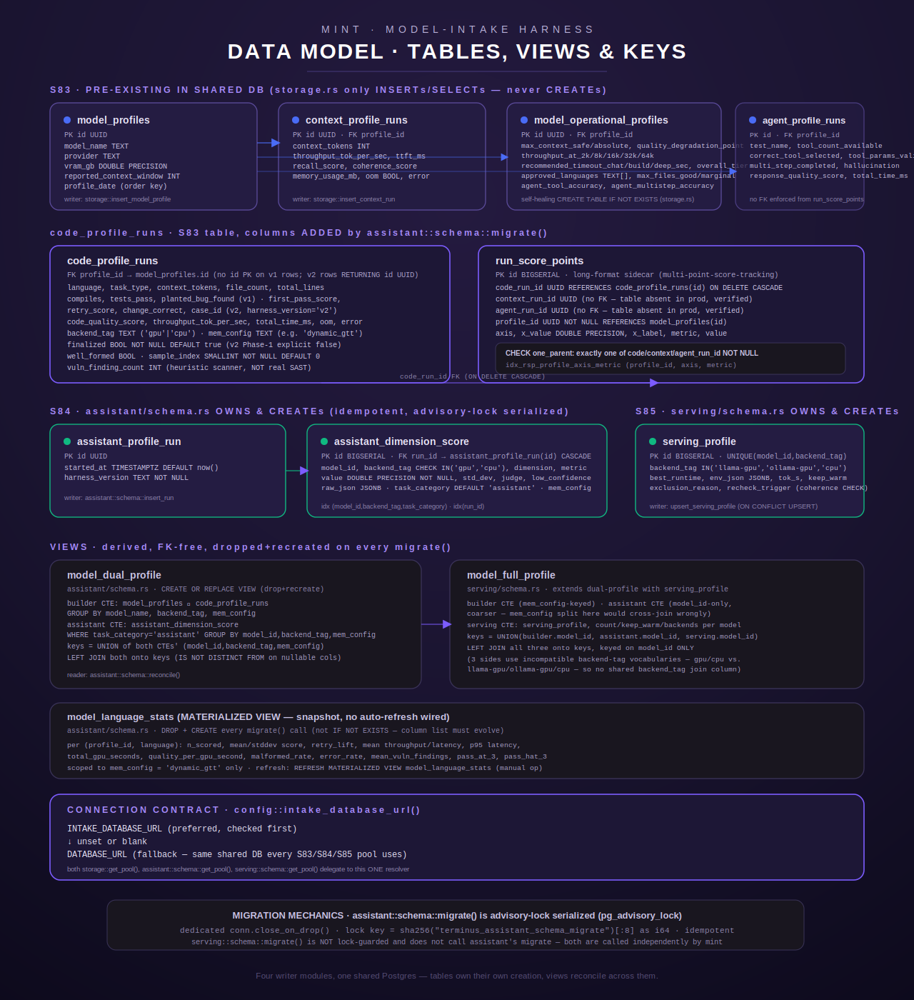

[← MINT overview](README.md)

# MINT data model — tables, views &amp; the env-var surface

MINT's Postgres footprint spans three source modules that each own a different slice of the
schema, plus one legacy module that only reads/writes tables it does not create. This page is
the canonical schema reference: every table's real columns, every view's real join logic, the
`INTAKE_DATABASE_URL`/`DATABASE_URL` connection contract, migration mechanics, and the complete
`INTAKE_*`/`MINT_*`/`JUDGE_*` env-var surface (names and purposes only — never values).

For the *runtime behavior* of the systems that write these tables, see
[coder-eval.md](coder-eval.md) (the v1/v2 code suites that write `code_profile_runs`),
[assistant-eval.md](assistant-eval.md) (the dimension-scoring harness that writes
`assistant_dimension_score`), [serving-profiles.md](serving-profiles.md) (the runtime-selection
harness that writes `serving_profile`), and [gpu-authority.md](gpu-authority.md) /
[durability.md](durability.md) (the exclusive-lock and crash-recovery machinery around all of
the above). This page only covers what's stored and how — not why a given number ended up in a
column.



## Module ownership at a glance

| Source module | What it owns | Creates tables? |
|---|---|---|
| `src/intake/storage.rs` | S83 builder-side write/read helpers | **No** — its own header comment states "tables already exist in the shared DB … DO NOT create them here." The one exception is `model_operational_profiles`, self-healed via `CREATE TABLE IF NOT EXISTS` inside `ensure_operational_profile` (`src/intake/storage.rs:622-681`) after it was found missing on at least one deployed DB (S86 / ORC-297). |
| `src/intake/assistant/schema.rs` | S84 assistant-dimension schema | **Yes** — `assistant_profile_run`, `assistant_dimension_score`, `run_score_points`, the `model_language_stats` materialized view, the `model_dual_profile` view, *and* several `ALTER TABLE code_profile_runs ADD COLUMN IF NOT EXISTS` statements that extend the S83 table it doesn't otherwise own. |
| `src/intake/serving/schema.rs` | S85 serving-profile schema | **Yes** — `serving_profile` and the `model_full_profile` view. |
| `src/bin/mint.rs` | Unified CLI front door | Calls the migrate functions above at startup for most subcommands (see [cli.md](cli.md) — `needs_schema_migrate()`, `src/bin/mint.rs:232-249`); owns no schema itself. |

## Connection contract: `INTAKE_DATABASE_URL` → `DATABASE_URL`

Every `get_pool()` in the intake subsystem — `storage::get_pool()` (`src/intake/storage.rs:28-37`),
`assistant::schema::get_pool()` (`src/intake/assistant/schema.rs:75-86`), and
`serving::schema::get_pool()` (`src/intake/serving/schema.rs:37-48`) — delegates to the exact
same resolver, `config::intake_database_url()`:

```rust
// src/config.rs:103-105
pub fn intake_database_url() -> Option<String> {
    env_nonempty("INTAKE_DATABASE_URL").or_else(|| env_nonempty("DATABASE_URL"))
}
```

Precedence is strict and verified against the code, not inferred:

1. `INTAKE_DATABASE_URL`, if set and non-blank after trimming, wins outright.
2. Otherwise `DATABASE_URL` (the same shared-DB variable S83's original tables were provisioned
   against) is used.
3. If neither resolves to a non-blank value, `get_pool()` returns
   `Err(ToolError::NotConfigured(...))` with a message naming both env vars — there is no
   compiled-in host/URL fallback.

`storage.rs`'s doc comment (`src/intake/storage.rs:20-27`) is explicit that this precedence was a
*fix*: before it, `storage::get_pool()` read `DATABASE_URL` only, so a host with **only**
`INTAKE_DATABASE_URL` set (no `DATABASE_URL`) would silently fail every S83 write/read while
`assistant::schema`'s callers — on the exact same DB — connected fine. All three modules now
share the one resolver, so that divergence cannot recur.

## Tables

### `model_profiles` (S83, pre-existing)

One row per intake run's parent model. Never created by this codebase — `storage.rs` only
inserts and selects.

| Column | Type | Notes |
|---|---|---|
| `id` | `UUID` | Primary key, generated client-side (`Uuid::new_v4()`) before insert. |
| `model_name` | — | The registry key; byte-identical to the `model_id` used everywhere else in this subsystem (assistant, serving). |
| `provider` | — | e.g. the serving provider string passed at insert time. |
| `vram_gb` | `DOUBLE PRECISION`, nullable | Reported/measured VRAM footprint. |
| `reported_context_window` | `INTEGER`, nullable | Model card's advertised context length. |
| `profile_date` | — | Not bound explicitly by `insert_model_profile`; used as the `ORDER BY ... DESC` key in `read_latest_profile` (`src/intake/storage.rs:757-758`), so it is DB-defaulted (likely a timestamp with a `DEFAULT now()`-style clause) — the exact column definition lives outside this codebase's migrations since the table pre-exists; not guessed further here. |

Writer/reader: `storage::insert_model_profile` (`src/intake/storage.rs:72-94`),
`storage::read_latest_profile` (`src/intake/storage.rs:751-833`).

### `context_profile_runs` (S83, pre-existing)

One row per measured context-length tier for a `model_profiles` row.

| Column | Type | Notes |
|---|---|---|
| `id` | `UUID` | Returned by `RETURNING id` on insert (`src/intake/storage.rs:107-112`) so a caller can attach `run_score_points` rows via `ScorePointParent::Context`. |
| `profile_id` | — | FK to `model_profiles.id` (soft — no `REFERENCES` visible from this codebase since the table pre-exists). |
| `context_tokens` | `INTEGER` | The tier's context size. |
| `throughput_tok_per_sec` | `DOUBLE PRECISION`, nullable | |
| `ttft_ms` | `INTEGER`, nullable | Time-to-first-token. |
| `total_time_ms` | `INTEGER`, nullable | |
| `recall_score` | `INTEGER`, nullable | |
| `coherence_score` | `DOUBLE PRECISION`, nullable | |
| `memory_usage_mb` | `INTEGER`, nullable | |
| `oom` | `BOOLEAN` | |
| `error` | — nullable | |

Writer: `storage::insert_context_run` (`src/intake/storage.rs:102-128`). Reader:
`storage::read_latest_profile`'s tier query (`src/intake/storage.rs:804-812`), ordered by
`context_tokens ASC`.

**Verified absence**: a code comment in `assistant/schema.rs` (`src/intake/assistant/schema.rs:411-414`)
states this table does **not** exist in the production database as of that migration shipping —
confirmed there directly against `information_schema.tables` before the change — which is why
`run_score_points.context_run_id` carries no real `REFERENCES` constraint (see below).

### `model_operational_profiles` (S83-named, self-healing CREATE in this codebase)

Derived, one row per `model_profiles.id`, holding the operational summary computed after all
context tiers run. Unlike its siblings, this table's `CREATE TABLE IF NOT EXISTS` **does** live
in this codebase — `storage::ensure_operational_profile` (`src/intake/storage.rs:622-681`) —
because the pre-existing-table assumption turned out to be wrong on at least one deployed host
(S86 / ORC-297): every call silently errored, which cascaded into `update_op_code`/
`update_op_agent` failing, which made `run_code_suite_v2` return `Err` *after* its rows were
already durably persisted, which meant the coder sweep's resume checkpoint was never marked.

```sql
CREATE TABLE IF NOT EXISTS model_operational_profiles (
    id UUID PRIMARY KEY DEFAULT gen_random_uuid(),
    profile_id UUID NOT NULL,
    max_context_safe INTEGER,
    max_context_absolute INTEGER,
    quality_degradation_point INTEGER,
    throughput_at_2k DOUBLE PRECISION,
    throughput_at_8k DOUBLE PRECISION,
    throughput_at_16k DOUBLE PRECISION,
    throughput_at_32k DOUBLE PRECISION,
    throughput_at_64k DOUBLE PRECISION,
    recommended_timeout_chat_sec INTEGER,
    recommended_timeout_build_sec INTEGER,
    recommended_timeout_deep_sec INTEGER,
    overall_tier TEXT,
    approved_languages TEXT[],
    max_files_good INTEGER,
    max_files_marginal INTEGER,
    agent_tool_accuracy DOUBLE PRECISION,
    agent_multistep_accuracy DOUBLE PRECISION,
    created_at TIMESTAMPTZ NOT NULL DEFAULT now()
)
```
(`src/intake/storage.rs:631-654`, verbatim). Plus `idx_model_op_profiles_profile_id ON
model_operational_profiles(profile_id)` (`src/intake/storage.rs:658-661`).

Writers: `storage::insert_operational_profile` (context-suite-driven, full row,
`src/intake/storage.rs:131-161`); `storage::update_op_code` (patches `approved_languages`,
`max_files_good`, `max_files_marginal`, `src/intake/storage.rs:685-706`); `storage::update_op_agent`
(patches `agent_tool_accuracy`, `agent_multistep_accuracy`, `src/intake/storage.rs:709-728`). Both
patch functions call `ensure_operational_profile` first so a code-only or agent-only run still
has a row to UPDATE.

### `agent_profile_runs` (S83-named, referenced but not created here)

One row per measured agent scenario. Like `context_profile_runs`, this table is written to by
`storage::insert_agent_run` (`src/intake/storage.rs:492-520`) but never created by this
codebase — and per the same `assistant/schema.rs` comment cited above, it is confirmed **absent**
from the current production database, alongside `context_profile_runs`.

| Column | Type | Notes |
|---|---|---|
| `id` | `UUID` | `RETURNING id` on insert, for `run_score_points` attachment via `ScorePointParent::Agent`. |
| `profile_id` | — | FK to `model_profiles.id` (soft). |
| `test_name` | — | |
| `tool_count_available` | `INTEGER`, nullable | |
| `correct_tool_selected` | `BOOLEAN`, nullable | |
| `tool_params_valid` | `BOOLEAN`, nullable | |
| `multi_step_completed` | `BOOLEAN`, nullable | |
| `instruction_followed` | `BOOLEAN`, nullable | |
| `hallucination_detected` | `BOOLEAN`, nullable | |
| `response_quality_score` | `DOUBLE PRECISION`, nullable | |
| `total_time_ms` | `INTEGER`, nullable | |
| `error` | — nullable | |

### `code_profile_runs` (S83 table; columns extended by S84's `assistant::schema::migrate()`)

The busiest table in the subsystem — one row per measured code case, from either the v1
one-shot harness or the v2 realistic build-scenario harness (`harness_version` distinguishes
them; v1 rows leave it unset/NULL, the build-scenario harness now writes `'v3'` — historical build-scenario rows wrote `'v2'`). The table itself pre-exists
(never `CREATE TABLE`d here), but `assistant::schema::migrate_locked` runs a series of
`ALTER TABLE code_profile_runs ADD COLUMN IF NOT EXISTS` statements (`src/intake/assistant/schema.rs:275-391`)
that this file is the source of truth for.

| Column | Type | Added by | Notes |
|---|---|---|---|
| `profile_id` | — | pre-existing | FK to `model_profiles.id`. |
| `language` | — | pre-existing | |
| `context_tokens`, `file_count`, `total_lines` | `INTEGER`, nullable | pre-existing | |
| `task_type` | — nullable | pre-existing | |
| `compiles`, `tests_pass`, `planted_bug_found` | `BOOLEAN`, nullable | pre-existing | v1-only fields. |
| `code_quality_score` | `DOUBLE PRECISION`, nullable | pre-existing | |
| `throughput_tok_per_sec` | `DOUBLE PRECISION`, nullable | pre-existing | |
| `total_time_ms`, `memory_usage_mb` | `INTEGER`, nullable | pre-existing | |
| `oom` | `BOOLEAN` | pre-existing | |
| `error` | — nullable | pre-existing | |
| `harness_version` | — | pre-existing | build-scenario rows: literal `'v3'` (historical rows: `'v2'`). v1 rows: never set by `insert_code_run`. |
| `first_pass_score`, `retry_score` | `INTEGER`, nullable | pre-existing (v2 columns) | Graduated 0-5 quality; `retry_score` only populated when `first_pass_score` was 1-2. |
| `change_correct` | `BOOLEAN`, nullable | pre-existing (v2) | Independent change-present/behavior check. |
| `response_tokens` | `INTEGER`, nullable | pre-existing (v2) | |
| `backend_tag` | `TEXT` | `assistant::schema::migrate` (`src/intake/assistant/schema.rs:275-278`) | Unconstrained (no CHECK) — conceptually `'gpu'`/`'cpu'`, the coder-side twin of `assistant_dimension_score.backend_tag`; left open for a future third value (e.g. distinct GPU backends) without a migration. |
| `mem_config` | `TEXT` | `assistant::schema::migrate` (`src/intake/assistant/schema.rs:287-290`) | e.g. `"dynamic_gtt"` vs `"carveout"`. **No backfill default, no CHECK** — pre-existing rows are the preserved baseline dataset and must stay `NULL`, never silently relabeled. |
| `case_id` | `TEXT` | `assistant::schema::migrate` (`src/intake/assistant/schema.rs:300-303`) | v2 corpus manifest's unique case id (e.g. `"rust-blitz-a3"`); `NULL` for rows predating this column. |
| `finalized` | `BOOLEAN NOT NULL DEFAULT true` | `assistant::schema::migrate` (`src/intake/assistant/schema.rs:332-335`) | **Default is `true`, not `false`** — deliberately, to correctly backfill legacy rows (all written by the old atomic Phase-3-inserts-everything path, hence already complete). Only the new v2 incremental insert (`insert_code_run_v2`) explicitly writes `false` at Phase-1 time; `update_code_run_v2_judge` sets it `true` at true completion, for every case, judged or not. |
| `well_formed` | `BOOLEAN`, nullable | `assistant::schema::migrate` (`src/intake/assistant/schema.rs:347-350`) | Distinguishes "produced nothing extractable" (`Some(false)`) from "produced code, but wrong" — set by `code_v2.rs` before scoring. `NULL` for v1/agent/context rows or pre-column rows. |
| `sample_index` | `SMALLINT NOT NULL DEFAULT 0` | `assistant::schema::migrate` (`src/intake/assistant/schema.rs:367-372`) | Which repeat of a multi-sample case (`INTAKE_SAMPLES_PER_CASE > 1`). Default `0` is safe to backfill — every legacy row was a lone single run. |
| `vuln_finding_count` | `INTEGER`, nullable | `assistant::schema::migrate` (`src/intake/assistant/schema.rs:388-391`) | Heuristic vulnerability-pattern hit count from the dependency-free `intake::vuln_scan` scanner — `NULL` = not scanned, `0` = scanned clean, `N` = N pattern hits. Explicitly **not** a correctness gate and **not** a real SAST result. |

Writers: `storage::insert_code_run` (v1, `src/intake/storage.rs:192-226`);
`storage::insert_code_run_v2` (v2 Phase 1, always sets `finalized = false` explicitly — verified
by a unit test asserting the SQL constant's literal tail, `src/intake/storage.rs:298-354`,
`893-905`); `storage::update_code_run_v2_judge` (v2 Phase 2 patch, always sets `finalized = true`
unconditionally and errors unless exactly one row was affected — `src/intake/storage.rs:360-417`);
`storage::delete_unfinalized_code_runs_v2` (startup reconciliation of orphaned unfinalized rows
from a crashed prior attempt, scoped to `(model_name, backend_tag, mem_config, harness_version='v3',
finalized=false)` — `src/intake/storage.rs:431-469`).

### `assistant_profile_run` (S84, owned)

One row per assistant-harness invocation.

```sql
CREATE TABLE IF NOT EXISTS assistant_profile_run (
    id UUID PRIMARY KEY,
    started_at TIMESTAMPTZ NOT NULL DEFAULT now(),
    harness_version TEXT NOT NULL
)
```
(`src/intake/assistant/schema.rs:164-173`, verbatim). Writer: `assistant::schema::insert_run`
(`src/intake/assistant/schema.rs:708-719`), which stamps `harness_version` with the module
constant `HARNESS_VERSION = "s84-asmt-01"` (`src/intake/assistant/schema.rs:33`).

### `assistant_dimension_score` (S84, owned)

One row per `(run, model, backend, dimension, metric, judge)` — the flexible long-format score
table the assistant harness writes.

```sql
CREATE TABLE IF NOT EXISTS assistant_dimension_score (
    id BIGSERIAL PRIMARY KEY,
    run_id UUID NOT NULL REFERENCES assistant_profile_run(id) ON DELETE CASCADE,
    model_id TEXT NOT NULL,
    backend_tag TEXT NOT NULL CHECK (backend_tag IN ('gpu','cpu')),
    dimension TEXT NOT NULL,
    metric TEXT NOT NULL,
    value DOUBLE PRECISION NOT NULL,
    std_dev DOUBLE PRECISION,
    judge TEXT NOT NULL,
    low_confidence BOOLEAN NOT NULL DEFAULT false,
    raw_json JSONB,
    created_at TIMESTAMPTZ NOT NULL DEFAULT now()
)
```
(`src/intake/assistant/schema.rs:165-196`, verbatim), plus two columns added after the fact:

- `task_category TEXT NOT NULL DEFAULT 'assistant'` (`src/intake/assistant/schema.rs:213-219`) —
  deliberately **no CHECK constraint**: a living, non-exhaustive list. Known values as of writing:
  `'assistant'`, `'coder'`, `'document_parsing'`, `'image_parsing'`, `'image_generation'`,
  `'document_generation'`, `'voice_transcription'`.
- `mem_config TEXT` (`src/intake/assistant/schema.rs:230-233`) — no backfill, no CHECK; same
  preserved-baseline rationale as `code_profile_runs.mem_config`.

Indexes: `idx_assistant_score_model ON assistant_dimension_score (model_id, backend_tag,
task_category)` (dropped and recreated every migration so its definition stays current —
`src/intake/assistant/schema.rs:238-249`); `idx_assistant_score_run ON
assistant_dimension_score (run_id)` (`src/intake/assistant/schema.rs:251-257`).

Writers: `assistant::schema::insert_dimension_score` (assistant-tagged convenience wrapper),
`insert_dimension_score_with_category` (explicit `task_category`), and
`insert_dimension_score_with_category_and_mem_config` (the actual insert — the other two are thin
wrappers over it, `src/intake/assistant/schema.rs:727-803`).

### `run_score_points` (S84, owned — "multi-point-score-tracking")

A long-format sidecar capturing *every* per-point measurement a suite computes along an axis
(context-length tiers, tool-count bands, …), not just the handful that fit a fixed column of
`model_operational_profiles`.

```sql
CREATE TABLE IF NOT EXISTS run_score_points (
    id             BIGSERIAL PRIMARY KEY,
    code_run_id    UUID REFERENCES code_profile_runs(id) ON DELETE CASCADE,
    context_run_id UUID,
    agent_run_id   UUID,
    profile_id     UUID NOT NULL REFERENCES model_profiles(id),
    axis           TEXT NOT NULL,
    x_value        DOUBLE PRECISION NOT NULL,
    x_label        TEXT,
    metric         TEXT NOT NULL,
    value          DOUBLE PRECISION,
    created_at     TIMESTAMPTZ NOT NULL DEFAULT now(),
    CONSTRAINT one_parent CHECK (
        (code_run_id IS NOT NULL)::int + (context_run_id IS NOT NULL)::int + (agent_run_id IS NOT NULL)::int = 1
    )
)
```
(`src/intake/assistant/schema.rs:423-439`, verbatim). Only `code_run_id` gets a real `REFERENCES`
— `context_profile_runs` and `agent_profile_runs` are confirmed absent in production (see above),
so a hard FK to either would make `CREATE TABLE` fail outright and break startup for every binary
calling `migrate_locked()`. Correctness for the other two parent columns is carried entirely by
the `one_parent` CHECK plus application discipline. Index:
`idx_rsp_profile_axis_metric ON run_score_points (profile_id, axis, metric)`
(`src/intake/assistant/schema.rs:444-450`).

`value` is nullable by design: a caller skips a metric entirely (SQL `NULL`) rather than writing
a fabricated `0.0` placeholder for something never measured (`src/intake/storage.rs:544-555`).

Writers: `storage::insert_score_points` — batches a `Vec<ScorePoint>` for one
`ScorePointParent` (`Code(Uuid)` / `Context(Uuid)` / `Agent(Uuid)`) inside a single transaction,
all-or-nothing; a no-op on an empty batch (`src/intake/storage.rs:585-618`).

### `serving_profile` (S85, owned)

One row per `(model × serving backend)`. Re-running the serving harness UPSERTs, never
duplicates.

```sql
CREATE TABLE IF NOT EXISTS serving_profile (
    id BIGSERIAL PRIMARY KEY,
    run_id UUID NOT NULL,
    model_id TEXT NOT NULL,
    backend_tag TEXT NOT NULL
        CHECK (backend_tag IN ('llama-gpu','ollama-gpu','cpu')),
    best_runtime TEXT NOT NULL
        CHECK (best_runtime IN ('llama-cpp','ollama','cpu')),
    env_json JSONB NOT NULL DEFAULT '{}'::jsonb,
    tok_s DOUBLE PRECISION,
    vram_or_ram_peak_gb DOUBLE PRECISION,
    cold_load_s DOUBLE PRECISION,
    keep_warm BOOLEAN NOT NULL DEFAULT false,
    fallback_runtime TEXT
        CHECK (fallback_runtime IS NULL OR fallback_runtime IN ('llama-cpp','ollama','cpu')),
    exclusion_reason TEXT NOT NULL DEFAULT 'none'
        CHECK (exclusion_reason IN
            ('none','permanent-unknown-arch','build-conditional',
             'quant-unsupported','oom-host-ram','oom-vram')),
    recheck_trigger TEXT NOT NULL DEFAULT 'none'
        CHECK (recheck_trigger IN ('none','llama-cpp-version-bump')),
    provenance TEXT,
    updated_at TIMESTAMPTZ NOT NULL DEFAULT now(),
    CONSTRAINT serving_profile_recheck_coherent CHECK (
        (recheck_trigger = 'llama-cpp-version-bump'
             AND exclusion_reason = 'build-conditional')
        OR (recheck_trigger = 'none'
             AND exclusion_reason <> 'build-conditional')
    )
)
```
(`src/intake/serving/schema.rs:58-93`, verbatim). Note the **three-tier** `backend_tag` vocabulary
here (`llama-gpu`/`ollama-gpu`/`cpu`) is a *different axis* from the two-tier `gpu`/`cpu` tag used
by `code_profile_runs`/`assistant_dimension_score` — the module doc comment
(`src/intake/serving/schema.rs:19-23`) calls this out explicitly, which is why `model_full_profile`
(below) cannot join on a shared `backend_tag` column.

The `serving_profile_recheck_coherent` CHECK schema-enforces the same contradiction-rejection that
`ServingProfile::validate()` enforces in Rust — `upsert_serving_profile` validates first
(`src/intake/serving/schema.rs:296-298`) so the clearer application-level error fires before the
DB CHECK would also reject it.

Indexes: `uq_serving_profile_model_backend` — **unique** `(model_id, backend_tag)`, the UPSERT
conflict target (`src/intake/serving/schema.rs:100-106`); `idx_serving_profile_keepwarm ON
serving_profile (keep_warm)` (`src/intake/serving/schema.rs:108-114`);
`idx_serving_profile_recheck ON serving_profile (recheck_trigger)`
(`src/intake/serving/schema.rs:116-122`).

Writer: `serving::schema::upsert_serving_profile` — `INSERT ... ON CONFLICT (model_id,
backend_tag) DO UPDATE SET ...` overwriting every field but the conflict key, plus
`updated_at = now()` (`src/intake/serving/schema.rs:291-341`).

## Views

### `model_dual_profile` (S84 — `assistant::schema`)

Reconciles the S83 builder side (`model_profiles` ⨝ `code_profile_runs`) against the S84
assistant side (`assistant_dimension_score`), keyed on `(model_id, backend_tag, mem_config)` so a
model tested under only one memory configuration, or scored on only one side, still appears.

```sql
CREATE OR REPLACE VIEW model_dual_profile AS
WITH builder AS (
    SELECT mp.model_name AS model_id,
           {backend} AS backend_tag,          -- cpr.backend_tag, or NULL::text if the column is absent
           cpr.mem_config AS mem_config,
           count(cpr.*) AS builder_run_count,
           avg(cpr.code_quality_score) AS builder_avg_quality
    FROM model_profiles mp
    LEFT JOIN code_profile_runs cpr ON cpr.profile_id = mp.id
    GROUP BY mp.model_name, {backend}, cpr.mem_config
),
assistant AS (
    SELECT model_id, backend_tag, mem_config,
           count(*) AS assistant_score_count,
           avg(value) AS assistant_avg_value
    FROM assistant_dimension_score
    WHERE task_category = 'assistant'
    GROUP BY model_id, backend_tag, mem_config
),
keys AS (
    SELECT model_id, backend_tag, mem_config FROM builder
    UNION
    SELECT model_id, backend_tag, mem_config FROM assistant
)
SELECT k.model_id, k.backend_tag, k.mem_config,
       (b.model_id IS NOT NULL) AS has_builder_profile,
       (a.model_id IS NOT NULL) AS has_assistant_profile,
       b.builder_run_count, b.builder_avg_quality,
       a.assistant_score_count, a.assistant_avg_value
FROM keys k
LEFT JOIN builder b
    ON b.model_id = k.model_id
   AND b.backend_tag IS NOT DISTINCT FROM k.backend_tag
   AND b.mem_config IS NOT DISTINCT FROM k.mem_config
LEFT JOIN assistant a
    ON a.model_id = k.model_id
   AND a.backend_tag IS NOT DISTINCT FROM k.backend_tag
   AND a.mem_config IS NOT DISTINCT FROM k.mem_config
```
(reconstructed from `src/intake/assistant/schema.rs:618-662`, with `{backend}` resolved at
migration time by a catalog probe, `column_exists(conn, "code_profile_runs", "backend_tag")`,
`src/intake/assistant/schema.rs:611-616` — degrades to `NULL::text` on a DB whose S83 table
predates that column).

Two details worth flagging explicitly because they're easy to get wrong:

- The `assistant` CTE filters `WHERE task_category = 'assistant'` **on purpose** — without it, a
  vision/OCR/ASR-only row (different value scale entirely — 0-1 accuracy vs. millisecond latency
  vs. unbounded WER) would blend into `assistant_avg_value`, producing a meaningless number. Both
  regression tests `assistant_aggregate_excludes_other_task_categories` and
  `mem_config_keeps_different_configs_from_blending` (`src/intake/assistant/schema.rs:866-1133`)
  exercise this against a live Postgres when one is reachable.
- Because `CREATE OR REPLACE VIEW` cannot reorder or rename existing output columns, and
  `mem_config` had to be inserted *before* the pre-existing `has_builder_profile` column, the
  migration does `DROP VIEW IF EXISTS model_dual_profile` then `CREATE ... AS ...`
  (`src/intake/assistant/schema.rs:664-682`) rather than a bare `CREATE OR REPLACE`.

Reader: `assistant::schema::reconcile()` (`src/intake/assistant/schema.rs:829-852`) — selects
every row where `has_builder_profile <> has_assistant_profile`, i.e. every `(model_id,
backend_tag)` present on exactly one side, and returns it as a `Vec<ReconciliationGap>` tagged
`ProfileSide::BuilderOnly` or `ProfileSide::AssistantOnly`.

### `model_full_profile` (S85 — `serving::schema`)

Extends `model_dual_profile`'s builder+assistant reconciliation with the serving side, joined on
`model_id` **only** — not `backend_tag`, because the three sides don't share a backend-tag
vocabulary (builder/assistant: `gpu`/`cpu`; serving: `llama-gpu`/`ollama-gpu`/`cpu`).

```sql
CREATE OR REPLACE VIEW model_full_profile AS
WITH builder AS (
    SELECT mp.model_name AS model_id,
           {backend} AS builder_backend_tag,     -- cpr.backend_tag or NULL::text
           {mem_config} AS builder_mem_config,    -- cpr.mem_config or NULL::text
           count(cpr.*) AS builder_run_count,
           avg(cpr.code_quality_score) AS builder_avg_quality
    FROM model_profiles mp
    LEFT JOIN code_profile_runs cpr ON cpr.profile_id = mp.id
    GROUP BY mp.model_name, {backend}, {mem_config}
),
assistant AS (
    SELECT model_id,
           count(*) AS assistant_score_count,
           avg(value) AS assistant_avg_value
    FROM assistant_dimension_score
    WHERE task_category = 'assistant'
    GROUP BY model_id
),
serving AS (
    SELECT model_id,
           count(*) AS serving_row_count,
           bool_or(keep_warm) AS serving_any_keep_warm,
           array_agg(backend_tag ORDER BY backend_tag) AS serving_backends
    FROM serving_profile
    GROUP BY model_id
),
keys AS (
    SELECT model_id FROM builder
    UNION
    SELECT model_id FROM assistant
    UNION
    SELECT model_id FROM serving
)
SELECT k.model_id,
       (b.model_id IS NOT NULL) AS has_builder_profile,
       (a.model_id IS NOT NULL) AS has_assistant_profile,
       (s.model_id IS NOT NULL) AS has_serving_profile,
       b.builder_backend_tag, b.builder_mem_config,
       b.builder_run_count, b.builder_avg_quality,
       a.assistant_score_count, a.assistant_avg_value,
       s.serving_row_count, s.serving_any_keep_warm, s.serving_backends
FROM keys k
LEFT JOIN builder b ON b.model_id = k.model_id
LEFT JOIN assistant a ON a.model_id = k.model_id
LEFT JOIN serving s ON s.model_id = k.model_id
```
(reconstructed from `src/intake/serving/schema.rs:205-259`; `{backend}`/`{mem_config}` resolved by
two independent `column_exists` catalog probes, `src/intake/serving/schema.rs:151-172`).

The `builder` CTE **does** key on `mem_config` here (unlike `assistant`, which deliberately does
not) — the module comment (`src/intake/serving/schema.rs:174-204`) explains why this asymmetry is
safe: this view's outer join is on `model_id` only, so `assistant` is already a coarse
"broadcast" row per model regardless; splitting `builder` by `mem_config` just adds a second axis
to an already-accepted fan-out. Splitting `assistant` by `mem_config` too would instead
*cross-join* mismatched `mem_config` pairs between `builder` and `assistant` rows — a strictly
worse bug than the coarse blend it would replace.

### `model_language_stats` (S84, materialized view)

A per-`(profile_id, language)` rollup over `code_profile_runs`, scoped to `mem_config =
'dynamic_gtt'` only (the preserved `carveout` baseline is deliberately excluded so it never blends
into current numbers). Dropped and recreated on **every** `migrate_locked()` call — not
`CREATE ... IF NOT EXISTS` — because Postgres's `IF NOT EXISTS` would silently skip adding new
columns to an already-existing view (`src/intake/assistant/schema.rs:481-497`); this is a pure
derived view with no source-of-truth data of its own, so a full rebuild on every migrate is safe
and cheap at current row counts.

Columns (from `src/intake/assistant/schema.rs:524-578`): `profile_id`, `language`, `n_scored`,
`mean_score`, `stddev_score`, `retry_lift`, `mean_throughput`, `mean_latency_ms`,
`p95_latency_ms`, `total_gpu_seconds`, `quality_per_gpu_second`, `malformed_rate`, `error_rate`,
`mean_vuln_findings`, `pass_at_3`, `pass_hat_3`.

Two composite metrics worth calling out:

- **`quality_per_gpu_second`** — `mean_score / (total_gpu_seconds / n_scored)`, i.e. quality
  bought per second of GPU time. Valid because the coder sweep runs under `gpu_authority`'s
  `Exclusive` mode (nothing else contends for the GPU), so per-case wall-clock time *is* GPU-time
  cost. Both divisors are `NULLIF`-guarded against zero.
- **`pass_at_3` / `pass_hat_3`** — the unbiased pass@3 estimator (closed form
  `1 - C(n-c,3)/C(n,3)`) and the biased plug-in pass^3 estimator (`(c/n)^3`), averaged per
  `(model, language)` over a `case_counts` CTE that first rolls raw rows up per case. Both are
  `NULL` for any `(model, language)` with fewer than 3 samples per case — no fabricated estimate
  from an under-sampled case. The SQL form here is a convenience k=3-only mirror; the canonical
  implementation lives in Rust as `code_v2::pass_at_k`/`code_v2::pass_hat_k`, independently
  unit-tested.

**Operational note**: nothing wires an automatic refresh. `REFRESH MATERIALIZED VIEW
model_language_stats` after a sweep is an explicit operator/pipeline step, not automatic.

## Migration mechanics

`assistant::schema::migrate(pool)` (`src/intake/assistant/schema.rs:95-155`) is the only migrate
function in this subsystem that is **advisory-lock serialized**:

1. Acquires a *dedicated* connection out of the pool (`pool.acquire()`), not an ordinary
   pool-borrowed connection — the lock is connection/session-scoped in Postgres, so taking it on
   whatever connection the pool hands out per-query would release it as soon as that connection
   went back to the idle pool.
2. Calls `conn.close_on_drop()` so this exact connection is **discarded, not returned to the
   pool**, on every exit path (normal return, an early `?`, or a panic unwind) — closing a gap
   where a future borrower of the same physical connection could silently inherit an
   already-held lock.
3. Runs `SELECT pg_advisory_lock($1)` with a fixed key,
   `ADVISORY_LOCK_KEY = -5322992491554488081` (`src/intake/assistant/schema.rs:71`) — the first 8
   bytes of `sha256("terminus_assistant_schema_migrate")`, interpreted big-endian signed, chosen
   as a stable human-traceable constant rather than an arbitrary literal.
4. Runs the actual migration body (`migrate_locked`).
5. Always attempts `SELECT pg_advisory_unlock($1)` afterward — belt-and-suspenders on top of
   `close_on_drop()`, which already guarantees release; the explicit unlock just frees the lock
   for the *next* caller sooner rather than waiting for connection teardown. An unlock failure is
   logged (`tracing::warn!`), not propagated, since it's harmless given step 2.

**Why this exists**: two separate binaries (`intake_coder_sweep` and `intake_assistant_sweep`)
each defensively call `migrate()` at their own startup — either might be first on a fresh host.
Several statements inside the migration body are individually `IF NOT EXISTS`/`IF EXISTS`
guarded but **not** safe against true concurrent execution — most notably the
`DROP INDEX IF EXISTS idx_assistant_score_model` + `CREATE INDEX IF NOT EXISTS
idx_assistant_score_model ...` pair: two processes can both pass the "does it exist" check before
either finishes, and the loser hits `duplicate key value violates unique constraint
"pg_class_relname_nsp_index"`. This was observed live in production (a host-level watchdog
restarting both services around the same time), surfacing as `coder sweep did not start: schema
migrate failed: ...` and costing hours of lost sweep progress before the race was identified.
Because Postgres advisory locks are tied to the session/connection that took them, a crashed
process's lock releases automatically when its connection drops — there is no persistent lock
state to get stuck, so this scheme cannot deadlock a future run.

`serving::schema::migrate(pool)` (`src/intake/serving/schema.rs:56-127`), by contrast, is **not**
lock-guarded — it runs its `CREATE TABLE IF NOT EXISTS`/index statements directly against the
pool, and calls `create_full_profile_view` at the end. It also does **not** call
`assistant::schema::migrate` first; the two are independent, both idempotent, and both called by
`mint`'s startup dispatch for the subcommands that need them (see [cli.md](cli.md)'s
`needs_schema_migrate()` section). Both migrate functions defend against the other's
migration having not yet run via their own `column_exists`/`information_schema.columns` probes
(`assistant/schema.rs:689-704`, `serving/schema.rs:270-281`) — e.g. `create_full_profile_view`
checks whether `code_profile_runs.mem_config` exists before referencing it, degrading to
`NULL::text` rather than hard-failing `CREATE VIEW` if `assistant::schema::migrate` hasn't run
yet on this DB.

Both migrations are otherwise idempotent by construction: every `CREATE TABLE`/`CREATE INDEX` is
`IF NOT EXISTS`, every added column is `ADD COLUMN IF NOT EXISTS`, and every view is either
`CREATE OR REPLACE` or an explicit `DROP ... ; CREATE ...` pair when a column-position conflict
makes `OR REPLACE` impossible.

## The `INTAKE_*` / `MINT_*` / `JUDGE_*` env-var surface

Names and purposes only — **no values are reproduced anywhere on this page**. "Default" means
the compiled-in fallback the code uses when the variable is unset, blank, or unparsable; "—"
means there is no compiled-in fallback (the call either errors with `NotConfigured` or the
feature it gates is simply off/unset).

### Database

| Name | Purpose | Default |
|---|---|---|
| `INTAKE_DATABASE_URL` | Preferred Postgres connection string for all intake/assistant/serving tables. | — (falls through to `DATABASE_URL`) |
| `DATABASE_URL` | Fallback Postgres connection string — the same shared DB S83's original tables were provisioned against. | — (errors `NotConfigured` if this is also unset) |

### Staging, corpus &amp; model-file paths

| Name | Purpose | Default |
|---|---|---|
| `INTAKE_STAGING_DIR` | Reliable small-file staging root (nominations.json, resume checkpoint, other write-heavy harness state). | — |
| `INTAKE_MODEL_SPAN_DIR` | Local fast-storage root for read-heavy model GGUF loads. | — (falls back to the NAS dir) |
| `INTAKE_MODEL_NAS_DIR` | NAS fallback root for model GGUFs when the local span is absent or drops mid-run. | — |
| `INTAKE_CORPUS_DIR` | v1 code-suite corpus directory. No compiled-in default by deliberate PII-remediation decision (2026-07) — required at runtime, fails clean with `NotConfigured` rather than guessing a real host path. | — |
| `INTAKE_CORPUS_V2_DIR` | v2 code-suite corpus directory (same no-default rationale as `INTAKE_CORPUS_DIR`). | — |
| `INTAKE_TARGET_CACHE` | Persistent build-cache root (pre-warmed deps) passed to v2 validators as `MINT_TARGET_CACHE`. | Falls back to `<corpus_v2_dir>/_target-cache` (not a fixed literal). |

### Case selection &amp; suite scope

| Name | Purpose | Default |
|---|---|---|
| `INTAKE_CASE_BACKEND` | Backend override (`'cpu'` or GPU) for an ad hoc single/multi-case rerun (`mint case`). | Falls back to `"ollama"` via `override_str_for_backend`'s non-`"cpu"` branch. |
| `INTAKE_CASE_IDS` | Comma-separated case ids for an ad hoc rerun. | — (required; `env_required` errors if unset) |
| `INTAKE_CASE_MODEL` | Target model id for an ad hoc rerun / the coder-gaps audit. | — (required for `coder_case`; `coder_gaps` treats absence differently per call site) |
| `INTAKE_CODE_CASE_LIMIT` | Optional per-model case cap for smoke/debug runs of the coder sweep. | None (no cap) — `0` or unset both mean unlimited. |
| `INTAKE_CODE_LANGS` | Comma-separated language filter for the coder sweep/case/gaps tooling. | Empty list (no filter) |
| `INTAKE_SAMPLES_PER_CASE` | How many times to repeat each case (multi-sample-consistency / pass@k). Strictly opt-in. | `1` |

### Timeouts

| Name | Purpose | Default |
|---|---|---|
| `INTAKE_TIER_TIMEOUT_SEC` | Per-tier timeout for the context-stress suite. | 600s |
| `INTAKE_CODE_TIMEOUT_SEC` | Per-case timeout for the v1 code suite. | 300s |
| `INTAKE_AGENT_TIMEOUT_SEC` | Per-scenario timeout for the agent suite. | 180s |
| `INTAKE_LARGE_MODEL_PARAMS_B` | Params-in-billions threshold at/above which a model is treated as "large" for the reload-cost timeout allowance below. | 30 |
| `INTAKE_RELOAD_TIMEOUT_ALLOWANCE_SEC` | Flat extra seconds added to a large model's v2 case timeout, accounting for an in-request Ollama runner reload triggered by a context-size change. | 45s |
| `INTAKE_ASSISTANT_ACQUIRE_MAX_WAIT_SECS` | Max total time the assistant sweep's bounded GPU-acquire retry loop spends before giving up. | 4 hours |
| `INTAKE_CODER_ACQUIRE_MAX_WAIT_SECS` | Same, for the coder sweep — a distinct knob so each binary's operator-facing timeout is unambiguous. | 4 hours |
| `INTAKE_GPU_MAX_LOCK_HOLD_SECS` | Max continuous hold before the GPU-authority safety valve forces a mid-unit release+reacquire cycle. Shared by both sweeps (one property of the lock module, not per-binary). | 45 minutes |

### GPU / fit

| Name | Purpose | Default |
|---|---|---|
| `INTAKE_VRAM_CEILING_GB` | Host VRAM ceiling (GB) used by the serving-fit check. | 96.0 (documented as the current host class's figure, not an infra literal pinned into logic) |

### Judge panel (3-judge: Claude / Gemini / Codex)

| Name | Purpose | Default |
|---|---|---|
| `JUDGE_CLAUDE_CLI` | CLI command/path for the Claude judge. | `"claude"` (bare name, assumed on `PATH`) |
| `JUDGE_GEMINI_MODEL` / `JUDGE_<ID>_MODEL` pattern | Model passed to a judge's CLI via `--model` (one per provider: `JUDGE_CLAUDE_MODEL`, `JUDGE_GEMINI_MODEL`, `JUDGE_CODEX_MODEL`). | — (omits `--model`, lets the CLI use its own default) |
| `JUDGE_CODEX_CLI` | CLI command/path for the Codex judge (same pattern as `JUDGE_CLAUDE_CLI`). | `"codex"` |
| `INTAKE_JUDGE_MODEL` | Separate single judge-model override used by the v1/v2 code suites' own (non-panel) judge call and the agent suite. | `"qwen3:8b"` |
| `JUDGE_SSH_HOST` | Split-topology host (`user@host` form) — when set, every judge CLI is invoked over `ssh <host>` instead of locally. | — (shells out locally) |
| `JUDGE_TIMEOUT_SECS` | Per-judge wall-clock timeout. | 120s |

### Remote inference &amp; validator subprocess env

| Name | Purpose | Default |
|---|---|---|
| `MINT_REMOTE_OLLAMA_URL` | Remote Ollama base URL used when `mint`'s `--remote` flag/env path is active. A CLI flag always wins over this env var. | — |
| `MINT_WORK` | Passed by the v2 validator subprocess launcher as the staged workspace directory (not read directly from the parent process's own env — set on the child `Command`). | n/a (child-process env, not a harness-wide setting) |
| `MINT_TARGET_CACHE` | Passed by the v2 validator subprocess launcher as the resolved build-cache dir (mirrors `INTAKE_TARGET_CACHE`'s resolved value into the child process). | n/a (child-process env) |
| `MINT_FETCH_MODEL_TIMEOUT_SECS` | HTTP timeout for `mint fetch-model` / `chord_pull::fetch_model`'s call to Chord's PullCoordinator (operator CLI use — sized for a multi-GB archive copy). | 600s |
| `MINT_TEST_ENV_OPT` | Test-only scratch var exercising `mint.rs`'s `env_opt()` trim/blank-is-unset helper. Not a real operator-facing knob. | — |

### Breakfix reasoning backend (MINT Phase 4/5 — `intake::breakfix`)

The supervisor daemon's auto-recovery subagent: primary reasoning is a headless `claude` CLI
subprocess; fallback is a local CPU-backed Ollama (deliberately never the GPU backend, since
breakfix's job is diagnosing a possibly-wedged GPU).

| Name | Purpose | Default |
|---|---|---|
| `MINT_BREAKFIX_CLAUDE_CLI` | The `claude` CLI binary name/path for the primary reasoning backend. | `"claude"` |
| `MINT_BREAKFIX_CLAUDE_MODEL` | Model passed to the primary `claude` CLI. | `"sonnet"` (a bare alias, not a dated snapshot id) |
| `MINT_BREAKFIX_FALLBACK_MODEL` | Model requested from the CPU Ollama fallback. | `"qwen2.5:7b"` |
| `MINT_BREAKFIX_TIMEOUT_SECS` | Wall-clock timeout for a single reasoning-backend call. | 120s |
| `MINT_BREAKFIX_GPU_ACQUIRE_TIMEOUT_SECS` | Cap on a single-case retest's GPU-authority acquire, called from inside the supervisor's single-tick loop — bounds `systemctl restart`/`stop` calls that have no timeout of their own. | 60s |
| `MINT_BREAKFIX_FETCH_MODEL_TIMEOUT_SECS` | Breakfix's own (tighter, distinct) cap on its `fetch_model` tool call — deliberately NOT reusing `MINT_FETCH_MODEL_TIMEOUT_SECS`, since breakfix runs inside the supervisor's single-tick daemon loop where a merely-slow (not fully hung) Chord would otherwise stall every combo's tick for up to 600s per attempt. | 120s |

The CPU-Ollama fallback URL itself (`breakfix_ollama_cpu_url()`) is **not** a separate
`MINT_BREAKFIX_*` variable — it's a thin alias over the same `OLLAMA_CPU_URL` variable
`ollama_secondary_url()` reads elsewhere in the codebase (one env var, one meaning). Per an
explicit 2026-07 PII-remediation decision, this used to default to a compiled-in loopback
address when unset; that literal fallback was removed, and `None` now means "this fallback
backend is unavailable" rather than a guessed address.

---

Not found in the code: an `INTAKE_JUDGE_MODEL`-style per-suite override was the only "judge
model" variable located outside the three-provider panel; if a page elsewhere on this site refers
to additional `JUDGE_*` variables beyond `JUDGE_<PROVIDER>_CLI`, `JUDGE_<PROVIDER>_MODEL`,
`JUDGE_SSH_HOST`, and `JUDGE_TIMEOUT_SECS`, that reference could not be corroborated against
`src/config.rs` or `src/intake/**` as searched for this page and should be treated as unverified
until re-checked.
