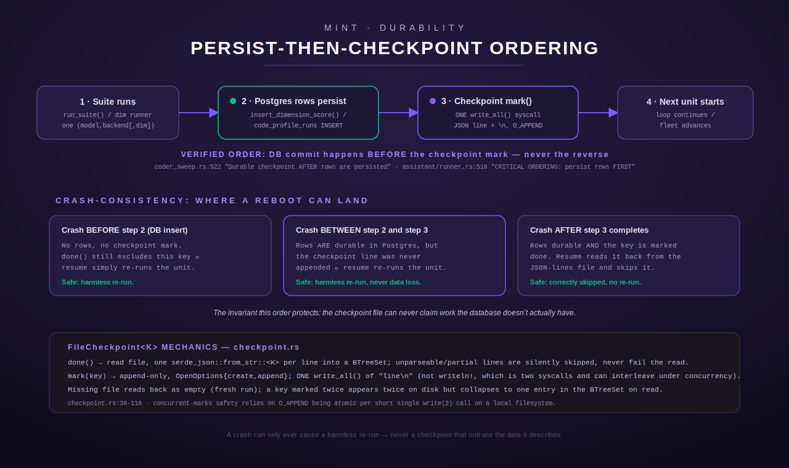
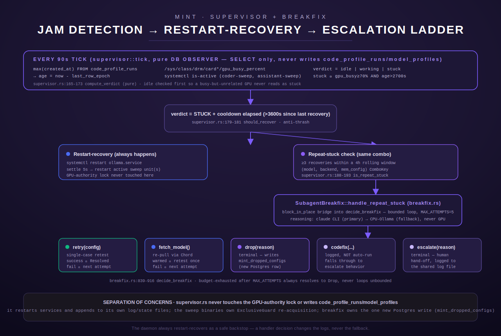

[← MINT overview](README.md)

# MINT Durability — Checkpoint, Supervisor, Breakfix

MINT is Terminus's model-intake evaluation harness: it runs multi-hour, sometimes
multi-day, fleet-wide sweeps (the coder-suite sweep and the multi-dimension assistant
sweep) across every locally-served model, on both GPU and CPU backends, in every
memory-configuration variant the fleet supports. A single sweep can legitimately take
hours per model and days across a full fleet. Over that span it *will* meet a reboot, a
crashed process, an operator-triggered kill, or a wedged GPU. This page is a deep-dive
into the three subsystems that make that survivable:

- **`checkpoint.rs`** — the on-disk, JSON-lines resume mechanism a sweep consults on
  every restart to skip work it has already durably completed.
- **`supervisor.rs`** — a permanent daemon (`mint supervisor run`) that watches for a
  *jammed* sweep (GPU pegged, no new rows landing) and auto-recovers it.
- **`breakfix.rs`** — the escalation/self-repair logic the supervisor hands a
  repeatedly-jammed combination off to, once plain restarts stop working.
- **`chord_session.rs`** (RESIL-03) — a SECOND, independent durability signal:
  the sweep registers its planned queue with Chord's session cache and
  advances it as work completes, so a restart can resume from Chord even if
  the local `INTAKE_STAGING_DIR` checkpoint file was lost — and vice versa.

Every claim below is sourced from the actual code as of this page's writing, with
`file.rs:line` citations for anything non-obvious. Where the build brief's assumptions
disagreed with what the code does, that is called out explicitly.

## Table of contents

- [The durability problem](#the-durability-problem)
- [checkpoint.rs — the resume mechanism](#checkpointrs--the-resume-mechanism)
- [Crash-consistency: the verified write order](#crash-consistency-the-verified-write-order)
- [supervisor.rs — the jam-detection daemon](#supervisorrs--the-jam-detection-daemon)
- [breakfix.rs — the self-repair escalation ladder](#breakfixrs--the-self-repair-escalation-ladder)
- [Relationship to gpu_authority.rs](#relationship-to-gpu_authorityrs)
- [chord_session.rs — Chord-backed resume (RESIL-03)](#chord_sessionrs--chord-backed-resume-resil-03)
- [Environment variables](#environment-variables)
- [Worked example: a resumed sweep](#worked-example-a-resumed-sweep)

## The durability problem

A fleet sweep iterates over `(model, backend)` pairs (the coder sweep) or
`(model, backend, dimension)` triples (the assistant sweep), running a suite of cases
per unit and persisting one row per case into Postgres (`code_profile_runs`, or the
assistant's dimension-score tables) as it goes. Naively, killing the process mid-sweep
means the next run has no way to know which units are already done — it either re-runs
everything (wasting hours of GPU time re-scoring models that already scored cleanly) or,
worse, risks a checkpoint file that claims more progress than the database actually has
(silent data loss on the next `done()` read).

MINT solves this with a single shared pattern, used identically by both sweeps: a small,
append-only, file-backed set of completed keys on a reliable staging directory, combined
with a strict ordering rule about *when* a key is allowed to be added to that set. `checkpoint.rs`'s own module doc states the invariant precisely
(checkpoint.rs:10-16): a crash between "rows persisted" and "checkpoint marked" can only
ever cause a harmless re-run, never a checkpoint that claims work the DB doesn't
actually have.

## checkpoint.rs — the resume mechanism

`checkpoint.rs` (273 lines) is a Phase-2 extraction of what used to be two
near-identical, independently-drifted implementations — the coder sweep's
`CodeCheckpoint` (keyed on `(model_id, backend_tag)`) and the assistant runner's
`FileCheckpoint` (keyed on `(model_id, backend_tag, dimension)`) — collapsed into one
generic type, `FileCheckpoint<K>`, parameterized over the caller's own key struct
(checkpoint.rs:1-21, 38-41). Each caller still resolves its own on-disk path (from
`INTAKE_STAGING_DIR`, via `config.rs`) and owns its own key struct; only the
read/append/dedup mechanics are shared.

### On-disk format

The file is **JSON-lines**: one JSON object per line, one line per completed key. This
is deliberate, not incidental — the test `on_disk_format_is_json_lines`
(checkpoint.rs:169-189) documents *why*: "this is what makes a reboot resume rather than
restart: a fresh process must be able to parse each line independently." A record's
shape is exactly whatever the caller's key struct serializes to; for example the coder
sweep's key is `{model, backend_tag}` (as JSON field names of its own struct), and the
assistant runner's is `{model, backend_tag, dimension}` (`coder_sweep.rs`,
`assistant/runner.rs`'s respective key types, both `Ord`-deriving so the in-memory
"done" set can be a `BTreeSet<K>` rather than requiring a `Hash` bound
(checkpoint.rs:31-37)).

### `done()` — reading what's already complete

```rust
pub fn done(&self) -> BTreeSet<K> {
    std::fs::read_to_string(&self.path)
        .map(|s| {
            s.lines()
                .filter(|l| !l.trim().is_empty())
                .filter_map(|l| serde_json::from_str::<K>(l).ok())
                .collect()
        })
        .unwrap_or_default()
}
```
(checkpoint.rs:70-79)

A missing file reads back as "nothing done yet" — `done()` never fails, it just
degrades to an empty set (checkpoint.rs:47-52, 66-69). Any line that fails to parse
(e.g. a truncated line left by a crash exactly mid-`write`) is silently filtered out
rather than failing the whole read (checkpoint.rs:67-69), and this is explicitly
covered by `reload_after_partial_write_skips_unparseable_lines`
(checkpoint.rs:210-233): every *other*, well-formed key on the same file is still read
back correctly even when one line is garbage.

A resumed run calls `done()` once at startup, then treats any `(model, backend[,
dimension])` combination already present in that set as already-profiled and skips
straight past it — the sweep's own driver loop diffs the fleet manifest against `done`
before deciding what to run next (`coder_sweep.rs`'s `run_fleet`, `assistant/runner.rs`'s
`run_with`; see the worked example below).

### `mark()` — recording completion

```rust
pub fn mark(&self, key: &K) -> Result<(), String> {
    let mut line =
        serde_json::to_string(key).map_err(|e| format!("serialize checkpoint key: {e}"))?;
    line.push('\n');
    let mut f = OpenOptions::new()
        .create(true)
        .append(true)
        .open(&self.path)
        .map_err(|e| format!("open checkpoint {}: {e}", self.path))?;
    f.write_all(line.as_bytes())
        .map_err(|e| format!("append checkpoint: {e}"))?;
    Ok(())
}
```
(checkpoint.rs:104-116)

Key properties, all stated in the code:

- **Append-only, never rewritten.** `mark()` only ever opens with `.append(true)`; it
  never truncates or rewrites the file (checkpoint.rs:81-90, and proven by
  `mark_is_append_only_never_rewrites`, checkpoint.rs:192-208). A key marked twice
  simply appears twice on disk — harmless, because `done()`'s `BTreeSet` collapses
  duplicates on read.
- **Durability ordering is the caller's responsibility, not this type's.** The doc
  comment is explicit: "The CALLER is responsible for only calling this AFTER the work
  `key` represents is itself durably persisted elsewhere (e.g. DB rows); this type has
  no visibility into that and cannot enforce the ordering itself, only preserve it once
  the caller does" (checkpoint.rs:84-87). `FileCheckpoint` is a pure mechanism; the
  crash-consistency *guarantee* comes from how callers sequence their own calls (see the
  next section).
- **One `write_all()` call over a pre-built buffer, not `writeln!`.** This is a
  documented fix over both original implementations. `writeln!(f, "{line}")`, via
  `fmt::Write`'s default `write_fmt`, can issue *two* separate `write(2)` syscalls (line,
  then `\n`) — each individually atomic under `O_APPEND`, but not atomic as a pair.
  Two concurrent marks could interleave as `{...}{...}\n\n`, corrupting a line and
  silently dropping it on the next `done()` read (a parse failure is filtered out, not
  surfaced). Building one buffer and writing it in a single syscall restores the
  atomicity the append-only design already depended on (checkpoint.rs:92-103). This was
  "a latent bug in both originals, surfaced by this shared type's concurrent-marks
  test" — `concurrent_marks_from_multiple_threads_all_land`
  (checkpoint.rs:236-272), which spawns 16 threads each marking a distinct key and
  asserts all 16 land intact.
- **No explicit file locking; relies on `O_APPEND` atomicity.** The concurrency
  guarantee is explicitly scoped to "a single short line on a local filesystem"
  (checkpoint.rs:240-244) — there is no `flock` or equivalent; this is a documented,
  deliberate reliance on POSIX `O_APPEND` semantics, not an oversight.
- **No `fsync` call.** Neither `mark()` nor any caller in the traced call paths calls
  `sync_all()`/`fsync`. Durability here means "survives process death and OS-level
  crashes that don't also lose the filesystem's own write-back cache" — the same level
  of durability the code explicitly relies on for the *checkpoint* side. The
  crash-consistency argument does not depend on the checkpoint write being
  harder-than-`O_APPEND`-durable: even if the checkpoint line itself were lost, the
  worst outcome is a harmless re-run (see the next section), never data loss.



## Crash-consistency: the verified write order

The build brief this page was written against asserted that MINT "persists to Postgres
BEFORE the JSON-lines checkpoint mark." **That claim is correct, and is directly
confirmed by both call sites, not just inferred:**

**Coder sweep** — `coder_sweep.rs`'s `run_one_backend` runs the suite (which persists
one `code_profile_runs` row per case internally as it goes) and only calls
`checkpoint.mark(&key)` in the `Ok` arm *after* `driver.run_suite(...).await` has
returned successfully:

```rust
let outcome = match driver.run_suite(...).await {
    Ok(res) => {
        // Durable checkpoint AFTER rows are persisted — resume-safe ordering.
        checkpoint
            .mark(&key)
            .map_err(|e| ToolError::Execution(format!("mark checkpoint: {e}")))?;
        BackendOutcome::Profiled { ... }
    }
    Err(e) => BackendOutcome::Skipped(format!("code suite did not complete: {e}")),
};
```
(`coder_sweep.rs:509-536`, comment at line 522)

A suite that returns `Err` (hang, unavailable, OOM, ...) is recorded as a skip and is
**never checkpointed** — proven by `driver_error_marks_no_checkpoint`-style assertions
in `coder_sweep.rs`'s own test module (e.g. `checkpoint.done().is_empty()` after an
unavailable/suite-fail scenario, `coder_sweep.rs:1216`, `1236`). A refused GPU-lock pass
is likewise never marked (`coder_sweep.rs:1355-1356`).

**Assistant runner** — `assistant/runner.rs` is even more explicit; the ordering is
called out as a `CRITICAL ORDERING` comment at the exact call site, inside the
per-dimension loop:

```rust
// CRITICAL ORDERING: persist rows FIRST, then mark the checkpoint.
// ...
// checkpoint that claims work the DB doesn't have.
if let Err(e) = checkpoint.mark(&key).await {
    dim_skips.push((dim.to_string(), format!("checkpoint failed: {e}")));
}
```
(`assistant/runner.rs:518-527`, condensed)

The row-persistence call this follows is `schema::insert_dimension_score[...]`
(`assistant/runner.rs:172-236` documents this as "the canonical write path"), invoked
earlier in the same per-dimension iteration, before the `checkpoint.mark()` call above.
The module doc states the same invariant in its own words: "a per-(model, backend,
dimension) checkpoint is recorded" only *after* "that dimension completes (via
`schema::insert_dimension_score`)" (`assistant/runner.rs:14-15`).

### Why this order, specifically

The order protects exactly one invariant, stated identically in both call sites' nearby
comments: **the checkpoint file must never claim work the database doesn't actually
have.** Reversing the order — marking the checkpoint *before* the DB insert — would
create a crash window where a resumed run sees a key in `done()`, skips it forever, and
yet the corresponding rows never landed: silent, permanent data loss with no way to
detect or repair it short of manually editing the checkpoint file. With the actual
(DB-first) order, the only failure mode a crash can produce is the *opposite* one: rows
exist but the checkpoint mark didn't land, so the unit is redundantly re-run. That is
wasted GPU time, not lost data — and because both sweeps scope each attempt to a fresh
`profile_id` (a fresh row per (model, backend) pass; see `coder_sweep.rs:490-501`'s
"fresh profile row scopes this ... pass's code rows" comment) and there is dedicated
S86-hardening logic that reconciles orphaned, unfinalized rows left by a killed prior
attempt *before* starting a fresh one (`coder_sweep.rs:450-488`, `delete_unfinalized_code_runs_v2`),
a redundant re-run does not even accumulate garbage rows indefinitely — it cleans up
after itself on the next start.

## supervisor.rs — the jam-detection daemon

`supervisor.rs` (1256 lines) is MINT Phase 3: the permanent Rust replacement for two
interim stopgaps — a bash watchdog script and a session-scoped cron job that
auto-expires — both of which detected a *jammed* sweep (GPU pegged busy, no new
`code_profile_runs` rows landing for a long time) and recovered by restarting the model
server plus whichever sweep unit(s) were active (supervisor.rs:1-11). It ships as
`mint supervisor run` (the long-running daemon) plus `install`/`uninstall` subcommands
that manage its own systemd unit.

### What it explicitly does NOT do

The module doc is direct about the boundary: "It OBSERVES and RESTARTS services. It
does NOT itself hold or release the GPU-authority exclusive lock — that is the sweep
binaries' own job... The supervisor never touches `/run/gpu-authority.lock`"
(supervisor.rs:13-19). A recovery restart bounces the model server plus the sweep unit;
the sweep unit's own `ExclusiveGuard` re-acquires the lock on its next start.

### Verified: supervisor.rs is a pure read-only observer of the tables it watches

The build brief asked whether `supervisor.rs` ever *writes* to the tables it observes
(`code_profile_runs`, `model_profiles`), or only reads them. **Confirmed by exhaustive
grep and by reading every SQL statement in the file: `supervisor.rs` contains no
`INSERT`, `UPDATE`, or `DELETE` of any kind.** Its only two database interactions are
both `SELECT`s, both against `LiveEnv` (the live `SupervisorEnv` implementation):

```rust
async fn last_row_epoch(&self) -> Option<i64> {
    let res = sqlx::query_scalar::<_, Option<i64>>(
        "SELECT extract(epoch from max(created_at))::bigint FROM code_profile_runs",
    )
    .fetch_one(&self.pool)
    .await;
    ...
}
```
(supervisor.rs:608-623)

```rust
async fn current_combo(&self) -> Option<ComboKey> {
    let res = sqlx::query_as::<_, (String, Option<String>, Option<String>)>(
        "SELECT p.model_name, r.backend_tag, r.mem_config \
         FROM code_profile_runs r JOIN model_profiles p ON r.profile_id = p.id \
         ORDER BY r.created_at DESC LIMIT 1",
    )
    .fetch_optional(&self.pool)
    .await;
    ...
}
```
(supervisor.rs:625-647)

Everything else `LiveEnv` writes to is *outside* Postgres entirely: the shared tick-log
file (`log_line`, a best-effort file append plus a `tracing::info!` call,
supervisor.rs:665-674), the cooldown-anchor state file
(`persist_last_recovery`, supervisor.rs:676-679), and `systemctl restart` shell-outs
(supervisor.rs:649-659). So the claim in the build brief — attributed to a
`needs_schema_migrate` comment in `mint.rs` — checks out for `supervisor.rs` itself:
it is a pure observer of `code_profile_runs`/`model_profiles`, full stop. (The one new
Postgres *write* anywhere in this trio of files is `breakfix.rs`'s
`write_dropped_config`, and it targets a distinct, purpose-built table,
`mint_dropped_configs` — never the tables the supervisor watches; see below.)

### Jam-detection algorithm (ported verbatim from the bash watchdog)

Every tick (default cadence [`TICK_INTERVAL_SEC`] = 90s, matching the old
`sweep-watchdog.timer`'s `OnUnitActiveSec=90`, supervisor.rs:94-95):

1. Read `last_row_epoch` = `max(created_at)` from `code_profile_runs` (the SELECT
   above). If the query fails or the table is empty, the tick is skipped entirely —
   this matches the bash script's "could not read last_row_epoch ⇒ skip this tick"
   behavior (supervisor.rs:398-401, 433-438).
2. Read `gpu_busy` from the first readable
   `/sys/class/drm/card*/device/gpu_busy_percent` (only `cardN` roots, not
   `cardN-CONNECTOR` output nodes; defaults to 0 if nothing is readable — headless/no
   discrete-GPU driver, supervisor.rs:507-530).
3. Read `sweep_active` / `assistant_active` via `systemctl is-active` of the two sweep
   units (supervisor.rs:532-544). An empty/unparseable token reads as `"unknown"`, which
   `is_active()` treats as not-active (supervisor.rs:371-378).
4. Compute `age = now - last_row_epoch`.
5. Compute the verdict, pure and unit-tested (supervisor.rs:165-173):
   - `Idle` if **neither** sweep unit is active — checked *first*, so an idle host with
     an incidentally-busy GPU (unrelated work) is never mislabeled `Stuck`.
   - `Stuck` if `gpu_busy >= 70` **and** `age > 2700` (45 minutes) — both conditions
     required.
   - `Working` otherwise.

The two tuned thresholds are ported "VERBATIM" from the bash script's already-proven
values (supervisor.rs:76-96), with one documented widening: `STUCK_THRESHOLD_SEC` was
widened from a shorter value to 2700s (45 min) because "a full model suite can
legitimately take 20-40+ min (batched DB writes: rows only land after a whole suite
finishes), so a shorter threshold falsely flagged an in-progress suite as stuck and the
watchdog restarted mid-suite, discarding all its in-progress work" (supervisor.rs:78-83).
`RECOVERY_COOLDOWN_SEC` (1 hour) was widened at the same time, for the same class of
reason (supervisor.rs:89-92).

On `Stuck`, subject to a 1-hour anti-thrash cooldown between recoveries
(`should_recover`, supervisor.rs:179-181), the tick restarts the model-serving unit
first, waits 5 seconds ("settle" — let it come back up before touching the sweep units,
supervisor.rs:411-413, 482), then restarts whichever of the two sweep units were active
*this tick* (supervisor.rs:474-492) — never a unit that wasn't already running.

### Repeat-stuck escalation (the Rust port's addition over the bash original)

The daemon tracks a rolling, in-memory ledger of stuck-recovery timestamps per
`(model, backend, mem_config)` `ComboKey`, attributed from the most-recent
`code_profile_runs` row at recovery time (supervisor.rs:198-222). If the *same* combo
produces **3 or more** recoveries within a **4-hour** rolling window
(`REPEAT_STUCK_THRESHOLD` / `REPEAT_STUCK_WINDOW_SEC`, supervisor.rs:99-114), that is
"repeat-stuck": a plain restart clearly isn't fixing it. The window is deliberately
sized at `4 × RECOVERY_COOLDOWN_SEC`, not equal to the cooldown — a documented
review-caught fix: since two recoveries of the same combo are always at least one full
1-hour cooldown apart, reaching a 3rd recovery takes at least ~2 hours end-to-end; a
1-hour window would let the 1st recovery age out before the 3rd could even happen,
making escalation "mathematically unreachable" (supervisor.rs:100-110). This exact
regression is guarded by a dedicated test,
`repeat_stuck_is_reachable_via_realistic_cooldown_spaced_recoveries`
(supervisor.rs:1219-1255).

On repeat-stuck, the tick consults a `BreakfixHandler` trait object
(`handle_repeat_stuck(combo, recovery_count)`) *before* falling through to the normal
restart-recovery — the handler's decision only changes what gets logged, never whether
the restart happens (`BreakfixOutcome::Deferred` vs. `Handled`, both fall through to the
same restart, supervisor.rs:272-286). Phase 3 shipped only a no-op
`LoggingBreakfixHandler` that logs a structured `ESCALATION` line and defers
(supervisor.rs:300-317); production now wires in `breakfix::SubagentBreakfix`
(supervisor.rs:697-702) — see the next section — **without any change to `tick()`
itself**, which still only depends on the trait object.

### Log-line compatibility (load-bearing)

Tick lines are written to the *same* log file the bash watchdog wrote, in the *same*
shape — `TIMESTAMP verdict=X gpu_busy=Y% row_age=Zs sweep=A assistant=B` — because an
operator monitoring routine parses exactly this format (supervisor.rs:52-58, exact
format function at supervisor.rs:338-352). `sweep`/`assistant` are the *raw*
`systemctl is-active` tokens (e.g. `active`/`inactive`/`failed`), not a re-derived
boolean — preserving whatever the bash script logged. Escalation events add a new,
clearly-distinguishable line starting with the literal token `ESCALATION`
(supervisor.rs:357-363), so a log parser can never confuse the two shapes (verified by
`escalation_line_is_distinguishable_from_tick_lines`, supervisor.rs:1034-1042: it
asserts the escalation line contains no `verdict=` token).

### Graceful shutdown and the tick/state relationship

The daemon's main loop (`run()`, supervisor.rs:689-741) is a `tokio::select!` over three
arms: the 90s interval ticker (with `MissedTickBehavior::Skip`, so a long tick never
produces a catch-up burst), a `SIGTERM` handler, and `Ctrl-C`/`SIGINT`. Either signal
logs a shutdown line and breaks the loop cleanly — there is no forced-kill path or
abrupt process exit on signal receipt; the loop simply stops issuing new ticks. The
`last_recovery` cooldown anchor is persisted to a state file
(`STATE_DIR/last_recovery_epoch`) on every recovery and re-read at daemon startup
(`LiveEnv::load_last_recovery`, supervisor.rs:582-587), specifically so a
`Restart=on-failure` systemd bounce does not reset the 1-hour cooldown and immediately
permit another recovery (supervisor.rs:121-124). The repeat-stuck ledger itself, by
contrast, is *not* persisted — it lives only in the in-process `SupervisorState` and
resets on a daemon restart, which the code notes is "acceptable given the 1-hour window"
(supervisor.rs:226-230).

### `install` / `uninstall`

`mint supervisor install` renders a systemd unit file
(`supervisor_unit_content(exec_path)`, a pure string-building function,
supervisor.rs:755-781) and writes it, then runs `daemon-reload`, `enable`, and `start`
in sequence (supervisor.rs:795-813). `uninstall` stops and disables the unit
(best-effort — a not-installed unit is not treated as an error), removes the unit file,
and reloads systemd (supervisor.rs:818-832). The rendered unit mirrors the conventions
the sweep units themselves already use: `User=root`, `Restart=on-failure`,
`RestartSec=10`, `RUST_LOG=info`, `After=network-online.target ollama.service`, and an
*optional* `EnvironmentFile=-...` (the leading `-` means a missing file doesn't block
startup) so the daemon can pick up the same intake environment the sweep units use when
present, but isn't required to (supervisor.rs:749-780). The unit's working directory and
environment-file path are fixed string constants baked directly into
`supervisor_unit_content()`'s format string — not host-specific configuration — and the
function is unit-tested against its own literal output
(`unit_content_mirrors_sweep_unit_conventions`, supervisor.rs:1060-1072).



## breakfix.rs — the self-repair escalation ladder

`breakfix.rs` (1921 lines) is MINT Phase 4/5: the real `BreakfixHandler` the supervisor
invokes once a combo crosses the repeat-stuck threshold. It replaces the Phase 3
logging-only default without any change to the supervisor's tick loop — it plugs
directly into the existing `BreakfixHandler` trait seam (breakfix.rs:1-11).

### The misattribution caveat this handler is built defensively around

`ComboKey` attribution during an active jam comes from the most-recently-*completed*
`code_profile_runs` row (batch-written at suite completion in some code paths), which
"can misattribute right after a model switch" — flagged by both review passes in Phase
3. Because of this, the handler *never* acts on the attributed combo blindly: every
candidate fix is verified with an actual single-case retest before any decision is
finalized, and a failed retest simply feeds back as evidence for the next reasoning-call
rather than short-circuiting to "must be broken" on the label alone (breakfix.rs:13-23).

### Reasoning backend chain

Primary: a headless `claude` CLI subprocess (`ClaudeCliBackend`). Fallback — triggered
on a missing binary, spawn failure, auth error, or timeout — is a local CPU-backed
Ollama model (`OllamaCpuBackend`), *deliberately not* the GPU backend, so breakfix's own
reasoning never contends for the GPU it is diagnosing (breakfix.rs:25-33). Both
implement a common `ReasoningBackend` trait so tests inject a scripted mock and never
spawn a real subprocess or make a real network call (breakfix.rs:184-187).

The `claude` child process is spawned with `env_clear()` first, then only an explicit
allowlist of shell/locale plumbing variables re-added (`PATH`, `HOME`, `LANG`,
`LC_ALL`, `LC_CTYPE`, `TERM`, `TMPDIR`, `USER`, `LOGNAME`, `SHELL`,
`XDG_CONFIG_HOME`/`XDG_DATA_HOME`/`XDG_CACHE_HOME`/`XDG_STATE_HOME`,
breakfix.rs:202-217) — never the parent process's full environment. On top of the
allowlist, every candidate key is *also* re-checked against a secret-shaped-key filter
(anything ending `_TOKEN`/`_SECRET`/`_KEY` or starting `INFISICAL_`/`CHORD_JWT`,
breakfix.rs:192-195) — belt-and-suspenders so a future allowlist edit can't accidentally
reintroduce a credential into the child's environment or any log line
(breakfix.rs:279-283). A non-zero exit from the `claude` CLI is *always* treated as
`Unavailable`, even if stdout is non-empty — a documented review fix, since a CLI that
crashes but still prints a partial answer or warning banner used to be misread as a
legitimate reply (breakfix.rs:342-356).

`ChainedBackend` wires primary → fallback: any `Unavailable` from the primary falls
through to the CPU-Ollama fallback; if *that* also fails, the caller sees `Unavailable`
and `decide_breakfix` escalates — it never crashes or hangs waiting on a reasoning call
(breakfix.rs:426-455).

### The `VERDICT:` contract

Every reasoning-backend reply is expected to end in exactly one line of the form
`VERDICT: <form>(...)`. `parse_verdict` scans line-by-line for the *first* line matching
`VERDICT:`, strictly, and parses only that line — it never prose-scans the rest of the
response (breakfix.rs:98-105). Five forms are recognized:

| Verdict | Meaning | Handling |
|---|---|---|
| `retry(config=key:value[,key:value])` | Try an alternate `backend`/`mem_config` | Verified via a single-case retest before being trusted |
| `fetch_model()` | The model may be missing/corrupt on this host, not a config problem | Re-pull via Chord, then one retest if the pull succeeds |
| `drop(reason=...)` | Stop trying this combo permanently | Terminal — writes a `mint_dropped_configs` row |
| `codefix(...)` | The backend believes an actual code fix is needed | Logged as "requested but not yet auto-executed"; falls through to escalate |
| `escalate(reason=...)` | Hand off to a human | Terminal — no further automated action |

Any reply with no `VERDICT:` line at all, or a `VERDICT:` line in an unrecognized shape,
is treated as `escalate(reason="unparseable ...")` — the documented safe default per the
Phase 4 spec (breakfix.rs:98-144).

### The bounded diagnostic loop

`decide_breakfix` is a `for attempt in 1..=MAX_ATTEMPTS` loop (`MAX_ATTEMPTS = 5`,
breakfix.rs:66-71) that alternates between asking the reasoning backend for a verdict
and (for `retry`/`fetch_model`) verifying it with a real, single-case retest via
`RetestHook`/`FetchModelHook` — abstracted traits so tests never touch a live GPU,
Postgres, or the corpus manifest (breakfix.rs:474-477, 677-680). Every verdict except a
failed `retry`/`fetch_model` returns immediately (`Resolved`, `Drop`, `Escalate`,
`CodefixDeferred`, or the reasoning backend itself being `Unavailable`); the only way to
exhaust the loop is a backend that proposes `retry`/`fetch_model` every single attempt
*and* every retest fails. Even then, the `for` range itself bounds the loop — after the
5th iteration it simply ends and falls through to a forced `Drop` with
`reason: "attempt budget exhausted..."` (breakfix.rs:804-916). This termination argument
is proven, not just asserted, by two adversarial tests that inject a mock backend
which *always* replies with the verdict under test and a mock hook that *always* fails,
asserting the loop still terminates at exactly `MAX_ATTEMPTS` calls
(`adversarial_always_retry_backend_terminates_at_budget`,
`adversarial_always_fetch_model_backend_terminates_at_budget`).

`LiveRetestHook` (the production `RetestHook`) acquires the GPU *exclusively* under a
dedicated holder label (`BREAKFIX_GPU_HOLDER = "mint_breakfix"`, distinct from the
sweep's own holder label, so a retest refuses to start rather than race a real sweep or
an operator's ad hoc rerun — breakfix.rs:503-508), picks the first case in the corpus
manifest as a stable, fast representative case (a full re-profiling sweep is explicitly
out of scope for a sanity check, breakfix.rs:551-557), and runs it through the existing
single-case suite driver with whatever config overrides the backend proposed.

Two real, review-caught hangs are guarded against, both because this code runs *inside*
the supervisor daemon's single tick task (via a `block_in_place` +
`Handle::current().block_on` bridge, breakfix.rs:1180-1196):

- **`bounded_blocking`** (breakfix.rs:510-549) wraps `gpu_authority::acquire`'s
  `systemctl` shell-outs — which have no timeout of their own — in a
  `spawn_blocking` raced against a wall-clock timeout
  (`MINT_BREAKFIX_GPU_ACQUIRE_TIMEOUT_SECS`, default 60s). If the timeout wins, the
  synchronous call is left running detached on the blocking pool (there is no safe way
  to interrupt a running `systemctl` mid-syscall); its eventual result is silently
  discarded. Without this, a hung `systemctl` call would wedge the *entire daemon*
  forever — no further ticks for any combo, and no timely `SIGTERM` response either,
  since the same task drives both.
- **`fetch_model_bounded`** (breakfix.rs:704-737) wraps the Chord model-pull call with
  its own, tighter timeout (`MINT_BREAKFIX_FETCH_MODEL_TIMEOUT_SECS`, default 120s) —
  distinct from `chord_pull::fetch_model`'s own generous HTTP timeout
  (`MINT_FETCH_MODEL_TIMEOUT_SECS`, default 600s, sized for an operator's CLI call
  legitimately waiting out a large archive copy). A merely *slow*, not fully hung,
  Chord could otherwise stall the daemon's single tick task for up to 600s per attempt,
  up to `MAX_ATTEMPTS` times. Here a plain `tokio::time::timeout` suffices (unlike the
  `systemctl` case, this is already a plain `async fn`, not a truly synchronous call).
  A timeout here is not fatal — it resolves to `FetchModelOutcome::Failed`, same as any
  other fetch failure, and feeds back as evidence for the next attempt.

### `mint_dropped_configs` — the one Postgres write in this trio

A `Drop` decision is the only outcome of the whole checkpoint/supervisor/breakfix trio
that writes anywhere in Postgres. `write_dropped_config` first idempotently
`CREATE TABLE IF NOT EXISTS`s a purpose-built table (`ensure_dropped_configs_table`,
breakfix.rs:920-947 — the same self-healing-schema convention used elsewhere in intake
storage) and then inserts one fully-parameterized row (`$1..$6`, never
string-interpolated — breakfix.rs:949-980) recording `model`, `backend`, `mem_config`,
`reason`, `attempts_made`, and `last_error_class`. This is a *new*, dedicated ledger
table, distinct from — and never touching — the `code_profile_runs`/`model_profiles`
tables the supervisor observes.

### Diagnostic context and logging

Before asking the reasoning backend anything, `gather_context` assembles a prompt-ready
summary: the last 20 lines of the supervisor's own shared tick log
(`supervisor::LOG_PATH`, best-effort — an unreadable file just yields "(none
available)", breakfix.rs:984-1045) plus the 5 most recent `code_profile_runs` rows for
the combo's `(model, backend)` (`case_id`, `error`, `oom`, `mem_config` —
breakfix.rs:1000-1034; this is a `SELECT`, the only DB read in the file besides the
insert above). Every decision outcome (`Resolved`/`Drop`/`Escalate`/`CodefixDeferred`)
is logged with a `BREAKFIX` token to the *same* shared log file the supervisor writes
to, so an operator's review tooling can grep both tick and breakfix activity from one
place (breakfix.rs:1047-1063, 1122-1177).

The handler always returns `BreakfixOutcome::Handled` — it takes *some* logged action
for every repeat-stuck call, never a silent no-op — but per `BreakfixOutcome::Handled`'s
own contract, the supervisor's tick still restart-recovers regardless
(breakfix.rs:1172-1176): a handler decision changes only what gets logged, never
whether the safety-net restart happens.

### Deliberate scope narrowing: `codefix` is not auto-executed

A `codefix(...)` verdict is logged clearly as "requested but not yet auto-executed in
this phase" and then handled exactly like `escalate`. Full autonomous
code-fix-and-deploy (worktree, test, dual-review, merge, deploy automation) is
explicitly out of scope for this phase — the code marks the exact point a follow-up
phase would wire in real execution with a `TODO(mint-phase-5-or-later)` comment
(breakfix.rs:47-53, 1151-1170).

## Relationship to gpu_authority.rs

Both the supervisor's restart-recovery and breakfix's single-case retest interact with
`gpu_authority.rs`, but neither owns the exclusive lock itself:

- The supervisor restarts the model-serving unit and the sweep unit(s), then relies on
  the sweep binary's own `ExclusiveGuard` to re-acquire the lock on its next start — the
  supervisor "never touches `/run/gpu-authority.lock`" (supervisor.rs:13-19).
- Breakfix's `LiveRetestHook` *does* acquire the lock itself, exclusively, but under a
  dedicated holder label (`BREAKFIX_GPU_HOLDER = "mint_breakfix"`) distinct from the
  sweep's own — so a retest refuses to start (never races) while a real sweep or an
  operator's ad hoc rerun holds the lock, and the acquire call is itself wrapped in
  `bounded_blocking` so a `gpu_authority::acquire` reconciliation hang can't wedge the
  supervisor daemon (breakfix.rs:503-549).

For the exclusive-lock mechanics themselves — holder labels, reconciliation,
idempotent-reacquire rules — see the dedicated `gpu-authority.md` reference page; this
page intentionally does not duplicate that depth.

## chord_session.rs — Chord-backed resume (RESIL-03)

`checkpoint.rs`'s file-backed ledger (above) stays the PRIMARY, always-attempted resume
path — every claim in this section is additive, never a replacement. `chord_session.rs`
adds a SECOND, independent durability signal by talking to Chord's session-cache control
endpoints (`POST /api/sweep/session`, `GET /api/sweep/session/:id`,
`POST /api/sweep/session/:id/advance` — JWT-gated the same way as every other
Chord-calling module in this repo; see `chord_pull.rs` for the precedent this module
mirrors). The point is resilience against LOSING one of the two signals independently: a
Terminus host that loses its `INTAKE_STAGING_DIR` (disk wipe, host rebuild) can still
resume from Chord; a Chord outage or a freshly-provisioned `CHORD_CONTROL_URL` still
resumes correctly from the file checkpoint alone, exactly as it did before RESIL-03.

### Stable identity: `session_id` and `ActionKey`

A sweep restart must re-attach to the SAME Chord-side session, not fragment into a new
one every run. `derive_session_id(epoch, run_kind, queue)` derives a session id from the
harness epoch, the run kind (`"coder"`/`"assistant"`), and a stable SHA-1 digest (via
`sha1_smol`, the same stable-across-builds hash this repo already uses for
`plane::redis_cache_key` — `std`'s `DefaultHasher` is explicitly NOT used because it is
not stable across Rust versions/builds) of the planned queue's contents, in order. Same
planned queue ⇒ same session id, every restart; a materially different queue (fleet
change, a different `--only-stale` selection) naturally derives a new session, matching
Chord's own "different queue = replace + reset" semantics.

Each unit of work is identified by an `ActionKey` — a stable string,
`"<run_kind>|<model>|<backend>[|<case>]"` — built by `action_key(...)`. This is
deliberately the SAME conceptual unit the file checkpoint's own key struct
(`CodeCheckpointKey` for the coder sweep) already keys on, so Chord's `done` set and the
file checkpoint's `done` set describe identical units and either can be used to skip the
other's re-run.

### Registration + reconciliation, at sweep start

Before the coder sweep's fleet loop starts, `coder_sweep.rs`'s
`register_and_reconcile_chord_session` builds the planned `(model, backend)` queue for the
(possibly `--only-stale`-narrowed) fleet, derives the session id, and calls
`chord_session::register`. On success, it reconciles: any queued unit Chord's response
does NOT list in `remaining` is treated as Chord-done and, if the file checkpoint doesn't
already have it, backfilled into the file checkpoint via `checkpoint.mark(&key)`. This
means the existing `run_fleet`/`run_one_backend` skip logic (`done.contains(&key)`) is
completely unchanged — reconciliation happens once, up front, by making the file
checkpoint the union of what both sources already know, so a Terminus restart resumes
from Chord even if the local file checkpoint was lost.

If `register` fails — `CHORD_CONTROL_URL` unset, or Chord unreachable — this is logged
ONCE and the run proceeds with `chord_session_id = None`: durability falls back to the
file checkpoint alone. This is a hard requirement, not an incidental default: Chord being
down must never stop a sweep from starting.

### Advancing, at each unit's completion

`run_one_backend` calls `chord_session::advance(session_id, &[action_key])`
**immediately after** `checkpoint.mark(&key)` succeeds — never before, and never as a
substitute for it. The file checkpoint mark remains the sole authoritative
"this-process's-own" durability event; the Chord advance is a best-effort mirror of that
same fact onto the second signal. An advance failure (Chord down mid-run, a transient
network blip) is logged and swallowed — it can never undo or block the file checkpoint
mark that already landed, and never turns a successful case into a sweep failure.

### Soft-fail contract

Every `chord_session` call (`register`/`remaining`/`advance`) returns a plain `Result`
value for every failure mode — unconfigured, unreachable, or an unexpected response —
never a panic and never a hard error a caller must propagate. The ONLY remote host this
module ever calls is `CHORD_CONTROL_URL` itself; there is no internet call and no guessed
host on any path, mirroring `chord_pull.rs`'s `NotConfigured` contract exactly.

## Environment variables

Names only, per this documentation set's PII discipline — see each var's default in the
source cited.

| Variable | Read by | Purpose |
|---|---|---|
| `INTAKE_STAGING_DIR` | `checkpoint.rs` (via `config.rs`) | Reliable staging directory for the checkpoint JSON-lines file and the fleet manifest |
| `INTAKE_DATABASE_URL` (falls back to `DATABASE_URL`) | `supervisor.rs`, `breakfix.rs`, both sweeps | The intake Postgres connection string |
| `OLLAMA_CPU_URL` | `breakfix.rs` (`OllamaCpuBackend`) | Base URL for the CPU-backed Ollama fallback reasoning backend; unset ⇒ the fallback reports `Unavailable` rather than guessing a host |
| `MINT_BREAKFIX_CLAUDE_CLI` | `breakfix.rs` (`ClaudeCliBackend`) | Override for the `claude` CLI binary name/path; defaults to `claude` |
| `MINT_BREAKFIX_CLAUDE_MODEL` | `breakfix.rs` | Model alias passed to the primary reasoning backend; defaults to `sonnet` |
| `MINT_BREAKFIX_FALLBACK_MODEL` | `breakfix.rs` (`OllamaCpuBackend`) | Model name for the CPU-Ollama fallback; defaults to a small/fast model |
| `MINT_BREAKFIX_TIMEOUT_SECS` | `breakfix.rs` | Timeout for a single reasoning-backend call; default 120s |
| `MINT_BREAKFIX_GPU_ACQUIRE_TIMEOUT_SECS` | `breakfix.rs` (`bounded_blocking`) | Timeout bounding a retest's GPU-authority acquire; default 60s |
| `MINT_BREAKFIX_FETCH_MODEL_TIMEOUT_SECS` | `breakfix.rs` (`fetch_model_bounded`) | Tighter timeout for breakfix's own fetch-model call; default 120s |
| `MINT_FETCH_MODEL_TIMEOUT_SECS` | `chord_pull.rs` (not this file, referenced for contrast) | The underlying Chord pull's own, more generous HTTP timeout; default 600s |
| `RUST_LOG` | the rendered systemd unit | Standard `tracing` log-level filter for the daemon process |
| `CHORD_CONTROL_URL` | `chord_session.rs` (via `config.rs`), also `chord_pull.rs` | Base URL for Chord's control API — session-cache register/remaining/advance calls; unset ⇒ `chord_session` soft-fails to file-checkpoint-only durability, never a hard error |
| `CHORD_JWT` | `chord_session.rs` | Bearer token for Chord's control-API JWT auth; unset/blank ⇒ no `authorization` header sent (matches Chord's own auth-disabled-when-secret-empty behavior) |
| `MINT_SWEEP_SESSION_TIMEOUT_SECS` | `chord_session.rs` | Timeout for a single session-cache HTTP call (register/remaining/advance); default 10s — deliberately short, these are cheap metadata round trips, not `chord_pull`'s multi-GB model pull |

## Worked example: a resumed sweep

1. **Fleet start.** The coder sweep starts, resolves its checkpoint file from
   `INTAKE_STAGING_DIR`, and calls `checkpoint.done()`. Say 40 of 120 `(model, backend)`
   pairs are already present in the returned `BTreeSet` from a prior run.
2. **Skip already-done pairs.** The fleet driver iterates the manifest and, for each
   pair already in `done`, logs `RESUMED (already checkpointed)` and moves on without
   touching the driver at all (`coder_sweep.rs`'s resume-skip test,
   `driver_resume_skips_already_checkpointed_backend_without_touching_driver`, proves
   the driver's `model_available`/`run_suite` are never even called for a resumed pair).
3. **Orphan reconciliation for the next fresh pair.** Before starting a genuinely new
   `(model, backend, mem_config)` attempt, the sweep best-effort deletes any
   unfinalized `code_profile_runs` rows left by a *prior*, killed attempt at that exact
   combination — a `Text file busy`-style kill mid-suite, or an operator `kill -9`,
   otherwise leaves orphaned partial rows behind forever (`coder_sweep.rs:450-488`).
4. **Suite runs, rows persist, checkpoint marks.** The fresh pair's suite runs each
   case, persisting a row per case. Only once `run_suite` returns `Ok` does the sweep
   call `checkpoint.mark(&key)` (`coder_sweep.rs:509-525`).
5. **Interruption mid-suite.** Suppose the host reboots (or the GPU wedges and the
   supervisor's own restart-recovery bounces the sweep unit) partway through this pair's
   suite — after several case rows have landed in Postgres, but before the suite as a
   whole returned `Ok`. On the next process start: `checkpoint.done()` does **not**
   include this pair's key (it was never marked — the suite never returned `Ok`), so the
   fleet driver treats it as not-yet-done and re-runs it from scratch. Step 3's orphan
   reconciliation deletes the partial rows from the killed attempt first, so the re-run
   creates a clean, fresh `profile_id` rather than accumulating duplicate/partial rows
   across restarts.
6. **Persistent jam instead of a clean crash.** If, instead of a clean reboot, the
   sweep is merely *wedged* (GPU pegged at ≥70% busy, no new row landing for more than
   45 minutes), the supervisor's own tick loop — running independently as
   `mint-supervisor.service` — detects `Stuck`, waits out the 1-hour cooldown gate if a
   recovery already happened recently, then restarts the model-serving unit and the
   active sweep unit. The sweep unit restarting is exactly the "process death" case from
   step 5: the checkpoint file is the single source of truth for what survives that
   restart, regardless of *why* the process died.
7. **The same combo keeps jamming.** If the *same* `(model, backend, mem_config)` combo
   produces 3 stuck-recoveries within a 4-hour window, the supervisor hands off to
   `SubagentBreakfix` before its normal restart still fires. Breakfix gathers context
   (recent log lines + recent rows for the combo), asks its reasoning-backend chain for
   a verdict, and — if it proposes an alternate config — verifies that proposal with an
   actual single-case retest before ever declaring the combo fixed, dropped, or
   escalated. None of this touches the checkpoint file directly; a `Resolved` verdict
   just means the *next* real sweep attempt at that combo, whenever it runs, is more
   likely to succeed and get checkpointed normally.
