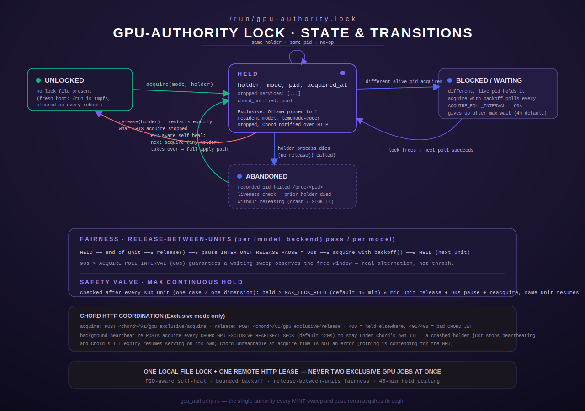

[← MINT overview](README.md)

# GPU Authority — exclusive-use locking for the intake fleet

`gpu_authority` (`src/intake/gpu_authority.rs`) is the single module every MINT sweep, case
rerun, and break-fix probe goes through before it is allowed to run inference. It is not a
scheduler and it does not queue work — it is a **proactive enforcement layer**: on `acquire`
it actually stops the services and reconciles the runner config a mode requires, records
exactly what it changed, and refuses a competing acquire outright rather than letting two
GPU-heavy jobs discover the collision after the fact.

This page is the deep-dive on that module: the lock file, the two operating modes, the Chord
HTTP coordination + heartbeat, the fairness/backoff model, and the exact numbers involved. Its
CLI surface (`gpu_mode`, `mint gpu ...`) is covered briefly at the end — see the CLI reference
for full subcommand syntax across MINT generally.



## Table of contents

- [Why this exists](#why-this-exists)
- [The lock file](#the-lock-file)
- [PID-aware self-heal](#pid-aware-self-heal)
- [Exclusive vs. Shared modes](#exclusive-vs-shared-modes)
- [Ollama runner-config reconciliation](#ollama-runner-config-reconciliation)
- [Chord HTTP coordination + TTL heartbeat](#chord-http-coordination--ttl-heartbeat)
- [Fairness and backoff](#fairness-and-backoff)
- [Max lock-hold safety valve](#max-lock-hold-safety-valve)
- [Acquire / release semantics](#acquire--release-semantics)
- [Per-pass vs. whole-run acquisition](#per-pass-vs-whole-run-acquisition)
- [Holder labels](#holder-labels)
- [CLI surface](#cli-surface)
- [Error and edge cases](#error-and-edge-cases)

## Why this exists

The module doc comment (`gpu_authority.rs:1-46`) records the two production incidents that
motivated it:

1. A manual smoke test run alongside an automated coder sweep stacked two inference jobs in
   VRAM at once and produced false "wedge" timeouts — discovered only after the fact, and
   initially misattributed (`gpu_authority.rs:6-9`; see the `gfx1151-vram-contention` memory
   for the underlying VRAM-ceiling mechanics).
2. Ollama's own shared runner config (`OLLAMA_MAX_LOADED_MODELS=4`, a multi-hour
   `OLLAMA_KEEP_ALIVE`) let a coder sweep's own sequential model-switching stack up to four
   models resident in VRAM at once — observed at three models and climbing before a human
   noticed `ollama ps` looked wrong and hand-fixed it with a one-off systemd drop-in
   (`gpu_authority.rs:10-16`).

Both incidents share a root cause: a fleet with one shared GPU has multiple independent
processes (an interactive smoke test, a multi-day coder sweep, an assistant sweep, break-fix
reruns, and Ollama's own internal model manager) that were never required to coordinate before
touching it. `gpu_authority` closes that gap by giving every one of those processes a single
mandatory choke point: call `acquire` before any inference, call `release` (or let an
`ExclusiveGuard` drop) when done.

The module explicitly is **not** a general GPU scheduler for [`crate::intake::lifecycle`],
which already arbitrates between LAUNCH-managed, unit-based inference backends
(llama-server-style) — `lifecycle`'s `ensure_up` treats Ollama as "assumed up and managed
elsewhere." `gpu_authority` is specifically the missing authority over Ollama's *own* internal
model-loading behavior, plus the genuine cross-process exclusive-use lock neither module had
before (`gpu_authority.rs:18-23`).

## The lock file

The lock lives at a fixed path, `/run/gpu-authority.lock` (`gpu_authority.rs:124-126`,
`fn lock_path`). `/run` is tmpfs, and the module's own comment calls this out as
**deliberate**, not incidental: a reboot clears every lock, which is correct — a reboot
already killed every process that could have held one, so there is nothing to resume.

The file is JSON-serialized `LockState` (`gpu_authority.rs:138-156`):

| Field | Type | Meaning |
|---|---|---|
| `holder` | `String` | Short label identifying the acquiring subsystem (e.g. `intake_coder_sweep`) |
| `mode` | `String` | `"exclusive"` or `"shared"` (`GpuMode::as_str`) |
| `pid` | `u32` | OS process id of the acquiring process |
| `acquired_at` | `u64` | Unix epoch seconds at acquire time |
| `stopped_services` | `Vec<String>` | Services THIS acquire actually stopped (were active beforehand) — the exact set `release` restarts |
| `chord_notified` | `bool` (`#[serde(default)]`) | Whether this acquire successfully took Chord's GPU lease over HTTP (see below); a lock file written by a pre-Chord-coordination binary still deserializes, defaulting to `false` |

`read_lock`/`write_lock`/`clear_lock` (`gpu_authority.rs:165-177`) are thin, honest wrappers:
a missing or unparsable file is treated as "no lock" (`Option::None` via `.ok()?`), never an
error — a corrupt/absent lock file must never itself block acquisition.

## PID-aware self-heal

Liveness is a single, cheap check: `pid_alive` (`gpu_authority.rs:179-184`) tests whether
`/proc/<pid>` exists. The doc comment is explicit about why this beats `kill -0`: the binary
already runs as root (same trust level as `intake::lifecycle`, which also shells out to
`systemctl`), so a plain `/proc` existence check is sufficient and avoids `CAP_SYS_PTRACE`-style
edge cases a `kill`-based check would need to handle for a PID owned by another user.

If the recorded PID's process has since died **without calling `release`** — the crash/SIGKILL
case — the lock is treated as abandoned, not as a live block. This is decided by `is_blocked`
(`gpu_authority.rs:186-205`):

```
is_blocked(existing, holder, pid_is_alive, current_pid)
    = pid_is_alive && !is_idempotent_reacquire(existing, holder, current_pid)
```

So there are exactly three outcomes for a new `acquire` against an existing lock:

- **Recorded PID no longer alive** → never blocked, regardless of the holder string. A dead
  PID's lock is up for grabs by *anyone* — self-healing, so a crashed sweep can never wedge the
  GPU forever (`gpu_authority.rs:190-194`).
- **Recorded PID alive, and it's a genuine same-process reentrant acquire** (same holder string
  *and* same PID — see [Acquire / release semantics](#acquire--release-semantics)) → not
  blocked, idempotent no-op.
- **Recorded PID alive, anything else** (different PID — even if the holder *string* happens to
  match) → blocked, `acquire` returns `Err`.

That third case is the PID-aware fix the module's tests call out explicitly
(`is_blocked_same_holder_string_different_alive_pid_still_blocks`,
`gpu_authority.rs:1412-1439`): two genuinely different OS processes that happen to share a
holder label — e.g. two overlapping `intake_coder_sweep` invocations landing in a narrow
systemd-restart window — must never be waved through as "the same reentrant caller" just
because the label matches. A holder-string-only check would have silently let the second
process skip stopping services and reconciling Ollama, and would have corrupted whose
`stopped_services` list a later `release` restarts against.

## Exclusive vs. Shared modes

`GpuMode` is a two-variant enum (`gpu_authority.rs:54-72`), and `policy_for` is the single,
pure place its concrete effects are declared (`gpu_authority.rs:99-119`) — described in the
module doc as deliberately centralized, "rather than as one-off shell commands":

| | `Exclusive` | `Shared` |
|---|---|---|
| `ollama_max_loaded_models` | `Some(1)` | `None` (don't manage the drop-in at all — remove it if present, falling back to the base unit's own tuning) |
| `stop_services` | `["lemonade-coder.service"]` | `[]` |
| `notify_chord_exclusive` | `true` | `false` |

`Exclusive` is a test/sweep run: exactly one Ollama-resident model at a time, and the simple
`lemonade-coder.service` llama-server process stopped outright via `systemctl`. `Shared` is
normal production serving: nothing stopped, and Ollama's drop-in removed so its base unit
tuning is the single source of truth again.

Note what `Exclusive` does **not** do: it does not `systemctl stop chord.service`. An earlier
version did, and the module's comment records why that was reverted — Chord is the always-on
fleet backbone, and stopping it left it `inactive (dead)` for a full multi-day sweep
(`gpu_authority.rs:84-90`). Chord instead yields the GPU through its own HTTP
acquire/release API (see below) and stays up the whole time, only gating its own inference
paths.

## Ollama runner-config reconciliation

"Reconciling Ollama's runner config" means writing (or removing) one systemd drop-in and
restarting the unit — and doing so **idempotently**, so a resumed exclusive run never pays for
a needless restart.

The drop-in lives at
`/etc/systemd/system/ollama.service.d/zz-gpu-authority-exclusive.conf`
(`ollama_dropin_path`, `gpu_authority.rs:134-136`). The `zz-` filename prefix is deliberate, not
cosmetic — the comment records finding out the hard way that systemd drop-ins merge in lexical
filename order with later files winning per-key, so an earlier attempt using a `99-...` name
sorted *before* the base production tuning drop-in (`override.conf`) and was silently
overridden by it.

Its content is fully determined by the desired `OLLAMA_MAX_LOADED_MODELS` value
(`dropin_content`, `gpu_authority.rs:241-250`):

```ini
# Managed by gpu_authority (HFIX-07) — do not hand-edit.
# Exclusive-mode override: one Ollama-resident model at a time, so a
# test/sweep run's own sequential model-switching cannot stack models
# in VRAM past the point a human notices `ollama ps` looks wrong.
[Service]
Environment=OLLAMA_MAX_LOADED_MODELS=1
```

`reconcile_ollama` (`gpu_authority.rs:265-290`) is the whole reconciliation:

- **Desired = `Some(n)`** (Exclusive): if the on-disk drop-in already has exactly this content
  (`dropin_matches`, `gpu_authority.rs:252-259`), return `Ok(())` without touching a live
  Ollama at all. Otherwise create the drop-in directory if needed, write the file, then
  `systemctl daemon-reload` and `systemctl restart ollama`.
- **Desired = `None`** (Shared): if the drop-in file doesn't exist, no-op. Otherwise remove it,
  then `daemon-reload` + `restart ollama` — falling back to whatever the base unit's own
  `Environment=` tuning specifies.

This is the idempotency the module doc promises: "if it already matches, nothing is touched —
no needless restart/eviction on every resume of an already-exclusive run"
(`gpu_authority.rs:34-36`).

## Chord HTTP coordination + TTL heartbeat

Chord (the inference proxy/orchestrator this Terminus repo egresses tool calls to) is treated
specially because it must stay up. Instead of stopping the process, `Exclusive` mode calls
Chord's own authenticated `POST <chord-base>/v1/gpu-exclusive/acquire` endpoint
(`chord_call`, `gpu_authority.rs:409-475`), and `release` calls the mirror
`.../v1/gpu-exclusive/release` endpoint. Chord itself decides what "yielding the GPU" means on
its side (gating its inference paths); `gpu_authority` only speaks the acquire/release/
heartbeat protocol against it.

**Endpoint base URL** (`chord_base_url`, `gpu_authority.rs:335-345`): prefers
`CHORD_GPU_EXCLUSIVE_URL`, then `CHORD_PROXY_URL`, else falls back to a **local loopback
default** (co-located with Chord on the same host) — not an infra literal, matching the
convention used elsewhere in this codebase for a same-host default.

**Auth** (`chord_auth_token`, `gpu_authority.rs:347-356`): an optional bearer token read from
`CHORD_JWT`. When Chord runs with a JWT secret configured, the harness host must supply a
valid token here or the acquire call returns 401/403; in a single-tenant posture with no
secret configured, no token is required.

**The call itself** is synchronous from the caller's point of view but runs the actual async
HTTP request on a dedicated OS thread with its own fresh single-threaded tokio runtime
(`gpu_authority.rs:404-475`) — explicitly so it is safe to call from *either* a plain sync
`Drop` implementation or from inside an already-running tokio runtime, without ever hitting a
"runtime within a runtime" panic. A thread/runtime build failure degrades to a `Failed` outcome
rather than panicking.

Every call resolves to one of five outcomes (`ChordCall`, `gpu_authority.rs:373-397`), and
`interpret_chord_acquire` (`gpu_authority.rs:489-506`) maps them to policy on the acquire path:

| HTTP outcome | `ChordCall` | Acquire behavior |
|---|---|---|
| 2xx | `Acknowledged { new_grant }` | `Ok(true)` — Chord yielded; caller must heartbeat + release later |
| connection refused / timeout | `Unreachable` | `Ok(false)` — Chord isn't serving, nothing is contending for the GPU; proceed without notifying it |
| 409 | `Held { holder }` | `Err` — someone else already holds Chord's GPU; never silently race |
| 401 / 403 | `Unauthorized` | `Err` — misconfigured `CHORD_JWT`; fails loudly with the fix in the message |
| anything else | `Failed(String)` | `Err` |

**The TTL heartbeat.** Chord auto-clears an abandoned lock on its own side via a wall-clock TTL
so a crashed holder can never wedge Chord's gate forever, which means the harness side must
periodically re-`acquire` (refresh) to hold the lease across a long sweep. `start_chord_heartbeat`
(`gpu_authority.rs:589-618`) spawns a background thread that re-POSTs `acquire` every
`chord_heartbeat_secs()` — from `CHORD_GPU_EXCLUSIVE_HEARTBEAT_SECS`, **default 120s**
(`gpu_authority.rs:362-368`; zero/unset/unparsable falls back to the default). The interval
sleeps in 1-second slices so a `release()` mid-interval tears the heartbeat down promptly
instead of waiting out a full cycle.

There is exactly one heartbeat per process (`CHORD_HEARTBEAT`, a process-global
`Mutex<Option<ChordHeartbeat>>`, `gpu_authority.rs:519-520`) — matching "one GPU, one exclusive
lock per process." It is managed by `acquire`/`release` directly, not by `ExclusiveGuard`
itself, so that a nested-guard release correctly tears the heartbeat down regardless of which
guard instance happens to drop first.

**On heartbeat failure**, `handle_heartbeat_outcome` (`gpu_authority.rs:535-587`) fast-retries
before falling back to the full interval: three retries, 10 seconds apart (30s total,
`HEARTBEAT_RETRY_DELAYS_SECS = [10, 10, 10]`, `gpu_authority.rs:527`) — comfortably inside both
the 120s default heartbeat interval and Chord's own 600s default TTL. If a normal (non-initial)
heartbeat re-acquire comes back as `Acknowledged { new_grant: true }` — a *new* grant, not a
refresh of the existing one — that is logged as an explicit anomaly
(`tracing::error!("gpu_authority: CHORD LOCK GAP DETECTED ...")`, `gpu_authority.rs:543-551`):
it means Chord's own lock state was reset (restart/crash) since the last successful heartbeat,
so Chord served ungated for some window in between — exactly the VRAM-contention gap this whole
mechanism exists to prevent.

## Fairness and backoff

The module's largest section by comment volume documents a real production starvation bug and
its fix (`gpu_authority.rs:822-1000`) — the numbers here are read directly from the code, not
inferred:

- **`ACQUIRE_POLL_INTERVAL = 60s`** (`gpu_authority.rs:885`) — how often a caller waiting in
  `acquire_with_backoff` retries a refused acquire.
- **`ACQUIRE_PROGRESS_LOG_INTERVAL = 10 minutes`** (`gpu_authority.rs:890`) — how often a long
  wait re-logs progress, so it's observable without spamming a line every poll.
- **`INTER_UNIT_RELEASE_PAUSE = 90s`** (`gpu_authority.rs:899`) — how long to pause *after*
  releasing the lock between units of work, before attempting to reacquire for the next unit.

**Root cause (S86).** Both `intake_coder_sweep` and `intake_assistant_sweep` need this same
exclusive lock, but each originally acquired ONE `ExclusiveGuard` at the top of its `run()` and
held it for its *entire* multi-hour-to-multi-day run — correct in spirit (never silently race
another exclusive holder), but it meant whichever sweep started first held the lock
uninterrupted for its whole run, and the other sweep's bounded-wait loop just waited quietly
until it gave up. Confirmed in production: zero `assistant_dimension_score` rows for two-plus
days straight once a coder sweep started (`gpu_authority.rs:826-846`).

**The fix: release-between-units.** Both sweeps now acquire the exclusive lock freshly at the
start of each natural unit of work — one `(model, backend)` pass for the coder sweep, one model
for the assistant sweep — and release it at the end of that same unit, instead of holding one
guard for the whole run (`gpu_authority.rs:848-856`).

**Why 90s and not the originally-considered 1-2s.** The waiting side only re-checks once per
`ACQUIRE_POLL_INTERVAL` (60s). If the releasing side paused for less than that before
regrabbing, the worst case is real: the waiting side's last check landed just before release,
so its next check might not land for up to 60s — and the releasing side would have already
reacquired and moved on before the waiting side ever observed the gap. That is provable
starvation-through-thrashing, not hypothetical — the module cites two tests
(`alternation_actually_happens_with_the_chosen_pause` /
`..._starves_the_other_side_with_a_too_short_pause`) that simulate the exact timeline for both
outcomes. **`INTER_UNIT_RELEASE_PAUSE = 90s` is strictly longer than the 60s poll interval**, so
any sweep that has waited even one full poll interval is *guaranteed* to observe the lock free
at some point during the pause and win the race — genuine alternation. The extra 30s beyond the
bare 60s minimum is margin for scheduling jitter (tokio/systemd scheduling, the Chord HTTP
round trip inside `acquire` itself) (`gpu_authority.rs:858-880`).

**`is_live_holder_refusal`** (`gpu_authority.rs:1254-1256`) is the retry predicate:
`acquire_with_backoff` only retries a refusal whose message contains `"held exclusively by"` —
i.e. only the "a live holder currently has it" case. A misconfigured `CHORD_JWT`, a generic
Chord/network failure, or a `systemctl`/lock-file-write failure inside `acquire` are
deliberately **not** retried: `acquire` stops services (e.g. `lemonade-coder.service`) *before*
it can fail on those paths, and retrying one of those every 60s for hours would repeatedly
bounce a production serving unit on a persistent, non-transient error instead of failing fast
and visibly — systemd's own crash-loop remains the (louder, faster) safety net for a genuinely
broken acquire. The match is a plain substring check against this module's current error text,
deliberately fail-closed: an unrecognized message is treated as non-retryable, so message-format
drift degrades to "fail fast, like before," never to "silently retry forever"
(`gpu_authority.rs:1231-1256`).

## Max lock-hold safety valve

Release-between-units assumes each unit finishes in bounded time — an assumption that breaks
for a model with a high transport-error rate. The module documents the exact incident that
motivated this: `code_v2.rs`'s per-case retry backoff (`[10, 20, 40]` seconds) means one failed
case costs roughly 70 seconds of pure retry overhead on top of its own inference latency, and a
long-standing, pre-existing ~50%-failure-rate model held the exclusive lock continuously for
**80+ minutes and climbing** on a single `(model, backend)` pass (15 attempts, 8 succeeded —
matching the known rate), with no natural end in sight — which could have exhausted the other
sweep's entire bounded `max_wait` (4h default) without it ever getting a turn
(`gpu_authority.rs:901-923`).

**The fix**: a second, time-based release point checked *mid-unit*, after each discrete
sub-unit of work completes (one case for the coder sweep, one dimension for the assistant
sweep). `should_yield_for_max_hold` (`gpu_authority.rs:1006-1008`) is the pure decision — held
duration `>=` `max_hold` — and `maybe_release_for_max_hold` (`gpu_authority.rs:1031-1076`) is
the actual valve: if it fires, it releases, pauses for the *same* `INTER_UNIT_RELEASE_PAUSE`
(90s, same alternation-guarantee reasoning), then reacquires via the *same*
`acquire_with_backoff` — and the caller resumes the **same in-progress unit** exactly where it
left off; nothing is abandoned, restarted, skipped, or duplicated.

**Why 45 minutes** (`MAX_LOCK_HOLD_DEFAULT_SECS = 45 * 60`, `gpu_authority.rs:969`), per the
module's own reasoning:

- A well-behaved, all-success `(model, backend)` pass over the ~40-case v2 corpus, at real
  `generate()` latency, is documented elsewhere (`code_v2.rs`'s Phase-1 comment) to legitimately
  take 20-40 minutes end to end. 45 minutes gives roughly 12% margin above that documented
  normal ceiling, so the valve stays silent for the overwhelmingly common case.
- The incident this closes held the lock 80+ minutes and climbing with no end in sight; 45
  minutes fires well before that point.
- 45 minutes is comfortably above both `INTER_UNIT_RELEASE_PAUSE` (90s) and
  `ACQUIRE_POLL_INTERVAL` (60s), so it can never be confused with, or thrash against, the normal
  per-unit release cadence — this is a rare safety net for the tail, not a routine cadence for
  the common case.

The default is overridable via `INTAKE_GPU_MAX_LOCK_HOLD_SECS`
(`MAX_LOCK_HOLD_ENV`, `gpu_authority.rs:963`; non-positive/unparsable values fall back to the
45-minute default) — deliberately a *single* shared knob for both sweeps, not a per-binary
env var, because it's a property of the shared exclusive-lock module, not something the two
sweeps have any principled reason to tune differently.

## Acquire / release semantics

`acquire(mode, holder)` (`gpu_authority.rs:646-738`):

1. If a lock already exists, check the recorded PID's liveness.
   - **Blocked** (a different, still-alive PID holds it — see
     [PID-aware self-heal](#pid-aware-self-heal)) → `Err` immediately, describing the current
     holder, PID, mode, and acquire time. Nothing is touched.
   - **Idempotent re-acquire** (identical holder string *and* identical PID) → `Ok(())`
     immediately, a pure no-op. This is what makes *nested* acquisition safe — e.g. `mint`'s
     dispatcher pre-acquiring under a label its own subcommand also acquires under internally,
     in the same OS process — without re-deriving (and losing) the `stopped_services` record
     from a fresh, empty list.
   - Otherwise (no lock, or a self-healed abandoned lock) → proceed to the full apply path.
2. Stop every service in `policy.stop_services` that is currently active
   (`systemctl_is_active` gates each one), recording exactly which were stopped.
3. If the policy specifies an `ollama_max_loaded_models`, reconcile Ollama's drop-in
   (idempotent — see above).
4. If the policy calls for Chord coordination, call Chord's `acquire` endpoint and interpret the
   result. **A Chord refusal rolls back everything already done in this call** — it restarts any
   services stopped in step 2 before returning `Err`, so a rejected acquire never leaves the
   host in a partially-mutated state that the caller (who only sees `Err`, "you never acquired")
   has no way to know needs cleanup (`gpu_authority.rs:680-704`).
5. Write the new `LockState` to the lock file. This happens **before** starting the Chord
   heartbeat, deliberately — if the write itself fails, the function's contract is "no lock, no
   heartbeat, no ongoing side effect"; starting the heartbeat first would otherwise leave an
   orphaned background thread heartbeating a lock the caller was just told it never acquired. A
   write failure at this point triggers full rollback too: release Chord's remote lock (if just
   taken) and restart any stopped services (`gpu_authority.rs:706-731`).
6. If Chord was notified, start the heartbeat.

`release(holder)` (`gpu_authority.rs:747-776`):

- No lock at all → `Ok(())`, a no-op.
- A lock exists but is held by a **different** holder → `Err` — "a release can never clear
  someone else's lock." (Note this check is by holder *string* only, unlike `acquire`'s
  PID-aware check — `release` has no reason to distinguish two processes sharing a label the
  way `acquire`'s blocking logic does, since it's already gated by matching the recorded
  holder.)
- Otherwise: if this acquire notified Chord, stop the heartbeat *first*, then call Chord's
  `release` endpoint — order matters, so a heartbeat re-acquire can never race in after the
  release call. This step is best-effort: a release must never fail just because Chord is
  momentarily unreachable, since Chord's own TTL will expire the lock on its own regardless.
  Then restart exactly the services recorded in `stopped_services`, and clear the lock file.

`release` does **not** revert Ollama's runner config back to Shared — by design (module doc,
`gpu_authority.rs:41-46`): a sweep run followed by an ad hoc case rerun, both Exclusive, should
not bounce Ollama and evict every resident model between them. Handing the GPU back to
production serving is an explicit act: `acquire(GpuMode::Shared, holder)`.

`ExclusiveGuard` (`gpu_authority.rs:803-820`) is the RAII wrapper most callers actually use:
`ExclusiveGuard::acquire(mode, holder)` calls `acquire` and, on success, returns a guard whose
`Drop` impl calls `release` — so a panicking or early-returning holder still releases (unless
the process is killed with `SIGKILL`, in which case the PID-liveness check in a future `acquire`
self-heals the abandoned lock, per the mechanism above).

## Per-pass vs. whole-run acquisition

Two acquisition patterns coexist in the codebase, matching the fairness design above:

- **Whole-invocation `ExclusiveGuard`**, for short, bounded work: `coder_case.rs:146` acquires
  one `ExclusiveGuard` at the top of `coder_case::run` and holds it for that rerun's typically
  small, bounded case set. `breakfix.rs:595` does the same for a single break-fix probe case.
  `mint.rs`'s dispatcher does likewise before dispatching to `coder_case::run` — under the
  *identical* holder label `coder_case::GPU_HOLDER`, so the subcommand's own internal
  `ExclusiveGuard::acquire` call, running in the same OS process, sees "already held by me" and
  takes the idempotent no-op path rather than re-deriving a fresh (and wrong) `stopped_services`
  list.
- **Per-unit `GpuLock`/`LiveGpuLock`**, for long, multi-hour-to-multi-day fleet runs:
  `coder_sweep.rs:792` builds `LiveGpuLock::new(GPU_HOLDER, coder_acquire_max_wait())` and
  passes it into `run_fleet`, which acquires fresh at the start of each `(model, backend)` pass
  and releases at the end of that pass (plus the mid-unit safety valve on long passes). The
  comment at `coder_sweep.rs:702-709` is explicit that this is `pub` specifically so `mint`'s
  dispatcher can pre-acquire under the identical label before calling `run`.
  `assistant/runner.rs:687` mirrors the same pattern with its own `GPU_HOLDER =
  "intake_assistant_sweep"`, acquiring/releasing per model.

Both `GpuLock`/`LiveGpuLock` and the underlying `acquire_with_backoff`/`AcquireClock`/
`RealClock`/`is_live_holder_refusal` machinery live in `gpu_authority.rs` itself — the module
comment notes these were "previously duplicated near-identically in `coder_sweep.rs` and
`assistant/runner.rs`" and were consolidated here so both sweeps share one implementation of
the fairness and safety-valve semantics rather than risking two copies drifting apart
(`gpu_authority.rs:1101-1107`).

No `gpu_authority` usage was found in `serving/runner.rs` — MINT's production-serving-profile
runner does not itself claim the exclusive GPU lock through this module.

## Holder labels

Every caller declares its own `GPU_HOLDER` (or, for `coder_case`/break-fix, a similarly named
constant) rather than sharing a generic string:

| Constant | Value | Where |
|---|---|---|
| `coder_sweep::GPU_HOLDER` | `"intake_coder_sweep"` | `coder_sweep.rs:709` |
| `assistant::runner::GPU_HOLDER` | `"intake_assistant_sweep"` | `assistant/runner.rs:579` |
| `coder_case::GPU_HOLDER` | `"intake_coder_case"` | `coder_case.rs:92` |
| `breakfix::BREAKFIX_GPU_HOLDER` | `"mint_breakfix"` | `breakfix.rs:508` |
| `mint gpu acquire`/`release` default | `"mint"` | `mint.rs`'s `GpuAction::Acquire`/`Release` clap default |

These must be **distinct** because `acquire`'s blocking logic is PID-aware but its *takeover*
logic is holder-aware: two different subsystems must never accidentally treat each other's lock
as their own idempotent re-acquire. The suite includes a dedicated regression test,
`gpu_holder_labels_are_stable_and_distinct_per_subcommand` (`mint.rs:1002`), guarding exactly
this — the labels are pinned so a future rename can't silently create a collision that
`gpu_authority`'s `is_blocked` check would never catch (because the PID *and* holder would then
genuinely match).

## CLI surface

Two binaries expose this module to an operator or a script, both thin wrappers that call
straight through to `gpu_authority::{status, acquire, release}` — no logic of their own beyond
argument parsing and printing:

**`gpu_mode`** (`src/bin/gpu_mode.rs`) — the original, minimal CLI:

```
gpu_mode status
gpu_mode acquire <exclusive|shared> <holder>
gpu_mode release <holder>
```

`status` calls `gpu_authority::status()` and prints the current lock (`holder`, `mode`, `pid`,
`pid_alive`) or `lock: none`, plus whether the exclusive-mode Ollama drop-in is present — no
side effects. `acquire`/`release` map directly onto the library functions of the same name and
translate their `Result` into process exit codes.

**`mint gpu ...`** (part of `mint`, the consolidated MINT CLI) exposes the identical operations
under `mint gpu status` / `mint gpu acquire [--mode exclusive|shared] [--holder <label>]` /
`mint gpu release [--holder <label>]`, with `--mode` defaulting to `exclusive` and `--holder`
defaulting to `"mint"` on both `acquire` and `release`. `mint`'s dispatcher explicitly excludes
`gpu ...` (and `supervisor ...`) from the schema-migration precondition every other subcommand
goes through, since a GPU-authority query or lock change touches no intake database state.

For full subcommand syntax and flag conventions across every `mint` subcommand, see the CLI
reference (this page only documents how `gpu` maps onto `gpu_authority`'s functions).

## Error and edge cases

Collected from the code paths above, for quick reference:

- **Refused acquire, live competing holder** — `Err` naming the current holder, PID, mode, and
  acquire timestamp. Retried automatically by `acquire_with_backoff` callers (bounded by
  `max_wait`); a one-shot `ExclusiveGuard::acquire` caller (e.g. `coder_case`, break-fix) sees
  this immediately and fails the whole rerun.
- **Refused acquire, dead competing holder** — never surfaced as an error; treated as an
  abandoned lock and taken over transparently.
- **Chord returns 409 (`Held`)** — acquire is refused with an error naming the reported holder;
  any services already stopped in this call are restarted before returning.
- **Chord returns 401/403 (`Unauthorized`)** — acquire is refused with an error telling the
  caller to set `CHORD_JWT`; same rollback of already-stopped services.
- **Chord unreachable at acquire time** — not an error. Nothing is contending for the GPU, so
  the acquire proceeds without Chord coordination (`chord_notified = false`), logged at `warn`.
- **Chord unreachable at release time** — best-effort; logged at `warn`, and the local lock is
  still cleared and services still restarted. Chord's own TTL expiry clears its side eventually.
- **Heartbeat call fails transiently** — three fast retries (10s apart) before falling back to
  the next full interval; a heartbeat re-acquire that unexpectedly comes back as a *new* grant
  (not a refresh) is logged as a `CHORD LOCK GAP DETECTED` error, flagging that Chord's lock
  state was reset since the last successful heartbeat.
- **Lock-file write fails during acquire** — full rollback: Chord's remote lock (if just taken)
  is released, and any stopped services are restarted, before the `Err` is returned — so a
  failed write never leaves the host in a state the caller has no way to know needs undoing.
- **`release` called by a non-owning holder** — refused with `Err`; a release can never clear
  someone else's lock.
- **`release` called with no lock present** — `Ok(())`, silently a no-op.
- **Safety-valve reacquire itself exhausts its bounded wait** — `Err`, the same failure shape a
  normal per-unit reacquire produces; callers treat this as a recorded skip for the in-progress
  unit, safe to resume on the next run, never a silent proceed-without-the-lock.
- **A lock file written by an older binary** (missing `chord_notified`) — deserializes fine via
  `#[serde(default)]`, defaulting to `false`, so `release` correctly skips a Chord release call
  it was never entitled to make.
