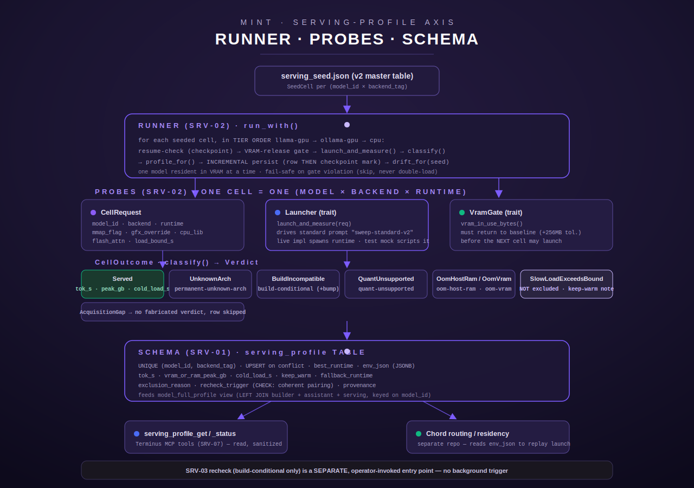

[← MINT overview](README.md)

# MINT · Serving-Profile Evaluation Axis

The serving-profile axis is the third leg of MINT's model-intake evaluation harness,
alongside the coder/builder axis (S83, correctness on a code-generation suite) and the
assistant axis (S84, personality/instruction-following via panel scoring). It answers a
different question from either of those: **not "is this model any good," but "how does
this model behave once it is actually SERVED as a backend"** — what throughput it
sustains, how long it takes to cold-load, how much VRAM/RAM it pins, which runtimes can
even load its weights, and what to do when a runtime can't.

This page covers the harness end-to-end: the probe/classifier layer that touches a real
runtime, the runner that orchestrates a fleet-wide sweep, the schema the results land in,
and the operator entry points. Source: `src/intake/serving/{mod.rs,schema.rs,probes.rs,runner.rs}`
in the Terminus MCP hub repo.

## Table of contents

- [What this axis measures, and what it deliberately does not](#what-this-axis-measures-and-what-it-deliberately-does-not)
- [Core identity and vocabulary](#core-identity-and-vocabulary)
- [The probe layer (`probes.rs`)](#the-probe-layer-probesrs)
- [The classifier: `CellOutcome` → `Verdict`](#the-classifier-celloutcome--verdict)
- [The runner (`runner.rs`)](#the-runner-runnerrs)
- [Seed-driven, drift-aware](#seed-driven-drift-aware)
- [Resume / checkpointing](#resume--checkpointing)
- [GPU coordination](#gpu-coordination)
- [The SRV-03 recheck mode (build-conditional rows only)](#the-srv-03-recheck-mode-build-conditional-rows-only)
- [Schema (`schema.rs`)](#schema-schemars)
- [Config knobs / env vars](#config-knobs--env-vars)
- [Error and edge cases the code actually handles](#error-and-edge-cases-the-code-actually-handles)
- [Entry points: how a run actually gets invoked](#entry-points-how-a-run-actually-gets-invoked)
- [Worked example](#worked-example)
- [Diagram](#diagram)

## What this axis measures, and what it deliberately does not

Per the module doc comment (`src/intake/serving/mod.rs:1-31`), the serving dimension owns:

- the serving-profile DB schema + idempotent migration,
- the shared types every writer/reader uses: `ServingProfile`, `Runtime`,
  `ExclusionReason`, `RecheckTrigger`, `ServingBackend`.

One `ServingProfile` row exists per **(model × serving backend)**: the chosen
`best_runtime` and its launch env (gfx override / cpu lib / mmap flag / flash-attn), the
measured `tok_s` / `vram_or_ram_peak_gb` / `cold_load_s`, a `keep_warm` flag for big
slow-loading MoEs, a nullable `fallback_runtime`, and the exclusion bookkeeping
(`exclusion_reason` / `recheck_trigger`) that explains why a faster runtime was *not*
chosen and whether a llama.cpp build bump should prompt a re-test.

This is explicitly **not** a correctness/quality axis. It never runs a scored eval suite
against the model's output; the "standard prompt" it drives (`STANDARD_PROMPT_ID =
"sweep-standard-v2"`, `probes.rs:44`) exists purely to get a comparable tok/s reading, not
to judge the response. Quality lives on the coder and assistant axes; this axis is purely
about the SERVING characteristics of the backend.

## Core identity and vocabulary

**Model identity is byte-identical to S83/S84.** The serving dimension joins the coder
(S83/MINT) and assistant (S84) sides on the same `model_id`. `ModelId` is re-exported
unchanged from `super::assistant` (`mod.rs:40`) — serving invents no new normalization.
`ModelId::from_registry_key` is a documented pass-through: no lowering, trimming, or
tag-stripping (asserted by the `model_id_is_pass_through_byte_identical_to_s83` test,
`mod.rs:352-361`, over inputs like `"Qwen3:8B"`, `"  spaced  "`, `"gpt-oss:20b"`).

**`Runtime`** (`mod.rs:47-85`) — a concrete launch target, stored as its lowercase kebab
wire string:

| Variant | Wire string | What it is |
|---|---|---|
| `LlamaCpp` | `llama-cpp` | llama.cpp-rocm (HIP `llama-server`) — broadest + most VRAM-efficient; the tier that gets `--no-mmap` for staged/large weights |
| `Ollama` | `ollama` | ollama-rocm — serves the archs the current llama.cpp build rejects (gemma4 / gpt-oss / glm / qwen3.5-6) |
| `Cpu` | `cpu` | genuine CPU — the slow last-resort fallback |

**`ServingBackend`** (`mod.rs:87-138`) — the THREE-tier backend a row is keyed on. This is
deliberately finer than S84's two-tier `gpu`/`cpu` hardware tag, because a model can serve
under llama.cpp-rocm OR ollama-rocm on the *same* GPU and those are distinct rows with
different runtimes/env:

| Variant | Wire string |
|---|---|
| `LlamaGpu` | `llama-gpu` |
| `OllamaGpu` | `ollama-gpu` |
| `Cpu` | `cpu` |

`ServingBackend::all()` returns the three in **routing order**: `llama-gpu` →
`ollama-gpu` → `cpu` (broadest GPU runtime first, CPU last) — this is the tier order the
runner iterates candidate runtimes in.

**`ExclusionReason`** (`mod.rs:140-193`) — why a faster runtime was *not* chosen on a given
backend. `None` (wire `"none"`) means no exclusion — the recorded runtime is the chosen
one. The other five variants:

| Variant | Wire string | Meaning |
|---|---|---|
| `PermanentUnknownArch` | `permanent-unknown-arch` | The build has no handler at all for the arch (e.g. `gptoss`, `glm4`). Permanent until upstream adds it. |
| `BuildConditional` | `build-conditional` | Arch is recognized but this build's loader can't read the GGUF (e.g. gemma4 tensor-graph count mismatch, qwen3.5/3.6 rope-metadata schema 4≠3). MAY flip on a newer llama.cpp build. |
| `QuantUnsupported` | `quant-unsupported` | The model's quantization is unsupported by the runtime. |
| `OomHostRam` | `oom-host-ram` | Out of host RAM (ollama's host-RAM pre-flight, or genuine CPU-tier residency). |
| `OomVram` | `oom-vram` | Out of VRAM on the GPU. |

**`RecheckTrigger`** (`mod.rs:201-239`) — what event should prompt a re-test:
`None` (`"none"`, the default — nothing will change the verdict) or
`LlamaCppVersionBump` (`"llama-cpp-version-bump"`, advisory metadata the SRV-03 recheck
mode keys off — **not** an automated background sweep).

**Coherence invariant.** `ServingProfile::validate()` (`mod.rs:294-328`) rejects two
self-contradictory combinations *before* a row can reach the DB:

- `recheck_trigger = llama-cpp-version-bump` is valid **only** paired with
  `exclusion_reason = build-conditional` — e.g. `permanent-unknown-arch +
  llama-cpp-version-bump` is rejected as a contradiction (a permanent reason can't also be
  advertised as reversible on a build bump).
- `exclusion_reason = build-conditional` **requires** the version-bump trigger — a
  build-conditional row that claims it will never be rechecked contradicts its own
  definition.

Every write path calls `validate()` first (see `schema::upsert_serving_profile`,
`schema.rs:296-298`), and the SQL schema carries the identical check as a DB-level
`CONSTRAINT serving_profile_recheck_coherent` (`schema.rs:86-91`) — the invariant is
enforced at both the application boundary and the database boundary.

## The probe layer (`probes.rs`)

This is the layer that actually touches a runtime. Per the module doc (`probes.rs:1-36`):
it launches a model on one tier, drives the fixed standard prompt, and reports a raw
`CellOutcome`. The runner (below) turns raw outcomes into persisted `ServingProfile` rows.

### Trait-driven for GPU-free testing

Both side-effecting surfaces are traits with a live implementation seam and a
deterministic test mock (`probes.rs:10-19`):

- **`Launcher`** (`probes.rs:228-231`) — `async fn launch_and_measure(&self, req:
  &CellRequest) -> CellOutcome`. Launches a model on a tier, runs the standard prompt,
  returns a raw outcome. Documented contract: **must not panic** — every failure maps to
  a `CellOutcome` variant. The live implementation (a real process spawn) lands alongside
  Chord in SRV-04 and is not present in this module; only the trait and the seam exist
  here today.
- **`VramGate`** (`probes.rs:236-241`) — `async fn vram_in_use_bytes(&self) -> Result<u64,
  String>`. Reads the amdgpu VRAM counter. The live impl reads the sysfs path from config;
  tests script the counter.

### `CellRequest` — what a launcher needs

`CellRequest` (`probes.rs:192-207`) carries no infra literal — the launcher resolves
binaries/endpoints/sysfs from config/vault. Fields:

| Field | Type | Meaning |
|---|---|---|
| `model_id` | `ModelId` | which model |
| `backend` | `ServingBackend` | which of the three tiers |
| `runtime` | `Runtime` | which concrete runtime |
| `mmap_flag` | `Option<u8>` | `Some(0)` ⇒ `--no-mmap`; `None` ⇒ this tier has no mmap path (ollama / cpu) |
| `gfx_override` | `bool` | whether the gfx override env is set |
| `cpu_lib` | `Option<String>` | the CPU-library override (`OLLAMA_CPU_LIBRARY`), if any |
| `flash_attn` | `bool` | FlashAttention on (ollama tiers) |
| `load_bound_s` | `f64` | generous per-cell cold-load bound, seconds |

`CellRequest::env_json()` (`probes.rs:213-222`) serializes `{gfx_override, mmap_flag,
flash_attn, cpu_lib, standard_prompt_id}` — this is exactly what lands in the persisted
`env_json` column, so a downstream reader (Chord) can replay the exact launch. Recording
the mmap flag specifically (not just applying it) is called out in the module doc as a
hard v2 requirement.

### `CellOutcome` — every measured shape a cell can end in

`CellOutcome` (`probes.rs:49-81`) is an exhaustive enum; each variant maps 1:1 to a
distinct outcome in the v2 master sweep table:

| Variant | Carries | Meaning |
|---|---|---|
| `Served` | `tok_s: f64, peak_gb: f64, cold_load_s: f64` | Loaded and served the standard prompt — the measured numbers a row persists |
| `UnknownArch` | `error: String` | Runtime rejected the model with an unknown-architecture loader error (e.g. `"unknown model architecture: 'gptoss'"`). Permanent in this build. |
| `BuildIncompatible` | `error: String` | Runtime recognized the arch but this build's loader can't read the GGUF (gemma4 tensor-graph, qwen3.5moe rope schema). May flip on a newer build. |
| `QuantUnsupported` | `error: String` | Runtime read the file but can't handle its quantization/file_type (e.g. ollama's qwen3moe runner nil-panics on BF16). |
| `OomHostRam` | `error: String` | Out of host RAM — ollama's system-RAM pre-flight refused, or genuine CPU tier can't fit the weights (e.g. a 42GB model on 31GB system RAM). |
| `OomVram` | `error: String` | Out of GPU VRAM under the configured ceiling. |
| `SlowLoadExceedsBound` | `bound_s: f64` | Cold load blew even the generous bound. **Recorded distinctly from an arch hang** — see below. |
| `AcquisitionGap` | `detail: String` | Weights are absent (not in store, not staged). No verdict is fabricated. |

### The v1→v2 lesson, in code: slow load ≠ arch hang

The doc comment (`probes.rs:31-36`) and the classifier both call out one specific,
load-bearing distinction: `SlowLoadExceedsBound` is **not** treated as an
arch-unsupported exclusion. In v1 of the manual sweep, a cold load that page-faulted
against NAS-staged weights under `mmap` was mistaken for a hang and mislabeled
arch-unsupported; under `--no-mmap` the same model loads fine — it's just slow. `classify`
maps this outcome to its own `Verdict::SlowLoad` variant (not `Excluded`), and the runner
records it as a note plus a keep-warm candidate rather than excluding the model.

### `requires_no_mmap` — the `--no-mmap` rule

```rust
pub fn requires_no_mmap(backend: ServingBackend, staged: bool, weight_gb: Option<f64>, large_threshold_gb: f64) -> bool
```
(`probes.rs:173-178`) Only ever `true` on the `LlamaGpu` tier (ollama manages its own
loading; CPU has no mmap path in this harness). `true` when the weights are NAS-staged
(`staged`) **or** the weight size meets/exceeds `large_threshold_gb`. The runner
re-derives this per cell (see below) rather than trusting a seed value, so a newly added
model without an explicit mmap flag still gets the rule applied.

### `is_sharded_gguf` — sharded-GGUF detection

```rust
pub fn is_sharded_gguf(path_or_name: &str) -> bool
```
(`probes.rs:184-188`) Detects the canonical llama.cpp split naming
(`-00001-of-00003.gguf` — matches on `"-of-"` and `"-0000"` substrings, case-insensitive).
The reason this matters: `ollama create` from shard-1 alone imports metadata only (0
tensors), which nil-panics. A sharded model must be merged first (or routed to llama.cpp
pointing at shard-1, which auto-loads the rest). The runner consults this before an
ollama-tier cell and attaches a merge-first note when it fires.

### VRAM-release gate

```rust
pub const VRAM_BASELINE_TOLERANCE_BYTES: u64 = 256 * 1024 * 1024;
pub fn vram_released(in_use_bytes: u64, baseline_bytes: u64, tolerance_bytes: u64) -> bool
```
(`probes.rs:243-252`) A reading at or below `baseline + tolerance` counts as "released."
This is the mechanical half of the one-model-in-VRAM-at-a-time invariant; the runner is
what actually gates the *next* launch on this returning `true` (see below).

## The classifier: `CellOutcome` → `Verdict`

```rust
pub fn classify(outcome: &CellOutcome) -> Verdict
```
(`probes.rs:128-164`) is, per its own doc comment, "the heart of the sweep-lessons in
code." `Verdict` (`probes.rs:91-113`) is the classifier's output: the persisted exclusion
bookkeeping plus whether the cell actually served, so the runner knows whether to keep
measured numbers. The pairing rules, verbatim from the source:

| `CellOutcome` | `Verdict` | `(ExclusionReason, RecheckTrigger)` |
|---|---|---|
| `Served` | `Works{tok_s,peak_gb,cold_load_s}` | n/a (not excluded) |
| `UnknownArch` | `Excluded` | `(PermanentUnknownArch, None)` |
| `BuildIncompatible` | `Excluded` | `(BuildConditional, LlamaCppVersionBump)` — the **only** pair carrying the version-bump trigger |
| `QuantUnsupported` | `Excluded` | `(QuantUnsupported, None)` |
| `OomHostRam` | `Excluded` | `(OomHostRam, None)` |
| `OomVram` | `Excluded` | `(OomVram, None)` |
| `SlowLoadExceedsBound` | `SlowLoad{bound_s}` | not an exclusion at all |
| `AcquisitionGap` | `AcquisitionGap{detail}` | no verdict fabricated |

Every `Excluded` pairing this function can ever produce is, by construction, one of the
two coherent combinations `ServingProfile::validate()` accepts — the classifier cannot
produce a contradictory row.

## The runner (`runner.rs`)

The runner (S85 SRV-02) formalizes the hand-run GPU serving sweep (v1+v2+arch-confirmation)
into a repeatable harness. Per its module doc (`runner.rs:1-31`): for each model × candidate
runtime **in tier order**, it does a bounded smoke-serve, measures, classifies, and persists
a `ServingProfile` row keyed on the S83-identical `model_id` + the three-tier `backend_tag`.
It is reboot-survivable and resumable, mirroring the S84 assistant-axis runner's checkpoint
pattern.

### The testable core: `run_with`

```rust
pub async fn run_with(
    cells: &[SeedCell],
    threshold_s: f64,
    baseline_vram_bytes: u64,
    launcher: &dyn Launcher,
    sink: &dyn ProfileSink,
    gate: &dyn VramGate,
    checkpoint: &dyn Checkpoint,
) -> Result<RunReport, ToolError>
```
(`runner.rs:414-562`) is entirely trait-driven — no DB, no network, no GPU required when
the four traits are mocked, which is how it's exercised in tests. Per seeded cell, in
order:

1. **Resume check** — if `(model_id, backend_tag)` is already in the checkpoint's `done`
   set, skip it and record it as resumed (`runner.rs:449-459`).
2. **VRAM-release gate** — if the *previous* cell put a model in VRAM, confirm the gate
   reports release-to-baseline before launching this one. On gate failure the runner
   **fails safe**: it records the violation as a skip reason and does **not** launch —
   it never risks two models resident at once (`runner.rs:464-475`).
3. **Build the `CellRequest`** via `build_request`, which re-derives `requires_no_mmap`
   rather than trusting the seed's own mmap field (`runner.rs:294-326`).
4. **Sharded-GGUF check** on the ollama tier — attaches a merge-first note
   (`runner.rs:480-487`).
5. **Launch + measure** via the `Launcher` trait; `launched_prev` is set to `true` only
   for `Served` or `SlowLoadExceedsBound` outcomes (both put a model in VRAM), so the
   next iteration's gate check knows whether it needs to wait (`runner.rs:491-492`).
6. **Classify** the outcome, and surface load-bearing notes: a slow-load note
   ("slow-load-exceeds-bound (Ns) — DISTINCT from arch hang; keep-warm candidate"), or —
   specifically for an `OomHostRam` exclusion on the `OllamaGpu` tier — a fallback note
   pointing at llama.cpp-rocm `--no-mmap` as the next thing to try, since that path
   bypasses ollama's host-RAM pre-flight check (`runner.rs:497-514`).
7. **Diff against the seed** (`drift_for`) — see [Seed-driven, drift-aware](#seed-driven-drift-aware).
8. **Acquisition gap** ⇒ no row is persisted; the cell is still checkpointed as "done"
   (nothing to retry), with the provenance note carried through as the report note
   (`runner.rs:521-535`).
9. Otherwise, build the `ServingProfile` via `profile_for` and **persist incrementally**:
   the row is written to the sink **before** the checkpoint mark, so a crash between the
   two re-runs the cell on resume — an idempotent UPSERT, never a lost or duplicated row
   (`runner.rs:541-550`).

### `keep_warm` derivation

```rust
pub fn keep_warm_from_cold_load(cold_load_s: Option<f64>, threshold_s: f64) -> bool
```
(`runner.rs:329-331`) — `true` iff `cold_load_s > threshold_s`; `None` (no measured cold
load, i.e. an exclusion row) is never warm. `threshold_s` defaults to the seed's own
declared threshold, overridable by config (see below).

## Seed-driven, drift-aware

The runner is **seeded** from `SERVING_SEED_JSON`, an embedded JSON file
(`include_str!("corpora/serving_seed.json")`, `runner.rs:47`) — the v2 master table,
carrying the expected baseline verdict for every known (model × backend) cell plus the
declared `keep_warm_threshold_secs` (`SeedFile`, `runner.rs:93-97`). Each `SeedCell`
(`runner.rs:60-81`) carries the model id, backend tag, expected runtime, expected env
(`SeedEnv`: `gfx_override`, `mmap_flag`, `flash_attn`, `cpu_lib`), the expected measured
numbers, `keep_warm`, `fallback_runtime`, `exclusion_reason`/`recheck_trigger`, optional
`provenance`, and the `staged`/`weight_gb` hints that drive the `--no-mmap` rule.

Critically, **the seed is not a fixture the runner trusts blindly — it is what a run is
checked against.** A run replays each seeded cell through the (mockable) `Launcher`,
classifies the live outcome, and compares it to the seed via `drift_for`
(`runner.rs:384-405`), which diffs on the exclusion-reason axis (the routing-relevant one):
agreement ⇒ "reproduced v2," disagreement ⇒ a `DriftEntry` in the run's `DriftReport`
(e.g. a `build-conditional` model that now serves after a llama.cpp bump). `DriftReport`
(`runner.rs:248-257`) is `.is_clean()` when its entries list is empty.

`LARGE_WEIGHT_THRESHOLD_GB: f64 = 30.0` (`runner.rs:52`) is the mid-size/large-MoE split
point the `--no-mmap` rule uses when re-deriving the mmap requirement per cell.

## Resume / checkpointing

`Checkpoint` (`runner.rs:139-143`) is the reboot-survivable resume ledger:

```rust
async fn done(&self) -> Result<BTreeSet<CheckpointKey>, String>;
async fn mark(&self, key: &CheckpointKey) -> Result<(), String>;
```

`done` is read once at startup; `mark` is durable **before** the runner advances to the
next cell, so an interruption never loses a persisted row and never double-runs one.

`FileCheckpoint` (`runner.rs:148-196`) is the live implementation: append-only,
newline-delimited JSON at `<INTAKE_STAGING_DIR>/srv02-checkpoint.json`, resolved via
`config::intake_staging_dir()` — `Err(NotConfigured)`, not a guess, when staging is
unconfigured. `read_all` tolerates a missing/unparseable file by returning an empty set
rather than erroring, so a first run with no prior checkpoint just starts clean.

## GPU coordination

The one-model-in-VRAM-at-a-time invariant is enforced entirely through the `VramGate`
trait and `ensure_vram_released` (`runner.rs:218-228`), which the main loop calls before
every cell after the first. This module does not itself implement a cross-process GPU
lock; for the broader fleet-wide GPU-authority coordination MINT uses when a serving sweep
shares the host with other intake work, see the GPU-authority and durability
documentation elsewhere in this docs tree rather than duplicating that mechanism's design
here — this page covers only the serving-specific VRAM-baseline check the runner performs
between its own cells.

## The SRV-03 recheck mode (build-conditional rows only)

A second orchestrator, `recheck_with` (`runner.rs:681-814`), implements a deliberately
narrow, **operator-invoked-only** mode: after a llama.cpp upgrade, re-test *only* the rows
flagged `recheck_trigger = llama-cpp-version-bump` on the llama.cpp-rocm tier — the build
that might now read those GGUFs.

- **Selector.** `select_build_conditional` (`runner.rs:600-605`) picks exactly the rows
  where `recheck_trigger == LlamaCppVersionBump`. Because that trigger is coherent *only*
  with `exclusion_reason == BuildConditional` (the `validate()` invariant), keying on the
  trigger alone correctly excludes permanent-unknown-arch rows, working rows, and
  quant/OOM rows — verified by `selector_picks_only_build_conditional_rows`
  (`runner.rs:1062-1075`).
- **Request rebuild.** `recheck_request` (`runner.rs:612-633`) recovers the launch env
  (`gfx_override`, `mmap_flag`, `flash_attn`, `cpu_lib`) from the row's own stored
  `env_json`, so the recheck launches the model exactly as the original sweep did. A
  missing `mmap_flag` in the stored env defaults to `Some(1)` (mmap on), never `None`
  (which would misread as "no mmap path" on a llama.cpp cell).
- **On flip** (the model now serves): the row is rewritten with `best_runtime` staying
  llama.cpp, `fallback_runtime` cleared (it now serves on its best tier), `exclusion_reason
  → None`, `recheck_trigger → None`, the freshly measured numbers, recomputed `keep_warm`,
  and a `provenance` note `"flipped build-conditional → works at llama.cpp build
  {build_id}"`. A `DriftEntry` is emitted.
- **On no change** (still build-incompatible, or any other non-serving outcome): the row's
  verdict is left byte-identical, but it is **still re-persisted** (idempotent UPSERT) so
  `run_id`/`updated_at` reflect the attempt, carrying the note `"still build-incompatible
  at build {build_id}"`.
- Uses the **same** `VramGate` and `Checkpoint` machinery as the main runner — one model
  in VRAM at a time, resumable.
- Zero build-conditional rows ⇒ `RecheckReport.nothing_to_recheck = true`, clean exit, no
  cells touched (`runner.rs:702-706`).

The live entry point, `recheck_build_conditional` (`runner.rs:826-853`), resolves the
*current* llama.cpp build id from `config::llama_cpp_build_id()` — returning
`NotConfigured` rather than ever guessing or defaulting to an empty string — and the
keep-warm threshold, then calls `recheck_with`.

**This mode is genuinely not automated.** The doc comment is explicit: "This is NOT a
background sweep and NOT wired to any version detection; it runs ONLY when `recheck_with`
is called." A dedicated test, `no_background_recheck_trigger_wired`
(`runner.rs:1094-1123`), scans the module's own non-test source for scheduling primitives
(`tokio::spawn`, `tokio::time::interval`, `spawn_blocking`, `cron`, `Scheduler`,
`watch_version`, `set_interval`, `thread::spawn`) and asserts none appear — a recheck run
happens if and only if an operator (or an operator-driven script) invokes it.

## Schema (`schema.rs`)

### `serving_profile` table

Created idempotently via `CREATE TABLE IF NOT EXISTS` (`schema.rs:56-127`) — safe to call
on every run; the SRV-02 runner calls `migrate()` before every write. Columns:

| Column | Type | Notes |
|---|---|---|
| `id` | `BIGSERIAL PRIMARY KEY` | |
| `run_id` | `UUID NOT NULL` | |
| `model_id` | `TEXT NOT NULL` | S83-identical registry key, verbatim |
| `backend_tag` | `TEXT NOT NULL` | `CHECK` in `('llama-gpu','ollama-gpu','cpu')` |
| `best_runtime` | `TEXT NOT NULL` | `CHECK` in `('llama-cpp','ollama','cpu')` |
| `env_json` | `JSONB NOT NULL DEFAULT '{}'` | the launch env recorded by `CellRequest::env_json()` |
| `tok_s` | `DOUBLE PRECISION` (nullable) | `NULL` for a cell that never served |
| `vram_or_ram_peak_gb` | `DOUBLE PRECISION` (nullable) | peak footprint during the serve |
| `cold_load_s` | `DOUBLE PRECISION` (nullable) | wall-clock cold-load seconds; drives `keep_warm` |
| `keep_warm` | `BOOLEAN NOT NULL DEFAULT false` | |
| `fallback_runtime` | `TEXT` (nullable) | `CHECK` `NULL` or one of the runtime strings |
| `exclusion_reason` | `TEXT NOT NULL DEFAULT 'none'` | `CHECK` against the six wire strings |
| `recheck_trigger` | `TEXT NOT NULL DEFAULT 'none'` | `CHECK` against the two wire strings |
| `provenance` | `TEXT` (nullable) | e.g. the "verdict by inference, weights absent at confirmation time" honesty case |
| `updated_at` | `TIMESTAMPTZ NOT NULL DEFAULT now()` | bumped on every UPSERT |
| — | `CONSTRAINT serving_profile_recheck_coherent CHECK (...)` | mirrors `ServingProfile::validate()` at the DB boundary |

Indexes: a **unique** index `uq_serving_profile_model_backend` on `(model_id,
backend_tag)` — this is the UPSERT conflict target, so re-running the harness overwrites
the row for the same backend, never duplicates it; plus non-unique indexes on `keep_warm`
and `recheck_trigger` (`schema.rs:100-122`) for the operational queries those flags exist
to answer (find keep-warm candidates, find recheck candidates).

### The write path: `upsert_serving_profile`

```rust
pub async fn upsert_serving_profile(pool: &PgPool, run_id: uuid::Uuid, profile: &ServingProfile) -> Result<(), ToolError>
```
(`schema.rs:291-341`) validates the profile's enum coherence *first* — a contradictory row
never even reaches a bind — then performs an `INSERT ... ON CONFLICT (model_id,
backend_tag) DO UPDATE SET ...` that overwrites every measured/derived column plus bumps
`updated_at`. This is the canonical write path for both the SRV-02 sweep runner and the
SRV-03 recheck mode.

### `model_full_profile` view

`create_full_profile_view` (`schema.rs:138-267`) creates/replaces a view that extends
S84's `model_dual_profile` (builder + assistant) with the serving side. Because the
builder/assistant sides use the coarser `gpu`/`cpu` hardware tag while serving uses the
three-tier `llama-gpu`/`ollama-gpu`/`cpu` tag, the view deliberately does **not** try to
force a single shared backend-tag column — it joins all three CTEs on `model_id` only and
surfaces each side's own tag in its own column. The `serving` CTE aggregates
`serving_row_count`, `bool_or(keep_warm)` as `serving_any_keep_warm`, and an
`array_agg(backend_tag ORDER BY backend_tag)` as `serving_backends`. The overall key set
is the `UNION` of every side's `model_id`s, so a model present in *any* one, two, or all
three axes appears exactly once, with `has_builder_profile` / `has_assistant_profile` /
`has_serving_profile` booleans. (Two defensive `column_exists` probes,
`builder_has_backend_tag` and `builder_has_mem_config`, guard against querying columns the
assistant-axis migration hasn't added yet on a DB where serving's `migrate()` ran first —
see `schema.rs:150-172` and the regression tests around them.)

## Config knobs / env vars

Every value below is read via `crate::config` helpers — names only, no values, per this
docs set's PII policy:

| Env var | Helper | Used for |
|---|---|---|
| `INTAKE_DATABASE_URL` (falls back to `DATABASE_URL`) | `config::intake_database_url` | the shared intake Postgres pool `schema::get_pool()` connects to |
| `INTAKE_STAGING_DIR` | `config::intake_staging_dir` | the reliable staging dir the SRV-02 resume checkpoint file lives under |
| `SERVING_KEEP_WARM_THRESHOLD_SECS` | `config::serving_keep_warm_threshold_secs` | overrides the keep-warm cold-load threshold; the seed's own declared threshold is the fallback |
| `LLAMA_CPP_BUILD_ID` | `config::llama_cpp_build_id` | the current llama.cpp build id the SRV-03 recheck mode records against; `NotConfigured` (not a guess) when unset |
| `CHORD_RESIDENCY_STATE_PATH` | `config::chord_residency_state_path` | the residency-snapshot file the `serving_residency_status` MCP tool reads (SRV-07) |
| `CHORD_CONTROL_URL` | `config::chord_control_url` | the Chord control endpoint the `serving_profile_refresh` MCP tool POSTs to (SRV-07) |

`resolve_threshold()` (`runner.rs:860-868`) is the precedence rule for the keep-warm
threshold: an explicit `SERVING_KEEP_WARM_THRESHOLD_SECS` wins if it differs from the
config default of `120.0`; otherwise the seed's own declared `keep_warm_threshold_secs`
is used; otherwise the `120.0` default itself.

## Error and edge cases the code actually handles

- **DB unreachable at connect time** — `schema::get_pool()` returns `ToolError::Database`
  with the underlying error wrapped in a generic message (`schema.rs:37-48`); no secret
  or raw connection string is echoed at the tool-output layer (see `serving_tools.rs`'s
  `store_unavailable()` helper).
- **Staging dir unconfigured** — `FileCheckpoint::open()` returns `ToolError::NotConfigured`
  rather than defaulting to a guessed path (`runner.rs:155-162`).
- **Malformed checkpoint lines** — `FileCheckpoint::read_all` silently drops any line that
  fails to parse as JSON rather than erroring the whole read (`runner.rs:167-176`);
  effectively self-healing against a partially-corrupted append.
- **VRAM not released** — the runner does not retry or poll; it fails the cell for *this
  run only* (records a skip reason) and moves to consider the *next* cell, deliberately
  never risking a double-load (`runner.rs:464-475`).
- **Acquisition gap (weights absent)** — no verdict is fabricated; the cell is recorded as
  a skip with a reason and its provenance carried through, and it's still checkpointed as
  "done" since there's nothing to retry (`runner.rs:521-535`). This is the documented
  "glm-4.7-flash provenance case": a verdict recorded by inference when the weights
  weren't available to confirm at intake time.
- **Ollama host-RAM refusal is not a dead end** — specifically detected and annotated with
  a fallback suggestion (llama.cpp-rocm `--no-mmap`, which bypasses ollama's own host-RAM
  pre-flight check) rather than just being recorded as a terminal exclusion
  (`runner.rs:503-512`).
- **Sharded GGUF on the ollama tier** — detected before launch and annotated with a
  merge-first note, rather than allowed to hit ollama's known nil-panic-on-shard-1
  behavior (`runner.rs:480-487`).
- **A `build_request` given an unparseable `backend_tag`/`best_runtime` string** — returns
  `ToolError::InvalidArgument` rather than panicking (`runner.rs:295-298`); the outer loop
  in `run_with` handles an unparseable `backend_tag` from a seed cell itself as a
  per-cell skip with a reason, not a whole-run abort (`runner.rs:433-445`).
- **Unrecognized `exclusion_reason` string when reconstructing a seed's expected verdict**
  — the test helper `seed_verdict` explicitly panics rather than silently defaulting
  (`runner.rs:979`), so a typo'd or newly-invented seed value fails loudly at test time
  instead of silently passing.

## Entry points: how a run actually gets invoked

As of this module's current state, **there is no dedicated `mint serving` subcommand.**
The `mint` CLI (`src/bin/mint.rs`) exposes `sweep coder`, `sweep assistant`, `case`,
`gaps`, `gpu {status,acquire,release}`, `supervisor {run,install,uninstall}`, and
`fetch-model` — none of these dispatch into `intake::serving::runner`. The serving-profile
runner's public entry points (`run_with`, `recheck_with`,
`recheck_build_conditional`) exist as a library seam with a concrete
`FileCheckpoint`/schema-backed persistence path, but the live
`SystemLauncher`/`PgProfileSink`/`SysfsVramGate` wiring that would turn this into a
runnable CLI/service command is explicitly deferred — the runner's own doc comment notes
"the concrete live `SystemLauncher` / `PgProfileSink` / `SysfsVramGate` land alongside
Chord in SRV-04" (`runner.rs:855-859`). If a `mint serving` subcommand exists in a later
sweep, it is not present in the source this page was written against — check
`src/bin/mint.rs`'s `Command` enum directly rather than assuming.

What **is** live and reachable today is the **read/operate side**, exposed as three
Terminus MCP tools in `src/tools/serving_tools.rs` (S85 SRV-07):

- **`serving_profile_get(model_id)`** — returns a model's serving row(s) across backends:
  runtime, launch-flag *names* only (never their values — see sanitization below), tok/s,
  `keep_warm`, exclusion reason, fallback, provenance. An unprofiled model gets a clear
  "No serving profile for model '…'" result, not an error.
- **`serving_residency_status()`** — reads a residency snapshot (from
  `CHORD_RESIDENCY_STATE_PATH`) and reports current residents by role
  (`chat`/`keep-warm`/`transient`), free/baseline VRAM, and the pinned chat model. A
  missing snapshot file is treated as IDLE (0 residents, free VRAM at baseline), not an
  error — Chord simply hasn't written one yet.
- **`serving_profile_refresh()`** — the one *mutating* tool of the three: POSTs to
  `<CHORD_CONTROL_URL>/serving/reload` to signal Chord to reload its routing map from the
  DB after the harness has written new rows. An unreachable Chord or non-2xx response
  surfaces as a generic error — the control URL/host is never echoed into the tool output.

All three tools reduce `env_json` to its **key set only** (`env_flag_names`,
`serving_tools.rs:53-59`) when formatting output — launch-flag *names* like
`gfx_override`/`mmap_flag`/`cpu_lib` are shown, but their *values* (which can carry a gfx
architecture id or a library path) never are. This is the S6 sanitization rule enforced at
the tool-output boundary, independent of and in addition to the general PII-path
discipline this docs set follows.

## Worked example

A `serving_profile_get` call for a model with two profiled backends might render as:

```
Serving profile for 'qwen3:8b' (2 backend(s)):

• backend=llama-gpu runtime=llama-cpp fallback=ollama
  keep_warm=false tok/s=42.4 peak_gb=7.5 cold_load_s=12
  launch_flags=[cpu_lib, flash_attn, gfx_override, mmap_flag]
  exclusion=none recheck=none

• backend=ollama-gpu runtime=ollama
  keep_warm=false tok/s=38.1 peak_gb=8.2 cold_load_s=15
  launch_flags=[cpu_lib, flash_attn, gfx_override]
  exclusion=none recheck=none
```

And a build-conditional exclusion (the shape a `BuildIncompatible` `CellOutcome` produces
after classification and persistence) renders as:

```
Serving profile for 'gemma4:26b' (1 backend(s)):

• backend=llama-gpu runtime=llama-cpp
  keep_warm=false
  launch_flags=[cpu_lib, flash_attn, gfx_override, mmap_flag]
  exclusion=build-conditional recheck=llama-cpp-version-bump
  provenance: flipped build-conditional → works at llama.cpp build <build-id>
```

(This second example's `provenance` line is only present *after* a successful SRV-03
recheck flip; a never-yet-rechecked build-conditional row typically carries no
provenance, or a note describing the original build-incompatibility.)

The underlying `ServingProfile` Rust value behind the first row above (illustrative, not a
literal test fixture) would be:

```rust
ServingProfile {
    model_id: ModelId::from("qwen3:8b"),
    backend_tag: ServingBackend::LlamaGpu,
    best_runtime: Runtime::LlamaCpp,
    env_json: r#"{"cpu_lib":null,"flash_attn":false,"gfx_override":true,"mmap_flag":1,"standard_prompt_id":"sweep-standard-v2"}"#.into(),
    tok_s: Some(42.4),
    vram_or_ram_peak_gb: Some(7.5),
    cold_load_s: Some(12.0),
    keep_warm: false,
    fallback_runtime: Some(Runtime::Ollama),
    exclusion_reason: ExclusionReason::None,
    recheck_trigger: RecheckTrigger::None,
    provenance: None,
}
```

## Diagram



The seed (`serving_seed.json`) drives the runner, which builds a `CellRequest` per cell,
dispatches it through the `Launcher` trait (gated between cells by `VramGate`), classifies
the resulting `CellOutcome` into a `Verdict`, and persists a coherent `ServingProfile` row
into the `serving_profile` table — which in turn feeds the `model_full_profile` view and
is read by the SRV-07 Terminus MCP tools and, separately, by Chord's routing/residency
layer (a different repo — see [Chord integration](../../architecture/chord-integration.md)
for how Terminus and Chord divide responsibility). The SRV-03 recheck mode is a distinct,
operator-invoked path with no background trigger, shown in the footer band.

---

[← MINT overview](README.md)
