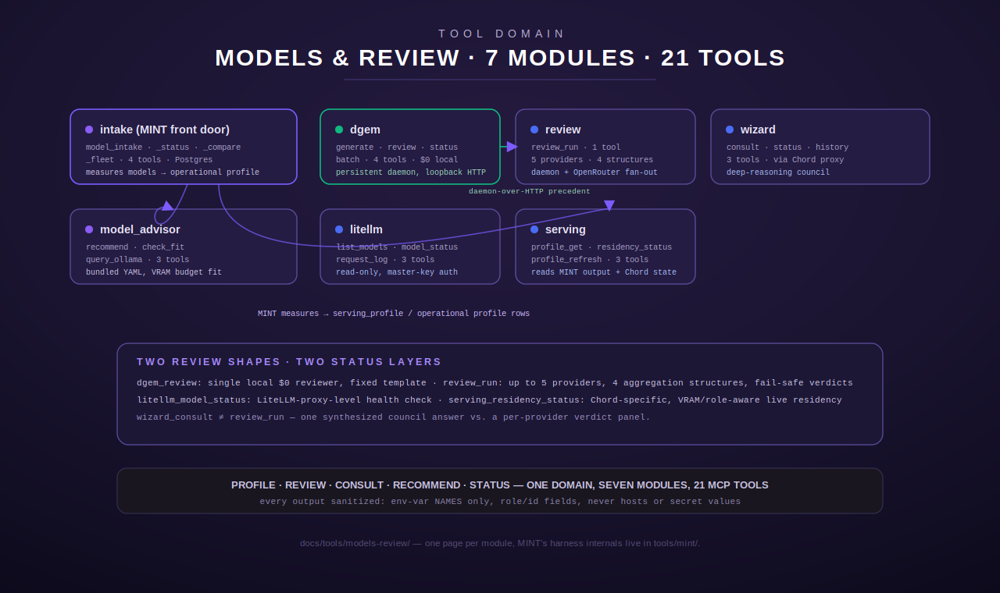

# Models & Review

[← tools index](../README.md) · [← docs index](../../README.md)

Tools for profiling fleet models, reviewing code changes with local or
multi-provider LLM panels, consulting a deep-reasoning council, recommending
model fleets against a VRAM budget, and reading back live serving/proxy
status. Seven tools, 21 actions total.

| Tool | Actions | What it does | Page |
|---|---|---|---|
| `intake` | 4 | The MCP front door to **MINT**, the fleet model-profiling harness: `model_intake` (profile one model), `model_intake_status` (read back a stored profile), `model_intake_compare` (cross-model metric table), `model_intake_fleet` (profile the entire catalog overnight). The harness internals live in the [MINT flagship manual](../mint/README.md); this page covers just the four tool schemas. | [`intake.md`](intake.md) |
| `dgem` | 4 | DiffusionGemma local-inference tools (`dgem_generate`, `dgem_review`, `dgem_status`, `dgem_batch`) — a persistent GPU-host daemon reached over loopback HTTP, the build pipeline's $0 local secondary reviewer. | [`dgem.md`](dgem.md) |
| `review` | 1 | `review_run` — multi-provider (`opus`/`codex`/`agy` via review-daemon, `nemotron`/`qwen_coder` via OpenRouter), multi-structure (`single`/`adversarial_pair`/`panel_majority`/`panel_unanimous`) code/change review with fail-safe verdict aggregation. | [`review.md`](review.md) |
| `wizard` | 3 | Deep-reasoning LLM council consultation through Chord (`wizard_consult`, `wizard_status`, `wizard_history`), with Postgres-backed session history. | [`wizard.md`](wizard.md) |
| `model_advisor` | 3 | VRAM-aware model fleet recommendation from bundled YAML data (`model_advisor_recommend`, `model_advisor_check_fit`, `model_advisor_query_ollama`) — a Rust port of the legacy Python advisor. | [`model_advisor.md`](model_advisor.md) |
| `litellm` | 3 | Read-only status/log queries against a LiteLLM proxy (`litellm_list_models`, `litellm_model_status`, `litellm_request_log`), with graceful not-configured stubs. | [`litellm.md`](litellm.md) |
| `serving` | 3 | Serving-profile control and status (`serving_profile_get`, `serving_residency_status`, `serving_profile_refresh`) — reads the harness's measured serving data and Chord's live residency snapshot, with strict output sanitization (S6). | [`serving.md`](serving.md) |

## How the pieces relate

- **`intake`** (via MINT) *produces* the operational and serving data that
  **`serving`** and **`model_advisor`** *consume* — MINT measures what a model
  actually does; model_advisor's matrix is separate, hand-curated static
  reference data for "what could I run" rather than "what did we measure."
- **`dgem`** and **`review`** are both review surfaces but at different scopes:
  `dgem_review` is a single local $0 reviewer with a fixed prompt template;
  `review_run` fans out to up to 5 providers (including `dgem`'s
  daemon-over-HTTP precedent, reused for `opus`/`codex`/`agy`) and aggregates
  a panel verdict.
- **`wizard`** is a distinct consultation shape from `review_run` — one
  synthesized council answer via Chord, not a per-provider verdict panel.
- **`litellm`** and **`serving`** both report live backend status, but at
  different layers: `litellm_model_status` is a LiteLLM-proxy-level health
  check; `serving_residency_status` is Chord-specific and VRAM/role-aware.

## Conventions used across this domain

Every page here follows the doc-set-wide rules: exact input schemas (field,
type, required/optional, default), output shape, every meaningful
behavior/error branch, environment-variable **names** only (never values),
and a worked request/response example — sourced from the actual registration
site, handler, and argument struct in this repo, never inferred.
