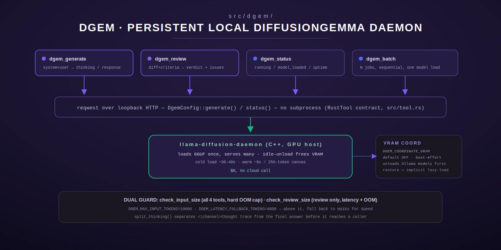

# dgem — DiffusionGemma Local-Inference Tools

[← models-review index](README.md) · [← tools index](../README.md) · [← docs index](../../README.md)

`src/dgem/` provides four MCP tools (`dgem_generate`, `dgem_review`,
`dgem_status`, `dgem_batch`) that drive a **persistent DiffusionGemma HTTP
daemon** (`llama-diffusion-daemon`) running on the GPU host. The daemon loads
its GGUF once and serves many requests, unloading after an idle timeout to
release VRAM — so the first call after a cold/idle period pays a ~36-40s model
load, and subsequent calls are fast (~9s per 256-token canvas). DiffusionGemma
is the build pipeline's **local, $0 secondary reviewer**: no cloud call, no
per-token cost.



## Why HTTP, not a subprocess

The `RustTool` contract forbids `std::process::Command` / subprocess spawning
inside `execute()` (`src/tool.rs`). terminus-rs is linked into chord-proxy,
which runs on the GPU host, so these tools reach the daemon over loopback HTTP
via `reqwest` (`src/dgem/mod.rs:1-14`). The "persistent session" — the model
staying resident across requests, idle-unload freeing VRAM — lives entirely in
the C++ daemon; the Rust side is a thin, stateless HTTP client. This is the
established precedent later reused by the `review` module's `review-daemon`
(see [`review.md`](review.md)).

## Shared configuration (`DgemConfig`, `src/dgem/mod.rs:59-245`)

Every dgem tool shares one `DgemConfig`, built once at registration
(`DgemConfig::from_env()`) and cloned into each tool struct.

| Env var | Purpose | Default |
|---|---|---|
| `DGEM_BASE_URL` | Daemon base URL, takes precedence over bind/port | derived from `DGEM_BIND`/`DGEM_HTTP_PORT` |
| `DGEM_BIND` | Daemon host, used only if `DGEM_BASE_URL` unset | `127.0.0.1` |
| `DGEM_HTTP_PORT` | Daemon port, used only if `DGEM_BASE_URL` unset | `8877` |
| `DGEM_CLIENT_TIMEOUT_SECS` | HTTP client timeout — must cover a cold model load + first-ever Vulkan shader compile (can take minutes) | `600` |
| `DGEM_MAX_INPUT_TOKENS` | Hard OOM cap; every tool rejects inputs estimated larger than this | `10000` |
| `DGEM_LATENCY_FALLBACK_TOKENS` | Review-only latency cap; above this `dgem_review` refuses so the caller falls back to Haiku for speed | `4000` |
| `DGEM_DEFAULT_MAX_TOKENS` | Default generation budget when a tool omits `max_tokens` | `1024` |

Token estimation is the standard chars/4 heuristic (`estimate_tokens`,
`src/dgem/mod.rs:276-278`).

### Guards

- **`check_input_size`** (`src/dgem/mod.rs:144-154`) — applies to all four
  tools: rejects (`InvalidArgument`) any input whose estimated token count
  exceeds `DGEM_MAX_INPUT_TOKENS`, before paying the model-load cost.
- **`check_review_size`** (`src/dgem/mod.rs:164-181`) — `dgem_review` only, a
  dual threshold checked in this order: over `max_input_tokens` → "exceeds
  context limit ... using Haiku" (would OOM the daemon); over (but not over
  the OOM cap) `latency_fallback_tokens` → "exceeds latency threshold ...
  using Haiku for faster review" (DiffusionGemma is ~75s on a ~6K-token diff);
  otherwise `Ok` — review locally at $0.

### Thinking/answer split

DiffusionGemma emits a harmony-style planning trace before its final answer:
`<|channel>thought … <channel|> final answer`. `split_thinking`
(`src/dgem/mod.rs:307-330`) separates the trace from the answer so callers can
post just the answer (e.g. to a PR comment) without the noisy trace. It also
recognizes `<think>…</think>`/`<thinking>…</thinking>` as a fallback, and if
the trace is truncated mid-generation (hit `max_tokens` before the closing
marker), strips the opening marker and returns the remainder as the answer so
embedded verdict tokens stay parseable.

## VRAM coordination (`src/dgem/vram.rs`)

DiffusionGemma and the Ollama hot model share the GPU host's unified memory.
Before the daemon loads its ~16GB GGUF, `dgem_generate`'s `generate()` call
optionally frees VRAM by asking Ollama to unload every currently-loaded model
(`keep_alive: 0` evicts immediately).

- **Gated**: only runs when `DGEM_COORDINATE_VRAM` is truthy (`1`/`true`/`yes`,
  case-insensitive) — default **off**, so it never disrupts a host until an
  operator opts in.
- **Graceful**: every failure (Ollama unreachable, malformed `/api/ps`
  response) is logged via `tracing::warn!` and swallowed — coordination never
  fails the dgem call. The daemon's own "VRAM occupied" error remains the
  backstop.
- **Restore is implicit, not explicit**: the tool can't observe when the
  daemon idle-unloads, so it doesn't reload the prior Ollama model itself.
  Ollama lazy-loads on its next request, so the prior hot model comes back
  naturally the next time a client uses it.
- Reads `OLLAMA_BASE_URL` (default `http://127.0.0.1:11434`).
- Only invoked from `dgem_generate`'s underlying `generate()` call, so it also
  applies transitively to `dgem_review` and each job in `dgem_batch` (they all
  route through the same `DgemConfig::generate`).

---

## `dgem_generate`

General-purpose text generation. `src/dgem/generate.rs`.

### Input schema

| Field | Type | Required | Default |
|---|---|---|---|
| `user_prompt` | string | yes | — trimmed, rejected empty |
| `system_prompt` | string | no | `""` |
| `max_tokens` | integer (≥1) | no | `DGEM_DEFAULT_MAX_TOKENS` (1024) |

### Behavior

1. Validates `user_prompt` is non-empty after trim.
2. `check_input_size` on `system_prompt + user_prompt` combined — rejects
   before paying the model-load cost.
3. Calls `DgemConfig::generate`, which (if VRAM coordination is enabled and
   the daemon reports `model_loaded: false`) frees Ollama VRAM first, then
   `POST /generate` on the daemon.
4. Splits the response into `thinking`/`response` via `split_thinking`.

### Output shape

JSON string:
```json
{
  "thinking": "...",
  "response": "...",
  "tokens": 214,
  "time_ms": 8920,
  "model_load_ms": 0,
  "input_tokens": 340,
  "blocks": 1
}
```

### Errors

- `InvalidArgument` — missing/empty `user_prompt`, or input exceeds
  `DGEM_MAX_INPUT_TOKENS`.
- `Execution` — daemon unreachable (`"connection refused"` distinguished from
  other transport errors via `map_connect_err`, `src/dgem/mod.rs:282-296`), a
  daemon-timeout (with a hint to raise `DGEM_CLIENT_TIMEOUT_SECS`), or a
  structured `{"error": "..."}` body from the daemon.
- `Http` — malformed daemon JSON response.

### Worked example

Request: `{"user_prompt": "Summarize this changelog...", "max_tokens": 512}`.
Response (abridged): `{"thinking": "", "response": "Adds three fixes and one
new tool.", "tokens": 12, "time_ms": 6400, "model_load_ms": 0, ...}`.

---

## `dgem_review`

Structured PR/code review — the build pipeline's local secondary reviewer.
`src/dgem/review.rs`.

### Input schema

| Field | Type | Required |
|---|---|---|
| `diff` | string | yes — non-empty after trim |
| `acceptance_criteria` | string | yes — non-empty after trim |
| `item_title` | string | yes — non-empty after trim |

### Behavior

1. `check_review_size(diff)` — the dual latency/OOM guard described above,
   measured on the diff alone (it dominates the prompt).
2. Builds the review prompt via `build_review_prompt`
   (`src/dgem/review.rs:27-43`) — verbatim with the moosenet-spec Stage 5
   template: five checks (correctness, security — explicitly calling out
   hardcoded IPs/tokens/secrets/org names and `std::env::var` for secrets
   instead of `vault::manager().get()` — architecture, error handling, test
   coverage), and an instruction to answer with exactly `APPROVED` or
   `CHANGES_REQUESTED` + a numbered issue list.
3. Generates via `DgemConfig::generate` with no system prompt and
   `default_max_tokens()`.
4. Splits thinking/answer, then parses the verdict via `parse_verdict`
   (`src/dgem/review.rs:54-80`).

### Verdict parsing (`parse_verdict`)

Fail-safe by design — never rubber-stamps:
- `CHANGES_REQUESTED` wins if both `CHANGES_REQUESTED` and `APPROVED`
  substrings appear (a reviewer that lists problems but also says "approved"
  is requesting changes).
- Negative-approval phrasing (`NOT APPROVED`, `NOT_APPROVED`, `CANNOT BE
  APPROVED`, `CANNOT APPROVE`) is treated as rejection, not a false-positive
  `APPROVED` substring match.
- No clear `APPROVED` present → defaults to `CHANGES_REQUESTED`.
- Issues are extracted only from text **after** the `CHANGES_REQUESTED`
  marker (`extract_issues`, `src/dgem/review.rs:85-121`), so a restated
  pre-verdict checklist is never mistaken for the issue list. Numbered
  (`1.`/`1)`/`1:`) and bulleted (`- `/`* `) lines qualify.

### Output shape

```json
{
  "verdict": "CHANGES_REQUESTED",
  "reasoning": "...",
  "issues": ["Hardcoded IP at line 5.", "Missing negative test."],
  "thinking": "...",
  "time_ms": 74200,
  "model_load_ms": 0
}
```
`reasoning` is safe to post to a PR comment; `thinking` should be omitted from
PR comments.

### Errors

- `InvalidArgument` — any of the three required fields missing/blank, or the
  diff exceeds the latency or OOM threshold (two distinct messages, see
  above).
- Same `Execution`/`Http` daemon-transport errors as `dgem_generate`.

---

## `dgem_status`

Daemon/session status — check before a batch of local reviews to know if the
first call will pay the model load. `src/dgem/status.rs`.

### Input schema

None (`{"type": "object", "properties": {}}`).

### Behavior

`GET /status` on the daemon. Unreachable → **not an error** — returns a
`running: false` payload with a `note` field, so callers can branch on
reachability (e.g. fall back to a cloud reviewer) without a try/catch.

### Output shape

```json
{
  "running": true,
  "model_loaded": true,
  "uptime_secs": 40213,
  "requests_served": 88,
  "last_request_secs_ago": 12,
  "idle_timeout_secs": 300,
  "model_load_ms": 36400
}
```
Or, when unreachable: `{"running": false, "model_loaded": false, "uptime_secs":
0, "requests_served": 0, "last_request_secs_ago": 0, "idle_timeout_secs": 0,
"model_load_ms": 0, "note": "DiffusionGemma daemon unreachable"}`.

### Errors

None — `execute()` always returns `Ok`.

---

## `dgem_batch`

Multi-prompt batch through the persistent session (S80 DGEM-04). `src/dgem/batch.rs`.

### Input schema

| Field | Type | Required | Default |
|---|---|---|---|
| `jobs` | array of job objects | yes | — |
| `jobs[].user_prompt` | string | yes (per job) | — |
| `jobs[].id` | string | no | `job-<index>` |
| `jobs[].system_prompt` | string | no | `""` |
| `jobs[].max_tokens` | integer (≥1) | no | `DGEM_DEFAULT_MAX_TOKENS` |

### Behavior

Jobs run **sequentially** — the diffusion canvas is single-threaded. The model
loads once (on the first job, if not already resident) and stays resident for
the whole batch; each job resets the daemon's idle timer. A per-job failure
(oversized input, daemon error, timeout) is recorded as that job's error and
the batch **continues** with the next job rather than aborting
(`src/dgem/batch.rs:128-169`). `session_was_warm` reports whether the daemon
already had the model loaded *before* the batch started (read via one
`/status` call up front). An empty `jobs` array is valid input and returns
empty results immediately, without a status check.

### Output shape

```json
{
  "results": [
    {"id": "job-0", "success": true, "thinking": "...", "response": "...",
     "tokens": 88, "time_ms": 6100, "error": null},
    {"id": "job-1", "success": false, "error": "Input too large for DiffusionGemma (~12000 tokens estimated, limit 10000). Truncate the diff to the changed hunks, or route this to a cloud model."}
  ],
  "total_time_ms": 6100,
  "session_was_warm": true
}
```
`total_time_ms` sums only the successful jobs' `time_ms`.

### Errors

- `InvalidArgument` — `jobs` missing/not an array, or any job missing
  `user_prompt` (this is a hard failure for the whole call — unlike a
  *runtime* per-job failure such as an oversized input or a daemon error,
  which is recorded in that job's result and the batch continues).

### Worked example

Ideal for spec enrichment, nightly digests, and bulk analysis: submit N
independent prompts once, pay one model-load cost.

---

## Registration

`register(registry: &mut ToolRegistry)` (`src/dgem/mod.rs:341-349`) always
registers all four tools — the daemon has a sensible loopback default, so
availability is surfaced at call time (a clear error, or `running: false`)
rather than by withholding the tool from the registry.

## See also

- [`review.md`](review.md) — `dgem`'s daemon-over-loopback-HTTP shape is the
  established precedent for `review_run`'s `opus`/`codex`/`agy` providers via
  `review-daemon`.
- [`../mint/README.md`](../mint/README.md) — MINT's `is_non_ollama_daemon`
  check skips DiffusionGemma/dgem models from the Ollama-based intake suites,
  since they're profiled through this daemon instead.
