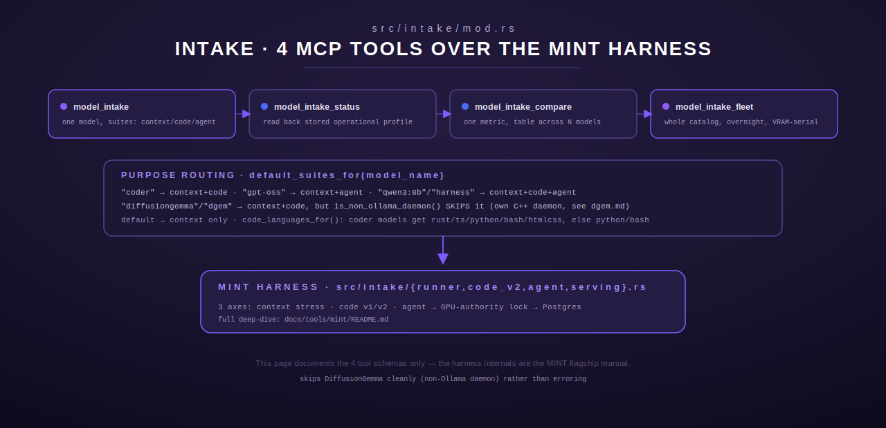

# intake — Model-Intake MCP Tools

[← models-review index](README.md) · [← tools index](../README.md) · [← docs index](../../README.md)

The `intake` module (`src/intake/mod.rs`) registers the **four MCP tools** that
front the MINT (Model INTake) profiling harness: `model_intake`,
`model_intake_status`, `model_intake_compare`, and `model_intake_fleet`. MINT
itself — the ~33k-line, ~43-module harness underneath these tools (the three
evaluation axes, the GPU-authority lock, the Postgres schema, the supervisor
daemon, and the `mint` CLI) — is documented in full as its own flagship manual
at **[`../mint/README.md`](../mint/README.md)**. This page covers only the
four tool schemas and their call-time behavior; it deliberately does not
duplicate the harness deep-dive.



## Purpose routing shared by every tool

Three pure helper functions in `src/intake/mod.rs` decide *what* to run for a
given model name, and every tool below calls into them when its caller
doesn't supply an explicit override:

- **`default_suites_for(model_name)`** (`src/intake/mod.rs:123-137`) — lower-cases
  the name and matches substrings: `"coder"` → `[context, code]`; `"gpt-oss"` →
  `[context, agent]`; `"qwen3:8b"` or `"harness"` → `[context, code, agent]`;
  `"diffusiongemma"`/`"dgem"` → `[context, code]` (see next point); anything
  else → `[context]` only.
- **`is_non_ollama_daemon(model_name)`** (`src/intake/mod.rs:141-144`) — true for
  any name containing `"diffusiongemma"` or `"dgem"`. DiffusionGemma runs as
  its own C++ daemon (see [`dgem.md`](dgem.md)), not through Ollama, so the
  Ollama-based suites cannot load it; `model_intake` and `model_intake_fleet`
  both check this and skip cleanly rather than erroring.
- **`code_languages_for(model_name)`** (`src/intake/mod.rs:152-163`) — coder
  models get the full P0/P1 language set (`rust, typescript, python, bash,
  htmlcss`); everyone else gets a lighter `python, bash` subset.

`parse_suites` (`src/intake/mod.rs:89-107`) and `parse_tiers`
(`src/intake/mod.rs:167-184`) apply an explicit `suites`/`tiers` argument when
given (deduped, lower-cased, trimmed), and fall back to the purpose-routed
default when the argument is absent or an empty array.

---

## `model_intake`

Profile a single fleet model and store the result in Postgres. Registered at
`src/intake/mod.rs:190` (struct `ModelIntake`), registration site
`src/intake/mod.rs:725`.

### Input schema

| Field | Type | Required | Default |
|---|---|---|---|
| `model_name` | string | yes | — (e.g. `"gpt-oss:20b"`) |
| `suites` | array of `"context"\|"code"\|"agent"` | no | inferred via `default_suites_for(model_name)` |
| `tiers` | array of integer | no | the full graduated tier ladder (`FULL_TIERS`, `src/intake/runner.rs`); pass a short list (e.g. `[2000,8000,16000]`) for a smoke run |
| `languages` | array of string | no | inferred via `code_languages_for(model_name)` (corpus tags: `rust, typescript, python, bash, htmlcss, cpp, sql, config`) |
| `scenario_limit` | integer | no | all 55 agent scenarios |
| `case_limit` | integer | no | all matching code-suite cases |
| `code_harness` | `"v1"\|"v2"` | no | `"v2"` (the realistic build-scenario harness with a graduated 0-5 score and retry; `"v1"` is the legacy cold one-shot suite, additive) |
| `backend` | string | no | the model's tagged backend; an explicit value (e.g. `"llama-gpu"`, `"ollama"`) forces this run onto that backend regardless of the registry tag, for profiling the same model on both GPU and CPU sizing |

`model_name` is trimmed and rejected as `InvalidArgument` if empty after
trimming.

### Behavior

1. **Daemon guard first.** If `is_non_ollama_daemon(model_name)` is true, the
   tool immediately returns an informational string (`Ok`, not an error) and
   runs nothing — DiffusionGemma/dgem models are profiled through their own
   daemon harness, not this one.
2. **Backend override.** If `backend` is supplied, `infer::set_backend_override`
   is set for the duration of the call (cleared by a `Drop` guard — a `struct
   ClearOverride` at `src/intake/mod.rs:290-296` — so it is cleared even if
   the suite run returns an error).
3. **`context` suite** (if requested): calls `runner::run_context_suite`, which
   creates the parent `profile_id` used by any subsequent `code`/`agent` suite
   in the same call. Output includes tiers run, whether the run stopped early
   on OOM, the prior hot model (if one was swapped out), and the derived
   operational profile (`max_context_safe`, `max_context_absolute`,
   `quality_degradation_point`, three recommended timeouts, `overall_tier`).
4. **`code` suite** (if requested): if no `context` suite ran in this call, a
   fresh `model_profiles` row is created first (`runner::create_profile_row`)
   so the code rows have a parent. Dispatches to `code::run_code_suite_limited`
   (v1) or `code_v2::run_code_suite_v2` (v2, default) depending on
   `code_harness`. Output reports cases run/passed/scored/errored, average
   first-pass and effective (post-retry) scores (v2 only), the approved
   `lang:tier` combinations, and any languages skipped for missing toolchain.
5. **`agent` suite** (if requested): dispatches to `agent::run_agent_suite`.
   Output reports scenarios run, tool accuracy (overall and at-200-tools),
   multistep rate, instruction adherence, hallucination rate, personality
   quality, and the derived `recommended_role`.
6. The response always ends with the note `"coherence_score stored as NULL
   (LLM-judge deferred)."`

### Output shape

A single human-readable text block (not JSON) with one `===  suite ===`
section per suite actually run, in `context`, `code`, `agent` order.

### Errors

- `InvalidArgument` — missing/empty `model_name`.
- Whatever the underlying `runner`/`code`/`code_v2`/`agent` suite functions
  return on failure (propagated with `?`).

### Worked example

Request:
```json
{
  "name": "model_intake",
  "arguments": {
    "model_name": "qwen3-coder:30b",
    "tiers": [2000, 8000, 16000],
    "case_limit": 5
  }
}
```
No `suites` given → purpose-routed to `["context", "code"]` (name contains
`"coder"`). Response (abridged):
```
Model intake: qwen3-coder:30b
Suites requested: context, code

=== Context suite ===
Tiers run: 3
max_context_safe: 16000
max_context_absolute: 16000
quality_degradation_point: n/a
recommended timeouts (sec): chat=30 build=90 deep=180
overall_tier: fast

=== Code suite (v2: realistic build scenario) ===
languages: rust, typescript, python, bash, htmlcss
cases run: 5 (5 scored, 0 errored)
avg first_pass: 3.80 | avg effective (incl retry): 4.20
approved (lang:tier): rust:p0, python:p0
...

Note: coherence_score stored as NULL (LLM-judge deferred).
```

---

## `model_intake_status`

Retrieve the stored operational profile for a model, or report it hasn't been
profiled. Registered at `src/intake/mod.rs:433` (struct `ModelIntakeStatus`).

### Input schema

| Field | Type | Required | Default |
|---|---|---|---|
| `model_name` | string | yes | — |

### Behavior

Opens the shared Postgres pool (`storage::get_pool`) and calls
`storage::read_latest_profile`. `None` → returns the literal string
`"<model_name>: not profiled"` (an `Ok`, not an error — an unprofiled model is
an expected, not exceptional, state). `Some(profile)` → renders via
`format_status` (`src/intake/mod.rs:469-505`): overall tier, the three context
ceilings, three recommended timeouts, then one line per stress tier showing
context tokens, recall score, throughput (tok/s), memory usage, and OOM
status.

### Output shape

Plain text, e.g.:
```
Profile for gpt-oss:20b
  tier: fast
  max_context_safe: 32000
  max_context_absolute: 64000
  quality_degradation_point: 48000
  timeouts(sec): chat=30 build=90 deep=180
  tiers:
       2000 tok | recall 1 | 42.1 tok/s | 8200MB | ok
       8000 tok | recall 1 | 39.7 tok/s | 8400MB | ok
      16000 tok | recall 0 | 35.2 tok/s | 8900MB | ok
```

### Errors

- `InvalidArgument` — missing `model_name`.
- Whatever `storage::get_pool`/`read_latest_profile` raise on a DB failure.

---

## `model_intake_compare`

Cross-model comparison table on a single numeric metric. Registered at
`src/intake/mod.rs:511` (struct `ModelIntakeCompare`).

### Input schema

| Field | Type | Required | Default |
|---|---|---|---|
| `models` | array of string | yes | — non-empty; trimmed, empty entries dropped |
| `metric` | string | yes | — one of the values below |

Recognized `metric` values (`metric_value`, `src/intake/mod.rs:572-587`):
`throughput_at_2k`, `throughput_at_8k`, `throughput_at_16k`,
`throughput_at_32k`, `throughput_at_64k`, `max_context_safe`,
`max_context_absolute`, `quality_degradation_point`,
`recommended_timeout_chat_sec`, `recommended_timeout_build_sec`,
`recommended_timeout_deep_sec`. An unrecognized metric name resolves to `None`
for every model (not an error) — the output table just shows every row as
"not profiled" for that column, since `metric_value` returns `None` for any
name outside this fixed list.

### Behavior

For each model in `models`, looks up its latest stored profile and extracts
the requested metric (`None` if unprofiled or the metric name is unmapped).
Renders via `format_compare` (`src/intake/mod.rs:590-615`) — a pure, unit-tested
function: whole numbers render without a decimal point, fractional values
render to one decimal place, missing values render as `"not profiled"`.

### Output shape

A fixed-width text table:
```
Comparison — metric: throughput_at_16k
model         throughput_at_16k
------------  -----------------
gpt-oss:20b   200
qwen3:8b      412.5
missing:1b    not profiled
```

### Errors

- `InvalidArgument` — missing/non-array `models`, empty `models` after
  filtering, or missing `metric`.

---

## `model_intake_fleet`

Profile the **entire** model catalog overnight, picking suites per-model by
purpose routing (or an explicit override), loading/profiling/unloading each
model in turn and restoring the daily-driver model only at the very end.
Intended to run when the agent is offline — see
[`../mint/gpu-authority.md`](../mint/gpu-authority.md) for the VRAM
serialization this depends on. Registered at `src/intake/mod.rs:625` (struct
`ModelIntakeFleet`).

### Input schema

| Field | Type | Required | Default |
|---|---|---|---|
| `models` | array of string | no | the full non-embedding Ollama catalog, enumerated via `runner::list_chat_models` against `GET /api/tags` (30s HTTP timeout) |
| `tiers` | array of integer | no | full graduated tier ladder |
| `model_suites` | object (`{model: [suites]}`) | no | overrides purpose inference for the named model(s) only; other models still use `default_suites_for` |

### Behavior

1. Resolves the tier list via `parse_tiers`.
2. Resolves the model list: explicit `models`, or auto-enumerates the Ollama
   catalog. Empty either way → `NotConfigured` error (`"no models to profile
   (catalog empty)"`).
3. Builds a per-model suite resolver closure: checks `model_suites` first
   (normalized, deduped, lower-cased entries), falls back to
   `default_suites_for`.
4. Delegates to `runner::run_fleet_suites`, passing the suite resolver, the
   language resolver (`code_languages_for`), the daemon-skip predicate
   (`is_non_ollama_daemon`), and two async closures wrapping `code::run_code_suite`
   and `agent::run_agent_suite` for the fleet driver to call per model.
5. Renders one line per model: `✅`/`⏭` marker, model name, suites run, and a
   short summary string from whichever suite(s) ran.

### Output shape

```
Fleet intake complete: 14 model(s), tiers [2000, 8000, 16000, 32000, 64000, 128000]

✅ qwen3-coder:30b [context+code]: 12 cases, 10 approved
✅ gpt-oss:20b [context+agent]: 55 scenarios, role=assistant
⏭ diffusiongemma-26b-a4b [context+code]: skipped (non-Ollama daemon)
...

Daily driver restored. Results stored in Postgres (model_intake_compare / _status).
```

### Errors

- `NotConfigured` — no models resolved (empty explicit list and empty
  catalog).
- `Http` — building the Ollama-catalog-enumeration client fails (rare;
  `reqwest::Client::builder()` construction error).

---

## Registration

`register(registry: &mut ToolRegistry)` (`src/intake/mod.rs:724-729`) installs
all four tools with `register_or_replace`, so re-registration (e.g. hot-reload
during development) is idempotent rather than erroring on a duplicate name.

## See also

- [`../mint/README.md`](../mint/README.md) — the full MINT harness: the three
  evaluation axes, the end-to-end sweep lifecycle, the GPU-authority lock, the
  Postgres schema, the durability/supervisor system, and the `mint` CLI.
- [`dgem.md`](dgem.md) — the DiffusionGemma daemon these Ollama-based suites
  explicitly skip.
- [`serving.md`](serving.md) — the serving-profile tools that read the
  operational output these suites produce, downstream in Chord.
