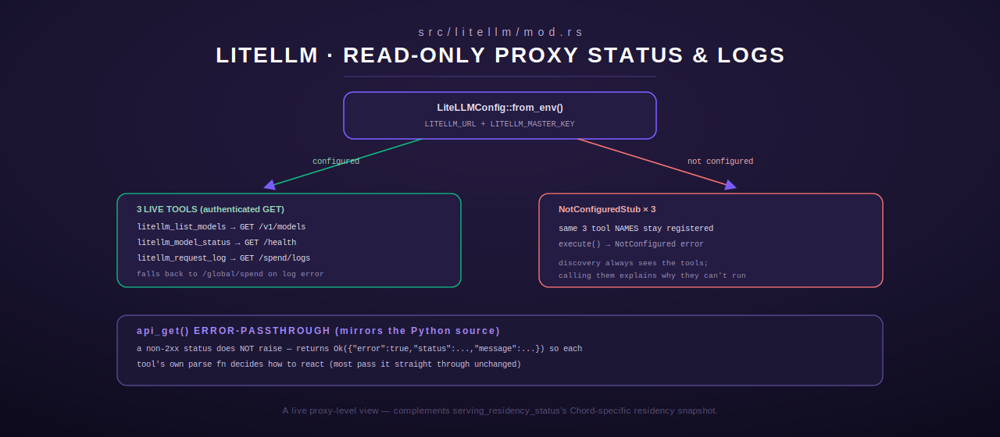

# litellm — LiteLLM Proxy Status & Logs

[← models-review index](README.md) · [← tools index](../README.md) · [← docs index](../../README.md)

`src/litellm/mod.rs` registers three **read-only** tools —
`litellm_list_models`, `litellm_model_status`, `litellm_request_log` — that
query a LiteLLM proxy instance for its configured model routes, per-model
health, and recent request/spend logs. It is a line-for-line Rust port of the
legacy Python `litellm_tools.py`, keeping identical tool names and parameters.
All three endpoints require master-key authentication.



## Config (env)

| Env var | Purpose |
|---|---|
| `LITELLM_URL` | LiteLLM proxy base URL, e.g. `http://litellm.example:4000` |
| `LITELLM_MASTER_KEY` | Master key, sent as `Authorization: Bearer <key>` |

`LiteLLMConfig::from_env()` (`src/litellm/mod.rs:34-46`) trims both, strips a
trailing slash from the URL, and returns `NotConfigured` if either is
missing/empty. **If either variable is unset at registration time, the module
installs no-op stub tools instead of the real ones** (see Registration
below) — this is a `register()`-time decision, not a per-call fallback.

## Shared request helper (`api_get`)

`LiteLLMConfig::api_get` (`src/litellm/mod.rs:58-90`) issues an authenticated
`GET` with a 40s client timeout. It mirrors the Python source's
error-passthrough behavior deliberately: **an HTTP error status does not
raise** — it returns `Ok(json!({"error": true, "status": ..., "message":
...}))` instead, so each tool's own parse function can decide how to react
(most just pass the error object through unchanged). An empty response body
on a 2xx status parses as `{}`. A malformed (non-JSON) body on a 2xx status
does raise `ToolError::Http`.

---

## `litellm_list_models`

List all model routes configured in LiteLLM. `LitellmListModels`,
`src/litellm/mod.rs:226,231`.

### Input schema

None.

### Behavior

`GET /v1/models`, then `parse_models` (`src/litellm/mod.rs:96-127`):
extracts each entry's `id`, `owned_by` (backend provider), and `created`
timestamp (all default to `"unknown"`/`0` if absent), sorts alphabetically by
`id`, and wraps in a `count`/`models` envelope. An error passthrough object
(`{"error": true, ...}`) from `api_get` is returned as-is, unmodified.

### Output shape

```json
{
  "count": 2,
  "models": [
    {"id": "claude", "owned_by": "anthropic", "created": 200},
    {"id": "zephyr", "owned_by": "ollama", "created": 100}
  ]
}
```

### Errors

- `Http` — network failure or malformed JSON body.
- No `InvalidArgument` path (no input).

---

## `litellm_model_status`

Per-model health check. `LitellmModelStatus`, `src/litellm/mod.rs:227,251`.

### Input schema

None.

### Behavior

`GET /health` — LiteLLM's own health-check runs a real inference call against
each configured model endpoint, so this can be slow (10-30s); Ollama-backed
models will time out if Ollama isn't running. `parse_health`
(`src/litellm/mod.rs:130-184`) extracts `healthy_count`/`unhealthy_count` and
the `healthy_endpoints`/`unhealthy_endpoints` arrays (each entry reduced to
`model`/`api_base`, plus `error` for the unhealthy list). Long error strings
(>200 chars) are truncated to 200 chars with a trailing `"..."` appended
(`src/litellm/mod.rs:160-167`) — output length is exactly 203 chars in that
case (200 + the 3-char ellipsis).

### Output shape

```json
{
  "healthy_count": 1,
  "unhealthy_count": 1,
  "healthy": [{"model": "claude", "api_base": "https://api.anthropic.com"}],
  "unhealthy": [{"model": "ollama/qwen", "api_base": "http://gpu-host:11434", "error": "timeout"}]
}
```

### Errors

- `Http` — network failure or malformed JSON body.

---

## `litellm_request_log`

Recent request/spend logs, with a global-spend fallback. `LitellmRequestLog`,
`src/litellm/mod.rs:228,274`.

### Input schema

| Field | Type | Required | Default |
|---|---|---|---|
| `limit` | integer | no | 20, clamped to `[0, 100]` (negative → 0, >100 → 100) |

### Behavior

1. `GET /spend/logs?limit=<n>`.
2. If that response carries an `error` field, **falls back** to `GET
   /global/spend` and wraps it: `{"message": "Detailed request logs not
   available. Global spend summary:", "global_spend": <spend body>}`. If even
   that fallback errors, returns `{"message": "Request logging may not be
   enabled in LiteLLM.", "error": <spend error body>}`. Either fallback path
   is a successful `Ok` return, not a `ToolError` — logging being disabled is
   an expected, reportable state.
3. Otherwise, `parse_spend_logs` (`src/litellm/mod.rs:187-222`) normalizes the
   response into a `count`/`logs` envelope. The response body may be a bare
   array, or wrapped as `{data: [...]}` or `{logs: [...]}` — all three shapes
   are accepted. Each log entry surfaces `model`, `tokens` (from
   `total_tokens`), `cost` (from `spend`), `status`, `timestamp` (from
   `startTime`, falling back to `created_at`), and `api_key_alias` — all
   defaulted (`"unknown"`/`0`/`""`) if absent.

### Output shape

```json
{
  "count": 2,
  "logs": [
    {"model": "claude", "tokens": 1500, "cost": 0.045, "status": "success", "timestamp": "2026-06-08T07:00:00Z", "api_key_alias": "lumina"},
    {"model": "qwen", "tokens": 200, "cost": 0.0, "status": "success", "timestamp": "", "api_key_alias": ""}
  ]
}
```

### Errors

- `Http` — network failure or malformed JSON body on the primary request (the
  fallback path's own errors are absorbed into the successful response body,
  not raised).

---

## Registration

`register(registry: &mut ToolRegistry)` (`src/litellm/mod.rs:331-345`) has two
paths:

- **Configured** (`LITELLM_URL` and `LITELLM_MASTER_KEY` both set): registers
  the three real tools above with a shared cloned config.
- **Not configured**: logs a `tracing::warn!`, then registers a
  `NotConfiguredStub` under each of the same three names
  (`src/litellm/mod.rs:347-363`) — each stub has an empty `{"type": "object",
  "properties": {}}` schema and its `execute()` always returns
  `ToolError::NotConfigured("LITELLM_URL and LITELLM_MASTER_KEY must be
  set")`. This means the three tool **names** are always present in the
  registry either way (a caller doing tool discovery sees them regardless of
  configuration state), but calling them cleanly reports why they can't run
  when LiteLLM isn't configured.

## See also

- [`model_advisor.md`](model_advisor.md) — a complementary, non-live surface:
  model_advisor answers "what should I run" from static curated data;
  `litellm_list_models`/`litellm_model_status` answer "what is actually
  configured and healthy right now" against a live LiteLLM deployment.
- [`serving.md`](serving.md) — Chord's own serving-residency status, a
  different live-inference-backend view than LiteLLM's proxy-level health
  check.
