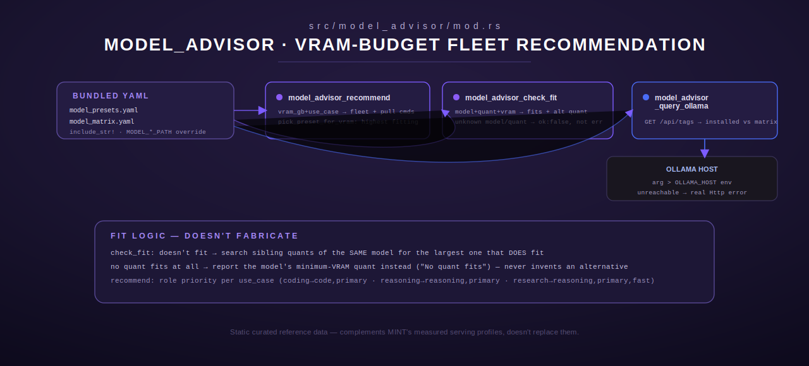

# model_advisor — VRAM-Aware Model Fleet Recommendations

[← models-review index](README.md) · [← tools index](../README.md) · [← docs index](../../README.md)

`src/model_advisor/mod.rs` is a Rust port of the fleet host's Python
`model_advisor_tools.py`, kept tool-name- and parameter-identical to the
original. It recommends a model fleet for a given VRAM/unified-memory budget
and use case, checks whether a specific model+quantization fits a VRAM
budget, and cross-references what's actually installed on an Ollama instance
against the bundled capability matrix. Unlike the SSH-based modules elsewhere
in this crate, Model Advisor is pure local data (two bundled YAML files) plus
one outbound HTTP call (`model_advisor_query_ollama` hits the caller-specified
Ollama host's `/api/tags`).



## Data model

Two YAML files are compiled into the binary via `include_str!`
(`src/model_advisor/mod.rs:48-49`), mirroring the shipped `deploy/` copies:

- **`model_presets.yaml`** → `PresetMap` (`HashMap<String, ModelPreset>`).
  Each `ModelPreset` has a `description`, a `vram_allocation_gb` budget, an
  `ollama_env` map (env vars to set for that preset), and a `models: Vec<ModelEntry>`
  list (`name`, `role`, `quant`, `vram_gb`, `description` each).
- **`model_matrix.yaml`** → `MatrixMap` (`HashMap<String, MatrixEntry>`). Each
  `MatrixEntry` has a `family`, a `quants: HashMap<String, QuantInfo>` map
  (each `QuantInfo` has `vram_gb` and `quality_penalty`), a `quality` value, a
  `best_for: Vec<String>` list, and an optional `ollama_name` (defaults to the
  matrix key if absent).

### Override paths (env)

| Env var | Purpose | On read/parse failure |
|---|---|---|
| `MODEL_PRESETS_PATH` | Override path to `model_presets.yaml` on disk | falls back to an **empty** `PresetMap` — mirrors the Python source's silent `{}` on a missing file or unimportable `yaml` module |
| `MODEL_MATRIX_PATH` | Override path to `model_matrix.yaml` on disk | falls back to an **empty** `MatrixMap`, same reasoning |

When either variable is unset, the bundled default is parsed instead
(`load_presets`/`load_matrix`, `src/model_advisor/mod.rs:104-124`). An empty
preset map degrades every recommendation to the safe `"cpu_only"` fallback
rather than erroring.

### `OLLAMA_HOST`

Default Ollama base URL for `model_advisor_query_ollama` when its
`ollama_host` argument is empty. Default `http://localhost:11434` (matches
the Python source — a well-known local-loopback default, not an infra
secret).

---

## `model_advisor_recommend`

Recommend a model fleet for a VRAM budget and use case. `ModelAdvisorRecommend`,
`src/model_advisor/mod.rs:179`.

### Input schema

| Field | Type | Required | Default |
|---|---|---|---|
| `vram_gb` | number | yes | — available VRAM (or unified memory for Apple Silicon / Strix Halo) |
| `use_case` | string | no | `"general"` — one of `general, coding, reasoning, fast, research` |
| `platform` | string | no | `"generic"` — one of `strix_halo, apple_silicon, nvidia, amd, generic` |

### Behavior

1. **`pick_preset_for_vram`** (`src/model_advisor/mod.rs:128-161`): filters
   presets whose `vram_allocation_gb` fits within `vram_gb`, then sorts
   candidates by `(allocation, platform_match)` descending — i.e. picks the
   **highest-allocation preset that still fits**, and among ties prefers a
   preset whose name contains the requested platform string. No fitting
   preset (or an empty preset map) → `"cpu_only"`.
2. **`preferred_roles`** (`src/model_advisor/mod.rs:164-173`) maps `use_case`
   to a role-priority order: `coding` → `[code, primary]`; `reasoning` →
   `[reasoning, primary]`; `fast` → `[fast, primary]`; `research` →
   `[reasoning, primary, fast]`; `general` → `[primary, fast, code]`; any
   other string → `[primary, fast]`.
3. The chosen preset's models are sorted by that role priority (models with a
   role not in the list sort last, position 99).
4. Total VRAM and headroom (`(vram_gb - total) * 10 / 10`, rounded to one
   decimal) are computed, and `ollama pull <name>` commands generated for
   each model in priority order.

### Output shape

Pretty-printed JSON:
```json
{
  "ok": true,
  "preset_name": "discrete_24gb",
  "models": [
    {"name": "qwen3.5:9b", "role": "code", "quant": "Q4_K_M", "vram_gb": 6.0, "description": "..."}
  ],
  "total_model_vram_gb": 6.0,
  "vram_available_gb": 24.0,
  "headroom_gb": 18.0,
  "ollama_pull_commands": ["ollama pull qwen3.5:9b"],
  "ollama_env": {},
  "note": "Use case: coding. All models fit simultaneously with 18GB headroom for KV cache."
}
```

### Errors

- `InvalidArgument` — `vram_gb` missing or not a number.
- Never errors on an unknown `use_case`/`platform` string — both degrade to a
  sane default behavior rather than rejecting the call.

---

## `model_advisor_check_fit`

Check whether a specific model+quant fits a VRAM budget. `ModelAdvisorCheckFit`,
`src/model_advisor/mod.rs:285`.

### Input schema

| Field | Type | Required | Default |
|---|---|---|---|
| `model_name` | string | yes | — e.g. `"qwen3.5:35b-a3b"` |
| `quant` | string | no | `"Q4_K_M"` |
| `vram_gb` | number | no | `24.0` |

### Behavior

1. Looks up `model_name` in the matrix — tries `model_name.replace('/', '.')`
   first (some entries use dots where a caller might pass a slash), then the
   raw name. Not found → returns `{ok: false, error: "Model '<name>' not in
   matrix. Estimate: ~6GB per 7B params at Q4_K_M.", fits: null}` (an `Ok`
   response, not an error — this is a "no data" result, not a call failure).
2. Looks up `quant` within that entry's `quants` map. Not found → `{ok: false,
   error: "Quantization '<q>' not available. Options: [...]", fits: null}`.
3. Computes `fits = model_vram_gb <= vram_gb` and `headroom` (or `shortage` if
   it doesn't fit).
4. If it doesn't fit, searches the same model's other quants for the
   **largest one that does fit** and suggests it by name
   (`"✗ Doesn't fit (<shortage>GB short). Try <quant> (<vram>GB)."`). If no
   quant fits at all, reports the model's minimum-VRAM quant instead
   (`"✗ No quant fits in <vram>GB. Minimum: <min>GB"`) rather than fabricating
   a suggestion.

### Output shape

```json
{
  "ok": true,
  "model": "qwen3.5:9b",
  "quant": "Q4_K_M",
  "model_vram_gb": 6.0,
  "vram_available_gb": 24.0,
  "fits": true,
  "headroom_gb": 18.0,
  "recommendation": "✓ Fits with 18GB headroom for KV cache",
  "quality_penalty": 0.0
}
```

### Errors

- `InvalidArgument` — `model_name` missing/not a string.
- Unknown model or unknown quant: **not** errors — both return `Ok` with
  `ok: false` in the body (see above), a deliberate "recoverable, informative
  no-data" outcome rather than a hard failure.

---

## `model_advisor_query_ollama`

Cross-reference an Ollama instance's installed models against the capability
matrix. `ModelAdvisorQueryOllama`, `src/model_advisor/mod.rs:411`.

### Input schema

| Field | Type | Required | Default |
|---|---|---|---|
| `ollama_host` | string | no | `""` → resolves to `OLLAMA_HOST` env or `http://localhost:11434` |
| `vram_gb` | number | no | `0` — `0` skips the per-model fit check |

### Behavior

1. Resolves the host (arg > env > loopback default), strips a trailing slash.
2. `GET <host>/api/tags` with a 5s client timeout. Unlike
   `model_advisor_check_fit`'s "no data" pattern, an unreachable host or a
   non-2xx response here is a genuine `ToolError::Http` — this deliberately
   mirrors the crate's `weather` module convention: a real network failure is
   an error, not a synthesized `{ok: false}` success body
   (`src/model_advisor/mod.rs:460-464`).
3. Extracts installed model names from the response's `models[].name`.
4. For every entry in the matrix, checks whether it's installed by a
   substring match either direction (`ollama_name.contains(m) ||
   m.contains(ollama_name)`) against the installed list, and includes
   `quality` and the first 3 `best_for` tags.
5. If `vram_gb > 0`, additionally checks the `Q4_K_M` quant's fit against the
   supplied budget for each matrix entry (`fits_q4km`, `vram_q4km`, or `"?"`
   if that entry has no `Q4_K_M` quant at all).

### Output shape

```json
{
  "ok": true,
  "ollama_host": "http://localhost:11434",
  "installed_count": 2,
  "installed_models": ["qwen3.5:9b", "phi4-mini"],
  "matrix_summary": [
    {"model": "qwen3.5:9b", "installed": true, "quality": 8, "best_for": ["coding", "general", "fast"], "fits_q4km": true, "vram_q4km": 6.0}
  ]
}
```

### Errors

- `Http` — client build failure, unreachable host, or non-2xx status.
- No `InvalidArgument` path — all fields are optional with defaults.

---

## Registration

`register(registry: &mut ToolRegistry)` (`src/model_advisor/mod.rs:538-542`)
registers all three tools unconditionally via `registry.register` (result
discarded with `let _ =`, so a duplicate-name conflict is silently ignored
rather than surfaced).

## See also

- [`serving.md`](serving.md) — a related but distinct concern: model_advisor
  answers "what *could* I run given this VRAM budget" from static bundled
  data, while `serving_profile_get` answers "what does the harness *measure*
  this model actually doing" from live-collected Postgres rows.
- [`../mint/README.md`](../mint/README.md) — MINT is the harness that
  produces the measured data serving-profile tools read; model_advisor's
  matrix is hand-curated reference data, not MINT output.
