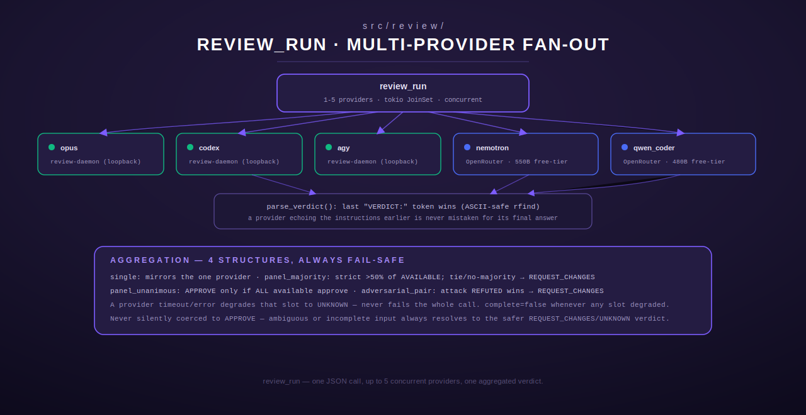

# review — Multi-Provider Review Tool

[← models-review index](README.md) · [← tools index](../README.md) · [← docs index](../../README.md)

`src/review/` registers a single MCP tool, **`review_run`**, that dispatches a
review prompt to 1-5 providers concurrently, in one of four structures, and
aggregates their verdicts into a single answer. It is a general-purpose
multi-provider review primitive — usable for code/PR review, but the prompt
and criteria are free-form, so it generalizes to any "does this satisfy X"
judgment call.



## Providers

| Provider | Transport | Notes |
|---|---|---|
| `opus` | `review-daemon` over loopback HTTP | CLI-backed |
| `codex` | `review-daemon` over loopback HTTP | CLI-backed |
| `agy` | `review-daemon` over loopback HTTP | CLI-backed |
| `nemotron` | direct to OpenRouter `chat/completions` | `nvidia/nemotron-3-ultra-550b-a55b:free` — 550B total params, 1M context, re-confirmed live free-tier (`src/review/dispatch.rs:19-24`) |
| `qwen_coder` | direct to OpenRouter `chat/completions` | `qwen/qwen3-coder:free` — 480B total params, 1M context, code-specialized (`src/review/dispatch.rs:25-32`) |
| `free` | daily-curated OpenRouter free-model **pool**, round-robin + 429 failover | seamless free tier — see [The `free` provider](#the-free-provider) below (`src/review/free_pool.rs`) |

`opus`/`codex`/`agy` are reached via the `review-daemon` binary
(`src/bin/review_daemon/`) — per `src/tool.rs`'s no-subprocess-in-tool
contract, this is the **only** place in the codebase permitted to spawn these
CLI processes; `review/dispatch.rs` itself never spawns anything, only calls
the daemon over HTTP. This mirrors the daemon-over-loopback-HTTP shape
established by [`dgem`](dgem.md).

`nemotron` and `qwen_coder` were previously `deepseek/deepseek-r1:free`; that
model no longer exists on OpenRouter at all (no free-tier deepseek model
remains), so `qwen_coder` replaced that slot.

### The `free` provider

`nemotron`/`qwen_coder` pin ONE free model each, so a per-model OpenRouter free-tier
throttle (a persistent HTTP 429 on a popular model like `qwen/qwen3-coder:free`) makes
that slot unusable. The `free` provider fixes this by drawing from a **pool** instead:

- **Daily scan (24h lazy TTL).** On first use after the TTL, `free_pool` fetches
  OpenRouter's public, unauthenticated `/models` catalog and `curate()`s it to a
  high-quality subset: free (`pricing` 0/0), text-emitting, `context_length ≥ 32k`, and
  matching a maintainable family allowlist (qwen3-coder/next, nemotron ultra/super/nano-30b,
  gemma-4, gpt-oss, llama-3.3-70b, hermes-405b, north-code, deepseek, …). Capped and sorted
  by context.
- **Round-robin + 429 failover.** Each `free` dispatch picks the next non-cooling model; on a
  429 it marks that model in a short cooldown and rotates to the next — so a free review lands
  on whatever pooled model still has quota. The pool (round-robin cursor + cooldowns + refresh
  time) is process-global, shared across `review_run` calls.
- **Degrades cleanly:** no key → `unavailable`; catalog unreachable → keep the last-good pool;
  every model cooling down → a clear `"all free-tier models are rate-limited"` (never a hang or
  panic).

Intended use is as the **tail of a 3–5 provider panel**: sub/OAuth providers first
(`opus`/`codex`/`agy`), then one or more `free` slots (multiple `free` entries round-robin to
distinct models, adding panel diversity at $0).

### Config (env)

| Env var | Purpose | Default |
|---|---|---|
| `REVIEW_DAEMON_URL` | review-daemon base URL | `http://127.0.0.1:8790` |
| `REVIEW_DAEMON_TOKEN` | Bearer token matching the daemon's own config | none — unset degrades `opus`/`codex`/`agy` to `"unavailable: REVIEW_DAEMON_TOKEN not configured"` |
| `OPENROUTER_API_KEY` | OpenRouter key | none — unset degrades `nemotron`/`qwen_coder`/`free` similarly |
| `FREE_POOL_MIN_CONTEXT` | min `context_length` to pool a free model | `32768` |
| `FREE_POOL_MAX_SIZE` | cap on pool size | `12` |
| `FREE_POOL_COOLDOWN_SECS` | per-model cooldown after a 429 | `600` |
| `FREE_POOL_TTL_SECS` | daily catalog refresh interval | `86400` |
| `FREE_POOL_FAMILIES` | comma-separated id-substring allowlist override | built-in list |
| `FREE_POOL_MODELS_URL` | OpenRouter model-catalog URL to scan | `https://openrouter.ai/api/v1/models` |
| `OPENROUTER_CHAT_URL` | OpenRouter chat-completions endpoint (also used by `nemotron`/`qwen_coder`) | `https://openrouter.ai/api/v1/chat/completions` |

`ReviewConfig::from_env()` (`src/review/dispatch.rs:47-63`) trims and
strips a trailing slash from the daemon URL.

## `review_run`

Registered via `ReviewRun` (`src/review/mod.rs:49`), registration
`src/review/mod.rs:265-269` (uses `registry.register`, which panics via
`.expect(...)` if the name is already taken — unlike most other modules in
this crate, which use `register_or_replace`).

### Input schema

| Field | Type | Required | Notes |
|---|---|---|---|
| `structure` | string enum | yes | `single`, `adversarial_pair`, `panel_majority`, `panel_unanimous` |
| `providers` | array of string enum | yes | 1-5 entries from `opus, codex, agy, nemotron, qwen_coder`; `adversarial_pair` requires **exactly 2** |
| `criteria` | string | yes | non-empty after trim; the acceptance criteria text |
| `context` | object | no | free-form JSON (diff/files/description/etc); defaults to `{}` |

### Validation (`parse_input`, `src/review/mod.rs:65-111`)

- `structure` must parse via `Structure::parse` (`src/review/prompt.rs:18-28`)
  or `InvalidArgument`.
- `providers` must be a non-empty array of 1-5 entries, each in
  `ALLOWED_PROVIDERS`; unknown names reject with an error listing the valid
  set.
- `adversarial_pair` specifically requires exactly 2 providers (index 0 =
  "defend", index 1 = "attack" — `role_for`, `src/review/mod.rs:113-124`).
- `criteria` must be non-empty after trim.

### Behavior

1. Builds a role-specific prompt per provider via `build_prompt`
   (`src/review/prompt.rs:46-85`) — `Reviewer` for `single`/`panel_majority`/
   `panel_unanimous`, `Defend`/`Attack` for `adversarial_pair`. Every prompt
   ends with an explicit instruction to terminate with a `VERDICT: ...` line
   (see verdict tokens below) so parsing is deterministic.
2. Spawns all providers **concurrently** via `tokio::task::JoinSet`, tracking
   each task's `tokio::task::Id` back to its `(index, provider_name)` slot
   (`id_to_slot`, `src/review/mod.rs:211-224`) — this matters for
   `adversarial_pair`, where slot 0/1 must stay attributable to defend/attack
   even if a task panics and only reports via `JoinError`.
3. `run_one_provider` (`src/review/mod.rs:126-154`) dispatches to
   `dispatch_daemon` or `dispatch_openrouter` based on
   `dispatch::is_daemon_provider`, then parses the raw text into
   `(Verdict, reasoning)` via `parse_verdict`.
4. A provider failure/timeout/task-panic degrades that provider's
   `ProviderResult` to `verdict: "UNKNOWN", error: Some(reason)` — it never
   fails the whole tool call.
5. Results are re-sorted back into request order (`indexed.sort_by_key`) after
   the concurrent join, since `JoinSet` doesn't preserve submission order.
6. `aggregate(structure, &results)` (`src/review/aggregate.rs`) computes the
   final `(aggregate_verdict, complete)` pair per the structure's rules below.

### Verdict tokens (`parse_verdict`, `src/review/prompt.rs:117-153`)

Scans the response **from the end backwards** for the last `VERDICT:`
occurrence (ASCII-only uppercasing via `to_ascii_uppercase`, not
`to_uppercase()`, to stay byte-length-preserving and avoid a non-char-boundary
slice panic on Unicode input — see the code comment at
`src/review/prompt.rs:118-126`). This means a model that echoes the
instruction text ("...VERDICT: APPROVE...") earlier in its response doesn't
get mistaken for its real final answer; only the last marker counts. Token
values: `APPROVE`, `REQUEST_CHANGES` (Reviewer/Defend roles), `REFUTED`,
`NOT_REFUTED` (Attack role only), or `UNKNOWN` if no marker is found.
`reasoning` is the text before the marker (trimmed); falls back to the full
trimmed text if that's empty.

### Aggregation rules (`aggregate`, `src/review/aggregate.rs:40-112`)

| Structure | Verdict rule | `complete` |
|---|---|---|
| `single` | mirrors the one provider's verdict | iff it's available |
| `panel_majority` | strictly >50% of AVAILABLE providers agreeing wins; ties or no majority fail safe to `REQUEST_CHANGES` | iff every provider was available |
| `panel_unanimous` | `APPROVE` only if ALL available providers said `APPROVE`; else `REQUEST_CHANGES` | iff every provider was available |
| `adversarial_pair` | attack says `REFUTED` → `REQUEST_CHANGES`; else defend says `REQUEST_CHANGES` → `REQUEST_CHANGES`; else `APPROVE` | iff both defend and attack were available |

Every path fails safe — an ambiguous or incomplete result never silently
becomes `APPROVE`.

### Output shape

```json
{
  "structure": "panel_majority",
  "providers": [
    {"provider": "opus", "verdict": "APPROVE", "reasoning": "...", "error": null},
    {"provider": "codex", "verdict": "APPROVE", "reasoning": "...", "error": null},
    {"provider": "agy", "verdict": "UNKNOWN", "reasoning": "", "error": "unavailable: REVIEW_DAEMON_TOKEN not configured"}
  ],
  "aggregate_verdict": "APPROVE",
  "complete": false
}
```

### Errors

- `InvalidArgument` — unknown `structure`, unknown provider, empty/oversized
  `providers` (0 or >5), `adversarial_pair` without exactly 2 providers, or
  missing `criteria`.
- No transport error ever escapes `execute()` — every per-provider failure is
  captured in that provider's `error` field, and the tool call itself always
  returns `Ok` once input validation passes (see
  `execute_degrades_all_providers_when_unconfigured_and_still_returns_ok`,
  `src/review/mod.rs:329-347`).

### Worked example

Request:
```json
{
  "structure": "adversarial_pair",
  "providers": ["opus", "codex"],
  "criteria": "Handler must reject empty input and never log the raw secret.",
  "context": {"diff": "+ fn handle(x: &str) -> Result<(), Error> { ... }"}
}
```
`opus` (defend) argues the change is sound; `codex` (attack) actively tries to
refute it. If `codex` finds a genuine gap and answers `VERDICT: REFUTED`, the
aggregate is `REQUEST_CHANGES` regardless of what `opus` said.

## Prompt construction (`src/review/prompt.rs`)

Pure, side-effect-free, fully unit-tested independent of network I/O.
`build_prompt(role, criteria, context)` serializes `context` as pretty JSON
and frames the prompt per role — `Reviewer` (plain independent review),
`Defend` (argue the change is sound), `Attack` (explicitly instructed to
"assume the defender is wrong until proven otherwise" and construct the
strongest rejection case it can).

A second, distinct prompt shape lives in the same file:
**`build_docs_prompt(module_path, git_ref, context)`**
(`src/review/prompt.rs:179-196`) — used by the Scribe documentation generator
(`src/scribe/mod.rs`), dispatched through the same
`ReviewConfig::dispatch_daemon` HTTP call (the daemon is prompt-shape-agnostic
— its `POST /dispatch` body has no `kind`/shape field). It has no `VERDICT:`
sentinel to parse (a docs-generation response is just Markdown), instructs the
model to base every claim only on the supplied context ("never invent
behavior that isn't evidenced"), and to respond with Markdown only, no
preamble or wrapping code fence.

## HTTP dispatch (`src/review/dispatch.rs`)

`ReviewConfig::dispatch_daemon` posts to `<daemon_url>/dispatch` with a bearer
token and a 150s client timeout; a non-2xx response is parsed for a
structured `{"error": "...", "detail": "..."}` body and surfaced as
`"unavailable: <error>: <detail>"`. `dispatch_openrouter` posts to
`https://openrouter.ai/api/v1/chat/completions`; an empty `content` string in
the response is treated as a failure (`"unavailable: openrouter returned
empty content"`), not a successful empty answer. Every function in this
module returns `Result<String, String>` (never `ToolError` directly) — the
`String` error is always a human-readable, `"unavailable: "`-prefixed degrade
reason that `mod.rs::run_one_provider` turns into a `ProviderResult`.

## Registration

`register(registry: &mut ToolRegistry)` (`src/review/mod.rs:265-269`)
registers `ReviewRun` once, unconditionally — there is no env-gated stub path
like `litellm`'s; misconfiguration (missing token/key) surfaces per-provider
at call time instead of at registration time.

## See also

- [`dgem.md`](dgem.md) — the daemon-over-loopback-HTTP precedent this module's
  `opus`/`codex`/`agy` providers reuse, and the alternative $0 local reviewer
  for smaller diffs.
- [`wizard.md`](wizard.md) — a different multi-model consultation surface
  (deep-reasoning council via Chord), not to be confused with `review_run`'s
  structured verdict aggregation.
