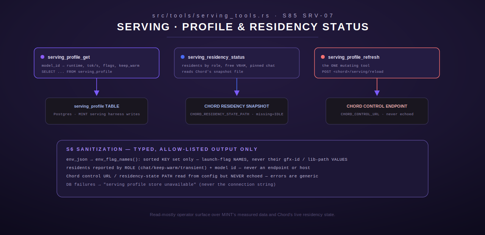

# serving — Serving-Profile Control & Status Tools

[← models-review index](README.md) · [← tools index](../README.md) · [← docs index](../../README.md)

`src/tools/serving_tools.rs` (S85 SRV-07) registers three operator-facing
tools — `serving_profile_get`, `serving_residency_status`,
`serving_profile_refresh` — that inspect the serving profile produced by the
MINT harness's serving-probing subsystem (SRV-01..03; see
[`../mint/serving-profiles.md`](../mint/serving-profiles.md)) and consumed by
Chord's runtime routing (SRV-04..06). These tools are **read-mostly**; only
`serving_profile_refresh` mutates anything (and even that is a signal to
Chord, not a database write from Terminus itself).



## Sanitization discipline (S6)

This module carries an explicit, code-commented sanitization contract
(`src/tools/serving_tools.rs:19-34`) because its outputs are operator-facing
and get mirrored publicly. Every output field is built from *typed,
allow-listed* data only:

- Runtime/backend/exclusion values are fixed wire-string enums, never
  free-form.
- The model id is a registry key, not an infra string.
- `env_json` (the launch-flag configuration a serving backend was started
  with) is reduced to its **key set only** — the flag *names* (e.g.
  `gfx_override`, `mmap_flag`, `flash_attn`, `cpu_lib`) — never their values,
  which can carry GPU device IDs or filesystem library paths.
- Residency residents are reported by **role** (`chat` / `keep-warm` /
  `transient`) and model id, never by endpoint or host.
- The Chord control URL and the residency-state snapshot path are read from
  config but **never echoed** in any output or error message — errors are
  generic (`"Chord control endpoint unreachable"`, `"serving profile store
  unavailable"`), not the connection string or file path.

---

## `serving_profile_get`

Show a model's serving profile across its serving backends. `ServingProfileGet`,
`src/tools/serving_tools.rs:124`.

### Input schema

| Field | Type | Required |
|---|---|---|
| `model_id` | string | yes — trimmed, non-empty (e.g. `"qwen3:8b"`, the S83-consistent registry id) |

### Behavior

1. Opens the shared pool via `crate::intake::serving::schema::get_pool()`; a
   connection failure maps to the generic `store_unavailable()` error
   (`src/tools/serving_tools.rs:64-66`), never the raw connection error.
2. Queries `serving_profile` for every row matching `model_id`, ordered by
   `backend_tag`. Selected columns: `backend_tag, best_runtime,
   env_json::text, tok_s, vram_or_ram_peak_gb, cold_load_s, keep_warm,
   fallback_runtime, exclusion_reason, recheck_trigger, provenance`.
3. **No rows** → a clear, human-readable `Ok` result (not an error):
   `"No serving profile for model '<id>'. The serving harness has not
   recorded a row for this model yet."`
4. Otherwise renders via `format_profile` (`src/tools/serving_tools.rs:188-224`),
   one block per backend: runtime + fallback runtime, `keep_warm`, `tok/s`
   (one decimal), peak VRAM/RAM (`peak_gb`, one decimal), cold-load seconds
   (whole number), the sanitized `launch_flags=[...]` key list (via
   `env_flag_names`, `src/tools/serving_tools.rs:53-60` — parses `env_json`,
   returns its sorted key set, or an empty vec on malformed/empty JSON,
   never panicking), `exclusion`/`recheck` reason strings, and an optional
   free-text `provenance` note.

### Output shape

Plain text, e.g.:
```
Serving profile for 'qwen3:8b' (1 backend(s)):

• backend=llama-gpu runtime=llama-cpp fallback=ollama
  keep_warm=false tok/s=42.4 peak_gb=7.5 cold_load_s=12
  launch_flags=[cpu_lib, gfx_override, mmap_flag]
  exclusion=none recheck=none
```

### Errors

- `InvalidArgument` — missing/empty `model_id`.
- `Database` — generic `"serving profile store unavailable"` message on any
  pool/query failure (the underlying sqlx error is deliberately discarded,
  not forwarded, since it can echo the DB connection string).

---

## `serving_residency_status`

Show Chord's current serving residency: resident models by role, free VRAM,
and the pinned chat model. `ServingResidencyStatus`,
`src/tools/serving_tools.rs:267`.

### Input schema

None.

### Behavior

1. Resolves the residency-state snapshot path via
   `config::chord_residency_state_path()` — `None` → `NotConfigured`
   (`"CHORD_RESIDENCY_STATE_PATH not set..."`). The path value itself is used
   internally but never echoed in any message.
2. Reads and parses the snapshot as `ResidencySnapshot` (a partial-tolerant
   struct — `#[serde(default)]` on every field, so a producer that only wrote
   a subset still deserializes cleanly).
3. **File not found** → treated as `state=IDLE` (`ResidencySnapshot::default()`),
   not an error — Chord simply hasn't written a snapshot yet.
4. **File present but unreadable/unparseable** → a genuine, genericized
   `Execution` error (`"residency state snapshot is unreadable"` for a parse
   failure, `"residency state snapshot could not be read"` for any other I/O
   error) — the path is never included in either message.
5. Renders via `format_residency` (`src/tools/serving_tools.rs:314-342`):
   resident count, `free_vram_gb`/`baseline_vram_gb` (one decimal each),
   whether a chat model is pinned (`chat_pinned=true/false`, plus the pinned
   model id if set), then either `"state=IDLE (no resident models; free VRAM
   at baseline)"` or one `role=... model=... vram_gb=...` line per resident.

### `ResidencySnapshot` shape (read, not written, by this tool)

| Field | Type | Notes |
|---|---|---|
| `residents` | array of `{role, model_id, vram_gb}` | empty ⇒ IDLE |
| `free_vram_gb` | number | current free VRAM |
| `baseline_vram_gb` | number | total available VRAM (what "free" returns to when IDLE) |
| `pinned_chat_model` | string or null | the model id pinned as the live chat role, never evicted |

### Output shape

```
resident=2
free_vram_gb=24.5 baseline_vram_gb=96.0
chat_pinned=true pinned_chat_model=qwen3:8b
residents:
  • role=chat model=qwen3:8b vram_gb=7.5
  • role=keep-warm model=gpt-oss:120b vram_gb=64.0
```
Or, when idle:
```
resident=0
free_vram_gb=96.0 baseline_vram_gb=96.0
chat_pinned=false
state=IDLE (no resident models; free VRAM at baseline)
```

### Errors

- `NotConfigured` — `CHORD_RESIDENCY_STATE_PATH` unset.
- `Execution` — snapshot file present but unreadable or unparseable (message
  never includes the path).

---

## `serving_profile_refresh`

Signal Chord to reload its serving routing map from the database — the one
mutating tool in this module. `ServingProfileRefresh`,
`src/tools/serving_tools.rs:348`.

### Input schema

None.

### Behavior

1. Resolves `config::chord_control_url()` — `None` → `NotConfigured`
   (`"CHORD_CONTROL_URL not set..."`).
2. `POST <base>/serving/reload` with a 10s client timeout.
3. Chord unreachable → `Execution("Chord control endpoint unreachable")` — the
   host is never echoed.
4. Non-2xx response → `Execution("Chord rejected the routing-map reload
   (status <code>)")` — the numeric status code is included, but nothing
   infra-identifying.
5. 2xx → `"Chord routing map reload signaled"`.

### Output shape

Plain confirmation string on success; see error strings above on failure.

### Errors

- `NotConfigured` — `CHORD_CONTROL_URL` unset.
- `Execution` — client build failure, unreachable Chord, or a non-2xx
  response from Chord.

### Worked example

Called after the serving harness has written new/updated `serving_profile`
rows (e.g. following a `model_intake`/`model_intake_fleet` run that included
serving probes), so Chord picks up the new routing data without a full
restart.

---

## Registration

`register(registry: &mut ToolRegistry)` (`src/tools/serving_tools.rs:402-406`)
registers all three tools unconditionally via `register_or_replace`.
Misconfiguration (missing `CHORD_RESIDENCY_STATE_PATH`/`CHORD_CONTROL_URL`, or
an unreachable DB/Chord) surfaces per-call, not at registration time.

## See also

- [`../mint/serving-profiles.md`](../mint/serving-profiles.md) — the harness
  subsystem that populates the `serving_profile` table these tools read.
- [`intake.md`](intake.md) — `model_intake`/`model_intake_fleet` are the
  producers of the operational-profile data that (separately) feeds the
  context-ceiling/timeout side of model behavior; serving-profile is the
  complementary "how does this actually run as a served backend" side.
- [`litellm.md`](litellm.md) — a different, LiteLLM-proxy-level health/status
  surface; `serving_residency_status` is Chord-specific and VRAM/role-aware in
  a way LiteLLM's health check is not.
