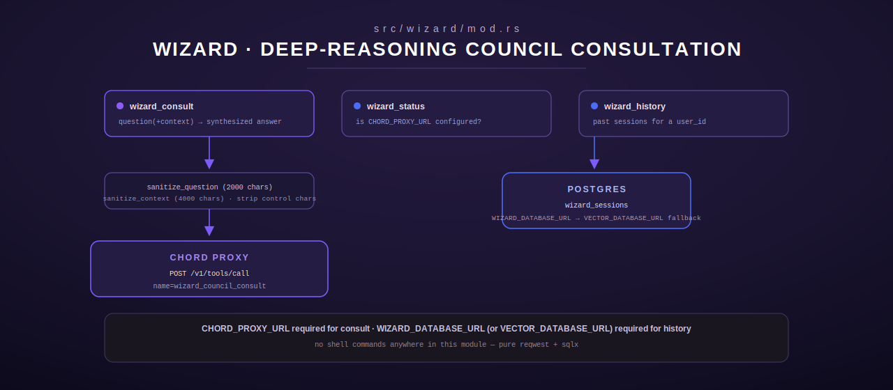

# wizard — Deep-Reasoning Council Consultation

[← models-review index](README.md) · [← tools index](../README.md) · [← docs index](../../README.md)

`src/wizard/mod.rs` registers three tools — `wizard_consult`, `wizard_status`,
`wizard_history` — that submit free-text questions to "the Wizard", a
deep-reasoning LLM council reached through the **Chord** proxy
(`CHORD_PROXY_URL`), and record/retrieve session history in Postgres
(`WIZARD_DATABASE_URL`, falling back to `VECTOR_DATABASE_URL` if unset — the
Wizard and Vector modules share the same database rather than each needing
their own). Shell commands are never used anywhere in this module.



## Config (env)

| Env var | Purpose |
|---|---|
| `CHORD_PROXY_URL` | Base URL for Chord's tool-call proxy. Required for `wizard_consult`; `wizard_status` reports availability without erroring if unset. |
| `WIZARD_DATABASE_URL` | Postgres URL for session history. |
| `VECTOR_DATABASE_URL` | Fallback if `WIZARD_DATABASE_URL` is unset — the Vector module's shared DB. |

`chord_proxy_url()` and `wizard_db_url()` (`src/wizard/mod.rs:21-36`) both
return `ToolError::NotConfigured` when neither variable is present.

## Input sanitization

Two shared helpers guard every free-text field before it leaves the process:

- **`sanitize_question`** (`src/wizard/mod.rs:39-48`) — strips ASCII control
  characters, truncates to 2000 chars, and rejects (`InvalidArgument`) if the
  result is empty or whitespace-only after cleaning.
- **`sanitize_context`** (`src/wizard/mod.rs:51-56`) — same control-char strip,
  truncates to 4000 chars, but never errors (empty context is valid — it's
  optional).

---

## `wizard_consult`

Submit a consultation question to the Wizard council through Chord's proxy.
`WizardConsult`, `src/wizard/mod.rs:80`.

### Input schema

| Field | Type | Required | Notes |
|---|---|---|---|
| `question` | string | yes | sanitized, capped at 2000 chars |
| `context` | string | no | optional background, sanitized, capped at 4000 chars |

### Behavior

1. Sanitizes `question` (error if it ends up empty) and `context` (if
   present).
2. Resolves `CHORD_PROXY_URL`, `POST`s to `<base>/v1/tools/call` with body
   `{"name": "wizard_council_consult", "arguments": {"question": ..., "context":
   ... (only if non-empty)}}` — a 120s timeout on the client request.
3. A non-2xx Chord response → `ToolError::Http` reporting the status code (the
   proxy's body is not parsed in this case).
4. A 2xx response is deserialized as `{result: Option<String>, error:
   Option<String>}`. A non-null `error` field → `ToolError::Execution`. A null
   `result` with no error → falls back to the literal string `"(no response
   from Wizard council)"`.

### Output shape

The Wizard's synthesized response text, verbatim (not wrapped in JSON) — or
the fallback string above if Chord returned neither a result nor an error.

### Errors

- `InvalidArgument` — missing/empty `question`.
- `NotConfigured` — `CHORD_PROXY_URL` unset.
- `Http` — network failure reaching Chord, non-2xx status, or malformed JSON
  response body.
- `Execution` — Chord/the council itself reported a structured error.

### Worked example

Request: `{"question": "Should the reminder scheduler poll every 60s or use a
timer wheel?", "context": "Current impl polls a Postgres table every 60s; ~50
active reminders expected."}`. Response: the council's synthesized text answer.

---

## `wizard_status`

Check whether Wizard consultation is available. `WizardStatus`,
`src/wizard/mod.rs:169`.

### Input schema

None.

### Behavior

Calls `chord_proxy_url()` and reports the result either way — **this tool
never errors**, regardless of configuration state.

### Output shape

- Configured: `"Wizard consultation available (proxy: <url>)"` — note this
  echoes the configured proxy URL directly into the tool output; see the PII
  discussion below.
- Not configured: `"Wizard consultation not available: CHORD_PROXY_URL is not
  set"`.

### Errors

None — always `Ok`.

> **Note on the proxy-URL echo**: unlike `serving_tools.rs`'s explicit
> S6-sanitization discipline (never echo hosts/paths in tool output), this
> tool's success branch does include the raw `CHORD_PROXY_URL` value in its
> response text (`src/wizard/mod.rs:188-190`). That is what the code
> currently does — flagged here rather than silently omitted, per this doc
> set's rule to describe actual behavior even where it diverges from the
> stricter pattern used elsewhere in the crate.

---

## `wizard_history`

Return past Wizard consultation sessions for a user. `WizardHistory`,
`src/wizard/mod.rs:202`.

### Input schema

| Field | Type | Required | Default |
|---|---|---|---|
| `user_id` | string | yes | — non-empty, max 128 chars |
| `limit` | integer | no | 10, clamped to `[1, 50]` |

### Behavior

1. Validates `user_id` non-empty and ≤128 chars.
2. Clamps `limit` into `[1, 50]` via `.clamp(1, 50)` (a negative or
   out-of-range value is silently clamped, not rejected).
3. Opens a short-lived Postgres pool (`max_connections(2)`) against
   `wizard_db_url()`.
4. Queries: `SELECT id, question, created_at::text FROM wizard_sessions WHERE
   user_id = $1 ORDER BY created_at DESC LIMIT $2`.
5. Empty result set → a friendly `"No Wizard sessions found for user
   '<id>'"` string (`Ok`, not an error).

### Output shape

```
Wizard sessions for 'alice':
  [42] 2026-07-08 14:03:11: Should the reminder scheduler poll every 60s or use a timer wheel?
  [41] 2026-07-05 09:12:44: What's the tradeoff between panel_majority and panel_unanimous review?
```

### Errors

- `InvalidArgument` — missing, empty, or >128-char `user_id`.
- `NotConfigured` — neither `WIZARD_DATABASE_URL` nor `VECTOR_DATABASE_URL`
  set.
- `Database` — connection or query failure.

---

## Registration

`register(registry: &mut ToolRegistry)` (`src/wizard/mod.rs:287-296`)
registers all three tools unconditionally via `register_or_replace` — there is
no env-gated stub path; misconfiguration surfaces per-call as
`NotConfigured`.

## See also

- [`review.md`](review.md) — a different multi-provider consultation
  surface (structured verdict aggregation across CLI/OpenRouter providers)
  — don't confuse the Wizard council (a single synthesized-answer
  consultation via Chord) with `review_run`'s per-provider verdict panel.
- The Chord repo ([moosenet-io/Chord](https://github.com/moosenet-io/Chord))
  owns the `wizard_council_consult` tool-call target itself; this module is
  strictly the Terminus-side client and session-history store.
