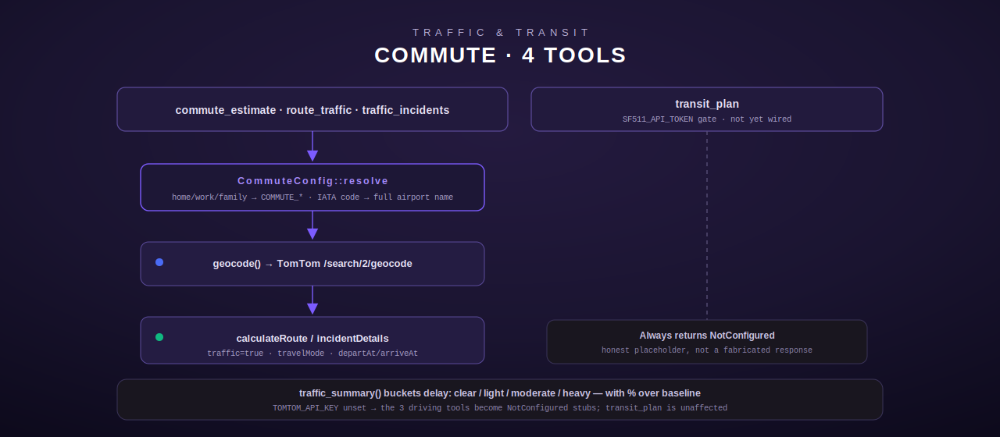

# Commute — traffic-aware routing & transit planning

[← personal-life index](README.md) · [← tool index](../README.md) · [← docs index](../../README.md)

Commute provides traffic-aware driving directions via the TomTom API, plus a named-location
shortcut system (`home`/`work`/`family`) so the operator never has to repeat an address, IATA
airport-code expansion for reliable geocoding, and a Bay Area public-transit planner stub for
511.org. Defined in [`src/commute/mod.rs`](../../../src/commute/mod.rs).

## Configuration

| Env var | Required | Notes |
|---|---|---|
| `TOMTOM_API_KEY` | yes, for the 3 driving tools | unset → `NotConfigured` stubs for `commute_estimate`/`route_traffic`/`traffic_incidents`; `transit_plan` is unaffected |
| `COMMUTE_HOME` | no | default home address; also consumed by the [weather](weather.md) tool as its location fallback |
| `COMMUTE_WORK` | no | default work address |
| `COMMUTE_FAMILY` | no | family / occasional-visit address |
| `SF511_API_TOKEN` | no | 511.org token for `transit_plan`; even when set, the trip planner is **not yet wired** (see below) |

## Named-location resolution

`CommuteConfig::resolve` (`src/commute/mod.rs:67-87`) maps a caller's location keyword
(case-insensitive) to the configured address:

| Keywords | Resolves to |
|---|---|
| `home`, `house` | `COMMUTE_HOME` |
| `work`, `office`, `the office` | `COMMUTE_WORK` |
| `family`, `family home`, `parents` | `COMMUTE_FAMILY` |
| anything else | passed through as a literal address/`lat,lon`, after IATA expansion (below) |

Resolving a named keyword whose backing env var is unset returns `NotConfigured` naming the
specific missing variable (e.g. `"COMMUTE_HOME not configured"`), not a generic error.

**IATA airport-code expansion** (`expand_iata`, `src/commute/mod.rs:91-134`): a bare 3-letter
alphabetic string geocodes to the wrong place on its own (e.g. TomTom might resolve "SJC" to
something other than San Jose International Airport), so any exact 3-letter code is expanded
to a full "Airport, City, ST" string before geocoding. 34 major US airports are hardcoded
(`ATL`, `LAX`, `ORD`, `DFW`, `DEN`, `JFK`, `LGA`, `EWR`, `SFO`, `SJC`, `OAK`, `SMF`, `SEA`,
`LAS`, `PHX`, `SAN`, `MCO`, `TPA`, `MIA`, `FLL`, `CLT`, `IAH`, `BOS`, `MSP`, `DTW`, `PHL`,
`BWI`, `IAD`, `DCA`, `SLC`, `AUS`, `BNA`, `PDX`, `HNL`); an unrecognized 3-letter string (e.g.
`"ZZZ"`) passes through unchanged.

## Geocoding & routing internals

`geocode` (`src/commute/mod.rs:139-183`) accepts a literal `"lat,lon"` pair as-is
(`is_coord_pair`), otherwise calls `GET https://api.tomtom.com/search/2/geocode/{urlencoded
location}.json?limit=1`, taking the first result's `position.lat`/`position.lon`. Failure to
geocode returns `NotFound`.

`calc_route` (`src/commute/mod.rs:220-280`) calls `GET
https://api.tomtom.com/routing/1/calculateRoute/{origin}:{dest}/json` with `traffic=true` and
`travelMode={mode}`. Timing precedence: `arrive_by` (if given) sets `arriveAt`, and TomTom
plans backwards; otherwise `depart_at` sets `departAt` unless it is `"now"` or empty, in which
case the parameter is omitted entirely (TomTom's own default = live traffic now). The response
summary yields travel time, no-traffic time, delay, and distance, each rounded to one decimal
place; distance is converted meters → miles via `METERS_PER_MILE = 1609.34`.

`traffic_summary` (`src/commute/mod.rs:282-297`) buckets the delay into four human-readable
tiers: **clear** (<1 min), **light** (<5 min), **moderate** (<15 min, shows a percentage over
baseline), **heavy** (≥15 min, shows percentage). `format_route` renders the full report,
including a `"Leave by: {departure} to arrive at {arrival}"` line only when `arrive_by` was
supplied.

## commute_estimate

Traffic-aware commute for a typical day, defaulting to home→work
(`src/commute/mod.rs:323-368`).

**Input schema**

| Field | Type | Required | Default |
|---|---|---|---|
| `from` | string: `home`\|`work`\|`family`\|address | no | `home` |
| `to` | string: same | no | `work` |
| `depart_at` | string: `"now"` or ISO time | no | `now` |
| `arrive_by` | string: ISO time | no | — |

Empty strings for `from`/`to`/`depart_at` are treated as "not provided" (the model sometimes
passes `""` explicitly rather than omitting the key), so the defaults still apply.

**Errors:** `NotConfigured` if `TOMTOM_API_KEY` or a referenced named location's env var is
unset; `Http`/`NotFound` from geocoding/routing failures.

## route_traffic

The general-purpose version: any two locations, any travel mode
(`src/commute/mod.rs:370-424`).

**Input schema**

| Field | Type | Required | Default |
|---|---|---|---|
| `origin` | string: address, `lat,lon`, IATA code, or `home`/`work`/`family` | no | `home` |
| `destination` | string: same | **yes** | — |
| `mode` | string: `car`\|`truck`\|`pedestrian`\|`bicycle` | no | `car`; any other value silently falls back to `car` |
| `depart_at` | string | no | `now` |
| `arrive_by` | string: ISO time | no | — |

Unlike `commute_estimate`, `origin` is optional (defaults to `home`) but `destination` is
required and validated explicitly — a missing/empty `destination` raises `InvalidArgument`
before any resolution or network call. When `mode != "car"`, the mode is appended to the
formatted output as an extra line.

## traffic_incidents

Lists current accidents, construction, and closures near a location
(`src/commute/mod.rs:426-499`).

**Input schema**

| Field | Type | Required | Default |
|---|---|---|---|
| `location` | string: address, `lat,lon`, or `home`/`work`/`family` | yes | — |
| `radius_miles` | number | no | `10`, clamped to `1..=50` |

**Behavior.** After geocoding the center point, a bounding box is computed with `dlat =
radius/69.0` and `dlon = radius/54.6` (approximate miles-per-degree at mid-latitudes), then
`GET https://api.tomtom.com/traffic/services/5/incidentDetails` with that `bbox` and a fixed
`fields` selector requesting `type`, `iconCategory`, `magnitudeOfDelay`, `events{description,
code}`, `from`, `to`. Up to 10 incidents are rendered as bullet lines with an optional `(from →
to)` location suffix. Zero incidents returns a plain "No traffic incidents within {radius}
miles" message rather than an empty list.

## transit_plan

Public-transit planning for the Bay Area via 511.org — **stub, not yet wired**
(`src/commute/mod.rs:501-538`).

**Input schema**

| Field | Type | Required |
|---|---|---|
| `origin` | string | yes |
| `destination` | string | yes |
| `depart_at` | string | no |

**Behavior.** This tool always errors today, in one of two ways, regardless of the
`TOMTOM_API_KEY` configuration state (it is registered independently of the other three
tools' config gate):

- `SF511_API_TOKEN` unset → `NotConfigured`: "Public transit needs a free 511.org token. Get
  one at https://511.org/open-data/token and set SF511_API_TOKEN."
- `SF511_API_TOKEN` set → `NotConfigured`: "SF511_API_TOKEN is set but the 511 trip-planner is
  not yet wired. Driving tools (commute_estimate / route_traffic) are fully available."

The arguments are never read in the second branch — this is an honest placeholder rather than
a fabricated response, matching this codebase's convention of returning `NotConfigured` for
genuinely unimplemented backends (see also `council_convene` in the [council](council.md)
module).

## Registration

`register()` (`src/commute/mod.rs:565-581`) is asymmetric: when `TOMTOM_API_KEY` is set, all
four tools register live (three real + `TransitPlan`, which is always the same struct
regardless of key presence); when unset, `commute_estimate`/`route_traffic`/
`traffic_incidents` become `NotConfiguredStub`s naming `TOMTOM_API_KEY`, but `TransitPlan`
still registers normally (its own `SF511_API_TOKEN` gate is independent, checked inside
`execute`, not at registration time).
