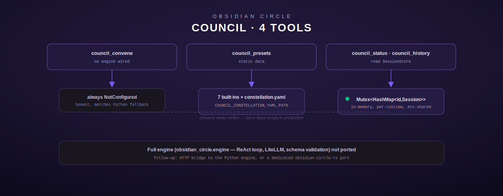

# Council — multi-model deliberation (Obsidian Circle)

[← personal-life index](README.md) · [← tool index](../README.md) · [← docs index](../../README.md)

The Obsidian Circle is a multi-model reasoning council: different AI models/personas
deliberate independently on a question, then synthesize a recommendation. This module
(`src/council/mod.rs`) is a **partial** port of the Python `council_tools.py` — `council_presets`,
`council_status`, and `council_history` are ported faithfully and fully; `council_convene` is
deliberately **not** backed by a working deliberation engine.



## What this port does and does not do

The Python source is a thin MCP wrapper around a much larger separate Python subsystem —
`obsidian_circle.engine` (~490 lines), which runs a real multi-model ReAct deliberation loop:
calling multiple LLM providers through LiteLLM, broadcasting tool results between "members,"
synthesizing a recommendation, validating it against a JSON schema, and evaluating a
confidence threshold, plus `obsidian_circle.output` (formatting) and `obsidian_circle.personas`
(persona definitions) (`src/council/mod.rs:1-11`).

Porting `engine.py` would mean re-implementing an entire separate multi-provider LLM
orchestration system as a side effect of a 4-module tool port — explicitly out of scope. This
Rust port takes the same honest fallback path the Python source itself takes when
`obsidian_circle` fails to import: `council_convene` unconditionally returns `NotConfigured`
rather than fabricating a deliberation (`src/council/mod.rs:20-32`). The two documented
follow-ups are either bridging to the existing Python engine over HTTP, or a dedicated
`obsidian-circle-rs` port.

`council_presets`, `council_status`, and `council_history` have no dependency on the missing
engine — presets are static data, and status/history only ever read the in-memory session
store that `council_convene` *would* populate (but currently never does, since it always
errors before deliberating).

## Configuration

| Env var | Required | Notes |
|---|---|---|
| `COUNCIL_CONSTELLATION_YAML_PATH` | no | optional path to a `constellation.yaml` for custom preset definitions under `council.circles`; unset → only the 7 built-in presets are listed |

## council_convene

Convene the circle for multi-model deliberation on a question
(`src/council/mod.rs:186-233`).

**Input schema**

| Field | Type | Required | Default |
|---|---|---|---|
| `question` | string | **yes** | — |
| `circle` | string: preset name | no | `quick` |
| `budget` | number, max USD to spend | no | `0.10` |
| `mode` | string: `multi`\|`prism` | no | `multi` |
| `output_format` | string: `text`\|`json` | no | `text` |

**Behavior.** `question` is validated as present and non-null; every other field is accepted
into the schema but **never read** by `execute()` — the function validates `question`, then
unconditionally returns `Err(ToolError::NotConfigured("Obsidian Circle not available — the
deliberation engine (obsidian_circle) has not been ported to Rust. Use the Python MCP tool or
wire up COUNCIL_ENGINE_URL to bridge to a running engine."))`. No session is ever recorded in
the `SessionStore` as a result of calling this tool — the store only exists for
`council_status`/`council_history` to read, and in production it stays empty in this build.

**Errors:** `InvalidArgument` if `question` is missing/not a string; `NotConfigured`
unconditionally otherwise.

## council_presets

Lists all available presets with descriptions and member counts
(`src/council/mod.rs:239-276`). No arguments.

**7 built-in presets** (`BUILTIN_PRESETS`, `src/council/mod.rs:71-79`, mirroring
`presets.py::_BUILTIN_PRESETS` metadata — the `members`/`synthesis_model` fields that would
drive actual deliberation are omitted since nothing executes them yet):

| Name | Display name | Members | Description |
|---|---|---|---|
| `quick` | Quick | 1 | Mr. Wizard solo — fast single-model answer |
| `architecture` | Architecture | 3 | Architect, Skeptic, Pragmatist |
| `security` | Security | 2 | Security Auditor + Skeptic |
| `cost` | Cost | 2 | Cost Optimizer + Pragmatist |
| `research` | Research | 4 | Multi-model research synthesis, 4 distinct architectures |
| `full` | Full Council | 7 | All 7 personas — maximum deliberation, highest cost |
| `custom` | Custom | 1 | User-defined preset from `constellation.yaml` |

**Custom presets** (`load_yaml_presets`, `src/council/mod.rs:103-113`): read from
`COUNCIL_CONSTELLATION_YAML_PATH` → `council.circles` (a map of preset-name → `{display_name,
description, members}`), matching `presets.py::_load_yaml_presets`. A custom preset whose name
collides with a built-in is silently skipped (built-ins win). A missing or unparseable file
degrades gracefully to built-ins only, rather than erroring.

**Output** is a formatted text list, e.g.:
```
Obsidian Circle presets:

  quick          1 member(s)  Mr. Wizard solo — fast single-model answer
  architecture   3 member(s)  3 Prism personas — Architect, Skeptic, Pragmatist
  ...

Use: council_convene(question, circle="<name>")
```

## council_status

Check a specific session or list recent sessions (`src/council/mod.rs:282-367`).

**Input schema**

| Field | Type | Required | Default |
|---|---|---|---|
| `session_id` | string | no | `""` (list recent instead of a specific lookup) |

**Behavior.** With a non-empty `session_id`: returns a formatted single-session report
(question truncated to 100 chars, confidence as a percentage, cost to 4 decimal places) if
found in the runtime's `SessionStore`, or `"Session '{id}' not found in this runtime"` if not
— this is a plain string result, not an error, even for an unknown id. With no `session_id`:
lists up to 8 most-recent sessions (by timestamp descending), each showing a 12-char id tail,
circle, confidence, action, and a question brief truncated to 55 chars.

**Important scope note:** because `council_convene` never writes to `SessionStore` in this
build (see above), `council_status` will realistically always report "No council sessions this
runtime" in production — the tool is fully implemented and tested against a manually-populated
store, but has no live producer yet.

## council_history

Full history table for the runtime session (`src/council/mod.rs:373-451`).

**Input schema**

| Field | Type | Required | Default |
|---|---|---|---|
| `limit` | integer | no | `10`, capped at `50` |

**Behavior.** Renders a table (session id tail, circle, confidence %, action, cost, question
truncated to 42 chars) sorted newest-first, plus a trailing `"Total council spend this
runtime: ${sum}"` line summed over **all** sessions in the store regardless of `limit`. Same
empty-store caveat as `council_status` applies in production.

## SessionStore (internal, not exposed as a tool)

A `Mutex<HashMap<String, Session>>` shared via `Arc` between `CouncilStatus` and
`CouncilHistory` at registration time (`src/council/mod.rs:153-180`). Each `Session` carries
`id, timestamp, question, circle, confidence, action, cost_usd, elapsed_s, member_count`. The
`insert` method is `#[cfg(test)]`-only — there is no production code path that populates the
store, consistent with `council_convene` never deliberating.

## Registration

`register()` (`src/council/mod.rs:458-465`) always registers all 4 tools unconditionally —
there is no env-var gate or stub-substitution in this module; the "not implemented" state is
expressed entirely through `council_convene`'s runtime `NotConfigured` response.
