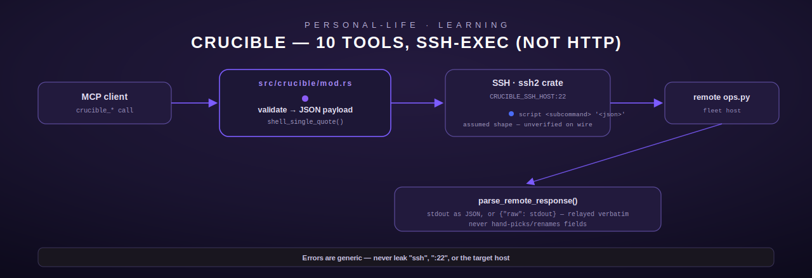

# crucible — Learning tracker

[← personal-life index](README.md) · [← tools index](../README.md)

`crucible` is a 10-tool module (`src/crucible/mod.rs`) for tracking learning progress — books,
courses, certifications, hobbies, skills — streaks, a reading queue, and an HTML dashboard. It is
architecturally the odd one out among this page's six modules: **it is not HTTP-backed.** Every
other module here (`ledger`, `vitals`, `relay`, `myelin`) either calls a REST API or queries
Postgres directly. `crucible` SSHes into the fleet host and runs a remote script, exactly like the
already-ported `sentinel` and `vigil` modules elsewhere in this crate.

## Why SSH, and what is/isn't verified — read this before touching the module

The module's own doc comment (`src/crucible/mod.rs:1-116`) is unusually candid about the porting
process, and it matters for how you should read this page:

- **Verified live**: every one of the 10 tool names, descriptions, and JSON Schemas via
  `tools/list` against the legacy Terminus host's live MCP endpoint. And, decisively, calling
  every tool against that live server returned the **identical failure signature**:
  `{"error": "ssh: connect to host <fleet-host> port 22: No route to host"}` — proving the
  backend's transport is SSH-exec to the fleet host, not an HTTP call to an Engram service (a
  case-insensitive grep for "engram" across this repo found no `EngramClient`/HTTP client at
  all, consistent with there being no HTTP Engram API to build one for).
- **NOT verified** (the fleet host was unreachable for the entire porting session, and the
  legacy host's Python source was not reachable by any other route either): the exact remote
  script path/invocation per tool, and the exact JSON shape of a **successful** response for any
  of the 10 tools.

Given that gap, this module makes three deliberate, explicitly-flagged design choices rather than
inventing unverified behavior:

1. It mirrors `sentinel`'s already-verified SSH-exec mechanics exactly (same `ssh2` crate usage,
   same generic non-infra-leaking error messages, same `<MODULE>_SSH_HOST`/`_SSH_USER`/
   `_SSH_KEY_PATH` env-var naming convention).
2. It invokes one **assumed-shape** remote script — `<script> <subcommand> '<json>'`, mirroring
   the one-script-many-subcommands shape `sentinel`'s `SENTINEL_SCRIPT` already uses. The
   subcommand name and JSON payload keys are inferred from the `tools/list` `inputSchema` field
   names, **not observed on the wire**. This is explicitly flagged in the source for human audit.
3. It does not hand-pick or rename fields out of the remote response. `parse_remote_response`
   (`src/crucible/mod.rs:286-292`) parses stdout as JSON and relays it **verbatim**; if stdout
   isn't valid JSON, it's wrapped as `{"raw": "<trimmed stdout>"}`. This avoids fabricating a
   response shape that might not match the real backend.

`crucible_dashboard` additionally follows the established `sentinel`/`vigil` pattern of
triggering **remote** HTML regeneration rather than rendering HTML in Rust — every other
dashboard-generating tool in this crate does it that way, and none renders HTML locally, so this
port doesn't invent a local renderer either. (Practical consequence: there's no local HTML
fixture to test here, unlike `meridian_report`'s locally-rendered dashboard — see
[`meridian.md`](meridian.md). The tests below instead cover command construction, response
relaying, and injection-safety.)

## Configuration

| Env var | Purpose | Default |
| --- | --- | --- |
| `CRUCIBLE_SSH_HOST` | SSH host of the fleet box | none — `NotConfigured` if unset |
| `CRUCIBLE_SSH_USER` | SSH user | `"root"` |
| `CRUCIBLE_SSH_KEY_PATH` | Path to the SSH private key file | none — `NotConfigured` if unset |
| `CRUCIBLE_SCRIPT` | Remote script invocation (assumed shape, unverified — see above) | none — **no compiled-in default** as of the 2026-07 PII remediation; `NotConfigured` if unset |

## Security model

- **Enum allowlists**: `track_type`/`type_filter` ∈ `{book, course, cert, hobby, skill}`;
  `priority` ∈ `{urgent, normal, low}`; `status_filter` ∈ `{unread, read, ""}` — all validated
  against the exact allowlist the live `tools/list` descriptions document.
- **Dates** (`target_date`, `date`): validated as `YYYY-MM-DD` when non-empty; empty is always
  permitted (optional fields).
- **Free text** (`name`, `goal`, `progress`, `notes`, `project`, `entry_type`, `location`,
  `title`, `track`, `slug`): capped at 2000 characters (`MAX_TEXT_LEN`) but otherwise
  **unrestricted in content** — because these fields never touch the shell as raw text. Every
  tool serializes its arguments to one JSON blob and shell-single-quotes that whole blob
  (`shell_single_quote`, `src/crucible/mod.rs:265-267`, matching `dev::escape_single_quotes`'s
  convention: embedded `'` becomes `'\''`) before splicing it into the SSH command string — no
  combination of shell metacharacters in a field can break out of the quoted argument. This is
  directly tested with an adversarial payload
  (`test_build_command_escapes_embedded_single_quotes`, using a `goal` value containing
  `'; rm -rf / #`).
- **Out of scope for this module's own audit**: because `crucible_dashboard` doesn't render HTML
  in this crate, the XSS/HTML-injection risk an adversarial reviewer would normally look for in a
  dashboard generator applies to the **remote** script instead, which this crate never sees.

## Command construction and response parsing (pure, independently testable)

- **`build_command(script, subcommand, payload)`** (`src/crucible/mod.rs:275-280`) → `"{script}
  {subcommand} '{escaped_json_payload}'"`.
- **`ssh_exec(config, command, timeout_secs)`** (`src/crucible/mod.rs:301-371`) opens a TCP
  connection to `{host}:22`, performs SSH handshake + pubkey auth, execs the command on a fresh
  channel, and reads stdout. A non-zero remote exit status is a hard `ToolError::Execution`. Every
  failure branch logs the real error via `tracing::warn!` but returns a **generic, non-leaking**
  message to the caller (e.g. `"The fleet server is unreachable."`) — covered explicitly by
  `test_ssh_exec_unreachable_error_is_generic`, which asserts the returned message contains
  neither `"ssh"`, `":22"`, nor the target IP.
- **`run_subcommand(config, subcommand, payload)`** (`src/crucible/mod.rs:375-390`) is the
  per-tool entry point: builds the command, runs `ssh_exec` inside `tokio::task::spawn_blocking`
  (since `ssh2` is synchronous), and pretty-prints the parsed response.

## Tools

All 10 tools share the pattern: validate args → build a JSON payload → `run_subcommand(&self.config,
"<subcommand>", payload)`. The table below lists the assumed subcommand name and the exact schema
per tool; consult the "not verified" caveat above for anything about the *response* shape.

### `crucible_track_create` → subcommand `track_create`

| Field | Type | Required | Notes |
| --- | --- | --- | --- |
| `name` | string | yes | Human-readable name, ≤2000 chars |
| `track_type` | string | yes | Enum: `book, course, cert, hobby, skill` |
| `goal` | string | yes | What completion looks like, ≤2000 chars |
| `target_date` | string | no | `YYYY-MM-DD`, default `""` |

Creates a new learning track. Returns the created track object with its slug for future
`crucible_log` calls (per the tool description — unverified response shape).

### `crucible_log` → subcommand `log`

| Field | Type | Required | Notes |
| --- | --- | --- | --- |
| `track` | string | yes | The track slug |
| `progress` | string | yes | What was accomplished |
| `notes` | string | no | Default `""` |
| `duration_min` | integer | no | Default `0`; **must be in `0..=1440`** (minutes in a day) — this bound is explicit defense-in-depth added specifically so an unbounded value never reaches the remote script unchecked (flagged by adversarial review; tested with `i64::MAX`) |

Logs a learning session for an existing track by slug. Updates streak; the response is expected
to include the streak count and any milestone hit.

### `crucible_status` → subcommand `status`

| Field | Type | Required | Default |
| --- | --- | --- | --- |
| `track` | string | no | `""` — empty means all active tracks |

Status of one track (by slug) or all active tracks.

### `crucible_streak` → subcommand `streak`

No arguments. Overall cross-track streak: expected to include `current_streak` (consecutive days
with any session), `recent_active_days` (last 30 days), and `sessions_total`.

### `crucible_tracks` → subcommand `tracks`

| Field | Type | Required | Default | Notes |
| --- | --- | --- | --- | --- |
| `type_filter` | string | no | `""` | Enum-validated only if non-empty |
| `active_only` | boolean | no | `true` | |

Lists tracks, optionally filtered by type and/or restricted to active ones.

### `crucible_hobby` → subcommand `hobby`

| Field | Type | Required | Notes |
| --- | --- | --- | --- |
| `project` | string | yes | Project name |
| `entry_type` | string | yes | e.g. `build`, `flight`, `test`, `repair`, `planning` — freeform, not enum-restricted despite the example list |
| `date` | string | no | `YYYY-MM-DD`, default `""` (today, per description) |
| `location` | string | no | Default `""` |
| `notes` | string | no | Default `""` |

Logs a hobby activity (FPV drone, photography, woodworking, etc.) — stored server-side under
`crucible/hobbies/` per the description.

### `crucible_reading_add` → subcommand `reading_add`

| Field | Type | Required | Default | Notes |
| --- | --- | --- | --- | --- |
| `title` | string | yes | — | Title or URL of the item |
| `priority` | string | no | `"normal"` | Enum: `urgent, normal, low` |
| `notes` | string | no | `""` | Why it's relevant / what to look for |

Adds an item to the reading queue; returns a slug for `crucible_reading_done`.

### `crucible_reading_list` → subcommand `reading_list`

| Field | Type | Required | Default |
| --- | --- | --- | --- |
| `status_filter` | string | no | `"unread"` — enum: `unread, read, ""` |

Lists the reading queue, sorted by priority then date added (per description).

### `crucible_reading_done` → subcommand `reading_done`

| Field | Type | Required | Default |
| --- | --- | --- | --- |
| `slug` | string | yes | — |
| `notes` | string | no | `""` |

Marks a reading-queue item done by its slug.

### `crucible_dashboard` → subcommand `dashboard`

No arguments. Triggers remote regeneration of the learning dashboard on the fleet host's
`/learning/` page from current track/streak/reading-queue data — does not render locally (see
above). Expected to return the path to the written HTML file.

## Registration

`register()` (`src/crucible/mod.rs:854-885`) builds one shared `Arc<CrucibleConfig>` from
`CrucibleConfig::from_env()` and clones it into all 10 tool structs, registering each via
`registry.register(...)` (note: `crucible` uses plain `register`, not `register_or_replace` —
the only module on this page with that distinction).

## Errors summary

| `ToolError` variant | When |
| --- | --- |
| `NotConfigured` | `CRUCIBLE_SSH_HOST`, `CRUCIBLE_SSH_KEY_PATH`, or `CRUCIBLE_SCRIPT` unset (checked in that order, at the point each is actually needed — `CRUCIBLE_SCRIPT` is checked first inside `run_subcommand`, host/key inside `ssh_exec`) |
| `InvalidArgument` | Bad enum value, malformed date, oversized text field, `duration_min` outside `0..=1440` |
| `Execution` | Any SSH-layer failure (unreachable host, handshake/auth failure, non-zero remote exit) — always genericized, never leaking host/port/transport details; also a `tokio` task-join failure |
