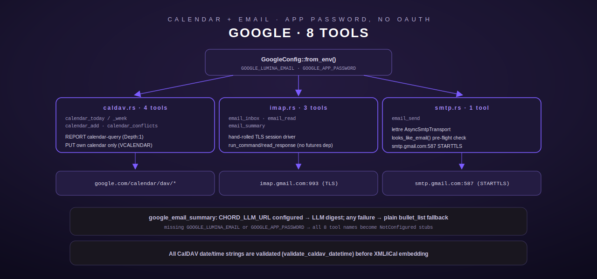

# Google — Calendar (CalDAV) & Email (IMAP/SMTP)

[← personal-life index](README.md) · [← tool index](../README.md) · [← docs index](../../README.md)

Eight tools ported from the legacy Python `google_tools.py`: four calendar tools over CalDAV
(`src/google/caldav.rs`), three email-read tools over IMAP (`src/google/imap.rs`), and one
email-send tool over SMTP (`src/google/smtp.rs`), sharing configuration defined in
[`src/google/mod.rs`](../../../src/google/mod.rs). Auth throughout is a **Gmail App
Password** (no OAuth) over standard CalDAV / IMAPS / SMTP+STARTTLS — this works with any
compatible provider, not only Gmail.



## Configuration

| Env var | Required | Notes |
|---|---|---|
| `GOOGLE_LUMINA_EMAIL` | yes | the account address — also the IMAP/SMTP/CalDAV username |
| `GOOGLE_APP_PASSWORD` | yes | Gmail App Password |
| `GOOGLE_PETER_EMAIL` | no | operator's personal calendar address; default `<email>` (placeholder) |
| `GOOGLE_LUMINA_CALENDAR_ID` | no | an extra group calendar id to include when reading |
| `GOOGLE_EXTRA_CALENDARS` | no | comma-separated extra calendar ids |

If `GOOGLE_LUMINA_EMAIL` or `GOOGLE_APP_PASSWORD` is missing, `register()` installs a
`NotConfiguredStub` for all 8 tool names (`GOOGLE_TOOL_NAMES`, `src/google/mod.rs:87-112`)
instead of the real sub-module registrations — every stub returns the same `NotConfigured`
error naming both required vars.

`GoogleConfig::all_calendar_ids()` (`src/google/mod.rs:74-83`) returns every calendar id to
query, in priority order, de-duplicated: the account's own email, `GOOGLE_PETER_EMAIL`, any
`GOOGLE_EXTRA_CALENDARS`, then `GOOGLE_LUMINA_CALENDAR_ID` if set. All four calendar-read
tools query this full list and merge results.

---

## Calendar tools (CalDAV) — `src/google/caldav.rs`

Auth: HTTP Basic with `email`/`app_password`. Per-calendar CalDAV URL:
`https://www.google.com/calendar/dav/{calendar_id}/events`. Reads use a CalDAV `REPORT`
`calendar-query` (`Depth: 1`) parsed from the 207 Multi-Status iCal response; writes `PUT` a
hand-generated `VCALENDAR` document. **All date/time values are validated before being
embedded into XML or iCal text** — this module hand-builds both XML and iCal bodies via string
formatting, so the validation functions below are the injection defense, not merely input
hygiene.

### Date/time handling

`validate_caldav_datetime` (`src/google/caldav.rs:60-84`) accepts exactly three RFC 5545/4791
shapes and rejects everything else, including any XML metacharacter, with `InvalidArgument`:

| Format | Example |
|---|---|
| Date-only, 8 digits | `20260601` |
| Local date-time, 15 chars | `20260601T090000` |
| UTC date-time, 16 chars (trailing `Z`) | `20260601T090000Z` |

`parse_iso8601_utc` (`src/google/caldav.rs:92-116`) is the caller-facing parser for tool
arguments: accepts RFC 3339 (with offset or `Z`), the naive form `YYYY-MM-DDTHH:MM[:SS]`
(assumed UTC), or a bare `YYYY-MM-DD` (assumed midnight UTC) — anything else is
`InvalidArgument`. `to_caldav_utc` then formats the parsed value into the CalDAV basic-UTC
shape for embedding.

### google_calendar_today

Events today across all configured calendars (`src/google/caldav.rs:404-434`). No arguments.
Builds a UTC day window (`{today}T000000Z` .. `{today}T235959Z`) and calls `collect_events`.

### google_calendar_week

Events over a 7-day window (`src/google/caldav.rs:436-488`).

**Input schema**

| Field | Type | Required | Default |
|---|---|---|---|
| `start_date` | string `YYYY-MM-DD` | no | today (UTC) |

An invalid `start_date` format is `InvalidArgument` before any network call.

### google_calendar_add

Create an event on the Lumina calendar (`src/google/caldav.rs:490-594`).

**Input schema**

| Field | Type | Required | Default |
|---|---|---|---|
| `title` | string | **yes** | — |
| `start` | string, ISO-8601 | **yes** | — |
| `end` | string, ISO-8601 | **yes** | — |
| `description` | string | no | — |
| `location` | string | no | — |

**Behavior.** Both `start` and `end` are parsed via `parse_iso8601_utc`; `end < start` is
rejected as `InvalidArgument`. A UID is generated from the current UTC timestamp plus
nanoseconds (`generate_uid`, `src/google/caldav.rs:300-307`), no `uuid` crate dependency. All
generated date strings are re-validated with `validate_caldav_datetime` defensively before
embedding, even though they were just formatted by trusted code. `title`/`description`/
`location` are escaped per RFC 5545 §3.3.11 (`escape_ical_text`: `\`→`\\`, `;`→`\;`, `,`→`\,`,
`\n`→`\n`, `\r` dropped) before insertion into the iCal text.

**Write target — important constraint** (`src/google/caldav.rs:559-565`): the event is always
`PUT` to the **account's own calendar** (`self.cfg.email`), never to any of the other
configured calendar ids. This is deliberate: Google's legacy CalDAV endpoint with App-Password
Basic auth is the only auth/endpoint combination that works without OAuth, and it rejects
writes to group calendars the account doesn't own (403); the v2 endpoint requires a Bearer
token (401). Confirmed against the `caldav` reference library that only the own calendar is
discoverable/writable for this account.

`PUT https://www.google.com/calendar/dav/{email}/events/{uid}.ics` with `Content-Type:
text/calendar; charset=utf-8`.

**Errors:** `InvalidArgument` for missing required fields, unparseable `start`/`end`, or
`end` before `start`; `Http` on a non-2xx PUT response.

### google_calendar_conflicts

List events overlapping a window (`src/google/caldav.rs:596-658`).

**Input schema**

| Field | Type | Required |
|---|---|---|
| `start` | string, ISO-8601 | **yes** |
| `end` | string, ISO-8601 | **yes** |

Same parse/validate/`end<start` rules as `google_calendar_add`. On zero overlapping events:
`"No conflicts: the window {start} → {end} is free."`; otherwise a `"CONFLICT: {n} event(s)
overlap..."` header followed by the formatted event list.

### Shared read path — `collect_events` / `report_calendar`

`collect_events` (`src/google/caldav.rs:354-374`) queries every calendar in
`cfg.all_calendar_ids()` in sequence via `report_calendar`, **skipping** (with a `tracing::warn`,
not an error) any single calendar that fails — a bad calendar id or transient failure on one
calendar never fails the whole read. Results are deduplicated by UID (first occurrence wins)
and sorted by `DTSTART` (`dedup_and_sort`, `src/google/caldav.rs:237-242`).

### iCal parsing

`parse_ical` (`src/google/caldav.rs:200-234`) walks `BEGIN:VEVENT`/`END:VEVENT` blocks after
unfolding RFC 5545 line-folds (`unfold_ical`: a `\n ` or `\n\t` continuation is joined),
extracting `UID`, `SUMMARY`, `DTSTART`, `DTEND`, `LOCATION` via `extract_property`, which
handles both bare `KEY:value` and parameterized `KEY;param=val:value` forms and unescapes
RFC 5545 text escapes. An event with all of UID/SUMMARY/DTSTART empty is dropped as noise.

---

## Email-read tools (IMAP) — `src/google/imap.rs`

Connection: TLS to `imap.gmail.com:993`, `LOGIN` with the App Password, always `LOGOUT` after.
**Stream-free design**: `async-imap`'s `UID FETCH` normally returns a `futures::Stream`, but
`futures` is not a dependency of this crate, so the module drives the protocol at a lower
level — `run_command`/`read_response` (plain `async fn`s) — and parses `imap_proto::Response`
values itself (`src/google/imap.rs:1-13,121-160`). The `Session` wrapper
(`src/google/imap.rs:45-166`) owns `connect` (TLS handshake via `rustls-native-certs` + TCP +
`LOGIN`), `select`, `uid_search`, `uid_fetch`, and `logout`.

### google_email_inbox

List recent messages, From/Subject/Date, optionally unread-only
(`src/google/imap.rs:429-480`).

**Input schema**

| Field | Type | Required | Default |
|---|---|---|---|
| `limit` | integer | no | `10` (`DEFAULT_INBOX_LIMIT`), clamped `1..=100` |
| `unread_only` | boolean | no | `false` |

**Behavior.** `SELECT INBOX`, then `UID SEARCH ALL` or `UID SEARCH UNSEEN`. `newest_n`
(`src/google/imap.rs:418-425`) takes the last `limit` UIDs from the ascending search result and
reverses them for newest-first display. Fetches `(UID RFC822.HEADER)` for the chosen UIDs in
one batched `UID FETCH`. Zero matches returns `"No {unread }messages in INBOX."` (a success,
not an error).

### google_email_read

Read one message's `text/plain` body plus headers (`src/google/imap.rs:523-582`).

**Input schema**

| Field | Type | Required |
|---|---|---|
| `email_id` | string or number — IMAP UID from `google_email_inbox` | **yes** |

**Behavior.** `parse_email_id` (`src/google/imap.rs:399-415`) accepts either a string or a
JSON number, requires 1–10 ASCII digits, and rejects anything else (including an IMAP
command-injection attempt like `"1 LOGOUT"`) as `InvalidArgument`. Fetches
`(UID RFC822.HEADER BODY.PEEK[TEXT])` — `BODY.PEEK` specifically avoids setting the `\Seen`
flag as a side effect of reading. `extract_text_plain` (`src/google/imap.rs:273-290`) walks
MIME structure: non-multipart bodies are returned as-is (HTML-stripped if present);
`multipart/*` bodies are walked part-by-part via `walk_multipart` (recursing into nested
multiparts) to find the first `text/plain` part, falling back to an HTML-stripped `text/html`
part if no plain-text part exists. Body preview is truncated to `BODY_PREVIEW_CHARS = 3000`
chars with an ellipsis.

**Errors:** `InvalidArgument` for a missing/malformed `email_id`; `NotFound` if the UID isn't
present in `INBOX`.

### google_email_summary

An LLM-summarized digest of recent subjects, falling back to a plain bulleted list
(`src/google/imap.rs:584-649`).

**Input schema**

| Field | Type | Required | Default |
|---|---|---|---|
| `hours_back` | integer | no | `12` (`DEFAULT_SUMMARY_HOURS`), clamped `1..=720` |

**Behavior.** IMAP date search is only day-granular, so this tool does **not** issue an
IMAP-side date filter — instead it takes the most recent `SUMMARY_SUBJECT_CAP = 20` messages
by UID and reports the requested `hours_back` in the output text as a label, not an enforced
filter. `summarize_via_llm` (`src/google/imap.rs:696-722`) is tried first: if
`CHORD_LLM_URL` is set, it `POST`s an OpenAI-compatible `/v1/chat/completions` request
(`build_summary_request`, `model: "gpt-oss:20b"`, `max_tokens: 150`) asking for a few concise
bullet points on anything time-sensitive; on any problem — unset env var, transport failure,
non-2xx, empty result — the tool silently falls back to `bullet_list`, a plain `"• {subject}"`
per line. `Ok(None)` (env var unset) and `Err` (configured but failed) both fall back
identically; the caller never sees the LLM failure as a tool error.

## Env vars used only by `google_email_summary`

| Env var | Notes |
|---|---|
| `CHORD_LLM_URL` | OpenAI-compatible chat-completions base URL; unset → plain bulleted fallback, no error |

---

## Email-send tool (SMTP) — `src/google/smtp.rs`

### google_email_send

Send a plain-text email via `smtp.gmail.com:587` with STARTTLS, authenticated with the App
Password, using the [`lettre`](https://lettre.rs/) crate (`src/google/smtp.rs:1-134`).

**Input schema**

| Field | Type | Required |
|---|---|---|
| `to` | string, recipient email | **yes** |
| `subject` | string | **yes** |
| `body` | string, plain text | **yes** |

**Behavior.** `looks_like_email` (`src/google/smtp.rs:25-45`) is a lightweight pre-flight
check — exactly one `@`, non-empty local and domain parts, and a domain `.` that is neither
the first nor last character (so `<email>` passes but `a@b`, `@example.com`, `user@.com`, and
`user@example.` all fail) — run **before** attempting to parse `to` as a `lettre::Mailbox`, so
a bad recipient fails fast without ever touching the network. Both `from` (the configured
account) and `to` are additionally parsed as `Mailbox` values (a stricter RFC 5322 check);
either failing is `InvalidArgument`. The message is built via `Message::builder()...
.build()`-equivalent and sent through an `AsyncSmtpTransport<Tokio1Executor>` configured with
`starttls_relay("smtp.gmail.com").port(587)` and `Credentials::new(email, app_password)`.

**Errors:** `InvalidArgument` for any missing field, a `to` that fails `looks_like_email`, or a
`from`/`to` that `lettre` itself rejects when parsing as a `Mailbox`; `Http` if the SMTP
transport setup or the send itself fails.

**Example**

```json
// request
{"to": "<email>", "subject": "Trip dates", "body": "Confirmed for March 15."}
// response (tool output, plain text)
"Email sent to <email> — subject: Trip dates"
```

---

## Registration

`src/google/mod.rs::register()` (`src/google/mod.rs:98-112`) is all-or-nothing at the
top level: if `GoogleConfig::from_env()` succeeds, it delegates to
`caldav::register`, `imap::register`, `smtp::register` — each of which registers its own tools
unconditionally against the shared `cfg` (no further per-tool env gating inside the
sub-modules). If `GoogleConfig::from_env()` fails (missing email or app password), all 8 tool
names become `NotConfiguredStub`s instead.
