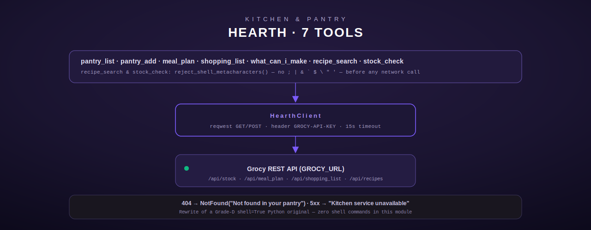

# Hearth — Grocy kitchen & pantry tools

[← personal-life index](README.md) · [← tool index](../README.md) · [← docs index](../../README.md)

Hearth wraps the [Grocy](https://grocy.info/) household-management REST API for pantry stock,
meal planning, shopping lists, and recipes. It exists as a security-motivated rewrite: the
predecessor Python `hearth_tools.py` was graded "D" because it used `shell=True` with
user-supplied arguments injected directly into `curl` URLs — a textbook shell-injection
vector. This Rust port (`src/hearth/mod.rs`) makes every call through `reqwest`; **zero shell
commands** are issued anywhere in the module (`src/hearth/mod.rs:1-11`).

## Configuration

| Env var | Required | Notes |
|---|---|---|
| `GROCY_URL` | yes | base URL of the Grocy instance. If unset, `HearthClient::from_env()` returns `None` and every tool call returns `ToolError::NotConfigured` (`src/hearth/mod.rs:58-70`) |
| `GROCY_API_KEY` | no | sent as the `GROCY-API-KEY` header on every request; an empty/absent key is sent as an empty header value rather than omitted |

## Shell-metacharacter defense

`reject_shell_metacharacters` (`src/hearth/mod.rs:32-40`) rejects any input string containing
one of `; | & \` $ \ " '` before it can reach any downstream call, returning `InvalidArgument`
naming the offending field and character. This guard is applied to the two tools that accept
free-text search strings (`hearth_recipe_search`'s `query`, `hearth_stock_check`'s
`product_name`) — the specific vector the Python original was vulnerable through. Since the
Rust port never shells out at all, this is defense-in-depth rather than the sole protection,
but it is kept because it also blocks characters that would otherwise corrupt a query string
or confuse a naive client-side match.

## HearthClient — shared HTTP layer

All seven tools hold an `Option<HearthClient>`, built once at registration time via
`HearthClient::from_env()`. `require_client()` turns a `None` into a clear `NotConfigured`
error naming `GROCY_URL` (`src/hearth/mod.rs:181-187`). The client's `get`/`post` methods
(`src/hearth/mod.rs:73-138`) share one error-mapping policy across every tool:

| Grocy HTTP status | Mapped to |
|---|---|
| `404` | `ToolError::NotFound("Not found in your pantry")` |
| any other 4xx | `ToolError::Http("Grocy API error: {status}")` |
| any 5xx | `ToolError::Http("Kitchen service unavailable (HTTP {status})")` |
| `204 No Content` (POST only) | `Ok(json!({"status": "ok"}))` — some Grocy write endpoints return no body |
| 2xx with a body | parsed as `Value` |

The client has a 15-second request timeout (`src/hearth/mod.rs:61-64`).

## hearth_pantry_list

`GET /api/stock` — list every item currently in the pantry (`src/hearth/mod.rs:196-222`). No
arguments. Output is the raw stock array rendered through `format_list` (below), capped at 50
items shown even if more exist.

## hearth_pantry_add

`POST /api/stock/products/{product_id}/add` — add stock for a product
(`src/hearth/mod.rs:228-281`).

**Input schema**

| Field | Type | Required | Default |
|---|---|---|---|
| `product_id` | integer | yes | — |
| `amount` | number | yes | — |
| `price` | number | no | omitted from the request body if absent |

**Behavior.** `price`, when present and numeric, is merged into the JSON body as
`{"amount": ..., "price": ...}`; the field is dropped entirely (not sent as `null`) when
absent. Returns `"Added {amount} units of product {product_id} to pantry."`.

**Errors:** `InvalidArgument` if `product_id` is not an integer or `amount` is not a number.

## hearth_meal_plan

`GET /api/meal_plan?days={days}` — the upcoming meal plan (`src/hearth/mod.rs:287-325`).

**Input schema**

| Field | Type | Required | Default |
|---|---|---|---|
| `days` | integer | no | `7`, clamped to `1..=365` |

Output: `"Meal plan (next {days} day(s)):\n"` followed by up to 30 formatted entries.

## hearth_shopping_list

`GET /api/shopping_list` — the current grocery list (`src/hearth/mod.rs:331-359`). No
arguments. The tool description explicitly steers the model to use it for "groceries, what to
buy, what they need, the shopping list, or what's needed from the store" — worded that way so
a loosely-phrased user request routes here rather than to `hearth_pantry_list`. Output caps at
100 items.

## hearth_what_can_i_make

`GET /api/stock/volatile` — items that are expiring soon, already expired, or missing
(`src/hearth/mod.rs:365-393`). No arguments. **Note on scope**: despite the tool's name, this
endpoint is Grocy's stock-volatile overview, not a true recipe-matching engine — the module
comment documents this as surfacing "expiring + expired + missing items" and calls it the
closest available proxy for "what can I make," not a computed recipe match. The raw JSON body
is embedded directly in the output string rather than reformatted.

## hearth_recipe_search

`GET /api/recipes`, filtered client-side by name (`src/hearth/mod.rs:399-470`).

**Input schema**

| Field | Type | Required | Default |
|---|---|---|---|
| `query` | string (≤200 chars, no shell metacharacters) | yes | — |

**Behavior.** Grocy CE does not expose a reliable server-side search filter on `/api/recipes`
across versions, so the tool fetches the full recipe list and filters case-insensitively by
substring match on `name` client-side, returning up to 20 matches as `[{id}] {name}` lines. A
no-match result returns `"No recipes found matching '{query}'."` rather than an error.

**Errors:** `InvalidArgument` for a missing/non-string `query`, a forbidden shell
metacharacter, or a query over 200 characters.

## hearth_stock_check

`GET /api/stock`, filtered client-side by product name (`src/hearth/mod.rs:476-553`).

**Input schema**

| Field | Type | Required | Default |
|---|---|---|---|
| `product_name` | string (≤200 chars, no shell metacharacters) | yes | — |

**Behavior.** Fetches all stock entries and filters case-insensitively on
`item.product.name` containing `product_name`. Every match is rendered as
`"{name}: {amount} {unit}\n"`. **Two distinct not-found paths, deliberately differentiated:**
a Grocy `404` on the underlying `/api/stock` call maps to `NotFound("Not found in your
pantry")`; a `200` response with zero name matches maps to a more specific
`NotFound("Not found in your pantry: '{product_name}'")` that echoes the search term back.

**Errors:** `InvalidArgument` for a missing/non-string `product_name`, a forbidden shell
metacharacter, or over 200 characters; `NotFound` (either variant above).

## format_list helper

Shared by `hearth_pantry_list` and `hearth_meal_plan` (`src/hearth/mod.rs:145-162`): renders a
JSON array as `"({n} items[, showing first {max}]):\n"` followed by each item's `Display`
form, one per line, capped at `max` entries. An empty or non-array input renders as
`"No items found."`.

## Registration

`register()` (`src/hearth/mod.rs:559-575`) always registers all 7 tools — each is constructed
via its own `::new()`, which independently calls `HearthClient::from_env()`; there is no
shared connection pool across tools, and an unset `GROCY_URL` produces the same
`NotConfigured` error from every tool at call time rather than a stub-tool substitution (this
module has no `NotConfiguredStub` type). Registration conflicts are logged via `tracing::warn`
rather than causing a panic.
