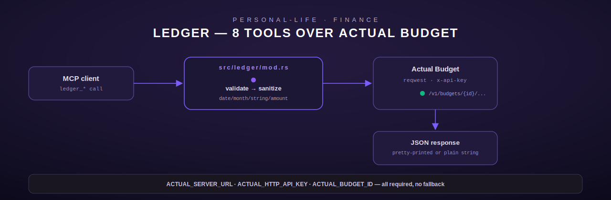

# ledger — Finance tracking (Actual Budget)

[← personal-life index](README.md) · [← tools index](../README.md)

`ledger` is an 8-tool module (`src/ledger/mod.rs`) that talks directly to a self-hosted
[Actual Budget](https://actualbudget.org/) server over its HTTP API. Every tool is a typed
`reqwest` call — the module doc comment (`src/ledger/mod.rs:1-9`) is explicit that this is a
zero-shell-command module, unlike some of its SSH-exec siblings elsewhere in `terminus_personal`
(see [`crucible.md`](crucible.md) for a module that, by contrast, genuinely has no HTTP backend
and must SSH).



## Configuration

All 8 tools share one `LedgerConfig` (`src/ledger/mod.rs:21-52`), built once per call from three
required environment variables — there is no fallback or compiled-in default for any of them,
so every tool fails clean with `ToolError::NotConfigured` the instant one is missing:

| Env var | Purpose |
| --- | --- |
| `ACTUAL_SERVER_URL` | Base URL of the Actual Budget HTTP API server |
| `ACTUAL_HTTP_API_KEY` | API key, sent as the `x-api-key` header on every request |
| `ACTUAL_BUDGET_ID` | The budget's sync ID (a UUID) — every URL is scoped under `/v1/budgets/{budget_id}/...` |

The shared `reqwest::Client` (`LedgerConfig::client`, `src/ledger/mod.rs:42-47`) has a flat
30-second timeout on every request; there is no per-tool override. Auth is a single header pair
returned by `LedgerConfig::auth_header` (`src/ledger/mod.rs:49-51`): `("x-api-key", <key>)`.

## Shared validation helpers

Three helpers are reused across most of the 8 tools (`src/ledger/mod.rs:58-112`):

- **`validate_date(s)`** — structural `YYYY-MM-DD` check only (4-digit year, 2-digit month,
  2-digit day, all ASCII digits, `-`-separated). It does **not** validate calendar correctness
  (e.g. month `13` or day `32` pass this check); that's left to the upstream Actual API to
  reject. Any deviation (wrong separator, wrong segment count/length, non-digit chars) returns
  `ToolError::InvalidArgument("Please use YYYY-MM-DD format")`.
- **`validate_month(s)`** — the same structural check but for `YYYY-MM` (used by
  `ledger_budget_summary` and `ledger_category_spend`).
- **`sanitize_string(s)`** — trims whitespace and rejects strings over 500 characters with
  `ToolError::InvalidArgument("Field value exceeds 500 character limit")`. Applied to
  `account_id`, `payee`, `notes`, and `category` on every tool that accepts them.
- **`parse_amount(v, field)`** — reads a JSON `Value` as `f64` and rejects non-numeric or
  non-finite (`NaN`/`±Infinity`) values with a field-named `InvalidArgument`.

## Tools

### `ledger_accounts`

Lists every account in the budget. No arguments (`{}`).

- **Request**: `GET {ACTUAL_SERVER_URL}/v1/budgets/{budget_id}/accounts` with the `x-api-key`
  header (`src/ledger/mod.rs:141-146`).
- **Output**: the raw Actual Budget JSON response, pretty-printed. On a non-2xx response the
  tool surfaces `ToolError::Http("Actual Budget returned {status}")`; on a transport failure
  (DNS, connection refused, timeout) it surfaces `ToolError::Http("Actual Budget unreachable: {e}")`.
- **Worked example**:
  ```json
  // request
  {}
  // response (pretty-printed passthrough of Actual's own shape)
  {
    "data": [
      { "id": "acc1", "name": "Checking", "balance": 123450 }
    ]
  }
  ```

### `ledger_transactions`

Get transactions for one account within a date range.

| Field | Type | Required | Notes |
| --- | --- | --- | --- |
| `account_id` | string | yes | Sanitized (trim, ≤500 chars) |
| `start_date` | string | yes | `YYYY-MM-DD`, structurally validated |
| `end_date` | string | yes | `YYYY-MM-DD`, structurally validated |

- **Request**: `GET .../accounts/{account_id}/transactions?since_date={start}&before_date={end}`
  (`src/ledger/mod.rs:202-211`) — Actual's own query-param names (`since_date`/`before_date`) are
  used directly; the tool does no client-side filtering.
- **Errors**: a malformed date on either bound returns `InvalidArgument` before any network call
  is made — validation happens up front (`src/ledger/mod.rs:196-197`).
- **Output**: the raw `data` array from Actual, pretty-printed.

### `ledger_add_transaction`

Writes a new transaction to an account.

| Field | Type | Required | Notes |
| --- | --- | --- | --- |
| `account_id` | string | yes | Sanitized |
| `amount` | number | yes | Dollars; **negative = expense**, positive = income/credit |
| `payee` | string | yes | Sanitized, ≤500 chars |
| `notes` | string | no | Sanitized if present, else empty string |
| `date` | string | yes | `YYYY-MM-DD` |

The dollar `amount` is converted to Actual's internal **milliunits** representation
(`src/ledger/mod.rs:275`): `milliunits = round(amount * 100) * 10` — i.e. cents rounded then
scaled by 10, so `-45.50` becomes `-45500` milliunits. The POST body always sets
`"cleared": true` (`src/ledger/mod.rs:281-290`); there is no way to add an uncleared/pending
transaction through this tool.

- **Request**: `POST .../transactions` with a `{"transactions": [{...}]}` envelope (Actual's
  batch-transaction shape used for a single item).
- **Output on success**: a plain confirmation string, not the API's raw response — e.g.
  `"Transaction added: Grocery Store $45.50 on 2026-06-07"`.
- **Worked example**:
  ```json
  // request
  {"account_id": "acc1", "amount": -45.50, "payee": "Grocery Store", "date": "2026-06-07"}
  // response
  "Transaction added: Grocery Store $45.50 on 2026-06-07"
  ```

### `ledger_budget_summary`

Gets the budget-month object for a given `month` (`YYYY-MM`, required, validated).

- **Request**: `GET .../budgets/{budget_id}/months/{month}-01` (`src/ledger/mod.rs:342-345`) —
  note the URL always appends a literal `-01` day suffix to the month string; Actual's months
  endpoint is addressed by a full date, not a bare `YYYY-MM`.
- **Output**: raw pretty-printed `data` object (budgeted/spent/balance per category for that
  month), or the literal string `"No budget data found"` if the JSON body fails to serialize
  (defensive fallback, not a distinct error path).

### `ledger_category_spend`

Aggregates spend and budgeted amount for one category name within a month — a client-side
reduction over the same month-budget payload `ledger_budget_summary` fetches, not a distinct
Actual endpoint.

| Field | Type | Required |
| --- | --- | --- |
| `category` | string | yes (≤500 chars, matched case-insensitively as a **substring**) |
| `month` | string | yes, `YYYY-MM` |

- **Behavior**: fetches `.../months/{month}-01`, then walks `data.category_groups[].categories[]`
  (`src/ledger/mod.rs:422-444`), lower-casing both the requested category and each candidate name
  and doing a `contains` match — so `category: "groc"` matches a real category named
  `"Groceries"`. All matching categories across all groups are **summed together**, not just the
  first match. Amounts are converted from Actual's milliunits by dividing by 1000.
- **Errors**: if no category name contains the substring, returns
  `ToolError::NotFound("Category '{category}' not found in {month}")`.
- **Output**: a plain string, e.g. `"Category 'Groceries' in 2026-06: spent $312.40 of $400.00 budgeted"`
  — note `total_spent` is reported via `.abs()` (Actual stores expense spend as negative
  milliunits internally; the tool always shows a positive spent figure).

### `ledger_categories`

Lists every category with its ID, meant to be paired with `ledger_add_transaction` (which needs
an `account_id`, not a category — categorization itself isn't exposed by this tool set) and
`ledger_category_spend` (which needs a category **name**, not this ID — the ID is informational
here for operators cross-referencing Actual's UI).

- **Request**: `GET .../budgets/{budget_id}/categories`.
- **Output**: a formatted line per category — `"  {name}: {id}"`, with an optional
  `" [budget: $X.XX]"` suffix when `budgeted != 0` (again converted from milliunits by ÷1000).
  If the category list is empty, returns the literal string
  `"No categories set up yet. Create categories in Actual Budget."` rather than an empty list.

### `ledger_balance`

Current balance of one account.

| Field | Type | Required |
| --- | --- | --- |
| `account_id` | string | yes |

- **Request**: `GET .../accounts/{account_id}` (a single-account fetch, not the list endpoint).
- **404 handling**: a `404` status is distinguished explicitly and mapped to
  `ToolError::NotFound("Account '{account_id}' not found")` (`src/ledger/mod.rs:562-566`) before
  the generic non-2xx branch — every other tool in this module treats all non-2xx statuses
  identically as `ToolError::Http`, so `ledger_balance` is the one tool with a distinct
  not-found error shape.
- **Output**: `"{name}: ${balance:.2}"`, balance converted from milliunits by ÷1000.

### `ledger_recent`

Recent transactions across **all** accounts, newest first.

| Field | Type | Required | Notes |
| --- | --- | --- | --- |
| `limit` | integer | no | Default 20, clamped to max 100 (`.min(100)`, `src/ledger/mod.rs:612`) |

- **Behavior**: two sequential requests — first `GET .../accounts` (used only to report a count
  in the fallback path, not to fetch per-account transactions), then
  `GET .../budgets/{budget_id}/transactions` (a budget-level, cross-account endpoint).
  Results are sorted by `date` **descending using string comparison** (`src/ledger/mod.rs:659-663`)
  — this is correct only because dates are `YYYY-MM-DD` and therefore sort lexicographically the
  same as chronologically; a differently-formatted date field would break this.
- **Graceful degradation**: if the budget-level transactions endpoint returns non-2xx (the code
  comment notes not all Actual server versions support it), the tool does **not** error — it
  falls back to `"Found {n} accounts. Use ledger_transactions with a specific account_id and date
  range."` (`src/ledger/mod.rs:649-654`).
- **Output**: the truncated, sorted transaction array, pretty-printed.

## Registration

`register()` (`src/ledger/mod.rs:675-684`) registers all 8 tools via `register_or_replace`, part
of the `terminus_personal` registry (see [`../architecture/federation.md`](../../architecture/federation.md)
for which registry serves which module).

## Errors summary

| `ToolError` variant | When |
| --- | --- |
| `NotConfigured` | Any of the 3 `ACTUAL_*` env vars is unset |
| `InvalidArgument` | Malformed date/month, oversized string, non-finite amount, missing required field |
| `Http` | Non-2xx from Actual, or the server is unreachable |
| `NotFound` | `ledger_balance` on a 404, `ledger_category_spend` when no category matches |
