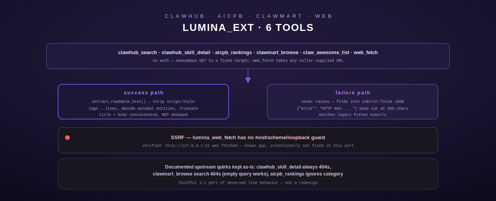

# lumina_ext — ClawHub / AICPB / ShopClawMart / web fetch

[← personal-life index](README.md) · [← tool index](../README.md) · [← docs index](../../README.md)

Six `lumina_*` tools ported mechanically from the legacy Python MCP host's server
(`src/lumina_ext/mod.rs`). `lumina_weather` was already ported separately as the standalone
[weather](weather.md) tool; this module carries the six that were not. Per the operator's
explicit direction these are **faithful 1:1 ports of observed live behavior**, verified via
direct `tools/call` probes against the legacy host — not a redesign, and not a cleanup. Several
of the ported endpoints are themselves broken or quirky on the live upstream sites; the port
reproduces that, it does not fix it (`src/lumina_ext/mod.rs:1-58`).



## No configuration — anonymous public HTTP only

None of these six tools require API keys or auth; each target is called as an anonymous
public HTTP client. The only non-default header sent anywhere in this module is a
`User-Agent` on the GitHub Contents API call (`lumina_claw_awesome_list`) — GitHub's API
returns 403 to requests with no `User-Agent` at all (`src/lumina_ext/mod.rs:54-58`).

## Documented upstream quirks (verified live, kept intentionally)

| Tool | Quirk |
|---|---|
| `lumina_clawhub_skill_detail` | Calls `GET clawhub.ai/api/skill/{slug}`, which 404s ("No matching routes found") for every slug tried. The working endpoint is actually `GET /api/skill?slug=...`, but that is not what the legacy host calls, so this port intentionally calls the broken path-style endpoint to match observed behavior. |
| `lumina_clawmart_browse` | A non-empty `query` calls `GET shopclawmart.com/search?q=...`, which 404s (no such route exists on the live site) — an empty query instead fetches the bare homepage, which works. |
| `lumina_aicpb_rankings` | Accepts a `category` argument but never uses it to build the request — it always fetches `https://aicpb.com/` and returns the same homepage content regardless of category. |

## Error shape — matches the Python original exactly

**None of these six tools raise on a failed fetch.** Every one catches the failure (non-2xx
HTTP status, or a transport-level error) and folds it into a normal, `isError:false` JSON
response carrying an `"error"` key — verified directly against the legacy host for
`lumina_clawhub_skill_detail`, `lumina_clawmart_browse`, and `lumina_web_fetch`. This is a
deliberate divergence from most other Terminus modules, which raise `ToolError::Http` on
failure. Non-2xx response bodies are truncated to `ERROR_BODY_MAX_LEN = 500` chars in the
error message, matching the exact truncation point observed in a live 404 from
shopclawmart.com (`src/lumina_ext/mod.rs:45-58,117-136`).

Because these tools never return `Err`, `execute()` always returns `Ok(pretty_json_string)`
— the only `ToolError` any of the six can raise is `InvalidArgument` for a missing/malformed
required field (checked before any network call), or `ToolError::Execution` if `serde_json`
itself fails to render the final response.

## SSRF note — flagged for operator review, not fixed here

`lumina_web_fetch` takes an arbitrary caller-supplied URL and fetches it with **no allowlist,
scheme restriction, or private/loopback-address check**. Verified against the live legacy-host
tool: a request for `http://127.0.0.1:22` was fetched with no rejection — the raw SSH banner
came back as the tool's `"error"` string, proving the fetch reached a loopback port with no
guard. This Rust port **intentionally matches that behavior**; no new restriction is added,
because the operator's directive for this port is a faithful 1:1 recreation with human
curation to follow. An LLM agent with access to this tool can use it to probe internal-network
addresses and ports — this is a known, unresolved gap, not a closed one
(`src/lumina_ext/mod.rs:24-35`).

## extract_readable_text — shared HTML extraction

Used by `lumina_web_fetch`, `lumina_aicpb_rankings`, and `lumina_clawmart_browse`
(`src/lumina_ext/mod.rs:143-253`). Given raw HTML:

1. Strip `<script>`/`<style>` blocks (regex, alternation on the closing tag — the `regex`
   crate has no backreference support, so a `<script>...</style>` mismatch could in principle
   match, but this never occurs in well-formed HTML).
2. Extract `<title>` text, if present.
3. Extract the `<body>` fragment (or the whole document if no `<body>` tag exists).
4. Strip all remaining tags, treating each tag boundary as a line break; decode a minimal set
   of HTML entities (`&amp; &lt; &gt; &quot; &apos; &#39; &nbsp;` plus numeric decimal/hex
   escapes) — deliberately not a full HTML5 entity table.
5. Collapse to one non-empty trimmed line per visible chunk, joined with `\n`.

**Title/body are concatenated, not deduplicated** — verified against a live
`https://example.com` fetch where the title ("Example Domain") and the body's own identical
`<h1>` both appear, one after the other. This function reproduces that exactly rather than
deduping.

## lumina_clawhub_search

Search ClawHub for agent skills (`src/lumina_ext/mod.rs:259-316`).

**Input schema**

| Field | Type | Required | Default |
|---|---|---|---|
| `query` | string | **yes** | — |
| `limit` | integer | no | `10` |

**Behavior.** `GET https://clawhub.ai/api/search?q={query}&limit={limit}`. On success, maps
each `results[]` entry to `{name: slug, display_name, summary, updated: updatedAt}` and wraps
as `{"query", "count", "skills": [...]}`. On failure, `{"error": "...", "query": "..."}`.

## lumina_clawhub_skill_detail

Fetch a ClawHub skill's detail by slug (`src/lumina_ext/mod.rs:322-362`). **404s for every
slug on the live site today** — see the quirks table above.

**Input schema**

| Field | Type | Required |
|---|---|---|
| `slug` | string | **yes** |

`GET https://clawhub.ai/api/skill/{slug}`. On a parseable JSON success body, returns it
verbatim; on a non-JSON success body, wraps as `{"content": body, "slug": slug}`; on failure,
`{"error": "...", "slug": slug}`.

## lumina_aicpb_rankings

Fetch Claw agent rankings from AICPB (`src/lumina_ext/mod.rs:368-408`).

**Input schema**

| Field | Type | Required | Default |
|---|---|---|---|
| `category` | string | no | `"all"` |

**Behavior.** Always fetches `https://aicpb.com/` regardless of `category` — the argument is
accepted and echoed back in the output (`{"source": "aicpb.com", "category": ..., "content":
...}`) but never used to build the request (see quirks table). Response HTML is run through
`extract_readable_text`, then truncated to `READABLE_TEXT_MAX_LEN = 3000` chars — a hardcoded
server-side limit with no `max_length` argument exposed for this tool, verified by measuring
the exact returned content length from the legacy host (3000 chars regardless of category).

## lumina_clawmart_browse

Browse ShopClawMart listings (`src/lumina_ext/mod.rs:414-462`).

**Input schema**

| Field | Type | Required | Default |
|---|---|---|---|
| `query` | string | no | `""` |

**Behavior.** Empty `query` → `GET https://shopclawmart.com/` (bare homepage, works). Non-empty
`query` → `GET https://shopclawmart.com/search?q={query}` (404s on the live site today — kept
as-is to match). Success wraps as `{"source": "shopclawmart.com", "query", "content"}`
(content extracted + truncated at 3000 chars, same as `lumina_aicpb_rankings`); the failure
path deliberately **omits the `query` key entirely** — verified against the live 404 error
response shape, which also omits it.

## lumina_claw_awesome_list

Fetch the curated `awesome-openclaw-skills` README from GitHub
(`src/lumina_ext/mod.rs:468-518`). No arguments.

**Behavior.** `GET
https://api.github.com/repos/VoltAgent/awesome-openclaw-skills/contents/README.md` with
`User-Agent: terminus-rs-lumina-ext` and `Accept: application/vnd.github+json`. The response's
`content` field (base64, GitHub's Contents API format) is decoded via a minimal inline
standard-alphabet base64 decoder written specifically for this tool — no external base64 crate
dependency (`base64_decode`, `src/lumina_ext/mod.rs:524-556`) — then truncated to
`AWESOME_LIST_MAX_LEN = 5000` chars (also verified as an exact hardcoded limit on the live
host). Success: `{"source": "github.com/VoltAgent/awesome-openclaw-skills", "content", "sha"}`.
Failure paths distinguish three cases: base64 decode failure, unparseable GitHub JSON, and a
plain HTTP/transport error — each producing a slightly different `{"error", "source"}` shape.

## lumina_web_fetch

Fetch an arbitrary URL, raw or as extracted readable text
(`src/lumina_ext/mod.rs:562-616`). See the SSRF note above before exposing this to an
untrusted caller.

**Input schema**

| Field | Type | Required | Default |
|---|---|---|---|
| `url` | string | **yes** | — |
| `extract_text` | boolean | no | `true` |
| `max_length` | integer | no | `3000` (`WEB_FETCH_DEFAULT_MAX_LEN`) |

**Behavior.** `GET {url}` verbatim, no scheme/host restriction. On success: if
`extract_text=true`, runs `extract_readable_text` and reports `"type": "text"`; if `false`,
returns the raw fetched body with `"type": "raw"`. Either way the content is truncated to
`max_length` chars (char-safe, never splits a UTF-8 boundary) and the response includes a
`"truncated"` boolean. On failure: `{"url", "error"}` — note this failure shape has **no**
`"type"` key at all, distinguishing it from a success response at a glance.

**Example**

```json
// request
{"url": "https://example.com", "extract_text": true, "max_length": 100}
// response (tool output, JSON string)
{"url": "https://example.com", "type": "text", "content": "Example Domain\nExample Domain\nThis domain is for use...", "truncated": true}
```

## Registration

`register()` (`src/lumina_ext/mod.rs:623-630`) always registers all 6 tools unconditionally —
no env-gated configuration exists in this module at all.
