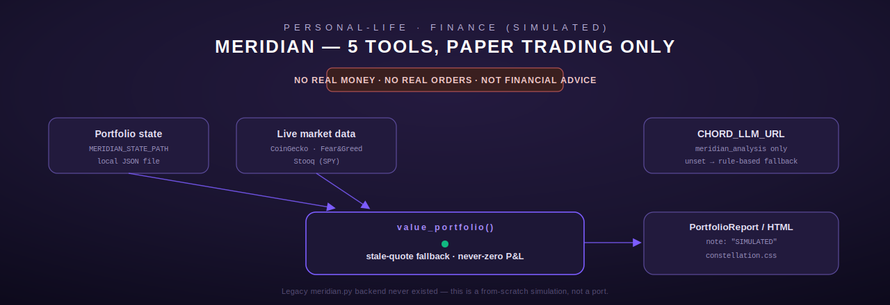

# meridian — SIMULATED paper-trading sandbox

[← personal-life index](README.md) · [← tools index](../README.md)

**Meridian is a paper-trading SIMULATION only. No real exchange orders are ever placed, no real
money is ever involved, and no output from any of these 5 tools is financial advice.** This is
not a caveat added for legal cover — it's a structural property of the code: there is no
`REAL_TRADING` toggle anywhere in `src/meridian/tools.rs` because "there is nothing here that
could execute a real trade" (the module's own safety-boundary comment,
`src/meridian/tools.rs:13-15`). Every tool's `description()` string and every response body
repeats "SIMULATED" for the same reason — it should be structurally impossible for a caller to
mistake this for real trading.



## Why this module exists as a rewrite, not a port

The module doc comment (`src/meridian/tools.rs:1-16`) documents that the original Python
`meridian_tools.py` SSH'd to the fleet host and shelled out to a `meridian.py` backend there —
and that backend **does not exist**. Verified live against the running fleet-host MCP server
(every call returned an SSH/shell error) and by a filesystem search of the fleet-host container
(no `meridian.py` or `market_data.py` anywhere). This module is therefore a from-scratch
re-implementation honoring the 5 tools' documented contracts (descriptions copied near-verbatim
from the Python originals' docstrings), using this repo's typed-HTTP-client conventions instead
of shelling out over SSH — a deliberate architectural choice, not an accident of porting.

## State and configuration

Portfolio state is a local JSON file, not a database — configured via `config::meridian_*`
helpers (`src/config.rs:382-426`), all with safe non-secret defaults so the module works
out-of-the-box in a fresh checkout:

| Env var | Purpose | Default if unset |
| --- | --- | --- |
| `MERIDIAN_STATE_PATH` | Path to the portfolio state JSON | `meridian_portfolio.json` (relative) |
| `MERIDIAN_REPORT_PATH` | Path the HTML dashboard is written to | `meridian_report.html` (relative) |
| `MERIDIAN_REPORT_URL` | Public URL of the generated report | `None` — omitted from output entirely if unset (no fabricated URL) |
| `MERIDIAN_COINGECKO_URL` | Override for the CoinGecko crypto-price API (test/prod hook) | Real public CoinGecko API |
| `MERIDIAN_FEARGREED_URL` | Override for the Fear & Greed index source | Real public source |
| `MERIDIAN_STOOQ_URL` | Override for the SPY stock-quote source | `https://stooq.com` |
| `CHORD_LLM_URL` | Chord's `/v1/chat/completions` endpoint, used by `meridian_analysis` for AI synthesis | If unset, falls back to a rule-based recommendation — never errors |
| `MERIDIAN_LLM_MODEL` | Model name for the analysis LLM call | `gpt-oss:20b` |

`MIN_BALANCE`/`MAX_BALANCE` (imported from `super::state`) bound the allowed starting balance for
`meridian_reset`; the module doesn't hardcode these values in `tools.rs` itself.

## Shared: portfolio valuation

Every read-path tool (`meridian_portfolio`, `meridian_report`) runs the loaded `Portfolio`
through `value_portfolio` (`src/meridian/tools.rs:72-132`), which fetches **live** prices for
every symbol currently held and produces a `PortfolioReport`. Two correctness details worth
calling out explicitly, because they were deliberately engineered to avoid a specific bug class:

- **Stale-quote handling**: if a live price fetch fails for a symbol (network hiccup, unsupported
  coin), that position is valued at its recorded `avg_price` instead of erroring the whole
  report — `price_is_live: false` marks this in the output so a caller can tell "flat position"
  apart from "no live quote available" (`src/meridian/tools.rs:41-49`).
- **P&L never fakes a zero**: `unrealized_pnl` is `None` (not `Some(0.0)`) whenever there's no
  live quote, specifically because `Some(0.0)` would be indistinguishable from a genuinely flat
  position (`src/meridian/tools.rs:96` and the field doc comment).

`PortfolioReport` always carries `note: "SIMULATED — not financial advice"` as a struct field —
not something a caller can accidentally omit by parsing selectively.

## Tools

### `meridian_portfolio`

| Field | Type | Required | Default |
| --- | --- | --- | --- |
| `portfolio_id` | string | no | `"default"` |

Only a single `"default"` portfolio exists — this tool does **not** silently ignore a different
requested ID; if `portfolio_id != "default"`, the response gets an extra `_note_portfolio_id`
field explaining the requested ID was ignored (`src/meridian/tools.rs:173-177`), so the caller
can see the mismatch instead of assuming they got what they asked for.

- **Output** (`PortfolioReport`, JSON): `portfolio_id`, `cash`, `starting_balance`, `positions[]`
  (`symbol`, `quantity`, `avg_price`, `current_price`, `price_is_live`, `market_value`,
  `unrealized_pnl`), `positions_value`, `total_value`, `total_pnl`, `total_pnl_pct`,
  `trade_count`, `updated_at`, `note`.

### `meridian_market_data`

| Field | Type | Required | Default |
| --- | --- | --- | --- |
| `symbols` | string | no | `"BTC,ETH,SOL"` — comma-separated, case-insensitive, supports `BTC, ETH, SOL, BNB, AVAX` |

Rejects an all-empty/whitespace symbol list as `InvalidArgument` (`src/meridian/tools.rs:222-226`).
Fetches crypto prices (CoinGecko), the Fear & Greed index, and an SPY quote **concurrently in
sequence** (three separate calls, none blocking the others' failure — `fear_greed` and `spy`
both degrade to defaults/`None` on failure rather than erroring the whole tool,
`src/meridian/tools.rs:229-230`).

- **Output**: `symbols_requested`, `unsupported_symbols` (any input symbol CoinGecko doesn't
  recognize), `crypto` (per-symbol quote map), `fear_greed_index`, `fear_greed_classification`,
  `spy_quote`, and a `_note` reiterating "SIMULATED context".

### `meridian_analysis`

No required arguments (`portfolio_id` accepted but unused — the tool always analyzes the fixed
`DEFAULT_SYMBOLS` list `["BTC", "ETH", "SOL"]`, not the caller's actual holdings).

**Two-tier recommendation**: `synthesize_via_llm` (`src/meridian/tools.rs:284-337`) attempts an
LLM call to `{CHORD_LLM_URL}/v1/chat/completions` with a system prompt that explicitly forbids
claiming real financial advice. If `CHORD_LLM_URL` is unset, or the call/parse fails,
`meridian_analysis` falls back to `rule_based_recommendation` (`src/meridian/tools.rs:255-278`) —
a pure function keyed on the Fear & Greed value:

| Fear & Greed value | Recommendation text theme |
| --- | --- |
| `<= 25` ("Extreme Fear") | Contrarian signal — consider small, staged accumulation |
| `>= 75` ("Extreme Greed") | Consider trimming into strength or holding |
| 26–74 (neutral) | No strong contrarian signal, hold and reassess |
| unavailable | No rule-based signal to report |

The tool **never hard-fails** just because LLM synthesis is unavailable — this is the explicit
design intent stated in the code comment above `rule_based_recommendation`.

- **Output**: `market_snapshot` (crypto + fear/greed + SPY), `recommendation`,
  `recommendation_source` (one of `"llm"`, `"rule-based (no CHORD_LLM_URL configured)"`,
  `"rule-based (LLM call failed)"` — so a caller can always tell which path produced the text),
  and `_note`.

### `meridian_report`

No arguments. Regenerates a static HTML dashboard and writes it to `MERIDIAN_REPORT_PATH`.

The HTML (`render_report_html`, `src/meridian/tools.rs:403-490`) links a shared
`constellation.css` stylesheet rather than inlining styles (per the Lumina design-system
convention), and every user-controllable string field (`portfolio_id`, `updated_at`, position
symbols) is passed through `html_escape` (`src/meridian/tools.rs:492-497`, a manual `&`/`<`/`>`/`"`
escaper) before being spliced into the HTML — the module's own tests cover this
(`html_escape_escapes_special_chars`). The page includes a prominent
`SIMULATED ONLY — no real money involved, not financial advice` banner and a P&L badge that
switches CSS class (`badge-success`/`badge-danger`) based on sign.

- **Output**: `{"status": "generated", "path": <written path>, "url": <MERIDIAN_REPORT_URL or omitted>, "_note": "SIMULATED — not financial advice"}`.
- **Errors**: `ToolError::Execution` if the file write fails (e.g. bad path/permissions).

### `meridian_reset`

| Field | Type | Required | Default | Validation |
| --- | --- | --- | --- | --- |
| `balance` | number | no | `state::DEFAULT_STARTING_BALANCE` ($10,000 per the description string) | Must be finite and within `[MIN_BALANCE, MAX_BALANCE]` |

Clears all positions and trade history, starting fresh at the given balance. Two distinct failure
shapes worth noting (`src/meridian/tools.rs:571-589`):

- **Present-but-wrong-type `balance`** (e.g. a string) is rejected as `ToolError::InvalidArgument`
  — it does **not** silently fall back to the default, which would mask genuinely bad caller
  input as a successful reset.
- **Present-and-numeric but out-of-range `balance`** (e.g. `$50` or `$5,000,000`) is **not** a
  hard tool error — it returns a normal `Ok` response with `{"status": "rejected", "reason": "Balance must be between $100 and $1000000"}`, letting the caller see the rejection reason
  programmatically rather than catching an exception.

- **Worked example**:
  ```json
  // request
  {"balance": 20000.0}
  // response
  {"status": "reset", "starting_balance": 20000.0, "portfolio_id": "default", "_note": "SIMULATED — portfolio reset complete"}
  ```

## Registration

`register()` (`src/meridian/tools.rs:608-619`) registers all 5 tools via `register_or_replace`.

## Errors summary

| `ToolError` variant | When |
| --- | --- |
| `InvalidArgument` | Empty `symbols` list; non-numeric `balance` |
| `Execution` | `serde_json` serialization failure; HTML file write failure; LLM request/response-parse failure (caught internally by `meridian_analysis`, never surfaced to the caller — see two-tier fallback above) |

Note: unlike `ledger`/`vitals`, `meridian` has no `NotConfigured` path for its core tools — the
state file and market-data sources all have working defaults. Only the LLM synthesis half of
`meridian_analysis` treats missing configuration as a soft fallback rather than a hard error.
