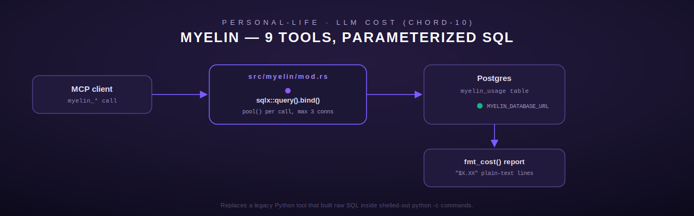

# myelin — LLM cost tracking

[← personal-life index](README.md) · [← tools index](../README.md)

`myelin` is a 9-tool module (`src/myelin/mod.rs`) that reports on AI/LLM inference cost —
today's spend, weekly/monthly rollups, runaway-request detection, burn-rate projection, and
per-model/per-user breakdowns — read straight out of a Postgres `myelin_usage` table via `sqlx`.
Unlike the other five modules on this page, `myelin` is a **database-backed** module, not an
HTTP-REST-backed one; it's the CHORD-10 rewrite explicitly called out to replace a legacy Python
implementation that built raw SQL strings inside `python -c` shell commands executed over SSH —
the module doc comment (`src/myelin/mod.rs:1-5`) grades that legacy approach "Grade D — worst
SQL-via-shell offender" and this module exists specifically to close that hole with parameterized
`sqlx` queries.



## Configuration

| Env var | Purpose |
| --- | --- |
| `MYELIN_DATABASE_URL` | Postgres connection string |

`pool()` (`src/myelin/mod.rs:44-55`) is called fresh on every tool invocation — there is no
long-lived pool cached across calls. It's built with `PgPoolOptions::new().max_connections(3)`.
If `MYELIN_DATABASE_URL` is unset, every one of the 9 tools returns `ToolError::NotConfigured`
before any query runs; if the URL is set but the connection itself fails, that surfaces as
`ToolError::Database`.

## Shared helper

**`fmt_cost(dollars: f64) -> String`** (`src/myelin/mod.rs:38-40`, `pub`) — formats any dollar
amount as `"$X.XX"` (always exactly 2 decimal places, standard rounding). This is the single
formatting function reused by every tool below; it is also the one function in this module
covered by direct unit tests independent of the database (`test_fmt_cost_*`,
`src/myelin/mod.rs:608-626, 830-840`).

All queries against `myelin_usage` use `COALESCE(SUM(cost), 0.0)` so an empty result set produces
`0.0` rather than `NULL`/no rows — every tool below explicitly checks for that zero/empty case
and returns a human-readable "no data" message instead of a bare `$0.00`, rather than treating
"no data" and "genuinely zero spend" as visually identical.

## Tools

### `myelin_status`

No arguments. Query: `SELECT COUNT(*) AS cnt, MAX(recorded_at) AS latest FROM myelin_usage`.

- If `count == 0`: returns `"No usage data recorded"`.
- Otherwise: `"Myelin status: {count} usage records. Latest sync: {ts}"`, where `ts` is
  `%Y-%m-%d %H:%M:%S UTC` formatted, or `"unknown"` if `latest` failed to parse.

### `myelin_today`

No arguments. Query sums `cost` where `(recorded_at AT TIME ZONE 'UTC')::date = CURRENT_DATE` —
i.e. **today in UTC**, not the caller's local timezone. Returns `"No usage data recorded today"`
if total is exactly `0.0`, else `"Today's spend: {fmt_cost(total)}"`.

### `myelin_weekly`

No arguments. Query groups by `recorded_at::date` for `recorded_at >= NOW() - INTERVAL '7 days'`,
ordered `day DESC` (most recent day first). Output is a multi-line report, one line per day:
```
Weekly spend (last 7 days):
  2026-06-07: $12.34
  2026-06-06: $8.90
  ...
```
Returns `"No usage data recorded in the last 7 days"` if the row set is empty (note: this checks
row **count**, not a summed total — a day with genuinely $0.00 spend but at least one usage row
would still appear in the list, distinct from `myelin_today`'s zero-total check).

### `myelin_monthly`

No arguments. Sums `cost` for `recorded_at >= NOW() - INTERVAL '30 days'`. Returns `"No usage
data recorded in the last 30 days"` on a zero total, else `"30-day spend: {fmt_cost(total)}"`.

### `myelin_runaway_check`

| Field | Type | Required | Notes |
| --- | --- | --- | --- |
| `threshold` | number | yes | Dollar amount; rejected as `InvalidArgument` if negative |

Finds individual requests whose `cost` exceeded `threshold` within the **last hour**
(`recorded_at >= NOW() - INTERVAL '1 hour'`), ordered `cost DESC`. The threshold is bound as a
parameterized query argument (`$1`, `.bind(threshold)`, `src/myelin/mod.rs:299`) — the module
comment explicitly notes this is parameterized, not interpolated, which is the whole point of the
CHORD-10 rewrite this module represents.

- **Output**: a multi-line report — one line per flagged request (`model | user=... | cost | HH:MM:SS`)
  followed by a `"Total: {n} requests"` line. Returns `"No runaway requests found (threshold:
  {fmt_cost(threshold)})"` if none exceed the threshold.
- **Worked example**:
  ```json
  // request
  {"threshold": 0.05}
  // response
  "Runaway requests > $0.05 in the last hour:\n  gpt-oss:120b | user=alice | $0.12 | 14:32:07\nTotal: 1 requests"
  ```

### `myelin_burn_plan`

| Field | Type | Required | Notes |
| --- | --- | --- | --- |
| `budget` | number | yes | Total remaining budget in dollars; rejected as `InvalidArgument` if negative |

Computes an **average daily spend** over the last 7 days as
`SUM(cost) / NULLIF(COUNT(DISTINCT recorded_at::date), 0)` — note the `NULLIF` guards against
division by zero when there's no usage data at all (which `sqlx`/Postgres resolves to `NULL`,
read back as `0.0` via `.unwrap_or(0.0)`). If `avg_daily <= 0.0`, returns `"No usage data
recorded — cannot project burn rate"` rather than a nonsensical or infinite days-remaining
figure. Otherwise: `"Burn plan: avg daily spend {avg} → budget {budget} lasts {days:.1} days"`.

### `myelin_by_model`

No arguments. Query: `SELECT model, SUM(cost) ... GROUP BY model ORDER BY total DESC`. Output:
one line per model, `"  {model}: {fmt_cost(total)}"`, sorted highest-spend first. `"No usage data
recorded"` if empty.

### `myelin_by_user`

Identical shape to `myelin_by_model` but grouped by `user_id` instead of `model`.

### `myelin_cap_check`

| Field | Type | Required | Notes |
| --- | --- | --- | --- |
| `daily_limit` | number | yes | Rejected as `InvalidArgument` if `<= 0.0` (strictly positive — the only tool in this module requiring a positive rather than merely non-negative numeric arg, since a `$0` cap is meaningless) |

Computes today's spend (same UTC-day query as `myelin_today`) and its percentage of
`daily_limit`. Three status bands (`src/myelin/mod.rs:557-563`):

| `pct` | `status` |
| --- | --- |
| `>= 100.0` | `EXCEEDED` |
| `80.0 <= pct < 100.0` | `WARNING` |
| `< 80.0` | `OK` |

Output: `"Cap check [{status}]: spent {today} of {limit} ({pct:.1}% of daily limit)"`.

## Registration

`register()` / `tools()` (`src/myelin/mod.rs:577-596`) register all 9 tools; `tools()` is exposed
as its own `pub` function (not just folded into `register`) specifically so the test suite can
iterate all 9 tool instances directly for metadata checks (uniqueness of names, non-empty
descriptions, `type: object` parameter schemas) without going through a `ToolRegistry`.

## Errors summary

| `ToolError` variant | When |
| --- | --- |
| `NotConfigured` | `MYELIN_DATABASE_URL` unset |
| `InvalidArgument` | Missing/non-numeric `threshold`/`budget`/`daily_limit`, or a negative `threshold`/`budget`, or a non-positive `daily_limit` |
| `Database` | Connection failure, or any query failure |
