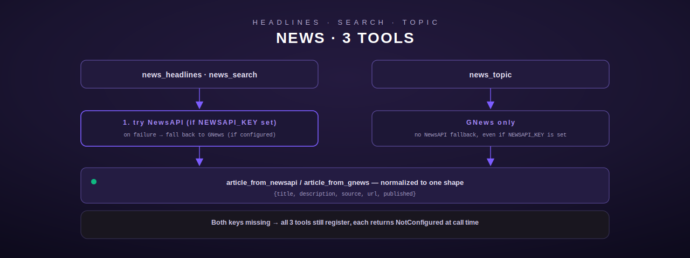

# News — headlines, search, and topic feeds

[← personal-life index](README.md) · [← tool index](../README.md) · [← docs index](../../README.md)

Three tools backed by two independent news APIs — NewsAPI as primary, GNews as fallback (or
sole source) — mirroring the Python `news_tools.py` exactly. Defined in
[`src/news/mod.rs`](../../../src/news/mod.rs).



## Configuration

| Env var | Required | Notes |
|---|---|---|
| `NEWSAPI_KEY` | one of the two, for `news_headlines`/`news_search` | newsapi.org, 100 req/day free tier |
| `GNEWS_API_KEY` | one of the two, for `news_headlines`/`news_search`; **required** for `news_topic` | gnews.io, 100 req/day free tier |

If only one key is set, that API is used exclusively for `news_headlines`/`news_search` (no
fallback attempted since there's nothing to fall back to). If both are missing, `register()`
still installs all three tools (not stubs — the real structs, each holding an empty
`NewsConfig`), each of which independently checks `has_any_key()` at call time and returns
`NotConfigured` (`src/news/mod.rs:463-474`, `src/news/mod.rs:37-39`).

## Fallback strategy — `news_headlines` and `news_search`

Both tools follow the same precedence (`src/news/mod.rs:315-422`):

1. If `NEWSAPI_KEY` is set, call NewsAPI first.
   - On success, return immediately.
   - On failure, if `GNEWS_API_KEY` is *also* set, retry against GNews; if that also fails,
     return an aggregated `Http` error citing both failures ("Both APIs failed — NewsAPI:
     {...}; GNews: {...}"). If GNews isn't configured, propagate the original NewsAPI error.
2. Else if only `GNEWS_API_KEY` is set, call GNews directly (no retry target).
3. Else (checked again per-call as a defensive fallback) `NotConfigured`.

A NewsAPI "failure" includes both a non-2xx HTTP status and a 2xx response whose body
`status` field is not `"ok"` (NewsAPI returns its own in-body error status alongside HTTP 200
in some cases — `src/news/mod.rs:100-104,144-148`).

## news_headlines

Top headlines, filterable (`src/news/mod.rs:293-356`).

**Input schema**

| Field | Type | Required | Default |
|---|---|---|---|
| `query` | string, keyword filter | no | `""` |
| `category` | string: `business`\|`entertainment`\|`general`\|`health`\|`science`\|`sports`\|`technology` | no | `""` (no filter) |
| `country` | string, 2-letter code | no | `us` |
| `limit` | integer | no | `10`, capped at `100` |

**Behavior.** NewsAPI request: `GET /v2/top-headlines?apiKey=&pageSize=&country=` plus `q=`
and `category=` only when non-empty. GNews request: `GET /v4/top-headlines?apikey=&max=&lang=en&country=`
plus `q=`/`topic=` (GNews's category param is named `topic`, not `category`).

## news_search

Keyword search across articles (`src/news/mod.rs:358-422`).

**Input schema**

| Field | Type | Required | Default |
|---|---|---|---|
| `query` | string | **yes** | — |
| `limit` | integer | no | `10`, capped at `100` |
| `sort_by` | string: `relevancy`\|`popularity`\|`publishedAt` | no | `publishedAt`; an unrecognized value silently normalizes to `publishedAt` rather than erroring |

**Behavior.** NewsAPI: `GET /v2/everything?apiKey=&q=&pageSize=&sortBy=&language=en`. GNews's
`/v4/search` has no `sortBy` equivalent — the fallback path ignores `sort_by` entirely.

**Errors:** `InvalidArgument` for a missing/empty `query`; `NotConfigured` if neither key is
set.

## news_topic

Topic-based feed, GNews only (`src/news/mod.rs:424-459`).

**Input schema**

| Field | Type | Required | Default |
|---|---|---|---|
| `topic` | string: `world`\|`nation`\|`business`\|`technology`\|`entertainment`\|`sports`\|`science`\|`health` | **yes** | — |
| `limit` | integer | no | `10`, capped at `100` |

**Behavior.** There is no NewsAPI fallback for this tool at all — `GNEWS_API_KEY` absent
returns `NotConfigured` immediately, even if `NEWSAPI_KEY` is set (`src/news/mod.rs:445-447`).
Calls `GET /v4/top-headlines?apikey=&topic=&max=&lang=en` (GNews's topic endpoint reuses the
top-headlines path with a `topic` param, distinct from `news_headlines`'s own `category`
filter which passes through the same GNews param name for a different purpose).

**Errors:** `InvalidArgument` for a missing/empty `topic`; `NotConfigured` if `GNEWS_API_KEY`
is unset.

## Response shape (all three tools)

Every article is normalized to the same shape by `article_from_newsapi` /
`article_from_gnews` (`src/news/mod.rs:52-70`) — identical field sets from both providers:

```json
{"title": "...", "description": "...", "source": "BBC", "url": "https://...", "published": "2026-06-08T07:00:00Z"}
```

The wrapping envelope differs slightly per tool: `news_headlines`/`news_search` include
`{"source": "newsapi"|"gnews", "total", "count", "articles": [...]}` (`news_search` also
echoes `"query"`); `news_topic` includes `{"source": "gnews", "topic", "total", "count",
"articles": [...]}`. `total` is read from `totalResults` (NewsAPI) or `totalArticles`
(GNews); `count` is always `articles.len()` after mapping (may differ from `total` when the
upstream page is smaller than the reported total).

## Registration

`register()` (`src/news/mod.rs:463-474`) always registers all three tools with one shared
`NewsConfig::from_env()` clone — there is no stub-substitution path in this module; every
NotConfigured/missing-key case is surfaced from inside `execute()` instead.
