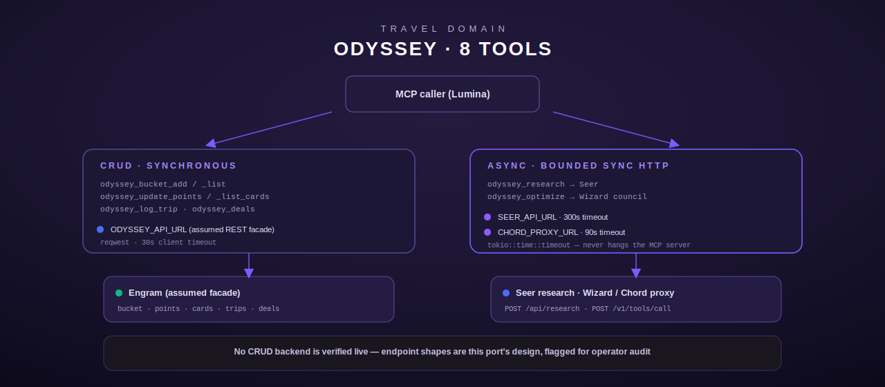

# Odyssey — trip planning, loyalty cards, travel research

[← personal-life index](README.md) · [← tool index](../README.md) · [← docs index](../../README.md)

Odyssey is the travel-planning domain: a bucket list, a loyalty/credit-card points portfolio,
a trip log, stored deals, and two AI-backed research/optimization tools. It is a straight port
of the source host's `odyssey_tools.py`, defined entirely in
[`src/odyssey/mod.rs`](../../../src/odyssey/mod.rs).

The module carries two clearly separated families of tools (`src/odyssey/mod.rs:1-11`):

- **CRUD** (`odyssey_bucket_add`, `odyssey_bucket_list`, `odyssey_update_points`,
  `odyssey_list_cards`, `odyssey_log_trip`, `odyssey_deals`) — fast, synchronous round trips
  against an assumed Engram-backed REST facade at `ODYSSEY_API_URL`.
- **Async/long-running** (`odyssey_research`, `odyssey_optimize`) — tools that delegate to
  other backend services (Seer for research, the Wizard council via the Chord proxy for
  optimization) and can take up to several minutes.

## Backend assumption — flagged for human audit

The live source-host implementation does **not** talk to Engram over HTTP. It SSHes to a
fleet host and runs that host's `odyssey/odyssey.py <subcommand>`, which imports `engram.py`
or opens `engram.db` (SQLite) directly — there is no HTTP wire protocol to observe or
replicate (`src/odyssey/mod.rs:13-25`). Per this crate's `RustTool` contract, tools must use
typed HTTP clients or parameterized SQL, never shell/subprocess, and no Engram HTTP client
exists anywhere else in the repo. Rather than invent an unverifiable wire format, this port
follows the pattern already established for other Engram-backed modules (see `src/vitals/mod.rs`)
and assumes a REST facade at `ODYSSEY_API_URL` with the endpoints below
(`src/odyssey/mod.rs:40-46`). **These endpoint paths and payload shapes are the porting
agent's design, not verified against any live service** — an operator should confirm or
replace them before this is wired to production:

| Method | Path | Purpose |
|---|---|---|
| `POST` | `{base}/travel/bucket` | add a bucket-list destination |
| `GET` | `{base}/travel/bucket` | list bucket-list destinations (`?status=`) |
| `POST` | `{base}/travel/points` | upsert a loyalty/card balance |
| `GET` | `{base}/travel/cards` | list card portfolio |
| `POST` | `{base}/travel/trips` | log a completed trip |
| `GET` | `{base}/travel/deals` | list stored deals (`?destination_filter=`) |

The original Python `odyssey_deals` built a SQL `LIKE` clause by string-formatting
`destination_filter` directly into a query with no escaping — a SQL-injection bug. This Rust
port never constructs SQL client-side; the filter is passed as an HTTP query parameter and
parameterization is the assumed backend's responsibility (`src/odyssey/mod.rs:48-54`).

## Async tools are synchronous, bounded HTTP calls

A live probe of the source host (2026-07-06) showed `odyssey_research` and `odyssey_optimize`
are themselves **synchronous** there too — one `tools/call` blocks for the full duration and
returns `{"status": "failed"|"success", "output": ..., "error": ...}`, the source host's own
SSH-wrapper shape. This Rust port does not replicate the SSH wrapper (never shells out); instead
it reuses the existing native `crate::seer` and `crate::wizard` HTTP client patterns, wrapping
each call in `tokio::time::timeout` so a hung backend cannot hang the MCP server indefinitely
(`src/odyssey/mod.rs:56-80`).



## Configuration

| Env var | Required by | Notes |
|---|---|---|
| `ODYSSEY_API_URL` | all 6 CRUD tools | base URL of the assumed Engram REST facade; unset → `ToolError::NotConfigured` on every CRUD call |
| `SEER_API_URL` | `odyssey_research` | Seer research backend base URL; unset → `NotConfigured` |
| `CHORD_PROXY_URL` | `odyssey_optimize` | Chord proxy base URL for the Wizard council; unset → `NotConfigured` |

Shared input-validation constants (`src/odyssey/mod.rs:120-121,166-170`): `MAX_SHORT` = 200 chars,
`MAX_LONG` = 500 chars, `MAX_BENEFITS` = 20 entries, `VALID_PRIORITIES` = `urgent|high|medium|low`,
`VALID_BUCKET_STATUSES` = `dream|researched|planned|booked|completed`, `VALID_CARD_TYPES` =
`credit|airline|hotel|misc`.

## odyssey_bucket_add

Adds a destination to the travel bucket list (`src/odyssey/mod.rs:297-369`).

**Input schema**

| Field | Type | Required | Default |
|---|---|---|---|
| `destination` | string (≤200 chars) | yes | — |
| `priority` | string, enum `urgent\|high\|medium\|low` | no | `medium` |
| `season` | string (≤200 chars) | no | `""` |
| `budget` | number, non-negative finite | no | `0` |
| `notes` | string (≤500 chars) | no | `""` |

**Behavior.** `priority` is validated against the enum only when the caller supplies a
non-empty string; an absent/empty value silently defaults to `medium` — this is a JSON-schema
`default` reproduced in code, not merely documentation (`src/odyssey/mod.rs:326-341`). `budget`
goes through `parse_non_negative_f64`, which accepts `null`/absent as `0.0` and rejects
negative or non-finite values (`src/odyssey/mod.rs:151-164`). On success the tool `POST`s
`{destination, priority, season, budget, notes}` to `{base}/travel/bucket` and returns a plain
confirmation string, e.g. `"Added to bucket list: Kyoto, Japan (priority: high)"`.

**Errors:** `InvalidArgument` for missing/empty/over-length `destination`, an unrecognized
`priority`, or a negative/non-finite `budget`; `NotConfigured` if `ODYSSEY_API_URL` is unset;
`Http` on a non-2xx response or transport failure.

**Example**

```json
// request
{"destination": "Kyoto, Japan", "priority": "high", "season": "spring", "budget": 4000}
// response (tool output, plain text)
"Added to bucket list: Kyoto, Japan (priority: high)"
```

## odyssey_bucket_list

Lists the bucket list, optionally filtered by status (`src/odyssey/mod.rs:375-429`).

**Input schema**

| Field | Type | Required | Default |
|---|---|---|---|
| `status_filter` | string, enum `dream\|researched\|planned\|booked\|completed` or `""` | no | `""` (all) |

**Behavior.** A non-empty `status_filter` is validated against `VALID_BUCKET_STATUSES` and, if
valid, sent as a `?status=` query parameter on `GET {base}/travel/bucket`; an empty filter
omits the query parameter entirely and returns every destination. The response body (a JSON
array) is wrapped as `{"destinations": <array>, "count": <len>}` and pretty-printed.

**Errors:** `InvalidArgument` for an unrecognized `status_filter`; `NotConfigured` /
`Http` as above.

## odyssey_update_points

Upserts a loyalty program or credit-card balance (`src/odyssey/mod.rs:435-512`).

**Input schema**

| Field | Type | Required | Default |
|---|---|---|---|
| `program` | string (≤200 chars) | yes | — |
| `balance` | integer, non-negative | yes | — |
| `card_type` | string, enum `credit\|airline\|hotel\|misc` | no | `credit` |
| `tier` | string (≤200 chars) | no | `""` |
| `benefits` | string, comma-separated (≤500 chars total) | no | `""` |

**Behavior.** `balance` must parse as an `i64` and be non-negative (a non-integer, e.g. a
string, is rejected). `benefits` is split on commas, each trimmed entry capped at 200 chars
via `parse_benefits`, with a hard cap of 20 entries (`src/odyssey/mod.rs:172-193`) — a 21st
entry triggers `InvalidArgument`. `card_type` defaults to `credit` the same way `priority`
does in `odyssey_bucket_add`. `POST`s `{program, balance, card_type, tier, benefits}` to
`{base}/travel/points`.

**Errors:** `InvalidArgument` for missing `program`, a non-integer or negative `balance`, an
invalid `card_type`, or more than 20 `benefits` entries.

## odyssey_list_cards

Lists the full card/loyalty portfolio, no arguments (`src/odyssey/mod.rs:518-553`). `GET`s
`{base}/travel/cards`, wraps the array as `{"cards": <array>, "count": <len>}`. The upstream
service is expected to sort by balance descending (per the tool description); the Rust port
does not re-sort client-side.

## odyssey_log_trip

Logs a completed trip and (per the upstream service's expected behavior) updates the matching
bucket-list entry's status to `completed` (`src/odyssey/mod.rs:559-626`).

**Input schema**

| Field | Type | Required | Default |
|---|---|---|---|
| `destination` | string (≤200 chars) | yes | — |
| `dates` | string (≤200 chars) | yes | — |
| `highlights` | string (≤500 chars) | yes | — |
| `rating` | integer, 1–5 | no | `5` |
| `cost` | number, non-negative | no | `0` |

**Behavior.** `rating`, when supplied, must be an integer strictly between 1 and 5 inclusive
(6 or 0 is rejected); when omitted it defaults to 5. `cost` uses the same
`parse_non_negative_f64` guard as `budget` elsewhere in this module. `POST`s to
`{base}/travel/trips` and returns e.g. `"Trip logged: Tokyo, Japan (March 15-25, 2027) —
4/5 stars"`.

**Errors:** `InvalidArgument` for any missing required field, `rating` outside 1–5, or negative
`cost`.

## odyssey_deals

Searches stored travel deals, optionally filtered by destination substring
(`src/odyssey/mod.rs:632-684`). `GET`s `{base}/travel/deals`, with `?destination_filter=` added
only when the filter is non-empty. Response is wrapped as `{"deals": <array>, "count": <len>,
"filter": <filter-or-"all">}`. No client-side SQL is ever built — see the injection note above.

## odyssey_research

Delegates to Seer for destination research and returns a synthesized answer with cited
sources (`src/odyssey/mod.rs:690-805`).

**Input schema**

| Field | Type | Required | Default |
|---|---|---|---|
| `destination` | string | yes | — |
| `dates` | string | no | `""` |
| `budget` | string | no | `""` |
| `travelers` | integer | no | `1` (clamped 1–50) |

**Behavior.** `destination` is passed through `sanitize_text` — strips ASCII control
characters, truncates to 200 chars, and errors if the result is empty after cleaning
(`src/odyssey/mod.rs:212-221`); `dates` and `budget` get the same treatment at a 100-char cap,
but a sanitization failure on either of those two is silently dropped rather than propagated
(`unwrap_or_default()`), since they're optional context, not the primary argument. The tool
builds a natural-language research prompt ("Research the travel destination {destination} for
{travelers} traveler(s)... Cover: best time to visit, must-see sights, local transport,
typical costs, and any travel advisories.") and `POST`s it to `{SEER_API_URL}/api/research` as
`{"question": ..., "max_sources": 8}`, wrapped in a **300-second** (`RESEARCH_TIMEOUT_SECS`)
`tokio::time::timeout` in addition to the request's own client-side timeout — chosen because
the source host's own docstring says "takes 2–5 minutes." The response's `answer` and
`sources` (each `{title, url}`) are rendered into a numbered report.

**Errors:** `InvalidArgument` for a missing/empty (post-sanitization) `destination`;
`NotConfigured` if `SEER_API_URL` is unset; `Http` on timeout, transport failure, non-2xx
status, or unparseable response body.

**Example**

```json
// request
{"destination": "Tokyo, Japan", "dates": "March 2027", "travelers": 2}
```
```text
Research report for Tokyo, Japan:

Tokyo is best visited in spring for cherry blossoms...

Sources:
  1. Japan Travel Guide — https://example.com/tokyo
```

## odyssey_optimize

Asks the Wizard council (via the Chord proxy's `wizard_council_consult` tool) for a
card/points redemption strategy for a trip (`src/odyssey/mod.rs:811-905`).

**Input schema**

| Field | Type | Required | Default |
|---|---|---|---|
| `destination` | string | yes | — |
| `spend_estimate` | number, non-negative finite | no | `5000` |

**Behavior.** Builds a prompt asking which card to use for flights/hotels/dining and whether
to redeem points or pay cash, then `POST`s `{"name": "wizard_council_consult", "arguments":
{"question": ...}}` to `{CHORD_PROXY_URL}/v1/tools/call`, bounded by a **90-second**
(`OPTIMIZE_TIMEOUT_SECS`) timeout — the source host's docstring says "up to 60 seconds," so the
port gives modest headroom over that. A JSON `error` field in the Chord response is surfaced
as `ToolError::Execution` (distinct from a transport/HTTP failure); otherwise the `result`
string is returned verbatim, or `"(no recommendation returned)"` if absent.

**Errors:** `InvalidArgument` for missing `destination` or a negative/non-finite
`spend_estimate`; `NotConfigured` if `CHORD_PROXY_URL` is unset; `Http` on timeout/transport/
non-2xx; `Execution` when the Chord response carries an `error` field.

## Registration

All 8 tools are always registered unconditionally by `register()` (`src/odyssey/mod.rs:911-920`)
— unlike several sibling personal-life modules, there is no stub-registration fallback when
`ODYSSEY_API_URL` is unset; each CRUD tool instead fails at call time with `NotConfigured`.
